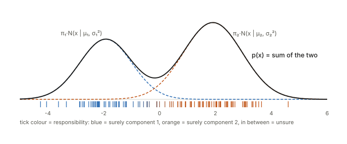
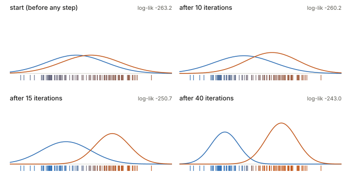
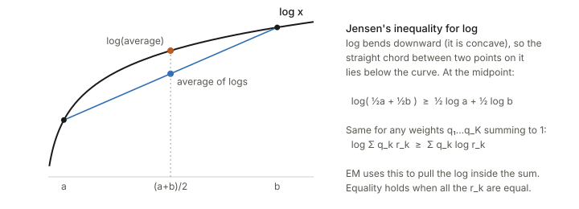
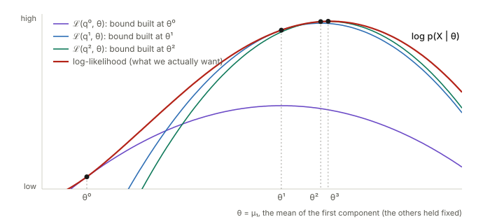
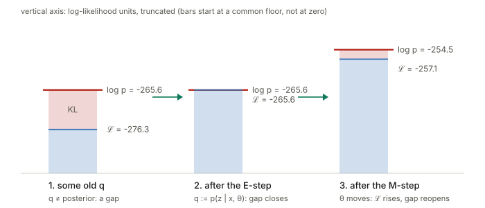

## Links

- **[Interactive version](figures/interactive.html)**: run EM yourself on 2-D clusters one
  E-step and one M-step at a time (with a k-means switch), step the lower bound of §7 up the
  log-likelihood, and drag two Gaussians around to see how responsibilities change.
- Source slides: Grosse, Farahmand & Carrasquilla, *CSC 411 Lectures 16–17:
  Expectation-Maximization*, University of Toronto. These notes follow the slides' order but
  fill in the steps they skip. The derivation in §7–§8 is Bishop, *Pattern Recognition and
  Machine Learning* (2006), §9.2–9.4, where the slides' figures come from.
- **[LDA / Fisher discriminant](../lda-fisher-discriminant/index.html)**: EM with the labels
  handed to you is exactly fitting the class-conditional Gaussians of LDA (§4). §5 here shows
  that with shared variances the resulting posterior is a logistic-regression curve.
- **[Inequalities and concentration](../inequalities-and-concentration/index.html)**: Jensen's
  inequality, which is the whole trick in §7.
- **[Gaussianity in practice](../gaussianity-in-practice/index.html)**: papers that fit
  Gaussians to CLIP features. A GMM is the natural next step when one Gaussian per class is
  too crude.
- `code/em.py` checks every numerical claim below and regenerates the figures:
  `python3 code/em.py --figures`.

## In one paragraph

You have a cloud of points that looks like it came from a few blobs, and you want to find
the blobs. That is a **chicken-and-egg** problem. If you knew which blob each point came
from, fitting each blob would be trivial: take the average and the spread of its points. If
you knew the blobs, deciding where each point came from would be trivial too: ask each blob
how likely it is to have produced the point. You know neither. **EM breaks the loop by
guessing one and alternating.** Start with rough blobs. **E-step**: for every point, compute
how much each blob is responsible for it (a soft, probabilistic assignment). **M-step**:
refit each blob to the points, weighting each point by that responsibility. Repeat. Each
round is guaranteed not to decrease the likelihood of the data, because each round
maximises a lower bound that touches the likelihood at the current guess. It converges,
though possibly to a local optimum. The same bound is the **ELBO** that trains VAEs.

## 1. The chicken-and-egg problem

A concrete version. You measure the heights of 120 people but forgot to write down who is
an adult and who is a child. The histogram has two humps. You'd like to report "children
average $\mu_1$ with spread $\sigma_1$, adults average $\mu_2$ with spread $\sigma_2$, and
a fraction $\pi_1$ of the sample are children".

- **If you had the labels**, you would split the data and compute two means, two variances
  and a proportion. Closed form, done (§4).
- **If you had the parameters**, you could look at one person of height $x$ and ask "how
  plausible is this height for a child, versus for an adult?", and get a probability that
  they are a child (§5).

The label of each point is the missing piece. It is called a **latent** (hidden) variable,
written $z$: $z^{(n)}=k$ means "point $n$ came from blob $k$". EM is the standard way to fit
models with a latent variable, and the Gaussian mixture is its standard example.

## 2. The model: a Gaussian mixture, told as a story

A **Gaussian mixture model (GMM)** with $K$ components says each data point is produced in
two steps:

1. **Pick a blob.** Roll a $K$-sided die whose faces have probabilities
   $\pi_1,\dots,\pi_K$ (non-negative, summing to 1). Call the result $z$. In symbols,
   $z\sim\mathrm{Categorical}(\pi)$, i.e. $p(z=k)=\pi_k$.
2. **Draw from that blob.** Sample $x$ from the Gaussian of blob $z$:
   $x\mid z=k\ \sim\ \mathcal N(\mu_k,\Sigma_k)$.

The $\pi_k$ are the **mixing coefficients**, $\mu_k$ the means and $\Sigma_k$ the
covariance matrices (in 1-D, just variances $\sigma_k^2$). All together they are the
parameters, written $\Theta=\{\pi_k,\mu_k,\Sigma_k\}_{k=1}^K$.

The story gives the **joint** probability of a point and its blob,
$p(x,z=k)=p(z=k)\,p(x\mid z=k)=\pi_k\,\mathcal N(x\mid\mu_k,\Sigma_k)$. But we only ever see
$x$. The probability of $x$ alone adds up every way it could have been made (the "sum rule"):

$$p(x)=\sum_{k=1}^K p(x,z=k)=\sum_{k=1}^K\pi_k\,\mathcal N(x\mid\mu_k,\Sigma_k).$$

That is a weighted sum of bell curves. In the figure below the two dashed curves are
$\pi_1\mathcal N(x\mid\mu_1,\sigma_1^2)$ and $\pi_2\mathcal N(x\mid\mu_2,\sigma_2^2)$, and
the solid curve is their sum. One Gaussian fitted to this data would put a single wide hump
over the valley in the middle, which is where there's almost no data. Two Gaussians fit it
properly.

The ticks under the axis are the data, coloured by the E-step answer of §5: blue means
"surely blob 1", orange "surely blob 2". Points in the valley are a mix. That colouring is
the thing EM keeps updating.

Why bother with mixtures? With enough components a GMM can approximate essentially any
smooth density ("universal approximator"), even with diagonal covariances. It is also a
**clustering** method with a proper probabilistic score, which lets you compare fits and
choose $K$. That's what the slides mean by a "generative view of clustering".

## 3. Why maximum likelihood is hard here

The usual recipe is to pick $\Theta$ to maximise the log-likelihood of the $N$ data points:

$$\ell(\Theta)=\ln p(X\mid\Theta)=\sum_{n=1}^N\ln\Big(\sum_{k=1}^K\pi_k\,\mathcal N(x^{(n)}\mid\mu_k,\Sigma_k)\Big).$$

Read it from the inside out: for each point, add up the $K$ ways it could have been made,
take the log, and sum over points. The problem is **the sum inside the log**. For a single
Gaussian, $\ln\mathcal N$ is a simple quadratic in $\mu$, and setting the derivative to zero
gives "$\mu$ = average". Here the log can't reach the Gaussians, so every parameter ends up
tangled with every other one, and setting derivatives to zero gives no closed form. The
slides list three further problems:

- **Singularities.** Put one component exactly on a single data point and shrink its
  variance toward 0. That one point's density goes to infinity, and so does the likelihood,
  while the other components cover the rest. `em.py` does this: with the variance at
  $10^{-4}, 10^{-16}, 10^{-64}, 10^{-256}$ the log-likelihood goes
  $-339,\,-326,\,-270,\,-49$ and keeps climbing. The gain is only $\tfrac12\ln(1/\sigma^2)$,
  so it's slow, but it's unbounded. The "maximum" likelihood is a useless spike. In practice
  EM sometimes falls into this, and you prevent it by adding a small constant to the
  diagonal of every $\Sigma_k$, or by restarting.
- **Identifiability.** Swap the labels "blob 1" and "blob 2" and nothing changes. There are
  $K!$ equally good answers, so the solution is never unique.
- **Non-convexity.** There are genuine local optima, not just the relabelled copies. Where
  you start matters.

## 4. If we knew the labels: complete data is easy

Suppose someone hands us the true $z^{(n)}$ for every point. Then we don't need the sum
over $k$ because we know which term applies, and the log-likelihood of the **complete data**
$(x,z)$ is

$$\sum_{n=1}^N\ln p(x^{(n)},z^{(n)}\mid\Theta)=\sum_{n=1}^N\Big[\ln\pi_{z^{(n)}}+\ln\mathcal N\big(x^{(n)}\mid\mu_{z^{(n)}},\Sigma_{z^{(n)}}\big)\Big].$$

The log now sits directly on each Gaussian. The problem splits into $K$ separate "fit one
Gaussian to its own points" problems, each with the familiar answer. Write
$\mathbb 1[z^{(n)}=k]$ for "1 if point $n$ is in blob $k$, else 0" and $N_k$ for the number
of points in blob $k$:

$$\mu_k=\frac{1}{N_k}\sum_{n}\mathbb 1[z^{(n)}=k]\,x^{(n)},\qquad
\Sigma_k=\frac{1}{N_k}\sum_n\mathbb 1[z^{(n)}=k]\,(x^{(n)}-\mu_k)(x^{(n)}-\mu_k)^\top,\qquad
\pi_k=\frac{N_k}{N}.$$

In words: each blob's mean is the average of its points, its covariance is the spread of
its points, and its weight is its share of the data. This is exactly how you fit the
class-conditional Gaussians in a Gaussian Bayes classifier or LDA. EM's M-step (§6) is
these same three formulas with the 0/1 indicator replaced by a probability.

## 5. E-step: responsibilities, from Bayes' rule

Now go the other way. Fix the parameters and look at one point $x$. How likely is it that
blob $k$ produced it? Bayes' rule, one line at a time:

$$\gamma_k(x)\;=\;p(z=k\mid x)\;=\;\frac{p(z=k)\,p(x\mid z=k)}{p(x)}\;=\;\frac{\pi_k\,\mathcal N(x\mid\mu_k,\Sigma_k)}{\sum_{j=1}^K\pi_j\,\mathcal N(x\mid\mu_j,\Sigma_j)}.$$

The numerator is "how common is blob $k$" times "how well does blob $k$ explain $x$". The
denominator is the same thing summed over all blobs, so the $\gamma_k$ for one point add up
to 1. $\gamma_k^{(n)}$ is called the **responsibility** of blob $k$ for point $n$: a soft
vote on where the point came from. If you've used a softmax classifier, this *is* a
softmax. The logits are $\ln\pi_k+\ln\mathcal N(x\mid\mu_k,\Sigma_k)$, which for Gaussians
is (up to constants) minus half the squared Mahalanobis distance from $x$ to $\mu_k$.

**A worked example.** Six points on a line, $x=\{1,2,3,6,7,8\}$. Start with two blobs,
$\mu_1=2$, $\mu_2=4$, both variances $1$, $\pi_1=\pi_2=\tfrac12$. The initial guess is bad:
blob 2 sits in the gap between the two groups. For $x=1$ the ratio of the two Gaussian
densities is $e^{-(1-2)^2/2}/e^{-(1-4)^2/2}=e^{4}\approx55$, so
$\gamma_1=55/56\approx0.982$. Doing this for every point:

| $x$ | 1 | 2 | 3 | 6 | 7 | 8 |
|---|---|---|---|---|---|---|
| $\gamma_1$ (blob at 2) | 0.982 | 0.881 | 0.500 | 0.002 | 0.000 | 0.000 |
| $\gamma_2$ (blob at 4) | 0.018 | 0.119 | 0.500 | 0.998 | 1.000 | 1.000 |

$x=3$ is exactly halfway between the two means, so it gets split 50/50. The right-hand
group is claimed entirely by blob 2, just because blob 2 is closer to it than blob 1 is.

**Two-blob responsibilities are a logistic curve.** With equal variances $\sigma^2$ in 1-D,
the ratio of the two numerators is $\exp(wx+b)$ with $w=(\mu_1-\mu_2)/\sigma^2$ and
$b=(\mu_2^2-\mu_1^2)/(2\sigma^2)+\ln(\pi_1/\pi_2)$, so

$$\gamma_1(x)=\frac{1}{1+e^{-(wx+b)}}.$$

That's the logistic-regression sigmoid, the same link between a Gaussian generative model
and a linear classifier as in LDA. The third widget of the interactive page plots it. Shrink
$\sigma$ and the sigmoid sharpens into a step at the midpoint: that's k-means (§9).

## 6. M-step: refit each blob with weighted points

Now treat the responsibilities as fixed and refit. Each blob gets every point, but point
$n$ counts only $\gamma_k^{(n)}$ of a point. Take §4's formulas and replace the indicator
$\mathbb 1[z^{(n)}=k]$ by $\gamma_k^{(n)}$:

$$N_k=\sum_{n=1}^N\gamma_k^{(n)},\qquad
\mu_k=\frac{1}{N_k}\sum_{n}\gamma_k^{(n)}x^{(n)},\qquad
\Sigma_k=\frac{1}{N_k}\sum_n\gamma_k^{(n)}(x^{(n)}-\mu_k)(x^{(n)}-\mu_k)^\top,\qquad
\pi_k=\frac{N_k}{N}.$$

$N_k$ is the **effective number of points** blob $k$ is responsible for. It doesn't have to
be a whole number.

**Continuing the example.** From the table, $N_1=0.982+0.881+0.5+0.002\approx2.37$ and
$N_2\approx3.63$. The new means are weighted averages:

$$\mu_1=\frac{0.982\cdot1+0.881\cdot2+0.5\cdot3+0.002\cdot6}{2.37}\approx1.80,\qquad
\mu_2\approx6.26,$$

with $\sigma_1^2\approx0.61$, $\sigma_2^2\approx3.20$, $\pi=(0.39,0.61)$. Blob 2 jumped
from the gap to the right-hand group. It is still wide ($\sigma_2^2=3.2$) because it's
still half-responsible for $x=3$. The log-likelihood went from $-24.3$ to $-12.7$ in one
round. After 50 rounds EM settles at the answer you'd pick by eye: $\mu=(2,7)$,
$\sigma^2=(0.67,0.67)$, $\pi=(\tfrac12,\tfrac12)$.

**The full algorithm** (slide 24):

1. Initialise $\mu_k,\Sigma_k,\pi_k$ (random data points as means, or the output of
   k-means).
2. **E-step**: compute $\gamma_k^{(n)}$ for every point and blob with the current
   parameters.
3. **M-step**: recompute $N_k,\mu_k,\Sigma_k,\pi_k$ from those $\gamma$'s.
4. Compute $\ell(\Theta)$. Stop if it (or the parameters) barely changed, else go to 2.

Here it is on the 120-point data set of §2, starting with two wide, overlapping blobs:

Two things to notice. First, the log-likelihood only ever goes up (−263.2, −260.2, −250.7,
−243.0), which §7 explains. Second, for the first ten or so iterations **almost nothing
happens**. The two blobs start nearly symmetric, and a symmetric start is close to a
saddle point, where both blobs explain everything equally and neither has a reason to move.
EM crawls off such plateaus slowly and then converges quickly. You'll see the same stall in
the interactive page if you start the blobs on top of each other. It's why k-means
initialisation helps.

## 7. Why it works: a lower bound that touches

The recipe above was motivated by intuition. This section shows it's actually maximising
the likelihood. The whole argument uses one inequality.

**Jensen's inequality for log.** $\ln$ bends downward (it's concave). So if you average some
numbers and then take the log, you get at least as much as if you take the logs first and
then average:

With weights $q_1,\dots,q_K\ge0$ summing to 1 and any positive numbers $r_1,\dots,r_K$:

$$\ln\Big(\sum_k q_k\,r_k\Big)\ \ge\ \sum_k q_k\ln r_k,$$

with **equality exactly when all the $r_k$ are equal** (then the "average" is that common
value, and the log of it is the same whichever order you do things).

**The trick.** Our difficulty was the log of a sum, $\ln\sum_k p(x,z=k)$. Take any
distribution $q(k)$ over the blobs, for one data point. Multiply and divide by it (this
changes nothing):

$$\ln p(x\mid\Theta)=\ln\sum_k p(x,z=k\mid\Theta)=\ln\sum_k q(k)\,\frac{p(x,z=k\mid\Theta)}{q(k)}.$$

The right-hand side is now "log of an average of the numbers $r_k=p(x,z=k)/q(k)$, weighted
by $q$". Jensen lets us swap the log and the average:

$$\ln p(x\mid\Theta)\ \ge\ \sum_k q(k)\,\ln\frac{p(x,z=k\mid\Theta)}{q(k)}\ =:\ \mathcal L(q,\Theta).$$

Sum over data points (one $q$ per point) and you get a **lower bound** $\mathcal L$ on the
log-likelihood. The log now sits on $p(x,z)$ directly, just as in the easy complete-data
case of §4.

**Which $q$ makes the bound tight?** Equality needs all the $r_k$ to be equal. Choose $q$ to
be the posterior at the current parameters, $q(k)=p(z=k\mid x,\Theta^{\text{old}})$. Then

$$r_k=\frac{p(x,z=k\mid\Theta^{\text{old}})}{p(z=k\mid x,\Theta^{\text{old}})}=p(x\mid\Theta^{\text{old}})\quad\text{for every }k,$$

which is the same number for every $k$ (it's just Bayes' rule rearranged). So the bound
touches the log-likelihood exactly at $\Theta^{\text{old}}$. That posterior is the
responsibility $\gamma_k$ from §5. **The E-step is choosing the $q$ that makes the bound
tight.**

**The M-step then maximises the bound** over $\Theta$ with $q$ held fixed. Chaining the
three facts:

$$\ell(\Theta^{\text{old}})\ \overset{\text{tight}}{=}\ \mathcal L(q,\Theta^{\text{old}})\ \overset{\text{M-step}}{\le}\ \mathcal L(q,\Theta^{\text{new}})\ \overset{\text{Jensen}}{\le}\ \ell(\Theta^{\text{new}}).$$

So the log-likelihood can't go down. This is the picture on slide 19, drawn here with real
curves from the 120-point data (only $\mu_1$ is varied so it fits on a 2-D plot):

Each coloured curve is the bound built at one iterate. It lies below the red curve
everywhere and touches it at that iterate. The next iterate is the top of that bound, which
lands higher on the red curve. Repeat. The steps get smaller near the top, which is why EM
converges quickly at first and slowly at the end. (The general name for this pattern,
"build a touching lower bound, maximise it, repeat", is **minorise–maximise** or MM.)

Why is the bound easier to maximise than $\ell$ itself? Expand it:

$$\mathcal L(q,\Theta)=\underbrace{\sum_n\sum_k\gamma_k^{(n)}\ln p(x^{(n)},z^{(n)}=k\mid\Theta)}_{Q(\Theta,\,\Theta^{\text{old}})}\ \underbrace{-\ \sum_n\sum_k\gamma_k^{(n)}\ln\gamma_k^{(n)}}_{\text{entropy of }q\text{, no }\Theta}.$$

The second part doesn't involve $\Theta$, so the M-step only has to maximise the first part,
called the **$Q$-function**. For a GMM,

$$Q=\sum_k\sum_n\gamma_k^{(n)}\ln\pi_k+\sum_k\sum_n\gamma_k^{(n)}\ln\mathcal N(x^{(n)}\mid\mu_k,\Sigma_k),$$

which splits into $K$ weighted single-Gaussian fits. Solving them (with a Lagrange
multiplier for $\sum_k\pi_k=1$) gives exactly the M-step formulas of §6. The intuitive
recipe and the bound argument agree.

## 8. The same thing as a KL gap

The slides' "alternative approach" (slides 27–31) says the same thing with one exact
identity instead of an inequality. For any distribution $q(Z)$ over the latent variables,

$$\ln p(X\mid\Theta)=\mathcal L(q,\Theta)+\mathrm{KL}\big(q(Z)\,\Vert\,p(Z\mid X,\Theta)\big).$$

$\mathrm{KL}(q\Vert p)=\sum_Z q(Z)\ln\frac{q(Z)}{p(Z)}$ is the **Kullback–Leibler
divergence**, a measure of how different $q$ is from the true posterior. In plain words,
KL is how badly $q$ guesses where the points came from. The two facts you need about it:
it's never negative, and it's zero only when $q$ equals the posterior. So the identity says
**log-likelihood = lower bound + gap**, and the gap is exactly how wrong $q$ is. (`em.py`
checks the identity numerically for a random $q$: $-289.88 = -363.74 + 73.85$.)

Then EM reads as coordinate ascent on $\mathcal L$:

- **E-step**: maximise $\mathcal L$ over $q$ with $\Theta$ fixed. The left side doesn't depend
  on $q$, so pushing $\mathcal L$ up means pushing KL down, and the best you can do is
  $\mathrm{KL}=0$, i.e. $q=$ posterior. The bound rises to meet the log-likelihood.
- **M-step**: maximise $\mathcal L$ over $\Theta$ with $q$ fixed. $\mathcal L$ goes up. And
  now $q$ is stale (it was the posterior for the *old* $\Theta$), so a new KL gap opens
  above it. The log-likelihood goes up by the bound's increase **plus** the new gap.

Numbers from `em.py` for one round: with a stale $q$, $\mathcal L=-276.3$ and a gap of
$10.7$ under $\ln p=-265.6$. The E-step closes the gap ($\mathcal L=-265.6$). The M-step
raises $\mathcal L$ to $-257.1$ and $\ln p$ to $-254.5$. That's a gain of 11.1, more than
the 8.5 the bound gained, because a 2.6-sized gap reopened.

**The general algorithm** (slide 20), for any latent-variable model, not just GMMs:

1. Initialise $\Theta^{\text{old}}$.
2. **E-step**: compute the posterior $p(Z\mid X,\Theta^{\text{old}})$, and with it
   $Q(\Theta,\Theta^{\text{old}})=\sum_Z p(Z\mid X,\Theta^{\text{old}})\ln p(X,Z\mid\Theta)$.
   The name "expectation" is because $Q$ is the *expected* complete-data log-likelihood,
   averaging over the latent variables we can't see.
3. **M-step**: $\Theta^{\text{new}}=\arg\max_\Theta Q(\Theta,\Theta^{\text{old}})$.
4. Check convergence; else set $\Theta^{\text{old}}\leftarrow\Theta^{\text{new}}$ and go to 2.

The recipe applies whenever the posterior over $Z$ is computable and the complete-data fit
is easy: mixtures of other distributions (Bernoulli mixtures for binary data, mixtures of
experts), hidden Markov models (the E-step there is the forward–backward algorithm, and the
whole thing is Baum–Welch), factor analysis and probabilistic PCA, and missing-data
imputation.

## 9. Relation to k-means

K-means alternates **assign** (each point to its nearest centre) and **refit** (each centre
to the mean of its points). EM alternates **soft-assign** and **weighted refit**. The
match is exact in a limit: give every blob the same covariance $\sigma^2 I$, fix
$\pi_k=1/K$, and let $\sigma\to0$. The responsibility softmax has logits
$-\lVert x-\mu_k\rVert^2/(2\sigma^2)$. As $\sigma$ shrinks, the nearest centre's logit
dominates all others and $\gamma$ becomes a one-hot vector. `em.py` shows it: with
$\sigma^2=1$ only 5% of points have a responsibility above 0.999, at $\sigma^2=0.1$ it's
97%, and at $10^{-3}$ it's 99% (the rest sit almost exactly halfway between centres). The
M-step with one-hot weights is the k-means centre update.

So k-means is "hard EM" for a GMM with round, equal-sized, equally-likely clusters. EM is
more flexible: elongated clusters (full $\Sigma_k$), clusters of different sizes ($\pi_k$),
and an honest "I'm not sure" for points between clusters. The price is more parameters and
the singularity of §3. A common practice is to run k-means first and use its clusters to
initialise EM.

## 10. From EM to variational inference (and VAEs)

The E-step needs the exact posterior $p(z\mid x,\Theta)$. For a GMM that's a $K$-way
softmax. For a model where $z$ is a continuous vector passed through a neural network,
there's no formula. The last slide points at the fix: **variational inference**. Don't
insist on $q=$ posterior. Pick $q$ from a tractable family, and maximise the same
$\mathcal L(q,\Theta)$ over both $q$ and $\Theta$ by gradient ascent. The KL gap no longer
closes, so $\mathcal L$ stays a strict lower bound, but it's still a bound you can climb.

In deep learning this $\mathcal L$ is the **evidence lower bound (ELBO)**, the objective of
the variational autoencoder. Rewriting §8's identity for one data point,

$$\mathcal L=\mathbb E_{q(z\mid x)}\big[\ln p_\theta(x\mid z)\big]-\mathrm{KL}\big(q(z\mid x)\,\Vert\,p(z)\big).$$

The first term is the reconstruction term, the second the KL-to-prior term. The encoder
network is an **amortised** $q$: instead of solving one E-step per data point, it learns to
output an approximate posterior for any $x$ in one forward pass. So:

| | $q$ (E-step side) | $\Theta$ (M-step side) |
|---|---|---|
| EM for GMM | exact posterior, in closed form | closed-form weighted fits |
| Variational EM | best member of a tractable family | closed form or gradient step |
| VAE | encoder network $q_\phi(z\mid x)$, gradient step | decoder network $p_\theta(x\mid z)$, gradient step |

## 11. Practical notes

- **Local optima.** EM finds a local maximum (or saddle) of $\ell$, not the global one. Run
  it from several initialisations and keep the highest log-likelihood.
- **Initialisation.** K-means centres, or means drawn from the data (k-means++ style), work
  better than a symmetric start (see the plateau in §6).
- **Collapse.** Add $\epsilon I$ (say $10^{-6}$ times the data variance) to every $\Sigma_k$
  in the M-step, and restart any blob whose $N_k$ drops near zero.
- **Numerics.** Compute responsibilities in log space with log-sum-exp. In high dimensions
  the Gaussian densities underflow to 0 long before anything interesting happens.
- **Choosing $K$.** The likelihood always goes up with more components, so compare on
  held-out log-likelihood or with BIC. (The slides pitch this as a benefit of the
  probabilistic view: a score to compare clusterings with.)
- **Convergence.** Stop when the relative change in $\ell$ is below something like
  $10^{-6}$. $\ell$ is non-decreasing, so plotting it is also a good bug check: **if your
  log-likelihood ever goes down, your EM has a bug.**
- **In scikit-learn**: `sklearn.mixture.GaussianMixture(n_components=K,
  covariance_type="full", n_init=5, reg_covar=1e-6)` does all of the above.

## Questions and doubts

- Slide 26 says EM for GMMs is soft k-means "with fixed priors and covariance". That
  sentence describes the *special case* that matches k-means (§9). Ordinary GMM EM updates
  both $\pi_k$ and $\Sigma_k$.
- Slide 33 says EM converges "maybe to a local minima". It's maximising, so the risk is a
  local *maximum* (or a saddle point, like the symmetric start in §6).
- Non-decreasing likelihood doesn't by itself mean the *parameters* converge. Wu (1983)
  gives the conditions. For GMMs with the covariance regularised, it's fine in practice.

## Cheat sheet

| Term | One line |
|---|---|
| Latent variable $z$ | the unobserved label, "which blob made this point" |
| Mixture $p(x)$ | $\sum_k\pi_k\mathcal N(x\mid\mu_k,\Sigma_k)$, a weighted sum of bell curves |
| Mixing coefficient $\pi_k$ | prior probability of blob $k$; non-negative, sums to 1 |
| Complete-data likelihood | $p(x,z\mid\Theta)$. Easy to maximise: the log reaches the Gaussians |
| Responsibility $\gamma_k^{(n)}$ | $p(z^{(n)}=k\mid x^{(n)},\Theta)$ by Bayes' rule. A softmax over blobs |
| $N_k$ | $\sum_n\gamma_k^{(n)}$, blob $k$'s effective number of points |
| E-step | compute the $\gamma$'s. Equivalently: set $q$ to the posterior, which closes the KL gap |
| M-step | weighted mean, weighted covariance, $\pi_k=N_k/N$. Equivalently: maximise $Q$ |
| $Q(\Theta,\Theta^{\text{old}})$ | expected complete-data log-likelihood under the old posterior |
| $\mathcal L(q,\Theta)$ / ELBO | lower bound from Jensen: $\ln p(X)-\mathrm{KL}(q\Vert p(Z\mid X))$ |
| Guarantee | $\ell(\Theta^{\text{new}})\ge\ell(\Theta^{\text{old}})$, every iteration |
| k-means | hard EM with shared round covariance $\sigma^2I\to0$ and equal $\pi_k$ |
