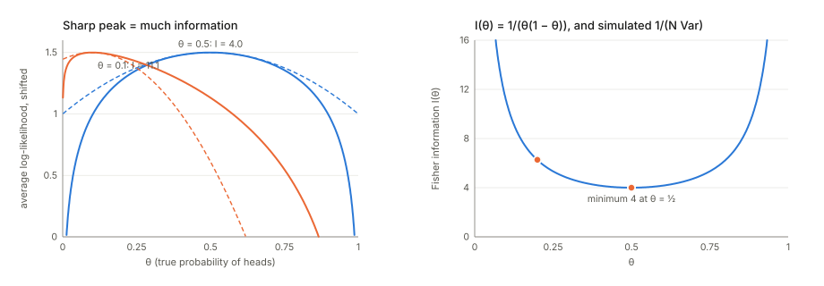
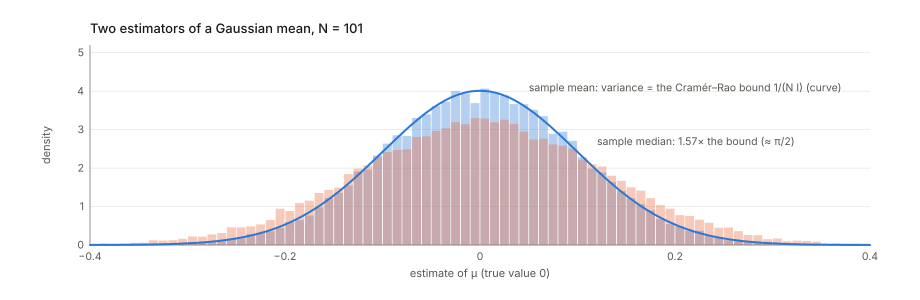
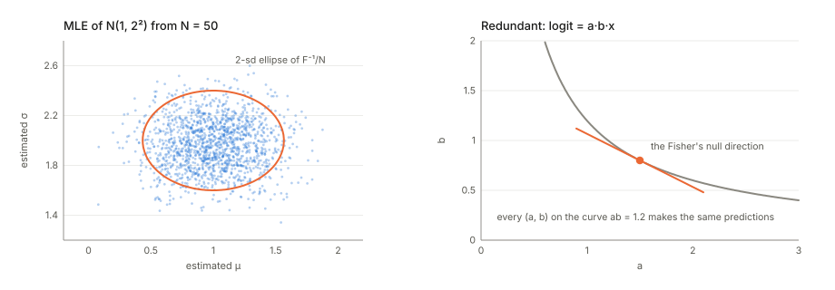
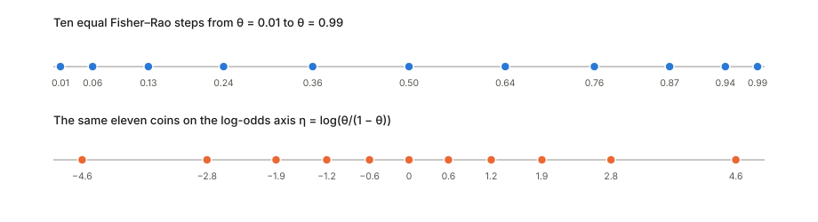
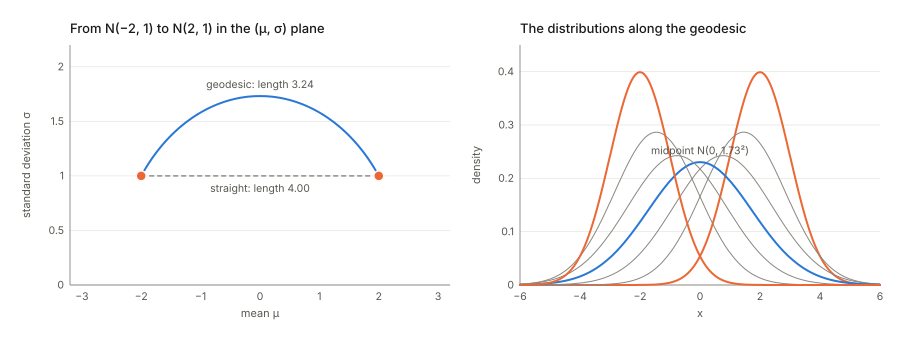
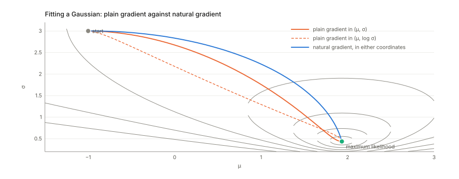

## Links

- **[Interactive version](figures/interactive.html)**: flip a coin and watch the spread of the estimate
  follow $1/(N I)$; measure the distance between two coins in three ways; drag two Gaussians around the
  half-plane and slide along the geodesic between them; and race plain gradient descent against natural
  gradient on a Gaussian fit, in two coordinate systems.
- `code/fisher.py` prints every number on this page and regenerates the figures:
  `python3 code/fisher.py --figures`. `make verify` runs it, in about a second.
- Paper notes that use the Fisher matrix: **[Achille, Mbeng & Soatto 2019](../2019-achille-task-reachability/index.html)**
  (the Fisher as a positive semi-definite stand-in for the Hessian in a task's complexity);
  **[Achille, Paolini & Soatto 2020](../2020-achille-information-in-weights/index.html)** (the Fisher information
  in the weights, and Hessian = Fisher + residual); **[Achille et al. 2020, task complexity](../2020-achille-task-complexity/index.html)**
  (whether the Hessian is $N$ times the Fisher); **[Karczewski et al. 2026](../2026-karczewski-spacetime-diffusion/index.html)**
  (the Fisher–Rao geometry of a diffusion model's denoising posteriors, a hyperbolic half-plane for Gaussian
  data, as in §6 here).
- Background pages: **[Inequalities and concentration](../inequalities-and-concentration/index.html)** (the KL
  divergence), **[The Gram matrix](../gram-matrix/index.html)** (why the Fisher and the NTK share eigenvalues,
  §9), **[Optimal transport](../optimal-transport/index.html)** (a different geometry on distributions,
  contrasted in §6), **[Langevin dynamics](../langevin-dynamics/index.html)** (the free energy
  $U+\frac D2\log\det H$, where a Fisher or Hessian determinant measures the width of a minimum).
- **A name clash.** *Fisher's linear discriminant* ([LDA](../lda-fisher-discriminant/index.html),
  [SFDA](../2022-shao-sfda/index.html)) is a different object by the same statistician. It is about
  separating classes, not about how well parameters are determined.
- Standard references: Cover & Thomas, *Elements of Information Theory* §11.10 (Fisher information and
  Cramér–Rao); Amari, *Information Geometry and Its Applications* (2016); Martens, *New Insights and
  Perspectives on the Natural Gradient Method* (JMLR 2020); Kunstner, Balles & Hennig, *Limitations of the
  Empirical Fisher Approximation for Natural Gradient Descent* (NeurIPS 2019).

## In one paragraph

Suppose data come from a model with a parameter $\theta$: a coin with probability $\theta$ of heads, a network
with weights $w$. **The Fisher information measures how much a single observation tells you about $\theta$.**
If nudging $\theta$ changes the probabilities of the outcomes a lot, each observation is informative and a
few of them pin $\theta$ down sharply. If it barely changes them, you need many. Formally it is the variance
of the **score**, the slope of the log-likelihood in $\theta$, and equivalently the average curvature of the
log-likelihood. Three facts follow. **(1) Cramér–Rao:** no unbiased estimator can have variance below
$1/(N I)$, and maximum likelihood reaches that limit for large $N$. **(2) The Fisher is the local shape of the
KL divergence**, $\mathrm{KL}(p_\theta\Vert p_{\theta+\delta})\approx\frac12\delta^\top F\delta$, so it
measures how far apart two nearby *distributions* are, whatever parameters describe them. That turns a
family of distributions into a curved space, the subject of **information geometry**: the Gaussians, for
example, form a hyperbolic half-plane. **(3) Natural gradient:** rescaling a gradient by $F^{-1}$ gives the
steepest descent in that geometry, which does not depend on how the model is parameterised. For neural
networks the Fisher is also the Gauss–Newton part of the Hessian, always positive semi-definite, which is why
papers use it wherever a curvature matrix must be safe to invert or take the log-determinant of.

## 1. One coin: how much does one flip tell you?

A coin lands heads with probability $\theta$. One flip gives $x=1$ (heads) or $x=0$ (tails), with
$p(x\mid\theta)=\theta^x(1-\theta)^{1-x}$. How much does that flip tell you about $\theta$?

**The score.** The slope of the log-probability in $\theta$,

$$
s(x;\theta)=\frac{\partial}{\partial\theta}\log p(x\mid\theta)=\frac x\theta-\frac{1-x}{1-\theta},
$$

says which way the flip pushes your belief: heads says "larger $\theta$" ($s=1/\theta>0$), tails "smaller"
($s=-1/(1-\theta)$). On average, at the true $\theta$, the pushes cancel:
$\mathbb E[s]=\theta\cdot\frac1\theta+(1-\theta)\cdot\frac{-1}{1-\theta}=0$. This holds for every model: the
true parameter is where the expected log-likelihood is flat.

**The Fisher information** is how *hard* the pushes are, their variance:

$$
I(\theta)=\mathbb E\big[s(x;\theta)^2\big]=\theta\cdot\frac1{\theta^2}+(1-\theta)\cdot\frac1{(1-\theta)^2}=\frac1{\theta(1-\theta)} .
$$

It has a second, equivalent form: minus the average curvature of the log-likelihood,
$I(\theta)=-\mathbb E\big[\partial^2_\theta\log p(x\mid\theta)\big]$. (Differentiate $\int p\,dx=1$ twice to
see why the two agree.) A **sharp** log-likelihood peak means a flip moves the estimate a lot: much
information. A **flat** peak means little. The code evaluates both formulas exactly:

| $\theta$ | 0.5 | 0.2 | 0.1 | 0.01 |
|---|---|---|---|---|
| $\mathbb E[s^2]=-\mathbb E[\partial^2\log p]=1/(\theta(1-\theta))$ | 4.000 | 6.250 | 11.111 | 101.010 |

A fair coin is the *least* informative per flip. That sounds backwards until you notice that the
information is about $\theta$ *on its own scale*. Near $\theta=0.01$ a shift of $0.01$ doubles the rate of
heads, which is easy to notice. Near $0.5$ the same shift changes almost nothing.

**Why it matters: error bars.** With $N$ flips the information adds up, $N I(\theta)$, and the maximum
likelihood estimate (the fraction of heads) has standard deviation about $1/\sqrt{N I(\theta)}$. The code
simulates it: $N\operatorname{Var}(\hat\theta)\,I(\theta)$ is $0.997$, $1.002$, $1.001$ at $\theta=0.5$ with
$N=10$, 50, 500, and $1.001$, $1.001$, $0.997$ at $\theta=0.2$. (For a coin it is exact at every $N$.)

## 2. The Cramér–Rao bound: a speed limit on accuracy

For any unbiased estimator $\hat\theta$ built from $N$ independent observations,

$$
\operatorname{Var}(\hat\theta)\ \ge\ \frac1{N\,I(\theta)} .
$$

The Fisher information is a hard limit: however clever the estimator, it cannot extract more than the data
contain. Maximum likelihood reaches the limit as $N$ grows (it is **efficient**). Other sensible estimators
may not.

The code checks it for the mean of Gaussian data with $\sigma=1$, where $I=1/\sigma^2$ and $N=101$: the bound is
$0.00990$. The sample mean has variance $0.00988$, on the bound. The **sample median** has $0.01559$, which is
$1.574$ times the bound (theory: $\pi/2=1.571$). Its **efficiency** is $0.635$ (theory $2/\pi=0.637$): the median
wastes about a third of the information in Gaussian data. (It earns that back when the data have outliers,
where the Gaussian model is wrong.)

## 3. Many parameters: the Fisher matrix

With a vector of parameters the score is a gradient, $s=\nabla_\theta\log p(x\mid\theta)$, and the Fisher
information becomes a matrix:

$$
F(\theta)=\mathbb E\big[s\,s^\top\big]=-\mathbb E\big[\nabla^2_\theta\log p(x\mid\theta)\big] .
$$

Entry $F_{ij}$ says how much the data tell you about parameters $i$ and $j$ together. Three properties:

- **It is positive semi-definite.** For any direction $v$, $v^\top Fv=\mathbb E[(v^\top s)^2]\ge0$: an average of
  squares cannot be negative. This is the property papers rely on when they use it in place of a Hessian.
- **It is an uncertainty ellipse, inverted.** Cramér–Rao generalises to
  $\operatorname{Cov}(\hat\theta)\succeq F^{-1}/N$. Stiff directions (large eigenvalues of $F$) are pinned down
  tightly; sloppy ones (small eigenvalues) are not.
- **A zero eigenvalue is a blind direction.** Moving along it does not change the predictions, so no amount of
  data can locate the parameters along it.

For a normal distribution in $(\mu,\sigma)$ the Fisher matrix is $\operatorname{diag}(1/\sigma^2,\,2/\sigma^2)$. The
code's Monte Carlo estimate at $\mu=1$, $\sigma=2$ is $[[0.2502,0.0005],[0.0005,0.4998]]$ against the exact
$\operatorname{diag}(0.25,0.5)$. Over 40 000 datasets of 50 points, $N$ times the covariance of the maximum
likelihood estimates is $[[4.036,0.013],[0.013,2.020]]$, against $F^{-1}=\operatorname{diag}(4,2)$.

For a blind direction, take a logistic model whose logit is $a\cdot b\cdot x$. Only the product $ab$ matters, so
every point on the curve $ab=\text{const}$ makes the same predictions. At $a=1.5$, $b=0.8$ the Fisher matrix has
eigenvalues $6.7\times10^{-17}$ and $0.3642$: singular, with the null direction tangent to the curve. Neural
networks are full of such directions (rescaling symmetries, dead units, redundant layers), which is why their
Fisher matrices have huge numbers of near-zero eigenvalues and why "information in the weights" needs care.

## 4. The Fisher as the local shape of the KL divergence

The KL divergence $\mathrm{KL}(p\Vert q)$ measures how distinguishable $q$ is from $p$. Move the parameter by a small
$\delta$ and expand to second order. The first-order term vanishes (the score has mean zero), leaving

$$
\mathrm{KL}\big(p_\theta\,\Vert\,p_{\theta+\delta}\big)=\tfrac12\,\delta^\top F(\theta)\,\delta+O(\lVert\delta\rVert^3).
$$

So **the Fisher matrix is the curvature of the KL divergence at zero**. On the Gaussian family the ratio
$\mathrm{KL}/(\delta^\top F\delta)$ is $0.5549$, $0.5173$, $0.5017$, $0.5002$ for steps of size $0.3$, $0.1$, $0.01$,
$0.001$: it tends to $\frac12$. For a coin at $\theta=0.5$ with a step of $0.01$ the two sides are both
$2.000\times10^{-4}$. At $\theta=0.01$ a step of $0.001$ gives $4.740\times10^{-5}$ against $5.051\times10^{-5}$, already
6% apart: "small" means small compared with $1/\sqrt{I}$, and near the edge that is small indeed.

Two consequences. The KL divergence is not symmetric, but its local quadratic is, so locally it behaves like a
squared distance. And that distance is between *distributions*: it asks how easily data could tell $p_\theta$
from $p_{\theta+\delta}$, not how far apart two parameter vectors are.

## 5. Information geometry: the coordinates change, the distances do not

**Reparameterise the coin** by its log-odds, $\eta=\log\frac\theta{1-\theta}$. The model is the same; only the
label on each distribution changes. The Fisher information changes by the chain rule, squared:

$$
I_\eta=\Big(\frac{d\theta}{d\eta}\Big)^2I_\theta ,\qquad\text{in several dimensions}\quad F_\eta=J^\top F_\theta J,\ \ J=\frac{\partial\theta}{\partial\eta}.
$$

At $\theta=0.2$: $I_\theta=6.250$ but $I_\eta=0.1600=\theta(1-\theta)$. The numbers depend on the coordinates. What
does not is the **length** of a path of distributions,

$$
\text{length}=\int\sqrt{\dot\theta^\top F(\theta)\,\dot\theta}\;dt ,
$$

because $\sqrt{F}$ and $d\theta$ change in opposite ways. From $\theta=0.05$ to $0.5$ the code integrates it in
$\theta$ and in $\eta$ and gets $1.119770$ both times, equal to the closed form
$2\lvert\arcsin\sqrt{\theta_1}-\arcsin\sqrt{\theta_2}\rvert=1.119770$. The plain parameter distances disagree:
$0.450$ in $\theta$, $2.944$ in $\eta$. The shortest such length between two distributions is the **Fisher–Rao
distance**, and $F$ used this way is the **Fisher–Rao metric**. The study of families of distributions as curved
spaces with this metric is **information geometry**.

The same step of $0.1$ in $\theta$ covers a Fisher–Rao distance of $0.201$ from $0.5$ to $0.6$ but $0.476$ from $0.01$
to $0.11$: going from a 1% coin to an 11% coin is a much bigger change in what the data look like.

A side note: the density proportional to $\sqrt{I(\theta)}$ spreads prior belief evenly in Fisher–Rao distance.
That is the **Jeffreys prior**, and for the coin it is $\mathrm{Beta}(\frac12,\frac12)\propto1/\sqrt{\theta(1-\theta)}$,
the same arcsine that appears in the distance formula.

## 6. The Gaussians form a hyperbolic half-plane

For normal distributions $\mathcal N(\mu,\sigma^2)$ the Fisher matrix $\operatorname{diag}(1/\sigma^2,2/\sigma^2)$ gives the
metric

$$
ds^2=\frac{d\mu^2+2\,d\sigma^2}{\sigma^2}.
$$

Dividing by $\sigma^2$ says that **the same shift of the mean matters more when the distribution is narrow**. A gap of
1 between means is a Fisher–Rao distance of $5.587$ at $\sigma=0.1$, $0.980$ at $\sigma=1$ and $0.100$ at $\sigma=10$. In
coordinates $(\mu/\sqrt2,\sigma)$ this is $\sqrt2$ times the Poincaré half-plane, the standard model of hyperbolic
geometry, and the distance has a closed form:

$$
d\big(\mathcal N(\mu_1,\sigma_1^2),\mathcal N(\mu_2,\sigma_2^2)\big)=\sqrt2\;\operatorname{arccosh}\Big(1+\frac{(\mu_1-\mu_2)^2/2+(\sigma_1-\sigma_2)^2}{2\sigma_1\sigma_2}\Big).
$$

**The shortest path widens first.** From $\mathcal N(-2,1)$ to $\mathcal N(2,1)$, the obvious path slides the mean at
$\sigma=1$ and has length $4.000$. The geodesic, a half-ellipse in the $(\mu,\sigma)$ plane, has length $3.242$: the
closed form gives $3.2420$ and so does integrating along the curve. It rises to $\mathcal N(0,1.732^2)$ halfway
($\sqrt3$). 200 random wiggles of it are all longer. To move a Gaussian cheaply, make it wide (where moving is
cheap), slide it, and narrow it again. The same half-plane appears in the
**[Karczewski et al.](../2026-karczewski-spacetime-diffusion/index.html)** notes, where the denoising posteriors of a
diffusion model trained on Gaussian data form exactly this family.

**A different geometry for comparison.** Optimal transport measures distance by how far mass has to *move*. Its
distance between the same two Gaussians is $W_2=4.000$, and its geodesic slides the bump at $\sigma=1$ without widening it. The two
geometries answer different questions. Fisher–Rao asks how statistically distinguishable the distributions are
(the KL divergence between them is 8.000); optimal transport asks how far the probability mass travels.

## 7. Natural gradient: steepest descent in the right geometry

Plain gradient descent, $\theta\leftarrow\theta-\eta\nabla L$, takes the steepest step *per unit of parameter change*. So it
depends on the parameterisation: change coordinates and it takes a different path. **Natural gradient** takes the
steepest step per unit of *change in the distribution*, measured by KL:

$$
\min_\delta\ L(\theta+\delta)\ \text{ subject to }\ \tfrac12\delta^\top F\delta\le\epsilon
\qquad\Longrightarrow\qquad
\delta\propto-F^{-1}\nabla L .
$$

Because $F$ changes by the same Jacobians as the gradient, $F^{-1}\nabla L$ points to the same distribution in any
coordinates, to first order in the step.

**On a coin** with 80% heads, starting from $\theta=0.1$: one natural-gradient step of size 1 in $\theta$ lands exactly on
$0.8000$, because $I^{-1}\times\text{score}=\bar x-\theta$ (this is **Fisher scoring**). The same step taken in log-odds
lands on $0.9962$: the *direction* is invariant, a finite step is not. To get within $0.001$ of the answer with
learning rate $0.02$, plain gradient descent needs $58$ steps in $\theta$ and $1800$ in log-odds. Natural gradient with
step $0.5$ needs $10$ in either.

**On a Gaussian fit** (200 points, mean 1.934, sd 0.436) from $(\mu,\sigma)=(-1,3)$ with step $0.05$, plain gradient
descent run in $(\mu,\sigma)$ and in $(\mu,\log\sigma)$ follows paths up to $0.64$ apart over the first 60 steps. The two
natural-gradient runs agree to $0.009$. After 60 steps plain gradient descent is still at $(-0.12,2.75)$, natural
gradient at $(1.80,1.01)$. The natural path keeps the Gaussian wide while it moves the mean, like the geodesic of §6.

In deep learning the Fisher is far too large to invert, so it is approximated: K-FAC (Martens & Grosse 2015) by
Kronecker products per layer, Shampoo by per-dimension factors. Adam divides by the square root of a running average
of squared mini-batch gradients, loosely a diagonal of the *empirical* Fisher (§8). That is related to natural gradient,
but it is not the same thing.

## 8. Fisher, Hessian, and the "empirical Fisher"

Three matrices go by similar names, and the difference matters.

- **The Hessian** of the training loss (average negative log-likelihood on the data), $H=\nabla^2L$.
- **The Fisher** $F$, with the outcomes $y$ drawn *from the model*. For a model that outputs logits $z_w(x)$ with
  softmax or sigmoid probabilities, $H=F+\text{residual}$. The residual is weighted by the prediction errors and by
  the curvature of $z$ in $w$ (derived in the [Achille 2019](../2019-achille-task-reachability/index.html) and
  [Achille 2020](../2020-achille-information-in-weights/index.html) notes). When the logits are linear in the
  parameters (linear or logistic regression) the residual vanishes and **$H=F$ exactly, at every parameter value**.
  $F$ is the Gauss–Newton matrix $\mathbb E[J^\top\Lambda J]$, with $J=\partial z/\partial w$ and $\Lambda$ the curvature
  of the loss in logit space.
- **The empirical Fisher**, $\frac1N\sum_i\nabla\log p(y_i\mid x_i)\nabla\log p(y_i\mid x_i)^\top$ with the *observed*
  labels. It is cheap (it reuses per-example gradients), and it is what many methods actually compute. It is close
  to $F$ only near a good fit of a well-specified model.

The code shows how far it strays. For linear regression with Gaussian noise the Fisher is the same at every $w$, and
the ratio of the largest eigenvalue of the empirical Fisher to that of the Fisher is $1.04$ at the least-squares fit,
$61.31$ at $w=0$ and $241.89$ at $3w_{\text{true}}$. Away from the fit, the empirical Fisher is dominated by the size of
the residuals, not by the curvature. Even at the optimum, a misspecified model breaks the match. On data whose true
logit is $3\tanh(2x)$, the logistic fit's Fisher (equal to its Hessian) has eigenvalues $0.0304,0.1184$ against the
empirical Fisher's $0.0577,0.107$. Kunstner et al. (2019) give simple examples where preconditioning with the
empirical Fisher distorts the updates badly.

## 9. The Fisher and the neural tangent kernel are two sides of one matrix

Stack the logit gradients $J$ (one row per example, one column per weight) and the curvatures $\Lambda$. Then

$$
F=\tfrac1NJ^\top\Lambda J\ \ (\text{weights}\times\text{weights}),\qquad
K=\tfrac1N\Lambda^{1/2}JJ^\top\Lambda^{1/2}\ \ (\text{examples}\times\text{examples}).
$$

$JJ^\top$ is the (empirical) **neural tangent kernel**, and the two matrices are the two Gram matrices of the same
$\Lambda^{1/2}J$, so they have the same non-zero eigenvalues. With 20 examples and 50 weights the code finds 20 non-zero
eigenvalues in the $50\times50$ Fisher, matching the $20\times20$ kernel's to $7.8\times10^{-16}$. At most $N$ directions in
weight space carry any information at all; the rest are blind (§3). The **[Gram matrix](../gram-matrix/index.html)**
page explains the duality, and the **[NTK](../2018-jacot-neural-tangent-kernel/index.html)** notes the kernel.

## 10. Computing it in practice

- **Exactly**, for classification: sum over all classes $c$ weighted by the model's $p(c\mid x)$. That costs one
  backward pass per class.
- **With sampled labels**: draw $y\sim p_w(y\mid x)$ and average $s s^\top$. This is unbiased. On a two-weight logistic
  regression the relative error is $0.154$ with one sampled label per example, $0.047$ with 10 and $0.015$ with 100.
- **With observed labels** (the empirical Fisher): cheap and biased (§8).
- **Approximations**: the diagonal only (EWC, Adam-style), Kronecker factors per layer (K-FAC), or just the trace, by
  random probes (Hutchinson's estimator), as a scalar measure of sharpness.

## 11. Where it shows up

| Use | What the Fisher does there |
|---|---|
| Error bars for maximum likelihood; the Laplace approximation | $(NF)^{-1}$ is the approximate covariance of the estimate, or of a posterior near its mode |
| Information in the weights, PAC-Bayes ([Achille 2020](../2020-achille-information-in-weights/index.html)) | $\frac12\log\det$ of $F$ (scaled by $N$ and the prior) counts the nats needed to specify the weights |
| Task complexity and distance ([Achille 2019](../2019-achille-task-reachability/index.html), [task complexity](../2020-achille-task-complexity/index.html)) | a positive semi-definite stand-in for the Hessian in $\log\lvert\frac{\lambda^2}\beta H+I\rvert$ |
| Task2Vec | the diagonal Fisher of a probe network, computed on a task's data, is used as a vector that describes the task |
| Continual learning (elastic weight consolidation) | the diagonal Fisher of old tasks marks which weights must not move |
| Natural gradient, K-FAC | the preconditioner that makes steps invariant to the parameterisation |
| Diffusion models ([Karczewski et al.](../2026-karczewski-spacetime-diffusion/index.html)) | the Fisher–Rao metric on denoising posteriors turns noise level and data into one geometry |
| Jeffreys prior | $\sqrt{\det F}$, the prior that does not depend on the parameterisation |
| Flat minima | the trace or top eigenvalue of $F$ as a sharpness measure, and $\log\det$ as a volume (Langevin page, §4) |
| Fisher kernel (Jaakkola & Haussler) | $s(x)^\top F^{-1}s(x')$, a similarity between examples through their scores |

## Questions and doubts

- **"The Fisher" means three different matrices in the literature**: the model Fisher (labels drawn from the model),
  the empirical Fisher (observed labels), and the observed information (the Hessian at the data). They coincide
  only in special cases: a linear logit, or the optimum of a well-specified model with many samples. When a paper
  says "Fisher", check which one it computed.
- **Per sample or total?** $I$ is information per observation, and $N$ observations carry $NI$. Losses averaged
  over the data have Hessians of order $I$; summed losses, of order $NI$. The Achille notes show how often this
  factor of $N$ gets lost.
- **A singular Fisher has no Cramér–Rao inverse.** With blind directions the bound is infinite along them, as it
  should be. In practice people add a damping term ($F+\lambda I$) or restrict to the non-zero eigenspace, and the
  answer depends on that choice.
- **The Fisher is local.** It describes KL for *small* moves. Already a step of 10% of $\theta$ near the edge of a coin
  is 6% off (§4), and globally the KL divergence is asymmetric while the Fisher–Rao distance is symmetric. Natural
  gradient steps inherit this: invariant in direction, not for a finite step.

## Cheat sheet

| Term | One line |
|---|---|
| Score $s$ | $\nabla_\theta\log p(x\mid\theta)$; mean zero at the true $\theta$ |
| Fisher information | $F=\mathbb E[ss^\top]=-\mathbb E[\nabla^2\log p]$: how much one observation says about $\theta$ |
| Coin | $I(\theta)=1/(\theta(1-\theta))$; least informative at $\theta=\frac12$ |
| Gaussian $(\mu,\sigma)$ | $F=\operatorname{diag}(1/\sigma^2,2/\sigma^2)$ |
| Cramér–Rao | $\operatorname{Cov}(\hat\theta)\succeq F^{-1}/N$; maximum likelihood reaches it as $N\to\infty$ |
| Efficiency | bound over variance: 1 for the Gaussian sample mean, $2/\pi$ for the median |
| Blind direction | a zero eigenvalue of $F$: moving along it leaves predictions unchanged |
| Local KL | $\mathrm{KL}(p_\theta\Vert p_{\theta+\delta})\approx\frac12\delta^\top F\delta$ |
| Reparameterisation | $F_\eta=J^\top F_\theta J$; path lengths $\int\sqrt{\dot\theta^\top F\dot\theta}\,dt$ unchanged |
| Fisher–Rao distance, coin | $2\lvert\arcsin\sqrt{\theta_1}-\arcsin\sqrt{\theta_2}\rvert$ |
| Gaussians | $ds^2=(d\mu^2+2d\sigma^2)/\sigma^2$: a hyperbolic half-plane; geodesics widen, slide, narrow |
| Natural gradient | $-F^{-1}\nabla L$: steepest descent in KL, invariant direction; Fisher scoring for exponential families |
| Hessian vs Fisher | $H=F+$ residual; equal for linear logits; $F$ is the Gauss–Newton matrix, always PSD |
| Empirical Fisher | observed labels; near $F$ only at a good fit of a correct model |
| Fisher and NTK | $J^\top\Lambda J$ and $\Lambda^{1/2}JJ^\top\Lambda^{1/2}$ share their non-zero eigenvalues |
