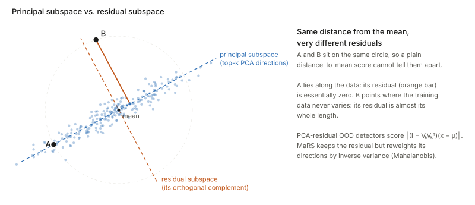

## Links

- **[Interactive version](figures/interactive.html)**: drag the columns of a 2 × 2 matrix
  until it goes singular and watch the null space appear; rotate the 3-D least-squares
  picture while dragging the data points of a line fit; run gradient descent on an
  underdetermined equation; and drag a test point past a PCA residual-space detector.
- **[Runnable code](https://github.com/msrepo/theory_inclined_papers_with_annotations/blob/main/foundations/four-fundamental-subspaces/code/subspaces.py)**:
  every number on this page. `make verify` runs it.
- Standard references: G. Strang, *The Fundamental Theorem of Linear Algebra*, American
  Mathematical Monthly 100(9), 1993, which is where the "four subspaces" picture comes from;
  and chapters 3–4 of his *Introduction to Linear Algebra*.
- Related foundations pages:
  **[Eckart–Young / low-rank SVD](../eckart-young-lowrank-svd/index.html)** (the best rank-$k$
  column space), **[principal angles](../principal-angles-subspaces/index.html)** (how far
  apart two column spaces are), and **[LDA / Fisher discriminant](../lda-fisher-discriminant/index.html)**
  (rank caps on scatter matrices).
- Where these ideas do real work in the paper notes: §9 below has the list. The short version:
  **[H-score](../2022-bao-hscore-transferability/index.html)** is a projection onto a column
  space and its loss is the residual, **[LogME](../2021-you-logme/index.html)** exists because
  of what happens when the column space is everything, and the
  **[NTK](../2018-jacot-neural-tangent-kernel/index.html)** never learns what lies in its
  null space.

## In one paragraph

A matrix $A$ is a machine: it takes an input vector $x$ and returns $Ax$, which is always some
mix of $A$'s columns. Two questions about that machine explain most of linear algebra's
"subspace" vocabulary. **What can it produce?** The set of all possible outputs is the
**column space**. A target outside it cannot be hit exactly, and the best you can do is the
closest point inside it. The miss, $b-Ax$, is the **residual**, and it always points
perpendicular to the column space, into a space of its own: the **residual space** (formally
the left null space $N(A^\top)$). **What can it not see?** The inputs that the machine turns
into zero form the **null space**. Adding anything from the null space to an input changes
nothing about the output, so any equation $Ax=b$ that has a solution has a whole family of them,
and a learning rule has to pick one. Gradient descent picks in a very particular way. Row space
and column space are the halves that matter; null space and residual space are the halves that
get thrown away. Everything else on this page, including least squares, the pseudo-inverse,
PCA residual detectors, H-score and the NTK's frozen component, follows from that split.

## 1. A matrix is a recipe for mixing its columns

Start with a concrete machine. Take

$$
A=\begin{bmatrix}1&0\\1&1\\1&2\end{bmatrix},\qquad a_1=\begin{bmatrix}1\\1\\1\end{bmatrix},\quad a_2=\begin{bmatrix}0\\1\\2\end{bmatrix}.
$$

Multiplying by $x=(x_1,x_2)$ does exactly one thing:

$$
Ax = x_1\,a_1 + x_2\,a_2 .
$$

"Take $x_1$ copies of the first column and $x_2$ copies of the second, and add them." The inputs
are the recipe amounts; the columns are the ingredients; the output is the dish. This column view
is the one to keep in your head, because every subspace below is a statement about which dishes
are possible and which recipes taste the same.

This particular $A$ is not arbitrary. It is the **design matrix for fitting a straight line**
$y=c_0+c_1t$ through three points at $t=0,1,2$. Row $i$ is $(1,t_i)$, so $Ax$ is the list of the
line's heights at the three $t$ values when $x=(c_0,c_1)$ is (intercept, slope). It is the
running example for the rest of the page.

| Symbol | Meaning |
|---|---|
| $A\in\mathbb R^{m\times n}$ | the matrix; $m$ outputs (rows), $n$ inputs (columns) |
| $r=\operatorname{rank}A$ | the number of genuinely independent columns |
| $\operatorname{col}(A)\subseteq\mathbb R^m$ | column space: every $Ax$ |
| $N(A)\subseteq\mathbb R^n$ | null space: every $x$ with $Ax=0$ |
| $\operatorname{row}(A)=\operatorname{col}(A^\top)\subseteq\mathbb R^n$ | row space: every combination of the rows |
| $N(A^\top)\subseteq\mathbb R^m$ | left null space: every $y$ with $A^\top y=0$; **the residual space** |
| $P=A(A^\top A)^{-1}A^\top$ | orthogonal projector onto $\operatorname{col}(A)$ (the "hat matrix") |
| $I-P$ | orthogonal projector onto $N(A^\top)$ (the "residual maker") |
| $A^+$ | Moore–Penrose pseudo-inverse |
| $V^\perp$ | orthogonal complement: every vector perpendicular to all of $V$ |

## 2. Column space: what the machine can produce

**Plain words.** The column space is the set of every output you can get by choosing some
recipe. With two columns in $\mathbb R^3$ it is a plane through the origin: all combinations
$x_1a_1+x_2a_2$ (the shaded plane in Figure 3).

**Formally.** $\operatorname{col}(A)=\{Ax : x\in\mathbb R^n\}=\operatorname{span}(a_1,\dots,a_n)$.
Its dimension is the rank $r$.

**Why it matters.** The equation $Ax=b$ has a solution **if and only if $b$ lies in the column
space**. With three data points and a two-parameter line, the heights $b=(1,3,2)$ are not on
any straight line (check: the line through the first two points, $1+2t$, predicts 5 at $t=2$,
not 2). So $b\notin\operatorname{col}(A)$ and no recipe produces it exactly. That is the normal
situation in data fitting: more equations than unknowns, so the reachable set is a thin slice of
the space the data lives in.

**Rank is dimension, not column count.** If one column is a mix of the others, it adds no new
reachable directions. The rank counts only the independent ones. In the singular example of
Figure 1 the matrix has two columns but they point the same way, so the column space is only a
line and the rank is 1.

## 3. Null space: what the machine cannot see

**Plain words.** The null space is the set of recipes that produce *nothing*: inputs the
machine maps to zero. They are the directions of input space that $A$ is blind to.

**Formally.** $N(A)=\{x\in\mathbb R^n : Ax=0\}$.

**A concrete one.** Take the $2\times2$ matrix

$$
A=\begin{bmatrix}1&2\\ \tfrac12&1\end{bmatrix}.
$$

Its second column is twice the first, so the input $x=(2,-1)$ gives "two of column 1 minus one of
column 2" $=0$. Every multiple of $(2,-1)$ does the same, so $N(A)=\operatorname{span}(2,-1)$, a
line through the origin (dashed orange in the left panel of Figure 1).

**Two consequences, both important later.**

1. **Solutions come in families.** If $Ax_0=b$ and $z\in N(A)$ then $A(x_0+z)=b+0=b$. Every
   solution is "one particular solution plus anything from the null space". When the null
   space is more than $\{0\}$, the data alone cannot tell you which solution is right. Something
   else has to choose: a prior, a penalty or the learning algorithm (§6).
2. **Information is destroyed.** Two inputs that differ by a null-space vector produce the same
   output, so no procedure can recover the null-space part of $x$ from $Ax$. A square matrix is
   invertible exactly when its null space is only $\{0\}$.

<figure>

<figcaption><b>Figure 1.</b> All four subspaces of one singular $2\times2$ matrix. <b>Left:</b> the
input $x$ splits into a row-space part (which $A$ uses) and a null-space part (which $A$ sends to
zero). <b>Right:</b> every output lands on the column line. A target $b$ off that line cannot be
hit; its closest reachable point is the projection $p$, and the miss $b-p=(-0.6,1.2)$ lies in
the left null space. Try it live in widget 1 of the <a href="figures/interactive.html">interactive page</a>.</figcaption>
</figure>

## 4. The other two, and why they come in perpendicular pairs

Every matrix has two more subspaces, obtained by asking the same two questions about $A^\top$:

- **Row space** $\operatorname{row}(A)=\operatorname{col}(A^\top)\subseteq\mathbb R^n$: all
  combinations of the rows. It lives in the *input* space, next to the null space.
- **Left null space** $N(A^\top)=\{y : A^\top y=0\}\subseteq\mathbb R^m$: all vectors
  perpendicular to every column. It lives in the *output* space, next to the column space.

**Why the pairs are perpendicular.** Write out $Ax=0$ row by row: it says $(\text{row}_i)\cdot x=0$
for every row. So a null-space vector is perpendicular to every row, and therefore to every
combination of rows. That is the whole proof that

$$
\begin{aligned}
N(A)&=\operatorname{row}(A)^\perp &&\text{inside }\mathbb R^n,\\
N(A^\top)&=\operatorname{col}(A)^\perp &&\text{inside }\mathbb R^m .
\end{aligned}
$$

The second is the same argument applied to $A^\top$: $A^\top y=0$ says $y$ is perpendicular to
every column. In Figure 1 you can see both right angles: $(1,2)\perp(2,-1)$ on the left and
$(1,\tfrac12)\perp(-1,2)$ on the right.

**The dimensions add up** (the rank–nullity theorem):

$$
\underbrace{r}_{\dim\operatorname{row}}+\underbrace{(n-r)}_{\dim N(A)}=n,
\qquad
\underbrace{r}_{\dim\operatorname{col}}+\underbrace{(m-r)}_{\dim N(A^\top)}=m .
$$

Row space and column space always have the **same** dimension $r$, and $A$ maps one onto the
other one-to-one. Everything $A$ does happens between those two; the null space is crushed to
zero and the left null space is never reached.

<figure>

<figcaption><b>Figure 2.</b> Strang's picture of the four fundamental subspaces. The blue halves
are what $A$ uses and produces. The orange halves are what it ignores (null space) and what it can
never produce (left null space, where every residual lives).</figcaption>
</figure>

| subspace | lives in | dimension | plain words | in the line fit |
|---|---|---|---|---|
| column space $\operatorname{col}(A)$ | $\mathbb R^m$ (outputs) | $r$ | every output $A$ can make | every straight line's three heights |
| left null space $N(A^\top)$ | $\mathbb R^m$ | $m-r$ | every possible residual | $\operatorname{span}(1,-2,1)$ |
| row space $\operatorname{row}(A)$ | $\mathbb R^n$ (inputs) | $r$ | the part of the input $A$ uses | all of $\mathbb R^2$ |
| null space $N(A)$ | $\mathbb R^n$ | $n-r$ | the part of the input $A$ ignores | $\{0\}$: intercept and slope are identifiable |

The code builds all four from one SVD of a random $5\times4$ matrix of rank 2 and confirms the
dimensions $2+3=5$ and $2+2=4$ and both orthogonality relations, to $10^{-16}$.

## 5. Least squares: the residual space is where the misses go

Back to the three points $(0,1),(1,3),(2,2)$. There is no exact line, so least squares asks for
the reachable output $p=Ax$ **closest** to $b$.

**Intuition first.** The closest point of a plane to a point off it is the foot of the
perpendicular. So the best fit $p$ is the orthogonal projection of $b$ onto the column space,
and the miss $r=b-p$ is perpendicular to the plane. Perpendicular to the plane means
perpendicular to both columns, and "perpendicular to every column" is precisely the definition of
the left null space. **Every least-squares residual lives in $N(A^\top)$.** That is why this page
calls $N(A^\top)$ the residual space.

**Now the algebra, which is the same sentence.** "$r$ is perpendicular to every column" is
$A^\top r=0$, i.e. $A^\top(b-A\hat x)=0$, which rearranges to the **normal equations**

$$
A^\top A\,\hat x = A^\top b .
$$

For the running example, $A^\top A=\begin{bmatrix}3&3\\3&5\end{bmatrix}$ and
$A^\top b=(6,7)$, giving

$$
\hat x=\Big(\tfrac32,\ \tfrac12\Big),\qquad
p=A\hat x=\Big(\tfrac32,\ 2,\ \tfrac52\Big),\qquad
r=b-p=\Big(-\tfrac12,\ 1,\ -\tfrac12\Big)=-\tfrac12\,(1,-2,1).
$$

The fitted line is $y=\tfrac32+\tfrac12t$, and the three residual bars in the right panel of
Figure 3 are $-\tfrac12,+1,-\tfrac12$: they *are* the coordinates of $r$.

<figure>

<figcaption><b>Figure 3.</b> Least squares twice. <b>Left:</b> the data vector $b\in\mathbb R^3$,
its projection $p$ onto the column space, and the residual $r$ at a right angle to it.
<b>Right:</b> the familiar picture of the same fit. One point in $\mathbb R^3$ on the left is
the whole scatter plot on the right. Rotate it and drag the points in widget 2 of the
<a href="figures/interactive.html">interactive page</a>.</figcaption>
</figure>

**Why the residual always points along $(1,-2,1)$.** Here $m=3$ and $r=2$, so
$\dim N(A^\top)=1$: the residual space is a single line. Check that $(1,-2,1)$ is on it:
$a_1\cdot(1,-2,1)=1-2+1=0$ and $a_2\cdot(1,-2,1)=0-2+2=0$. It is the second-difference
pattern, which makes sense: any straight line has zero second difference, so this is the one
shape of three heights that no line can produce. Whatever three heights you type into widget 2,
$r$ comes out as a multiple of it.

**Pythagoras.** Because $p\perp r$,

$$
\lVert b\rVert^2=\lVert p\rVert^2+\lVert r\rVert^2:\qquad 14 = 12.5+1.5 .
$$

This is not decoration. It is the identity H-score's Eq. 3 turns into a transferability score
(§9): the total is fixed, so minimising the residual is the same as maximising the captured part.

### The two projectors

The map $b\mapsto p$ is a matrix, the **hat matrix** $P=A(A^\top A)^{-1}A^\top$ ("it puts the hat
on $b$"). The map $b\mapsto r$ is $I-P$, sometimes called the **residual maker**. For the
running example:

$$
P=\frac16\begin{bmatrix}5&2&-1\\2&2&2\\-1&2&5\end{bmatrix},
\qquad
I-P=\frac16\begin{bmatrix}1&-2&1\\-2&4&-2\\1&-2&1\end{bmatrix}=\frac16\,(1,-2,1)(1,-2,1)^\top .
$$

Both are symmetric and idempotent ($P^2=P$: projecting twice changes nothing), and $P(I-P)=0$:
the two spaces share nothing. Their traces are the dimensions of the spaces they project onto,
$\operatorname{tr}P=2$ and $\operatorname{tr}(I-P)=1$. The code checks all of it.

### Residual degrees of freedom: why you divide by $n-p$

The trace fact has a statistical meaning worth knowing. If $b=Ax_{\text{true}}+\varepsilon$ with
noise $\varepsilon\sim\mathcal N(0,\sigma^2I)$, the residual is $r=(I-P)\varepsilon$ (the signal
part is in the column space and is removed exactly). The residual can only use the $m-p$
dimensions of the residual space, so

$$
\mathbb E\lVert r\rVert^2=\sigma^2\operatorname{tr}(I-P)=\sigma^2(m-p).
$$

Measured over 20,000 noise draws with $m=50$ and $\sigma^2=0.49$:

| columns $p$ | mean $\lVert r\rVert^2$ | $\sigma^2(m-p)$ | naive $\lVert r\rVert^2/m$ | $\lVert r\rVert^2/(m-p)$ |
|---|---|---|---|---|
| 1 | 23.94 | 24.01 | 0.479 | 0.488 |
| 5 | 22.05 | 22.05 | 0.441 | 0.490 |
| 20 | 14.72 | 14.70 | 0.294 | 0.491 |
| 45 | 2.46 | 2.45 | 0.049 | 0.492 |

Dividing by $m$ underestimates the noise more and more as the model grows, because each column
you add removes one more dimension the noise could have used. Dividing by the dimension of the
residual space, $m-p$, is right at every size. LogME's $\beta$ update is this estimator with
$p$ replaced by an effective count $\gamma$ (§9).

### Centring is projecting onto a residual space

Fit the simplest model of all, a constant: one column, $\mathbf 1=(1,\dots,1)$. The projection of
$b$ is its mean times $\mathbf 1$, and the residual is $b-\bar b\,\mathbf 1$: **the centred
data**. The residual space is $N(\mathbf 1^\top)=\{v:\sum_iv_i=0\}$, every vector whose entries
sum to zero, of dimension $m-1$. So "centre the features" means "project them onto the left null
space of the all-ones column". Widget 2 has a *fit a constant* switch that shows this in
$\mathbb R^3$: the column space shrinks to the line through $(1,1,1)$ and the residual space grows
to the plane perpendicular to it. This one fact produces H-score's forced right angle in §9.

## 6. The pseudo-inverse, and which solution gradient descent picks

Least squares handles the case where the column space is too small to contain $b$. The null
space handles the opposite problem: too many solutions. The **pseudo-inverse** $A^+$ handles both
at once, and Figure 2 shows how. It undoes $A$ on the part where $A$ is one-to-one (column space
back to row space) and sends the left null space to zero. So $x^+=A^+b$ is:

- a **least-squares solution**: it throws away the residual part of $b$ and inverts the rest;
- the **minimum-norm** one among them: it lives in the row space, with no null-space component,
  and adding a null-space vector could only make it longer (the two parts are perpendicular, so
  their squared lengths add).

**A concrete underdetermined system.** One equation, two unknowns: $x_1+2x_2=4$. Here
$A=[1\ \ 2]$, the row space is $\operatorname{span}(1,2)$, the null space is
$\operatorname{span}(2,-1)$, and the solutions form a line parallel to the null space (Figure 4).
The minimum-norm solution is the point of that line closest to the origin:
$x^+=A^+b=(0.8,\,1.6)$, with norm $1.789$.

<figure>

<figcaption><b>Figure 4.</b> Gradient descent on $\tfrac12(x_1+2x_2-4)^2$. Every gradient is a
multiple of the row $(1,2)$, so each path runs straight along the row space and hits the solution
line at a right angle. From $0$ it lands on $A^+b$; from $(3,3)$ it lands at $(2,1)$, which
differs from $A^+b$ by exactly the null-space part of the start. Run it yourself in widget 3 of
the <a href="figures/interactive.html">interactive page</a>.</figcaption>
</figure>

**Why gradient descent does this.** The gradient of $\tfrac12\lVert Ax-b\rVert^2$ is
$A^\top(Ax-b)$, which is a combination of rows of $A$, so it always lies in the row space. Every
step therefore changes only the row-space part of $x$. The null-space part is frozen at whatever
it was at initialisation:

| start $x_0$ | null-space coordinate of $x_0$ | lands at | null-space coordinate at the end |
|---|---|---|---|
| $(0,0)$ | $0$ | $(0.8,1.6)=A^+b$ | $0$ |
| $(3,3)$ | $1.3416$ | $(2,1)=A^+b+0.6\,(2,-1)$ | $1.3416$ |

So **gradient descent from zero initialisation returns the minimum-norm solution**, and from any
other start it returns the minimum-norm solution plus the null-space component it started with.
This is the simplest case of what is called the *implicit bias* of gradient descent: nothing in the
loss prefers $(0.8,1.6)$ over $(2,1)$, yet the algorithm reliably picks one. The same statement,
for a kernel instead of a row, is the NTK's "$\Delta^0_f$ never moves" (§9).

## 7. One SVD gives all four

Write the singular value decomposition $A=U\Sigma V^\top$ with singular values
$\sigma_1\ge\dots\ge\sigma_r>0$ followed by zeros. Then, with no further work:

| subspace | orthonormal basis |
|---|---|
| column space | first $r$ columns of $U$ |
| left null space (residual space) | remaining $m-r$ columns of $U$ |
| row space | first $r$ columns of $V$ |
| null space | remaining $n-r$ columns of $V$ |

The projector onto the column space is $U_rU_r^\top$ and onto the residual space
$I-U_rU_r^\top$, which is the numerically preferable way to form $P$ (it never inverts
$A^\top A$, whose condition number is the square of $A$'s; the H-score notes measure that effect).
This table is also what the code's `four_subspaces` function does.

**Numerical rank needs a threshold.** "The number of nonzero singular values" is not a
floating-point question. A matrix built to have rank 2, plus noise of size $10^{-9}$, has
singular values $6.8,\ 2.6,\ 2.2\times10^{-9}$. NumPy's default tolerance calls that rank 3; a
tolerance of $10^{-6}$ calls it rank 2. Which answer is right depends on whether the $10^{-9}$
direction is signal or rounding, and only the user knows. Pseudo-inverses make the same cut
(`rcond`), which is why "pinv" in a reference implementation is a statement about what to treat as
null.

**Eigenvectors are null spaces too.** An eigenvector with eigenvalue $\lambda$ is a nonzero
solution of $(A-\lambda I)v=0$, so an eigenspace is the null space of $A-\lambda I$. One instance
recurs in the contrastive-learning notes: for a graph with normalised adjacency $\bar A$, the
dimension of $N(I-\bar A)$ (the multiplicity of eigenvalue 1) is the **number of connected
components**. The code builds a graph with blocks of 3, 4 and 2 nodes and finds exactly three
unit eigenvalues. Add one weak edge between two blocks and the third drops to $0.988$, so the
null space loses a dimension and a small eigenvalue gap appears in its place.

## 8. Two things called "residual space"

The phrase is used in two related senses, and papers rarely say which.

1. **Regression residual space**, as above: fix the columns (the regressors), and the residual
   space is $N(A^\top)=\operatorname{col}(A)^\perp$, a subspace of the space the *targets*
   live in.
2. **PCA residual subspace**: fit PCA to a cloud of feature vectors, keep the top $k$ principal
   directions $V_k$ (the **principal subspace**), and call its orthogonal complement the
   **residual subspace**. Each feature splits as
   $x-\mu=V_kV_k^\top(x-\mu)+(I-V_kV_k^\top)(x-\mu)$, principal part plus residual part.

They are the same idea, "the orthogonal complement of what the model explains", applied to
different objects. In sense 1 the model is a set of regressors and the explained part is the fit.
In sense 2 the model is a $k$-dimensional description of the data and the explained part is the
low-rank reconstruction. [Eckart–Young](../eckart-young-lowrank-svd/index.html) says the PCA
choice of $V_k$ makes the total residual as small as possible.

**Why sense 2 is useful for out-of-distribution detection.** Training features typically use only
a few directions heavily. A new kind of input can have an ordinary *length* but point in a direction
the training data never used, and that shows up in the residual and nowhere else. In the code, 2,000
training points in $\mathbb R^{20}$ that lie near a 3-dimensional subspace have residual norms with
median $0.40$ and 99th percentile $0.59$. Two test points at the same distance $4.0$ from the mean
separate completely: one along the data has residual $0.00$, one off it has residual $4.00$.

<figure>

<figcaption><b>Figure 5.</b> The same distance from the mean, very different residuals. A score on
$\lVert x-\mu\rVert$ cannot separate A and B; a score on the residual part separates them
immediately. Widget 4 of the <a href="figures/interactive.html">interactive page</a> shows the
region each score accepts: a disc for distance to the mean, a band along the data for the residual
norm, an ellipse for full Mahalanobis.</figcaption>
</figure>

## 9. Where these show up in the other notes

| page | which subspace | what it buys |
|---|---|---|
| [H-score, Bao et al. 2022](../2022-bao-hscore-transferability/index.html) | column space of the features, and its residual | the score *is* the captured part of a Pythagoras split; one principal angle is forced to $90^\circ$ by centring |
| [LogME, You et al. 2021](../2021-you-logme/index.html) | column space $=\mathbb R^n$, big null space | why maximum likelihood cannot rank features when $D>n$, and what "effective degrees of freedom" means |
| [LDA](../lda-fisher-discriminant/index.html) and [SFDA, Shao et al. 2022](../2022-shao-sfda/index.html) | column spaces of $S_b$, null space of $S_w$ | the $g-1$ direction cap; the small-sample singularity and the PCA fix |
| [NTK, Jacot et al. 2018](../2018-jacot-neural-tangent-kernel/index.html) | null space of the kernel | the component the network never learns |
| [NTK Selector, Wang et al. 2026](../2026-wang-ntk-selector/index.html) | projection onto a line in matrix space | only the residual of the kernel, its turning, matters |
| [Spectral contrastive, HaoChen et al. 2021](../2021-haochen-spectral-contrastive/index.html) and [Zhang et al. 2026](../2026-zhang-difficult-examples/index.html) | null spaces of $Q$ and of $I-\bar A$ | "up to an invertible map" costs nothing; unit eigenvalues count components |
| [Hyperbolic flow matching, Li et al. 2026](../2026-li-hyperbolic-flow-matching/index.html) | tangent space as a null space | projecting a velocity onto the manifold |
| [MICCAI 2026 DA/DG](../miccai2026-domain-adaptation/index.html) | PCA/Mahalanobis residuals, null space of a forward operator, gradient projection | MaRS, PET-Adapter, PCGrad in MKGA |
| [InfoNCE → Gaussian, Betser et al. 2026](../2026-betser-infonce-gaussian/index.html) | centring as a residual | the cross terms vanish because residuals are perpendicular to the mean |

**H-score is least squares, read as a projection.** The H-score notes show the frozen-feature
head is ordinary least squares (their Eq. 2 is the normal equations), and that the loss splits by
Pythagoras (Eq. 3) into a fixed total, a part captured by $\operatorname{col}(\Phi)$ through the
projector $P=\Phi(\Phi^\top\Phi)^{-1}\Phi^\top$, and a residual $\tilde B(I-P)$, "the loss you are
stuck with". That is §5 of this page with $\tilde B$ in place of $b$. Their form 6 then writes the
score as $\sum_i\cos^2\theta_i$, the principal angles between the column space of the centred
features and the span of the class indicators. The bound $\mathcal H<\min(k,|\mathcal Y|-1)$
follows from §5's centring fact: centring puts $\mathbf 1$ into the left null space of the
features ($Z^\top\mathbf 1=0$, checked to $10^{-14}$ in the code), while $\mathbf 1$ is inside the
indicator span (the unnormalised indicator columns add up to it). One direction of the indicator span is
therefore perpendicular to the feature span, and one principal angle is exactly $90^\circ$. The
code's cosines for four classes are $[0.496,\,0.349,\,0.334,\,0.000]$, with that forced zero last.

**LogME exists because the column space can be everything.** With $D$ features and $n$ samples,
the column space of the $n\times D$ feature matrix is at most $n$-dimensional. Once $D\ge n$ (and
the features are generic), it is *all* of $\mathbb R^n$: every label vector is reachable and the
least-squares residual is zero. The code gives train $R^2=1.000000$ for the true features,
half-noise features and pure noise alike, each with rank 40 and a 20-dimensional null space of
equally perfect weight vectors. That is the LogME table in the notes, explained: maximum
likelihood looks only at the residual, and the residual space has vanished. The evidence
integrates over the null space instead of picking a point in it. And its noise update
$\beta^{-1}=\lVert Fm-y\rVert^2/(n-\gamma)$ is the residual-degrees-of-freedom estimator of §5, with
the effective parameter count $\gamma$ in place of $p$.

**LDA and SFDA: rank caps are column-space dimensions.** The between-class scatter
$S_b=\sum_c n_c(\mu_c-\mu)(\mu_c-\mu)^\top$ is a sum of $g$ rank-one terms whose vectors
$\mu_c-\mu$ satisfy one linear relation (their weighted sum is zero), so
$\dim\operatorname{col}(S_b)\le g-1$. Every direction in $N(S_b)$ has zero between-class spread,
so the Fisher criterion is zero there. That is why LDA yields at most $g-1$ directions and why
SFDA's Fisher space is **one-dimensional for a binary task**. The within-class scatter has rank at
most $N-g$, so when $N<n+g$ it has a nontrivial null space and $S_w^{-1}$ does not exist. The code
tabulates it:

| $n$ | $g$ | $N$ | $\operatorname{rank}S_b$ | $\operatorname{rank}S_w$ | $\dim N(S_w)$ |
|---|---|---|---|---|---|
| 10 | 3 | 300 | 2 | 10 | 0 |
| 10 | 2 | 300 | 1 | 10 | 0 |
| 50 | 3 | 30 | 2 | 27 | 23 |
| 50 | 5 | 40 | 4 | 35 | 15 |

A direction in $N(S_w)$ has zero within-class spread, so the Fisher ratio is infinite there. The
PCA-then-LDA fix restricts attention to a subspace where $S_w$ has no null space; SFDA's
shrinkage term does the same job by adding a multiple of the identity.

**NTK: the null space is never trained.** In function space, wide-network training under squared
loss is a linear ODE driven by the kernel $\Pi$, and the error splits over the kernel's
eigenfunctions. The Jacot notes point out that the component $\Delta^0_f$ in the **null space of
$\Pi$** never moves: directions the kernel cannot see are never learned, at any training time. That
is Figure 4 with the kernel playing the role of the row: gradient flow only moves along the
directions the operator can see, so the null-space part is fixed by initialisation. The same mechanism
leaves an initialisation-dependent term in the trained prediction (it vanishes on the training
points, and ensembling cancels it), and it is why overparameterised linear regression trained
from zero returns the minimum-norm interpolant.

**NTK Selector: a projection in matrix space.** The selector notes decompose the evolving kernel
as $\Theta(t)=a^*(t)\Theta_0+R(t)$, the least-squares projection onto the line through $\Theta_0$
plus a residual, using the Frobenius inner product $\langle X,Y\rangle=\operatorname{tr}(X^\top Y)$
on matrices. Perpendicularity gives $\lVert R\rVert=\lVert\Theta\rVert\sqrt{1-S^2}$, so the cosine
$S$ controls the residual. Time reparameterisation then absorbs the projected part exactly, and only
the residual survives. The whole argument is §5, with $\mathbb R^m$ replaced by a space of matrices.

**Spectral contrastive learning: invertibility means a trivial null space.** HaoChen et al.'s
Lemma 3.1 says the learned features equal the ideal eigenvector features up to an invertible
$Q$, and that costs a linear probe nothing. Invertible means $N(Q)=\{0\}$. A rank-deficient $Q$
would have a nonzero null space, and some combination of the eigenvector coordinates would be
erased for good. Because only the column space of the feature matrix is pinned down, the notes also
observe that individual coordinates are not interpretable; only their span is. And "the
multiplicity of eigenvalue 1 counts components" is the $N(I-\bar A)$ fact from §7. Zhang et al.
build on the same rank-$k$ factorisation: the minimiser's column space is the span of the top-$k$
eigenvectors of $\bar A$.

**Hyperbolic flow matching: a tangent space is a null space.** On the Lorentz model the manifold
is a level set of the Lorentz form $\langle z,z\rangle_L=-1/\kappa$, and the tangent space at $z$ is
every $v$ with $\langle z,v\rangle_L=0$: the null space of a single row, $z^\top J$ with
$J=\operatorname{diag}(-1,1,\dots,1)$. The projection in Li et al., $\Pi_{T_zL}(x)=x+\kappa\langle z,x\rangle_L\,z$,
removes the component of the network's ambient output along $z$, the one direction that leaves the
manifold; check that $\langle z,\Pi_{T_zL}(x)\rangle_L=\langle z,x\rangle_L(1+\kappa\langle z,z\rangle_L)=0$. It is an orthogonal projection,
but with respect to the Lorentz inner product rather than the Euclidean one (see the caveats).

**MICCAI 2026 topic notes: three residual-type constructs.**
*MaRS* scores OOD by $r^\top\Sigma^{-1}r$ on the residual of an autoencoder reconstruction, and the
topic notes observe that residual-PCA is its hard 0/1 special case: §8's sense 2, with the
residual directions reweighted by their inverse variance. *PET-Adapter* adapts using only a
measurement loss, and the topic notes point out that such a loss cannot constrain the **null space
of the forward operator $A$**, which is large for limited-angle scans. Whatever fills that null
space in the reconstruction comes from the prior, not the data. That is §3's "information is
destroyed" in an imaging costume. *PCGrad*, used optionally in MKGA, replaces a conflicting gradient
$g_i$ by $g_i-\frac{g_i^\top g_j}{\lVert g_j\rVert^2}g_j$, the residual of regressing $g_i$ on $g_j$:
its projection onto $\operatorname{span}(g_j)^\perp$.

**InfoNCE → Gaussian: centring is a residual.** Step 1 of Betser et al.'s bound splits
$\mathbb E[u\cdot v]=\lVert m\rVert^2+\mathbb E[\tilde u\cdot\tilde v]$ with $\tilde u=u-m$. The cross
terms, such as $\mathbb E[m\cdot\tilde v]=m\cdot\mathbb E[\tilde v]$, vanish because a mean-zero
random vector is orthogonal, in the sense of expectations, to every constant. That is §5's
Pythagoras for the one-column model, used to separate a shared bias from genuine co-variation.

## Questions and doubts

- **"The residual space" depends on which columns you included.** Adding an intercept column
  shrinks it by one dimension and forces every residual to sum to zero. Centring features before
  a regression is quietly choosing a model. When a paper reports
  residual statistics, the column set is part of the definition, and it is often not stated.
- **Orthogonal with respect to what?** Everything above uses the Euclidean inner product.
  Weighted least squares projects in the $\Sigma^{-1}$ inner product, Mahalanobis scores measure
  residuals in it, and the Lorentz projection uses an indefinite form. The four-subspace picture
  survives, but "perpendicular" and "closest" change meaning, and figures drawn in Euclidean
  coordinates stop showing the right angles.
- **A nonlinear reconstruction has no residual *subspace*.** MaRS's autoencoder residuals
  $z-D(E(z))$ form a set, not a subspace; there is no projector, no guaranteed Pythagoras, and
  no trace formula for degrees of freedom. The linear picture is the right intuition but not a
  theorem there.
- **The null-space argument for implicit bias is exact only for linear models.** For a linearised
  (NTK-regime) network it holds approximately. Once features move it is at best a heuristic,
  which is exactly the gap the Fort et al. notes measure.
- **Numerical rank is a modelling choice.** The tolerance in `pinv` or `matrix_rank` decides what
  counts as null. For ill-conditioned feature matrices (H-score, LogME, SFDA on real backbones),
  different reasonable tolerances give different null spaces and so different scores.

## Takeaways

- A matrix has **four** subspaces in two perpendicular pairs: row space ⟂ null space in the
  input space, column space ⟂ left null space in the output space. Their dimensions are
  $r,\ n-r,\ r,\ m-r$, and one SVD gives orthonormal bases for all four.
- **Column space** answers "can this be produced at all?". **Null space** answers "what can
  never be recovered?". If the null space is nonzero, a solution comes as a family, and something
  outside the data has to choose among them.
- **Least squares is a right angle.** The fit is the projection onto the column space. The
  residual lives in $N(A^\top)$, the residual space, and $\lVert b\rVert^2=\lVert p\rVert^2+\lVert r\rVert^2$.
  Its dimension, $m-p$, is the divisor for the noise variance.
- **Centring is projection onto the residual space of the all-ones column.** That single fact is
  why H-score has a forced right angle and why variance estimates lose a degree of freedom.
- **Gradient descent never changes the null-space component of its iterate.** From zero it finds
  the minimum-norm solution. That is the NTK's frozen $\Delta^0$ and the implicit bias of
  overparameterised regression.
- **"Residual space" means either $N(A^\top)$ for fixed regressors or the complement of a PCA
  subspace.** Both are "the orthogonal complement of what the model explains", and residual-based
  OOD detectors score only that part.
