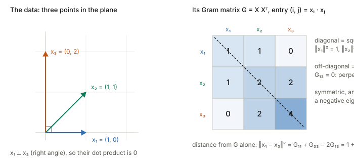
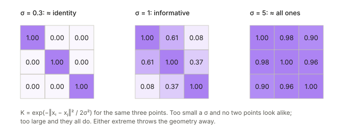

## Links

- **[Interactive version](figures/interactive.html)**: drag three or four points and watch
  their Gram matrix and eigenvalues update, rotate the cloud and see the matrix not change;
  slide an RBF bandwidth between "identity" and "all ones"; and turn a batch of embeddings
  into the contrastive similarity matrix, temperature and all.
- **[Runnable code](https://github.com/msrepo/theory_inclined_papers_with_annotations/blob/main/foundations/gram-matrix/code/gram.py)**:
  every number on this page. `make verify` runs it.
- Related foundations pages:
  **[Four fundamental subspaces](../four-fundamental-subspaces/index.html)** (rank, null space,
  the $X^\top X$ of least squares), **[Eckart–Young / low-rank SVD](../eckart-young-lowrank-svd/index.html)**
  (the eigen-decomposition used in §5), **[principal angles](../principal-angles-subspaces/index.html)**.
- Where Gram matrices do real work in the paper notes: §8 below.

## In one paragraph

Take $n$ vectors, say the embeddings of $n$ images in a batch, and write down every dot product
between every pair. That $n\times n$ table is the **Gram matrix** $G$, with $G_{ij}=x_i\cdot x_j$.
It sounds like bookkeeping, but it holds exactly the geometry of the set: every length, every angle,
every distance. It forgets only *which way the whole cloud is facing*, so rotating all the points
leaves $G$ unchanged, and from $G$ alone you can rebuild the points up to that rotation. Because
it is built from dot products it is always symmetric with no negative eigenvalues, and it has the
same nonzero eigenvalues as the $d\times d$ matrix $X^\top X$ you meet in least squares and PCA.
Swap the plain dot product for a **kernel**, or for a dot product of *gradients*, and you get the
kernel matrices of kernel methods and the NTK. Normalise the vectors and divide by a temperature
and you get the logits of InfoNCE.

## 1. The definition, with ordinary numbers

Stack the vectors as the **rows** of a data matrix $X$ ($n$ rows, one per sample; $d$ columns, one
per feature). The running example is three points in the plane:

$$
x_1=(1,0),\quad x_2=(1,1),\quad x_3=(0,2),\qquad
X=\begin{bmatrix}1&0\\1&1\\0&2\end{bmatrix}.
$$

Row $i$ of $X$ times column $j$ of $X^\top$ is $x_i\cdot x_j$, so the whole table is one product:

$$
G = XX^\top=\begin{bmatrix}1&1&0\\1&2&2\\0&2&4\end{bmatrix}.
$$

<figure>

<figcaption>Figure 1. The diagonal of $G$ holds squared lengths, the off-diagonal entries hold
dot products. Drag the points yourself in widget 1 of the <a href="figures/interactive.html">interactive page</a>.</figcaption>
</figure>

| Symbol | Read it as | Size |
|---|---|---|
| $x_i$ | the $i$-th sample (an embedding, a feature vector) | $d$ numbers |
| $X$ | all samples, one per row | $n\times d$ |
| $G=XX^\top$ | Gram matrix: dot products between **samples** | $n\times n$ |
| $X^\top X$ | dot products between **features** (an unnormalised covariance) | $d\times d$ |
| $K$, $K_{ij}=k(x_i,x_j)$ | kernel Gram matrix: a "similarity" in place of the dot product | $n\times n$ |
| $H=I-\tfrac1n\mathbf 1\mathbf 1^\top$ | the centring matrix | $n\times n$ |

A word on convention: some texts stack samples as *columns* and write $G=X^\top X$. Nothing
changes except the transpose; the question to ask is always "dot products between what?".

## 2. What $G$ remembers: lengths, angles, distances

Everything geometric about the set can be read off $G$:

- **Lengths** are on the diagonal: $\|x_i\|^2=G_{ii}$. Here $1,2,4$.
- **Angles** come from normalising: $\cos\theta_{ij}=G_{ij}/\sqrt{G_{ii}G_{jj}}$. For $x_1,x_2$
  that is $1/\sqrt2\approx0.7071$, i.e. $45^\circ$; for $x_1,x_3$ it is $0$, a right angle.
- **Distances** expand like $(a-b)^2=a^2+b^2-2ab$:

$$
\|x_i-x_j\|^2 = G_{ii}+G_{jj}-2G_{ij}.
$$

  So $\|x_1-x_3\|^2 = 1+4-0=5$, which is indeed $\|(1,-2)\|^2$.

This last identity is why a Gram matrix and a distance matrix carry the same information (once
you fix where the origin is, see §6).

## 3. What $G$ forgets: which way the cloud faces

Rotate (or reflect) every point by the same orthogonal matrix $Q$, so $X\mapsto XQ$. Then

$$
(XQ)(XQ)^\top = X\,QQ^\top X^\top = XX^\top = G.
$$

Rotations do not change lengths or angles, so they cannot change a table of dot products. The
code checks this for a $0.7$ rad rotation: the largest change in any entry is $4\times10^{-16}$,
i.e. rounding. The converse also holds and is the useful direction: **two point sets with the
same Gram matrix differ only by a rotation/reflection**. §5 shows how to rebuild them.

For representation learning this is the right invariance. A network's embedding space has no
preferred axes, so any quantity that should not depend on an arbitrary rotation of the features
(CKA, kernel methods, InfoNCE logits) is naturally a function of a Gram matrix.

## 4. Always symmetric, never negative

Two facts hold for every Gram matrix, whatever the data.

**Symmetric**, because $x_i\cdot x_j=x_j\cdot x_i$.

**Positive semidefinite (PSD)**: for any weights $v=(v_1,\dots,v_n)$,

$$
v^\top G v = v^\top XX^\top v = \|X^\top v\|^2 = \Big\|\sum_i v_i x_i\Big\|^2 \;\ge\;0.
$$

In words: $v^\top Gv$ is the squared length of the weighted sum $\sum_i v_ix_i$, and a squared
length cannot be negative. Equivalently, every eigenvalue of $G$ is $\ge 0$. With $v=(2,-1,0.5)$
the sum is $2x_1-x_2+0.5x_3=(1,0)$, and $v^\top Gv=1$.

**Rank** equals the rank of $X$, so at most $\min(n,d)$. Our three points live in a
2-dimensional plane, so the $3\times3$ matrix $G$ has rank 2 and eigenvalues
$5.3028,\ 1.6972,\ 0$. The zero eigenvalue's eigenvector is a set of weights with
$\sum_i v_ix_i=0$, a linear dependence among the points. In a batch of $n=256$ embeddings of
dimension $d=128$, the $256\times256$ Gram matrix has at least $128$ zero eigenvalues.

The converse is what makes kernels work: **any** symmetric PSD matrix is the Gram matrix of
*some* set of vectors (§5 builds them). So "is this similarity a legal kernel?" is the same
question as "are its Gram matrices always PSD?".

## 5. Rebuilding the points from $G$ alone

Diagonalise the symmetric PSD matrix, $G=U\Lambda U^\top$ with $\Lambda$ the (non-negative)
eigenvalues. Then set

$$
Y = U\Lambda^{1/2}\quad\Longrightarrow\quad YY^\top=U\Lambda U^\top=G .
$$

The rows of $Y$ are a set of points with exactly the Gram matrix $G$. Keeping only the top $k$
eigenvalues gives the best $k$-dimensional approximation
([Eckart–Young](../eckart-young-lowrank-svd/index.html)). For the running example, keeping the
two nonzero eigenvalues gives

$$
Y\approx\begin{bmatrix}0.290&-0.957\\1.247&-0.667\\1.914&0.580\end{bmatrix},
$$

which does not look like $X$ but is $X$ rotated: the code finds the $2\times2$ map from $Y$ to $X$
and confirms it is orthogonal. This recipe, applied to a double-centred distance matrix, is
**classical multidimensional scaling (MDS)**, and applied to a centred $G$ it is exactly PCA
scores computed "from the sample side".

## 6. Two Gram matrices of one data set: $XX^\top$ and $X^\top X$

The same $X$ gives two products:

- $XX^\top$, $n\times n$: dot products between **samples**. Here $3\times3$.
- $X^\top X$, $d\times d$: dot products between **features** (columns). Here
  $\begin{bmatrix}2&1\\1&5\end{bmatrix}$, eigenvalues $(7\pm\sqrt{13})/2 = 5.3028,\ 1.6972$.

They share their **nonzero eigenvalues**, and the extra eigenvalues of the bigger one are zero.
The reason is the SVD $X=U\Sigma V^\top$: $XX^\top=U\Sigma^2U^\top$ and $X^\top X=V\Sigma^2V^\top$,
same $\Sigma^2$. This is the **dual view** that powers the kernel trick and cheap PCA: when
$n\ll d$ (100 images, 2048-dim features), work with the small $n\times n$ Gram matrix instead of
the huge $d\times d$ covariance. LogME uses exactly this switch when features outnumber samples.

**Centring.** Covariance needs the mean removed. On the sample side that is the centring matrix
$H=I-\tfrac1n\mathbf 1\mathbf 1^\top$:

$$
HGH = (HX)(HX)^\top = \text{Gram matrix of the mean-subtracted points}.
$$

Its rows sum to zero, so $\mathbf 1$ is always in its null space. $HGH$ is the object in HSIC,
CKA and kernel PCA.

## 7. Kernels: a Gram matrix with a different "dot product"

Replace $x_i\cdot x_j$ with a similarity $k(x_i,x_j)$. If $k$ is a **kernel**, meaning
$k(x,y)=\phi(x)\cdot\phi(y)$ for some feature map $\phi$ (possibly infinite-dimensional), then
$K_{ij}=k(x_i,x_j)$ is still a Gram matrix, of the vectors $\phi(x_i)$, and §§2–6 all apply. You
never need to compute $\phi$: that is the kernel trick.

The workhorse is the RBF (Gaussian) kernel $k(x,y)=\exp(-\|x-y\|^2/2\sigma^2)$. Its bandwidth
$\sigma$ decides how far "similar" reaches:

<figure>

<figcaption>Figure 2. The same three points under an RBF kernel. Widget 2 of the
<a href="figures/interactive.html">interactive page</a> has a bandwidth slider on a larger cloud.</figcaption>
</figure>

At either extreme the matrix stops depending on the data: near-identity means every point looks
unrelated, near-all-ones means every point looks the same. This is why kernel scores (MMD, HSIC)
are sensitive to $\sigma$ and why the "median distance" heuristic exists.

**The NTK is a Gram matrix of gradients.** For a network $f(x;\theta)$, set
$\phi(x)=\nabla_\theta f(x;\theta)$, one long vector per input. Then

$$
\Theta_{ij}=\nabla_\theta f(x_i)\cdot\nabla_\theta f(x_j)
$$

is the empirical NTK: the Gram matrix of per-example gradients. It is PSD for the reason in §4,
and its eigenvectors are the directions in function space that gradient descent learns fast
(large eigenvalue) or slowly (small).

## 8. Where it shows up in the paper notes

| Where | Which Gram matrix | What it is used for |
|---|---|---|
| [NTK (Jacot et al.)](../2018-jacot-neural-tangent-kernel/index.html), [deep vs. kernel (Fort et al.)](../2020-fort-deep-vs-kernel/index.html) | gradients, $\Theta=JJ^\top$ | training dynamics are linear in $\Theta$; its spectrum sets learning speed per direction |
| [NTK-Selector (Wang et al.)](../2026-wang-ntk-selector/index.html) | gradient Gram between general and domain data | picks general examples whose gradients align with the small domain set |
| [InfoNCE (Betser et al.)](../2026-betser-infonce-gaussian/index.html), [alignment/uniformity](../2020-wang-isola-alignment-uniformity/index.html) | normalised embeddings, $ZZ^\top/\tau$ | row-wise softmax of the cosine Gram matrix is the contrastive loss; uniformity is an RBF-kernel mean over it |
| [Spectral contrastive (HaoChen et al.)](../2021-haochen-spectral-contrastive/index.html) | augmentation-graph adjacency | the loss is a low-rank factorisation $\approx FF^\top$ of a normalised graph matrix |
| [H-score](../2022-bao-hscore-transferability/index.html), [LogME](../2021-you-logme/index.html) | $X^\top X$ (feature side) and $XX^\top$ (sample side) | covariance of features; LogME's dual switch when $d>n$ |
| [Four subspaces](../four-fundamental-subspaces/index.html) | $A^\top A$ | normal equations, and why it squares the condition number (§9) |

A further standard use not covered by a paper here: **neural style transfer** compares the
$C\times C$ Gram matrix of a CNN layer's channels (dot products between channel activation maps,
summed over pixels). Summing over positions throws away *where* things are and keeps *which
features co-occur*, which is what "style" turns out to be.

## 9. A numerical caution

Forming $X^\top X$ (or $XX^\top$) **squares the condition number**: its eigenvalues are the
squared singular values of $X$. In the code, a $50\times5$ matrix with one column shrunk by
$10^{-3}$ has $\mathrm{cond}(A)\approx967$ and $\mathrm{cond}(A^\top A)\approx9.35\times10^{5}$.
In float32 (about 7 significant digits) that is most of the precision gone. Hence: solve least
squares with QR or SVD rather than the normal equations, and add a small ridge $\lambda I$ to a
kernel Gram matrix before inverting it.

## Questions and doubts

- The PSD guarantee is exact in maths but not in floating point: a large kernel matrix routinely
  reports tiny negative eigenvalues. Clipping them, or adding jitter, is standard, but how much
  jitter changes an MMD or CKA value is rarely reported.
- CKA compares two networks via their centred Gram matrices and is invariant to rotations and
  isotropic scaling of features. Is that invariance always wanted? Two layers that differ by an
  anisotropic rescaling look different to CKA, though a linear probe would not care.
- The empirical NTK Gram matrix is $n\times n$ but each entry needs two gradients of full
  parameter size. The low-rank or random-projection approximations used in practice (and in
  NTK-Selector) change which eigen-directions survive; worth checking against the exact one on a
  small model.

## Takeaways

- A Gram matrix is a table of dot products, $G=XX^\top$. Diagonal: squared lengths.
  Off-diagonal: dot products. Distances: $G_{ii}+G_{jj}-2G_{ij}$.
- It keeps all the shape of the point set and forgets only its orientation; the points can be
  rebuilt from it up to a rotation.
- It is always symmetric PSD, rank $\le\min(n,d)$, and shares its nonzero eigenvalues with
  $X^\top X$. Pick whichever side is smaller.
- Kernel matrices, the NTK and contrastive similarity matrices are all Gram matrices of some
  feature map, so the same facts apply to each of them.
