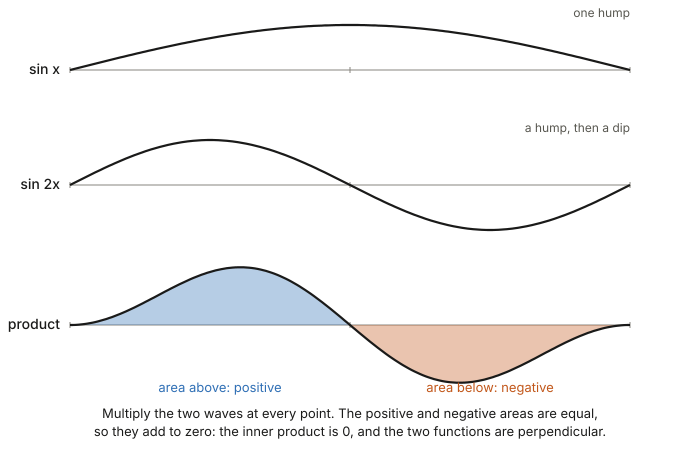
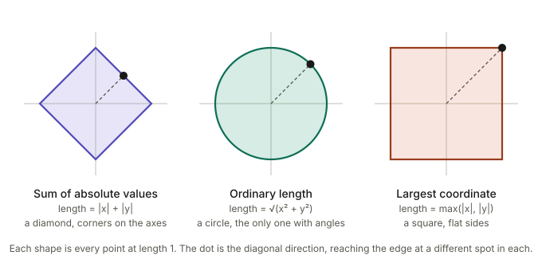
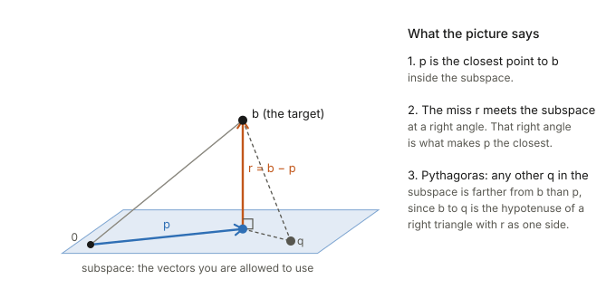
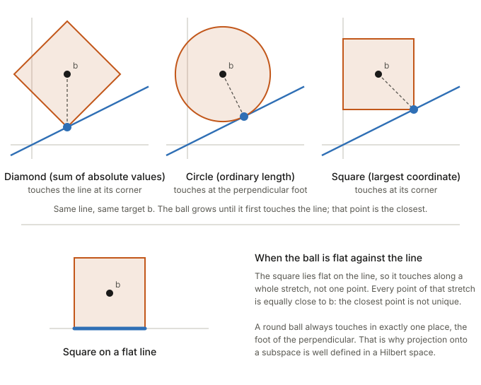
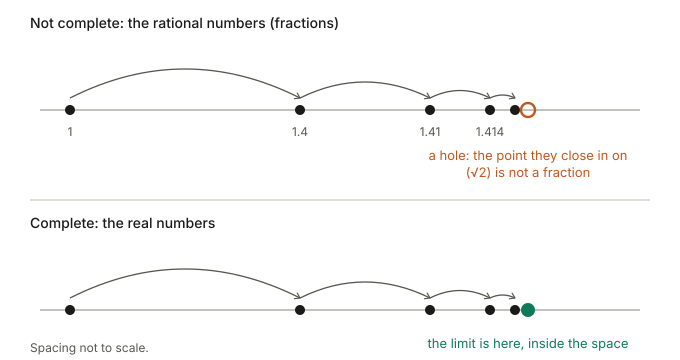

## Links

- **[Four Fundamental Subspaces](../four-fundamental-subspaces/index.html)**: least squares is the projection picture
  of §5, with the column space as the subspace and the residual space as where the miss lives.
- **[HSIC](../hsic/index.html)** and **[The Gram matrix](../gram-matrix/index.html)**: kernels are inner products
  in a Hilbert space of features, and "Hilbert–Schmidt" is a norm on operators between Hilbert spaces (§7).
- **[Fisher information](../fisher-information/index.html)**: an inner product on tangent vectors, supplied by the
  model.
- **[Dually flat structure (Amari)](../2016-amari-dually-flat-structure/index.html)**: geometry built from such an
  inner product.

## In one paragraph

A vector space only lets you add vectors and scale them. A **Hilbert space** is a vector space with two
extra things. First, an **inner product**, a generalised dot product that gives every vector a length,
every pair of vectors an angle, and every pair of points a distance. Second, **completeness**: no holes,
meaning that whenever a sequence of vectors keeps getting closer to itself, the point it is closing in on
is itself a vector in the space. The first gives you the geometry of the plane (perpendicular directions,
Pythagoras, dropping a perpendicular to find the closest point) in any dimension, including infinitely many.
The second guarantees that "keep improving until you arrive" processes arrive. Functions can be vectors,
and the standard example, the space of functions with finite squared area, is where Fourier series and
kernel methods live.

## 1. A ladder of structures

A vector space is only the ability to add and scale. Length and angle are *extra structure placed on top*,
and each rung of the ladder adds one more thing.

| structure | what you can do | example |
|---|---|---|
| vector space | add, scale, span, subspaces, dimension, linear maps | any of the below |
| normed space | also measure **length** (and so distance) | the plane with length = largest coordinate |
| inner-product space | also measure **angle** and perpendicularity | the plane with the ordinary dot product |
| Hilbert space | also **no holes** (complete) | ℝⁿ; the square-integrable functions |

There are vector spaces with no natural length at all. Take pairs (price in dollars, temperature in
degrees). You can add and scale them, but the "length" of a pair means nothing: squaring and adding
dollars to degrees is meaningless, and the answer changes if you switch to cents or Fahrenheit. Linear
questions (is one pair a multiple of another? do two pairs span the plane?) still make sense. Length and
angle only appear when someone *chooses* an inner product, and a different choice gives different lengths
and angles. The same is true of tangent vectors on a curved surface: they have no length until a metric is
specified, which is what the Fisher information does for a statistical model.

## 2. The inner product: lengths, angles, distances

An **inner product** $\langle u,v\rangle$ takes two vectors and returns a number; for arrows it is the
dot product. Everything geometric comes from it:

- **length:** $\lVert v\rVert=\sqrt{\langle v,v\rangle}$;
- **perpendicular:** $u\perp v$ exactly when $\langle u,v\rangle=0$;
- **distance:** the length of the difference, $\lVert u-v\rVert$.

### Functions are vectors: the simplest example

Take three points, 1, 2 and 3. A function $f$ on them is just three numbers $(f(1),f(2),f(3))$, for
example $f=(2,0,1)$. Adding functions adds the numbers; scaling multiplies them. It is exactly $\mathbb R^3$,
with the dot product

$$
\langle f,g\rangle=f(1)g(1)+f(2)g(2)+f(3)g(3).
$$

So this is a Hilbert space whose elements happen to be functions. With 10 points you get $\mathbb R^{10}$, with
1000 points $\mathbb R^{1000}$. Let the points fill an interval and "add the products over the points"
becomes "add up the area under the product":

$$
\langle f,g\rangle=\int f(x)\,g(x)\,dx,\qquad \lVert f\rVert^2=\int f(x)^2\,dx .
$$

This is the standard Hilbert space of functions, usually written $L^2$. Its elements are the functions
whose squared area is finite.

## 3. Perpendicular functions and Fourier series

Take $f(x)=\sin x$ and $g(x)=\sin 2x$ on $[0,\pi]$. Multiply them at every point. The product is positive
on the first half and negative on the second, and the two areas are the same size, so they cancel:
$\langle f,g\rangle=0$. The two functions are at a right angle, exactly as two perpendicular arrows have
dot product zero. The same cancellation holds for any two different sine waves in the family
$\sin x,\sin 2x,\sin 3x,\dots$. They behave like the perpendicular axes of an infinite-dimensional space.

Writing a function as a sum of these waves with the right weights is a **Fourier series**. It is the same
operation as writing a vector in $\mathbb R^3$ as a sum along three perpendicular axes, where each weight
is found by projecting onto that axis (§5).

## 4. Why the length matters: unit balls

The set of all vectors of length 1 is the **unit ball**. Different definitions of length give different
shapes. The sum of absolute values gives a diamond with corners on the axes. The ordinary length gives a
circle. The largest-coordinate length gives a square with flat sides. All three are legitimate lengths.

Only the circle comes from an inner product. Its perfect rotational symmetry is what lets angles exist at
all. (A length comes from an inner product exactly when it obeys the *parallelogram law*, that the squared
diagonals of a parallelogram add up to the squared sides, which fails for the diamond and the square.)
Corners and flat sides are not decoration: they change what "closest" means, as the next section shows.

The diamond is the shape behind $\ell_1$ regularisation. Its corners lie on the axes, so a solution is
likely to land where some coordinates are exactly zero. The circle is behind $\ell_2$ regularisation,
which shrinks every coordinate smoothly.

## 5. Projection and the closest point

Take a subspace (a plane through the origin in the picture) and a target vector $b$ off it. The
**projection** $p$ is the point of the subspace directly "below" $b$. Three facts, all consequences of the
right angle:

1. $p$ is the closest point of the subspace to $b$.
2. The miss $r=b-p$ is perpendicular to the subspace. That perpendicularity is what makes $p$ the closest.
3. **Pythagoras.** For any other point $q$ of the subspace, the triangle $b$, $p$, $q$ has a right angle at
   $p$, so $\lVert b-q\rVert^2=\lVert r\rVert^2+\lVert p-q\rVert^2$. Every other $q$ is strictly worse.

This is exactly what least squares does: the subspace is the column space of the design matrix, $p$ is the
fitted values, and $r$ is the residual ([Four Fundamental Subspaces](../four-fundamental-subspaces/index.html)).

The picture depends on the length being the circle. Keep the same line and the same target $b$, grow a ball
around $b$ until it first touches the line, and the touching point is the closest point. The diamond, the
circle and the square touch at three different points, so "closest" depends on how length is measured. The
perpendicular foot is the answer only for the ordinary length. And a square lying flat on a line touches
along a whole stretch, so the closest point is not unique. A round ball always touches in exactly one place.
That is why projection onto a subspace is well defined in a Hilbert space.

## 6. Completeness: no holes

Write $\pi$ using only finite decimals: $3$, then $3.1$, then $3.14$, then $3.141$, and so on. Each is a
fraction, the steps get smaller, and the numbers are clearly heading somewhere. But where they are heading,
$\pi$, is not a fraction. If your whole world is fractions, you have a sequence that converges and a
destination that is missing. That missing destination is a **hole**. The real numbers fix this by including
every destination. A space where every sequence that keeps getting closer to itself has its destination in
the space is called **complete**.

It matters because many methods work by "keep improving until you arrive": adding terms of a series,
successive approximations, gradient descent. In a space with holes a method can keep improving and never
land anywhere in the space. Completeness is the guarantee that the end point exists.

**The version that matters for functions.** Take the continuous (unbroken) functions on an interval, with
the length from §2. Add up more and more sine waves as in a Fourier series. Every partial sum is a smooth,
continuous curve, and they get closer and closer to a **square wave**, a function with a sudden jump. The
square wave is the destination, but it is not continuous. Inside the continuous functions it is a hole. The
fix is to enlarge the space to include such functions, with the same notion of length, and the result,
$L^2$, is a Hilbert space.

Completeness is also what makes projection safe in infinite dimensions: for a *closed* subspace (one that
contains all of its own limit points) the closest point $p$ of §5 always exists.

## 7. Where Hilbert spaces show up in these notes

- **Least squares and residual spaces.** Projection onto the column space, §5, in finitely many dimensions.
- **Fourier and orthogonal expansions.** §3: a function is a sum of perpendicular pieces, found by projecting.
- **Kernels.** A kernel $k(x,x')$ is the inner product between the images of $x$ and $x'$ in a possibly
  infinite-dimensional Hilbert space of features. The Gaussian kernel's feature space contains every
  polynomial degree at once. A **reproducing kernel Hilbert space** (RKHS) is a Hilbert space of functions
  with one extra property: evaluating a function at a point is itself an inner product, with a special
  function $k(x,\cdot)$. That is what lets you compute inner products in a huge feature space using only
  the kernel, without writing the features down.
- **Hilbert–Schmidt.** The "HS" in [HSIC](../hsic/index.html) is a norm on operators between Hilbert spaces.
  It is the infinite-dimensional version of the Frobenius norm of a matrix, the square root of the sum of
  squares of all its entries.
- **Information geometry.** An inner product on tangent vectors, supplied by the Fisher information.

## Questions and doubts

- **Does every vector space admit an inner product?** I stated that any vector space can be given one by
  picking a basis and declaring it orthonormal, and that for infinitely many dimensions this needs the axiom
  of choice. I have not worked through the infinite-dimensional case. The practical point, that a
  *natural* length is often absent, stands either way.
- **Why is $L^2$ complete?** The square-wave example shows the continuous functions are not complete, but I
  have not shown that enlarging to $L^2$ closes every hole. That is the Riesz–Fischer theorem, which I am
  quoting, not proving.
- **Convergence of the square wave.** The partial sums approach the square wave in the $L^2$ sense, meaning
  the squared area of the difference goes to zero. That is weaker than pointwise convergence (near the jump
  the partial sums overshoot), so "closer and closer" in §6 refers to the $L^2$ length only.
- **Why projection onto a closed subspace exists.** I stated it. The proof uses the parallelogram law of §4
  to show that a sequence of ever-better candidates is itself a Cauchy sequence, and then completeness gives
  its limit. I have not written it out here.
- **"No natural norm".** I said spaces such as all functions from the real line to itself have no natural
  length. I have not checked this against the literature, and some such spaces do carry natural notions of
  nearness that a single length formula does not capture.

## Takeaways

- A vector space gives addition and scaling. Length and angle are extra structure, supplied by an inner
  product, and a different inner product gives different lengths and angles.
- A Hilbert space is an inner-product space with no holes.
- Functions can be vectors: the inner product is "multiply point by point and add (or integrate)", and
  different sine waves are perpendicular.
- The closest point in a subspace is the perpendicular foot, which is unique only for the length that comes
  from an inner product. Corners and flat sides in other unit balls break this.
- Completeness guarantees that limits exist, so projection and Fourier-style expansions arrive.
- Kernels are inner products in a Hilbert space of features; Hilbert–Schmidt is its matrix-norm analogue.
