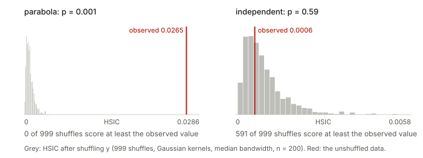

## Links

- **[Interactive version](figures/interactive.html)**: pick (or click in) a data set and watch
  correlation fail where HSIC succeeds; add polynomial features one degree at a time and see
  which cross-covariance lights up; hover over the two centred Gram matrices to see which pairs
  of samples agree; slide the kernel bandwidth from "blind" to "linear" and watch the permutation
  test respond; and compare two representations with CKA while rotating, stretching and warping
  one of them.
- **[Runnable code](https://github.com/msrepo/theory_inclined_papers_with_annotations/blob/main/foundations/hsic/code/hsic.py)**:
  every number on this page, and the three figures (`python3 hsic.py --figures`). `make verify`
  runs it.
- Read first: **[the Gram matrix](../gram-matrix/index.html)**, especially §6 (centring, $HGH$)
  and §7 (kernels and the RBF bandwidth). HSIC is built from exactly those two pieces.
- Related foundations pages: **[four fundamental subspaces](../four-fundamental-subspaces/index.html)**
  (the cross-covariance matrix $X^\top Y$), and the HGR maximal correlation section of
  **[inequalities and concentration](../inequalities-and-concentration/index.html)** (another
  "zero iff independent" measure, compared in §9 below).
- Primary references: A. Gretton, O. Bousquet, A. Smola & B. Schölkopf, *Measuring Statistical
  Dependence with Hilbert–Schmidt Norms*, ALT 2005 (the definition and the estimator);
  A. Gretton, K. Fukumizu, C. H. Teo, L. Song, B. Schölkopf & A. Smola, *A Kernel Statistical
  Test of Independence*, NeurIPS 2007 (the test); S. Kornblith, M. Norouzi, H. Lee & G. Hinton,
  *Similarity of Neural Network Representations Revisited*, ICML 2019 (CKA).

## In one paragraph

Two variables are **independent** when learning one tells you nothing at all about the other.
Correlation checks only one way of "telling": whether $y$ rises or falls along a straight line as
$x$ rises. HSIC checks every way at once, using nothing more than two
[Gram matrices](../gram-matrix/index.html). Build a table of how similar every pair of samples
is in $x$ (the matrix $K$) and another for $y$ (the matrix $L$), centre both, and ask how well
the two tables agree: $\mathrm{HSIC}=\frac{1}{n^2}\sum_{ij}\tilde K_{ij}\tilde L_{ij}$. If pairs
that are unusually alike in $x$ also tend to be unusually alike in $y$, the sum is large. With a
plain dot product as the similarity, this is just the squared covariance. With a Gaussian
similarity it is zero only when the variables are truly independent. The name describes the
same number from the other side: it is the **Hilbert–Schmidt norm** (the Frobenius norm, for
infinitely large matrices) of the table of covariances between every feature of $x$ and every
feature of $y$. A raw HSIC value means little on its own. It is judged against shuffled copies
of the data, and normalising it gives CKA, the standard way to compare two networks'
representations.

## 1. The problem: "uncorrelated" is not "independent"

**Independence in plain words.** $x$ and $y$ are independent if the whole distribution of $y$
(its average, its spread, its shape) is the same whatever value $x$ takes. In symbols,
$p(x,y)=p(x)\,p(y)$: the probability of seeing a particular pair equals the probability of that
$x$ times the probability of that $y$, as if they were drawn by two separate coin-flips. Here
$p(x,y)$ is the **joint** distribution, the one that produced the pairs, and $p(x)$, $p(y)$ are
the **marginals**, what you get by looking at one column of the data and ignoring the other.

**What correlation checks.** Five points on a parabola:

$$
x=(-2,-1,0,1,2),\qquad y=x^2=(4,1,0,1,4).
$$

The covariance is $\operatorname{mean}(xy)-\operatorname{mean}(x)\operatorname{mean}(y)=\operatorname{mean}(x^3)-0\cdot 2=0$,
because the cubes cancel in pairs. So the correlation is exactly $0$, and yet $y$ is a function of
$x$. Correlation only asks "does $y$ go up when $x$ goes up?", and on a parabola it goes up on
one side and down on the other, in exact balance.

<figure>

<figcaption>Figure 1. Correlation (equivalently, HSIC with a linear kernel) sees only the line.
HSIC with a Gaussian kernel sees all four dependent sets and correctly finds nothing in the
fifth. The p-values come from the shuffle test of §7. Try your own data in widget 1 of the
<a href="figures/interactive.html">interactive page</a>.</figcaption>
</figure>

The **funnel** is the subtle one: $y=x\cdot\varepsilon$ with $\varepsilon$ standard normal
noise. The *average* of $y$ is $0$ for every $x$, so no regression of $y$ on $x$ would find
anything. Only the *spread* of $y$ depends on $x$. That still counts as dependence.

## 2. Covariance is already a Gram-matrix formula

Centre each variable by subtracting its mean, $\tilde x_i=x_i-\bar x$ and $\tilde y_i=y_i-\bar y$.
With the $\frac1n$ convention the covariance is $\frac1n\sum_i\tilde x_i\tilde y_i$. Square it
and write the square as a double sum:

$$
\operatorname{Cov}(x,y)^2=\frac{1}{n^2}\Big(\sum_i\tilde x_i\tilde y_i\Big)\Big(\sum_j\tilde x_j\tilde y_j\Big)
=\frac{1}{n^2}\sum_{i,j}\underbrace{(\tilde x_i\tilde x_j)}_{\tilde K_{ij}}\;\underbrace{(\tilde y_i\tilde y_j)}_{\tilde L_{ij}} .
$$

The two brackets are entries of Gram matrices: $\tilde K=\tilde x\tilde x^\top$ holds the dot
products of the centred $x$ values (for numbers, a dot product is just a product) and
$\tilde L=\tilde y\tilde y^\top$ does the same for $y$. So **squared covariance already measures
how well two centred Gram matrices agree, entry by entry**. That is HSIC with the linear kernel.
The code checks it on 50 random pairs: both sides give $0.021972$.

**Vectors.** Let $x\in\mathbb R^p$ and $y\in\mathbb R^q$, stacked as rows of $X$ ($n\times p$)
and $Y$ ($n\times q$). Now there are $p\times q$ covariances, one for each coordinate of $x$
against each coordinate of $y$. They form the **cross-covariance matrix**

$$
C=\tfrac1n\tilde X^\top\tilde Y\quad(p\times q),
$$

and the sum of the squares of all its entries is

$$
\lVert C\rVert_F^2=\sum_{a,b}C_{ab}^2=\frac{1}{n^2}\operatorname{tr}\big(\tilde Y^\top\tilde X\tilde X^\top\tilde Y\big)
=\frac{1}{n^2}\operatorname{tr}\big(\tilde K\tilde L\big),
$$

using $\lVert C\rVert_F^2=\operatorname{tr}(C^\top C)$ and the cyclic rule
$\operatorname{tr}(AB)=\operatorname{tr}(BA)$ to move $\tilde Y$ to the end. Summing the squares of
all covariances on the feature side ($p\times q$) and comparing Gram matrices on the sample side
($n\times n$) are the same computation, the [dual view](../gram-matrix/index.html) again.

A small case: the three points of the Gram matrix page, $x_1=(1,0)$, $x_2=(1,1)$, $x_3=(0,2)$,
with $y=(1,3,2)$. Centring gives

$$
\tilde X=\begin{bmatrix}\tfrac13&-1\\ \tfrac13&0\\ -\tfrac23&1\end{bmatrix},\qquad
\tilde y=\begin{bmatrix}-1\\1\\0\end{bmatrix},\qquad
C=\tfrac13\tilde X^\top\tilde y=\begin{bmatrix}0\\ \tfrac13\end{bmatrix}.
$$

The first coordinate of $x$ has no covariance with $y$ and the second has covariance $\frac13$,
so $\mathrm{HSIC}=0^2+(\frac13)^2=\frac19\approx0.111$, and $\frac19\operatorname{tr}(\tilde K\tilde L)$
gives the same number.

Two remarks that will matter later. First, $\lVert C\rVert_F^2$ is the **sum of the squared
singular values** of $C$ (for a random 3-D against 2-D example in the code, both are
$1.154484$). HSIC adds up the dependence along every direction, not only along the strongest
one; §9 compares measures that keep only the strongest. Second, a shuffle test with the linear
kernel is *exactly* a shuffle test of Pearson's $r$: shuffling $y$ changes neither
$\operatorname{Var}(x)$ nor $\operatorname{Var}(y)$, so ranking shuffles by $\operatorname{Cov}^2$
ranks them by $r^2$. That is why Figure 1 needs only one "linear" row.

## 3. More features, more chances to catch dependence

Here is the key fact, in words. If $x$ and $y$ are independent, then **no feature of $x$ is
correlated with any feature of $y$**: $\operatorname{Cov}(f(x),g(y))=0$ for every pair of
functions $f,g$. The converse also holds if you check a rich enough family of features: if
every such covariance is zero, the variables are independent. So instead of one covariance,
compute many.

Back to the five-point parabola, and give $x$ two features instead of one: $\varphi(x)=(x,\,x^2)$.

$$
\operatorname{Cov}(x,y)=0,\qquad \operatorname{Cov}(x^2,y)=\operatorname{Var}(y)=2.8,
$$

the second because $x^2$ *is* $y$. The sum of squared cross-covariances is
$0^2+2.8^2=7.84$. The dependence was invisible to the feature $x$ and obvious to the feature
$x^2$.

**The kernel trick.** In §2 the features only ever entered through dot products. With the
features $(x,x^2)$ the dot product between two samples is

$$
k(x,x')=\varphi(x)\cdot\varphi(x')=x\,x'+x^2x'^2 .
$$

Put this $k$ into $K$, keep $L=yy^\top$, compute $\frac{1}{n^2}\operatorname{tr}(\tilde K\tilde L)$,
and out comes $7.84$ again, without ever writing down the cross-covariance matrix. This is what
makes it possible to use very many features, even infinitely many.

With $n=200$ samples and the features $(x,x^2,x^3)$ against $(y,y^2,y^3)$, each kind of
dependence lights up a different cell of the $3\times3$ table of correlations:

| Data set | Cell that lights up | Correlation |
|---|---|---|
| parabola | $x^2$ with $y$ | $0.95$ |
| circle | $x^2$ with $y^2$ | $-0.91$ (because $x^2+y^2\approx1$) |
| funnel | $x^2$ with $y^2$ | $0.27$ (big $\lvert x\rvert$, big spread of $y$) |

The funnel is the hardest of the three. Its $x^2$-with-$y^2$ correlation is $0.426$ in the
population ($\sqrt{2/11}$, confirmed on $10^6$ samples), but only $0.27$ in this sample, and two
cells that are exactly zero in the population by symmetry ($x$ and $x^3$ with $y^2$) read $0.18$
and $0.22$. $y^2$ has heavy tails, so its sample correlations are noisy. This matches the funnel's
weaker p-value in Figure 1. Widget 2 of the [interactive page](figures/interactive.html) lets you raise the degree
and watch cells appear.

**The Gaussian kernel includes every degree.** Expand the Gaussian (RBF) kernel for numbers:

$$
e^{-(x-x')^2/2\sigma^2}=e^{-x^2/2\sigma^2}\,e^{-x'^2/2\sigma^2}\,e^{xx'/\sigma^2},
\qquad e^{xx'/\sigma^2}=\sum_{k=0}^{\infty}\frac{(xx')^k}{\sigma^{2k}\,k!}.
$$

So $k(x,x')=\sum_k\varphi_k(x)\varphi_k(x')$ with
$\varphi_k(x)=e^{-x^2/2\sigma^2}\,x^k/(\sigma^k\sqrt{k!})$: one feature for **every power of
$x$**, suitably weighted. The Gaussian kernel is the polynomial-feature idea with all degrees
included at once, which is why it can catch any kind of dependence given enough data.

**Decoding the name.** Now each word has a concrete meaning:

- A **Hilbert space** is a vector space with a dot product that is allowed to have infinitely many
  coordinates, like the list of features $\varphi_0(x),\varphi_1(x),\dots$ above.
- The one built from a kernel is its **RKHS** (reproducing kernel Hilbert space). Its coordinates are
  the kernel's features, and "reproducing" means the dot product there is computed by $k$ itself.
- The **cross-covariance operator** $C_{xy}$ is the table of covariances between every feature
  of $x$ and every feature of $y$: the matrix $C$ of §2, but with infinitely many rows and columns.
- Its **Hilbert–Schmidt norm** is the square root of the sum of squares of all its entries. That is
  the Frobenius norm, carried over to such infinite tables, and it stays finite for the kernels
  used here.

So $\mathrm{HSIC}=\lVert C_{xy}\rVert_{\mathrm{HS}}^2$: the sum of squared covariances between
every feature of $x$ and every feature of $y$.

## 4. The estimator, symbol by symbol

$$
\mathrm{HSIC}_b(X,Y)=\frac{1}{n^2}\operatorname{tr}(KHLH)=\frac{1}{n^2}\sum_{i,j}\tilde K_{ij}\tilde L_{ij}.
$$

| Symbol | Read it as |
|---|---|
| $n$ | number of paired samples $(x_i,y_i)$ |
| $K$, $K_{ij}=k(x_i,x_j)$ | how similar samples $i$ and $j$ are **in $x$** |
| $L$, $L_{ij}=l(y_i,y_j)$ | how similar samples $i$ and $j$ are **in $y$** (the kernel $l$ may differ from $k$) |
| $H=I-\frac1n\mathbf 1\mathbf 1^\top$ | the centring matrix: subtracts means ([Gram matrix §6](../gram-matrix/index.html)) |
| $\tilde K=HKH$, $\tilde L=HLH$ | the same similarities with row and column averages removed |
| $\operatorname{tr}$ | the trace, the sum of the diagonal |
| subscript $b$ | "biased": its average is slightly above zero even for independent data (§7) |

The second form follows from $H^2=H$ and the cyclic rule:
$\operatorname{tr}(KHLH)=\operatorname{tr}(HKH\cdot HLH)=\operatorname{tr}(\tilde K\tilde L)$, and for
symmetric matrices $\operatorname{tr}(\tilde K\tilde L)=\sum_{ij}\tilde K_{ij}\tilde L_{ij}$.
Gretton et al. (2005) divide by $(n-1)^2$ instead of $n^2$. That rescales the number and
changes nothing in a test.

**How to read it.** $\tilde K_{ij}>0$ says "$i$ and $j$ are more alike in $x$ than a typical
pair is". $\tilde L_{ij}>0$ says the same about $y$. Their product is positive when $x$ and $y$
*agree* about the pair (both say alike, or both say different) and negative when they disagree.
HSIC is the average agreement over all $n^2$ pairs.

<figure>

<figcaption>Figure 2. HSIC as agreement between two centred Gram matrices, for the five parabola
points. Widget 3 of the <a href="figures/interactive.html">interactive page</a> does the same
for 40 points, with a shuffle button.</figcaption>
</figure>

**Worked example.** The five parabola points, with Gaussian kernels whose bandwidths come from
the **median heuristic** ($\sigma$ = the median distance between two samples): $\sigma_x=2$,
$\sigma_y=3$. Some cells of Figure 2, read one at a time:

- **The diagonal** is always positive. $\tilde K_{ii}$ is a squared length (of $x_i$'s centred
  feature vector), so it cannot be negative, and neither can $\tilde L_{ii}$.
- **$x=-2$ against $x=-1$**: neighbours in $x$ ($\tilde K=0.24$), but $y=4$ against $y=1$ is far
  ($\tilde L=-0.18$). They disagree: $-0.04$.
- **$x=-2$ against $x=2$**: as far apart as possible in $x$ ($\tilde K=-0.35$), identical in $y$
  ($\tilde L=0.32$). They disagree: $-0.11$. The fold of the parabola maps mirror points to the
  same $y$.
- **$x=-2$ against $x=1$**: far apart in both ($-0.31$ and $-0.18$). They agree: $+0.06$.

The 25 products sum to $0.309$, so $\mathrm{HSIC}_b=0.309/25=0.0123$. **Is that big?** There is
only one fair comparison: the same data with the pairing destroyed. Shuffling the five $y$
values gives 120 possible orderings. They average $0.0177$, *more* than the real pairing, and 68
of the 120 score at least $0.0123$. Four of those 68 are the real pairing itself: swapping the
two 4s or the two 1s changes nothing. So five points carry no evidence of dependence here. The
mirror-point disagreements cancel the neighbour agreements.

This is not a bad choice of bandwidth: across a grid of $\sigma_x$ from $0.5$ to $3$ and
$\sigma_y$ from $0.5$ to $4.5$, the best case still has 44 of the 120 orderings scoring at
least as high as the truth. Five points are simply too few. With 200 noisy points (Figure 1)
the same parabola gives $p=0.001$. Two lessons carry forward. A raw HSIC value means nothing
until it is compared with shuffles (§7). And $\mathrm{HSIC}_b$ is **never negative**: it is the
trace of a product of two PSD matrices. Even independent data score above zero, partly because
the diagonal gives every sum a positive head start.

## 5. What HSIC measures in the population

The formula above is computed from a sample. The quantity it estimates is a property of the
data-generating process. Here $\mathbb E[\cdot]$ means "the average over many random draws".
Draw two pairs $(x,y)$ and $(x',y')$ independently from the joint distribution. Then

$$
\begin{aligned}
\mathrm{HSIC}
&=\underbrace{\mathbb E\big[k(x,x')\,l(y,y')\big]}_{\text{two genuine pairs}}
+\underbrace{\mathbb E\big[k(x,x')\big]\,\mathbb E\big[l(y,y')\big]}_{x\text{'s and }y\text{'s from unrelated draws}}\\[4pt]
&\quad-2\,\underbrace{\mathbb E_{x,y}\Big[\mathbb E_{x'}\big[k(x,x')\big]\,\mathbb E_{y'}\big[l(y,y')\big]\Big]}_{\text{one genuine pair against unrelated partners}} .
\end{aligned}
$$

Read it as a comparison. The first term measures how much "alike in $x$" and "alike in $y$" go
together for real pairs. The second is the same measurement when the $x$ values and the $y$
values have nothing to do with each other. The third is the cross term. If $x$ and $y$ are independent, the
averages factor and all three terms equal $\mathbb E[k]\,\mathbb E[l]$, so
$\mathrm{HSIC}=(1+1-2)\,\mathbb E[k]\,\mathbb E[l]=0$. The sample version of this expansion, with the three averages taken
over the data, equals the trace formula exactly. On a noisy five-point parabola the code gets
$0.4878+0.4629-0.9190=0.0317156010$ both ways.

**HSIC is a distance between two data sets.** Build a fake "independent" version of the data by
pairing every $x_a$ with every $y_b$: $n^2$ pairs, in which any link between $x$ and $y$ is gone
by construction. HSIC is the squared **MMD** (maximum mean discrepancy) between the real cloud of
$n$ pairs and this fake cloud, using the similarity $k(x,x')\,l(y,y')$ between pairs. The code
builds the 5 real and 25 fake pairs of the same example and gets $0.0317156010$ again.

MMD in one line: map every point to its feature vector, average the feature vectors of each
data set, and measure the distance between the two averages. With a **characteristic** kernel,
such as the Gaussian, two different distributions always have different average feature
vectors, much as a distribution is pinned down by all its moments. So, in the population,

$$
\mathrm{HSIC}=0\iff p(x,y)=p(x)\,p(y)\iff x\text{ and }y\text{ are independent}.
$$

Gretton et al. (2005) proved this for universal kernels on compact domains, and later work
extended it to characteristic kernels, which include the Gaussian kernel on $\mathbb R^d$. With
the linear kernel only the forward direction survives: independence gives HSIC $=0$, but HSIC
$=0$ only means "no correlation".

## 6. Which kernel, and what it can see

| Kernel $k(x,x')$ | Its features | HSIC $=0$ means |
|---|---|---|
| linear, $x\cdot x'$ | the coordinates themselves | no correlation between any coordinate of $x$ and any of $y$ |
| polynomial, $(1+x\cdot x')^d$ | all monomials up to degree $d$ | no correlation between any such monomials of $x$ and of $y$ |
| Gaussian, $e^{-\lVert x-x'\rVert^2/2\sigma^2}$ | all degrees (§3) | independence |

The Gaussian kernel's bandwidth $\sigma$ decides what it can actually see from a finite sample.
Both extremes throw the advantage away (compare [Gram matrix §7](../gram-matrix/index.html)):

- **Huge $\sigma$: HSIC becomes linear.** For large $\sigma$,
  $k\approx1-\lVert x-x'\rVert^2/2\sigma^2$, and
  $\lVert x_i-x_j\rVert^2=\lVert x_i\rVert^2+\lVert x_j\rVert^2-2x_i\cdot x_j$. Centring removes
  anything that depends on $i$ alone or on $j$ alone (the constant and the two squared lengths),
  leaving $\tilde K\approx\tilde X\tilde X^\top/\sigma^2$, the linear kernel. So
  $\mathrm{HSIC}\cdot\sigma_x^2\sigma_y^2\to$ linear HSIC.
- **Tiny $\sigma$: every shuffle scores the same.** When no two samples are within $\sigma$ of
  each other, $K\to I$: every point is similar only to itself. Then
  $\tilde K\to H$ and HSIC $\to\frac{1}{n^2}\operatorname{tr}(\tilde L)$, a number that does not
  depend on how the $y$'s are paired with the $x$'s. A test built on it cannot tell the real
  pairing from a shuffled one.

For the $n=200$ parabola (median bandwidths $\sigma_x=0.567$, $\sigma_y=0.276$), scaling both
bandwidths by a common factor gives:

| $\sigma$ / median | shuffle-test $p$ | observed, in null standard deviations above the shuffle mean | note |
|---|---|---|---|
| $0.001$ | $0.34$ | $-0.07$ | the 999 shuffled values spread by only 0.06% of their mean |
| $0.01$ | $0.21$ | $0.78$ | |
| $0.1$ | $0.001$ | $23.5$ | |
| $1$ | $0.001$ | $41.7$ | the median heuristic |
| $10$ | $0.16$ | $0.78$ | |
| $100$ | $0.32$ | $-0.02$ | $\mathrm{HSIC}\cdot\sigma_x^2\sigma_y^2$ is within 1.1% of linear HSIC, whose $p=0.33$ |

In between, the parabola is found overwhelmingly. The **median heuristic** is the usual default
because it puts $\sigma$ at the typical scale of the data, between the two failure modes. It
has no optimality guarantee, though. Put 150 points on the dark squares of a $5\times5$
checkerboard: the squares are $0.4$ wide, smaller than the median distance of $0.61$, and
Pearson $r=-0.04$. At the median bandwidth the test finds nothing ($p=0.29$). At a fifth of it,
$p=0.001$ and the data sit 6.9 null standard deviations above the shuffle average. A kernel
wider than the pattern blurs it away. Widget 4 of the [interactive page](figures/interactive.html)
plots this whole curve for any data set.

## 7. Is it big enough? The permutation test

HSIC is never exactly zero on a sample, so "is it zero?" has to become "is it larger than
chance?". **Shuffling** answers that. Randomly reorder the $y$ values, keeping the $x$ values
where they are. The shuffled data have exactly the same $x$ values and exactly the same $y$
values as before (both marginals are untouched), but any link between them is destroyed. This
simulates the independent world *with your own data*. Repeat 999 times, recompute HSIC each
time, and report

$$
p=\frac{1+\#\{\text{shuffles scoring}\ge\text{observed}\}}{1+999}.
$$

<figure>

<figcaption>Figure 3. The permutation test. Widget 4 of the <a href="figures/interactive.html">interactive
page</a> redraws this histogram as you move the bandwidth.</figcaption>
</figure>

Implementation is cheap. Shuffling $y$ reorders the rows and the columns of $L$ together, and
centring commutes with reordering, so $\tilde L$ can be shuffled directly. Each shuffle then
costs one $n\times n$ elementwise product.

**Why not compare with zero?** Because $\mathrm{HSIC}_b$ is positive even under independence.
For independent data with the median-bandwidth Gaussian kernel, the average over shuffles is

| $n$ | 50 | 100 | 200 | 400 |
|---|---|---|---|---|
| mean HSIC under shuffling | 0.00365 | 0.00192 | 0.00101 | 0.00051 |
| $n\times$ mean | 0.182 | 0.192 | 0.203 | 0.203 |

It shrinks like $1/n$ but never reaches zero. Song et al. (2012) give an unbiased estimator that
removes the diagonal's head start. Gretton et al. (2007) avoid shuffling altogether by fitting a
gamma distribution to the null. For moderate $n$ the shuffle test is the easiest to trust.

## 8. Normalising: CKA

HSIC's size depends on the kernels' scales and on $n$, so an HSIC of $0.02$ means different
things in different settings. Normalise it the way correlation normalises covariance:

$$
\mathrm{CKA}(K,L)=\frac{\mathrm{HSIC}(K,L)}{\sqrt{\mathrm{HSIC}(K,K)\,\mathrm{HSIC}(L,L)}}
=\frac{\langle\tilde K,\tilde L\rangle_F}{\lVert\tilde K\rVert_F\,\lVert\tilde L\rVert_F}.
$$

This is the **cosine of the angle between the two centred Gram matrices**, each unrolled into
one long vector of $n^2$ numbers. It lies between $0$ and $1$, and equals $1$ when the two
tables are proportional. The name is short for centred kernel alignment.

Kornblith et al. (2019) use it to compare representations. Feed the same $n$ inputs through two
layers (or two networks), getting $X$ ($n\times p$) and $Y$ ($n\times q$). With linear kernels,

$$
\mathrm{CKA}_{\text{lin}}=\frac{\lVert\tilde X^\top\tilde Y\rVert_F^2}{\lVert\tilde X^\top\tilde X\rVert_F\,\lVert\tilde Y^\top\tilde Y\rVert_F},
$$

the feature-side form of §2, which stores a $p\times q$ matrix instead of two $n\times n$ ones. Linear CKA is the
same quantity as the older RV coefficient of multivariate statistics. The code checks what it
ignores and what it does not, on a 10-feature representation $X$ with 500 samples:

| $Y$ | linear CKA$(X,Y)$ |
|---|---|
| $XQ$, $Q$ a random rotation | $1.0000$ |
| $3X$ | $1.0000$ |
| $X$ with its five lowest-variance directions shrunk tenfold | $0.9553$ |
| $\tanh(X)$ | $0.8368$ |

It ignores rotations and overall scale, as a comparison of embedding spaces should
([Gram matrix §3](../gram-matrix/index.html)). It is *not* invariant to every invertible linear
map, unlike CCA. Kornblith et al. argue that this is deliberate: a similarity index that ignores
all invertible linear maps gives the same answer for any two representations whose rank equals
the number of examples, which is the usual situation once a layer is wider than the data set.
Such an index cannot tell them apart.

**High-variance directions dominate.** Diagonalise both centred Gram matrices,
$\tilde K=\sum_i\lambda_iu_iu_i^\top$ and $\tilde L=\sum_j\mu_jv_jv_j^\top$. Then

$$
\langle\tilde K,\tilde L\rangle_F=\sum_{i,j}\lambda_i\,\mu_j\,(u_i\cdot v_j)^2 ,
$$

so each pair of principal directions counts in proportion to the *product of their
variances*. The code builds two 10-feature representations that share exactly one direction and
are otherwise unrelated noise. When the shared direction has the same variance as the others,
linear CKA is $0.125$. When its standard deviation is $3\times$ the others', linear CKA is
$0.888$, with nine of the ten directions still unrelated.

## 9. Relatives: COCO, HGR maximal correlation and the H-score

HSIC sums the squared singular values of the cross-covariance operator, $\mathrm{HSIC}=\sum_k s_k^2$.
Its relatives summarise the same kind of object differently:

| Measure | What it keeps | Normalised? |
|---|---|---|
| HSIC | $\sum_k s_k^2$, all directions | no: covariances |
| COCO, constrained covariance (Gretton et al., JMLR 2005) | $s_1$, the single best pair of features $f,g$ | no |
| kernel canonical correlation (Bach & Jordan, JMLR 2002) | the best pair, divided by their spreads (with regularisation) | yes: correlations |
| HGR maximal correlation ([inequalities page](../inequalities-and-concentration/index.html)) | the best pair over *all* functions | yes |
| $\chi^2(P_{XY}\Vert P_XP_Y)$ and the H-score ([Bao et al. note](../2022-bao-hscore-transferability/index.html)) | $\lVert\tilde B\rVert_F^2$, a sum of squared maximal correlations | yes |

In the random linear example of §2 the top singular value is $s_1=1.0623$, so
$s_1^2=1.1284$ out of HSIC's $1.1545$: 97.7% of the dependence lies along one direction, and
HSIC also counts the rest. The last row is worth dwelling on,
because it has the same shape as HSIC: *build a matrix that is zero exactly under independence,
then sum its squared singular values*. The H-score note's $\tilde B$ does it with probabilities
normalised by the marginals, and HSIC does it with kernel covariances. Kernel canonical
correlation approaches HGR as the kernel becomes rich and the regularisation vanishes.

## 10. Where it shows up

- **Independence tests** (Gretton et al., NeurIPS 2007): the construction of §7.
- **Feature selection** (Song, Smola, Gretton, Bedo & Borgwardt, JMLR 2012): keep the features
  whose HSIC with the labels is largest. This paper also gives the unbiased estimator.
- **Comparing networks**: CKA (Kornblith et al., ICML 2019), §8.
- **Removing an unwanted dependence**: add HSIC as a penalty. ReBias (Bahng et al., ICML 2020)
  makes a model's features independent of those of a deliberately biased model. Greenfeld &
  Shalit (ICML 2020) make a regression's residuals independent of its inputs, for robustness to
  covariate shift.
- **Self-supervised learning**: SSL-HSIC (Li, Pogodin, Sutherland & Gretton, NeurIPS 2021)
  maximises HSIC between representations and image identity, and shows that InfoNCE implicitly
  approximates a version of it (compare the [InfoNCE note](../2026-betser-infonce-gaussian/index.html)).
- **Training without backpropagation**: the HSIC bottleneck (Ma, Lewis & Kleijn, AAAI 2020)
  trains each layer to maximise HSIC with the labels while minimising it with the inputs.
- **Domain alignment** in the [MICCAI 2026 DA notes](../miccai2026-domain-adaptation/index.html)
  uses MMD between source and target features. HSIC is the same tool pointed at a different
  pair: the joint distribution against the product of its marginals (§5).

## Questions and doubts

- The bandwidth decides what HSIC can see (§6), yet the default is a heuristic with no
  optimality property. Choosing $\sigma$ to maximise the test statistic on the same data you then
  test invalidates the p-value, unless the data are split first.
- How many samples does a given dependence need? Five points could not show a noise-free
  parabola at any bandwidth tried, while 200 noisy ones showed it at $p=0.001$. The power depends on
  $n$, the kernel and the shape of the dependence together, and there is no simple rule. The $n$
  slider in widget 1 gives a feel for it.
- CKA's eigen-weighting (0.125 against 0.888 for one shared direction) means a claim that "these two
  layers are similar" may rest on a handful of high-variance directions. Reporting CKA after
  whitening, or alongside a per-direction breakdown, would make such claims easier to trust.
- HSIC is symmetric. It says that $x$ and $y$ are related, not which drives which, and it counts
  all dependence equally, whether or not it is the useful kind.
- The Gram matrices are $n\times n$: $10^4$ samples means $10^8$ entries each. Random Fourier
  features and Nyström approximations make this cheaper. How much they change the calibration of
  the permutation test is worth checking before relying on them.
- When HSIC is a training penalty (ReBias, Greenfeld & Shalit), it is estimated on mini-batches. At batch
  size 64 the null mean alone is about $0.2/64\approx0.003$ for the kernel used here, which may
  be comparable to the dependence being removed. Whether the penalty then targets real dependence
  or estimator noise seems under-examined.

## Takeaways

- $\mathrm{HSIC}_b=\frac{1}{n^2}\sum_{ij}\tilde K_{ij}\tilde L_{ij}$: do the two centred Gram
  matrices agree about which pairs of samples are alike?
- With a linear kernel it is the squared covariance, or $\lVert C\rVert_F^2$ for vectors, and it
  is blind to parabolas, circles and funnels. With a Gaussian kernel it has features of every
  degree and is zero only under independence.
- "Hilbert–Schmidt" is the Frobenius norm of the covariance table between all features of $x$ and
  all features of $y$.
- HSIC is the MMD between the joint distribution and the product of its marginals.
- Judge it against shuffles, never against zero. Too wide a bandwidth makes it linear, and too
  narrow a bandwidth makes it blind.
- CKA is the cosine between two centred Gram matrices. It ignores rotation and scale, and it is
  dominated by high-variance directions.
