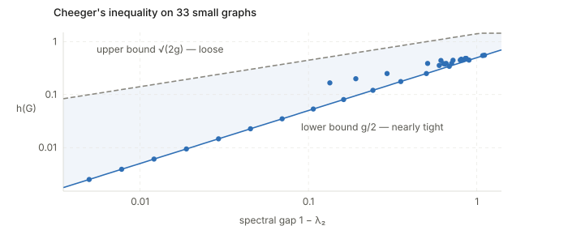

Background for the annotations in this repo. Every paper here is ultimately a chain of
inequalities, and the same dozen tools recur. This page collects them with statements, the
intuition, where each one is used, and — where it is cheap to do so — a numerical check.

It is organised by **what a tool is for**, not by field, because that is how you reach for
one:

1. **Concentration** — a random quantity is close to its mean. *How close, how often?*
2. **Comparison** — bound one quantity you cannot compute by another you can.
3. **Geometry ↔ spectrum** — relate a combinatorial quantity (cuts, partitions) to an
   algebraic one (eigenvalues). Cheeger's inequality and its relatives.
4. **Perturbation** — the input moved a little; how far did the answer move?
5. **Limits** — the exact distribution is intractable; what does it converge to, and how fast?

## Where each tool gets used

A cross-reference for the papers annotated here. Details for each row are in the sections
below.

| Tool | Used in | For what |
|---|---|---|
| Cauchy–Schwarz | Betser Prop. 1 (twice) | bounding $\mathbb{E}[gh]$, then summing over coordinates |
| HGR maximal correlation + DPI | Betser Prop. 1 | the alignment ceiling $\eta_2$ |
| Donsker–Varadhan | Betser Lem. 1; Zhang Lem. B.2 | lower-bounding $\mathrm{KL}(\mu\Vert\sigma)$ by $\lVert m(\mu)\rVert^2$ |
| KL chain rule | Betser Prop. 3; Zhang Prop. 3 | splitting radial from angular |
| Concentration on the sphere | Betser Lem. 1, Asm. 2 | the constant in Lemma 1; thin-shell |
| Maxwell–Poincaré CLT | Betser Cor. 1 | uniform on $S^{d-1}$ $\Rightarrow$ Gaussian projections |
| Diaconis–Freedman rate | Betser Thm. 2 | $d_{\mathrm{TV}} \le 2(k+3)/(d-k-3)$ |
| Slutsky | Betser Prop. 2 | lifting the sphere result to $\mathbb{R}^d$ |
| Berry–Esseen | Betser, discussion | finite-$d$ rates |
| Cheeger's inequality | HaoChen (via $\rho_m$); Zhang (inherited) | conductance $\leftrightarrow$ spectral gap |
| Higher-order Cheeger | HaoChen Thm. 3.7 | $\rho_m \leftrightarrow \lambda_m$, hence the $\rho^2$ |
| Eckart–Young–Mirsky | HaoChen Lem. 3.1–3.2 | minimiser of $\lVert\bar A - FF^\top\rVert_F^2$ is the top eigenvectors |
| Rademacher + symmetrisation | HaoChen Thm. 4.1 | finite-sample bound on the population loss |
| Bounded differences | HaoChen Thm. 4.1, 5.1 | the $\sqrt{\log(1/\delta)/n}$ terms |
| Davis–Kahan (in spirit) | HaoChen Thm. 4.2 | why the bound has $k\epsilon/\Delta$ |
| Weyl's inequality | Zhang §B.3 | effect of the $\epsilon W$ perturbation |
| Wigner semicircle law | Zhang §B.3, Thm. B.4 | spectrum of the noise; the Kepler-equation term |
| Jensen | everywhere, implicitly | convexity of $\log\sum\exp$; $\Phi(\mu) \ge \Phi(\sigma)$ |

## 1. Comparison: the workhorses

### Cauchy–Schwarz

$$
\lvert \langle a, b\rangle \rvert \le \lVert a\rVert \cdot \lVert b \rVert,
\qquad\text{or}\qquad
\big(\mathbb{E}[XY]\big)^2 \le \mathbb{E}[X^2]\,\mathbb{E}[Y^2].
$$

Equality iff $a$ and $b$ are parallel. Unremarkable until you notice how much work it does.
In Betser et al.'s Proposition 1 it appears **twice, in different guises**, and seeing the
difference is instructive:

- *As an expectation bound.* $\mathbb{E}[g(X)h(Y)] \le \rho_m \sqrt{\operatorname{Var}(g)\operatorname{Var}(h)}$ —
  Cauchy–Schwarz in $L^2(\mathbb{P})$, with the HGR constant improving the naive bound.
- *As a sequence bound.* $\sum_k \sqrt{a_k b_k} \le \sqrt{\sum_k a_k}\sqrt{\sum_k b_k}$ —
  the same inequality in $\ell^2$, applied to the vector of per-coordinate variances.

A useful habit: whenever a proof sums a product over an index, expect Cauchy–Schwarz to
collapse it into a product of two norms.

### Jensen's inequality

For convex $\varphi$: $\varphi(\mathbb{E}[X]) \le \mathbb{E}[\varphi(X)]$, reversed for
concave $\varphi$.

This is the silent partner in every contrastive-learning proof, because $\log\sum\exp$ is
convex. It is why Betser et al.'s uniformity potential
$\Phi(\mu) = \mathbb{E}_u \log \mathbb{E}_v \exp(\alpha u\cdot v)$ has a *minimum* at the
uniform law rather than a maximum, and why swapping an expectation past a $\log$ is a move
that costs you something in a known direction.

### Markov → Chebyshev → Chernoff: the concentration ladder

Each rung buys sharper tails by assuming more.

| Assume | Bound | Tail |
|---|---|---|
| $X \ge 0$ | $\Pr[X \ge t] \le \mathbb{E}[X]/t$ (**Markov**) | $1/t$ |
| finite variance | $\Pr[\lvert X - \mu\rvert \ge t] \le \sigma^2/t^2$ (**Chebyshev**) | $1/t^2$ |
| bounded / sub-gaussian MGF | $\Pr[\lvert \bar X - \mu \rvert \ge t] \le 2e^{-2nt^2/(b-a)^2}$ (**Hoeffding**) | $e^{-nt^2}$ |

The jump from polynomial to exponential is what makes learning theory work at all: it is the
difference between needing $O(1/\epsilon^2\delta)$ samples and $O(\log(1/\delta)/\epsilon^2)$.
Chebyshev follows from Markov applied to $(X-\mu)^2$; Chernoff-type bounds follow from Markov
applied to $e^{\lambda X}$ and then optimising $\lambda$. **Every concentration bound in these
papers is Markov's inequality applied to a cleverly chosen function.**

### McDiarmid / bounded differences

If $f(x_1,\dots,x_n)$ changes by at most $c_i$ when coordinate $i$ alone changes, then

$$
\Pr\big[\lvert f - \mathbb{E}f\rvert \ge t\big] \le 2\exp\!\left(\frac{-2t^2}{\sum_i c_i^2}\right).
$$

The generalisation of Hoeffding from sums to *any* stable function, which is what you need for
a supremum over a hypothesis class. This is the source of the $\sqrt{\log(2/\delta)/n}$ term
in HaoChen et al.'s Theorem 4.1 and the $\sqrt{\log(1/\delta)/n}$ in Theorem 5.1. When you see
that shape, McDiarmid or Hoeffding is underneath.

### Rademacher complexity and symmetrisation

$$
\hat{\mathcal{R}}_n(\mathcal{F}) := \mathbb{E}_\varepsilon\left[\sup_{f\in\mathcal{F}} \frac{1}{n}\sum_{j=1}^n \varepsilon_j f(x_j)\right], \qquad \varepsilon_j \in \{\pm 1\} \text{ uniform},
$$

measuring how well the class can correlate with pure noise — its effective capacity. The
**symmetrisation** lemma says the generalisation gap is controlled by it:

$$
\mathbb{E}\left[\sup_{f} \big(\mathbb{E}f - \hat{\mathbb{E}}_n f\big)\right] \le 2\,\hat{\mathcal{R}}_n(\mathcal{F}).
$$

Combine with McDiarmid for the high-probability version, and you have the standard two-term
bound: *empirical risk + capacity + confidence*. HaoChen et al. extend it to vector-valued $f$
by taking the worst output coordinate, which is why their constants carry factors of $k$.

An important precondition, easy to skip past: **symmetrisation needs an unbiased empirical
estimator.** This is exactly why HaoChen et al. can close the finite-sample gap for the
spectral contrastive loss but not for InfoNCE — the spectral loss's empirical version is
unbiased (their negative term averages over the $n(n-1)$ ordered pairs $i \ne j$ for precisely
this reason), whereas InfoNCE's batch denominator is biased at finite batch size. The choice
of loss is not cosmetic; it is what makes the standard toolbox applicable.

## 2. Information-theoretic tools

### KL divergence, and the chain rule

$\mathrm{KL}(P\Vert Q) = \int \log\frac{dP}{dQ}\,dP \ge 0$, zero iff $P = Q$. Not a metric —
asymmetric, no triangle inequality — but it decomposes beautifully, which is what matters
here. The **chain rule** under a disintegration $P(dz) = P_1(dx)\,P_2(dy\mid x)$:

$$
\mathrm{KL}(P\Vert Q) = \mathrm{KL}(P_1\Vert Q_1) + \int \mathrm{KL}\big(P_2(\cdot\mid x)\,\Vert\, Q_2(\cdot\mid x)\big)\,P_1(dx).
$$

Both Betser et al. and Zhang et al. use exactly this to split a law on $\mathbb{R}^d$ into
angular and radial parts. The payoff is always the same: the second term is $\ge 0$ and can
be zeroed by matching the conditional, which *removes a whole dimension of the optimisation
for free*. Whenever an objective sees only part of a decomposition, look for a chain rule to
solve the invisible part in closed form.

### Donsker–Varadhan variational formula

$$
\mathrm{KL}(\mu\Vert\sigma) = \sup_{\varphi}\Big\{\mathbb{E}_{u\sim\mu}[\varphi(u)] - \log\mathbb{E}_{u\sim\sigma}\big[e^{\varphi(u)}\big]\Big\}.
$$

KL as a *supremum over test functions*. This is the single most useful identity for getting
**lower** bounds on KL, because a supremum is bounded below by any particular choice — pick a
convenient $\varphi$ and you are done, with no need to evaluate the divergence.

Both Betser et al. (Lemma 1) and Zhang et al. (Lemma B.2) use it the same way: choose
$\varphi$ linear in the direction of the mean, $\varphi(u) = t\,\langle m(\mu)/\lVert m(\mu)\rVert, u\rangle$,
so the first term is $t\lVert m(\mu)\rVert$ and the second is the log-MGF of a spherical
marginal — which sub-gaussian concentration on the sphere bounds by $O(t^2/d)$. Optimising $t$
yields

$$
\mathrm{KL}(\mu\Vert\sigma) \ge C(d-1)\lVert m(\mu)\rVert^2 .
$$

The $(d-1)$ is the whole point of Betser et al.'s Theorem 1: it grows with dimension, so the
KL penalty for being off-centre outgrows the $\alpha(1-\eta_2)\lVert m\rVert^2$ alignment
reward, and the uniform law wins in high dimensions.

### Pinsker's inequality

$$
d_{\mathrm{TV}}(P,Q) \le \sqrt{\tfrac{1}{2}\mathrm{KL}(P\Vert Q)}.
$$

The standard bridge from KL to total variation, i.e. from an information quantity to a
probability of distinguishing. Not invoked explicitly in these three papers, but it is the
reason KL bounds are worth having at all — and note the square root, the same loss of
sharpness that appears in Cheeger.

### HGR maximal correlation and its data-processing inequality

$$
\rho_m(X,Y) = \sup_{\substack{\mathbb{E}\varphi = \mathbb{E}\psi = 0\\ \operatorname{Var}\varphi = \operatorname{Var}\psi = 1}} \mathbb{E}[\varphi(X)\psi(Y)] \in [0,1].
$$

Pearson correlation after optimal nonlinear reshaping of both variables. Unlike Pearson,
$\rho_m = 0$ **iff** $X \perp Y$. Its defining property gives, for any mean-zero
square-integrable $g, h$,

$$
\mathbb{E}[g(X)h(Y)] \le \rho_m(X,Y)\sqrt{\operatorname{Var}(g)\operatorname{Var}(h)},
$$

a strict improvement on plain Cauchy–Schwarz whenever $\rho_m < 1$.

The **multiplicative data-processing inequality** is what makes it powerful: for a Markov
chain $X - Y - Z$,

$$
\rho_m(X,Z) \le \rho_m(X,Y)\,\rho_m(Y,Z).
$$

*Dependence decays multiplicatively along a chain.* Betser et al. apply it to
$X \leftarrow X_0 \rightarrow Y$ (two views of one base image) to get
$\rho_m(X,Y) \le \sqrt{\eta_2}\cdot\sqrt{\eta_2} = \eta_2$ — a hard ceiling on positive-pair
alignment that **no encoder can beat**. Worth contrasting with mutual information, which also
obeys a DPI but an *additive* one; the multiplicative form is what produces a clean
multiplicative ceiling here.

## 3. Geometry ↔ spectrum: Cheeger and relatives

This is the family that lets you convert statements about *cuts* into statements about
*eigenvalues*, and it is the backbone of the augmentation-graph papers.

### Conductance

For a vertex set $S$, with $\operatorname{vol}(S) = \sum_{x\in S} w_x$:

$$
\phi(S) = \frac{\text{weight leaving } S}{\operatorname{vol}(S)},
\qquad
h(G) = \min_{S} \frac{\text{cut}(S)}{\min\{\operatorname{vol}(S), \operatorname{vol}(S^c)\}}.
$$

$h(G)$ is the **Cheeger constant**: the best bottleneck in the graph. Small $h$ means a good
sparse cut exists. Computing it exactly is NP-hard in general — which is the entire motivation
for what follows.

> A practical note from checking this numerically: the equivalent definition "minimise
> $\phi(S)$ over $S$ with $\operatorname{vol}(S) \le \operatorname{vol}(V)/2$" has a
> floating-point trap. On a symmetric two-cluster graph the balanced cut has
> $\operatorname{vol}(S)$ *exactly* half, so a strict `>` test can discard the optimal cut and
> report a spuriously large $h$ — which then appears to violate Cheeger's inequality. The
> $\min\{\operatorname{vol}(S),\operatorname{vol}(S^c)\}$ form has no boundary case.

### Cheeger's inequality

With $\lambda_2$ the second-largest eigenvalue of the normalised adjacency $\bar A$, so that
$g := 1 - \lambda_2$ is the spectral gap (equivalently the second-smallest eigenvalue of the
normalised Laplacian $L = I - \bar A$):

$$
\boxed{\;\frac{g}{2} \;\le\; h(G) \;\le\; \sqrt{2g}\;}
$$

**What it says.** A graph has a sparse cut *if and only if* it has a small spectral gap. An
NP-hard combinatorial quantity is pinned, up to a square root, by an eigenvalue you can
compute in polynomial time.

**The two directions are not equally easy.**

- *Lower bound $g/2 \le h$ (easy).* Take the indicator of the optimal cut, plug it into the
  Rayleigh quotient for $L$ as a test vector. Since $\lambda_2$ is a minimum over test
  vectors orthogonal to the trivial one, any test vector gives an upper bound on the gap —
  hence a lower bound on $h$. One line, essentially.
- *Upper bound $h \le \sqrt{2g}$ (hard).* Requires going the other way: from the Fiedler
  vector *back* to an actual cut, by sweeping a threshold across its entries and arguing that
  some threshold gives a good cut. That rounding argument is where the square root is lost.

**How tight is it really?** Worth knowing rather than assuming. Computing $h$ exactly by brute
force over all subsets for 33 graphs of 10–12 vertices — two-cluster graphs with the bridge
weight swept over three orders of magnitude, weighted random graphs, and cycles:

<figure>

<figcaption>All 33 graphs land inside the band, as they must. But the two sides behave very
differently: the ratio $h/(g/2)$ has median <b>1.09</b> and minimum <b>1.00</b> — the lower
bound is nearly tight, and exactly attained by the symmetric two-cluster graphs. The ratio
$h/\sqrt{2g}$ has median <b>0.33</b> and drops to <b>0.02</b> at the small-gap end — the
square-root side is loose by 3× typically and up to 50×.</figcaption>
</figure>

**Why this matters for the papers.** The loose direction is the one HaoChen et al. need. They
have a combinatorial assumption ($\rho_m$ large) and want a spectral conclusion, so they pay
the square. That is exactly why Theorem 3.7 reads
$\tilde O(\alpha/\rho_{\lfloor k/2\rfloor}^2)$ with $\rho$ **squared**: the square is not a
statement about data, it is the price of the rounding argument. If someone proves a tighter
higher-order Cheeger inequality, that exponent improves for free.

### Higher-order Cheeger

Cheeger bipartitions. For $m$ parts, the relevant statement (Lee–Oveis Gharan–Trevisan) is

$$
\frac{1 - \lambda_m}{2} \;\lesssim\; \rho_m \;\lesssim\; O(m^2)\sqrt{1 - \lambda_m},
$$

where $\rho_m$ is the sparsest $m$-partition. This is what actually underwrites HaoChen et
al.'s use of $\rho_m$: *many eigenvalues near 1 $\Leftrightarrow$ the graph splits into many
weakly-connected pieces.* It is the rigorous version of "count the eigenvalues near 1 to count
the clusters", and it is why raising the feature dimension $k$ — which lets the analysis invoke
a larger $m$, hence a larger $\rho_m$ — improves the bound.

### Eckart–Young–Mirsky

Not an inequality but an exact optimality statement, and load-bearing enough to belong here.
The best rank-$k$ approximation of $M$ in Frobenius (or spectral) norm is its truncated SVD:

$$
\min_{\operatorname{rank}(F) \le k} \lVert M - F\rVert_F^2 = \sum_{i > k}\sigma_i^2 .
$$

Applied to $M = \bar A$ and $F = FF^\top$, this is what turns the spectral contrastive loss
from "a loss that vaguely encourages spreading out" into "an objective whose minimiser is
*exactly* the top-$k$ eigenvectors, up to a right rotation". The residual $\sum_{i>k}\lambda_i^2$
is why the eigenvalues beyond $k$ — the ones $\lambda_{k+1}$ tracks — are what governs quality.

### Weyl's inequality and Cauchy interlacing

**Weyl:** for symmetric $M, E$, every eigenvalue moves by at most the perturbation's norm:

$$
\lvert \lambda_i(M + E) - \lambda_i(M)\rvert \le \lVert E\rVert_2 .
$$

Crude but unconditional, and the first thing to reach for when a matrix is perturbed. It is
what licenses Zhang et al.'s claim that adding $\epsilon W$ to their idealised adjacency
matrix does not destroy the spectral structure, provided $\epsilon\lVert W\rVert_2$ stays well
below the gap between the class modes and the bulk.

**Cauchy interlacing:** deleting a row and column of a symmetric matrix interlaces the
eigenvalues, $\lambda_{i+1}(M) \le \lambda_i(M') \le \lambda_i(M)$. The reason removing data
points cannot move the spectrum arbitrarily — background for any "what if we delete examples"
argument.

### Davis–Kahan

Weyl controls eigen*values*; Davis–Kahan controls eigen*vectors*:

$$
\sin\Theta\big(\text{span}_k(M), \text{span}_k(M+E)\big) \lesssim \frac{\lVert E\rVert_2}{\text{gap}} .
$$

The subspace moves in proportion to the perturbation **divided by the eigenvalue gap** around
the cut. If the eigenvalues at the truncation boundary are nearly tied, the top-$k$ subspace is
ill-determined and an arbitrarily small perturbation can rotate it a lot.

This is precisely the shape of HaoChen et al.'s Theorem 4.2, whose penalty term is
$k\epsilon/\Delta$ with $\Delta = \lambda_{\lfloor 3k/4\rfloor} - \lambda_k$. The moral: any
result that learns a subspace by truncating a spectrum *must* carry a gap condition somewhere,
and if the spectrum has a long flat bulk — which is exactly what both the toy graph in the
HaoChen notes and Zhang et al.'s construction exhibit — that term is the one to worry about.

### Wigner's semicircle law

For a symmetric $N \times N$ matrix with i.i.d. mean-zero unit-variance entries, the
eigenvalues of $W/\sqrt N$ converge to the semicircle density on $[-2, 2]$:

$$
p(x) = \frac{1}{2\pi}\sqrt{4 - x^2}.
$$

Random noise has a *predictable, compactly supported* spectrum — so a perturbed matrix looks
like the original spikes plus a semicircular bulk of width $O(\epsilon\sqrt N)$. This is why
Zhang et al.'s relaxation is analysable rather than hopeless, and where the Kepler equation in
their Theorem B.4 comes from: solving for a quantile of the semicircle CDF gives an equation of
exactly the form $\tfrac{1}{2}x\sqrt{4-x^2} + 2\arcsin(x/2) = c$.

It is also the practical lesson for reading any real spectrum: **a bulk is not signal.** Only
eigenvalues separated from the bulk carry structure.

## 4. Limits and rates

### Concentration of measure on the sphere

A 1-Lipschitz function on $S^{d-1}$ with uniform measure concentrates around its mean with
sub-gaussian tails of scale $1/\sqrt d$:

$$
\Pr\big[\lvert F(u) - \mathbb{E}F\rvert \ge t\big] \le 2e^{-cdt^2}.
$$

In particular each coordinate of a uniform $u$ is sub-gaussian with parameter $O(1/\sqrt d)$ —
the fact that supplies the constant in Betser et al.'s Lemma 1. High-dimensional spheres are
strange: almost all the measure sits near any equator, which is the same phenomenon as the
**thin shell** effect (Betser's Assumption 2, and the $r^{d-1}e^{-\lambda r^2}$ radial law),
where a high-dimensional Gaussian's mass concentrates on a sphere of relative width
$O(1/\sqrt d)$.

### Maxwell–Poincaré spherical CLT, with a rate

For $U_d$ uniform on $S^{d-1}$ and fixed $k$:

$$
\sqrt d\,(U_{d,1},\dots,U_{d,k}) \Rightarrow \mathcal{N}(0, I_k),
\qquad
d_{\mathrm{TV}} \le \frac{2(k+3)}{d-k-3} \quad (1 \le k \le d-4).
$$

*The sphere is Gaussian in high dimension, viewed through any fixed low-dimensional window.*
The explicit Diaconis–Freedman rate is what makes Betser et al.'s asymptotic statement useful
at finite $d$: $O(1/d)$, so $d = 128$ already gives total variation $\lesssim 0.05$ for small
$k$. Worth having a rate rather than a bare limit — an asymptotic claim with no rate cannot be
checked against an experiment.

### Slutsky's theorem

If $X_n \Rightarrow X$ in distribution and $Y_n \to c$ in probability, then
$Y_n X_n \Rightarrow cX$. Mundane, and exactly the glue Betser et al.'s Proposition 2 needs:
$\sqrt d\,z_k = r\cdot(\sqrt d\,u_k)$, with the direction converging in distribution and the
radius converging in probability to $r_0$, gives $\mathcal{N}(0, r_0^2 I_k)$.

The condition worth noticing: $Y_n$ must converge to a *constant*. If the radius kept a
non-degenerate distribution, the limit would be a **scale mixture** of Gaussians — heavy-tailed,
and rejected by exactly the normality tests those papers run. The thin-shell assumption is not
decoration; without it the conclusion is false.

### Berry–Esseen

$$
\sup_t \big\lvert \Pr[\bar S_n \le t] - \Phi(t) \big\rvert \le \frac{C\rho_3}{\sigma^3\sqrt n}.
$$

The CLT with a rate: $O(n^{-1/2})$, given a third moment. The generic answer to "the limit is
Gaussian, but how far off am I at finite $n$?", and the source of the $O(N^{-1/2})$ figure in
Betser et al.'s discussion of finite batch sizes.

## Patterns worth internalising

- **Every concentration bound is Markov in disguise**, applied to $X$, to $(X-\mu)^2$, or to
  $e^{\lambda X}$. If you remember only one inequality, remember Markov.
- **Square roots mark rounding arguments.** Cheeger's $\sqrt{2g}$ and Pinsker's
  $\sqrt{\mathrm{KL}/2}$ both appear when converting a continuous/spectral object back into a
  discrete decision. That is why HaoChen et al.'s bound has $\rho^2$ — the square is the cost
  of the conversion, not a property of the data.
- **A variational formula is a lower-bound machine.** Donsker–Varadhan turns "evaluate this
  divergence" into "guess a good test function", which is almost always easier.
- **Gaps in the denominator mean identifiability.** Whenever a bound divides by an eigenvalue
  gap (Davis–Kahan, HaoChen Thm. 4.2), the real content is that the object being estimated must
  be well-separated to be recoverable at all.
- **Chain rules buy free dimensions.** If your objective is blind to part of a decomposition,
  a chain rule lets you solve that part exactly and shrink the problem.
- **Dimension is sometimes an ally.** Concentration on the sphere, thin shells, and the
  $(d-1)$ factor in Betser et al.'s Lemma 1 all *improve* with dimension. The curse of
  dimensionality has a blessing attached.

## Sources

Standard references rather than the papers themselves:

- Roman Vershynin, *High-Dimensional Probability* (2018) — sub-gaussian tails, concentration on
  the sphere, Davis–Kahan, Wigner. The single best starting point.
- Fan Chung, *Spectral Graph Theory* (1997) — Cheeger, the normalised Laplacian, conductance.
- Lee, Oveis Gharan & Trevisan, *Multiway spectral partitioning and higher-order Cheeger
  inequalities* (JACM 2014) — the $\rho_m \leftrightarrow \lambda_m$ statement.
- Boucheron, Lugosi & Massart, *Concentration Inequalities* (2013) — McDiarmid, bounded
  differences, the whole ladder.
- Dupuis & Ellis, *A Weak Convergence Approach to the Theory of Large Deviations* (2011) —
  Donsker–Varadhan and the KL chain rule, as cited by both contrastive papers.
- Diaconis & Freedman, *A dozen de Finetti-style results in search of a theory* (1987) — the
  spherical CLT rate.
