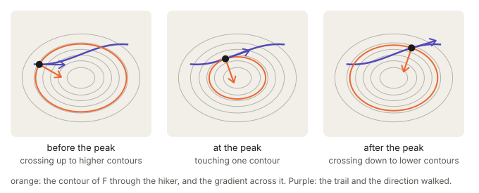
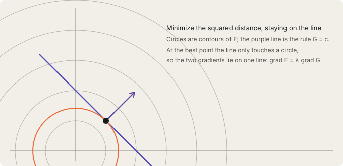
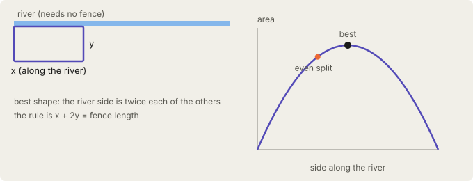

## Links

- **[Source of the story: YouTube video on the Lagrange multiplier](https://www.youtube.com/watch?v=54EP7DSVWPE)**.
  The hiking trail, the contour-map argument, the fence by the river, shadow prices, the bead on a wire,
  the box of gas and the list of limits all follow that video. They are retold here in my own words
  from its transcript. The tangency figure, the maximum-entropy die and the $\theta$–$\eta$ figure are
  my additions, linking the idea to exponential families.
- **[Interactive companion](figures/interactive.html)**: six widgets: walk a hiker along the trail, the
  before/at/after snapshots, slide along a line to a circle, resize the fenced field and its budget,
  tilt a die under a mean constraint, and move between $\theta$ and $\eta$.
- **[Fisher information](../fisher-information/index.html)**: the slope of the $\theta$–$\eta$ curve at the end.
- **[Dually flat structure (Amari)](../2016-amari-dually-flat-structure/index.html)**: where the pair
  $(\theta,\eta)$ becomes the two coordinate systems of the geometry.

## In one paragraph

Many problems ask for the best value of a quantity $F$ while obeying a rule $G=c$: the highest point
you can reach on a trail, the most area from a fixed length of fence, the distribution of most entropy
with a fixed average. Setting the derivative of $F$ to zero is the wrong test, because the best point
on the trail is usually not flat ground. The right test is geometric. At the best point the trail
touches a contour line of $F$ without crossing it, so the two gradients lie on one line:
$\nabla F=\lambda\nabla G$. The factor $\lambda$, the Lagrange multiplier, is more than bookkeeping.
It is the price of the rule: how fast the best achievable value changes when the rule is loosened.

## The question: the best point on a trail

You hike along a trail on a mountainside and want the highest point you will reach while staying on it.
The summit does not help, since the trail never goes there. This is a different question from "where is
the top of the mountain".

The usual move, looking for flat ground, fails here. The best point on the trail is generally not flat
ground, and the slope may still point uphill right where you stand: you would keep climbing if the trail
let you.

Call the quantity to maximise $F$ (the height) and write the trail as $G(x,y)=c$. Substituting the
rule into $F$ and differentiating is possible for easy rules, but a circle is not a single function of
$x$, many rules cannot be solved for either variable, and with ten variables and three rules the
substitutions become a problem of their own. The picture below avoids solving the rule at all.

## The map picture: the trail must touch a contour

A contour line is a curve of constant height, so walking along it goes neither up nor down. The gradient
$\nabla F$ is the steepest-uphill direction, and because moving along a contour changes nothing, it
points straight across the contour, perpendicular to it.

Now draw the trail on the same map. At first it cuts across one contour after another, each higher than
the last: you are still climbing. After the peak it crosses them the other way: you descend. At the
highest point it is not crossing at all. It touches one contour and turns away.

> At the best point, the trail and a contour of $F$ are tangent.

If the trail still crossed a contour there, one direction along it would reach a higher one, so you would
not yet be at the maximum. The three panels above are the same trail at three moments, with the hiker's
own contour in orange. (The [interactive page](figures/interactive.html) lets you walk the trail and
watch the arrows.)

## From tangent curves to one equation

- $\nabla F$ is perpendicular to $F$'s contour.
- The trail is itself a contour of $G$ (every point on it gives $G$ the same value), so $\nabla G$ is
  perpendicular to the trail.
- Tangent curves have parallel normals. So at the best point the two gradients lie on one line. They need
  not have the same length, so one is a multiple of the other:

$$\nabla F=\lambda\,\nabla G .$$

In two dimensions this is two equations, one per component, plus the rule $G=c$ itself: three equations
for three unknowns $x,y,\lambda$.

The same thing packages into one function, the Lagrangian,

$$\mathcal L(x,y,\lambda)=F(x,y)-\lambda\big(G(x,y)-c\big).$$

Setting every partial derivative of $\mathcal L$ to zero gives exactly those three equations;
$\partial\mathcal L/\partial\lambda=0$ just re-imposes the rule. One extra unknown turns a constrained
problem into an unconstrained one.

**Why the condition is right.** Stand on the trail and take a small allowed step $d$. It keeps $G$
unchanged, so $d\perp\nabla G$. At the best point $F$ must not change for any such step, so $\nabla F$
has no component along the allowed directions, so it is parallel to $\nabla G$.

## A first concrete example: the nearest point on a line

Find the point on the line $x+y=c$ closest to the origin. Here $F=x^2+y^2$ (squared distance), whose
contours are circles around the origin, and the rule is $G=x+y=c$. Slide along the line: the circle
through your point shrinks, then grows. At the turning point the line only touches a circle, $\nabla F$
points straight away from the origin and $\nabla G=(1,1)$ is perpendicular to the line, and the two are
parallel. Solving $\nabla F=\lambda\nabla G$ gives $x=y$, and the rule then places the point at
$x=y=c/2$. The interactive page has a slider for the point and one for $c$.

## The fence by the river, and what $\lambda$ really means

You have 40 m of fencing and want to enclose a rectangular field with a straight river as one side. Let
$x$ be the side along the river and $y$ each of the other two sides. The area is $F=xy$ and the rule is
$G=x+2y=40$.

- $\nabla F=(y,\,x)$: making $x$ longer adds a strip of width $y$, making $y$ longer adds a strip of
  length $x$.
- $\nabla G=(1,\,2)$: a metre of $x$ costs one metre of fence, a metre of $y$ costs two.
- Parallel gradients give $y=\lambda$ and $x=2\lambda$. Back in the rule, $4\lambda=40$, so $\lambda=10$,
  $y=10$ m, $x=20$ m. The river side is twice each of the others.

Sharing the fence evenly over three sides (about 13.3 m each) gives roughly 178 m². The Lagrange shape
gives 200 m². The "even split" is not best because one side needs no fence.

The multiplier came out as 10. Now give yourself 41 m instead of 40. The best area rises by a little more
than 10 m². That match is the point.

**Why $\lambda$ is a price.** Loosen the rule slightly. As the best point moves, $F$ changes by
$\nabla F\cdot(\text{move})$, and at the optimum $\nabla F=\lambda\nabla G$. So whatever change the move
makes in $G$, it makes $\lambda$ times as much in $F$. And the change in $G$ is exactly how far you
loosened the rule. So the best achievable value $F^*(c)$ obeys

$$\frac{dF^*}{dc}=\lambda .$$

(For the fence the best area is $F^*(L)=L^2/8$, whose slope $L/4$ is exactly the $y$ we found, which is
$\lambda$. At 40 m that slope is 10. Going from 40 to 41 m adds slightly more than the slope at 40,
because the slope itself is still growing along the way.)

**Shadow prices.** An economist reads the same fact as: for a company maximising profit under a fixed
budget, the multiplier on the budget is the extra maximum profit from one more dollar. A multiplier of
1.3 means a dollar more is worth about \$1.30. It never appears on an invoice, hence "shadow price".

**A bead on a wire.** Gravity pulls the bead down and the wire must push back to keep it on its path.
Write the wire as a rule and the multiplier is the force the wire exerts, without modelling the wire.

## The general statement

Optimise $f(x)$, $x\in\mathbb R^n$, subject to rules $g_1(x)=\dots=g_m(x)=0$. Stationary points of

$$\mathcal L(x,\lambda)=f(x)-\sum_i\lambda_i g_i(x)$$

satisfy $\nabla f=\sum_i\lambda_i\nabla g_i$ and all $g_i=0$. The gradient of $f$ must lie in the span of
the rule normals: no allowed direction is left to improve in. With one rule and two unknowns this is the
tangent-contour picture; with more rules it is the same statement in more dimensions. The price reading
carries over, with one price $\lambda_i$ per rule: $\partial f^*/\partial c_i=\lambda_i$ (the envelope
theorem).

## Maximum entropy: a box of gas, and a die

Take a box of gas whose molecules share a fixed total energy. Among all ways to spread probability over
the states, take the one of greatest entropy, subject to two rules: the probabilities sum to 1, and the
average energy is fixed. Two rules give two multipliers, and the answer is the Boltzmann distribution:
the probability of a state falls exponentially with its energy.

The multiplier on the energy rule is $1/(kT)$. By the price reading it measures how much extra maximum
entropy one more unit of energy buys. That also explains the direction of heat flow. Give a unit of energy
to a cold object and its entropy rises a lot; take it from a hot one and its entropy falls less. The total
rises, so heat flows from hot to cold.

A die is the same problem in miniature. Maximise $H(p)=-\sum_i p_i\log p_i$ subject to $\sum_i p_i=1$
and $\sum_i i\,p_i=m$. The Lagrangian carries one multiplier per rule:

$$\mathcal L=H(p)-\alpha\Big(\sum_i p_i-1\Big)-\lambda\Big(\sum_i i\,p_i-m\Big).$$

Setting $\partial\mathcal L/\partial p_i=0$ gives $-\log p_i-1=\alpha+\lambda i$, hence

$$p_i\;\propto\;e^{-\lambda i}.$$

This is an exponential family. The multiplier is the natural parameter (with a sign), and the quantity you
constrained, here the roll value, is the sufficient statistic. Several constrained averages $E[T_k]$ give
$p\propto\exp\!\big(\sum_k\lambda_kT_k\big)$.

A required mean of 3.5 is what a fair die already has, so the rule costs nothing: $\lambda=0$ and the
bars are flat. Force the mean away from 3.5 and the weight tilts exponentially to one end, and $\lambda$
is the price of that pull. (In the [interactive page](figures/interactive.html), slide the required
average.)

## $\theta$ and $\eta$: two addresses for one distribution

Write the die family as $p_\theta(i)\propto e^{\theta i}$, so $\theta=-\lambda$. Let $\psi(\theta)=\log\sum_i e^{\theta i}$ be the
log of the normaliser. Then the expected roll is $\eta=\psi'(\theta)$ and its variance is
$\psi''(\theta)$. Each $\theta$ gives one $\eta$ and each $\eta$ gives one $\theta$, because
$\psi''>0$ makes the curve monotone: they are two addresses for the same distribution.

The slope of that curve is the variance, which is the [Fisher information](../fisher-information/index.html).
Where the curve is steep (near $\theta=0$), a small change in $\theta$ moves the average a lot; near
the ends the weight is already piled onto one face and extra tilt barely moves it.

The price relation reads in both directions. Moving the constraint value $\eta$ changes the best
entropy at rate $-\theta$ (equivalently $\lambda$), and moving $\theta$ changes the log-normaliser
$\psi$ at rate $\eta$. The two potentials are Legendre duals, and this curve is the bridge between them.
This is the pair $(\theta,\eta)$ of the [dually flat structure](../2016-amari-dually-flat-structure/index.html):
the multipliers are the natural coordinates and the constrained averages are the expectation coordinates.

## Questions and doubts

- **Sign conventions.** Writing $\mathcal L=F-\lambda(G-c)$ gives $dF^*/dc=+\lambda$. Many books write
  $F+\lambda(G-c)$ and then $dF^*/dc=-\lambda$, and engineering texts sometimes flip it again for
  minimisation. The geometry ($\nabla F\parallel\nabla G$) does not care, but the sign of the "price"
  depends on the convention, so check it before quoting $\lambda$ as a price. For the die, the same
  choice makes $\lambda=-\theta$.
- **When the condition really fails.** The video says it can fail where $\nabla G=0$. A clean example:
  minimise $F=x$ on the curve $G=y^2-x^3=0$. The curve is a cusp, $x\ge0$ on it, so the minimum is at the
  origin. But there $\nabla F=(1,0)$ while $\nabla G=(0,0)$, so no $\lambda$ satisfies
  $\nabla F=\lambda\nabla G$. The method silently misses a true optimum, so singular points have to be
  checked by hand.
- **Is the fence gain exactly $\lambda$?** No, and the page says why: $\lambda$ is the instantaneous rate
  and a full metre is a finite step on a curve whose slope is still rising. I have not tried to bound the
  gap for general problems beyond the second-order idea that it is the curvature of $F^*(c)$ times half the
  step, which I have not worked through.
- **Inequality constraints.** The video states the Karush–Kuhn–Tucker rule (multiplier zero if the rule is
  slack, non-negative if it binds) only in words. I have not derived it here, in particular why the sign of
  the multiplier is forced for an inequality but free for an equality.
- **Temperature as a multiplier.** I took $\lambda=1/(kT)$ from the video without redoing the derivation
  from the Boltzmann distribution. It matches the exponential form above, but the claim that the
  multiplier equals the rate of change of maximum entropy with energy, $\partial S^*/\partial E=1/T$, is
  the thermodynamic definition of temperature, not something this page proves.
- **Several constraints at once.** The figures only show one rule. With two or more rules the contours and
  the rule curves live in dimension three or higher, so the "trail touches a contour" picture is a
  generalisation I have only stated, not drawn.

## Takeaways

- The best point under a rule is where the rule curve touches a contour of $F$ without crossing it;
  there $\nabla F=\lambda\nabla G$.
- The Lagrangian $F-\lambda(G-c)$ turns the constrained problem into an unconstrained one with one extra
  unknown per rule.
- $\lambda$ is the price of the rule: $dF^*/dc=\lambda$. The fence is the worked case.
- Maximum entropy under moment constraints gives $p\propto e^{-\lambda\cdot T}$; the multipliers are the
  natural parameters and the constrained averages are the expectation parameters.
- The slope of $\eta$ against $\theta$ is the variance, the Fisher information.
- The method yields candidates, not answers. Compare them, check endpoints and singular points, and use
  KKT for inequalities.
