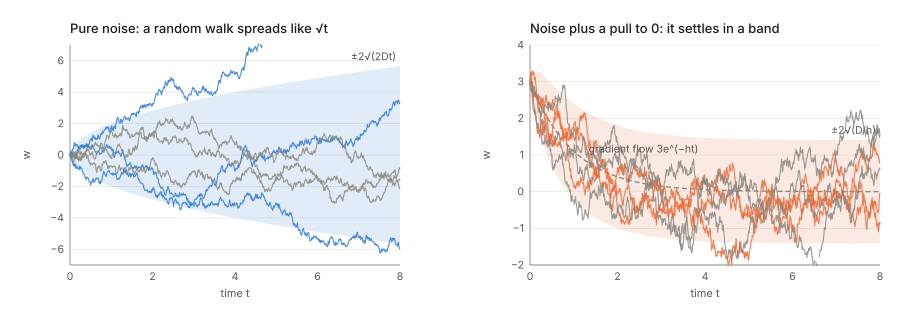
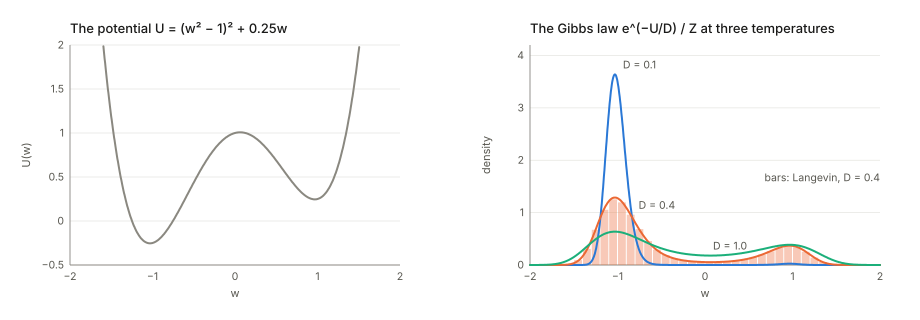
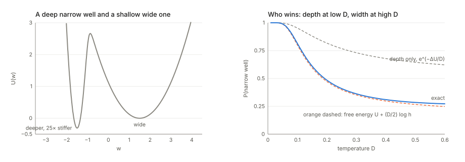
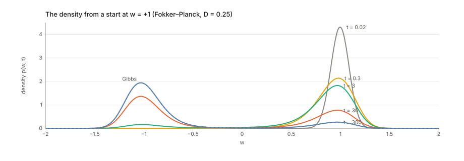
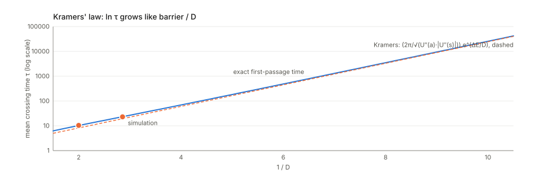
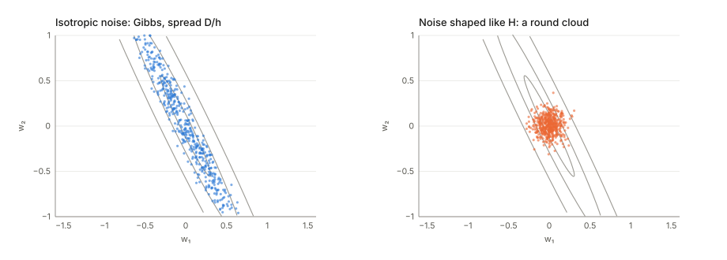
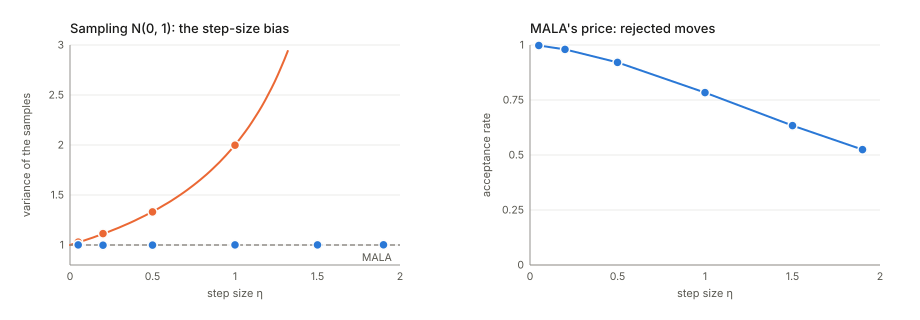
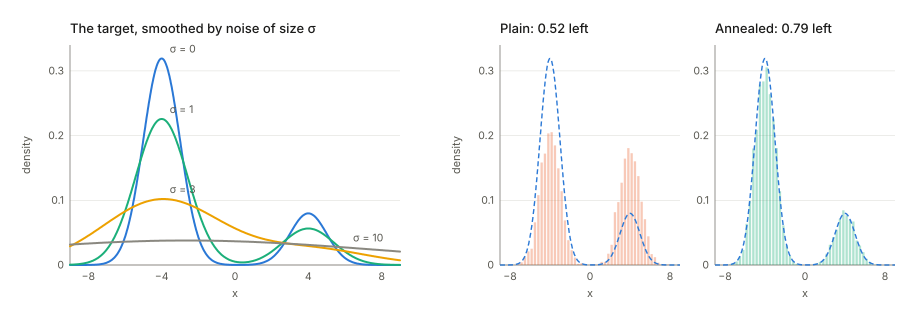

## Links

- **[Interactive version](figures/interactive.html)**: particles rolling in a potential you pick, with
  the Gibbs curve they settle onto; the density itself flowing between two wells; ULA against MALA
  as you turn up the step size; the shape of SGD-like noise; and annealed Langevin sampling a 2-D
  mixture from its score field.
- `code/langevin.py` prints every number on this page and regenerates the figures:
  `python3 code/langevin.py --figures`. `make verify` runs it, in about ten seconds.
- Paper notes that lean on this page:
  **[Achille, Mbeng & Soatto 2019](../2019-achille-task-reachability/index.html)** (SGD as a path
  integral, detailed balance, Kramers against end points);
  **[Achille, Paolini & Soatto 2020](../2020-achille-information-in-weights/index.html)** (Eyring–Kramers
  and sharp minima); **[Achille et al. 2020, task complexity](../2020-achille-task-complexity/index.html)**
  (the temperature as the price of information); **[Karczewski et al. 2026](../2026-karczewski-spacetime-diffusion/index.html)**
  (annealed Langevin along a geodesic).
- **[Inequalities and concentration](../inequalities-and-concentration/index.html)**: the KL divergence
  and the Donsker–Varadhan formula behind §4's "free energy". **[Optimal transport](../optimal-transport/index.html)**:
  the Fokker–Planck equation is a gradient flow in Wasserstein distance (§5).
- Standard references: Pavliotis, *Stochastic Processes and Applications* (2014), chapters 3–4 and 6,
  for everything in §1–§7; Welling & Teh, *Bayesian Learning via Stochastic Gradient Langevin Dynamics*
  (ICML 2011) for §9; Song & Ermon, *Generative Modeling by Estimating Gradients of the Data
  Distribution* (NeurIPS 2019) for §11.

## In one paragraph

Gradient descent rolls a ball downhill and stops it at the bottom of whatever valley it started in.
**Langevin dynamics adds random kicks.** At every instant the ball is pushed downhill by
$-\nabla U$ and jostled by Gaussian noise whose strength is a **temperature** $D$. Three things follow,
and most of machine learning's uses of the idea are one of them. First, the ball never stops, but its
position settles into a fixed distribution, the **Gibbs law** $p(w)\propto e^{-U(w)/D}$: low places are
exponentially more likely than high ones, and $D$ sets how strongly. So if you want samples from a
distribution $p$, run Langevin with $U=-\log p$ and $D=1$ (this is SGLD, MALA and score-based
sampling). Second, the ball can climb out of a valley, but the waiting time grows like
$e^{\text{barrier}/D}$ (**Kramers' law**), so at low temperature the dynamics is fast inside a valley
and glacial between valleys. Third, at a given temperature a **wide** valley holds more probability than
a narrow one of the same depth, by a factor $\sqrt{\text{curvature ratio}}$, so noise prefers flat
minima. SGD is approximately a Langevin process with $D\approx\eta\sigma^2/(2B)$, which is how all
three facts get attached to training neural networks, with a caveat about the shape of the noise
(§10).

## 1. Two ingredients: a pull downhill and random kicks

**The pull.** Gradient flow, $\dot w=-\nabla U(w)$, is gradient descent with an infinitely small step.
It always goes down, and it stops at the first minimum it meets. Where it ends depends only on where
it started.

**The kicks.** Now forget the potential and add up random steps. In each small time step $\Delta t$ the
position changes by an independent Gaussian with mean zero and variance $2D\,\Delta t$. After time
$t$ there have been $t/\Delta t$ steps, and **variances of independent steps add**, so the total
variance is $(t/\Delta t)\times 2D\Delta t=2Dt$. The spread grows like $\sqrt t$, not like $t$: a random
walk wanders, but slowly. The limiting process is **Brownian motion** (also called a Wiener process),
written $W_t$, with $W_t\sim\mathcal N(0,t)$. Here the kicks are $\sqrt{2D}\,W_t$.

The code checks both statements. With $D=0.5$, the variance at $t=1$, 4 and 16 divided by $2Dt$ is
$1.007$, $1.005$, $0.987$ with steps of $0.1$, and $1.016$, $0.991$, $1.001$ with steps of $0.01$: the same
answer whatever the step, as it should be.

**Why the kick in one step is $\sqrt{2D\Delta t}$ and not proportional to $\Delta t$.** This is the one
unfamiliar piece of arithmetic, and it is forced. If the kick in each step were $2D\,\Delta t$ times a
standard Gaussian, the total variance after time 1 would be $(1/\Delta t)(2D\Delta t)^2=4D^2\Delta t$,
which vanishes as the step shrinks. The code gets $0.1012$, $0.0101$, $0.0010$ for steps $0.1$, $0.01$,
$0.001$: the noise simply disappears in the limit. For the noise to survive, its standard deviation per
step has to scale like $\sqrt{\Delta t}$. This is also why Brownian paths are so jagged: over a short
time $\Delta t$ they move by about $\sqrt{\Delta t}$, which is much larger than $\Delta t$, so they have no
velocity.

## 2. The Langevin equation, and how to simulate it

Put the two together:

$$
dw=-\nabla U(w)\,dt+\sqrt{2D}\,dW_t .
$$

Read it as a recipe for one short time step $dt$: move downhill by $\nabla U\,dt$, then add a Gaussian
kick of variance $2D\,dt$ in every coordinate. Physicists write the same thing as
$\dot w=-\nabla U+\sqrt{2D}\,\xi(t)$ with "white noise" $\xi$, which is the derivative of $W$ that does not
really exist; the $dW$ form avoids pretending it does.

**Simulating it** means taking that recipe with a finite step $\eta$ (the **Euler–Maruyama** scheme):

$$
w_{k+1}=w_k-\eta\,\nabla U(w_k)+\sqrt{2D\eta}\;\xi_k,\qquad \xi_k\sim\mathcal N(0,I)\ \text{independent}.
$$

That is gradient descent with step $\eta$ plus a Gaussian of standard deviation $\sqrt{2D\eta}$ added
after every step. Nothing more.

| Symbol | Meaning |
|---|---|
| $w$ | the position of the particle: the weights, in the ML uses |
| $U(w)$ | the potential: the loss, or $-\log$ of a density you want to sample |
| $D$ | the temperature (diffusion constant). The factor 2 in $\sqrt{2D}$ is a convention that makes pure noise spread as $2Dt$ and the equilibrium come out as $e^{-U/D}$ |
| $W_t$ | Brownian motion: $W_t-W_s\sim\mathcal N(0,(t-s)I)$, independent over disjoint intervals |
| $\eta$ | the step size of a simulation |
| $p(w,t)$ | the density of the particle's position at time $t$ (over many runs) |
| $\pi(w)$ | the equilibrium (stationary) density, $\lim_{t\to\infty}p(w,t)$ |
| $h$, $H$ | curvature $U''$ in one dimension; the Hessian in several |

**The simplest example: a quadratic bowl.** With $U=\frac h2w^2$ the equation is
$dw=-hw\,dt+\sqrt{2D}\,dW$, the **Ornstein–Uhlenbeck (OU) process**. Its average follows gradient flow,
$\mathbb E w(t)=w_0e^{-ht}$, and its spread grows from zero and levels off at
$\operatorname{Var}w=\frac Dh(1-e^{-2ht})\to\frac Dh$: the pull and the kicks balance (right panel
above). The code: with $h=2$, $D=0.2$ and step $0.01$ the stationary variance is $0.1010$, against
$D/h=0.1000$. The extra 1% is the finite-step bias, exactly $1/(1-h\eta/2)$ (§9).

**Equipartition.** In a bowl with many directions of different curvature $h_i$, each direction ends up
with variance $D/h_i$: wide in flat directions, narrow in stiff ones. But the average *height* in each
direction is $\mathbb E[\frac12h_iw_i^2]=\frac12h_i\cdot\frac D{h_i}=\frac D2$, the same for all of them.
With 50 directions of curvature from $0.1$ to $10$ and $D=0.2$, the code finds $0.1027$ in the
flattest and $0.0999$ in the stiffest (both $D/2=0.1$), and a total of $5.025$ against $kD/2=5$. So **a
Langevin particle at the bottom of a quadratic minimum sits, on average, $kD/2$ above it**, whatever the
curvatures, while its spread is $\sqrt{D/h_i}$: $1.414$ in the flattest direction and $0.141$ in the
stiffest. Keep this in mind for SGD: the loss plateaus above the minimum by an amount proportional to
the temperature and the number of directions.

## 3. Where the particles end up: the Gibbs law

Run many particles for a long time and histogram their positions. The histogram stops changing and
settles on

$$
\pi(w)=\frac1Z\,e^{-U(w)/D},\qquad Z=\int e^{-U(w)/D}\,dw .
$$

In words: **a point that is $\Delta U$ higher than another is $e^{-\Delta U/D}$ times less likely**.
Temperature is the exchange rate between height and improbability. At low $D$ almost all the mass sits
in the lowest valley; at high $D$ it spreads almost evenly. $Z$ just makes the total probability 1.

**Where it comes from (one dimension, line by line).** Think of $p(w,t)$ as a fluid. Two things move it:

- the drift carries probability downhill with velocity $-U'(w)$, a flow of $-U'(w)\,p$;
- diffusion moves probability from crowded to sparse places, a flow of $-D\,p'(w)$ (more crowding to
  the right pushes mass to the left). This is Fick's law, the same rule as heat spreading in a bar.

The total flow is the **probability current** $J=-U'p-Dp'$, and probability is conserved, so the density
changes by the amount flowing in minus the amount flowing out: $\partial_tp=-\partial_wJ$. At
equilibrium nothing changes. In one dimension, with nothing escaping to infinity, that means
$J=0$ everywhere:

$$
-U'\pi-D\pi'=0\quad\Longrightarrow\quad\frac{\pi'}{\pi}=-\frac{U'}D\quad\Longrightarrow\quad\log\pi=-\frac UD+\text{const}.
$$

The downhill pull and the outward spreading cancel point by point. For the OU bowl this gives
$\pi\propto e^{-hw^2/2D}$, a Gaussian of variance $D/h$, as found above.

The code checks it on a tilted double well, $U=(w^2-1)^2+0.25w$, whose left well is $0.5$ deeper. The
Gibbs probability of the left well is $0.993$ at $D=0.1$, $0.823$ at $D=0.3$ and $0.613$ at $D=1$. A
Langevin simulation at $D=0.4$ (3000 particles, started uniformly, 200 time units) puts $0.757$ of its
time in the left well against the Gibbs value $0.756$. Its histogram is within total-variation
distance $0.007$ of the curve.

A word on *why* this is useful. To sample from a density $p$ you would normally need its normalising
constant, which is an intractable integral for anything interesting. Langevin with $U=-\log p$ and
$D=1$ has $\pi=p$, and it only ever uses $\nabla U=-\nabla\log p$, in which the constant has
disappeared. That gradient is called the **score**. Everything in §9 and §11 builds on this.

## 4. Two wells: depth against width

Which valley holds more probability? Integrate $e^{-U/D}$ over each. Near a minimum $w_i$ with height
$U_i$ and curvature $h_i$, the integrand is a Gaussian bump of height $e^{-U_i/D}$ and width
$\sqrt{D/h_i}$ (this is the **Laplace approximation**), so

$$
P(\text{well }i)\propto e^{-U_i/D}\sqrt{\frac{2\pi D}{h_i}}
=\exp\Big(-\frac1D\Big[U_i+\frac D2\log h_i\Big]\Big)\times\text{const}.
$$

The bracket is the well's **free energy** $F_i=U_i+\frac D2\log h_i$ (in $k$ dimensions,
$\frac D2\log\det H_i$). Depth counts through $U_i$, narrowness through $\log h_i$, and the temperature
sets the exchange rate between them. At low $D$ the deepest well wins. At high $D$ the widest one does.

The code builds a well that is $0.3$ deeper but $25$ times stiffer than its neighbour:

| $D$ | $P(\text{narrow})$, exact | free energy (Laplace) | depth only |
|---|---|---|---|
| 0.05 | 0.990 | 0.988 | 0.998 |
| 0.10 | 0.814 | 0.801 | 0.953 |
| 0.20 | 0.485 | 0.473 | 0.818 |
| 0.30 | 0.362 | 0.352 | 0.731 |
| 0.50 | 0.285 | 0.267 | 0.646 |

The narrow well loses its majority at $D=0.192$. The free-energy rule predicts the crossover where
$0.3=\frac D2\log25$, at $D=0.186$. Counting depth alone, the narrow well would keep its majority at
every temperature. This is the precise sense of "noise prefers flat minima": not that noise pushes the
particle out of sharp minima faster (that is the barrier's job, §6), but that at equilibrium a flat
valley simply has more room.

The same potential shows that *where the mass ends up* and *how soon it gets there* are separate
questions. The narrow well sits $2.96$ below the ridge between the wells. Particles dropped into it take
$5448$ time units on average to leave at $D=0.3$, although at equilibrium only $0.362$ of the mass
belongs there; at $D=0.8$ they leave in $17.1$. The first question is the Gibbs law. The second is
Kramers' law (§6).

## 5. How the density moves: the Fokker–Planck equation

§3 used the current $J$ only at equilibrium. The same bookkeeping gives the full time evolution of the
density, the **Fokker–Planck equation**:

$$
\partial_tp=\nabla\cdot\big(p\,\nabla U\big)+D\,\nabla^2p .
$$

The first term is the fluid being carried downhill, the second is it spreading out. (The Langevin
equation describes one particle's random path; Fokker–Planck describes the deterministic evolution of
the cloud of all possible paths. They are two views of the same process.) A second reading, for
readers who know optimal transport: Fokker–Planck is gradient descent, in Wasserstein distance, on
the free-energy functional $\int U\,p+D\int p\log p$. Its minimiser is the Gibbs law (Jordan,
Kinderlehrer & Otto, 1998).

The code solves it exactly on a grid for the tilted double well at $D=0.25$, starting from a spike at
$w=+1$ in the *shallower* right well:

| $t$ | 0.02 | 0.3 | 3 | 30 | 300 |
|---|---|---|---|---|---|
| mass in the left (deep) well | 0.000 | 0.002 | 0.090 | 0.614 | 0.866 |

The equilibrium value is $0.866$. Within $t\approx0.3$ the spike has relaxed to the local shape of the
right well. Getting the mass into the deeper well takes a hundred times longer.

**Two time scales.** The density relaxes as a sum of modes, each decaying like $e^{-\lambda t}$. The
rates $\lambda$ are the eigenvalues of the Fokker–Planck operator. On the grid they are $0$ (the
equilibrium itself), then $\lambda_1=0.0416$, then $3.34$, $5.61$, and upward. The sanity check on a
quadratic of curvature 8 gives $7.997$, $15.994$, $23.99$, against the exact OU rates 8, 16, 24.

- $\lambda_1$ is the **hopping rate** between the wells. The exact mean passage times (§6) are 187.4
  (left to right, uphill) and 28.94 (right to left), and $1/187.4+1/28.94=0.0399$, within 4% of
  $\lambda_1$.
- Everything after $\lambda_1$ is of the order of the curvatures: $U''=8.73$ and $7.22$ at the two minima,
  $\lvert U''\rvert=3.95$ at the saddle. That is a gap of 80 between the slow rate and the next. At
  $D=0.05$ the fast rates sharpen: $3.77$ belongs to a mode sitting on the saddle, and $7.12$ lies next
  to the right well's curvature, 7.22.

So in practice the density first equilibrates *inside* each valley and then, much later, shares mass
*between* valleys. That separation is what makes "which basin did training end up in" a meaningful
question at low temperature.

## 6. Waiting to cross a barrier: Kramers' law

How long until a particle in one well reaches the other? In one dimension there is an exact formula for
the **mean first-passage time** from $a$ to $b>a$ (with nothing escaping to the left):

$$
\tau(a\to b)=\frac1D\int_a^b e^{U(y)/D}\left[\int_{-\infty}^{y}e^{-U(z)/D}\,dz\right]dy .
$$

It reads: the inner integral is how much equilibrium probability sits behind the point $y$; the outer
factor $e^{U(y)/D}$ is large where the potential is high, so the integral is dominated by the highest
point on the way, the saddle. For a barrier of height $\Delta E$ above the start, at low temperature this
becomes **Kramers' law**:

$$
\tau\approx\frac{2\pi}{\sqrt{U''(a)\,\lvert U''(s)\rvert}}\;e^{\Delta E/D},
$$

with $a$ the bottom of the starting well and $s$ the saddle. The exponential is the **Arrhenius factor**
(the chance of one attempt making it over the top). The prefactor measures how often attempts happen,
through the curvature of the well and of the barrier top. Note what is not in it: **the depth of the
destination**. Once over the saddle the particle rolls down quickly, however far down it goes.

On the symmetric well $U=(w^2-1)^2$ (barrier 1):

| $D$ | 0.10 | 0.15 | 0.20 | 0.25 | 0.35 | 0.50 |
|---|---|---|---|---|---|---|
| exact $\tau$ | 25527 | 936 | 182.4 | 69.26 | 23.26 | 10.26 |
| Kramers | 24465 | 873 | 164.9 | 60.64 | 19.34 | 8.21 |
| ratio | 1.043 | 1.072 | 1.107 | 1.142 | 1.203 | 1.250 |

Kramers is an asymptotic formula, exact as $D\to0$. Its error here grows roughly in proportion to $D$,
to 25% at $D=0.5$, where the barrier is only twice the temperature. Simulations with 4000 particles give
$22.95\pm0.35$ at $D=0.35$ and $10.42\pm0.15$ at $D=0.5$, on the exact values. The slope of $\ln\tau$
against $1/D$ between $D=0.1$ and $0.2$ is $0.988$, the barrier height. Halving the temperature squares
the waiting time.

In several dimensions the same holds with determinants (the **Eyring–Kramers** or **Langer** formula):
$\tau\approx\frac{2\pi}{\lvert\lambda_s\rvert}\sqrt{\lvert\det H_s\rvert/\det H_a}\,e^{\Delta E/D}$, with
$\lambda_s$ the one negative eigenvalue of the Hessian at the saddle. The determinant ratio is the
free-energy correction of §4 applied to the well and to the saddle's cross-section. A wide mountain pass
is easier to find than a narrow one.

## 7. Reversibility, and when it fails

Film a Langevin particle at equilibrium and play the film backwards. For a gradient drift and constant
isotropic noise you cannot tell the difference: every transition $x\to y$ happens exactly as often as
$y\to x$. This is **detailed balance**,

$$
\pi(x)\,p_t(y\mid x)=\pi(y)\,p_t(x\mid y)\qquad\Longrightarrow\qquad
\frac{p_t(y\mid x)}{p_t(x\mid y)}=e^{-[U(y)-U(x)]/D}\ \text{ at every }t .
$$

It is the same statement as $J=0$ in §3, and it is why the downhill/uphill passage times in §5 differ by
exactly the equilibrium odds. The Achille 2019 notes use it to split a transition probability into a
symmetric "reachability" part and an end-point part. Two ways to break it, both relevant to SGD:

- **A drift that is not a gradient.** Add a rotation to the pull, $dw=-(w-\Omega Jw)\,dt+\sqrt{2D}\,dW$
  with $J$ a 90° rotation and $\Omega=2$. The equilibrium snapshot is unchanged: the code solves for the
  stationary covariance and gets exactly $DI$, the Gibbs law of $\frac12\lVert w\rVert^2$. But the film
  now runs in circles. The lagged covariances $\mathbb E[w_1(t+s)w_2(t)]=-0.510$ and
  $\mathbb E[w_2(t+s)w_1(t)]=+0.510$ at $s=0.5$ would be equal for a reversible process. A snapshot
  alone cannot tell you the dynamics is reversible.
- **Noise that is not isotropic.** Keep the gradient drift on a quadratic loss with curvatures 10 and
  0.1, but give the noise a covariance proportional to the Hessian, $2cH$, as SGD's noise roughly is
  (§10). The stationary covariance $\Sigma$ solves $H\Sigma+\Sigma H=2cH$, whose solution is
  $\Sigma=cI$: **a round cloud**, not the Gibbs law. With isotropic noise of the same total size the
  spreads are $D/h$: variances $0.5$ and $0.005$. With Hessian-shaped noise they are $0.0099$ in both
  directions.

The second case changes what "flat minima are preferred" means. With isotropic noise, the average
excess loss is $kD/2$ at any minimum (equipartition, §2), and flatness helps only through the
free-energy volume of §4. With Hessian-shaped noise, the excess loss is $c\operatorname{tr}H/2$. At a
minimum 10 times sharper it grows from $0.050$ to $0.500$ in the code, while the isotropic value stays at
$0.050$. Sharpness then costs loss directly, not only probability mass.

## 8. The weight of a whole path

The Gaussian kicks also give a probability to an entire trajectory. Chop time into steps. The chance of
a particular sequence of positions is the product of the Gaussian densities of the kicks it needed,
$\exp\big(-\lVert\Delta w+\nabla U\Delta t\rVert^2/(4D\Delta t)\big)$ per step. In the limit:

$$
\text{weight}[w(\cdot)]\;\propto\;\exp\Big(-\frac1{4D}\int\lVert\dot w+\nabla U(w)\rVert^2\,dt\Big),
$$

the **Onsager–Machlup** (or, dropping a correction of order $D$, **Freidlin–Wentzell**) action. A path
that moves exactly as the gradient pushes it needs no kicks at all and costs nothing. Every deviation
costs its squared size, divided by the temperature.

Two consequences, checked on the tilted double well:

- **Downhill along gradient descent is free.** From the saddle into the left well, $D\times$action is
  $5\times10^{-16}$.
- **Uphill costs exactly the climb.** The cheapest way up is gradient descent played backwards
  ($\dot w=+\nabla U$), and its $D\times$action is $\int\lVert\nabla U\rVert^2dt=\Delta U$. The code gets
  $1.2616$ for a climb of $1.2616$. So the weight of the likeliest climb is $e^{-\Delta U/D}$, the
  Arrhenius factor again. Any other route costs more: the best straight climb at constant speed has
  $1.3288$.

This is the most intuitive way to see Kramers' law. Leaving a well means climbing to its lowest pass,
and climbing costs $e^{-\Delta E/D}$ in probability no matter how you do it. The Achille 2019 notes
develop this into the paper's "static" and "reachability" factors.

## 9. Sampling with Langevin: ULA, MALA, SGLD

**The unadjusted Langevin algorithm (ULA)** is Euler–Maruyama with $U=-\log p$ and $D=1$:
$w\leftarrow w+\eta\nabla\log p(w)+\sqrt{2\eta}\,\xi$. The continuous process has $\pi=p$ exactly. The
finite step does not. For a standard normal target the update is $w\leftarrow(1-\eta)w+\sqrt{2\eta}\,\xi$.
Its stationary variance $v$ solves $v=(1-\eta)^2v+2\eta$:

$$
v=\frac{2\eta}{1-(1-\eta)^2}=\frac1{1-\eta/2}.
$$

The samples are too spread out, by 2.6% at $\eta=0.05$, a factor 2 at $\eta=1$ and 20 at $\eta=1.9$, and at
$\eta\ge2$ the chain diverges. The code's samples match the formula to within Monte Carlo error at every
step size ($1.029$, $1.114$, $1.331$, $1.998$, $4.000$, $20.06$).

**MALA** (Metropolis-adjusted Langevin) uses the Langevin step as a *proposal* and accepts it with the
Metropolis–Hastings probability, which corrects the bias exactly. Its variance is $1.00$ at every step
size tested. The price is rejections: the acceptance rate falls from $0.998$ at $\eta=0.05$ to $0.784$ at
$\eta=1$ and $0.525$ at $\eta=1.9$.

**SGLD** (stochastic gradient Langevin dynamics, Welling & Teh 2011) is ULA with the gradient of the
log-posterior estimated on a mini-batch, which is how Bayesian inference is scaled to neural networks.
The mini-batch error adds its own noise. Per step it has variance $\eta^2g^2$, against the injected
$2\eta$, so it raises the effective temperature to $1+\eta g^2/2$. The ratio shrinks with the step, which
is why SGLD's step size must decay. On the posterior of a mean from $N=1000$ observations with batches of
10 ($g^2\approx9.8\times10^4$), the stationary variance over the true posterior variance is:

| step | $3\times10^{-4}$ | $10^{-4}$ | $10^{-5}$ | $10^{-6}$ |
|---|---|---|---|---|
| variance ratio | 18.4 | 6.20 | 1.50 | 1.05 |

A simulation at $10^{-4}$ gives $6.17$ (the exact value for this linear model is $6.20$), with the mean
right at the posterior mean. **At a practical step size, SGLD samples a much hotter posterior than
the one written down.** This is one ingredient of the "cold posterior" debate in Bayesian deep learning.

## 10. SGD as (approximately) Langevin

A mini-batch gradient is the full gradient plus an error with mean zero and covariance $\Sigma_g/B$.
So an SGD step is a gradient-descent step plus a kick:

$$
w_{k+1}=w_k-\eta\nabla L(w_k)-\eta\,\big(\nabla\hat L_B-\nabla L\big).
$$

Read the step count as time, $t=k\eta$. The kick has variance $\eta^2\sigma^2/B$ per coordinate (for
$\Sigma_g=\sigma^2I$), and Langevin's kick over time $\eta$ has $2D\eta$. Matching them,

$$
D\approx\frac{\eta\,\sigma^2}{2B}.
$$

On the toy loss $\frac12(w-z_i)^2$ with $\eta=0.05$ the stationary variance of $w$ (which should equal $D$,
curvature 1) is $0.01421$, $0.00361$, $0.00089$ for $B=4$, 16, 64, against $0.01391$, $0.00348$,
$0.00087$. The 2–4% excess is ULA's $1/(1-\eta/2)$. So **learning rate over batch size is a
temperature**, which is the intuition behind scaling the learning rate with the batch size (to keep
$D$ fixed) and behind "large batches find sharper minima".

The approximation has three well-known weak spots, and each changes a conclusion above.

- **The noise is not isotropic.** Near a minimum the gradient covariance is close to the Fisher
  information, which is close to the Hessian. §7 shows what that does: the stationary cloud is round,
  not $D H^{-1}$, and detailed balance with respect to $e^{-L/D}$ fails.
- **The noise is not constant.** $\Sigma_g$ depends on $w$. With state-dependent noise the stationary law
  depends on how the SDE is read (Itô or Stratonovich), and neither need be a Gibbs law.
- **The noise may not be Gaussian.** Mini-batch gradients can be heavy-tailed. Whether that matters for
  deep networks is debated; with heavy tails, escapes happen by jumps and Kramers' $e^{\Delta E/D}$ gives
  way to polynomial waiting times.

The Achille notes use the isotropic idealisation, and state where it enters.

## 11. Score-based sampling and diffusion models

Langevin needs only the score $\nabla\log p$. If a network $s_\theta(x)\approx\nabla_x\log p(x)$ has been
trained on data (score matching), then $x\leftarrow x+\eta\,s_\theta(x)+\sqrt{2\eta}\,\xi$ generates new
samples. Song & Ermon (2019) point out two problems, and one fix covers both.

- **The score is only learned where the data are.** Between the modes of $p$ there are no training
  points, so the score there is unreliable.
- **Mixing between modes is a Kramers problem.** For $p=0.8\,\mathcal N(-4,1)+0.2\,\mathcal N(4,1)$ the
  barrier of $-\log p$ between the modes is $6.39$ above the small mode. At temperature 1 that means
  crossings take of order $e^{6.4}\approx600$ time units, and a run of 20 time units effectively never
  crosses. Started uniformly on $[-8,8]$, plain Langevin (with the *exact* score) puts $0.524$ of its
  samples in the left mode. Each particle stays in whichever basin it started in, so the **mode weights
  are wrong** although every sample sits in a correct-looking mode.

**Annealed Langevin** runs the same sampler on smoothed versions of the target first:
$p_\sigma=p*\mathcal N(0,\sigma^2)$, the data plus Gaussian noise of size $\sigma$. At $\sigma=10$ the two modes
have merged into one broad hump, so particles move freely and share themselves out in the right
proportions. As $\sigma$ decreases through $3$ and $1$ to $0$, the modes separate *after* the mass has been
divided. With $\sigma$ from 10 down to 0.1 (then 0), 200 steps at each level, the code recovers a left-mode
weight of $0.788$ against the true $0.8$. The smoothed scores are also easier to learn, because noise
spreads training data into the gaps.

This is the bridge to diffusion models. Their generative process runs a reverse-time SDE,
$dx=[f(x,t)-g(t)^2\nabla\log p_t(x)]dt+g(t)\,d\bar W$, which is Langevin-like dynamics whose target
$p_t$ slides continuously from pure noise to the data. The annealing above is a discrete version of that
slide. The Karczewski et al. notes use annealed Langevin in exactly this role, along a path between two
low-energy states.

## 12. A note on momentum (underdamped Langevin)

Everything above is **overdamped**: the particle has no inertia, and the kick changes its position
directly. The **underdamped** version gives it a velocity $v$ with friction $\gamma$:
$dw=v\,dt$, $dv=-\nabla U\,dt-\gamma v\,dt+\sqrt{2\gamma D}\,dW$. Its equilibrium is
$e^{-(U(w)+\frac12\lVert v\rVert^2)/D}$, so the position still follows the Gibbs law and the velocity is an
independent Gaussian. With large friction it reduces to the overdamped equation. It is the continuous
version of SGD with momentum, and of Hamiltonian Monte Carlo with partial momentum refresh, and it
explores long flat valleys faster because it does not have to diffuse across them.

## Questions and doubts

- **"SGD is Langevin" is a model, not a theorem.** The derivation in §10 needs small steps, Gaussian
  noise and, for the Gibbs law, isotropic and constant noise. Real SGD violates all three to some
  degree. The robust part is the scaling $D\propto\eta/B$. The Gibbs form of the equilibrium is the
  fragile part.
- **Which "flat minima" argument?** Three different mechanisms get the same name. The free-energy
  volume factor $\sqrt{\det H}$ (§4) is equilibrium probability. Faster escape from minima with low
  barriers (§6) is kinetics. The excess loss $c\operatorname{tr}H/2$ under Hessian-shaped noise (§7) is a
  loss penalty. They can disagree about which minimum is "preferred", and papers often switch between
  them.
- **Kramers' prefactor matters less than it looks, but not nothing.** At a barrier of only two to four
  times $D$ it is off by 15–25% (§6). The exponent, which carries the barrier, is what the simulations
  pin down, and it is what the curvature arguments of the papers tend to overlook.
- **Itô or Stratonovich?** With constant noise the two readings agree and nothing on this page depends on
  the choice. With state-dependent noise (SGD) they differ by a drift term, and the "right" one is
  whichever limit the discrete algorithm actually converges to, which for SGD is Itô.

## Cheat sheet

| Term | One line |
|---|---|
| Langevin equation | $dw=-\nabla U\,dt+\sqrt{2D}\,dW$: gradient flow plus Gaussian kicks |
| Euler–Maruyama | $w\leftarrow w-\eta\nabla U+\sqrt{2D\eta}\,\xi$: gradient descent plus noise of size $\sqrt\eta$ |
| Brownian motion | $W_t\sim\mathcal N(0,t)$; spreads like $\sqrt t$ because variances add |
| OU process | $U=\frac h2w^2$: mean $w_0e^{-ht}$, stationary variance $D/h$ |
| Equipartition | at a quadratic minimum each direction holds $D/2$ of loss on average: $kD/2$ in total |
| Gibbs law | $\pi\propto e^{-U/D}$: $\Delta U$ higher is $e^{-\Delta U/D}$ less likely |
| Score | $\nabla\log p$: all that Langevin needs, free of the normalising constant |
| Free energy of a well | $U_i+\frac D2\log\det H_i$: depth plus a narrowness penalty |
| Fokker–Planck | $\partial_tp=\nabla\cdot(p\nabla U)+D\nabla^2p$: the cloud's deterministic evolution |
| Two time scales | fast within a well (curvature), slow between wells (Kramers rate) |
| Kramers' law | $\tau\approx\frac{2\pi}{\sqrt{U''(a)\lvert U''(s)\rvert}}e^{\Delta E/D}$: the barrier sets the exponent, not the destination |
| Detailed balance | $\pi(x)p_t(y\mid x)=\pi(y)p_t(x\mid y)$; fails for rotating drift or shaped noise |
| Path weight | $e^{-\frac1{4D}\int\lVert\dot w+\nabla U\rVert^2dt}$: downhill free, uphill $e^{-\Delta U/D}$ |
| ULA bias | stationary variance $1/(1-\eta/2)$ on $\mathcal N(0,1)$; diverges at $\eta\ge2/h$ |
| MALA | Langevin proposal plus Metropolis accept/reject: exact, at the cost of rejections |
| SGLD | mini-batch ULA; effective temperature $1+\eta g^2/2$, so the step must shrink |
| SGD temperature | $D\approx\eta\sigma^2/(2B)$; noise roughly $\propto$ Hessian, which gives a round stationary cloud |
| Annealed Langevin | sample $p*\mathcal N(0,\sigma^2)$ for decreasing $\sigma$: fixes mode weights and unlearned gaps |
