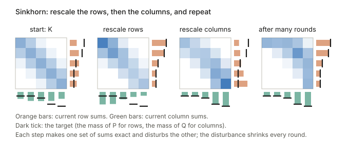
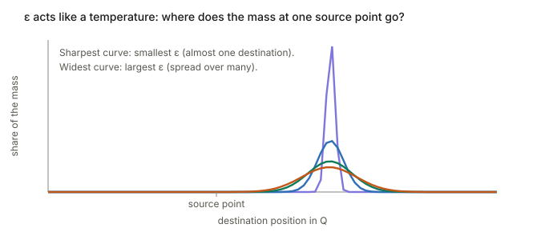
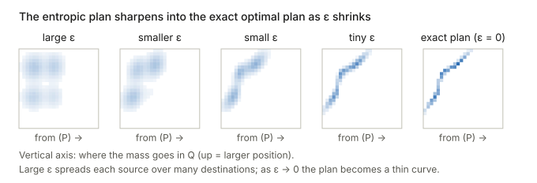
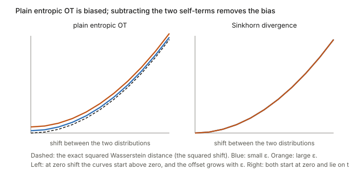

## Links

- **[Interactive version](figures/interactive.html)**: every section below has a widget
  you can play with there: sand being shovelled into holes, a draggable bakery→café map, the
  coupling heatmap with a Sinkhorn blur slider, W₁ vs. KL/JS, and point clouds flowing along
  optimal pairings.
- **[Wang et al. 2026, NTK-Selector](../2026-wang-ntk-selector/index.html)**: uses TSDS
  (Liu et al., 2024), an OT-based data-selection method, as a baseline. §8 below reads that
  definition symbol by symbol.
- **[Li et al. 2026, hyperbolic flow matching](../2026-li-hyperbolic-flow-matching/index.html)**:
  flow matching, where OT pairings straighten the paths (§6).
- **[Gaussianity in practice](../gaussianity-in-practice/index.html)**: if embeddings are
  Gaussian, the W₂ distance between two of them has a closed form (§7).
- Peyré & Cuturi, *Computational Optimal Transport* (2019): readable and ML-oriented, with
  most of these pictures. Villani, *Optimal Transport: Old and New* (2009) is the deep-theory
  reference.

## In one paragraph

Picture a probability distribution as a pile of sand, tall where there is a lot of
probability. Optimal transport (OT) asks: **what is the cheapest way to reshape pile $\mu$
into pile $\nu$**, if moving one grain a distance $d$ costs $d$ (or $d^2$)? The minimum
cost is a distance between distributions, the **Wasserstein distance**. Unlike KL or
Jensen–Shannon, it measures *how far* mass has to travel, not just *whether* the two
densities disagree at a point. So it stays informative when the distributions don't
overlap at all, which is the usual situation for data on thin manifolds. That's why it
turns up in WGANs, FID, flow matching, domain adaptation and transferability estimation.

## 1. The idea: sand into holes

Pile $\mu$ (the source) sits above ground. A set of holes shaped like $\nu$ (the target)
sits below. Both hold total mass 1. A way of shovelling assigns every grain to a hole.
The **optimal** way minimises the average distance a grain travels, and that minimum is
$W_1(\mu,\nu)$, the *earth mover's distance*.

In one dimension the optimal rule is: **sort the grains left to right, sort the holes left
to right, and match first with first, second with second, and so on.** Paths never cross.
Any matching where paths cross can be improved by swapping the two endpoints. A random
matching criss-crosses and costs more.

## 2. A worked example with numbers

Three bakeries bake 30, 20 and 50 loaves. Three cafés need 40, 35 and 25. Shipping a loaf
costs its distance $C_{ij}$. Divided by 100, that's $\mu=(0.3,0.2,0.5)$ and
$\nu=(0.4,0.35,0.25)$.

A **transport plan** is a table: "ship $\gamma_{ij}$ loaves from bakery $i$ to café $j$".
It has to obey two rules:

- **row sums = supply**: $\sum_j\gamma_{ij}=\mu_i$ (each bakery ships out everything it baked);
- **column sums = demand**: $\sum_i\gamma_{ij}=\nu_j$ (each café gets exactly what it needs).

OT picks, among all such tables, the one with the smallest $\sum_{ij}C_{ij}\gamma_{ij}$.
A naive plan that fills café 1, then café 2, then café 3 (the *north-west corner rule*)
obeys both rules but ignores distance, and costs more. Two things to notice in the
interactive version:

- the optimal plan often **splits** one bakery's output across two cafés;
- for $m$ sources and $n$ targets, an optimal vertex solution has at most $m+n-1$ non-zero
  cells, so plans are sparse.

## 3. Maps vs. plans (Monge vs. Kantorovich)

**Monge (1781)** asks for a *map* $T$: every grain at $x$ goes to exactly one place $T(x)$.
The constraint is written $T_\#\mu=\nu$, "T pushes μ forward to ν". In plain words: move
every grain of $\mu$ to $T(\text{grain})$, and the resulting pile must be exactly $\nu$. In
deep learning terms, if $X\sim\mu$ is an input and $T$ is a network, then $T_\#\mu$ is just
**the distribution of the outputs $T(X)$**. Formally,
$(T_\#\mu)(B)=\mu\big(T^{-1}(B)\big)$: the probability of landing in region $B$ equals the
probability of starting somewhere that $T$ sends into $B$.

Maps have a problem. If $\mu$ is one spike of mass 1 and $\nu$ is two spikes of mass ½,
**no function can do it**, because a function sends the whole spike to one point.

**Kantorovich (1942)** fixes this by allowing mass to split. Instead of a map, you choose a
plan $\gamma(x,y)$, which says how much mass goes from $x$ to $y$. That's the table from §2.
The problem now always has a solution, and it is a linear program.

**Brenier's theorem** says that when $\mu$ has a density (no spikes) and the cost is
$\|x-y\|^2$, the optimal plan doesn't split anything after all: it is concentrated on the
graph of a map $y=T(x)$, and that map is the gradient of a convex function. So the two
formulations agree in the nice case.

## 4. A plan is a joint distribution

Divide the plan by its total mass and **$\gamma$ is the joint distribution of a pair
$(X,Y)$** with

- marginal over $y$ (row sums) equal to $\mu$, the distribution of $X$, and
- marginal over $x$ (column sums) equal to $\nu$, the distribution of $Y$.

A joint distribution with prescribed marginals is a **coupling**. OT is **choosing the
coupling of $\mu$ and $\nu$ under which $X$ and $Y$ are closest on average**:

$$\mathrm{OT}_c(\mu,\nu)=\min_{\gamma\in\Pi(\mu,\nu)}\ \mathbb E_{(X,Y)\sim\gamma}\big[c(X,Y)\big].$$

The interactive heatmap draws $\gamma(x,y)$ with $\mu$ up the side and $\nu$ along the top.
Its blur slider $\varepsilon$ (entropic regularisation, below) interpolates between two
extremes:

| $\varepsilon$ | Plan | Meaning |
|---|---|---|
| $0$ | a thin increasing curve | exact OT. A Monge map (Brenier), the sort-and-match rule of §1 |
| small | the curve with a soft halo | Sinkhorn. Slightly more expensive, but fast, GPU-friendly and differentiable |
| $\to\infty$ | $\mu(x)\,\nu(y)$ | the **independent coupling**. Still a valid plan (the marginals are right), but $X$ and $Y$ ignore each other |

## 5. Why ML likes Wasserstein distance

Let $\mu=\mathrm{Unif}[-w/2,w/2]$ and let $\nu$ be the same block shifted by $\theta$.

| Divergence | Value | What happens once $\lvert\theta\rvert\ge w$ (no overlap) |
|---|---|---|
| $W_1(\mu,\nu)$ | $\lvert\theta\rvert$ | keeps shrinking as $\nu$ moves closer, so the gradient points the right way |
| $\mathrm{JS}(\mu,\nu)$ | $\log 2\cdot\min(1,\lvert\theta\rvert/w)$ | stuck at $\log 2$, so the gradient is zero |
| $\mathrm{KL}(\mu\Vert\nu)$ | $\infty$ for every $\theta\neq0$ | infinite, no signal at all |

The JS value comes from a short computation. Where the blocks overlap, the two densities
are equal and contribute nothing. On the non-overlapping fraction $1-o$, with
$o=\max(0,1-|\theta|/w)$, each density is compared with the mixture $m$, where it is twice
as large as $m$. That gives $\mathrm{JS}=(1-o)\log 2$.

This is the core argument of the **Wasserstein GAN** (Arjovsky, Chintala & Bottou, 2017).
Real images and early generator samples live on thin, non-overlapping manifolds, so the
flat-JS regime is the normal case, not a corner case.

## 6. Point clouds and straight-line flows

With samples instead of densities ($n$ equally weighted points on each side), OT becomes an
**assignment problem**: pair every source point with exactly one target point so that the
mean squared distance is smallest. That minimum is $W_2^2$ between the two empirical
distributions. (Birkhoff's theorem is why the optimal plan is a permutation here rather
than something split.)

Move each point along $x_t=(1-t)\,x_0+t\,x_1$. With the optimal pairing, paths are short
and, for squared cost, two moving points never occupy the same place at the same time
($W_2$-optimal paths don't collide). With random pairing, paths are long and tangled.
Flow-matching models regress a velocity field along exactly these paths. Tangled paths
mean a harder regression target and more integration steps at sampling time. That's why
**OT-conditional flow matching** (Tong et al., 2023) and multisample flow matching
(Pooladian et al., 2023) pair noise with data by minibatch OT before training.

## 7. The formal definitions, piece by piece

### Ingredients

| Symbol | Meaning | Picture |
|---|---|---|
| $\mu$ on $\mathcal X$ | source distribution | the sand pile, the bakeries, domain A |
| $\nu$ on $\mathcal Y$ | target distribution | the holes, the cafés, domain B |
| $c(x,y)$ | cost of moving one unit of mass from $x$ to $y$ | distance on the map. Usually $\lVert x-y\rVert$ or $\lVert x-y\rVert^2$ |
| $\Pi(\mu,\nu)$ | couplings: joint distributions with marginals $\mu,\nu$ | valid shipping tables |

### Monge and Kantorovich

$$\text{Monge:}\quad \inf_{T:\,T_\#\mu=\nu}\ \int c\big(x,T(x)\big)\,d\mu(x),
\qquad
\text{Kantorovich:}\quad \min_{\gamma\in\Pi(\mu,\nu)}\ \int c(x,y)\,d\gamma(x,y).$$

$\int c(x,T(x))\,d\mu(x)$ is just $\mathbb E_{X\sim\mu}[c(X,T(X))]$, the average cost per
grain. $\gamma\in\Pi(\mu,\nu)$ means $\gamma(A\times\mathcal Y)=\mu(A)$ and
$\gamma(\mathcal X\times B)=\nu(B)$, which are the row-sum and column-sum rules.

### Discrete version (what code solves)

With weights $a\in\mathbb R^n$, $b\in\mathbb R^m$ and cost matrix $C_{ij}=c(x_i,y_j)$:

$$\min_{P\in\mathbb R_{\ge0}^{n\times m}}\ \sum_{i,j}C_{ij}P_{ij}
\quad\text{s.t.}\quad P\mathbf 1_m=a,\quad P^\top\mathbf 1_n=b.$$

A linear program with $nm$ unknowns. Exact solvers (network simplex) scale roughly
cubically, which is why entropic regularisation matters in practice.

### Wasserstein distance

$$W_p(\mu,\nu)=\Big(\min_{\gamma\in\Pi(\mu,\nu)}\ \mathbb E_{(X,Y)\sim\gamma}\lVert X-Y\rVert^p\Big)^{1/p}.$$

A genuine metric on distributions with finite $p$-th moment. $W_1$ is the earth mover's
distance, and $W_2$ is the one with the nice geometry (Brenier, displacement interpolation).

### Closed forms worth memorising

- **1-D**, with $F^{-1},G^{-1}$ the quantile functions:
  $$W_p^p(\mu,\nu)=\int_0^1\big|F^{-1}(u)-G^{-1}(u)\big|^p\,du.$$
  This is "match quantile $u$ with quantile $u$", i.e. §1's sort-and-match.
- **Gaussians** $\mathcal N(m_1,\Sigma_1)$, $\mathcal N(m_2,\Sigma_2)$:
  $$W_2^2=\lVert m_1-m_2\rVert^2+\operatorname{tr}\Big(\Sigma_1+\Sigma_2-2\big(\Sigma_2^{1/2}\Sigma_1\Sigma_2^{1/2}\big)^{1/2}\Big).$$
  This is exactly the **FID** score, computed on Inception features. It's also the natural
  domain distance if you accept the Gaussian-embedding picture of
  [Betser et al.](../2026-betser-infonce-gaussian/index.html).

### Entropic OT and Sinkhorn

$$\min_{P\in\Pi(a,b)}\ \sum_{ij}C_{ij}P_{ij}-\varepsilon H(P),\qquad H(P)=-\sum_{ij}P_{ij}\log P_{ij}.$$

The entropy rewards spread-out plans (the blur). The solution has the form
$P=\operatorname{diag}(u)\,K\operatorname{diag}(v)$ with $K_{ij}=e^{-C_{ij}/\varepsilon}$.
**Sinkhorn** (Cuturi, 2013) finds $u,v$ by alternately rescaling rows to match $a$ and
columns to match $b$. It uses only matrix–vector products, so it's GPU-friendly and
differentiable. For small $\varepsilon$, run it in the log domain to avoid underflow.

The next four subsections unpack this: where the form $\operatorname{diag}(u)K\operatorname{diag}(v)$
comes from, what the alternating rescaling does, what $\varepsilon$ changes, and the
**Sinkhorn divergence**, which removes the bias that $\varepsilon$ introduces.

#### Where the form $\operatorname{diag}(u)\,K\operatorname{diag}(v)$ comes from

Without the entropy term, the best plan tends to use a few sharp routes, and with a
distance cost it need not even be unique. Adding $-\varepsilon H(P)$ makes the objective
strictly convex, so there is exactly one best plan, and it is smooth in $C$, $a$ and $b$.

To find it, give each row constraint a multiplier $f_i$ and each column constraint a
multiplier $g_j$, and set the derivative with respect to $P_{ij}$ to zero:

$$C_{ij}+\varepsilon\log P_{ij}=f_i+g_j\quad\Longrightarrow\quad
P_{ij}=e^{f_i/\varepsilon}\;e^{-C_{ij}/\varepsilon}\;e^{g_j/\varepsilon}=u_i\,K_{ij}\,v_j,$$

where $u_i=e^{f_i/\varepsilon}$, $v_j=e^{g_j/\varepsilon}$ and $K_{ij}=e^{-C_{ij}/\varepsilon}$. In
words: $K$ is a table that is large for cheap routes and tiny for expensive ones, and the
optimal plan is $K$ with row $i$ multiplied by a number $u_i$ and column $j$ multiplied by a
number $v_j$. Instead of $n\times m$ unknowns there are only $n+m$ scaling factors.

#### Sinkhorn: rescale the rows, then the columns

The scaling factors are fixed by the two marginal conditions. Row sums must equal $a$ and
column sums must equal $b$:

$$u_i\,(Kv)_i=a_i,\qquad v_j\,(K^{\top}u)_j=b_j .$$

If $v$ is held fixed, the first condition is solved at once by $u=a/(Kv)$ (elementwise
division). If $u$ is held fixed, the second is solved by $v=b/(K^{\top}u)$. Sinkhorn simply
alternates:

$$u\leftarrow a\,/\,(Kv),\qquad v\leftarrow b\,/\,(K^{\top}u).$$



Each update makes one set of sums exactly right and spoils the other, but the spoiling
shrinks every round. Geometrically, each update is the table closest to the current one (in
the KL sense) that has the right row sums, then the right column sums: alternating
projections between two constraint sets (Benamou et al., 2015). Each round costs two
matrix–vector products, about $nm$ operations, far less than solving the exact linear
program. In practice it slows down as $\varepsilon$ shrinks, and for small $\varepsilon$ the
entries of $K$ underflow, which is why the log-domain version (below) is used.

#### What $\varepsilon$ does

$\varepsilon$ behaves like a **temperature**. Looking at the plan row of one source point,
a small $\varepsilon$ sends nearly all of its mass to the cheapest destination; a large
$\varepsilon$ spreads it over many.



Across the whole plan this is the blur you see when $\varepsilon$ is large, and the
sharpening toward the exact optimal plan as it shrinks:



- **Large $\varepsilon$:** $K$ is almost constant, so the plan approaches $a\,b^{\top}$, the
  "independent" plan that pays no attention to geometry.
- **Small $\varepsilon$:** the plan approaches the exact optimal plan. (For the squared cost in
  1-D that plan is unique, which is why the right-hand panel is a clean curve.)
- **The price:** the entropic cost $\langle P,C\rangle$ is always at or above the true
  optimal cost, so $\varepsilon$ trades accuracy against speed and stability.

#### The Sinkhorn divergence: removing the bias

Write the regularised value as

$$\mathrm{OT}_\varepsilon(\mu,\nu)=\min_{P\in\Pi(a,b)}\ \langle P,C\rangle+\varepsilon\,\mathrm{KL}(P\,\|\,a\otimes b),$$

where $a\otimes b$ is the independent plan with entries $a_ib_j$. (This differs from
$-\varepsilon H(P)$ only by a constant that depends on $a$ and $b$, so the minimising plan is
the same.) The problem: even $\mathrm{OT}_\varepsilon(\mu,\mu)$ is not zero, because the
entropy term makes the plan spread mass even when no moving is needed. So as a loss, it is
not minimised by setting the generated distribution equal to the data.

The fix is to subtract each distribution's value against itself (Feydy et al., 2019):

$$S_\varepsilon(\mu,\nu)=\mathrm{OT}_\varepsilon(\mu,\nu)-\tfrac12\,\mathrm{OT}_\varepsilon(\mu,\mu)-\tfrac12\,\mathrm{OT}_\varepsilon(\nu,\nu).$$

It is zero when $\mu=\nu$. For the squared-distance cost and any $\varepsilon>0$ it is also
nonnegative and zero only then (Feydy et al., 2019), so it behaves like a proper distance.



$\varepsilon$ also sets what the divergence looks at. As $\varepsilon\to0$ it tends to the
optimal-transport cost. As $\varepsilon\to\infty$, with the squared cost, it tends to the
squared distance between the two **means**, since
$\mathbb E|X-Y|^2-\tfrac12\mathbb E|X-X'|^2-\tfrac12\mathbb E|Y-Y'|^2=\lVert\mathbb E X-\mathbb E Y\rVert^2$
(here $X,X'$ are independent draws from $\mu$ and $Y,Y'$ from $\nu$). In between it is a kernel
distance (MMD) built from the cost. That is the sense in which the Sinkhorn divergence
"interpolates between optimal transport and MMD".

#### Using it as a training loss

Because every step is a plain tensor operation, the loss can be differentiated end to end,
with no critic and no Lipschitz constraint (compare the WGAN critic above). The gradient has a
simple reading: the derivative of $\mathrm{OT}_\varepsilon$ with respect to a cost entry
$C_{ij}$ is the plan entry $P_{ij}$, so a generated point $x_i$ is pulled toward the data
points $y_j$ it sends mass to,

$$\nabla_{x_i}\mathrm{OT}_\varepsilon=2\sum_j P_{ij}\,(x_i-y_j)\qquad\text{(squared cost)}.$$

An illustrative PyTorch version (log-domain updates; with the potentials $f,g$ below,
$\mathrm{OT}_\varepsilon=\langle a,f\rangle+\langle b,g\rangle$ once the iteration has converged):

```python
import numpy as np, torch

def ot_eps(x, y, eps=0.1, iters=50):
    n, m = len(x), len(y)
    C = torch.cdist(x, y) ** 2
    log_a = torch.full((n,), -np.log(n)); log_b = torch.full((m,), -np.log(m))
    f, g = torch.zeros(n), torch.zeros(m)
    for _ in range(iters):                       # alternate: rows, then columns
        f = -eps * torch.logsumexp(log_b[None, :] + (g[None, :] - C) / eps, dim=1)
        g = -eps * torch.logsumexp(log_a[:, None] + (f[:, None] - C) / eps, dim=0)
    return (log_a.exp() * f).sum() + (log_b.exp() * g).sum()

def sinkhorn_divergence(x, y, eps=0.1, iters=50):
    return ot_eps(x, y, eps, iters) - 0.5 * ot_eps(x, x, eps, iters) - 0.5 * ot_eps(y, y, eps, iters)

# training: generator G maps noise to points; the loss is differentiable through the iterations
#   loss = sinkhorn_divergence(G(torch.randn(256, 2)), real_batch)
#   opt.zero_grad(); loss.backward(); opt.step()
```

Since the real batch does not depend on the generator, the $\mathrm{OT}_\varepsilon(y,y)$ term
adds nothing to the gradient and can be dropped when only the gradient is needed. Two costs
to keep in mind: each loss evaluation forms an $n\times m$ cost table, and $\varepsilon$ and
the number of iterations have to be chosen together, since a small $\varepsilon$ converges
slowly.

#### Sources for this part

- Cuturi (2013), *Sinkhorn Distances: Lightspeed Computation of Optimal Transport*, NeurIPS:
  entropic regularisation for OT in machine learning.
- Peyré and Cuturi (2019), *Computational Optimal Transport*, Foundations and Trends in
  Machine Learning: the standard reference for everything above, including the log-domain form.
- Sinkhorn and Knopp (1967), *Concerning nonnegative matrices and doubly stochastic matrices*,
  Pacific Journal of Mathematics: the original alternating row and column scaling.
- Benamou, Carlier, Cuturi, Nenna and Peyré (2015), *Iterative Bregman Projections for
  Regularized Transportation Problems*, SIAM Journal on Scientific Computing: the
  alternating-projection view.
- Altschuler, Weed and Rigollet (2017), *Near-linear time approximation algorithms for optimal
  transport via Sinkhorn iteration*, NeurIPS: running-time guarantees.
- Genevay, Peyré and Cuturi (2018), *Learning Generative Models with Sinkhorn Divergences*,
  AISTATS: differentiating through Sinkhorn to train generators.
- Feydy, Séjourné, Vialard, Amari, Trouvé and Peyré (2019), *Interpolating between Optimal
  Transport and MMD using Sinkhorn Divergences*, AISTATS: the debiased divergence.

### Duality: the shipping company's view

$$\mathrm{OT}_c(\mu,\nu)=\max_{f,g}\Big\{\mathbb E_\mu[f(X)]+\mathbb E_\nu[g(Y)]\ :\ f(x)+g(y)\le c(x,y)\ \ \forall x,y\Big\}.$$

A shipping company charges $f(x)$ to pick up at $x$ and $g(y)$ to drop off at $y$. To stay
competitive, pickup plus dropoff can never exceed doing it yourself, $c(x,y)$. The most it
can earn equals your cheapest self-shipping cost. For $W_1$ the two potentials collapse into
one 1-Lipschitz function (**Kantorovich–Rubinstein**):

$$W_1(\mu,\nu)=\sup_{\lVert f\rVert_{\mathrm{Lip}}\le1}\ \mathbb E_\mu[f(X)]-\mathbb E_\nu[f(Y)].$$

That $f$ is the WGAN *critic*, kept 1-Lipschitz by weight clipping or a gradient penalty.

## 8. Reading a paper's OT definition (data-selection example)

Data-selection papers state the discrete problem in their own notation. This version
(it reads like TSDS, Liu et al., 2024, the OT baseline in
[NTK-Selector](../2026-wang-ntk-selector/index.html)) is §7's discrete problem with
different letters:

$$\begin{aligned}&\min_{\gamma\in\mathbb R_{\ge0}^{|U|\times|V|}}\ \sum_{i=1}^{|U|}\sum_{j=1}^{|V|}\gamma_{ij}\,f(u_i,v_j)\\
&\text{s.t.}\ \ \sum_{j=1}^{|V|}\gamma_{ij}=\mu_i\ \ \forall i,\qquad \sum_{i=1}^{|U|}\gamma_{ij}=\nu_j\ \ \forall j.\end{aligned}$$

| Paper symbol | Plain meaning | In the bakery example (§2) |
|---|---|---|
| $(A,f)$, a metric space | a finite set of examples $A$ with a distance $f$ between any two, e.g. between embeddings | the map, $f$ = straight-line distance |
| $U\subseteq A$, points $u_i$ | source examples (e.g. a candidate pool) | bakeries |
| $V\subseteq A$, points $v_j$ | target examples (e.g. a small target-task set) | cafés |
| $\mu_i=\mu(u_i)$ | mass on $u_i$. Uniform would be $1/\lvert U\rvert$ | supply ÷ 100 |
| $\nu_j=\nu(v_j)$ | mass on $v_j$ | demand ÷ 100 |
| $\gamma\in\mathbb R_{\ge0}^{\lvert U\rvert\times\lvert V\rvert}$ | table, $\gamma_{ij}$ = mass moved from $u_i$ to $v_j$ | the plan |
| $\sum_{ij}\gamma_{ij}f(u_i,v_j)$ | total cost, mass × distance | total cost |
| $\sum_j\gamma_{ij}=\mu_i$ | everything at $u_i$ is shipped out | row sums |
| $\sum_i\gamma_{ij}=\nu_j$ | every $v_j$ gets exactly its share | column sums |

Two remarks help when reading these papers:

- **$U$ and $V$ living in one space $A$** just means a single $f$ compares any source
  example with any target example. In practice $f$ is a distance in some pretrained
  embedding space, and the OT answer is only as meaningful as that space.
- **Why OT and not nearest neighbours.** With $f$ a metric, the optimal value is
  $W_1(\mu,\nu)$. If a method gets to choose the weights $\mu$ on the pool (e.g. mass only
  on selected examples), making $W_1$ small means picking candidates whose *distribution*
  covers the target's. The column constraints force every target example to be served, so
  selections cannot all pile up near one popular target region. That's a different
  objective from grabbing each target point's nearest neighbours. (I haven't checked how
  TSDS itself parametrises and optimises this; that's for its own annotation.)

## 9. Where it shows up

- **Generative models**: WGAN trains against $W_1$ via the dual. FID is $W_2$ between
  Gaussian fits.
- **Flow matching**: minibatch-OT couplings straighten paths (Tong et al., 2023;
  Pooladian et al., 2023). Related:
  [Li et al. 2026](../2026-li-hyperbolic-flow-matching/index.html).
- **Domain adaptation**: Courty et al. (2017) align source and target features with an OT
  plan.
- **Transferability / dataset distance**: OTDD (Alvarez-Melis & Fusi, 2020) and OTCE
  (Tan et al., 2021) are OT-based cousins of [LEEP](../2020-nguyen-leep/index.html),
  [LogME](../2021-you-logme/index.html) and [H-score](../2019-bao-hscore-transferability/index.html).
- **Libraries**: `POT` (Python Optimal Transport), `geomloss`, `ott-jax`.

## Cheat sheet

| Term | One line |
|---|---|
| Optimal transport | cheapest rearrangement of $\mu$ into $\nu$ under a per-unit cost $c(x,y)$ |
| Plan / coupling $\gamma$ | joint distribution of $(X,Y)$ with marginals $\mu,\nu$. In code, a matrix with fixed row and column sums |
| Map $T$ | each $x$ goes to one $T(x)$. Can't split mass. Exists in the nice case (Brenier) |
| Pushforward $T_\#\mu$ | the distribution of $T(X)$ when $X\sim\mu$ |
| $W_p$ | $\big(\min_\gamma\mathbb E\lVert X-Y\rVert^p\big)^{1/p}$. Measures travel distance, stays informative without overlap |
| Earth mover's distance | another name for $W_1$ |
| Entropic OT / Sinkhorn | OT with a blur $-\varepsilon H(P)$. Fast and differentiable. $\varepsilon\to0$: exact, $\varepsilon\to\infty$: $\mu\otimes\nu$ |
| Dual potentials $f,g$ | pickup and dropoff prices with $f+g\le c$. For $W_1$, a single 1-Lipschitz critic |
