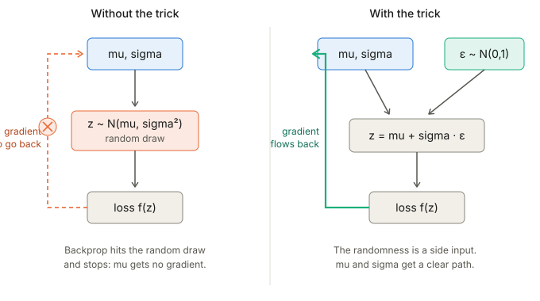
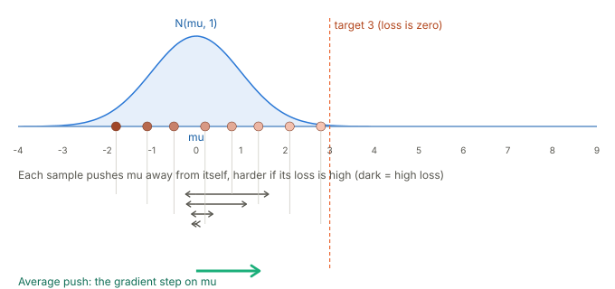

## Links

- **[Interactive version](figures/interactive.html)**: the three pictures below, with sliders and a
  button to redraw samples.
- **[Rejection sampling reparameterization](../2017-naesseth-rejection-reparameterization/index.html)**:
  extends the trick to distributions (Gamma, Beta) with no simple location-scale form.
- **[The ELBO](../elbo/index.html)**: the objective a VAE optimises, whose gradient needs this trick.

## In one paragraph

Many objectives are an expectation over a distribution that has parameters,
$L(\theta)=\mathbb E_{z\sim q_\theta}[f(z)]$, and we want $\nabla_\theta L$. Drawing a sample $z$ is a
random step that backpropagation cannot see through. There are two standard ways around it. The
**reparameterization trick** moves the randomness into a parameter-free noise variable, so $z$
becomes a differentiable function of $\theta$. The **score-function (REINFORCE) estimator** leaves
the draw alone and instead differentiates the *density*, so it works even when $f$ is a black box or
$z$ is discrete, at the price of much noisier gradients.

## The problem

We want to minimise $L(\mu)=\mathbb E_{z\sim\mathcal N(\mu,1)}[(z-3)^2]$. Intuitively the answer is to
centre the Gaussian on $3$. Run naively, the program draws $z$, evaluates the loss, and has no
recorded link from $\mu$ to that $z$, so autodiff reports no gradient.



## Reparameterization trick

Write the sample as a deterministic function of the parameters and some noise that does not depend on
them:

$$
z = g_\theta(\varepsilon),\qquad \varepsilon\sim p(\varepsilon).
$$

Then the gradient can be moved inside the expectation, because the distribution being averaged over
no longer depends on $\theta$:

$$
\nabla_\theta\,\mathbb E_{z\sim q_\theta}[f(z)]
= \nabla_\theta\,\mathbb E_{\varepsilon\sim p}[f(g_\theta(\varepsilon))]
= \mathbb E_{\varepsilon\sim p}\big[\nabla_\theta f(g_\theta(\varepsilon))\big].
$$

For a Gaussian, $z=\mu+\sigma\varepsilon$ with $\varepsilon\sim\mathcal N(0,1)$, so $\partial z/\partial\mu=1$
and $\partial z/\partial\sigma=\varepsilon$. In the example the loss becomes $(\mu+\varepsilon-3)^2$,
which is an ordinary function of $\mu$ for each fixed $\varepsilon$.

Picture: the noise samples are fixed, and moving $\mu$ or $\sigma$ slides and stretches the samples
smoothly. Every sample stays connected to the parameters, which is exactly what backprop needs. The
[interactive page](figures/interactive.html) lets you drag both.

What it requires: $z$ must be a differentiable function of $\theta$ for fixed $\varepsilon$, and $f$ must
be differentiable in $z$. Location-scale families and anything with an invertible CDF qualify. A VAE
encoder outputs $\mu,\sigma$ and samples $z=\mu+\sigma\varepsilon$, so the whole ELBO trains end to end.
Discrete variables have no smooth $g$, so they need a relaxation such as Gumbel-Softmax.

```python
import torch

mu = torch.tensor(0.0, requires_grad=True)
opt = torch.optim.SGD([mu], lr=0.1)

for step in range(200):
    eps = torch.randn(())          # noise, independent of mu
    z = mu + eps                   # reparameterized sample
    loss = (z - 3.0) ** 2
    opt.zero_grad()
    loss.backward()                # gradient flows through z to mu
    opt.step()
```

Replacing the sample with `torch.normal(mu, 1.0).detach()` would leave `mu` with no gradient at all.

## Score-function (REINFORCE) estimator

### Concrete first: the same example, loss as a black box

Draw $z\sim\mathcal N(\mu,1)$ and use

$$
\hat g=(z-3)^2\cdot(z-\mu).
$$

The first factor is the loss of the sample. The second, $z-\mu$, is the gradient of $\log\mathcal N(z;\mu,1)$
with respect to $\mu$, called the *score*. The update is $\mu\leftarrow\mu-\text{lr}\cdot\hat g$.

Intuition: each sample says "move the mean away from here, in proportion to how bad this sample
was." A high-loss sample on the left of $\mu$ pushes $\mu$ to the right; a low-loss sample barely pushes
at all. Averaged over many samples these pushes add up to the true gradient. The next picture shows
the pushes as arrows.



The picture is not static in the interactive page: slide $\mu$ toward and past $3$ and the averaged push
shrinks and then flips; redrawing samples shows the average arrow wobbling, which is the variance.

### Abstractly: the log-derivative trick

Differentiate the expectation. Only the density depends on $\theta$:

$$
\nabla_\theta\!\int q_\theta(z)f(z)\,dz=\int f(z)\,\nabla_\theta q_\theta(z)\,dz .
$$

Use the identity $\nabla_\theta q_\theta = q_\theta\,\nabla_\theta\log q_\theta$ to turn the integral back
into an expectation under $q_\theta$:

$$
\boxed{\;\nabla_\theta\,\mathbb E_{z\sim q_\theta}[f(z)]=\mathbb E_{z\sim q_\theta}\big[f(z)\,\nabla_\theta\log q_\theta(z)\big]\;}
$$

A one-sample estimate is $f(z)\nabla_\theta\log q_\theta(z)$. For the Gaussian, $\nabla_\mu\log q=z-\mu$,
which gives the recipe above.

What it requires: you can sample from $q_\theta$, and you can compute $\nabla_\theta\log q_\theta(z)$.
Nothing is assumed about $f$ (it may be a simulator, a rating, a non-differentiable reward) and $z$ may be
discrete.

**Baseline.** Because $\int q_\theta=1$ for every $\theta$, the expected score is zero,
$\mathbb E[\nabla_\theta\log q_\theta]=0$. So for any $b$ that does not depend on $z$,

$$
\nabla_\theta\,\mathbb E[f(z)]=\mathbb E\big[(f(z)-b)\,\nabla_\theta\log q_\theta(z)\big],
$$

with the same mean and, for a good $b$ such as the average loss, much smaller variance. In
reinforcement learning, $z$ is an action, $f$ is the reward and $q_\theta$ is the policy, and this is the
policy-gradient theorem.

## Comparing the two

Both estimators are unbiased. The second panel of the [interactive page](figures/interactive.html)
draws single-sample estimates of the same gradient from each: the reparameterized ones bunch around
the true value, and the score-function ones scatter far wider. The reparameterized gradient uses the *derivative* of $f$, which carries direction
information; the score-function estimate sees only the *value* of $f$ multiplied by a score, so one
unlucky sample can swing it.

| | Reparameterization | REINFORCE |
|---|---|---|
| Needs $f$ differentiable | yes | no |
| Works for discrete $z$ | no (needs a relaxation) | yes |
| Variance | low | high (baselines help) |
| What is differentiated | $f$ along $g_\theta(\varepsilon)$ | $\log q_\theta$ |

## Questions and doubts

- A baseline that depends on $z$ breaks the zero-mean argument above; the standard fixes (control
  variates, REBAR, RELAX) make it depend on $z$ and then correct the bias. Worth working through.
- When a distribution has no location-scale form, the [rejection-sampling paper](../2017-naesseth-rejection-reparameterization/index.html)
  gives a hybrid: reparameterize the accepted sample and use a score-function correction for the
  acceptance step. How big is the correction term in practice?
- Gumbel-Softmax is a biased reparameterization of a discrete variable. How does the temperature trade
  bias against variance relative to REINFORCE with a baseline?

## Takeaways

- Both methods estimate the gradient of the same expectation; they differ in *where the randomness
  sits* in the computation graph.
- Reparameterization routes the gradient through the sample, so it needs a differentiable $f$ and
  a differentiable map from noise to sample, and in return gives low variance.
- REINFORCE routes the gradient through the log-density, so it is general (black-box $f$, discrete $z$),
  and in return it is noisy and wants a baseline.
