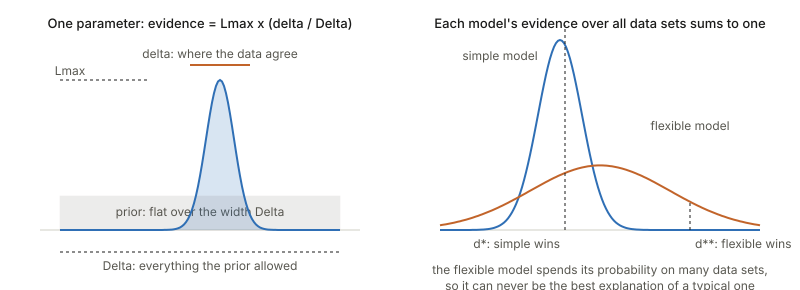
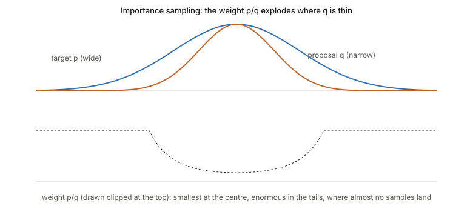
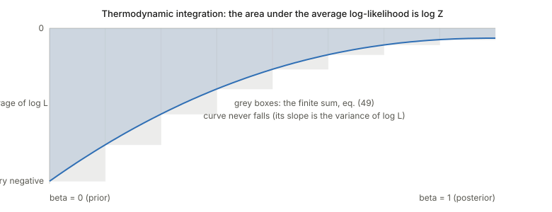
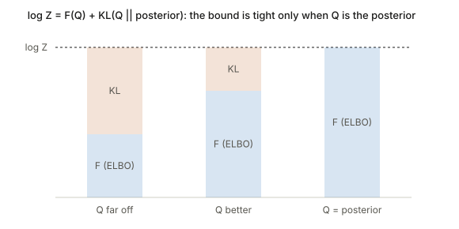
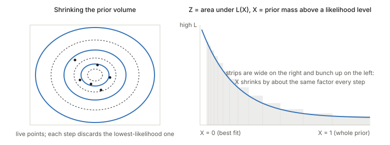

## Links

- **[arXiv:1411.3013](https://arxiv.org/abs/1411.3013)** — preprint (v2, November 2015, the version
  these notes follow). Published in *Digital Signal Processing* 47, a special issue for W. J. Fitzgerald.
- **[Interactive companion](figures/interactive.html)** — three widgets: the Occam factor with sliders,
  a nested-sampling run you can step through, and the importance-sampling ratio estimator next to the
  version printed as eq. (38).
- **[The ELBO](../elbo/index.html)** — the background page for section 4.6 (variational Bayes): the
  same identity $\log Z = \text{bound} + \mathrm{KL}$, there called the ELBO.
- **[Expectation–Maximization](../expectation-maximization/index.html)** — the same "lower bound plus a
  KL gap" idea, for point estimates.
- **[Langevin dynamics](../langevin-dynamics/index.html)** — the Gibbs law $e^{-U/D}$ behind the
  statistical-physics analogy of section 4.3.
- **[Code](https://github.com/msrepo/theory_inclined_papers_with_annotations/blob/main/papers/2015-knuth-bayesian-evidence/code/figures.py)** —
  only the script that draws the figures. The code blocks below are for reading; the notes quote no
  output from running them.

## In one paragraph

To compare two **theories** (families of models) $M_1$ and $M_2$ against data $d$, Bayes' theorem says the
posterior odds equal the prior odds times a ratio of **evidences** $Z_k = P(d\mid M_k)$, the probability each
theory assigned to the data *averaged over its own prior*. That average is the whole story: a theory is
rewarded for fitting, and punished for having spread its prior over many parameter values that fit badly.
The punishment is the **Occam factor**, and it is automatic. The catch is that $Z$ is an integral over the
whole parameter space, almost never solvable. The paper is a tour of ways to estimate it: replace the
integrand by a Gaussian (**Laplace**), sample from a stand-in (**importance sampling**), slowly turn the
likelihood on (**thermodynamic integration**, **annealed importance sampling**), lower-bound it with a
simpler distribution (**variational Bayes**), or sweep the likelihood from the top down (**nested
sampling**). Four applications close it: signal detection, a light sensor, exoplanet light curves, and
force fields for proteins.

It is a review, so there is little to "prove" in the sense of a new theorem. What is worth doing, and what
these notes do, is work each derivation line by line, say what each step buys, and check the equations
as printed. Several have small slips (collected in *Questions and doubts*), and one application claim
looks hard to square with the paper's own formulas.

## The spine of the argument

1. Posterior odds of two theories = prior odds × Bayes factor, and the Bayes factor is a ratio of
   evidences (section 2).
2. An evidence is a likelihood averaged over the prior, so it equals *best fit × Occam factor*, where the
   Occam factor is the fraction of the prior that fits the data (section 3).
3. Computing the evidence integral is the hard part, and each method trades one difficulty for another
   (section 4):
   - **Laplace**: assume the integrand is a Gaussian bump. Cheap and exact for Gaussians; wrong for
     skewed or multi-peaked integrands.
   - **Importance sampling**: reweigh samples from an easy distribution. Fine only if the weights stay tame.
   - **Thermodynamic integration / AIS**: connect an easy distribution (the prior) to the hard one (the
     posterior) through a path, and accumulate the change in normaliser along the path.
   - **Variational Bayes**: the evidence is bounded below by a computable quantity, and the slack is a KL.
   - **Nested sampling**: turn the many-dimensional integral into a one-dimensional integral over prior
     mass, and estimate the mass by counting how fast a cloud of points shrinks.
4. Examples show each use: the evidence picking between "signal" and "no signal", between numbers of
   Gaussians, between physical effects, between force fields (section 5).

## Setup and notation

| Symbol | Meaning |
|---|---|
| $d$ | the data |
| $m$ | one particular model (a parameter value) inside a theory |
| $M$ (or $M_1, M_2$) | a *theory*: a family of models, e.g. "a line" or "a quadratic" |
| $I$ | all background information, written to the right of the bar |
| $P(m\mid M,I)$ | prior over parameters inside the theory |
| $P(d\mid m,M,I)$ | likelihood, written $L(m)$ |
| $Z = P(d\mid M,I)$ | the **evidence** (also the *marginal likelihood*) |
| $\mathrm{OR}$ | the **odds ratio** or **Bayes factor** $Z_1/Z_2$ |

Two warnings about words. First, "model selection" here means choosing a *theory* (a whole family), not a
parameter value. Choosing a parameter value is parameter estimation, where the evidence is only the
normalising constant and can be ignored. Second, the abstract calls Bayes factors "also known as log odds
ratios": the Bayes factor is the *ratio*, its logarithm is the log odds ratio, and neither is the
posterior odds unless the prior odds are one.

## From Bayes' theorem to the odds ratio (section 2)

Start with the product rule written two ways, $P(m,d\mid M)=P(m\mid M)P(d\mid m,M)=P(d\mid M)P(m\mid d,M)$
(eqs. 1–3). Equate and divide:

$$P(m\mid d,M)=P(m\mid M)\,\frac{P(d\mid m,M)}{P(d\mid M)}.$$

The denominator is whatever makes the left side add up to one, so

$$Z=P(d\mid M)=\int dm\,P(m\mid M)\,P(d\mid m,M)\qquad\text{(eqs. 5–6)}.$$

That is where the name *marginal likelihood* comes from: the parameter has been integrated out.

For two theories, apply the product rule to the joint $P(M_k,d\mid I)$ both ways and divide the two
cases (eqs. 7–9):

$$\frac{P(M_1\mid d,I)}{P(M_2\mid d,I)}=\frac{P(M_1\mid I)}{P(M_2\mid I)}\times\underbrace{\frac{Z_1}{Z_2}}_{\mathrm{OR}}.$$

The factor $P(d\mid I)$ appears in both joints and cancels, which is why it never matters. (Eq. 7 as
printed has the same expression on both sides of the equals sign, a typo: the left side should be
$P(M_1,d\mid I)/P(M_2,d\mid I)$, the right side the first line of eq. 8.)

*Intuition.* Each theory makes a bet: "if I am right, the data will look like this". The evidence is how
much probability each theory put on what was actually seen. The odds ratio compares the two bets.

## Occam's razor falls out (section 3)

Take one parameter $x$ with a flat prior over a width $\Delta x$. Let $L_{\max}$ be the best likelihood
value, and define the **effective width** of the likelihood as the width of a rectangle of height
$L_{\max}$ that has the same area (eq. 13):

$$\delta x=\frac{1}{L_{\max}}\int L(x)\,dx .$$

Then, because the prior density is the constant $1/\Delta x$,

$$Z=\frac{1}{\Delta x}\int L(x)\,dx=L_{\max}\,\frac{\delta x}{\Delta x}=L_{\max}\,W,\qquad 0\le W\le1\qquad\text{(eqs. 14–17)}.$$

So **evidence = best fit × Occam factor**, and the Occam factor $W$ is the fraction of the prior that is
compatible with the data.



Read the left panel as a competition for a fixed budget. The prior has one unit of probability to hand
out, and spreads it evenly. A bigger $\Delta x$ means each parameter value gets less, so the same
likelihood bump earns less evidence. "By making the prior broader we pay in evidence."

The right panel is the more useful picture (it is the standard one from MacKay's textbook, not drawn in
this paper). Fix a theory. Its evidence is a *probability distribution over data sets*: it must integrate
to one over everything the theory could have predicted. A flexible theory can fit many data sets, so it
spreads its one unit thinly. A rigid theory fits few data sets, but puts a lot of weight on those. If
the data land where the rigid theory said they would, it wins by a lot; if the data land where only the
flexible theory could have gone, the flexible one wins. Nothing penalises complexity by decree. It is
a consequence of normalisation.

More parameters mean more factors: if each of $K$ extra parameters has the same ratio $\delta x/\Delta x$,
the Occam factor behaves like $(\delta x/\Delta x)^K$. Once the fit cannot improve any further, adding
parameters only costs.

### A Gaussian worked in full (eqs. 18–19)

With $n$ independent observations of a quantity with known noise level $\sigma$, the likelihood depends on
the data only through the sample mean $\bar d$ and sample variance $v$:

$$L(x)=(2\pi\sigma^2)^{-n/2}\exp\!\Big\{-\tfrac{n}{2\sigma^2}\big[(x-\bar d)^2+v\big]\Big\}.$$

(Expand $\sum_i(x-d_i)^2=n(x-\bar d)^2+nv$ to see it.) As a function of $x$ this is a Gaussian centred at
$\bar d$ with standard deviation $\sigma/\sqrt n$, and $L_{\max}$ is its peak value. Its area is the peak
times $\sqrt{2\pi}\,\sigma/\sqrt n$, so if the prior range comfortably contains the bump,

$$W=\frac{\sqrt{2\pi}\,\sigma}{\Delta x\,\sqrt n}.$$

This reads well. The bump gets narrower as the data increase ($\sqrt n$), so the Occam factor *shrinks*
with more data. That is not a bug: with more data you have learnt the parameter more precisely, and you
are paying for having specified it so tightly *out of the prior range*. A theory with a free parameter
has to be worth that cost.

The odds ratio between a theory with no free parameter ($M_0$) and one with $x$ free ($M_1$) is then
$\mathrm{OR}\approx\frac{L(M_0)}{L_{\max}}\cdot\frac{\Delta x}{\delta x}$ (eq. 20): a likelihood ratio, the
only thing a frequentist likelihood-ratio test uses, times an Occam factor the test leaves out.

## Why computing $Z$ is hard

$Z$ is an integral of prior × likelihood over *all* parameters. Nothing is wrong with the integral; the
trouble is that nearly all of the integrand's mass sits in a tiny region that you do not know the
location or shape of, in a space with many dimensions. Averaging the likelihood over prior samples
nearly never lands in that region. Posterior samples (from MCMC) land there, but they say *nothing* about
the normalising constant, because MCMC never needs it. Every method below is a way around this.

## Laplace approximation (section 4.1)

*Idea.* Near its peak, any smooth log-density looks like a downward parabola, and a parabola in the log is
a Gaussian. A Gaussian's integral is known.

Expand $\ln p$ around the peak $x_0$, where the slope is zero (eq. 22):

$$\ln p(x)\simeq\ln p(x_0)+\tfrac12(\ln p)''(x_0)\,(x-x_0)^2 .$$

The curvature is negative at a maximum, so define the width through $\sigma^2=-1/(\ln p)''(x_0)$. Then
$p(x)\simeq p(x_0)\exp\{-(x-x_0)^2/2\sigma^2\}$ and

$$Z=\int p\simeq p(x_0)\sqrt{2\pi\sigma^2}.$$

In $N$ dimensions the curvature becomes the Hessian $A_{ij}=-\partial_i\partial_j\ln p(x_0)$ and (eq. 30)

$$Z\simeq p(x_0)\sqrt{\frac{(2\pi)^N}{\det A}} .$$

With $p$ = prior × likelihood, this is the evidence. Look at the shape: $\sqrt{(2\pi)^N/\det A}$ is the
volume of the Gaussian bump, so Laplace is "peak height × peak volume", the same $L_{\max}\cdot W$
decomposition as before, now with the bump volume measured by the curvature at the top. Sharper curvature
means a bigger $\det A$ and a smaller bump.

*Where it fails.* Skewed peaks, several peaks, a ridge that is not Gaussian-shaped. It is also exact when
the integrand is Gaussian (then there is no approximation at all), which is why it is the base of
richer schemes such as the evidence framework and INLA.

(Eq. 23 as printed has an extra $\tfrac12$ inside $\sigma^2=-\big(\tfrac12(\ln p)''\big)^{-1}$, which would make
$\sigma^2$ twice too large. See the doubts.)

```python
import numpy as np

def laplace_log_evidence(log_p, x0, hessian):
    """log Z for p(x) = prior * likelihood, given the mode x0 and the Hessian of -log p there."""
    N = len(x0)
    sign, logdet = np.linalg.slogdet(hessian)
    return log_p(x0) + 0.5 * N * np.log(2 * np.pi) - 0.5 * logdet
```

## Importance sampling (section 4.2)

*Idea.* To average $f$ under a hard distribution $p$, sample from an easy distribution $q$ and correct each
sample by the weight $p/q$. Rewrite $p=\frac pq\,q$ (the only requirement is that $q>0$ wherever $p>0$):

$$\langle f\rangle_p=\frac{\int f\,\frac pq\,q}{\int\frac pq\,q}\;\approx\;\frac{\sum_i f(x_i)\,p(x_i)/q(x_i)}{\sum_i p(x_i)/q(x_i)},\qquad x_i\sim q\qquad\text{(eqs. 32–34)}.$$

The denominator is what lets $p$ be unnormalised.



Why the weights must stay tame: the tails of $p$ are exactly where $q$ is rare, so the few samples that land
there carry enormous weights, and a handful of those dominate the sum. The estimate then depends on
whether one lucky sample showed up. A proposal narrower than the target is dangerous for just that reason.

**The estimator for a ratio of evidences (eqs. 35–38).** Writing $Z_p=\int p$, $Z_q=\int q$ and sampling
$x_i$ from the *normalised* $q/Z_q$, the right estimator is the plain average of the weights:

$$\frac{Z_p}{Z_q}=\int\frac pq\cdot\frac q{Z_q}\;\approx\;\frac1N\sum_i\frac{p(x_i)}{q(x_i)} .$$

The paper's eq. (38) instead prints $\sum_i p^2(x_i)/q^2(x_i)\big/\sum_i p(x_i)/q(x_i)$. That looks like
eq. (34) applied with $f=p/q$, and eq. (34) averages under $p$, not under $q$, so it estimates a different
quantity. A two-point example shows it is not the same: if the weight $p/q$ takes the value 1 or 3 with
equal chance under $q$, the correct estimate tends to 2, while (38) tends to $10/4$. See the interactive
page, which runs both. (A natural reading is a typo; the thing written in eq. 37, $\langle p/q\rangle_q$, is
right.)

## The statistical-physics dictionary (section 4.3)

Physics integrates a Boltzmann weight $e^{-\beta E(x)}$ over all configurations $x$ to get the **partition
function** $Z(\beta)=\int dx\,e^{-\beta E(x)}$. Evidence is the same integral:

| Physics | Bayes |
|---|---|
| configuration $x$ | parameter $m$ |
| energy $E(x)$ | $-\log L(m)$ |
| inverse temperature $\beta$ | exponent on the likelihood |
| partition function $Z(\beta{=}1)$ | the evidence |
| density of states $g(E)$ | prior mass at each energy level |

The **density of states** $g(E)=\int dm\,P(m)\,\delta[E-E(m)]$ says how much prior mass sits at energy
$E$ (eq. 42). Group the integral by energy level and the evidence collapses to one dimension (eq. 43):

$$Z=\int dE\,g(E)\,e^{-E}.$$

*Why this is a big deal.* A $10^3$-dimensional integral has become a one-dimensional one, provided you
can find $g(E)$. Everything else in the paper is two families of ways to do that. **Thermal methods**
(sections 4.4, 4.5) raise the likelihood to a power $\beta$ and slide it from 0 to 1,
$P(m)\,L(m)^\beta$ (eq. 44), bridging the prior ($\beta=0$) and the posterior ($\beta=1$). **Nested
sampling** (4.7) estimates $g$ directly.

## Thermodynamic integration (section 4.4)

*Idea.* Instead of $Z(1)$ itself, estimate the *change* in $\log Z$ as $\beta$ moves from 0 to 1, by
integrating a slope that samples can measure.

Take the path $p(x\mid\beta)\propto p_0^{1-\beta}p_1^\beta$ with normaliser $Z(\beta)=\int p_0^{1-\beta}p_1^\beta$.
Differentiate $\log Z$:

$$\partial_\beta\log Z=\frac1{Z(\beta)}\int p_0^{1-\beta}p_1^\beta\,\log\frac{p_1}{p_0}\,dx=\Big\langle\log\frac{p_1}{p_0}\Big\rangle_\beta\qquad\text{(eq. 47)}.$$

The derivative of a log-normaliser is an average of what the parameter multiplies in the exponent: the
standard trick. Integrate from 0 to 1 and split into slices (eqs. 48–49):

$$\log\frac{Z(1)}{Z(0)}=\int_0^1\Big\langle\log\frac{p_1}{p_0}\Big\rangle_\beta\,d\beta\;\approx\;\sum_i\Big\langle\log\frac{p_1}{p_0}\Big\rangle_{\beta_i}(\beta_{i+1}-\beta_i).$$

For evidence take $p_0=$ prior (so $Z(0)=1$) and $p_1=$ prior × likelihood (so $Z(1)=$ evidence), and the
integrand is the average **log-likelihood** under the tempered posterior.



Three things to notice. The curve never falls: its slope is the *variance* of the log-likelihood under
$p(\cdot\mid\beta)$, which cannot be negative (differentiate $\langle\log L\rangle_\beta$ once more). The
curve starts at the average log-likelihood under the *prior*, which is typically very negative, so the
area is a large negative number: $\log Z$ is mostly a cost, the Occam penalty, paid when you compress
from the prior to the posterior. And the rectangles only follow the curve well if the steps are placed
where it moves. The paper flags this as an open difficulty for systems with phase transitions, and
mentions ensemble annealing (choose each next $\beta$ so that the KL divergence between consecutive
distributions is constant) as a response.

If the two theories share parameters, the same machinery run between the two *posteriors* (eqs. 50–51)
estimates the log odds ratio directly, with no need for either evidence alone.

## Annealed importance sampling (section 4.5)

Thermodynamic integration estimates $\log(Z_1/Z_0)$ and then exponentiates; the result is generally
biased. **AIS** estimates the *ratio* itself without bias.

Run a chain of intermediate distributions $p_0,p_1,\dots,p_n$ (for example along the geometric path). Each
run $j$ generates states $x_1^{(j)},\dots$, where $x_i$ comes from a Markov step that leaves $p_i$
invariant, started from $x_{i-1}$. Give the run the weight (eq. 53)

$$w^{(j)}=\prod_i\frac{p_{i+1}(x_i^{(j)})}{p_i(x_i^{(j)})} .$$

Neal's result: $\mathbb E[w]=Z_1/Z_0$ **exactly**, whether or not the chain has equilibrated. A sketch of why:
the whole run is one big sample from a joint distribution over the path $(x_0,x_1,\dots)$. Pair it with a
"reverse" joint in which the same states are generated backwards, started from $p_1$. Each forward
transition is invariant for $p_i$, so each factor turns into a term of a plain importance weight between the
reversed and forward joints, and the telescoping product of ratios is $w$. The reverse joint has total mass $Z_1$ and
the forward one $Z_0$, so $\mathbb E[w]=Z_1/Z_0$.

**Arithmetic against geometric mean (eqs. 55–58).** The AIS estimate is the arithmetic mean $\frac1M\sum_j w^{(j)}$.
Doing thermodynamic integration on the same runs and exponentiating gives $\exp\big(\frac1M\sum_j\log w^{(j)}\big)$,
the *geometric* mean of the same weights. By the arithmetic–geometric inequality the geometric mean is never larger, so
the exponentiated thermodynamic-integration estimate sits at or below AIS, and the gap grows with the
spread of $\log w$. The paper does not say which side the bias is on; it is on the low side (Jensen).

## Variational Bayes (section 4.6)

*Idea.* Do not try to compute $\log Z$; build a number that is *below* it and that you can compute, and push
it up.

Take any density $Q(m)$. Because $Q$ integrates to one, $\log Z=\int Q(m)\log Z\,dm$ (eq. 60). Use
$Z=P(d,m)/P(m\mid d)$ (the product rule again), multiply and divide by $Q$, and split the log (eqs. 61–65):

$$\log Z=\underbrace{\int Q\log\frac{P(d,m)}{Q}}_{F(Q)\ \text{(negative free energy)}}+\underbrace{\int Q\log\frac{Q}{P(m\mid d)}}_{\mathrm{KL}[Q\,\|\,P(m|d)]}.$$

The first term needs only the joint, never the evidence. The second is a KL divergence, always $\ge0$, and
zero only when $Q$ is the posterior. So $F(Q)\le\log Z$ for every $Q$, with equality at the posterior
(eq. 66). This is the same identity as the ELBO; the paper's "negative free energy" is the ELBO, and
"ensemble learning" is an old name for the same method.



The total never changes; maximising $F$ and minimising the KL are the *same* act. You cannot minimise the KL
directly because it contains the unknown $P(m\mid d)$. You can raise $F$.

**The mean-field step (eqs. 67–70).** To make $F$ tractable, restrict $Q$ to a product $Q(m_0)Q(m_1)$. Holding
$Q(m_1)$ fixed and collecting the terms involving $m_0$,

$$F=\int Q(m_0)\,\mathcal I(m_0)\,dm_0-\int Q(m_0)\log Q(m_0)\,dm_0+C,\qquad\mathcal I(m_0)=\int Q(m_1)\log P(d,m_0,m_1)\,dm_1 .$$

Writing $\mathcal I=\log e^{\mathcal I}$ puts this in KL form, and the best $Q(m_0)$ is proportional to
$e^{\mathcal I(m_0)}$ (eq. 70): **the optimal factor is the average of the log-joint over the other factors,
exponentiated**. Alternate, one factor at a time. This is "coordinate ascent", and each pass raises $F$.

Two cautions, both visible in the paper's text. Eq. (69) as printed reads $F=\mathrm{KL}[\cdot]+C$ and then
says $F$ is "minimised" at the optimum. With the signs as derived it should be $F=-\mathrm{KL}+C$, so $F$ is
*maximised* when the KL vanishes. The closing sentence of the section ("estimated by minimizing the negative
free energy") has the same slip. And a product-form $Q$ cannot equal a posterior whose factors are
correlated, so with the mean-field restriction the gap never closes. $F$ is a lower bound, not an estimate,
and a systematic one at that.

## Nested sampling (section 4.7)

This is the paper's centre of gravity: three of the four applications use it.

*Idea.* Instead of sliding a temperature, sort the parameter space by likelihood and ask: how much
prior mass lies *above* each likelihood level? Call this

$$X(L)=\int_{P(d|m)>L}P(m)\,dm\in[0,1]\qquad\text{(eq. 71)}.$$

$X$ is 1 at $L=0$ (the whole prior), and falls to 0 at the top. Flip the axes and the evidence is the area under
the curve $L(X)$, an **ordinary one-dimensional integral over $[0,1]$** (eq. 72):

$$Z=\int_0^1L(X)\,dX\;\approx\;\sum_iL_i\,(X_{i-1}-X_i).$$

(Why: $Z=\int L\,dP$, and $dP=dX$ along a path that visits parameters in order of likelihood. It is the same
change of variable as grouping by energy level.)



The values $L_i$ are known from the samples. The prior masses $X_i$ are not, but can be estimated
without knowing the shape of $L$:

1. Draw $N$ **live points** from the prior. Their prior masses above their likelihood, sorted, are $N$ uniform
   numbers on $[0,1]$: the proportion of the prior with higher likelihood is uniform because we drew from the prior.
2. Throw away the worst point (lowest likelihood $L_1$). Everything above $L_1$ has mass $X_1$, which is
   the *largest* of $N$ uniforms, and the other $N-1$ points are uniform on $[0,X_1]$. The
   fraction $t=X_1/X_0$ has density $Nt^{N-1}$ (eq. 73), so $\mathbb E[\ln t]=-1/N$.
3. Replace the discarded point by a new draw from the prior *restricted to likelihood above $L_1$* (typically by a short
   MCMC run started from one of the survivors). We have $N$ uniform points again, on the smaller region.
4. Repeat. After $i$ rounds, $\ln X_i\approx-i/N$ with a spread of about $\sqrt i/N$.

So the mass shrinks geometrically, by the same factor each round, wherever the likelihood sits. That is why the
strips in the picture are wide on the right and narrow near the peak.

```python
import numpy as np

def nested_sampling(log_like, sample_prior, constrained_step, n_live=100, n_iter=1000, rng=None):
    rng = rng or np.random.default_rng()
    live = [sample_prior(rng) for _ in range(n_live)]
    logL = np.array([log_like(x) for x in live])
    log_Z, log_X_prev = -np.inf, 0.0
    for i in range(1, n_iter + 1):
        worst = int(np.argmin(logL))
        log_X = -i / n_live                                    # expected shrinkage
        log_w = np.log(np.exp(log_X_prev) - np.exp(log_X))     # width of the strip
        log_Z = np.logaddexp(log_Z, logL[worst] + log_w)
        log_X_prev = log_X
        keep = rng.integers(n_live)                            # start from a survivor
        live[worst] = constrained_step(live[keep], threshold=logL[worst], rng=rng)
        logL[worst] = log_like(live[worst])
    return log_Z                                               # (plus the remaining live points)
```

**Why it survives phase transitions where tempering does not (Figure 1 of the paper).** A tempered
posterior at inverse temperature $\beta$ is dominated by the place on the $\ln L$–$\ln X$ curve where
the slope equals $-1/\beta$-ish: raising $\beta$ moves along the curve by following its slope. Where
the curve bends the wrong way (a region where $\ln L$ against $\ln X$ is convex, as at a first-order phase
transition), no $\beta$ lands there. The tempered distribution has to *jump* from one branch to the other
and any chain following it gets stuck. Nested sampling walks down the $X$ axis at a steady rate and does not
care what shape $L(X)$ has.

The practical cost is the step 3 sampling under a hard constraint $L>L_1$. The paper lists answers: ellipsoid
fits (Mukherjee et al.), clusters of ellipsoids for several peaks (MultiNest, limited to tens of
parameters by the clustering), Hamiltonian and Galilean Monte Carlo that bounce off the constraint boundary,
"demon" variables that smooth it, and **diffusive nested sampling**, which fixes the shrinkage per level
instead of estimating it.

## Example 1: signal detection (section 5.1)

*Setting.* Decide whether a known waveform $s(t)$ is present in $M$ channels, each coupled by a known
weight $C_m$, with unknown amplitude $\alpha>0$ and Gaussian noise of known level $\sigma_n$. Two models
(eqs. 74–75): noise only $x_m(t)=n_m(t)$, and signal plus noise $x_m(t)=\alpha C_ms(t)+n_m(t)$.

The odds ratio is $Z_{S+N}/Z_N$ (eq. 76). Divide the signal-plus-noise likelihood by the noise-only one. The
parts that depend on $x$ only through $x^2$ cancel, leaving

$$\frac{L_{S+N}(\alpha)}{L_N}=\exp\Big\{\frac{\alpha}{\sigma_n^2}\underbrace{\sum_{m,t}C_mx_m(t)s(t)}_{\text{cross-correlation}}-\frac{\alpha^2}{2\sigma_n^2}\sum_{m,t}C_m^2s^2(t)\Big\}.$$

With a Gaussian prior on $\alpha$ (mean $\hat\alpha$, standard deviation $\sigma_\alpha$) and the abbreviations
$S^2=\sigma_n^2/\sigma_\alpha^2$, $D=S^2+\sum C_m^2s^2$ and $E=S^2\hat\alpha+\sum C_mx_ms$ (eqs. 85–88), the exponent
is a quadratic in $\alpha$. Complete the square, $D\alpha^2-2E\alpha+S^2\hat\alpha^2=D(\alpha-E/D)^2-E^2/D+S^2\hat\alpha^2$,
and the integral over $\alpha$ is a Gaussian integral, giving eq. (90):

$$\frac{Z_{S+N}}{Z_N}=\exp\Big\{\frac{E^2/D-S^2\hat\alpha^2}{2\sigma_n^2}\Big\}\frac{Z_d}{Z_\alpha}.$$

If $\alpha$ may take either sign, the two Gaussian normalisers are $\sqrt{2\pi\sigma_n^2/D}$ and
$\sqrt{2\pi\sigma_\alpha^2}$ and the log odds ratio is (eq. 98, which I checked and which is right)

$$\log\mathrm{OR}_\pm=\tfrac12\Big[\frac{E^2}{D\sigma_n^2}-\frac{\hat\alpha^2}{\sigma_\alpha^2}+\log\frac{S^2}{D}\Big].$$

If $\alpha>0$ is enforced, the normalisers become half-Gaussians and carry the erf factors of eqs. (93–95).
In words: **the evidence-based detector is a squared (matched-filter) cross-correlation, plus constants
that depend on the prior.** That is a satisfying outcome for a derivation: it says the classical
correlator is what the Bayesian answer looks like when the prior is not informative, and it names exactly
which prior terms the classical one throws away.

*A reading to check.* In this setup $C_m$, $s(t)$, $\sigma_n$ and the prior are all fixed, so $D$ is a constant
and the *only* data-dependent quantity in the log odds ratio is the cross-correlation $\sum C_mx_ms$. Both detectors
are then monotone functions of one number (for $\mathrm{OR}_\pm$, up to the sign symmetry; for $\mathrm{OR}_+$ the
mixture over $\alpha>0$ of increasing exponentials is increasing in the correlation). Two detectors that are monotone
functions of the same statistic have the *same* ROC curve and the same area under it. The paper reports different
areas (Figures 3 and 4), so the "Correlation Method" baseline must be something else, most plausibly a
correlation *coefficient* normalised by the energy of each window, which is a different statistic. The comparison
may still be fair, but "beats correlation" then means "beats normalised correlation", which is a weaker
claim than it sounds. The experiment is described in a companion paper [115], not here, and I have not checked it.

## Examples 2–4 (sections 5.2–5.4)

**Light sensor (5.2).** The sensor's spatial sensitivity is modelled as a mixture of $1$ to $4$ Gaussians (6 parameters each),
and nested sampling estimates each model's $\log Z$ from calibration sweeps over a black-and-white surface.
Table 1 reports $\log Z=-665.1\pm2.4$ for one Gaussian and $-669\pm12$ for two, with the three- and four-Gaussian
rows far lower and with large uncertainties. The one-Gaussian model has the highest mean evidence and is chosen. The paper itself
says the error bars are large enough that "selection of a best model based on the log-evidence alone is not
clear", and blames the degeneracies of mixtures (swapping two components changes nothing, so the likelihood has $K!$ identical peaks
and the constrained sampling in step 3 struggles).

**Exoplanets (5.3).** Four effects add to the light curve of a star with a planet: the planet's reflected light
(Lambertian phases, eq. 101), its thermal emission (day and night sides, eq. 102), Doppler beaming of the star
(eq. 103, shifted in phase by $\pi/2$ against the other two), and the tides the planet raises on the star.
Each subset of effects is a theory; MultiNest computes each evidence and the Occam factor automatically
discounts effects the data cannot resolve. The point of the example is the *framing*: "which physical effects
are detectable in this data?" is a model-selection question.

**Force fields (5.4).** Compare molecular-mechanics force fields by the evidence of NMR data they give for a protein, which
penalises a force field that fits only by being unconstrained. Same recipe, much larger parameter spaces, where
nested sampling and its variants (Hamiltonian, demon variables) are being pushed.

## Questions and doubts

**Slips in the printed equations** (each checked by redoing the algebra):

1. **Eq. (23), the Laplace variance.** $\sigma^2=-\big(\tfrac12(\ln p)''\big)^{-1}$ is twice the value needed. From
   eq. (22), $\ln p\simeq\ln p(x_0)+\tfrac12(\ln p)''(x-x_0)^2$, matching $-(x-x_0)^2/2\sigma^2$ gives
   $\sigma^2=-1/(\ln p)''$. As printed, eq. (24) would read $-(x-x_0)^2/\sigma^2$, not $/2\sigma^2$.
2. **Eqs. (29)–(30).** Eq. (29) divides by the $Z$ of eq. (30), which includes the factor $p(x_0)$; the Gaussian in (29)
   does not carry that factor. They are consistent if (29) is read as a density and (30) as the integral of the *un*normalised
   $p$, but the same symbol means two things.
3. **Eq. (38), importance sampling for a ratio of evidences.** Not the estimator derived in eq. (37); see above.
4. **Eqs. (60)–(66), notation.** The data are written $M$ and the evidence $P(M\mid I)$, though $M$ was the *theory* everywhere else.
5. **Eq. (69) and the sentence after (70).** $F=-\mathrm{KL}+C$, not $+\mathrm{KL}$, and the bound is *maximised*. The sentence
   "estimated by minimizing the negative free energy" should say *maximising*.
6. **Eq. (7)** has the same expression on both sides, and eq. (20) writes $D$ for the data in some places and $d$ in others.

**Things that are not slips but deserve care:**

- **The evidence is sensitive to the prior width, and that is a feature with a catch.** $Z\propto1/\Delta x$ for a flat
  prior. Doubling $\Delta x$ halves the evidence and, if the other theory has no such parameter, halves the odds ratio.
  So a Bayes factor is only as meaningful as the prior ranges, and a prior wide "to be safe" can swing the answer
  arbitrarily (Lindley's paradox). With an improper prior the Occam factor is zero and the evidence is undefined.
  The paper says priors "must be assigned" but gives little guidance for the case where you have no strong information.
- **The paper says nested sampling "elegantly circumvents" the path choice.** True of the path; it replaces it with a
  different problem, sampling inside a hard likelihood contour, which is where all the listed variants (ellipsoids,
  Hamiltonian, demons, diffusive levels) go to work. In high dimensions that is exactly as hard as before; it is displaced, not removed.
- **Table 1 and degeneracy.** The error bars grow with model order faster than the means move, which suggests the
  numbers for three and four components are mostly measuring sampler failure. The choice of one Gaussian is
  plausible on parsimony grounds, but the gap between one and two ($\approx4$ in the log, against a standard
  deviation of $\approx12$ on the second) is not distinguishable from zero on the paper's own numbers.
- **Variational Bayes underestimates uncertainty** under a product-form $Q$ because $\mathrm{KL}[Q\,\|\,P]$ penalises mass
  where $P$ is small more than missing mass where it is large. The paper treats $F$ as an evidence estimate; a lower
  bound whose slack you cannot measure (it contains the unknown evidence) cannot tell you how wrong it is.
- **Laplace for mixtures.** The posterior of a mixture model has $K!$ symmetric peaks; Laplace around one peak misses a factor
  $K!$ in the evidence unless added by hand, which matters when comparing models with different $K$.
- **"Probability is not decision theory"** (the closing remark) is the part most often ignored: the posterior probability
  of a theory is not the same as a reason to choose it, because costs of wrong choices differ. The paper recommends
  using the posterior in an expected-utility calculation and leaves it there.
- **Is the thermodynamic-integration estimate biased in practice?** Eq. (49) is a left-endpoint Riemann sum of a
  non-decreasing function (the curve in the picture never falls), so it *underestimates* the integral for any finite
  number of steps, on top of the Monte-Carlo noise in each average. Whether that or the sampling error dominates depends on the problem.

## Takeaways

- The evidence is the probability a theory gave the data, averaged over its own prior; **Occam's razor is that average**,
  not an add-on penalty. $Z=L_{\max}\times$ (fraction of the prior that fits).
- Compare theories by Bayes factors, but remember the prior ranges are inside every evidence, and posterior odds need prior odds too.
- Laplace is "peak height × peak volume"; importance sampling needs tame weights; thermodynamic integration is the area under
  a never-falling curve of average log-likelihood against $\beta$; AIS is unbiased where exponentiated thermodynamic
  integration is biased low; variational Bayes is $\log Z=F+\mathrm{KL}$ with $F$ computable;
  nested sampling turns a many-dimensional integral into $\int_0^1L(X)\,dX$ with $\ln X$ falling by $1/N$ per step.
- The detection derivation is clean (completing a square), and the result is a squared matched filter with prior-dependent
  constants. The claim that it beats plain correlation should be read with the baseline in mind.
- When reading a review like this one, check the formulas: several of the equations above are mis-signed, mis-scaled or mislabelled in the
  printed version, none fatal, all of the kind that costs an afternoon if copied into code.
