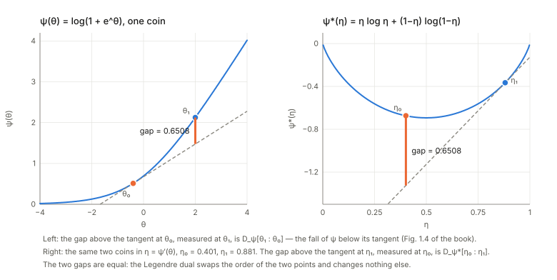
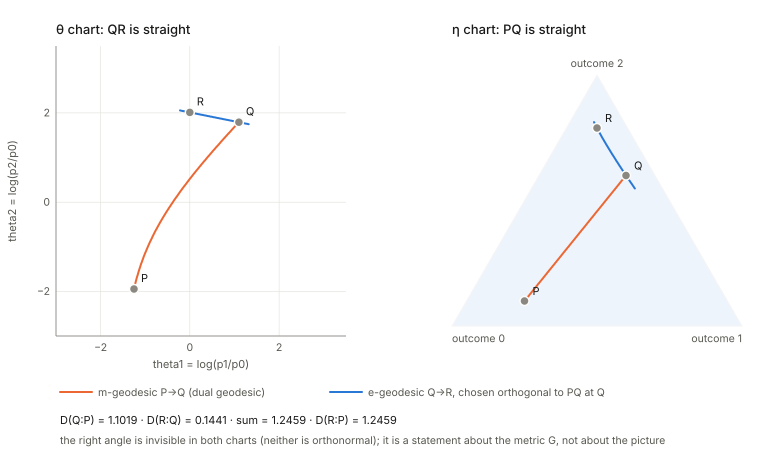
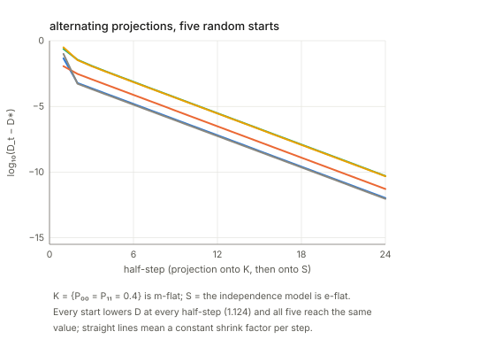

## Links

- **[Interactive companion](figures/interactive.html)**: three widgets on the three-outcome probability triangle. (1) Drag
  two distributions and watch the e-geodesic (straight in the logits), the m-geodesic (straight in the probabilities)
  and the Fisher–Rao geodesic part ways. (2) Build a right-angled triangle and tilt it away from the right angle to see
  the Pythagorean theorem fail by exactly the amount the proof predicts. (3) Project a point onto a straight line or
  a curved arc, for either order of the KL divergence, and count the critical points.
- **[Runnable checks](https://github.com/msrepo/theory_inclined_papers_with_annotations/tree/main/papers/2016-amari-dually-flat-structure/code)**:
  `code/dually_flat.py` prints every number on this page and regenerates the figures with
  `python3 code/dually_flat.py --figures`. `make verify` runs it, in about a second.
- The book: Amari, *Information Geometry and Its Applications* (Springer, 2016), DOI
  [10.1007/978-4-431-55978-8](https://doi.org/10.1007/978-4-431-55978-8). These notes cover Chapter 1 only. Equation numbers
  such as (1.69) refer to the book. No text of the book is reproduced here; everything is restated and re-derived.
- Background pages this one leans on: **[The Fisher information matrix](../fisher-information/index.html)**
  (the metric $g$ of §2 is the Fisher matrix when the family is a statistical model; natural gradient is §7 there),
  **[EM and Gaussian mixtures](../expectation-maximization/index.html)** (the alternating projections of §6
  are the geometric reading of EM).
- Papers in this collection that use this geometry: **[Gao & Chaudhari 2021](../2021-gao-coupled-transfer-distance/index.html)**
  and **[Karczewski et al. 2026](../2026-karczewski-spacetime-diffusion/index.html)**.

## In one paragraph

Take a family of probability distributions, say the outputs of a 3-class softmax classifier. Two coordinate systems
describe it equally well: the **logits** $\theta$ and the **probabilities** $\eta$. Neither is "right", but each makes a
different kind of path look straight. The chapter's idea is that **one convex function $\psi$ builds a whole geometry**.
Its gap above its own tangent is a **divergence** $D_\psi$ (an asymmetric stand-in for squared distance); its
slope $\eta=\nabla\psi(\theta)$ is the second coordinate system (the **Legendre transform**); and its curvature
$G=\nabla^2\psi$ is a **metric** that turns the divergence into a local squared length. For softmax, $\psi$ is
log-sum-exp, $\eta$ is the softmax output, $\psi^*$ is the negative entropy and $D_\psi$ is the KL divergence with
its arguments reversed. The payoff is a **Pythagorean theorem**: if the $\eta$-straight line from $P$ to $Q$ meets
a $\theta$-straight line from $Q$ to $R$ at a right angle (in the metric $G$), then $D(R{:}P)=D(Q{:}P)+D(R{:}Q)$
exactly, not just approximately. From it follow the **projection theorem** (the closest point on a flat family is
where the orthogonality holds, and it is unique), and the **alternating minimisation** that underlies EM and
iterative scaling. Almost everything in the rest of the book is this chapter applied to something.

## The spine of the argument

1. A **manifold** is a space where each point can be labelled by $n$ numbers; relabelling is allowed. Probability
   families, positive measures, positive-definite matrices and weight spaces all qualify (§1).
2. A **divergence** $D[P{:}Q]$ is a non-negative, zero-only-at-equality function that looks like a *positive-definite
   quadratic form* for nearby points. That quadratic form is a Riemannian metric $g$, so a divergence gives a
   manifold a geometry for free (§2).
3. Convexity gives divergences on demand: **gap of a convex function above its tangent plane = Bregman divergence**,
   and its metric is the Hessian (§3). Exponential families are the example that matters: $\psi$ is their
   normaliser, $\nabla\psi$ the mean, $\nabla^2\psi$ the covariance, and $D_\psi$ a KL divergence.
4. Slopes are coordinates too. The **Legendre transform** $\eta=\nabla\psi(\theta)$ is invertible, its potential
   $\psi^*$ is convex, $G^*=G^{-1}$, and the divergence of the dual is the divergence of the primal with the two
   arguments swapped (§4).
5. So the manifold carries **two flat structures** at once, one straight in $\theta$, one straight in $\eta$, joined
   by one metric. Vectors have two sets of components that pair up without needing the metric (§5).
6. A right angle between a straight line of one kind and a straight line of the other kind makes
   $D$ **additive**: Pythagoras. Everything else, projections, uniqueness, alternating minimisation, is
   a corollary (§6).

## Setup and notation

The running example throughout is a **3-class softmax**, because it makes every object concrete.

| Chapter-1 object | In the softmax example | Name in the book |
|---|---|---|
| point $P$ | a distribution $p=(p_0,p_1,p_2)$ | point of a manifold |
| $\theta$ | logits relative to class 0: $\theta_i=\log(p_i/p_0)$, $i=1,2$ | affine coordinates; "natural parameters" |
| $\eta=\theta^*$ | probabilities $(p_1,p_2)$ | dual affine coordinates; "expectation parameters" |
| $\psi(\theta)$ | $\log(1+e^{\theta_1}+e^{\theta_2})$, log-sum-exp with baseline logit 0 | potential; cumulant function; free energy |
| $\psi^*(\eta)$ | $\sum_{i=0}^2 p_i\log p_i$, the negative entropy | Legendre dual |
| $D_\psi[P{:}Q]$ | $\mathrm{KL}[p_Q\Vert p_P]$, **reversed** | Bregman divergence |
| $G=\nabla^2\psi$ | $\operatorname{diag}(\eta)-\eta\eta^\top$, the softmax covariance | Riemannian metric $g_{ij}$ |
| $G^*=\nabla^2\psi^*$ | $\operatorname{diag}(1/\eta_i)+\tfrac1{p_0}\mathbf 1\mathbf 1^\top$, equal to $G^{-1}$ | $g^{*ij}$ |
| straight in $\theta$ | $p_i(t)\propto p_i^{1-t}q_i^{t}$, a normalised geometric mixture | "geodesic" (e-geodesic in later chapters) |
| straight in $\eta$ | $p(t)=(1-t)p+tq$, an ordinary mixture | "dual geodesic" (m-geodesic in later chapters) |

Two words that are easy to misread. **"Geodesic" here means "straight line in an affine coordinate system", not
"shortest path".** The shortest path in the metric (the Fisher–Rao geodesic) is a third curve, shown in §5.
And **"flat" is a property of a submanifold relative to a chart**: a family that is a straight line in $\theta$ is
*flat* (e-flat in later chapters), one that is a straight line in $\eta$ is *dual flat* (m-flat).

## 1. Manifolds and coordinates (§1.1)

A manifold, in the sense used here, is a set of objects such that each one can be labelled by $n$ real numbers and
nearby objects get nearby labels. You can always relabel by an invertible smooth map $\zeta=f(\xi)$. What stays
fixed is the *set*, what changes is the *description*. The whole subject lives off a tension: the geometry should not
depend on the description, but some natural notions (straightness, convexity) do.

Examples the chapter lists, with the coordinates worth knowing.

- **Gaussians** $N(\mu,\sigma^2)$: $(\mu,\sigma)$ with $\sigma>0$ is one chart. The moments $(m_1,m_2)=(\mu,\mu^2+\sigma^2)$
  and the natural parameters $\theta=(\mu/\sigma^2,\,-1/(2\sigma^2))$ are two more. At $(\mu,\sigma)=(1,2)$ these are
  $(1,5)$ and $(0.25,-0.125)$. The last two will turn out to be a dual pair (§3).
- **Distributions on $n+1$ outcomes**: the open probability simplex $S_n$. The charts are $(p_1,\dots,p_n)$ (with $p_0$
  determined) and the logits $\theta_i=\log(p_i/p_0)$.
- **Positive measures** $\mathbb R^n_+$: the same, with the total mass left free. Images, spectra and histograms live here.
- **Positive-definite matrices**, an $n(n+1)/2$-dimensional manifold, and **neural networks**, whose weights $W$ are a
  chart for the "neural manifold". The book only names these here and returns to them later.

## 2. Divergence: a squared distance that is not symmetric (§1.2)

**What is asked of $D$.** Three things: $D[P{:}Q]\ge0$; $D[P{:}Q]=0$ only if $P=Q$; and for $Q=P+d\xi$ the function
is, to second order, a positive-definite quadratic form in $d\xi$:

$$
D[\xi:\xi+d\xi]=\tfrac12\,g_{ij}(\xi)\,d\xi^i d\xi^j+O(|d\xi|^3),\qquad G=(g_{ij})\succ0 .
$$

**Why the first-order term is missing.** For fixed $P$, the map $Q\mapsto D[P{:}Q]$ is $\ge0$ and equals $0$ at $Q=P$, so $P$ is a
minimum and the gradient there is zero. What is left at second order is the Hessian, which is a
quadratic form; condition (3) just says it is positive-definite rather than merely positive semi-definite. The
metric is *defined* by $ds^2=2D[\xi:\xi+d\xi]=g_{ij}d\xi^id\xi^j$, with the factor 2 chosen so that
$D=\tfrac12\|\Delta\|^2$ gives the identity matrix.

Check on the softmax at $p=(0.5,0.3,0.2)$, moving along $(+1,-1)$ in the coordinates $(p_1,p_2)$ (metric
$\left[\begin{smallmatrix}5.333&2\\2&7\end{smallmatrix}\right]$ there). The ratio of the true $\mathrm{KL}[p{:}p+d\xi]$ to
$\tfrac12 d\xi^\top g\,d\xi$ is $1.2558$ for a step of $0.1$, $1.0121$ for $0.01$ and $1.0011$ for $0.001$, tending to
1 linearly in the step, as a third-order remainder predicts.

**Asymmetry is the point.** $D[P{:}Q]\ne D[Q{:}P]$ in general: for $P=(0.7,0.2,0.1)$ and $Q=(0.1,0.3,0.6)$,
$\mathrm{KL}[P{:}Q]=1.1019$ and $\mathrm{KL}[Q{:}P]=1.0021$. You can symmetrise by averaging (1.26), but the book
insists the asymmetry carries information, and §5 and §6 show how. Two nearby points are nevertheless almost symmetric:
expanding $D[\xi{+}d\xi{:}\xi]$ about the base point $\xi{+}d\xi$ and using $g(\xi+d\xi)=g(\xi)+O(|d\xi|)$ shows
the two orderings agree up to $O(|d\xi|^3)$, so *every* divergence with the same metric looks alike at second order.
What distinguishes them is the third-order asymmetry, which the book defers to Part II (a general divergence yields a metric plus a pair of dual affine connections, not flat in general).

**It is not a distance, not even after a square root.** Take three coins that land heads with probability $0.99$, $0.5$, $0.01$.
Then $\mathrm{KL}[a{:}c]=4.503$ while $\mathrm{KL}[a{:}b]+\mathrm{KL}[b{:}c]=0.637+1.614=2.252$, so the
triangle inequality fails. The book also says the square root fails; here it does, narrowly: $\sqrt{4.503}=2.122$ against
$0.798+1.271=2.069$.

**The book's examples (1.28)–(1.34), and what I checked about them.**

- *Euclidean* $\tfrac12\|\xi_P-\xi_Q\|^2$: $g=I$, symmetric.
- *KL* (1.30), and its extension to positive measures (1.31): $\sum m_{1i}\log\frac{m_{1i}}{m_{2i}}-m_{1i}+m_{2i}$, which reduces
  to ordinary KL when both masses are 1.
- *Matrix divergences* for positive-definite $P,Q$:
  (1.32) $\operatorname{tr}(P\log P-P\log Q-P+Q)$ (quantum relative entropy);
  (1.33) $\operatorname{tr}(PQ^{-1})-\log\det(PQ^{-1})-n$;
  (1.34) an $\alpha$-family, $\frac4{1-\alpha^2}\operatorname{tr}\!\big(-P^{\frac{1-\alpha}2}Q^{\frac{1+\alpha}2}+\frac{1-\alpha}2P+\frac{1+\alpha}2Q\big)$.
  On 2000 random pairs of $3\times3$ positive-definite matrices the smallest values were $0.2881$ (1.32), $0.1112$
  (1.33), $0.2662$ and $0.2820$ (1.34 with $\alpha=0.3$ and $-0.7$), all positive, and all vanish at $P=Q$.
  Two facts the book does not state: **(1.33) is exactly twice the KL divergence between the zero-mean Gaussians $N(0,P)$ and
  $N(0,Q)$** (quadrature in 2-D gives $0.60454$ for the KL and $1.20908$ for (1.33), ratio $2.0000$), and **the
  $\alpha\to-1$ limit of (1.34) is (1.32)** ($4.91458$ against $4.91458$ for $\alpha=-0.999999$), while $\alpha\to+1$ gives
  (1.32) with the arguments swapped ($5.37512$ against $5.37513$). That matters later: which sign of $\alpha$ is "KL
  from the data" depends on this convention.

## 3. Convex functions give divergences (§1.3)

**A picture first.** Draw a convex function $\psi$ and its tangent line at a point $\theta_0$. The curve stays above
the line. The vertical gap at another point $\theta$ is the **Bregman divergence**

$$
D_\psi[\theta:\theta_0]=\psi(\theta)-\psi(\theta_0)-\nabla\psi(\theta_0)\cdot(\theta-\theta_0).
$$

It is $\ge0$ by convexity, and it is zero only at $\theta=\theta_0$ if $\psi$ is *strictly* convex. Taylor-expanding $\psi$ about
$\theta_0$ shows $D_\psi[\theta_0+d\theta:\theta_0]=\tfrac12d\theta^\top\nabla^2\psi(\theta_0)\,d\theta+O(|d\theta|^3)$, so the metric of §2 is
the **Hessian**, $g_{ij}=\partial_i\partial_j\psi$ (1.86).

**Strict convexity caveat.** The book states that a smooth function is convex exactly when its Hessian is positive-definite.
Strictly, positive *semi*-definite is the criterion for convex, and positive-definite is *sufficient* for strictly convex but not
necessary. $\psi(x)=x^4$ is strictly convex, so $D[x{:}0]=x^4=0.0625$ at $x=0.5$ is positive, yet its Hessian $12x^2$ is zero at
$x=0$. Then criterion (3) of Definition 1.1 (a positive-definite $g$) fails at that point: you get a divergence-like gap but not a Riemannian
metric there. What the construction actually needs is $\nabla^2\psi\succ0$ everywhere.

**Examples (1.37)–(1.50).**

- $\psi=\tfrac12\|\xi\|^2$ gives $D=\tfrac12\|\xi-\xi_0\|^2$ and $g=I$: ordinary Euclidean geometry.
- $\psi=-\sum\log\xi_i$ on positive vectors gives $D=\sum[\log\frac{\xi'_i}{\xi_i}+\frac{\xi_i}{\xi'_i}-1]$ (1.48), the
  Itakura–Saito divergence of audio processing. At random points the Bregman definition and this closed form agree
  ($0.601510$ both).
- $\varphi=\sum\xi_i\log\xi_i$ gives the generalised KL (1.31); on probability vectors, plain KL ($0.094608$ both ways in my
  check). Negative entropy is convex, which is why KL is a Bregman divergence at all.
- **Exponential family** (1.39–1.58), the example that carries the whole book. A distribution of the form
  $p(x;\theta)=\exp\{\theta\cdot x+k(x)-\psi(\theta)\}$ has a normaliser $\psi(\theta)=\log\int e^{\theta\cdot x+k(x)}dx$.
  For softmax, $x$ is the indicator vector of classes 1 and 2 and $\psi$ is log-sum-exp.

**Why $\psi$ is convex, and what its derivatives are.** Differentiate the normalisation $\int p(x;\theta)\,dx=1$
with respect to $\theta_i$: $\int(x_i-\partial_i\psi)\,p\,dx=0$, so
$\nabla\psi(\theta)=\mathbb E_\theta[x]$ (1.54), the mean of the sufficient statistic. Differentiate once more:
$\partial_i\partial_j\psi=\mathbb E[(x_i-\bar x_i)(x_j-\bar x_j)]$, the covariance matrix (1.56), which is positive-definite
because a covariance is. So $\psi$ is convex and its Hessian is the covariance. Checks: for the softmax at
$\theta=(0.4,-0.8)$ the finite-difference gradient $(0.507224,0.152773)$ equals the mean of the class indicators, and the
Hessian $\left[\begin{smallmatrix}0.24995&-0.07749\\-0.07749&0.12943\end{smallmatrix}\right]$ equals their covariance, entry by entry.

**The Gaussian, as promised.** With $x=(x,x^2)$ the natural parameters are $\theta=(\mu/\sigma^2,-1/(2\sigma^2))$,
$\psi(\theta)=-\theta_1^2/(4\theta_2)+\tfrac12\log(-\pi/\theta_2)$, and $\nabla\psi=(\mu,\mu^2+\sigma^2)$: the **moment coordinates
of §1.1 are the dual coordinates**. At $(\mu,\sigma)=(1,2)$, $\nabla\psi=(1,5)$ and the Hessian is
$\left[\begin{smallmatrix}4&8\\8&48\end{smallmatrix}\right]$, matching the covariance of $(x,x^2)$ by quadrature
($\operatorname{Var}x=\sigma^2=4$, $\operatorname{Cov}(x,x^2)=2\mu\sigma^2=8$, $\operatorname{Var}x^2=2\sigma^4+4\mu^2\sigma^2=48$).

**Bregman divergence of an exponential family = KL, with the arguments reversed.** The book says "after careful
calculation"; here it is in two lines. Since $\log p(x;\theta')-\log p(x;\theta)=(\theta'-\theta)\cdot x-\psi(\theta')+\psi(\theta)$,

$$
\mathrm{KL}[p_{\theta'}\Vert p_\theta]=\mathbb E_{\theta'}\big[(\theta'-\theta)\cdot x\big]-\psi(\theta')+\psi(\theta)
=\psi(\theta)-\psi(\theta')-\nabla\psi(\theta')\cdot(\theta-\theta')=D_\psi[\theta{:}\theta'],
$$

using $\mathbb E_{\theta'}[x]=\nabla\psi(\theta')$. So **$D_\psi[\theta{:}\theta']=\mathrm{KL}[p_{\theta'}\Vert p_\theta]$ (1.57–1.58)**. Numerically, for
softmax logits $\theta=(0.4,-0.8)$ and $\theta'=(-0.5,0.9)$: $D_\psi[\theta{:}\theta']=0.570189$, $\mathrm{KL}[p_{\theta'}\Vert p_\theta]=0.570189$
and the other order $0.520678$. For the Gaussians $N(1,2^2)$ and $N(-0.5,1.2^2)$ the Bregman value $0.472076$ equals the KL by
quadrature. **Keep this reversal in mind**; it decides which projection minimises which KL in §6.

## 4. The Legendre dual: slopes as coordinates (§1.4)

**Idea.** Because $\nabla^2\psi\succ0$, the slope map $\theta\mapsto\eta=\nabla\psi(\theta)$ is one-to-one: distinct points of the
graph have distinct tangent planes. So *the slope can serve as a coordinate*. For softmax this says that the logits
and the probabilities are two names for the same point, and the map between them (softmax) is the slope map of log-sum-exp.

**The dual potential.** Define $\psi^*(\eta)=\theta\cdot\eta-\psi(\theta)$ with $\theta=\theta(\eta)$ the inverse of the slope map
(equivalently $\psi^*(\eta)=\max_{\theta'}\{\theta'\cdot\eta-\psi(\theta')\}$, the usual definition, because the maximiser has slope $\eta$).
Differentiate with respect to $\eta$:

$$
\nabla\psi^*(\eta)=\theta+\frac{\partial\theta}{\partial\eta}\eta-\nabla\psi(\theta)\frac{\partial\theta}{\partial\eta}=\theta ,
$$

because the last two terms cancel when $\nabla\psi(\theta)=\eta$. So the map is **symmetric**: $\eta=\nabla\psi(\theta)$ and
$\theta=\nabla\psi^*(\eta)$ (1.64). Differentiating again, $\nabla^2\psi^*=\partial\theta/\partial\eta$, the Jacobian of the inverse map, which
is the matrix inverse of $\partial\eta/\partial\theta=\nabla^2\psi$. So $G^*=G^{-1}$ (1.66), positive-definite, and $\psi^*$ is
convex. In the softmax example, at $\theta=(0.4,-0.8)$: $G=\left[\begin{smallmatrix}0.2499&-0.0775\\-0.0775&0.1294\end{smallmatrix}\right]$,
$G^*=\left[\begin{smallmatrix}4.9127&2.9412\\2.9412&9.4868\end{smallmatrix}\right]$ and their product is the identity to 10 decimals.

**The dual divergence is the primal one with its arguments swapped** (1.68). Write $\theta_a,\theta_b$ for the points with
dual coordinates $\eta_a,\eta_b$. Then

$$
D_{\psi^*}[\eta_a{:}\eta_b]=\psi^*(\eta_a)-\psi^*(\eta_b)-\theta_b\cdot(\eta_a-\eta_b)
=\psi(\theta_b)-\psi(\theta_a)-\eta_a\cdot(\theta_b-\theta_a)=D_\psi[\theta_b{:}\theta_a],
$$

where the middle step substitutes $\psi^*(\eta)=\theta\cdot\eta-\psi(\theta)$ at both points and the terms collapse. With
$\theta=(0.4,-0.8)$, $\theta'=(-0.5,0.9)$ again: $D_\psi[\theta{:}\theta']=0.570189=D_{\psi^*}[\eta'{:}\eta]$. For one coin
($\psi=\log(1+e^\theta)$, $\theta_0=-0.4$, $\theta_1=2$, so $\eta_0=0.401$ and $\eta_1=0.881$) the two gaps in the figure above
are $0.6508$ and $0.6508$.

**Theorem 1.1, the self-dual form.** $D_\psi[P{:}Q]=\psi(\theta_P)+\psi^*(\eta_Q)-\theta_P\cdot\eta_Q$. Proof: substitute
$\psi^*(\eta_Q)=\theta_Q\cdot\eta_Q-\psi(\theta_Q)$ and use $\eta_Q=\nabla\psi(\theta_Q)$; you get the definition back. This is
the Fenchel–Young inequality, $\psi(\theta)+\psi^*(\eta)\ge\theta\cdot\eta$, with equality exactly when $\eta=\nabla\psi(\theta)$ (the
check gives $1.1\times10^{-16}$ at $\eta'=\eta$). The form is what makes the Pythagorean proof short: it separates the
divergence into a term depending on $\theta_P$, a term depending on $\eta_Q$, and one *bilinear pairing* between them.

**Examples (1.71)–(1.79).**

- Euclidean $\psi$ is its own dual ($\psi^*=\tfrac12\|\xi^*\|^2$, $\xi^*=\xi$): self-dual, so the two flat structures coincide.
- The pair $\psi=-\sum\log\xi_i$, $\psi^*=-\sum[1+\log(-\xi^*_i)]$, and the pair $\varphi=\sum\xi_i\log\xi_i$, $\varphi^*=\sum e^{\xi^*_i-1}$. Both
  verified numerically at $\xi=(0.7,1.9,0.4)$: $-3.631112$ both ways for the first, $3.000000$ both ways for the second,
  and the gradients of the duals return $\xi$.
- **Exponential family**: $\theta^*=\nabla\psi(\theta)=\mathbb E_\theta[x]$ is the expectation parameter, and
  $\psi^*(\theta^*)=\int p\log p\,dx$, the **negative entropy** (1.78). For the softmax at $\theta=(0.4,-0.8)$,
  $\psi^*(\eta)=-0.998131$ and $\sum_ip_i\log p_i=-0.998131$. The dual divergence is KL in the natural order,
  $D_{\psi^*}[\theta^*{:}\theta^{*\prime}]=\mathrm{KL}[p_\theta\Vert p_{\theta'}]$ (1.79).

A deep-learning reading of the whole section: **logits ↔ probabilities is a Legendre pair, log-sum-exp ↔ negative
entropy is its potential pair, and cross-entropy training (a KL divergence) is a Bregman divergence in one of the two charts.**

## 5. Two flat structures and one metric (§1.5)

**Two kinds of straight.** Declare $\theta$ an affine coordinate system: a curve $\theta(t)=at+b$ is straight, an
*e-geodesic*. Declare $\eta$ affine too: $\eta(t)=at+b$ is a *m-geodesic*. Because $\theta\mapsto\eta$ is not linear, the
two families of lines are different. The picture below shows one pair $P=(0.7,0.2,0.1)$, $Q=(0.1,0.3,0.6)$
joined by both, in the logit chart (left, e-geodesic straight) and the probability triangle (right, m-geodesic straight).

At $t=0.5$ the e-geodesic passes through $(0.3507,0.3247,0.3247)$ (a normalised geometric mixture, $p_i\propto\sqrt{p_iq_i}$)
and the m-geodesic through $(0.4,0.25,0.35)$. Neither is the **Fisher–Rao geodesic**, the true shortest path for the
metric $G$ (a great-circle arc after $p\mapsto\sqrt p$), which passes through $(0.3788,0.2821,0.3391)$. In this example it sits
between the other two in eight of the nine coordinates I looked at ($t\in\{0.25,0.5,0.75\}$, three coordinates each); the exception is $p_2$ at $t=0.75$, where the three
values are $0.4692$ (e), $0.4750$ (m) and $0.4754$ (Fisher–Rao). That is the pattern one expects from the standard fact, which this chapter does not prove, that the Riemannian
connection is the average of the two flat ones, but it is only an observation about one pair of points.

**The metric, and the two sets of components.** On the dually flat manifold, $ds^2=2D_\psi[\theta{:}\theta+d\theta]=g_{ij}d\theta^id\theta^j$
with $g_{ij}=\partial_i\partial_j\psi$ (1.85–1.86). The tangent vectors along the $\theta$-axes, $e_i$, are the same
at every point (the chart is affine), and $g_{ij}=\langle e_i,e_j\rangle$. Along the $\eta$-axes the tangent vectors are $e^{*i}$,
and $\langle e_i,e^{*j}\rangle=\delta_i^{\,j}$: the two bases are **reciprocal**. A vector can be written either way,
$A=A^ie_i=A_ie^{*i}$, and the two component lists are related by $A_i=g_{ij}A^j$, $A^i=g^{ij}A_j$ (1.105).

*The Einstein convention, in plain words.* When an index appears once up and once down in a term, sum over it. It
is bookkeeping with a purpose: an up index means "how many steps along each $\theta$-axis", a down index means "how
much the vector registers on each $\eta$-axis", and a sum of one with the other is a number that does not depend on the chart.
So the length is $|A|^2=A^iA_i=g_{ij}A^iA^j$.

Concretely, at $p=(0.5,0.3,0.2)$ (so $\theta=(\log0.6,\log0.4)$): $G=\left[\begin{smallmatrix}0.21&-0.06\\-0.06&0.16\end{smallmatrix}\right]$ and
$G^*=G^{-1}=\left[\begin{smallmatrix}5.3333&2\\2&7\end{smallmatrix}\right]$. A unit step along $\theta_1$ has components
$A^i=(1,0)$ and $A_i=GA=(0.21,-0.06)$, so $|A|^2=0.2100$. The *same* components $A^i$ at the point
$p=(0.2,0.2,0.6)$ give $|A|^2=0.1600$: parallel transport in the flat structure keeps components, **not lengths**,
because the metric changes from place to place.

**The remarkable property: orthogonality survives if you transport the two vectors by different rules.** Transport $A$ so that its
$A^i$ stay fixed (the $\theta$-flat rule), and $B$ so that its $B_i$ stay fixed (the $\eta$-flat rule). Then
$\langle A,B\rangle=A^iB_i$ never changes. Check: pick $B$ with $B^\top GA=0$ at $p=(0.5,0.3,0.2)$. Transporting both by the
$\theta$ rule gives $\langle A,B\rangle=+0.0156$ at $p=(0.2,0.2,0.6)$, so the right angle is lost; transporting
$A$ by the $\theta$ rule and $B$ by the $\eta$ rule gives $0.0$. This is the algebraic reason the Pythagorean theorem needs *one
line of each kind*.

**What survives and what does not under a change of chart.** The convexity of $\psi$ is a property of the chart:
re-expressing the Gaussian potential in $(\mu,\sigma)$ gives $\tilde\psi=\mu^2/(2\sigma^2)+\log\sigma+\text{const}$ and at
$(\mu,\sigma)=(0,1)$ the second derivative in $\sigma$ is $-1.0000<0$, so it is **not convex there** (1.80), while it is convex in $\theta$.
Only **affine** maps $\theta'=A\theta+b$ keep it (1.81): then $\psi'(\theta')=\psi(A^{-1}(\theta'-b))$ is convex, the new dual
coordinates are $\eta'=A^{-\top}\eta$ (check: $(-0.752257,-0.517311)$ both ways) and the divergence is unchanged
($0.570189$ both before and after). So the structure is *tied to an affine class of charts*, not to the manifold alone.

## 6. The Pythagorean theorem and projections (§1.6)

### Theorem 1.2 and its proof

Let $P,Q,R$ be three points. Suppose the **m-geodesic** from $P$ to $Q$ is orthogonal, at $Q$, to the **e-geodesic**
from $Q$ to $R$. Then $D_\psi(R{:}P)=D_\psi(Q{:}P)+D_\psi(R{:}Q)$.

*Proof, with the algebra written out.* Expand all three divergences with the self-dual form
$D(X{:}Y)=\psi(\theta_X)+\psi^*(\eta_Y)-\theta_X\cdot\eta_Y$ and use $\psi(\theta_Q)+\psi^*(\eta_Q)=\theta_Q\cdot\eta_Q$ (equality in
Fenchel–Young at a single point). Everything collapses to

$$
D(Q{:}P)+D(R{:}Q)-D(R{:}P)=(\theta_Q-\theta_R)\cdot(\eta_Q-\eta_P).
$$

The m-geodesic is $\eta(t)=(1-t)\eta_P+t\eta_Q$ with tangent $\eta_Q-\eta_P$; the e-geodesic is $\theta(t)=(1-t)\theta_Q+t\theta_R$ with
tangent $\theta_R-\theta_Q$. Orthogonality in the metric is *exactly* the vanishing of the pairing of one tangent given by its
$\eta$-components with the other given by its $\theta$-components, which is the right-hand side. $\blacksquare$

Numerically, with $P=(0.7,0.2,0.1)$, $Q=(0.1,0.3,0.6)$ and $R$ placed on the $\theta$-line through $Q$ orthogonal to $PQ$, the sides
hold to rounding error for every $t$: at $t=2.2$ ($R=(0.1055,0.1054,0.7891)$) $D(Q{:}P)=1.101868$, $D(R{:}Q)=0.144079$ and
$D(R{:}P)=1.24594757=D(Q{:}P)+D(R{:}Q)$.

**In KL language** (recall $D_\psi(R{:}P)=\mathrm{KL}[p_P\Vert p_R]$): if the *m*-geodesic $PQ$ meets the *e*-geodesic $QR$
at a right angle, then $\mathrm{KL}[P\Vert R]=\mathrm{KL}[P\Vert Q]+\mathrm{KL}[Q\Vert R]$: here $1.245948=1.101868+0.144079$.
Theorem 1.3 is the mirror statement for $D_{\psi^*}$, with the roles of the two flat structures exchanged; it holds
numerically in the same way ($1.01763228$ on both sides at one test, $1.09640857$ at another).

### A slip in the printed proof

The proof as printed states the intermediate identity (1.114) as $(\theta_P-\theta_Q)\cdot(\theta^*_Q-\theta^*_R)$, then ends
by using the orthogonality $(\theta^*_P-\theta^*_Q)\cdot(\theta_Q-\theta_R)=0$ of (1.119). These are not the same pairing: the algebra gives $(\theta_Q-\theta_R)\cdot(\eta_Q-\eta_P)$, which vanishes exactly when (1.119) does, whereas the printed
line pairs the wrong pairs of points in each factor. Over 200 random triples the
form derived above matches $D(Q{:}P)+D(R{:}Q)-D(R{:}P)$ to $1.1\times10^{-15}$, the printed form is off by up to $13.29$. Two sample triples: left side $+0.431233$,
derived form $+0.431233$, printed form $-0.291944$; and $+0.917832$, $+0.917832$, $-1.378993$. The theorem is right and (1.119) is right; only the intermediate line has the indices permuted. (The interactive companion shows both forms next to the true residual.)

### Projections (Theorems 1.4 and 1.5)

Given a point $P$ and a submanifold $S$, the **divergence from $P$ to $S$** is the smallest $D$ over $S$ (1.121). The question
is where the minimum sits. The book defines the **geodesic projection** (the $\theta$-straight segment from $P$ to a point of $S$ meets $S$ at a
right angle) and the **dual geodesic projection** (the $\eta$-straight segment does), and claims each projection is the minimiser of one divergence.

*The argument.* If the $\eta$-straight segment from $P$ to $\hat P\in S$ is orthogonal to $S$, then for a point $Q\in S$ very near $\hat P$,
Theorem 1.2 applies to the triangle $(P,\hat P,Q)$ with the m-geodesic $P\hat P$ and a (to first order) e-direction $\hat PQ$. Reading off the theorem,
$D(Q{:}P)=D(\hat P{:}P)+D(Q{:}\hat P)\ge D(\hat P{:}P)$, so $\hat P$ is a critical point of $Q\mapsto D(Q{:}P)$.

**Which divergence? The printed pairing looks reversed.** Theorem 1.4 as printed says the *dual* geodesic projection minimises
$D_\psi[P{:}R]$ ($R$ in the second slot), and §1.6.3 pairs the *geodesic* projection with minimising $D[P{:}Q_t]$ over the first slot. The
argument above (and a direct derivative) says the opposite: *the m-geodesic orthogonality condition is the stationarity condition of
$R\mapsto D_\psi[R{:}P]$* (variable in the **first** slot), because $\partial_{\theta}D_\psi[\theta{:}\theta_P]=\eta(\theta)-\eta_P$, whose pairing with a tangent of $S$ is exactly the $\eta$-straight-segment
orthogonality. I tested it on an e-flat line $S$ in the softmax simplex: the minimiser of $D_\psi[R{:}P]$ (equivalently $\mathrm{KL}[P\Vert R]$) is at $s=0.458597$, where the $\eta$-straight
segment is orthogonal to $S$ (residual $-1.9\times10^{-9}$) and Pythagoras holds along all of $S$ (largest gap $8.3\times10^{-9}$). The minimiser of the other order,
$D_\psi[P{:}R]$, is a *different* point, $s=0.361703$, where the $\theta$-straight segment is the orthogonal one, and there Pythagoras fails on this S by up to $0.215$.
So, for a flat $S$ (straight in $\theta$): **the dual-geodesic (m-) projection minimises $D_\psi[R{:}P]=\mathrm{KL}[P\Vert R]$**. Equivalently, the e-geodesic projection minimises $D_\psi[P{:}R]=\mathrm{KL}[R\Vert P]$
and needs $S$ dual flat to be exact. Theorem 1.5's *pairing* (flat $S$ ↔ dual projection) is consistent with this; Theorem 1.4's sentence and the
em-algorithm paragraph pair projections with the other slot. I treat that as a notational inversion in the printed text rather than a mistake in the mathematics, but I flag it because every later
use (maximum likelihood as an m-projection, Chapter 2) depends on getting it right.

**Theorem 1.5 (flatness removes the ambiguity).** If $S$ is e-flat (straight in $\theta$), the m-projection of $P$ onto $S$ is unique
and is the global minimiser of $\mathrm{KL}[P\Vert R]$ over $S$. The reason is the exact Pythagoras: for *every* $Q\in S$,
the e-geodesic from $\hat P$ to $Q$ stays inside $S$ (it is a $\theta$-line) and meets $P\hat P$ at a right angle, so
$D(Q{:}P)=D(\hat P{:}P)+D(Q{:}\hat P)$ with the last term $>0$ unless $Q=\hat P$. The dual statement holds for m-flat $S$ and the e-projection.

Worked examples (all in the notes' script):

- **Independence model.** For the 2×2 table $P=\left[\begin{smallmatrix}0.4&0.1\\0.2&0.3\end{smallmatrix}\right]$ the independent distributions
  form an e-flat family ($\log p_{ij}=a_i+b_j$, linear in the logits). The m-projection is the product of the marginals,
  $\left[\begin{smallmatrix}0.3&0.2\\0.3&0.2\end{smallmatrix}\right]$, and the minimum $\mathrm{KL}[P\Vert\text{product}]=0.086305$ is the **mutual
  information**. A brute-force search over product distributions finds the same minimum $0.086305$, and the Pythagorean identity
  holds for 2000 random products to $8.9\times10^{-16}$: at the product $\tfrac12\otimes\tfrac12$,
  $0.106440=0.086305+0.020136$.
- **Dual case.** Among joints with the marginals $(0.5,0.5)$ and $(0.6,0.4)$ (an m-flat line), the closest to the product
  $(0.7,0.3)\otimes(0.2,0.8)$ in $\mathrm{KL}[Q\Vert p]$ is at $Q_{00}=0.3000$, with value $0.469085$, and
  $\mathrm{KL}[R\Vert p]=\mathrm{KL}[R\Vert\hat Q]+\mathrm{KL}[\hat Q\Vert p]$ over 500 random $R$ to $3.3\times10^{-16}$.
- **Three-outcome picture.** $P=(0.15,0.25,0.60)$ projected onto an e-flat line: $\hat P=(0.2718,0.5342,0.194)$, $\mathrm{KL}[P\Vert\hat P]=0.398369$.
  The profile of $\mathrm{KL}[P\Vert Q(s)]$ along $S$ and the sum $\mathrm{KL}[P\Vert\hat P]+\mathrm{KL}[\hat P\Vert Q(s)]$ lie on top of each other
  (largest gap $1.5\times10^{-8}$, limited by the minimiser's tolerance).

### Orthogonality is necessary, not sufficient

The projection theorem only says that the foot point is a *critical* point. The book notes this. A concrete case: in
the Euclidean setting ($\psi=\tfrac12\|\xi\|^2$) take $S$ the unit circle and $P=(0.5,0)$. Both $(1,0)$ and $(-1,0)$ have the
segment to $P$ orthogonal to the circle (residuals $0$ and $6\times10^{-17}$), with $D=0.125$ at the first (the closest point) and $D=1.125$ at the
second (the *farthest*). Flatness of $S$ is what excludes this.

The interactive page lets you see the non-Euclidean version: for a curved arc and $\mathrm{KL}[R\Vert P]$, put $P$ near the centre of curvature
and the divergence along the arc has two minima and a maximum.

### Alternating minimisation: the em algorithm (1.123–1.124)

For two submanifolds $K$ and $S$, the divergence between them is the smallest $D[P{:}Q]$ over $P\in K$, $Q\in S$. Start from any $Q_0\in S$.
Move $P_t$ to the point of $K$ closest to $Q_t$, then $Q_{t+1}$ to the point of $S$ closest to $P_t$. Each step cannot raise the divergence,
so the sequence is non-increasing and bounded below by 0, hence the *values* converge:

$$
D[P_{t-1}{:}Q_t]\ \ge\ D[P_t{:}Q_t]\ \ge\ D[P_t{:}Q_{t+1}] .
$$

That is the whole proof of (1.124); it gives convergence of the divergence values, not of the points. When the projections are exact (flatness as above),
each *step* has a unique solution, which is the book's uniqueness remark. Whether the *limit* is the global minimum of the joint problem needs more: the joint problem is not convex in general.

Example in the KL orientation (minimise $\mathrm{KL}[P\Vert Q]$, $P\in K$, $Q\in S$): $K$ is the m-flat set $\{P_{00}=P_{11}=0.4\}$ and $S$ is the e-flat independence model. The
projection onto $K$ is available in closed form ($P_{01}=0.2\,Q_{01}/(Q_{01}+Q_{10})$), the projection onto $S$ is the product of $P_t$'s marginals. The
brute-force minimum is $0.192745$, at $P_{01}=P_{10}=0.1$. Five random starts decrease monotonically at every half-step, for instance
$0.23815\to0.19299\to0.19278\to\cdots\to0.192745$ from the first start, and **all five end at $0.192745$** after 12 rounds.

In the book's terms the algorithm alternates an e-projection and an m-projection, hence "em" (the book introduces these names on p. 28). This
is the geometric form of the EM algorithm (Chapter 8): the data manifold $K$ is m-flat and the model $S$ is e-flat when the full model is an exponential family.

## 7. Coordinates, tensors and index notation (closing remarks of §1.6)

If $\zeta=f(\xi)$ is a new chart, line elements transform with the Jacobian, $d\zeta^\kappa=J^\kappa_i\,d\xi^i$ (1.127), and the length
$ds^2$ must come out the same, which forces $g_{ij}=J^\kappa_iJ^\lambda_j\,g_{\kappa\lambda}$ (1.130). A quantity that transforms this way is a **tensor**.
This is the formal content of "geometry does not depend on the chart". Check on the Gaussian at $(\mu,\sigma)=(1,2)$: the Hessian of $\psi$
in $\theta$ is $\left[\begin{smallmatrix}4&8\\8&48\end{smallmatrix}\right]$; transforming by $J=\partial\theta/\partial(\mu,\sigma)$ gives
$\left[\begin{smallmatrix}0.25&0\\0&0.5\end{smallmatrix}\right]=\operatorname{diag}(1/\sigma^2,2/\sigma^2)$, the Fisher information of the Gaussian in $(\mu,\sigma)$.
A small step has $ds^2=2.4480\times10^{-5}$ in either chart. So **for an exponential family the Hessian metric is the Fisher metric**, tied here to a concrete matrix.

The same bookkeeping gives the cleanest statement of **natural gradient**: because $d\eta=G\,d\theta$, the gradient of any function in the dual coordinates is
$\partial f/\partial\eta=G^{-1}\,\partial f/\partial\theta$, which is exactly the natural-gradient direction in $\theta$. For the cross-entropy to target $(0.2,0.5,0.3)$
at logits $(0.4,-0.8)$: gradient in $\theta$ is $(0.00722,-0.14723)$ (equal to $\eta-$ target), the gradient in $\eta$ is $(-0.39753,-1.37547)$, and $G^{-1}$
times the first gives $(-0.39753,-1.37547)$. The book's closing argument for using coordinates (instead of coordinate-free language) is practical: choose the chart that suits the problem.

## Checks of the book's statements

| Where | Statement | What I found |
|---|---|---|
| §1.2 | the square root of a divergence is not a distance | true for KL on three coins, narrowly ($2.122$ vs $2.069$) |
| (1.33) | trace-log-det divergence | exactly twice the Gaussian KL between $N(0,P)$ and $N(0,Q)$ |
| (1.34) | α-divergence on matrices | non-negative on 2000 random pairs; $\alpha\to-1$ gives (1.32), $\alpha\to+1$ gives it with arguments swapped |
| §1.3.1 | convex ⇔ Hessian positive-definite | only "⇐" for strictly convex; $x^4$ is strictly convex with Hessian 0 at 0 |
| (1.57–1.58) | Bregman divergence of an exponential family = KL | true, with the **arguments reversed**; two-line proof above |
| (1.68), (1.69) | dual divergence, self-dual form | verified; equal to $0.570189$ on both sides |
| (1.80) | convexity depends on the chart | Gaussian potential has $\partial^2_\sigma\tilde\psi=-1$ at $(0,1)$ |
| (1.114) | intermediate identity in the Pythagoras proof | indices permuted; the form I derive matches to $10^{-15}$, the printed one is off by up to $13.29$ |
| Thm 1.4, §1.6.3 | which projection minimises which divergence | printed pairing appears reversed; calculus and numerics say the m-projection minimises $D_\psi[R{:}P]=\mathrm{KL}[P\Vert R]$ on a flat $S$ |
| §1.6.3 | alternating minimisation, "unique when …" | the monotone decrease (1.124) holds; uniqueness is of each step, not shown for the limit |

## Questions and doubts

- **Existence is never discussed.** Theorems 1.4–1.5 assume a point $\hat P\in S$ with the orthogonality property
  exists. For an open or non-closed $S$ it may not (the infimum sits at the boundary), and for an e-flat family in the simplex the
  closest point can lie on the boundary of the simplex where $\theta\to\infty$. The independence model avoids this because the product of marginals always exists.
  A clean statement needs a closedness condition on $S$ and a steepness condition on $\psi$ (so that the gradient map covers the whole of the dual
  domain). The book is explicitly not rigorous here; I would want the conditions before using the result outside exponential families.
- **Does the uniqueness remark in §1.6.3 reach the limit of the algorithm?** As argued above it gives unique *steps*. For the
  KL example in §6 every start reaches the same value; the joint problem there is benign. For a general flat/dual-flat pair, is the global
  minimum always reached? The Csiszár–Tusnády theory says yes when both sets are convex in the sense that matches each projection, but I have not checked
  that the geometry of this chapter delivers it. In EM for mixtures the model is *not* an exponential family, and local optima are the norm.
- **Is the reversed pairing in Theorem 1.4 a typo or a convention?** I found no reading of "geodesic" and "dual geodesic" under
  which the printed pairing is consistent with Theorems 1.2–1.3, so I take it as an inversion. It would be worth checking whether the
  corrected edition or later chapters (§2.8, maximum likelihood as m-projection) use the corrected pairing silently.
- **The metric is $\nabla^2\psi$ by definition, but Fisher information by theorem — only for exponential families.** For a general convex $\psi$ there is no
  statistical model behind it, and the chapter's "converse" (every dually flat structure comes from a convex potential, announced on the last pages) is only
  promised. I would like to see what restrictions are needed on the manifold (simple connectivity? global affine charts?) for the potential to exist globally.
- **How much freedom is there?** A different $\psi$ on the same manifold gives a different dually flat structure. Given the manifold of 3-outcome distributions,
  log-sum-exp is one choice; the Euclidean $\tfrac12\|\xi\|^2$ in the probabilities is another. Are there principled reasons to prefer one beyond "it is the exponential family"? Chapter 3 (the Fisher metric
  as the unique invariant one) and Chapter 4 (KL is the only invariant flat divergence) answer this; here it is only asserted by example.
- **"Straight" vs "shortest".** The chapter is careful to say a geodesic here is a straight line in an affine chart and not a minimiser of length. The
  Fisher–Rao geodesic is a third curve. The book never says which of the three is the right path between two distributions for a given purpose (interpolating
  models, averaging experts, path-based training). In the softmax example the three midpoints differ in the second decimal place, which could matter for
  model averaging; which one is "right" depends on whether you average probabilities or logits.
- **Where does the deep-learning loss live?** Cross-entropy training minimises $\mathrm{KL}[\text{data}\Vert\text{model}]$, the divergence with the model in the second slot. In
  this chapter's language that is $D_\psi[\theta_{\text{model}}{:}\theta_{\text{data}}]$ with the model in the *first* slot, and the minimiser is the
  *dual* (m-)projection of the data point onto the model family. Chapter 2 makes this precise; the printed pairing above is the thing to watch.

## Takeaways

- **One convex function builds everything.** $D_\psi$ (the gap above the tangent), $\eta=\nabla\psi$ (the second chart), $G=\nabla^2\psi$ (the
  metric), $\psi^*$ (the dual potential), and the two flat structures are all read off $\psi$.
- **For an exponential family $\psi$ is log-partition**, $\nabla\psi$ is the mean, $\nabla^2\psi$ is the covariance (= Fisher), $\psi^*$ is the negative entropy,
  and $D_\psi[\theta{:}\theta']=\mathrm{KL}[p_{\theta'}\Vert p_\theta]$ with the arguments reversed. For softmax: logits ↔ probabilities.
- **Two straight lines, one metric.** e-geodesics are straight in $\theta$, m-geodesics in $\eta$, the Fisher–Rao geodesic is neither. Transporting
  one vector by each rule preserves orthogonality.
- **Pythagoras:** $m$-segment $\perp$ $e$-segment $\Rightarrow$ $D(R{:}P)=D(Q{:}P)+D(R{:}Q)$, exactly; the residual for a non-right angle is
  $(\theta_Q-\theta_R)\cdot(\eta_Q-\eta_P)$.
- **Projection onto a flat family** is unique and optimal; for a curved family the orthogonality condition only finds critical points. The m-projection onto an e-flat
  family minimises $\mathrm{KL}[P\Vert R]$ (maximum likelihood, mutual information); the e-projection onto an m-flat family minimises $\mathrm{KL}[R\Vert P]$.
- **Alternating projections lower the divergence monotonically**, which is the geometry of EM and iterative scaling.
- **Watch the argument order** whenever the book says "projection": derive which slot varies, as in §6, before trusting a label.

| Term | One line |
|---|---|
| Bregman divergence | $D_\psi[\theta{:}\theta_0]=\psi(\theta)-\psi(\theta_0)-\nabla\psi(\theta_0)\cdot(\theta-\theta_0)$: gap above the tangent |
| Metric | $g_{ij}=\partial_i\partial_j\psi$; $ds^2=2D$ |
| Legendre pair | $\eta=\nabla\psi(\theta)$, $\theta=\nabla\psi^*(\eta)$, $\psi+\psi^*=\theta\cdot\eta$ along the graph |
| Dual metric | $G^*=G^{-1}$ |
| Dual divergence | $D_{\psi^*}[\eta_a{:}\eta_b]=D_\psi[\theta_b{:}\theta_a]$ |
| Self-dual form | $D[P{:}Q]=\psi(\theta_P)+\psi^*(\eta_Q)-\theta_P\cdot\eta_Q$ |
| Exponential family | $\nabla\psi=\mathbb E[x]$, $\nabla^2\psi=\operatorname{Cov}[x]$, $D_\psi[\theta{:}\theta']=\mathrm{KL}[p_{\theta'}\Vert p_\theta]$ |
| Pythagoras | $m\perp e$ at $Q$: $D(R{:}P)=D(Q{:}P)+D(R{:}Q)$; residual $(\theta_Q-\theta_R)\cdot(\eta_Q-\eta_P)$ |
| Projection | on an e-flat $S$, the m-projection minimises $D_\psi[R{:}P]=\mathrm{KL}[P\Vert R]$, uniquely |
| em algorithm | alternate the two projections; $D$ never increases |
