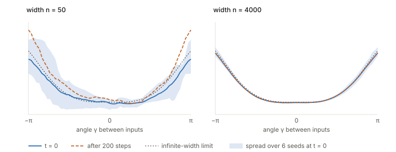

## Links

- **[arXiv:1806.07572](https://arxiv.org/abs/1806.07572)** — preprint (the PDF in
  circulation is usually the 2020 revision of the NeurIPS 2018 paper).
- **[Inequalities and concentration](../inequalities-and-concentration/index.html)** — the
  background page; the CLT and concentration tools used here live there.
- **[Runnable code](https://github.com/msrepo/theory_inclined_papers_with_annotations/blob/main/papers/2018-jacot-neural-tangent-kernel/code/ntk.py)** — the NTK in numpy,
  with both theorems checked numerically. `make verify` runs it.
- **[Fort et al. 2020](../2020-fort-deep-vs-kernel/index.html)** — measures how far real
  training departs from this limit, and when. The short answer: the first two to three epochs.

## In one paragraph

Training a network minimises $C(F(\theta))$, which is badly non-convex in $\theta$. But
$C$ is *convex* as a functional of the function $f_\theta$ — all the non-convexity lives in
the parametrisation, not the objective. So watch $f_\theta$ instead. By the chain rule,
gradient descent on parameters **is** gradient descent in function space with respect to the
kernel $\Theta(x,x') = \langle\nabla_\theta f_\theta(x), \nabla_\theta f_\theta(x')\rangle$.
That identity is exact at any width. The paper's contribution is that in the infinite-width
limit this kernel becomes **deterministic** (Theorem 1) and **stops moving during training**
(Theorem 2), which turns training into a linear ODE in function space with a known, fixed
kernel — and makes a wide network, trained to convergence on least squares, exactly kernel
regression.

## The spine of the argument

1. Reframe: track $f_\theta$, not $\theta$. The cost is convex there.
2. The chain rule gives $\partial_t f_{\theta(t)} = -\nabla_{\Theta}C$, a **kernel** gradient.
   The kernel is what extends the functional derivative — defined only on the data — to every
   other input, so it is exactly what governs behaviour off the training set.
3. Warm-up (§3.1): for a *linear* random-feature model, this is exact and the tangent kernel
   converges to a fixed $K$ by the law of large numbers. A wide network is this, except the
   features depend on $\theta$.
4. Theorem 1: at initialisation the NTK converges in probability to a deterministic
   $\Theta^{(L)}_\infty$ given by an explicit recursion.
5. Theorem 2: it stays there during training, uniformly on $[0,T]$.
6. Consequence (§5): for least squares the function-space dynamics are **linear**, diagonal in
   the kernel principal components, and converge to the kernel ridge / GP posterior mean.

## Setup and notation

| Symbol | Meaning |
|---|---|
| $F^{(L)} : \mathbb{R}^P \to \mathcal{F}$ | realisation map, parameters $\to$ function |
| $f_\theta = \tilde\alpha^{(L)}$ | the network function; the output is a *preactivation* |
| $n_0,\dots,n_L$, $P$ | layer widths and total parameter count |
| $\beta$ | bias scaling, tuning bias influence against weights ($\beta=0.1$ in their experiments) |
| $p_{in}$ | input distribution; here the **empirical** measure on a finite dataset |
| $\langle f,g\rangle_{p_{in}}$ | $\mathbb{E}_{x\sim p_{in}}[f(x)^\top g(x)]$ |
| $\Sigma^{(L)}$ | **NNGP kernel** — covariance of the function *at initialisation* |
| $\Theta^{(L)}$ | **NTK** — governs the *training dynamics*; a different object |
| $\dot\Sigma^{(L+1)}$ | $\mathbb{E}[\dot\sigma(f(x))\dot\sigma(f(x'))]$, the derivative kernel |
| $\Pi$ | $f \mapsto \Phi_K(\langle f,\cdot\rangle_{p_{in}})$, whose eigenfunctions are the kernel PCs |
| $\lambda_i$ | eigenvalue of $\Pi$; at most $N n_L$ are positive |

### The parametrisation is not cosmetic

They use

$$
\tilde\alpha^{(\ell+1)} = \tfrac{1}{\sqrt{n_\ell}}W^{(\ell)}\alpha^{(\ell)} + \beta b^{(\ell)},
\qquad W, b \sim \mathcal{N}(0,1),
$$

rather than LeCun initialisation. Their Remark 1 is explicit that the *representable
functions are the same*, but the **derivatives** $\partial_{W}F^{(L)}$ are scaled by
$1/\sqrt{n_\ell}$. Since the NTK is built from those derivatives, this scaling is what makes
the limit exist at all. Different scalings (mean-field, μP) give different infinite-width
limits — ones in which features *do* move. **The NTK regime is one corner of a family, not
"the" infinite-width theory.**

## Kernel gradient: the mechanism

A kernel $K$ induces a map $\Phi_K$ from the dual $\mathcal{F}^*$ to $\mathcal{F}$, and

$$
\nabla_K C\big|_{f_0}(x) = \frac{1}{N}\sum_{j} K(x,x_j)\, d\big|_{f_0}(x_j).
$$

The functional derivative $\partial^{in}_f C$ only knows the training points; the kernel is
what carries it to arbitrary $x$. Along kernel gradient descent,

$$
\partial_t C\big|_{f(t)} = -\big\lVert d|_{f(t)}\big\rVert_K^2,
$$

so convergence to a critical point is guaranteed whenever $K$ is positive definite with
respect to $\lVert\cdot\rVert_{p_{in}}$. **Convergence has become a positive-definiteness
question**, which is why Proposition 2 matters.

## Theorem 1 — the kernel becomes deterministic

$$
\Theta^{(1)}_\infty = \Sigma^{(1)}, \qquad
\Theta^{(L+1)}_\infty = \Theta^{(L)}_\infty\,\dot\Sigma^{(L+1)} + \Sigma^{(L+1)},
$$

with $\Sigma^{(1)}(x,x') = \tfrac{1}{n_0}x^\top x' + \beta^2$ and
$\Sigma^{(L+1)} = \mathbb{E}_{f\sim\mathcal{N}(0,\Sigma^{(L)})}[\sigma(f(x))\sigma(f(x'))] + \beta^2$.

Random at any finite width; deterministic in the limit, depending only on $\sigma$, depth and
initialisation variance — **not on the draw**.

Their Remark 4 gives the recursion its meaning: $\Sigma^{(L+1)}$ is the learning contributed
by the **last layer's weights**, while $\Theta^{(L)}_\infty\dot\Sigma^{(L+1)}$ is the
backpropagated contribution of **all lower layers**. This is not a "only the last layer
trains" result.

## Theorem 2 — and why it is surprising

The NTK stays at $\Theta^{(L)}_\infty$ uniformly on $[0,T]$, provided
$\int_0^T \lVert d_t\rVert\,dt$ is stochastically bounded (which least squares satisfies,
since $\lVert f^*-f\rVert$ decreases).

Weights move. The function changes — it learns. Yet the kernel does not budge. Remark 4 again
supplies the resolution: each individual activation's variation shrinks with width, but their
**collective** variation stays $O(1)$.

### Checked numerically

`code/ntk.py` implements the forward and backward passes for their exact parametrisation and
assembles $\Theta$ from the backprop deltas, alongside the closed-form arccos kernels for
$\Sigma$ and $\dot\Sigma$. Depth 4, inputs on the unit circle, as in their Figure 1:

| width | rel. error vs the Theorem 1 recursion | NTK drift over 200 GD steps | final loss |
|---|---|---|---|
| 50 | 0.229 | **38.3%** | 0.00102 |
| 200 | 0.129 | 12.3% | 0.00057 |
| 1000 | 0.075 | 2.7% | 0.00051 |
| 4000/5000 | 0.039 | **0.8%** | 0.00042 |

Initialisation error decays like $1/\sqrt n$; **drift decays faster, roughly like $1/n$**.
And the loss falls to essentially the same value at every width — so the wide network learns
just as well while its kernel stays frozen to within one percent. That juxtaposition is the
content of Theorem 2 made concrete.

<figure>

<figcaption>At <b>width 50</b> the kernel varies noticeably across initialisations (the band)
and inflates by <b>33%</b> after 200 steps — their observed "the NTK tends to inflate". At
<b>width 4000</b> the band is thin, the inflation is <b>0.1%</b>, and the trained kernel is
indistinguishable from both the initial one and the Theorem 1 recursion. Both networks reached
the same loss.</figcaption>
</figure>

## Section 5 — where the reframe pays off

For least squares the function-space ODE is **linear**:

$$
f_t = f^* + e^{-t\Pi}(f_0 - f^*), \qquad
f_t = f^* + \Delta^0_f + \sum_i e^{-t\lambda_i}\Delta^i_f .
$$

The eigenfunctions of $\Pi$ are the **kernel principal components of the data**, and each
error component decays at its own rate $\lambda_i$. Three readings:

- **Early stopping is spectral filtering.** Stopping at time $t$ fits the directions with
  $\lambda_i \gg 1/t$ and leaves the rest. Since low-$\lambda$ directions are the
  high-frequency, noisier ones, this is a principled account of a practitioner's heuristic.
- **$\Delta^0_f$ never moves**: it lies in the null space of $\Pi$: directions the kernel
  cannot see are never learned, at any $t$.
- **At $t\to\infty$**, $f_\infty(x) = \kappa_x^\top \tilde K^{-1}y^* + (f_0(x) - \kappa_x^\top \tilde K^{-1}y_0)$.
  The first term is the **GP posterior mean** under prior $\mathcal{N}(0,\Theta_\infty)$,
  equivalently kernel ridge regression as $\lambda\to 0$; the second is a zero-mean
  fluctuation vanishing on the training points. Ensemble a few networks and the fluctuation
  cancels: you get kernel regression exactly.

**Proposition 2** closes the convergence argument: for non-polynomial Lipschitz $\sigma$ and
data on the sphere, $\Theta_\infty$ is positive definite for $L \ge 2$. Non-polynomiality
is load-bearing — the appendix notes that for polynomial $\sigma$, $\Theta^{(2)}$ is *not*
positive definite.

## The catch, and the literature it spawned

A constant NTK means the feature map is constant, so **the infinitely wide network does not
learn features**. It is a fixed random-feature model, and all "learning" is choosing
coefficients in a basis fixed at initialisation.

That is a precise statement about what this limit does *not* model. Representation learning
lives entirely in the kernel's movement, which this limit sends to zero. The numbers above make
it concrete: the width-50 network moved its kernel by 38% while matching the width-4000
network's loss. Real networks are much closer to the former, and NTK regression empirically
underperforms trained networks on hard tasks — usually read as evidence that feature learning
does real work this limit discards.

## Questions and doubts

- **$T$ is finite.** Constancy is uniform on $[0,T]$ given a bounded
  $\int\lVert d_t\rVert dt$. It is not a statement at fixed width as $t\to\infty$, and the
  order of the two limits matters more than the paper dwells on.
- **No rates.** Theorems 1 and 2 give convergence without explicit $n$-dependence, so "how
  wide is wide enough" is unanswered. The $1/\sqrt n$ and $\approx 1/n$ above are
  measurements from `code/ntk.py`, not their theorems.
- **$p_{in}$ is the empirical measure** on a finite dataset throughout, so the "function
  space" is effectively $\mathbb{R}^N$ — a less grand object than the framing suggests.
- **Fully connected only.** Convolutional and attention NTKs came later, with different
  recursions.
- **The parametrisation is a modelling choice** presented almost in passing (Remark 1), yet it
  selects which infinite-width limit you get. A reader could finish the paper without
  realising the feature-learning regimes were excluded by a $1/\sqrt{n_\ell}$.

## Takeaways

- Gradient descent on parameters is exactly kernel gradient descent in function space. That
  identity is free; the theorems are about the kernel becoming knowable.
- Wide networks train to global minima not because the loss landscape is benign but because, in
  the right coordinates, the problem is **convex and the dynamics linear**.
- The kernel determines behaviour off the training set, so generalisation questions become
  questions about a kernel's spectrum — and complexity stops scaling with parameter count.
- Early stopping, kernel PCA and the GP posterior all fall out of one linear ODE.
- The limit's central weakness is its central assumption: a frozen kernel is a frozen feature
  map. Everything interesting about representation learning is in the residual this theory
  discards.
