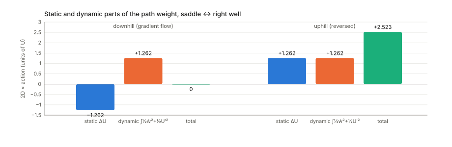
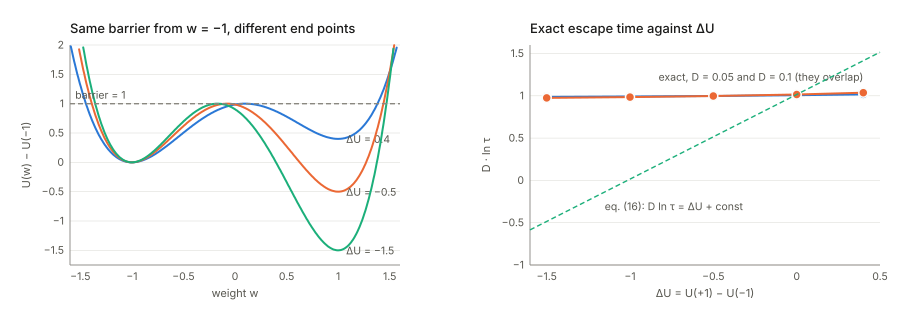
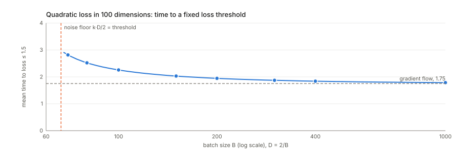
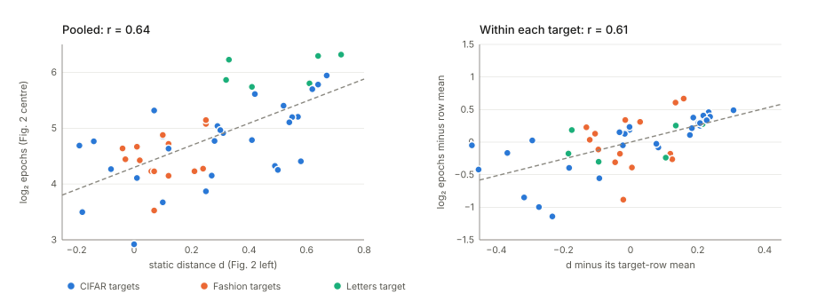

## Links

- **[arXiv:1810.02440](https://arxiv.org/abs/1810.02440)**: the preprint; `pdf_url` points here. The version
  annotated is v2 (29 May 2019, 9 pages, marked "under review"). There is no appendix: every derivation
  is in the main text.
- **[Interactive companion](figures/interactive.html)**: particles escaping over a barrier while you
  move the end point; particles in a valley with a sharp and a flat minimum, against three effective
  potentials; Figure 2's two matrices as a clickable scatter; and the batch-size curve of a noise floor.
- **[Runnable code](https://github.com/msrepo/theory_inclined_papers_with_annotations/blob/main/papers/2019-achille-task-reachability/code/reachability.py)**:
  every number on this page, and the five figures (`python3 reachability.py --figures`). `make verify`
  runs it, in about four seconds.
- Background: **[Langevin dynamics](../langevin-dynamics/index.html)**, for the Gibbs law, Fokker–Planck,
  Kramers' law, detailed balance and the path weight used throughout, built up from scratch with
  simulations; and **[Inequalities and concentration](../inequalities-and-concentration/index.html)**, for
  the KL divergence and the Donsker–Varadhan formula, which is the identity that makes Section 6 work.
- The static distance of Section 4 comes from a companion paper, Achille, Paolini, Mbeng & Soatto,
  *The Information Complexity of Learning Tasks, their Structure and their Distance*
  ([arXiv:1904.03292](https://arxiv.org/abs/1904.03292)).

## In one paragraph

The paper asks how hard it is to fine-tune: starting from weights that solve task A, how likely is
SGD to reach weights that solve task B, and how long does it take? It models SGD as a particle rolling
downhill on the loss while being kicked by noise (a **Langevin equation**), writes the probability of
every possible training trajectory as a **path integral**, and splits the probability of getting from
$w_0$ to $w_f$ into two factors. The **static** factor $e^{-\Delta U/2D}$ depends only on the loss at the
two end points. The **reachability** factor measures whether likely paths connect them. Integrating out
the directions across a valley adds a curvature term to the loss, $U_{\text{eff}}=U+D\log\lvert H\rvert$,
which with weight decay and a Gaussian prior the paper identifies with the task's information
**complexity** $C_\beta$ from a companion paper. The conclusion is a Kramers-type law, waiting time
$\propto e^{\Delta C_\beta/D}$, tested on random labels, batch sizes and an $8\times8$ matrix of
fine-tuning times. The machinery is right in outline, and one part of it checks out better than the
paper shows. **The static/reachability split is exactly detailed balance**: the reachability factor is
symmetric in the two end points, so for a fixed loss all the asymmetry of a transition lives in the
static factor. **Several constants are off**: the curvature term is $(D/2)\log\lvert H\rvert$, and the
identification with $C_\beta$ holds exactly, for every posterior and not just Gaussians, when
$\beta=D$ and $\lambda^2=D/\gamma$, not $\beta=2\lambda^2\gamma$. **The central law, eq. (16), is not
Kramers' law**: escape times follow the height of the barrier to the saddle, not the difference
between the two end points (checked below: moving that difference over a range of 1.9 at a fixed
barrier leaves the escape time essentially unchanged).
**On the most likely downhill path the static factor is cancelled exactly by the dynamic one**, so
"upper-bounded by the static part" says nothing in the fine-tuning direction. Re-reading Figure 2 from
its printed numbers, **the static distance does rank sources for a fixed target** (within-target
$r=0.58$), which is better support than the paper's pooled scatter gives.

## The spine of the argument

1. **SGD is a noisy gradient flow** (§2). In the small-step limit,
   $\dot w=-\nabla U(w)+\sqrt{2D}\,n(t)$, with white noise $n$ and a temperature $D\propto\eta/B$.
2. **A task's complexity** (§3–4). The structure function trades off training loss against the
   information stored in the weights. Its Lagrangian $C_\beta=\mathbb E_Q[L]+\beta\,\mathrm{KL}(Q\Vert P)$,
   evaluated with Gaussians, becomes loss plus a log-determinant of the Hessian (eq. 4). The static
   distance $d_\beta(\mathcal D_1\to\mathcal D_2)$ is how much $C_\beta$ grows when $\mathcal D_2$ is
   added to $\mathcal D_1$.
3. **Path integral** (§5). Each trajectory $w(t)$ gets a weight $e^{-S[w]}$ (Onsager–Machlup). A
   Stratonovich chain rule pulls $\Delta U$ out of the action, giving static $\times$ reachability
   (eq. 10).
4. **Most likely paths and the valley** (§5.2). The saddle-point approximation keeps only critical
   paths. Integrating out the transverse directions of a valley corrects $U$ by a curvature term (eqs.
   11–14).
5. **Curvature is complexity** (§6). With weight decay $\gamma$ the corrected potential looks like
   $C_\beta$ of eq. (4), so the static factor becomes $e^{-\Delta C_\beta/2D}$ (eq. 15) and the
   convergence rate $e^{-\Delta C_\beta/D}$ (eq. 16).
6. **Experiments** (§7). Convergence time grows with the number of random labels and with the
   estimated complexity, falls with batch size, and fine-tuning time grows with the static distance.

## Setup and notation

| Symbol | Meaning |
|---|---|
| $\mathcal D=\{(x_i,y_i)\}_{i=1}^N$ | a training set; a **task** is a dataset plus a loss |
| $p_w(y\mid x)$ | the network's predicted label distribution with weights $w\in\mathbb R^k$ |
| $L_{\mathcal D}(w)$ | cross-entropy, **averaged** over the $N$ samples (this matters twice below) |
| $U(w)=L_{\mathcal D}(w)+\frac\gamma2\lVert w\rVert^2$ | the loss with weight decay $\gamma$: the "potential" the particle rolls on |
| $\eta$, $B$ | learning rate and batch size |
| $D$ | the diffusion constant (temperature) of SGD, $D=\eta\sigma^2/(2B)$ for gradient-noise variance $\sigma^2$ |
| $n(t)$ | white noise: independent standard Gaussian kicks at every instant |
| $P(w)=\mathcal N(0,\lambda^2 I)$ | the prior over weights |
| $Q(w\mid\mathcal D)=\mathcal N(w_0,\Sigma)$ | a "posterior": a cloud of weights around $w_0$ |
| $C_\beta$ | $\mathbb E_Q[L_{\mathcal D}]+\beta\,\mathrm{KL}(Q\Vert P)$, error plus $\beta$ times information |
| $H$, $F$ | Hessian of $L_{\mathcal D}$; Fisher information matrix |
| $\lvert H\rvert$, $\lvert H\rvert_+$ | determinant; product of the positive eigenvalues only |
| $S[w]$, $\mathcal L(w,\dot w)$ | the action of a path and its Lagrangian: the path's weight is $e^{-S}$ |
| $V(w)$ | the "effective potential" of eq. (8), $\frac12\lVert\nabla U\rVert^2-D\,\nabla^2U$ |
| $\nabla^2U$ | the Laplacian, $\operatorname{tr}H_U$: total curvature |
| $\tau$, $1/\tau_K$ | mean time to reach the target; the Kramers rate |

## §2 SGD as a noisy particle

### From the update rule to a Langevin equation

A mini-batch gradient is the full gradient plus a zero-mean error, so an SGD step is a gradient-descent
step plus a random kick:

$$
w_{k+1}=w_k-\eta\nabla\hat L_{\xi_k}(w_k)
=w_k-\eta\nabla L(w_k)-\underbrace{\eta\big(\nabla\hat L_{\xi_k}-\nabla L\big)}_{\text{mean }0,\ \text{covariance }\eta^2\Sigma/B}.
$$

Read the step index as time, $t=k\eta$. Over one step of length $\eta$ the drift is $-\eta\nabla L$ and
the kick has variance $\eta^2\sigma^2/B$ per coordinate (for isotropic $\Sigma=\sigma^2 I$). A diffusion
$\dot w=-\nabla L+\sqrt{2D}\,n(t)$ has kick variance $2D\eta$ over the same time. Matching the two gives

$$
D=\frac{\eta\,\sigma^2}{2B},
$$

which is the paper's $D\propto\eta/B$. The code checks it on SGD for the toy per-sample loss
$\frac12(w-z_i)^2$ (Hessian 1, $\sigma^2=2.90$, $\eta=0.05$). The stationary variance of $w$ should
be $D$, and it is: $0.0187$, $0.00471$, $0.00115$ against $D=0.0181$, $0.00453$, $0.00113$ for $B=4$,
16, 64. The 3% excess is the finite-step correction; the exact value for this linear recursion is
$\eta\sigma^2/(B(2-\eta))$, and it matches to within Monte Carlo error.

Two things about how the paper writes it.

- **Eq. (1) as printed is plain gradient descent.** It reads
  $w_{k+1}=w_k-\eta\nabla\hat L_{\xi_k}(w_k)+\sqrt\eta\,T_{\xi_k}$ with
  $T=\sqrt\eta(\nabla\hat L_{\xi_k}-\nabla L)$. Substituting, the mini-batch gradient cancels and what
  remains is $w_k-\eta\nabla L(w_k)$: the noise is added and then removed. The drift should be the
  full gradient, $w_{k+1}=w_k-\eta\nabla L(w_k)-\sqrt\eta\,T_{\xi_k}$ (the code checks both to machine
  precision). A typo, but it is the equation the whole model rests on.
- **"$D=k/B$ with $k$ a constant that depends on the architecture."** The constant is
  $\eta\sigma^2/2$. The gradient-noise variance $\sigma^2$ depends on the data, the loss and the current
  weights, and the noise is neither isotropic nor constant (the paper says so, then sets that aside).

### The Fisher information

A small change $\delta w$ of the weights changes the predicted label distributions by

$$
\mathbb E_x\,\mathrm{KL}\big(p_w(y\mid x)\,\Vert\,p_{w+\delta w}(y\mid x)\big)=\tfrac12\,\delta w^\top F\,\delta w+o(\lVert\delta w\rVert^2),
$$

with a factor $\tfrac12$ that the paper omits (it also calls the left side $F$, the same letter as the
matrix). On a softmax regression the ratio of the two sides is $0.5027$, $0.4996$, $0.5000$ for
$\lVert\delta w\rVert=10^{-1},10^{-2},10^{-3}$. The paper's other remark is correct and worth keeping:
the Fisher uses labels drawn from the model, $y\sim p_w(y\mid x)$, so it depends on the data only
through the inputs $x$. That is why it can stand in for the Hessian later without seeing the labels.

## §3 The structure function: error against bits

The **structure function** of a dataset asks: if you may store at most $t$ nats of information in the
weights, how low can the average training loss go?

$$
S_{\mathcal D}(t)=\min_{\mathrm{KL}(Q\Vert P)<t}\ \mathbb E_{w\sim Q}\big[L_{\mathcal D}(w)\big].
$$

Why a distribution $Q$ over weights and not one weight vector: writing down a real-valued vector
exactly takes infinitely many bits. A "noisy" weight, a cloud $Q$ around $w_0$, can be described with
finitely many bits relative to a prior $P$, and $\mathrm{KL}(Q\Vert P)$ is that description length.
Think of a rate–distortion curve. The first few nats buy large drops in loss (the task's
*structure*). Later nats buy less and less, because they are spent memorising individual samples
(*nuisances*).

The Lagrangian of that constrained problem is

$$
C_\beta(\mathcal D;P,Q)=\mathbb E_{w\sim Q}\big[L_{\mathcal D}(w)\big]+\beta\,\mathrm{KL}(Q\Vert P),
$$

and $\beta$ is the price of one nat in units of loss. The companion paper shows a critical $\beta$
below which the minimiser starts memorising. This is PAC-Bayes' objective and the information
bottleneck of the weights.

One precision: the paper says that for $\beta=1$ this is the ELBO of variational inference. The ELBO is
$\mathbb E_Q[\log p(\mathcal D\mid w)]-\mathrm{KL}(Q\Vert P)$, and $\log p(\mathcal D\mid w)$ is a
*sum* over the $N$ samples, $-N L_{\mathcal D}(w)$ with the paper's averaged loss. So
$C_\beta=-\mathrm{ELBO}/N$ at $\beta=1/N$, not at $\beta=1$. The difference matters in Section 6, where
$\beta$ turns out to be the SGD temperature.

## §4 The static distance and eq. (4)

### The distance

$$
d_\beta(\mathcal D_1\to\mathcal D_2)=C_\beta(\mathcal D_1\cup\mathcal D_2;P)-C_\beta(\mathcal D_1;P),
\qquad C_\beta(\mathcal D;P)=\min_Q C_\beta(\mathcal D;P,Q).
$$

In words: how much extra loss-plus-information it costs to explain $\mathcal D_2$ as well, once you
already explain $\mathcal D_1$. It is asymmetric by design. Explaining MNIST once you explain CIFAR-100
is cheap; the other way round is not.

With a *summed* loss this can never be negative: for every $w$, the loss on $\mathcal D_1\cup\mathcal
D_2$ is at least the loss on $\mathcal D_1$, so the minimum is too. With the paper's *averaged* loss
adding an easy dataset lowers the average, and $d_\beta$ can go below zero. Nine of the 56
off-diagonal entries of Figure 2 (left) are negative, down to $-0.19$ (CIFAR-10 given "artificial").
So the matrix is not a distance in the metric sense, and its sign depends on a normalisation the paper
does not discuss.

### The Gaussian KL

With prior $\mathcal N(0,\lambda^2 I)$ and posterior $\mathcal N(w_0,\Sigma)$ in $k$ dimensions,

$$
\mathrm{KL}(Q\Vert P)=\frac12\Big[\frac{\lVert w_0\rVert^2}{\lambda^2}+\frac{\operatorname{tr}\Sigma}{\lambda^2}+k\log\lambda^2-\log\lvert\Sigma\rvert-k\Big].
$$

The paper prints $+\log\lvert\Sigma\rvert$. The sign matters: a wider posterior (larger
$\lvert\Sigma\rvert$) is *cheaper* to describe, which is the whole point of allowing noise. A Monte
Carlo estimate on a random 4-dimensional example gives $3.9221\pm0.0042$. The formula with
$-\log\lvert\Sigma\rvert$ gives $3.9199$; the printed one gives $2.8089$. The paper's next equation uses
the right sign, so this is a typo.

### The optimal posterior width, line by line

Fix the posterior mean at a minimum $w_0$ of $L_{\mathcal D}$ and expand the loss to second order.
The gradient term vanishes, and for a Gaussian $\mathbb E_Q[(w-w_0)^\top H(w-w_0)]=\operatorname{tr}(H\Sigma)$:

$$
\mathbb E_Q[L_{\mathcal D}]\approx L_{\mathcal D}(w_0)+\tfrac12\operatorname{tr}(H\Sigma).
$$

Differentiate $C_\beta$ in $\Sigma$, using $\partial_\Sigma\operatorname{tr}(A\Sigma)=A$ and
$\partial_\Sigma\log\lvert\Sigma\rvert=\Sigma^{-1}$:

$$
\frac{\partial C_\beta}{\partial\Sigma}=\tfrac12H+\frac\beta2\Big(\frac{I}{\lambda^2}-\Sigma^{-1}\Big)=0
\quad\Longrightarrow\quad
\Sigma^*=\beta\Big(H+\frac{\beta}{\lambda^2}I\Big)^{-1}.
$$

In words: the posterior is wide in flat directions (small eigenvalues of $H$), where moving the
weights costs little loss, and capped at the prior width $\lambda^2$ where the loss is completely
flat. Put $\Sigma^*$ back in. The two trace terms combine to
$\frac12\operatorname{tr}\big((H+\tfrac\beta{\lambda^2}I)\Sigma^*\big)=\frac{\beta k}2$, which cancels
the $-\frac{\beta k}2$ inside the KL. What is left is

$$
C_\beta(w_0)=L_{\mathcal D}(w_0)+\frac\beta2\Big[\frac{\lVert w_0\rVert^2}{\lambda^2}+\log\Big\lvert\frac{\lambda^2}{\beta}H+I\Big\rvert\Big].
$$

The paper has $\Sigma^*=\frac\beta2\big(H+\frac\beta{2\lambda^2}I\big)^{-1}$ and
$\log\lvert\frac{2\lambda^2}\beta H+I\rvert$. Both are what the same calculation gives if the
$\frac12$ in front of $\operatorname{tr}(H\Sigma)$ is dropped. On a 5-dimensional quadratic loss the
gradient $\partial C_\beta/\partial\Sigma$ is $5\times10^{-15}$ at the corrected $\Sigma^*$ and $5.24$
at the paper's, and it is $9\times10^{-15}$ at the paper's once the $\frac12$ is removed. The corrected
formula gives $3.49579$, equal to the true minimum. The printed eq. (4) gives $4.10455$. The factor of
2 looks harmless, but it propagates into the identification $\beta=2\lambda^2\gamma$ of Section 6,
which then does not match the weight decay.

**What eq. (4) says.** A task is complex when fitting it needs weights far from the prior (the
$\lVert w_0\rVert^2$ term) *and* in a sharp minimum, where many directions have curvature large
compared with $\beta/\lambda^2$. Each such direction must be specified precisely and costs about
$\frac12\log(\lambda^2 h_i/\beta)$ nats. Flat directions cost nothing. The paper replaces $H$ by the
Fisher, which is positive semi-definite and needs no labels.

## §5 A weight for every training trajectory

### The path integral in plain terms

Chop training time into small steps $\Delta t$. In each step the particle moves by $\Delta w$, of which
$-\nabla U\,\Delta t$ is drift and the rest is a Gaussian kick of variance $2D\Delta t$. So the chance
of one particular sequence of positions is a product of Gaussian densities of the implied kicks:

$$
\prod_{\text{steps}}\exp\Big(-\frac{\lVert\Delta w+\nabla U\,\Delta t\rVert^2}{4D\,\Delta t}\Big)
\;\longrightarrow\;
\exp\Big(-\frac1{4D}\int\lVert\dot w+\nabla U\rVert^2\,dt\Big).
$$

A path that moves the way the gradient pushes it costs nothing; every deviation costs its squared
size. The limit is not a density in the ordinary sense (there are infinitely many steps), but ratios
of these weights, and integrals of them over all paths between two points, are what the paper uses.
With the midpoint rule for the steps there is one more term, a Jacobian from changing variables from
kicks to positions, and the weight becomes the **Onsager–Machlup** functional:

$$
p(w(\cdot)\mid w_0)\propto e^{-S[w]},\qquad
S=\int_{t_0}^{t_f}\Big[\frac1{4D}\lVert\dot w-f(w)\rVert^2+\frac12\operatorname{div}f(w)\Big]dt,\qquad f=-\nabla U.
$$

The paper writes $f=\nabla U$. That is a sign slip: with $+\nabla U$ the particle would climb, and the
paper's own next lines (the $e^{-\Delta U/2D}$ it obtains) are what $f=-\nabla U$ gives. With
$f=-\nabla U$, $\operatorname{div}f=-\nabla^2U$, minus the total curvature.

The probability of being at $w_f$ at time $t_f$ is the total weight of all paths that end there (eq. 7):

$$
p(w_f,t_f\mid w_0,t_0)=\int_{w(t_0)=w_0}^{w(t_f)=w_f}e^{-S[w]}\,\mathcal Dw.
$$

### Pulling the end points out of the action (eq. 9–10)

Expand the square:

$$
\frac1{4D}\lVert\dot w+\nabla U\rVert^2=\frac1{4D}\lVert\dot w\rVert^2+\frac1{2D}\,\nabla U\cdot\dot w+\frac1{4D}\lVert\nabla U\rVert^2 .
$$

The middle term is a total derivative, $\nabla U\cdot\dot w=\frac{d}{dt}U(w(t))$, so its integral is
$U(w_f)-U(w_0)$ whatever the path. That ordinary chain rule holds in the midpoint (Stratonovich)
reading of the noise, the reading in which the $\frac12\operatorname{div}f$ term appears. In the Itô
reading there is no divergence term, but the chain rule picks up $-D\int\nabla^2U\,dt$ instead, and
the two bookkeepings give the same answer. Collecting terms,

$$
p(w_f,t_f\mid w_0)=\underbrace{e^{-\frac{U(w_f)-U(w_0)}{2D}}}_{\text{static}}\;
\underbrace{\int e^{-\frac1{2D}\int\left[\frac12\lVert\dot w\rVert^2+V(w)\right]dt}\,\mathcal Dw}_{\text{reachability }K},
\qquad V=\tfrac12\lVert\nabla U\rVert^2-D\,\nabla^2U .
$$

This is the paper's eq. (10), and the derivation is right (after fixing the sign of $f$). The paper
reads it as "energy gap $\times$ existence of likely paths". There is a sharper reading.

### What the split really is: detailed balance

Run any path backwards in time, $\tilde w(s)=w(t_0+t_f-s)$. It goes from $w_f$ to $w_0$, and its
reachability action is the same, because $\lVert\dot w\rVert^2$ and $V(w)$ do not care about the
direction of time. So the reachability factor is **symmetric**:

$$
K_t(w_0\to w_f)=K_t(w_f\to w_0)
\qquad\Longrightarrow\qquad
\frac{p_t(w_f\mid w_0)}{p_t(w_0\mid w_f)}=e^{-\frac{U(w_f)-U(w_0)}{D}}\quad\text{at every }t.
$$

That is **detailed balance** for the Gibbs distribution $\pi(w)\propto e^{-U/D}$, the stationary law
of SGD in this model. The static factor is $\sqrt{\pi(w_f)/\pi(w_0)}$, half of the equilibrium log-odds,
and all the time dependence and all the "is there a road" information lives in the symmetric $K$. (In
physics terms, $e^{U/2D}p$ satisfies an imaginary-time Schrödinger equation with potential $V/2D$. The
paper's $V$ is that potential.)

The code checks this three ways:

- for the Ornstein–Uhlenbeck process (quadratic $U$), whose transition density is known in closed
  form, $K(x,y)$ is symmetric to $4\times10^{-16}$;
- for the tilted double well $U=(w^2-1)^2-0.25w$, solving the Fokker–Planck equation by finite
  differences, the asymmetry of $K$ is $7.7\times10^{-3}$, $1.8\times10^{-3}$, $4.5\times10^{-4}$ on
  grids of 101, 201 and 401 points: discretisation error, falling as the grid is refined;
- starting in the higher well ($w=-1.03$, $U=0.261$) and aiming at the lower one ($w=0.97$,
  $U=-0.239$) with $D=0.25$, the probability of being within $0.1$ of the target is $9\times10^{-5}$,
  $0.052$, $0.29$, $0.33$ at $t=0.5$, 5, 50, 500. The forward-to-backward ratio is $7.403$ at all four
  times, against $e^{-\Delta U/D}=7.395$. The static factor $2.72$ never changed. The reachability
  factor did all the work.

So in a fixed landscape, **the asymmetry of a transition is entirely static, and the difficulty is
entirely in the symmetric part**. For transfer learning the landscape is the target's, which is
different for $A\to B$ and $B\to A$, so this does not by itself explain Figure 2's asymmetry. But it
says what the "static" factor can and cannot carry.

### The most likely paths: downhill is free, uphill costs twice the climb

The saddle-point step of §5.2 keeps only the paths that minimise the action. The Euler–Lagrange
equation of $\frac12\lVert\dot w\rVert^2+V$ is $\ddot w=\nabla V$, as the paper says: Newton's law in the
*upside-down* potential $-V$. For small $D$, $V\approx\frac12\lVert\nabla U\rVert^2$, and both
$\dot w=-\nabla U$ (gradient descent) and $\dot w=+\nabla U$ (gradient descent run backwards) solve it,
since $\ddot w=\mp H\dot w=H\nabla U=\nabla(\frac12\lVert\nabla U\rVert^2)$. Along either one,
$\frac12\lVert\dot w\rVert^2+\frac12\lVert\nabla U\rVert^2=\lVert\nabla U\rVert^2$, whose time
integral is $\int\lVert\nabla U\rVert\,\lvert dw\rvert=\lvert\Delta U\rvert$. So:

- **downhill** along gradient descent: static part $\Delta U<0$, dynamic part $+\lvert\Delta U\rvert$,
  **total zero**. Measured on the tilted double well from the saddle into the right well:
  $-1.2616+1.2616=-2\times10^{-8}$;
- **uphill** along the reversed path: static $+\Delta U$, dynamic $+\Delta U$, total $2\Delta U$, so the
  path weight is $e^{-2\Delta U/2D}=e^{-\Delta U/D}$, the Arrhenius factor. Measured: $2.5232=2\times1.2616$;
- any other path costs more. The best straight constant-speed path from the left well to the saddle
  has total $1.6015$, above the reversed gradient path's $2\times0.7619=1.5237$.

This is the Freidlin–Wentzell picture of small-noise dynamics. It has a direct consequence for the
paper. Fine-tuning starts at the source solution, where the *target* loss is high, and goes down. On
that downhill path the static factor $e^{+\lvert\Delta U\rvert/2D}$ is larger than 1, and the
reachability factor cancels it exactly. So the static factor is not a penalty in the fine-tuning
direction, and the remark after eq. (15), "the transition probability is upper-bounded by a static
part", is true but vacuous exactly where the paper wants to use it.

### Integrating out the valley (eqs. 11–14)

Suppose the likely path runs along a coordinate $u$ at the bottom of a valley, and across the valley
(coordinates $v$) the loss is quadratic with stiffness $b(u)$:

$$
U(u,v)=a(u)+\tfrac12\,v^\top b(u)\,v .
$$

The particle jitters across the valley much faster than it moves along it. So at each $u$ the $v$
coordinates are at equilibrium, a Gaussian of covariance $D\,b(u)^{-1}$, and what matters for $u$ is
how much room the valley offers there. The exact bookkeeping is the marginal of the Gibbs law:

$$
\int e^{-U(u,v)/D}\,dv=e^{-a(u)/D}\sqrt{\frac{(2\pi D)^{k-1}}{\lvert b(u)\rvert}}
\qquad\Longrightarrow\qquad
F(u)=a(u)+\frac D2\log\lvert b(u)\rvert+\text{const}.
$$

$F$ is a *free energy*: loss plus a penalty for narrowness. A sharp valley is a narrow corridor, and
fewer noisy trajectories fit in it. The coefficient is $D/2$ and the sign is $+$. The code's
quadrature matches $a+\frac D2\log b-\frac D2\log(2\pi D)$ to $9\times10^{-16}$.

The paper arrives at $U_{\text{eff}}=U+D\log\lvert H_U\rvert$ just before eq. (14) and in §6. In
§5.2's first paragraph and just after eq. (14) it is written with a minus sign, $U-D\log\lvert
H_U\rvert_{(+)}$. Its eq. (13) prefactor,
$e^{-\frac12\log(2\pi\lvert b\rvert)}=\lvert b\rvert^{-1/2}$ (which also lacks a $D$), is folded into
the *static* exponent $\frac1{2D}U_{\text{eff}}$. But the static factor is the square root of the Gibbs
ratio, so a prefactor $\lvert b\rvert^{-1/2}$ there corresponds to a Gibbs weight
$\lvert b\rvert^{-1}$, twice the true $\lvert b\rvert^{-1/2}$. The correct static prefactor is
$\lvert b\rvert^{-1/4}$.

**Does the coefficient matter?** It decides which minimum SGD prefers. In the code's valley,
$a(u)=0.5(u^2-1)^2+0.05u$ makes the left well slightly *deeper*, and $b(u)=1+99e^{-(u+1)^2/(2\cdot
0.15^2)}$ makes it a hundred times *sharper* across the valley.

| $D$ | $P(\text{sharp basin})$, exact | with $D\log b$ (paper) | with no curvature term |
|---|---|---|---|
| 0.02 | 0.938 | 0.618 | 0.993 |
| 0.05 | 0.459 | 0.104 | 0.876 |
| 0.10 | 0.294 | 0.105 | 0.721 |
| 0.15 | 0.282 | 0.145 | 0.648 |
| 0.20 | 0.289 | 0.178 | 0.609 |

A Langevin simulation at $D=0.15$ (2000 particles, all started in the flat well) spends a fraction
$0.275$ of its time in the sharp basin: the exact column, not the paper's. The sharp, deeper basin
loses its majority at $D=0.046$, and at $D=0.179$ its bottom stops being a minimum at all. There
$F''(-1)=4-22D$ changes sign, and the single sharp minimum splits into a bump with two shoulders.
This is the precise content of the paper's "sharp minima may not be minima at all" at high
temperature. With the paper's coefficient both thresholds halve (0.022 and 0.089).

One more distinction the paper blurs. Along a path, only the *transverse* stiffness $b(u)$ enters $F$;
the curvature along the path, $a''(u)$, does not. For the total mass of a basin, which is what a
comparison of two minima needs, the Laplace approximation gives the *full* determinant,
$-D\log\int_{\text{basin}}e^{-U/D}\approx U(w^*)+\frac D2\log\lvert H_U(w^*)\rvert+\text{const}$. The
paper's $U+D\log\lvert H_U(w)\rvert$ "along the path" mixes the two.

## §6 Curvature is complexity: the exact version

### Why SGD's equilibrium is the Gibbs posterior

The paper notices that with weight decay, $U+D\log\lvert H_U\rvert=L+\frac\gamma2\lVert
w\rVert^2+D\log\lvert\gamma I+H\rvert$ has the shape of eq. (4), and sets $\beta=2\lambda^2\gamma$.
There is a cleaner statement that needs no Gaussian approximation. For *any* $Q$, completing the KL
gives

$$
\mathbb E_Q[L]+\beta\,\mathrm{KL}(Q\Vert P)=-\beta\log Z+\beta\,\mathrm{KL}(Q\Vert Q^*),
\qquad Q^*(w)=\frac{P(w)\,e^{-L(w)/\beta}}{Z}.
$$

(Expand $\beta\,\mathrm{KL}(Q\Vert Q^*)=\beta\,\mathbb E_Q[\log Q-\log P+L/\beta+\log Z]$ and
rearrange. This is the Donsker–Varadhan / Gibbs variational principle.) So the minimiser over all
posteriors is the **Gibbs posterior** $Q^*$, and $C_\beta^*=-\beta\log Z$. With
$P=\mathcal N(0,\lambda^2I)$,

$$
Q^*\propto\exp\Big(-\frac{L}{\beta}-\frac{\lVert w\rVert^2}{2\lambda^2}\Big),
\qquad
\pi_{\text{SGD}}\propto\exp\Big(-\frac{L+\frac\gamma2\lVert w\rVert^2}{D}\Big).
$$

These are the same distribution exactly when

$$
\beta=D\qquad\text{and}\qquad\lambda^2=\frac D\gamma .
$$

**The price of information is the SGD temperature, and the prior width is the temperature over the
weight decay.** Then $C_\beta^*=-D\log\int e^{-U/D}dw+\text{const}$ is SGD's free energy, and its
Laplace approximation is the corrected eq. (4) with those values:
$U(w^*)+\frac D2\log\lvert H+\gamma I\rvert+\text{const}$, coefficient $D/2$. On a 1-D double well with
$D=0.2$ and $\gamma=0.5$ the code finds $C_\beta(Q^*)=-\beta\log Z=0.036628$. Three tilted
alternatives $Q_t$ each exceed it by exactly $\beta\,\mathrm{KL}(Q_t\Vert Q^*)$ (0.003201, 0.000390,
0.003624). SGD's stationary density and $Q^*$ agree to $7\times10^{-16}$.

The paper's $\beta=2\lambda^2\gamma$ makes the prior term $\lVert w\rVert^2/2\lambda^2=\gamma\lVert
w\rVert^2/\beta$, so the matching Gibbs posterior is $e^{-(L+\gamma\lVert w\rVert^2)/\beta}$: **twice**
the weight decay SGD actually uses, whatever $\beta$ is. On the same example it is at total-variation
distance $0.230$ from SGD's stationary law ($\mathbb E w^2=0.411$ under it, against $0.673$ under SGD). This is the
factor 2 of eq. (4) coming back. The paper also never ties $\beta$ to $D$, although matching the
log-determinant coefficients ($\beta/2$ in eq. 4, $D$ in $U_{\text{eff}}$) forces it.

The upshot supports the paper's intuition more strongly than its own derivation does. **SGD at
temperature $D$ with weight decay $\gamma$ samples the minimiser of the complexity Lagrangian with
$\beta=D$.** Raising the batch size lowers the price of information and lets SGD store more of it.

### Eq. (15): which complexity, at which point?

The paper rewrites the static factor as $e^{-\Delta C_\beta/2D}$ and reads $\Delta C_\beta$ as "the
difference in complexity between tasks". In the path integral there is one loss, the one being trained
on (the target's, when fine-tuning), evaluated at two points. So the exponent is
$C_\beta^{\text{target}}(w_f)-C_\beta^{\text{target}}(w_0)$, the corrected target loss at the start and
at the end. The static distance $d_\beta=C_\beta(\mathcal D_1\cup\mathcal D_2)-C_\beta(\mathcal D_1)$
compares two *different* objectives, each at its own optimum. Those are different numbers, and the
first is negative in fine-tuning (training lowers the target objective), while $d_\beta$ is meant to be
a positive cost. The step from one to the other is not made in the paper.

### Eq. (16) is not Kramers' law

Kramers' law says a particle in a well at temperature $D$ escapes after a time

$$
\tau\approx\frac{2\pi}{\sqrt{U''(a)\,\lvert U''(s)\rvert}}\;e^{[U(s)-U(a)]/D},
$$

where $a$ is the bottom of the well and $s$ the saddle it has to cross. The exponent is the **barrier**,
the climb from the start to the pass. How deep the valley on the other side is does not enter: once
over the pass, the particle rolls down quickly. Eq. (16), $1/\tau_K=Ce^{-\Delta C_\beta/D}$, puts the
difference between the two *end points* in the exponent instead.

The code tests this on $U=h(w^2-1)^2+s(3w-w^3)/2$ with $h$ tuned so that the barrier from $w=-1$ is
exactly 1 while the end-to-end difference $\Delta U=2s$ runs from $+0.4$ to $-1.5$. The mean
first-passage time is computed exactly from its integral formula, no simulation:

| $s$ | $\Delta U$ | $D\ln\tau$, $D=0.05$ | $D\ln\tau$, $D=0.1$ | $d\ln\tau/d(1/D)$ | $\tau/\tau_{\text{Kramers}}$ |
|---|---|---|---|---|---|
| +0.20 | +0.40 | 1.016 | 1.036 | 0.997 | 1.024 |
| 0.00 | 0.00 | 1.006 | 1.015 | 0.998 | 1.020 |
| −0.25 | −0.50 | 0.998 | 0.997 | 0.998 | 1.018 |
| −0.50 | −1.00 | 0.991 | 0.985 | 0.998 | 1.017 |
| −0.75 | −1.50 | 0.986 | 0.974 | 0.998 | 1.017 |

The slope $d\ln\tau/d(1/D)$ is the barrier, 1, in every row. Across a change of $1.9$ in $\Delta U$,
$D\ln\tau$ at $D=0.1$ moves by $0.061$ (through the curvature prefactor). Eq. (16) would move it by the
full 1.9.

What the end-point difference does control is the *ratio* of forward and backward rates:
$k_{a\to b}/k_{b\to a}=e^{-[U(b)-U(a)]/D}$. That is the detailed-balance identity above, with the full
$1/D$ and not the $1/2D$ of the static factor, which explains the unexplained doubling between eq.
(15) and eq. (16).

**The corrected version** of the paper's idea is the multidimensional (Langer, or Eyring) rate:

$$
\frac1\tau\approx\frac{\lvert\lambda_s\rvert}{2\pi}\sqrt{\frac{\lvert H_U(a)\rvert}{\lvert\det H_U(s)\rvert}}\;e^{-[U(s)-U(a)]/D}
=\frac{\sqrt{\lvert\lambda_s\rvert}}{2\pi}\,e^{-[F(s)-F(a)]/D},
\qquad F=U+\frac D2\log\lvert H_U\rvert_+ ,
$$

where $\lambda_s$ is the one negative eigenvalue at the saddle and $\lvert H_U\rvert_+$ the product of
the positive ones. This is where the paper's "$\lvert H\rvert_+$" belongs: in a **free-energy barrier**
to a saddle, with coefficient $D/2$. It is not a difference of task complexities, and in fine-tuning
there may be no barrier at all, in which case the time is the deterministic descent time and there is
no exponential.

## §7 The experiments, re-read

### Figure 1 (left): random labels

Time to converge grows from about 2,900 to 4,700 steps as 30,000 labels are randomised. The paper
reads this as $\ln\tau\propto C_\beta$ with $C_\beta$ linear in the number of random labels. Over a
factor of 1.6 an exponential and a straight line through the same end points differ by $2.9\%$ at
mid-range (3,692 against 3,800 steps), so the plot cannot tell the two apart. Fig. 1 (right) fits
straight lines on linear axes, i.e. $\tau\propto C$, not $\ln\tau\propto C$.

### Figure 1 (right): magnitudes

The complexity axis runs to $7\times10^6$ (nats, presumably). With the identification $\beta=D$,
$\Delta C_\beta/D=\Delta L/D+\Delta\mathrm{KL}$, so a KL difference of $10^6$ nats puts $e^{-10^6}$
in eq. (16). The formula cannot be meant literally at these scales. What is tested is a monotone trend
with fitted constants, one per architecture.

### Figure 1 (centre): batch size

With $D=c/B$, eq. (16) gives $\tau\propto e^{\Delta C_\beta B/c}$. If $\Delta C_\beta>0$ that
*grows* with $B$, the opposite of the figure. If $\Delta C_\beta<0$ it falls, but towards zero as
$B\to\infty$, as if full-batch gradient descent converged in no steps. The figure (about 1,450 steps at
$B=100$ falling to 560 at 350, then levelling) fits neither.

A mechanism that does produce that shape: **the noise floor**. On a quadratic loss in $k$
dimensions SGD's stationary loss is $kD/2$ (each direction holds $D/2$ on average, equipartition). A
threshold near that floor is hit late, because only the noise's downward excursions reach it. The
code computes the exact mean time for $\lvert w\rvert$ to bring the loss from 50 to 1.5 in $k=100$
dimensions with $D=2/B$:

| $B$ | 70 | 80 | 100 | 150 | 200 | 300 | 400 | 1000 |
|---|---|---|---|---|---|---|---|---|
| time | 2.82 | 2.52 | 2.26 | 2.03 | 1.95 | 1.87 | 1.84 | 1.79 |

It falls steeply just above $B=66.7$, where the floor $kD/2$ equals the threshold, and levels off at
the gradient-flow time $\ln(10/\sqrt3)=1.753$. (A direct simulation at $B=70$ gives 2.83.) No barrier
and no task complexity is involved. Since the paper's "converged" means "loss below a threshold", this
effect is present in its experiments too, and it is not separated from the one the paper proposes.

### Figure 2: fine-tuning times against the static distance

The figure prints both $8\times8$ matrices, so the scatter can be recomputed. Rows are the **target**
and columns the **source** in *both* matrices: CIFAR-100 $\to$ CIFAR-10 (row cifar10, column cifar100)
takes 17.2 epochs at $d=0.01$, and CIFAR-10 $\to$ CIFAR-100 takes 42.3 at $d=0.52$. That matches the
text ("easier to go from a complex task to a related simple one"). The centre caption's "from one task
(row) to another (column)" has it the other way round. The left caption also calls its entries "the
time to convergence"; they are the distances.

- **Pooled**, over the 48 converged pairs outside the MNIST-target row (whose times are under one epoch
  and off the paper's scatter), $r(d,\log_2\text{epochs})=0.64$; with that row, $0.47$ over 55 pairs.
  The fitted slope, 1.98 doublings per unit of $d$, reads as epochs $\propto e^{d/0.73}$.
- **Pooling could be misleading.** Targets differ in difficulty (Letters takes 53–80 epochs from
  anywhere, MNIST under 1), and the distance to a hard target is large from anywhere. A pooled
  correlation could then measure "which targets are hard", which is §7.1's complexity-from-scratch
  result again, not transfer.
- **Within each target it survives.** Centring both quantities per row, $r=0.58$ (0.61 without MNIST).
  The distance does rank sources for a fixed target. It is strongest for the CIFAR-100, natural and
  artificial targets (Spearman $0.93$ each) and weakest for fashion and ifashion (0.18, 0.11). Between
  targets, row means correlate at $0.75$.
- **Direction.** In 23 of the 27 pairs converged both ways, the direction with the larger distance is
  also the slower one.
- **The one visible case of unreachability** is MNIST $\to$ Letters: no convergence, although its
  distance (0.68) is below that of Fashion $\to$ Letters (0.72, converged in 79.7 epochs). That is the
  paper's "nearby but unreachable" phenomenon, and the only place the data point at the dynamic factor.

This is the best evidence in the paper, and it is better than the paper presents it. The claims about
*why* it holds (eqs. 15–16) are what the sections above take apart.

## Questions and doubts

- **The abstract promises "strict lower bounds on the complexity necessary to learn a task starting
  from the solution to another".** No bound is stated or proved. What the text has is an approximate
  factorisation (eq. 10, exact) followed by saddle-point and adiabatic approximations (eqs. 11–14) and
  an identification (eq. 15). The one inequality mentioned, "upper-bounded by a static part", is
  vacuous downhill, as shown above.
- **Eq. (16) is a barrier law with the wrong exponent.** Kramers' and Langer's rates depend on the
  free-energy barrier to a saddle. The difference between the two end points only fixes the ratio of
  forward and backward rates. The exact first-passage times above are flat in $\Delta U$ at fixed
  barrier. A task-to-task version would need the barrier between the source solution and the target's
  basin *in the target's loss*, which neither the theory nor the experiments compute.
- **Which loss?** The static factor involves the loss being trained on, at two points. The static
  distance involves two different objectives at their own minima. The identification between them in
  eq. (15) is asserted, not derived. It is also sign-reversed for fine-tuning, which goes downhill.
- **Constants.** The curvature correction is $(D/2)\log\lvert H\rvert$ with a $+$ sign. The paper has
  $+D\log\lvert H\rvert$ before eq. (14) and in §6, and $-D\log\lvert H\rvert$ in §5.2's opening and
  just after eq. (14). Eq. (4)'s $2\lambda^2/\beta$
  should be $\lambda^2/\beta$ and $\Sigma^*$ loses its $\frac12$s. With those fixed, the exact
  identification is $\beta=D$, $\lambda^2=D/\gamma$. The printed $\beta=2\lambda^2\gamma$ doubles the
  weight decay and leaves $\beta$ unrelated to the temperature.
- **The asymmetry argument.** The paper motivates the whole program by transfer being asymmetric. In a
  fixed landscape the dynamic factor is exactly symmetric, so any asymmetry the dynamics add must come
  from the two tasks having different landscapes. That is a statement about $U_A$ against $U_B$,
  which the paper's formalism (one $U$ at a time) does not reach.
- **Negative distances and the averaged loss.** With $L_{\mathcal D}$ a mean over samples,
  $d_\beta$ can be negative, and 9 of Figure 2's 56 entries are. With a summed loss it cannot. Which
  normalisation the matrix uses, and whether $\beta$ was scaled with $N$, is not stated. Nor is how the
  matrix, which spans $-0.19$ to $0.72$, relates to Figure 1 (right)'s complexities of order $10^6$.
- **The noise model.** Everything assumes isotropic, state-independent white noise. SGD noise is
  anisotropic and aligned with the Hessian (its covariance is close to the Fisher), which changes the
  stationary law away from Gibbs and breaks detailed balance. The paper acknowledges this in one
  sentence. The factorisation of eq. (10), and so the identification with $C_\beta$, needs it.
- **Batch size.** The direction of Figure 1 (centre) is not what eq. (16) predicts, whatever the sign of
  $\Delta C_\beta$, and a noise-floor effect reproduces its shape. An experiment that varied the loss
  threshold relative to $kD/2$ would separate the two.
- **Small slips.** Eq. (1) cancels its own noise. $f=\nabla U$ should be $-\nabla U$. The Fisher
  expansion misses $\frac12$, and the KL has $+\log\lvert\Sigma\rvert$. Eq. (13)'s prefactor lacks
  $D$. "Kullbach-Liebler", "Kramer's", "Stratonovic". The sentence defining "the Information in the
  Weights" in §3 is garbled. The ELBO corresponds to $\beta=1/N$ with an averaged loss, not $\beta=1$.

## Takeaways

- **SGD samples a Gibbs posterior, and its temperature is the price of information.** With weight
  decay $\gamma$ and noise level $D\propto\eta/B$, the stationary law minimises
  $\mathbb E_Q[L]+\beta\,\mathrm{KL}(Q\Vert P)$ exactly, for $\beta=D$ and prior variance $D/\gamma$. That
  is the solid core of the paper's link between dynamics and task complexity.
- **Static times reachability is detailed balance.** The end-point factor is
  $\sqrt{\pi(w_f)/\pi(w_0)}$. The path factor is symmetric and carries all the time dependence, so
  "is there a road" is the whole question and "how far down is the destination" only sets the
  forward/backward ratio.
- **Downhill is free, uphill costs $\Delta U/D$.** On the most likely paths the static and dynamic
  parts cancel going down and add going up. Waiting times are set by barriers, not by end points.
- **Flat minima win by $\frac D2\log\lvert H\rvert$.** Integrating out the directions across a valley
  adds half $D$ times the log-determinant of the transverse curvature. At a high enough temperature a
  sharp minimum becomes a bump, the precise form of "sharp minima may not be minima".
- **The static distance does predict fine-tuning cost, within a target.** Re-read from its printed
  numbers, Figure 2 supports the distance as a ranking of sources ($r\approx0.6$ within target rows,
  23 of 27 directions right). That is more than the pooled scatter shows, and more than the theory
  derived for it.
