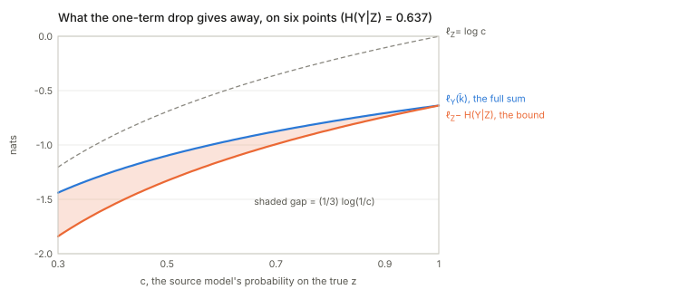
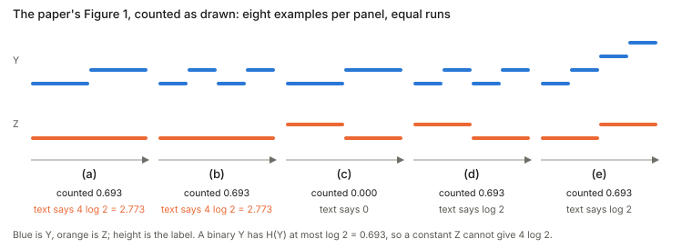
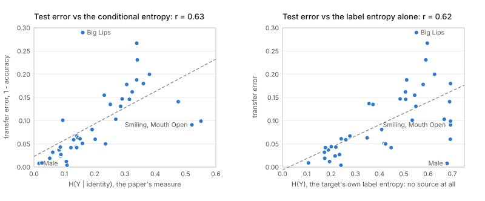
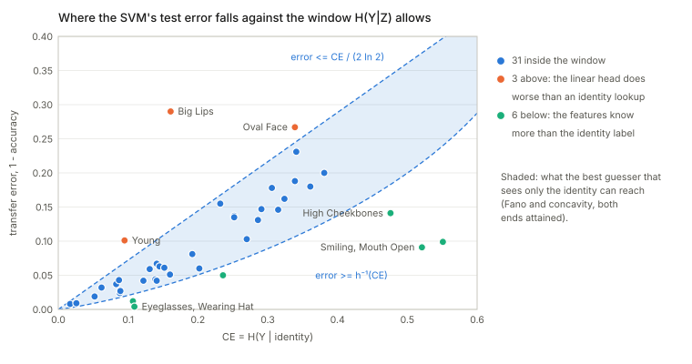
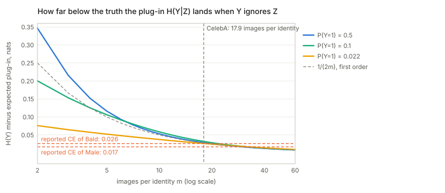

## Links

- **[arXiv:1908.08142](https://arxiv.org/abs/1908.08142)** — preprint; ICCV 2019. The arXiv
  PDF (v1, 19 pages) carries the appendix: the full proof of Theorem 1 is Appendix A (p. 11),
  and the per-attribute tables the checks below use are Tables 3 and 4 (pp. 13–14).
- **[Interactive companion](figures/interactive.html)** — four small experiments: type counts
  into a table and watch $H(Y\mid Z)$; slide the source's confidence and watch what the proof's
  one-term drop gives away; scatter the paper's 40 CelebA attributes against each candidate
  predictor; and see how far counting reads low when each source class has few images.
- **[Nguyen 2020 — LEEP](../2020-nguyen-leep/index.html)** — the direct successor, which
  replaces the ground-truth source labels here with a source model's soft predictions.
- **[Bao 2022 — H-score](../2022-bao-hscore-transferability/index.html)** — the third member
  of the set, approaching the same question from feature-space geometry.
- **[Diniz 2026 — PAS](../2026-diniz-pas/index.html)** — the unsupervised counterpart:
  scores a source/backbone pair without any target labels, which this measure requires.
- **[You 2021 — LogME](../2021-you-logme/index.html)** — the Bayesian-evidence measure,
  which needs only a feature extractor and so also covers regression and contrastive or
  language-model sources.
- **[Chaves 2023 — medical TE](../2023-chaves-medical-transferability/index.html)** —
  evaluates this score on medical targets, including out-of-distribution ones.
- **[Claßen 2026 — TE robustness](../2026-classen-te-robustness/index.html)** — benchmarks
  this measure against the others on medical imaging targets, and finds the rankings move
  under nothing but a change of random seed.
- **[Achille 2019 — task reachability](../2019-achille-task-reachability/index.html#transferability-scores-use-only-features-open-weight-models-come-without-data)** — a dynamics-based view of the same question. Its static task distance is built from information stored in the weights rather than from label entropies, and it adds a factor NCE cannot see: whether fine-tuning can actually reach a good target solution from the source weights. The linked section places NCE and the other scores against the paper's two factors.
- **[Runnable code](https://github.com/msrepo/theory_inclined_papers_with_annotations/blob/main/papers/2019-tran-nce-hardness/code/nce.py)** —
  the identity Theorem 1 turns on, the theorem itself, the hardness bound, what $H(Y\mid Z)$
  measures on constructed cases, a source-selection setting where dropping the
  source-hardness term picks the wrong model, Figure 1 counted as drawn, the one-term drop and
  a coarse-target case where it is loose, Eq. 14 without the theorem, the error window a binary
  target allows, the paper's own Tables 3 and 4, and the plug-in bias. `make verify` runs it;
  `python3 nce.py --figures` regenerates the SVGs in `figures/`.

## In one paragraph

Take two classification tasks over **the same input instances**, each with its own ground-truth
label sequence — $Z$ for the source, $Y$ for the target. Count the joint, compute the
conditional entropy $H(Y\mid Z)$, and that number alone bounds how well a representation trained
on $Z$ will transfer to $Y$. The striking thing is what it does *not* need: no model, no
features, no input data. It is **solution-agnostic** — two lists of labels suffice. The same
quantity, applied with a trivial constant source, estimates task *hardness*. The catch, which
the paper states and the follow-up literature then quietly drops, is that the bound has **two**
terms: the conditional entropy and the source model's own log-likelihood. Only when the source
is held fixed does the second one disappear.

Checked against the paper's own appendix, four things stand out. Figure 1's "$4\log 2$" does not
follow from the figure. The recomputed correlation for Figure 3 is $0.63$, not the printed
$0.78$, and the target's label entropy alone (no source) ties it on Pearson $r$ though not on
rank correlation. The case study transfers from a network that never saw the identity labels the
measure counts, so it tests the statistic rather than the theorem. And the bound is tight for a
one-to-one source and loose for a fine source with a coarse target.

## The spine of the argument

1. Define transferability as the log-likelihood on the target after freezing the source
   representation $w_Z$ and retraining only the head.
2. Build a classifier $\bar k$ that composes the source model's output with the empirical
   conditional $\hat P(y\mid z)$, and assume it lives in the head space $K$.
3. Its log-likelihood lower-bounds the best head's. Expand it, drop all but one term inside
   the log, and what falls out is exactly $l_Z - H(Y\mid Z)$.
4. Hardness is transferability from a *trivial* task, which gives $\mathrm{Hard}(T^Z)\le H(Z)$.

## Setup and notation

| Symbol | Meaning |
|---|---|
| $X=(x_1,\dots,x_n)$ | one input sequence, **shared by both tasks** |
| $Y, Z$ | target and source label sequences over those same inputs, both ground truth |
| $w_Z:\mathcal{X}\to\mathbb{R}^D$ | the representation learned on the source task |
| $h_Z$ | the source head; $k_Y$ the head retrained on the target |
| $l_Z(w_Z,h_Z)$ | average log-likelihood of the source model on $Z$ |
| $\widetilde{\mathrm{Trf}}(T^Z\to T^Y) = l_Y(w_Z,k_Y)$ | transferability, Eq. 5 |
| $\hat P(y,z)$ | empirical joint by **hard counting**, Eq. 6 |
| $H(Y\mid Z)$ | the conditional entropy, Eq. 7 — the measure itself |

The setting assumption is the strong one and worth stating up front: **both tasks are labelled
on the same inputs.** That is what makes counting $\hat P(y,z)$ possible at all, and it is
exactly what LEEP later removes.

## Conditional entropy, from scratch

Before the proof, the one number it is about. Take eight images. Each has a source label $z$
(call the two values A and B) and a target label $y$ (0 or 1). Count how often each pair occurs:

| | $z=$ A | $z=$ B |
|---|---|---|
| $y=0$ | 3 | 1 |
| $y=1$ | 1 | 3 |

Look only at the images with $z=$ A. Three of the four have $y=0$, so $\hat P(y{=}0\mid \text{A})=\tfrac34$
and $\hat P(y{=}1\mid\text{A})=\tfrac14$. Column B is the mirror image. The paper's number is the
**average surprise** of an image's target label once its source label is known. The surprise of
an event with probability $q$ is $-\ln q$: zero when it is certain, large when it is rare. An
image whose $y$ is the majority one for its $z$ has surprise $-\ln\tfrac34=0.288$; one that is not
has $-\ln\tfrac14=1.386$. Six images are of the first kind and two of the second, so

$$
H(Y\mid Z)=\frac{6\,(0.288)+2\,(1.386)}{8}=0.562\ \text{nats}.
$$

A *nat* is the unit you get from the natural logarithm; a fair coin flip is $\ln 2=0.693$ nats. (The
paper does not say which base it uses; natural logs are used throughout these notes, the code and
the figures.) Without knowing $z$ at all, $y$ is $0$ half the time and $1$ half the time, so
$H(Y)=\ln 2=0.693$. Knowing $z$ removed $0.131$ nats.

Three anchors are enough to carry the rest of the notes:

- if $z$ **determines** $y$ (each column has a single non-zero cell), $H(Y\mid Z)=0$;
- if $z$ is **useless** (every column has the same mix), $H(Y\mid Z)=H(Y)$, whatever $z$ is;
- in between it is $H(Y)-I(Y;Z)$, where the *mutual information* $I(Y;Z)$ is exactly the
  nats that knowing $z$ removes, $0.131$ above.

Reading Eq. 7 with this in hand: $\hat P(y,z)$ is a cell's count over $n$; $\hat P(z)$ is a column's
total over $n$; their ratio is $\hat P(y\mid z)$; and the double sum adds up, over the four cells,
*(the cell's share of the images) × (the surprise of its $y$ within its column)*. Averaging the
per-image surprises above and summing over cells are the same computation, which is the whole
content of Eq. 17 in the appendix. In the interactive page, section 1 lets you edit the counts and
watch each cell's contribution.

## Theorem 1, and the step it turns on

$$
\widetilde{\mathrm{Trf}}(T^Z\to T^Y)\;\ge\; l_Z(w_Z,h_Z)\;-\;H(Y\mid Z)
\tag{10}
$$

The proof constructs a specific classifier $\bar k$ (Eq. 9): push $x$ through the source model
to get $p_Z = h_Z(w_Z(x))$, then convert to a target distribution by averaging the empirical
conditional against it,

$$
p_Y(y) = \mathbb{E}_{z\sim p_Z}\big[\hat P(y\mid z)\big] = \sum_z \hat P(y\mid z)\,p_Z(z).
\tag{9}
$$

Then, assuming $\bar k\in K$ so that $l_Y(w_Z,k_Y)\ge l_Y(w_Z,\bar k)$,

$$
l_Y(w_Z,\bar k) = \frac1n\sum_i\log\Big(\sum_z\hat P(y_i\mid z)P(z\mid x_i)\Big)
\;\ge\; \frac1n\sum_i\log\Big(\hat P(y_i\mid z_i)P(z_i\mid x_i)\Big)
$$

$$
= \underbrace{\frac1n\sum_i\log\hat P(y_i\mid z_i)}_{=\,-H(Y\mid Z)}
\;+\;\underbrace{\frac1n\sum_i\log P(z_i\mid x_i)}_{=\,l_Z(w_Z,h_Z)} .
\tag{11–12}
$$

### Why that first term is *exactly* $-H(Y\mid Z)$ — and why LEEP cannot reuse it

This is the hinge, and it is worth being precise because it resolves something left open in the
LEEP notes. Because $\hat P$ here is the **hard** empirical conditional,

$$
\frac1n\sum_i\log\hat P(y_i\mid z_i)
= \sum_{y,z}\hat P(y,z)\log\hat P(y\mid z)
= -H(Y\mid Z)
$$

on the nose — the code confirms it to $0.00\mathrm{e}{+}00$. The step closes because
$\frac1n\sum_i\log Q(y_i\mid z_i)$ is maximised over conditionals $Q$ by precisely that $\hat P$.

[LEEP](../2020-nguyen-leep/index.html) runs the same argument with a **soft** conditional built
from a source model's softmax. The identity then fails in the wrong direction — the soft
conditional is *dominated* by the hard one, measured at $0.138$ nats below on the same data — so
the one-term-drop lands strictly below NCE and cannot establish LEEP's Property 2. That property
still holds empirically, but by a route this proof does not supply.

### Checking the theorem honestly

The bound is stated for a head space $K$ that **contains $\bar k$**, and the paper's Discussion 2
says how to arrange that: take $K = K'\cup\{\bar k\}$ and pick whichever scores better. That
assumption is load-bearing. Checking the bound against a plain linear head on the frozen
representation — a $K$ that does *not* contain $\bar k$ — produces violations, and they are the
checker's fault, not the theorem's. Done correctly:

| alignment | $l_Z$ | $H(Y\mid Z)$ | bound | actual Trf | holds |
|---|---|---|---|---|---|
| 0.3 | −0.0097 | 1.3355 | −1.3452 | −1.3357 | yes |
| 1.0 | −0.0313 | 1.1113 | −1.1425 | −1.1145 | yes |
| 2.0 | −0.0378 | 1.0104 | −1.0482 | −1.0204 | yes |
| 4.0 | −0.0069 | 0.2827 | −0.2896 | −0.2875 | yes |

Tight throughout in this family, where the source is confident about its own labels
($l_Z\approx 0$) and $Y$ becomes more nearly a one-to-one function of $Z$ as the alignment grows.
The next two subsections say where that tightness comes from and where it stops.

### The appendix proof, line by line

Appendix A (p. 11 of the arXiv PDF) has four moves, and only the third is an inequality that
loses anything:

1. **The best head beats $\bar k$.** $\widetilde{\mathrm{Trf}}=l_Y(w_Z,k_Y)\ge l_Y(w_Z,\bar k)$, because
   $k_Y$ is the best head in $K$ and the assumption is that $\bar k\in K$. No loss here if
   $\bar k$ really is one of the candidates; a hard assumption if it is not.
2. **Build $\bar k$.** For an image $x_i$ its probability of the true target label $y_i$ is
   $\sum_z \hat P(y_i\mid z)\,p(z\mid x_i)$: ask the source model how likely each source label is, and
   for each one look up how often that source label goes with $y_i$ in the counted table.
3. **Replace the sum by one of its terms.** Every term is non-negative, so the sum is at least the
   $z=z_i$ term alone, and $\log$ is increasing. This is Eq. 11 and it is where the bound is paid.
4. **Split the log of a product.** $\log\big(\hat P(y_i\mid z_i)\,p(z_i\mid x_i)\big)$ is a sum of two
   logs. Averaged over $i$, the second is $l_Z$ by definition and the first is $-H(Y\mid Z)$ by
   grouping the images by their $(y,z)$ pair and counting (Eq. 17), exactly as in the eight-image
   example.

### What the one-term drop gives away

Step 3 costs, for image $i$,

$$
\ln\!\Big(1+\frac{\sum_{z\ne z_i}\hat P(y_i\mid z)\,p(z\mid x_i)}{\hat P(y_i\mid z_i)\,p(z_i\mid x_i)}\Big)\ \ge 0 ,
$$

the log of *(the whole sum) over (the kept term)*. It is zero in two cases: the source is certain
of $z_i$, or $y_i$ never occurs with any other source label. Otherwise there is a second term to
throw away. Six points make it concrete: $Z=(0,0,0,1,1,1)$, $Y=(0,0,1,1,2,2)$, and a source that
puts probability $c$ on the right $z$ and $1-c$ on the other:

| $c$ | $l_Z$ | $l_Y(\bar k)$ | bound $l_Z-H$ | gap |
|---|---|---|---|---|
| 0.500 | −0.6931 | −1.0986 | −1.3297 | 0.2310 |
| 0.800 | −0.2231 | −0.7853 | −0.8597 | 0.0744 |
| 0.950 | −0.0513 | −0.6707 | −0.6878 | 0.0171 |
| 0.999 | −0.0010 | −0.6372 | −0.6375 | 0.0003 |

Here $H(Y\mid Z)=0.6365$, and the gap is *exactly* $\tfrac13\ln(1/c)$ in every row. The $\tfrac13$ is the
fraction of points, the two with $y=1$, whose label is possible under both source classes; the four
others have a single term and lose nothing.

The gap does not care whether the confusion matters to the target. Let $Z$ have $2g$ classes and
$Y=Z\,//\,g$, a coarse target of which $Z$ is a refinement, so $H(Y\mid Z)=0$. A source that is sure
of the group but spreads its probability over the $g$ classes inside it has $l_Z=-\ln g$. The
target log-likelihood of $\bar k$ is exactly $0$ (all the mass sits on the right group), and the
bound is $-\ln g$:

| $g$ | $l_Z$ | $H(Y\mid Z)$ | bound | $l_Y(\bar k)$ | gap |
|---|---|---|---|---|---|
| 1 | 0 | 0 | 0 | 0 | 0 |
| 2 | −0.6931 | 0 | −0.6931 | 0 | 0.6931 |
| 4 | −1.3863 | 0 | −1.3863 | 0 | 1.3863 |
| 8 | −2.0794 | 0 | −2.0794 | 0 | 2.0794 |

So the bound is tight for a one-to-one source and can be arbitrarily loose for a fine source and a
coarse target: it charges the target for every distinction the source cannot make, though the target
never asked for one. Something like a 1000-way source and a dog-or-not target is this case.

## What $H(Y\mid Z)$ actually measures

Three regimes, all exact in the code:

| case | $H(Y\mid Z)$ | |
|---|---|---|
| $Z$ bijective with $Y$ | 0.0000 | nothing left to learn; transfer is free |
| each $Z$ class splits into 2 | 0.6931 | $\log 2$ |
| each $Z$ class splits into 4 | 1.3863 | $\log 4$ |
| $Z$ trivial, $\lvert\mathcal{Y}\rvert=4$ | 1.3863 | $=H(Y)$ |
| $Z$ trivial, $\lvert\mathcal{Y}\rvert=16$ | 2.7726 | $=H(Y)=4\log 2$ |

**A trivial source gives $H(Y\mid Z)=H(Y)$** — there is nothing to condition on, so the transfer
must supply all of the information. The measure is, straightforwardly, *how much information about
$Y$ is still missing once you know $Z$.*

### Figure 1 counted as drawn

The paper illustrates this with five toy panels (its Figure 1) and says, in Sec. 3.3, that (c) has
$H(Y\mid Z)=0$, (d) and (e) have $\log 2$, and (a) and (b) have $4\log 2$, "the highest CE", so
that transfer is hardest for them. Counting the panels as drawn (eight examples each, equal runs)
gives something different:

| panel | source $Z$ | target $Y$ | $\lvert\mathcal Y\rvert$ | $H(Y)$ | $H(Y\mid Z)$ | $I(Y;Z)$ | text says |
|---|---|---|---|---|---|---|---|
| (a) | constant | two halves | 2 | 0.693 | **0.693** | 0 | $4\log 2$ |
| (b) | constant | alternating | 2 | 0.693 | **0.693** | 0 | $4\log 2$ |
| (c) | two halves | same halves, relabelled | 2 | 0.693 | 0 | 0.693 | $0$ |
| (d) | two halves | alternating | 2 | 0.693 | 0.693 | 0 | $\log 2$ |
| (e) | two halves | four levels | 4 | 1.386 | 0.693 | 0.693 | $\log 2$ |

The text itself says $T^Y$ is **binary** in (a–d). A binary target has $H(Y)\le\log 2$, and a constant
source leaves $H(Y\mid Z)=H(Y)$, so (a) and (b) cannot be $4\log 2=\log 16$; that value needs
sixteen balanced target labels. As drawn, (a), (b), (d) and (e) all tie at $\log 2$ and only (c)
differs, so the figure does not show the ordering the paragraph reads off it. The tie is not an
accident: (a), (b) and (d) all have $I(Y;Z)=0$, because in (d) each source class contains one
half-run of each target label, which is as uninformative as a constant source. Panel (e) reaches
$\log 2$ by another route, $\ln 4$ of target entropy minus the $\ln 2$ the source supplies. This
looks like a slip in the caption arithmetic and not in the theory. The 16-class row in the table
above shows what *would* give $4\log 2$, but the figure has two labels.

## Task hardness

Hardness is the optimal loss, $\mathrm{Hard}(T^Z)=\min_{w,h}\mathcal{L}_Z(w,h)=-l_Z(w_Z,h_Z)$
(Eq. 13). Applying Theorem 1 with a **trivial** constant source $C$ gives

$$
\mathrm{Hard}(T^Z)\;\le\;H(Z\mid C)
\tag{14}
$$

and since conditioning on a constant is no conditioning at all, $H(Z\mid C)=H(Z)$ — the plain
label entropy. So the paper's hardness estimate is, after unwinding, **the entropy of the source
label distribution**. Verified across $\lvert\mathcal{Z}\rvert\in\{2,4,8,16\}$: $H(Z\mid C)$ and
$H(Z)$ agree to four decimals and the bound holds every time.

That is a genuinely cheap estimator and it correlates well in their experiments. It is also
worth seeing plainly for what it is: a task with more, more balanced labels is estimated as
harder, with no reference to the inputs. The paper concedes the point — "this result does not
imply that the input domain has no impact on task hardness; only that the distribution of
training labels already provides a strong predictor" — but the estimator cannot distinguish a
4-class problem that is trivially separable from a 4-class problem that is not.

Eq. 14 also needs no theorem. A head that ignores $x$ and always outputs the label frequencies
$\hat P(z)$ has training cross-entropy exactly $-\frac1n\sum_i\log\hat P(z_i)=H(Z)$, and any model
class that can output a bias can do that, so $\mathrm{Hard}(T^Z)=\min L_Z\le H(Z)$ follows in one
line. The code checks it (for $\lvert\mathcal Z\rvert=2,5,16$ the frequency predictor's loss is
$0.6931,\ 1.6091,\ 2.7717$, equal to $H(Z)$, and 2000 random rival input-blind predictors never
beat it). So the "hardness estimate" is *the loss of the predictor that has learned nothing*, an
upper bound that is loose by however much the inputs help.

## The term the later papers drop

Theorem 1 has **two** terms, and this matters more than it looks.

The paper's own stated use is: *fix the source*, and then $l_Z(w_Z,h_Z)$ is a constant, so
ranking multiple **targets** by $-H(Y\mid Z)$ alone is licensed. Explicitly: "when the source
task $T^Z$ is fixed, the log-likelihood $l_Z(w_Z,h_Z)$ is a constant. In this case, the
transferability only depends on the CE $H(Y\mid Z)$."

But NCE is subsequently used — by [LEEP](../2020-nguyen-leep/index.html), by
[H-score](../2022-bao-hscore-transferability/index.html), and as a baseline generally — for
**source selection**: fixed target, varying source. There $l_Z$ is not constant, and dropping it
is an extra, unstated assumption.

Whether it bites depends on whether the two terms move together. Varying them *independently* —
how noisily $x$ carries $Z$ (which drives $l_Z$) against how tightly $Y$ follows $Z$ (which
drives $H(Y\mid Z)$) — they come apart:

| source | $l_Z$ | $H(Y\mid Z)$ | $-H(Y\mid Z)$ | $l_Z-H$ | actual Trf |
|---|---|---|---|---|---|
| clean $x$, loose $Y\mid Z$ | −0.4985 | 1.1940 | −1.1940 | −1.6925 | −1.2562 |
| clean $x$, tight $Y\mid Z$ | −0.5049 | 0.4891 | −0.4891 | −0.9940 | **−0.6710** |
| noisy $x$, tight $Y\mid Z$ | −1.3592 | 0.6126 | −0.6126 | −1.9718 | −1.1275 |
| noisy $x$, loose $Y\mid Z$ | −1.3637 | 1.1254 | −1.1254 | −2.4891 | −1.2914 |
| v. noisy $x$, tight $Y\mid Z$ | −1.3633 | 0.2004 | **−0.2004** | −1.5637 | −0.9732 |

Spearman against actual transfer: $-H(Y\mid Z)$ gives $+0.800$, the full $l_Z-H(Y\mid Z)$ gives
$+0.900$. And NCE's top pick is the *wrong* source — it prefers the very noisy one on the
strength of its low conditional entropy, while the clean source with looser alignment actually
transfers best. The reason is structural: **training on an unpredictable $Z$ yields a
representation that learned nothing, and $H(Y\mid Z)$ cannot see that, because it never looks at
$x$.** Solution-agnosticism is the selling point and the blind spot at once.

To be fair about the strength of this: where source hardness and label alignment *do* move
together — which is common, since a source with many fine-grained classes tends to be both
harder and more informative — a generator varying them in step shows no disagreement at all.
The assumption is real, it is unstated, and it is satisfied often enough that NCE works in
practice.

Restoring $l_Z$ is not a free fix either. The coarse-target table earlier shows the term charging
a target for the source's own confusion inside a group of source classes that the target does not
distinguish. Both terms of the bound are honest lower-bound pieces; neither is a clean measure of
how well a *representation* will carry over.

## Does the evidence show what the paper says it does?

The experiments (Sec. 5) never evaluate Theorem 1's inequality. They plot the counted $H(Y\mid Z)$
against the **test error of a linear SVM** on frozen features (Figures 2 and 3), and the counted
$H(Z)$ against the test error of a network trained from scratch (Figure 6). The theorem is a
statement about *training log-likelihood* and a head that may be $\bar k$; Definition 1 is about
accuracy and Eq. 5 replaces it, under a stated non-overfitting assumption, with the training
log-likelihood; Sec. 5 then says outright that test accuracy is "generally more important" and
reports that. What the figures test is the weaker claim that the counted number *predicts* the
error. Tables 3 and 4 of the appendix list, for all 40 CelebA attributes, the conditional entropy
given identity, the attribute's own entropy $H(Y)$ (which is
the "hardness" of Eq. 14) and the linear SVM's accuracy from identity features. That is enough to
recompute the claim.

### A binary target squeezes the error into a window

For a binary target there is a short argument for why some correlation must appear. Consider the
best guesser that sees *only* $z$: within each source class it says the majority target label. Its
error is $P_e=\sum_z\hat P(z)\min(q_z,1-q_z)$ with $q_z=\hat P(y{=}1\mid z)$, and
$H(Y\mid Z)=\sum_z\hat P(z)\,h(q_z)$ with $h$ the binary entropy. Two facts about $h$ bracket $P_e$:

- $h$ is concave, so by Jensen $H(Y\mid Z)\le h(P_e)$, i.e. $P_e\ge h^{-1}\!\big(H(Y\mid Z)\big)$;
- $h(q)\ge 2\ln 2\cdot\min(q,1-q)$ (a concave function above its chord), so $P_e\le H(Y\mid Z)/(2\ln 2)$.

Both ends are attained (one source class with $q=0.1$ hits the lower end; half the mass at
$q=\tfrac12$ and the rest at $q=0$ hits the upper end), and 2000 random tables never leave the
window. At $H(Y\mid Z)=0.3$ the window is $[0.089,\,0.216]$, and its top is $2.4\times$ its bottom.
So across binary targets the counted number pins the *ideal* error to a band, and a correlation
with the error of a decent classifier is close to arithmetic.

### What the paper's own tables give

Recomputing from Table 3 (rows 9 and 11) and Table 4, for the 40 CelebA attributes:

| | Pearson $r$ | Spearman $\rho$ |
|---|---|---|
| CE $=H(Y\mid\text{ID})$ against transfer error | **0.630** (Fig. 3 prints 0.78) | 0.825 |
| same, without Big Lips | 0.726 | |
| $H(Y)$, the label entropy alone, against transfer error | 0.621 | 0.660 |
| CE against dedicated-network error | 0.525 | |
| $H(Y)$ against dedicated-network error | 0.581 (Fig. 6a prints 0.58) | |
| $\mathrm{CE}/H(Y)$ against transfer error | 0.333 | |
| partial $r$ of CE with error, given $H(Y)$ | 0.326 | |
| partial $r$ of $H(Y)$ with error, given CE | 0.299 | |

Figure 6(a)'s printed $0.58$ reproduces to the third digit, which says the tables and the
transcription are consistent, and makes the mismatch for Figure 3 ($0.63$ against $0.78$) a real
discrepancy and not a typing error. Removing Big Lips gets to $0.73$ but no further; I cannot tell
whether the figure used unrounded values or a different split. Two things then matter for what the
correlation means:

- **The label entropy alone ties it on Pearson.** $H(Y)$ uses no source at all and reaches $0.62$
  against $0.63$. The paper reports only Pearson. On rank correlation the conditional entropy is
  clearly ahead ($0.83$ against $0.66$), and each still explains something after controlling for the
  other (partial $0.33$ and $0.30$). So the conditional entropy does carry signal beyond the
  target's base rate, and a good part of the headline correlation is what the base rate gives free.
- **Rare attributes look transferable for free.** A rare attribute has small $H(Y)$, so its
  conditional entropy is small whatever the source says. Pale Skin ranks 12th of 40 by CE, yet
  the SVM's error (0.042) equals the error of always answering "no" (0.043). Big Lips is the
  opposite: a middling CE and the worst transfer error in the table:

| attribute | CE | $H(Y)$ | CE$/H(Y)$ | always-majority error | SVM error |
|---|---|---|---|---|---|
| Male | 0.017 | 0.679 | 0.03 | 0.416 | 0.008 |
| Bald | 0.026 | 0.107 | 0.24 | 0.022 | 0.009 |
| Pale Skin | 0.122 | 0.177 | 0.69 | 0.043 | 0.042 |
| Blurry | 0.139 | 0.201 | 0.69 | 0.051 | 0.044 |
| Big Lips | 0.161 | 0.552 | 0.29 | 0.241 | 0.290 |
| Smiling | 0.521 | 0.693 | 0.75 | 0.491 | 0.091 |
| Mouth Open | 0.551 | 0.693 | 0.80 | 0.491 | 0.099 |

("Always-majority error" is the rarer class's rate, recovered from $H(Y)$; it assumes the tables
report plain accuracy, which the paper does not say. If they are class-balanced accuracies, this
column and the window below change meaning, though the correlations above do not.) Male is the
clearest positive case: the measure cuts a large $H(Y)=0.679$ to $3\%$ of itself, so it plainly
*can* see an identity-determined attribute. Against the fraction $\mathrm{CE}/H(Y)$ that identity
leaves unexplained the correlation with error falls to $0.33$: the raw correlation is partly a
level effect, and the ratio is the version that isolates what the source contributes.

The printed correlations are also a selected sample. The twelve panels in the main-text
Figure 2 have $r=0.92$–$0.97$. The appendix shows the whole grid: for all 40 CelebA source
attributes $r$ runs from $0.73$ to $0.94$ (mean $0.84$), and the four CelebA panels chosen for
the main text (source attributes 18, 20, 26 and 36) are *exactly* the four highest of the forty.
The 85 AwA2 sources run $0.91$–$0.98$ (mean $0.95$). The identity source's printed $0.78$ is
inside the CelebA range, with $35$ of the $40$ binary sources above it.

### The window, against the SVM's error

Putting the 40 SVM errors against the window $[h^{-1}(\mathrm{CE}),\ \mathrm{CE}/(2\ln 2)]$ that a
guesser seeing only the identity could reach:

- **31 inside**, so for most attributes the error is what the identity table allows.
- **3 above** (Big Lips, Oval Face, Young): the linear head does *worse* than a lookup on the
  identity label would. That is what the $\bar k\in K$ condition failing looks like: the counted
  table is usable only by a head that can consult the source's softmax over identities, and a linear
  SVM cannot. (Sampling noise between the training table and the test error could also account for
  Oval Face, which is borderline once the bias below is allowed for.)
- **6 below** (Smiling, Mouth Open, High Cheekbones, Eyeglasses, Wearing Hat, Bangs): the
  frozen features do *better* than any guesser that knows only the identity could. For Smiling
  and Mouth Open the window starts at $0.215$ and $0.240$ and the SVM gets $0.091$ and $0.099$. The
  representation encodes expression the identity label does not. This is the cleanest evidence that
  a label-only number describes $Z$, not what the network learned, and it is the gap that the
  feature-space scores ([H-score](../2022-bao-hscore-transferability/index.html),
  [LogME](../2021-you-logme/index.html)) exist to close.

### The estimator is biased low, and by about the size of the smallest values

$H(Y\mid Z)$ is computed by splitting the images by source label and measuring the mix of $y$
*inside each group*. A small group looks purer than its truth by chance. With CelebA's $182{,}626$
training images over $10{,}177$ identities there are $17.9$ images per identity, and even for an
attribute *independent of identity* the counted value falls short of the truth by about
$(|\mathcal Y|-1)\,|\mathcal Z|/(2n)=0.028$ nats (exact binomial expectation and a full Monte Carlo agree):

| $P(y{=}1)$ | true $H(Y\mid Z)=H(Y)$ | counted, exact | shortfall | Monte Carlo |
|---|---|---|---|---|
| 0.022 | 0.1057 | 0.0794 | 0.0264 | 0.0787 |
| 0.100 | 0.3251 | 0.2930 | 0.0321 | 0.2921 |
| 0.240 | 0.5511 | 0.5217 | 0.0294 | 0.5212 |
| 0.500 | 0.6931 | 0.6644 | 0.0287 | 0.6647 |

The paper's smallest reported values are $0.017$ (Male) and $0.026$ (Bald), *below the bias itself*.
The order among the top few attributes is inside the estimator's own error. And the effect scales
with the number of source classes: a source with as many labels as images reads $0$ for every
target, so the measure rewards fine-grained sources by construction. Against a noise-only
baseline the reported CE is $0.84$ of what pure noise would give for Pale Skin, $0.83$ for Mouth
Open and $0.82$ for Blurry, so for those the identity labels tell the counting almost nothing; Male
is $0.03$. (The bias also lifts the window a little. Adding $0.028$ to each CE moves the top end
for Young from $0.069$ to $0.089$ against an error of $0.101$, for Big Lips from $0.116$ to $0.136$
against $0.290$, and for Oval Face from $0.245$ to $0.265$ against $0.267$; Young and Big Lips stay
above, and Oval Face becomes a borderline case.)

### What is transferred in the case study

For the Figure 2 experiments each source is a binary attribute and a ResNet-18 is trained on it, so
the source premise of Theorem 1 holds, but the head is a linear SVM, so $\bar k\notin K$. For the
face-recognition case study (Sec. 5.2, Table 1, Figure 3) the counted $Z$ is CelebA's identity
label, but the network that is transferred is a ResNet-101 trained on MS-Celeb-1M and VGGFace2
"following removal of subjects included in CelebA". It never saw the labels the measure counts, so
the setting of Theorem 1 (the same $Z$ for the model and for the table) is not met there either.
That is a fair transfer experiment and not a test of the theorem, and its printed correlation
($0.78$, which recomputes to $0.63$) is below the AwA2 range and within the CelebA one.

## How the three measures relate

| | **NCE** (this paper) | [**LEEP**](../2020-nguyen-leep/index.html) | [**H-score**](../2022-bao-hscore-transferability/index.html) |
|---|---|---|---|
| what it reads | two ground-truth label sequences | source model's softmax $\theta(x)$ | penultimate features $h(x)$ |
| needs a trained source model | **no** (for the measure) | yes | yes |
| needs source labels on target inputs | **yes** | no | no |
| the head | $\hat P(y\mid z)$, hard counting | $\hat P(y\mid z)$, soft counting | optimal linear head, eliminated |
| what it estimates | a lower bound, with a second term | a lower bound at one head | a second-order approximation to the supremum |
| assumption | shared input instances | source labels code the target | weak dependence, $o(\varepsilon^2)$ |

The lineage is clean. **NCE needs the source labels but no model; LEEP needs the model but no
source labels** — it replaces the ground-truth $z_i$ with the source model's prediction, and
that single substitution is the entire difference. H-score comes at the same target from the
other side, working in feature space and optimising the head away rather than constructing one.
Read the three together and the design space is essentially: *which representation do you read
(labels, softmax, features), and do you evaluate one head or the best one?*

## Questions and doubts

- **The measure is model-free; the bound is not.** $H(Y\mid Z)$ needs only labels, which is the
  headline. But Theorem 1's right-hand side contains $l_Z(w_Z,h_Z)$, which requires a trained
  source model. The advertised cheapness belongs to the measure alone, and only survives to the
  bound when the source is fixed.
- **The $\bar k\in K$ assumption is load-bearing** and easy to miss. Check the bound against a
  head space that excludes $\bar k$ and it fails; the paper handles this in a Discussion
  paragraph rather than in the theorem statement.
- **Source selection is outside what is licensed**, as the table above shows. Every later paper
  that benchmarks against NCE uses it in exactly that regime.
- **Hardness reduces to label entropy.** Eq. 14 unwinds to $\mathrm{Hard}(T^Z)\le H(Z)$, the loss of
  the predictor that ignores the input, so the estimator cannot separate two tasks with the same
  label distribution and different intrinsic difficulty. The correlations reported are real but the
  mechanism is blunter than "hardness" suggests. The CelebA one recomputes to $0.581$, the weakest
  of the three data sets ($0.58$, $0.82$, $0.96$).
- **Figure 1's "$4\log 2$" does not follow from the figure.** The text says $T^Y$ is binary in
  panels (a–d), and a binary target cannot have $H(Y\mid Z)$ above $\log 2$; counted as drawn, (a),
  (b), (d) and (e) all tie at $\log 2$. The ordering the paragraph reads off the figure is not in
  it. I read this as a caption slip and not a flaw in the idea, but the toy example is the paper's
  only intuition for why a trivial source is hardest.
- **Figure 3's printed correlation does not reproduce.** $r=0.78$ is printed; Tables 3 and 4
  give $0.63$ ($0.73$ without Big Lips; Spearman $0.83$). The same recomputation reproduces
  Figure 6(a)'s $0.58$ to the third digit, so this is not a transcription problem. I do not know
  whether the figure used unrounded values, a different split or a different error.
- **The label entropy alone ties the headline correlation.** $H(Y)$, with no source, gives
  Pearson $0.62$ against the conditional entropy's $0.63$; on rank correlation the conditional
  entropy is clearly ahead ($0.83$ against $0.66$). The paper reports only Pearson and never
  compares with a base-rate predictor, so how much of the "remarkable" correlation is transfer and
  how much is the target's base rate is not shown. The conditional entropy does carry signal
  beyond it (partial $r\approx0.3$).
- **The printed correlations are a selected sample.** The four CelebA panels in the main-text
  Figure 2 are exactly the four highest of the forty in the appendix ($0.93$–$0.94$, against a mean
  of $0.84$ over all forty).
- **The experiments do not test Theorem 1.** They compare the counted number with the test error
  of a linear SVM (hinge loss, $\bar k\notin K$), not with the log-likelihood the theorem bounds.
  In the case study the transferred network was trained on other identities, not on the labels
  that are counted. The bound itself is checked in the code, and it holds, but only there.
- **The bound is tight for a bijection and loose for a coarse target.** The one-term drop costs
  $\ln(1+\text{other terms}/\text{kept term})$ per image. For a fine source and a coarse target it
  charges the target the source's whole within-group confusion ($\ln g$ for $g$ classes), so the
  bound can be arbitrarily far below the truth exactly where the transfer is easy.
- **The counted $H(Y\mid Z)$ is biased low, by about the size of its smallest values.** With
  $17.9$ images per identity the shortfall is about $0.028$ nats even for an attribute independent
  of identity, against reported values of $0.017$ and $0.026$ for Male and Bald. It falls to $0$
  as the source gets as many labels as images, so a fine-grained source looks informative by
  construction. A bias-corrected version (Miller–Madow, or a shrinkage estimator) would be the
  natural repair, and the paper does not raise it.
- **A label-only number describes $Z$, not the representation.** On the plain-accuracy reading,
  six attributes (Smiling, Mouth Open, High Cheekbones, Eyeglasses, Wearing Hat, Bangs) transfer
  *better* than any guesser that sees only the identity could, and three (Big Lips, Oval Face,
  Young) transfer worse than a lookup would. Feature-space scores see the first group; only a head that can consult the source's
  softmax could use the counted table in the second.
- **Rare attributes look transferable for free.** Pale Skin ranks 12th of 40 by conditional entropy
  and its SVM error equals that of always answering "no".
- **Plain or class-balanced accuracy?** The tables say "accuracy" and the paper does not say which.
  The correlations do not depend on it; the always-majority baseline and the window do.
- **Shared input instances is a strong setting assumption**, and the one the paper is most
  candid about — the conclusion flags extending beyond it as future work. LEEP's main
  contribution is removing it.
- **Everything is empirical log-likelihood on the training set**, justified by "the
  non-overfitting assumption holds even for large networks". Discussion 3 sketches a McDiarmid
  route to the expected log-likelihood but does not carry it out.

## Takeaways

- **The measure is two lists of labels and a counting argument.** That it predicts transfer at
  all — no model, no features, no inputs — is the surprising result, and it is why this paper
  seeded the two that followed.
- **$H(Y\mid Z)$ is how much about $Y$ is still missing once you know $Z$.** A bijective source
  gives zero, a trivial source gives $H(Y)$, a $k$-way split gives $\log k$. Nothing subtler is
  going on.
- **The hinge identity is that the hard empirical conditional makes the counting exact:** the
  average of $\log\hat P(y_i\mid z_i)$ *is* $-H(Y\mid Z)$. That is why this proof lands on a clean
  number and why LEEP's soft version cannot inherit it — the cleanest thing to carry between the
  two papers. The one-term drop before it is a separate step, and it is the one that loses.
- **Read Theorem 1's two terms, not one.** The paper is explicit that dropping $l_Z$ requires a
  fixed source; the field then used it for source selection anyway. Where source hardness and
  label alignment happen to move together that is harmless, and where they do not, NCE picks the
  wrong model.
- **Its correlation with error is partly the target's base rate.** For a binary target the counted
  number pins the ideal error to a window $[h^{-1}(H),\,H/(2\ln 2)]$, and in the paper's own tables
  the label entropy $H(Y)$ alone ties the conditional entropy on Pearson $r$ ($0.62$ against $0.63$,
  with the paper's printed $0.78$ not reproducing). The conditional entropy still leads on rank
  correlation, so it is a real signal on top of the base rate, just a smaller one than it looks.
- **Two things to fix before trusting small differences.** The counted value is biased low by about
  $0.028$ nats at $17.9$ images per class, as large as the top of the ranking, and the bound
  charges a coarse target for a fine source's confusions. The idea survives both; the small
  differences among the top-ranked attributes do not.
