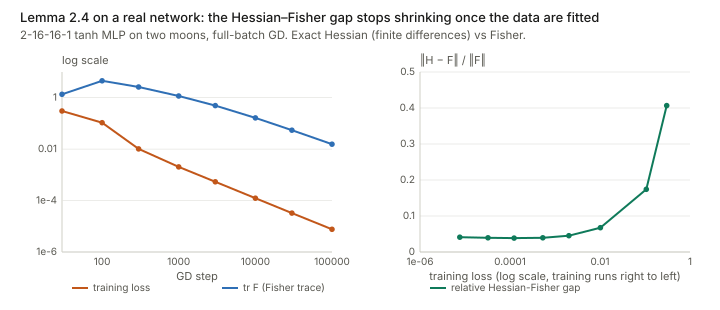
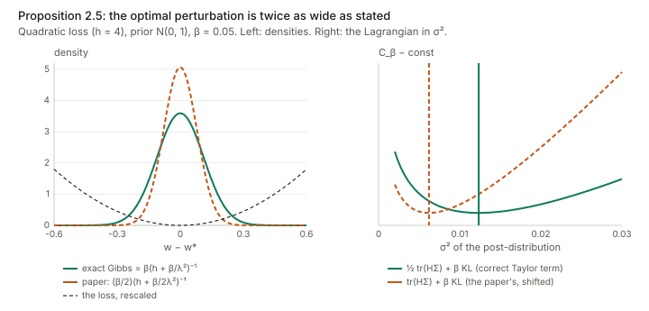
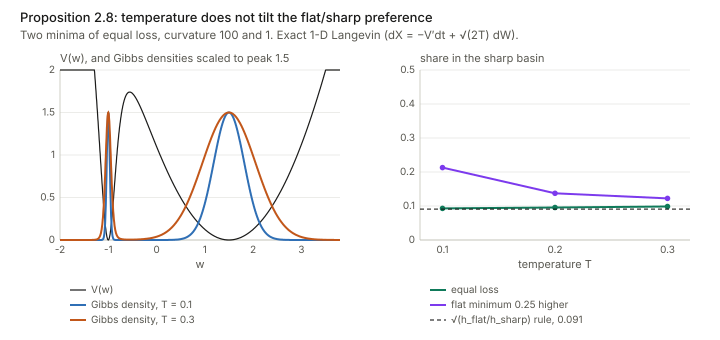
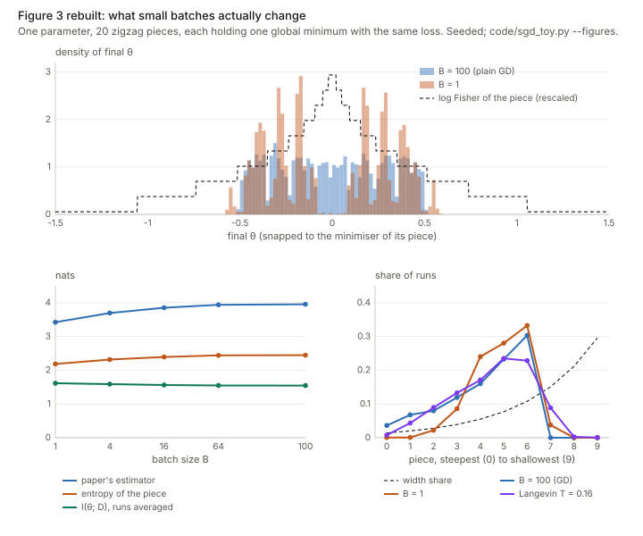

## Links

- **[arXiv:1905.12213](https://arxiv.org/abs/1905.12213)**: the preprint; these notes follow v5 (22 June 2020). No
  code is released.
- **[Interactive companion](figures/interactive.html)**: four widgets. (1) The Information Lagrangian in one
  dimension: the exact minimiser, the two Gaussian formulas and the rate–distortion curve. (2) Flat against
  sharp minima under temperature. (3) The paper's Figure 3 toy, rerun in the browser, with its Shannon estimate
  taken apart. (4) Which Fisher the activations see, in a two-weight picture.
- **[Runnable checks](https://github.com/msrepo/theory_inclined_papers_with_annotations/tree/main/papers/2020-achille-information-in-weights/code)**:
  `information_checks.py` checks the algebra of Propositions 2.3, 2.5, 2.8, 2.9 and 3.2.
  `hessian_fisher.py` checks Lemma 2.4 on a small network. `sgd_toy.py` rebuilds the Figure 3 experiment.
  Every number below comes from one of them, and `make verify` runs all three.
- **[Inequalities and concentration](../inequalities-and-concentration/index.html)**: the
  [KL chain rule and Donsker–Varadhan](../inequalities-and-concentration/index.html) sections are the background
  for Proposition 2.3 and for the Gibbs form of the optimum below.
- **[Expectation–Maximization](../expectation-maximization/index.html)**: the ELBO, which Definition 2.1
  generalises.
- The papers this one builds on: Achille & Soatto, *Emergence of invariance and disentanglement in deep
  representations*, JMLR 2018 ([arXiv:1706.01350](https://arxiv.org/abs/1706.01350)); Hinton & van Camp,
  *Keeping neural networks simple by minimizing the description length of the weights*, COLT 1993; McAllester,
  *A PAC-Bayesian tutorial with a dropout bound* ([arXiv:1307.2118](https://arxiv.org/abs/1307.2118)).

Alessandro Achille, Giovanni Paolini and Stefano Soatto, *Where is the Information in a Deep Neural Network?*,
arXiv 2019–2020.

## In one paragraph

After training, a network is a fixed function. Its weights are numbers, and the mutual information between a
fixed number and anything else is either zero or infinite. So "how much does the network know about its
training set?" needs a definition before it has an answer. The paper's definition is a coding cost. Imagine
perturbing the weights with noise $Q(w\mid\mathcal D)$ and measuring (a) how much the training loss rises and
(b) how many nats it takes to describe the noisy weights relative to a reference code $P(w)$, which is
$\mathrm{KL}(Q\,\Vert\,P)$. The trade-off $C_\beta=\mathbb E_Q[L_{\mathcal D}]+\beta\,\mathrm{KL}(Q\Vert P)$ is
the *Information Lagrangian*, and the KL at its optimum is the *Information in the Weights* (Definition 2.1).
Choosing $P$ and $Q$ recovers the classical quantities. The best $P$ on average over datasets gives Shannon's
mutual information $I(w;\mathcal D)$ (Proposition 2.3), which controls generalisation through PAC-Bayes. Gaussian
$P$ and $Q$ give a log-determinant of the Hessian, which is close to the Fisher (Propositions 2.4–2.5). The paper
then argues that SGD links the two. Its noise pushes it out of sharp minima (Proposition 2.8, the Eyring–Kramers
law), and flatter, more stable minima carry less Shannon information (Proposition 2.9). Finally, weight noise
of the size the Fisher allows induces noise in the activations, and that bounds how much information about the
input the activations *effectively* carry (Proposition 3.2). So small information in the weights should force
invariant representations. The framework is clean and the definitions are worth knowing. Checking the details,
I found three algebra slips, one of them in the central formula of Section 3, plus an approximation used outside
the regime where it is valid. The paper's own toy experiment, rebuilt, does not show what the paper says it
shows: the drop in "Shannon information" with small batches is the entropy of *which* equivalent minimum SGD
reaches. That is randomness from the seed, not information about the data.

## The spine of the argument

The paper runs a chain of links from quantities you can compute on the training set to properties of the network
on unseen data. Here is each link and how it fared under checking:

| Link | Statement | Status after checking |
|---|---|---|
| Def 2.1 | IW = KL at the optimum of $\mathbb E_Q L+\beta\,\mathrm{KL}(Q\Vert P)$ | Clean; the optimum is a Gibbs distribution (§2.1 below) |
| Thm 2.2 | PAC-Bayes: small $C_\beta$ ⇒ small test loss | Standard, but its $\beta$ is $N$ times the $\beta$ of Def 2.1 |
| Prop 2.3 | Optimal $P$ = marginal; $\mathbb E\,\mathrm{KL}=I(w;\mathcal D)$ | Correct; checked exactly |
| Lemma 2.4 | $H=F+$ residual; $H\approx F$ when points are fitted | Decomposition exact; "residual → 0" true only in absolute terms |
| Prop 2.5 | Gaussian IW ≈ $\tfrac12\log\lvert H\rvert$ + const | Right shape, but $\Sigma^*$ is off by a factor 2 and Eq 8 has $-k$ for $-k/2$ |
| Prop 2.8 | Higher SGD temperature avoids high-Fisher minima | For equal-loss minima, isotropic Kramers says the preference is independent of $T$ |
| Prop 2.9 | Lower Fisher or more stable SGD ⇒ lower $I(w;\mathcal D)$ | At a minimiser the two are one knob, not two; $\beta$ should be $\beta^k$ |
| Prop 3.2 | Fisher of activations $=\frac1\beta\nabla_x f^\top J F_w J^\top\nabla_x f$ | Should be $\nabla_x f^\top(\beta J F_w^{-1}J^\top)^{-1}\nabla_x f$; Eq 10 needs $\dim z\ge\dim x$ |
| §3 end | Minimal IW ⇒ invariant activations | Qualitatively plausible; not established by Prop 3.2 |
| §4, Fig 3 | Small batches lower both Fisher and Shannon information | Rebuilt: true Shannon information is flat; the estimator measures the seed |

## Background, from the ground up

### KL divergence and mutual information, in plain words

$\mathrm{KL}(q\Vert p)=\mathbb E_{w\sim q}[\log q(w)/p(w)]$ is the average number of extra nats you pay when you
encode samples of $q$ with a code designed for $p$. A small example: if $q$ puts all its mass on one of 8
equally likely outcomes of $p$, then $\mathrm{KL}=\log 8$, the cost of saying which outcome it was. The same
reading works for continuous weights. Take a code $P=\mathcal N(0,\lambda^2)$ for one weight and a "noisy weight"
$Q=\mathcal N(w^*,\sigma^2)$. Then
$\mathrm{KL}(Q\Vert P)=\log(\lambda/\sigma)+\tfrac{\sigma^2+w^{*2}}{2\lambda^2}-\tfrac12$. The main term,
$\log(\lambda/\sigma)$, is the number of nats needed to pin the weight down to precision $\sigma$ inside a range
of size $\lambda$. A weight that tolerates a lot of noise (large $\sigma$) is cheap to store.

Mutual information is the same idea averaged over the thing being described: $I(w;\mathcal D)=
\mathbb E_{\mathcal D}\,\mathrm{KL}(Q(w\mid\mathcal D)\,\Vert\,Q(w))$, where $Q(w)=\mathbb E_{\mathcal D}Q(w\mid\mathcal D)$ is
the distribution of weights you would get before knowing which dataset you trained on. It asks: how much does
seeing the dataset change what the weights look like?

### Fisher information: how fast the output distribution moves with the weights

For a model $p_w(y\mid x)$, nudge the weights by $\delta w$. The output distribution moves, and to second order
$\mathbb E_x\,\mathrm{KL}(p_w\Vert p_{w+\delta w})=\tfrac12\delta w^\top F\,\delta w$ with

$$
F=\mathbb E_{x}\,\mathbb E_{y\sim p_w(y\mid x)}\big[\nabla_w\log p_w(y\mid x)\,\nabla_w\log p_w(y\mid x)^\top\big].
$$

(The paper drops the $\tfrac12$ in Section 1.2; it matters nowhere.) Two things to notice. First, $y$ is drawn
from the *model*, not from the data, so $F$ depends on the inputs $x$ but not on the labels (the paper uses this
in Section 2.3). Second, a big $F$ in a direction means a small move there changes the predictions a lot: the
weight is "informative" and must be stored precisely. So $\tfrac12\log\lvert F\rvert$ behaves like the
$\log(1/\sigma)$ term above, summed over directions.

A one-number example: a single logistic unit with logit $z=wx$ at $x=1$ has $F=p(1-p)$. That is $0.25$ when
$p=0.5$, and $\approx 0.0099$ when $p=0.99$. Confident predictions have *small* Fisher, a fact that returns in
the discussion of Lemma 2.4.

### PAC-Bayes: generalisation priced in nats

A PAC-Bayes bound says the test loss of a *randomised* predictor $w\sim Q$ is at most its training loss plus a
penalty proportional to $\mathrm{KL}(Q\Vert P)/N$, for any $P$ fixed before seeing the data. The penalty is the
coding cost of the weights, spread over the $N$ training points. If the weights can be described in few nats
relative to $N$, the network cannot have memorised the labels, which would cost about $N\log\lvert\mathcal Y\rvert$
nats. That is the whole motivation for measuring information in the weights by a KL.

## Setup and notation

| Symbol | Meaning |
|---|---|
| $\mathcal D=\{(x_i,y_i)\}_{i=1}^N$ | the training set |
| $L_{\mathcal D}(w)=\frac1N\sum_i-\log p_w(y_i\mid x_i)$ | mean cross-entropy on the training set (a mean, not a sum) |
| $P(w)$ | *pre-distribution*: a reference code chosen before seeing $\mathcal D$ (not a Bayesian prior) |
| $Q(w\mid\mathcal D)$ | *post-distribution*: a chosen perturbation of the trained weights (not a Bayesian posterior) |
| $C_\beta(\mathcal D;P,Q)$ | Information Lagrangian $\mathbb E_Q[L_{\mathcal D}]+\beta\,\mathrm{KL}(Q\Vert P)$ (Eq 2) |
| $H=\nabla^2_w L_{\mathcal D}$ | Hessian of the training loss |
| $F$, $F_w$, $F(w)$ | Fisher information of the weights (labels sampled from the model) |
| $k$ | number of weights (in Prop 2.9's formula it should be the dimension of $\mathcal D$) |
| $T\propto\eta/B$ | SGD "temperature": learning rate over batch size |
| $z=f_w(x)$ | activations of some layer; $J_f=\partial z/\partial w$, $\nabla_x f=\partial z/\partial x$ |
| $I_{\text{eff},\beta}(x;z)$ | effective information: $I(x;z_n)$ with $z_n=f_{w+n}(x)$, $n\sim\mathcal N(0,\beta F^{-1})$ |

The paper insists, rightly, that $P$ and $Q$ are *choices of code*, like choosing a unit of measurement. They
are not claims about how SGD distributes the weights. Different choices give different information measures,
and the art is to pick the one that connects to what you want to prove.

## Section 2: Information in the Weights

### 2.1 Definition 2.1, and what minimises it

$$
C_\beta(\mathcal D;P,Q)=\mathbb E_{w\sim Q(w\mid\mathcal D)}[L_{\mathcal D}(w)]+\beta\,\mathrm{KL}\big(Q(w\mid\mathcal D)\,\Vert\,P(w)\big).
$$

The first term is the loss the network suffers if its weights are jittered by $Q$. The second is the cost of
describing the jittered weights. A large $\beta$ says "description is expensive", so $Q$ spreads out and the
weights are stored coarsely. A small $\beta$ lets $Q$ shrink onto the minimum.

The paper does not write down the minimiser, but it has a closed form, and it is worth having. Collect both
terms under one expectation:

$$
C_\beta=\beta\,\mathbb E_Q\Big[\log Q-\log\big(P\,e^{-L_{\mathcal D}/\beta}\big)\Big]
=\beta\,\mathrm{KL}\big(Q\,\Vert\,Q^*_\beta\big)-\beta\log Z_\beta,
\qquad Q^*_\beta=\frac{P\,e^{-L_{\mathcal D}/\beta}}{Z_\beta},\quad Z_\beta=\mathbb E_P\,e^{-L_{\mathcal D}/\beta}.
$$

A KL is never negative and is zero only at equality, so **the optimal post-distribution is the Gibbs
distribution** $Q^*_\beta\propto P\,e^{-L_{\mathcal D}/\beta}$, with optimal value $-\beta\log Z_\beta$. This is the
Donsker–Varadhan identity. Two consequences:

- Differentiating the optimal value in $\beta$ (the envelope theorem: $Q^*$ is optimal, so its own change does
  not contribute) gives $\frac{d}{d\beta}\min_Q C_\beta=\mathrm{KL}(Q^*_\beta\Vert P)$. **The Information in the
  Weights is the slope of the optimal Lagrangian.** As $\beta$ varies, the pairs $(\mathrm{KL},\mathbb E L)$ trace a
  convex rate–distortion curve, which is the "Pareto-optimal curve" the paper mentions.
- Every Gaussian formula later in the paper is a Laplace approximation of this Gibbs distribution around one
  minimum.

`information_checks.py` §2 does this on a grid for a tilted double well at $\beta=0.2$. $C$ at the Gibbs
distribution is 0.16372, and 200 random perturbations of it are all worse. The best Gaussian is worse by 0.0786,
because it cannot cover both wells. The numerical derivative of the optimum in $\beta$ is 0.53714, and so is
$\mathrm{KL}(Q^*\Vert P)$.

### 2.2 Theorem 2.2 (PAC-Bayes), and the two betas

McAllester's bound, as the paper states it: for a loss in $[0,1]$, any $\beta>\tfrac12$ fixed in advance, and any
$Q$, with probability at least $1-\delta$,

$$
L_{\text{test}}(Q)\le\frac{1}{1-\frac1{2\beta}}\Big[\mathbb E_Q L_{\mathcal D}+\frac{\beta}{N}\big(\mathrm{KL}(Q\Vert P)+\log\tfrac1\delta\big)\Big].
\qquad\text{(Eq 3)}
$$

The bracket has the shape of $C_\beta$, but with $\beta/N$ where Definition 2.1 has $\beta$. So the two betas
differ by a factor of $N$: $\beta_{\text{Def 2.1}}=\beta_{\text{PAC}}/N$. The condition $\beta_{\text{PAC}}>\tfrac12$
becomes $\beta_{\text{Def}}>1/(2N)$. For $N=50\,000$ that is $\beta>10^{-5}$, so "for a sufficiently small
$\beta$" in Proposition 2.5 is compatible with the bound. The same factor of $N$ affects the remark that
"$\beta=1$ coincides with the ELBO". With $L_{\mathcal D}$ a mean, the negative ELBO divided by $N$ is
$\mathbb E_Q L_{\mathcal D}+\frac1N\mathrm{KL}$, which is $\beta=1/N$ (§4 of the checks prints both values).
Two smaller points. The cross-entropy is not bounded by 1, as the theorem needs; footnote 3 defers to McAllester
for the reduction. And $\beta$ must be fixed before the data are seen, or paid for with a union bound over a grid.

### 2.3 Proposition 2.3: Shannon information is the best code on average

*Claim.* If datasets come from $\pi(\mathcal D)$ and training maps $\mathcal D\mapsto Q(w\mid\mathcal D)$, the $P$
minimising $\mathbb E_{\mathcal D}C_\beta$ is the marginal $Q(w)=\mathbb E_{\mathcal D}Q(w\mid\mathcal D)$, and then
$\mathbb E_{\mathcal D}\mathrm{KL}(Q\Vert P)=I(w;\mathcal D)$.

*Proof, line by line.* Only the KL term involves $P$. Insert $Q(w)$ inside the log:

$$
\mathbb E_{\mathcal D}\,\mathbb E_{Q(w\mid\mathcal D)}\log\frac{Q(w\mid\mathcal D)}{P(w)}
=\mathbb E_{\mathcal D}\,\mathbb E_{Q(w\mid\mathcal D)}\log\frac{Q(w\mid\mathcal D)}{Q(w)}
+\mathbb E_{\mathcal D}\,\mathbb E_{Q(w\mid\mathcal D)}\log\frac{Q(w)}{P(w)}.
$$

In the second term, averaging $Q(w\mid\mathcal D)$ over $\mathcal D$ gives $Q(w)$, so it is $\mathrm{KL}(Q(w)\Vert P)$.
The first term is $I(w;\mathcal D)$ by definition. Hence
$\mathbb E_{\mathcal D}\mathrm{KL}(Q\Vert P)=I(w;\mathcal D)+\mathrm{KL}(Q(w)\Vert P)\ge I(w;\mathcal D)$, with
equality exactly at $P=Q(w)$. $\square$ This is the "golden formula" of rate–distortion theory. Checks §1: on a
random 5-dataset, 6-weight example both sides are 1.082796, and at $P=Q(w)$ the cost drops to $I=0.2994$ nats.

Two remarks the paper leaves implicit. The bound needs the *algorithm's* $Q(w\mid\mathcal D)$, so any randomness
in training (the seed) has to be averaged over, or conditioned on, consistently; Section 4 gets this wrong. And
Shannon information is a *lower bound* on every other choice of $P$. In particular, no Gaussian code can report
fewer nats than $I(w;\mathcal D)$.

### 2.4 Lemma 2.4: Hessian = Fisher + residual

For logits $z=f_w(x)$ and cross-entropy $L(y,z)$, the chain rule twice gives

$$
H=\frac1N\sum_i J_i^\top\,\nabla_z^2L\,J_i+\frac1N\sum_i\sum_j\big[\nabla_zL(y_i,z_i)\big]_j\,\nabla_w^2 z_{ij},
\qquad J_i=\partial z_i/\partial w.
$$

For softmax cross-entropy, $\nabla^2_zL=\operatorname{diag}(p)-pp^\top$ does not depend on the label. So the first
term equals the Fisher (labels drawn from the model) exactly. The second term, the residual, is weighted by
$\nabla_zL=p-e_{y}$. (The paper writes $L=-\sum_j\delta_{y,j}\log z_j$, which treats $z$ as probabilities. The
clean statement is with $z$ as logits.) For a linear model $\nabla_w^2z=0$ and $H=F$ at every $w$. The check for
logistic regression gives $\max\lvert H-F\rvert=1.4\times10^{-12}$, which is finite-difference noise.

The paper then says that when "almost all training samples are predicted correctly, $\nabla_zL\approx0$ and
$H\approx F$". The first half is true, but it does not give the second. If the correct class has probability
$1-\varepsilon$, then $p-e_y$ has entries of size $\varepsilon$. But so does $\operatorname{diag}(p)-pp^\top$: its
$(y,y)$ entry is $p_y(1-p_y)\approx\varepsilon$. **Residual and Fisher shrink together**, both $O(\varepsilon)$. So
$H\approx F$ holds in absolute terms (both go to zero), but the relative gap is set by the ratio of logit
curvature $\nabla^2_wz$ to squared logit gradient $\lVert J\rVert^2$, an architectural quantity.

`hessian_fisher.py` measures this on a 2-16-16-1 tanh network (337 weights) trained by full-batch gradient
descent on 200 two-moons points. The Hessian comes from finite differences of the exact gradient. The
decomposition holds at every checkpoint (relative error below $10^{-8}$).

| GD step | train loss | accuracy | $\lVert H-F\rVert/\lVert F\rVert$ | $\operatorname{tr}F$ |
|---|---|---|---|---|
| 30 | 0.30 | 0.87 | 0.41 | 1.36 |
| 100 | 0.107 | 0.975 | 0.17 | 4.56 |
| 300 | 0.0102 | 1 | 0.068 | 2.61 |
| 3 000 | $5\times10^{-4}$ | 1 | 0.039 | 0.49 |
| 100 000 | $7.7\times10^{-6}$ | 1 | 0.041 | 0.016 |

So $H\approx F$ to about 4% here, which is good enough for the paper's purposes. But the gap stops improving
once the data are fitted: from step 3 000 on, the loss falls another factor of 70 and the gap does not move. Two
side observations matter for Figures 1 and 4. First, the Fisher trace peaks at step 100 and then falls **293-fold**
while the decision boundary barely changes. Once points are classified confidently, $p(1-p)\to0$. A late
"compression" of the Fisher on separable data therefore needs no change in what the network computes, only more
confident logits. Second, at a fitted minimum the Hessian has tiny negative eigenvalues (the most negative is
$-4\times10^{-6}$), which is why Remark 2.6 prefers the Fisher, which is positive semi-definite by construction.

### 2.5 Proposition 2.5: the Gaussian (Fisher) Information in the Weights

*Setting.* $P=\mathcal N(0,\lambda^2I)$ and $Q=\mathcal N(w^*,\Sigma)$ centred at a local minimum $w^*$. Find the
best $\Sigma$ and the resulting KL.

*Derivation, with the step the paper slips on.* For small $\beta$, $Q$ is concentrated near $w^*$, where
$L_{\mathcal D}(w)\approx L_{\mathcal D}(w^*)+\tfrac12(w-w^*)^\top H(w-w^*)$ (the gradient vanishes at a minimum).
The expected loss under $Q$ is then

$$
\mathbb E_Q L_{\mathcal D}=L_{\mathcal D}(w^*)+\tfrac12\operatorname{tr}(H\Sigma),
$$

because $\mathbb E[(w-w^*)^\top H(w-w^*)]=\operatorname{tr}(H\,\mathbb E[(w-w^*)(w-w^*)^\top])=\operatorname{tr}(H\Sigma)$. The Gaussian KL is

$$
\mathrm{KL}(Q\Vert P)=\tfrac12\Big[\tfrac{\operatorname{tr}\Sigma+\lVert w^*\rVert^2}{\lambda^2}-k+k\log\lambda^2-\log\lvert\Sigma\rvert\Big].
$$

Setting $\partial C_\beta/\partial\Sigma=\tfrac12H+\tfrac{\beta}{2\lambda^2}I-\tfrac\beta2\Sigma^{-1}=0$ gives

$$
\boxed{\Sigma^*=\beta\Big(H+\frac{\beta}{\lambda^2}I\Big)^{-1}}\qquad\text{(paper: }\Sigma^*=\tfrac\beta2\big(H+\tfrac{\beta}{2\lambda^2}I\big)^{-1}\text{)}.
$$

The appendix proof writes $\mathbb E_QL_{\mathcal D}\simeq L_{\mathcal D}(w^*)+\operatorname{tr}(H\Sigma)$, without the
$\tfrac12$ of the Taylor expansion. The paper's $\Sigma^*$ is exactly the optimum of that objective (checks §3:
the paper's objective has gradient $1.6\times10^{-15}$ at the paper's $\Sigma^*$). Against the correct objective,
the gradient there is 1.6, while at $\beta(H+\beta/\lambda^2I)^{-1}$ it is $4\times10^{-16}$. There is an
independent check. For a quadratic loss, the exact Gibbs minimiser from §2.1 is Gaussian with covariance
$(H/\beta+I/\lambda^2)^{-1}$, which is the corrected formula. So the paper's perturbation is **half as wide as it
should be**: the ratio of traces is 0.506 at $\beta=0.01$, tending to $\tfrac12$. The cost of using it is
$\beta(\tfrac12\ln2-\tfrac14)\approx0.097\beta$ nats per weight of extra Lagrangian (0.572$\beta$ for the 6-weight
example). The paper's own later sections quietly use the corrected size: Definition 3.1 and Proposition 2.9 both
take $\beta F^{-1}$, which is the $\lambda\to\infty$ limit of the corrected $\Sigma^*$, not of the stated one.

Substituting the corrected $\Sigma^*$ (using $\log\lvert\Sigma^*\rvert=k\log\beta-\log\lvert H+\tfrac\beta{\lambda^2}I\rvert$):

$$
\mathrm{KL}(Q^*\Vert P)=\tfrac12\log\Big\lvert H+\tfrac{\beta}{\lambda^2}I\Big\rvert+\tfrac k2\log\tfrac{\lambda^2}{\beta}-\tfrac k2
+\tfrac1{2\lambda^2}\Big[\lVert w^*\rVert^2+\beta\operatorname{tr}\big(H+\tfrac\beta{\lambda^2}I\big)^{-1}\Big].
$$

Eq (8) in the paper has the same structure with its own $\Sigma^*$, but ends the first line with $-k$. Evaluating
the KL at the paper's own $\Sigma^*$ gives $-k/2$. The check finds Eq (8) as printed is 12.8454 and the true KL is
15.8454, a difference of exactly $k/2=3$. None of this changes the paper's qualitative message, because the
dependence on the minimum is carried by $\tfrac12\log\lvert H\rvert$ in both versions. The slips shift additive
constants.

How to read the formula: for small $\beta$ each eigen-direction of $H$ with eigenvalue $h_i\gg\beta/\lambda^2$
contributes $\tfrac12\log(h_i\lambda^2/\beta)$ nats. That is "the weight must be stored to precision
$\sqrt{\beta/h_i}$ in a range of size $\lambda$". Flat directions ($h_i\lesssim\beta/\lambda^2$) cost nothing. Remark
2.7 is right that the $\lambda\to\infty$ limit leaves $\tfrac12\log\lvert H\rvert$ plus a diverging constant.

### 2.6 Proposition 2.8: Eyring–Kramers and the free energy

*The law.* For overdamped Langevin dynamics $dw=-\nabla L\,dt+\sqrt{2T}\,dW$, the expected time to leave a
minimum $w^*$ over a saddle $w^s$ with one negative eigenvalue $\lambda_1(w^s)$ is, as $T\to0$,

$$
\mathbb E\tau=\frac{2\pi}{\lvert\lambda_1(w^s)\rvert}\sqrt{\frac{\lvert\det H(w^s)\rvert}{\det H(w^*)}}\;e^{(L(w^s)-L(w^*))/T}.
$$

*Where the free energy comes from.* Write the square root as an exponential:
$\sqrt{\lvert H_s\rvert/\lvert H_*\rvert}=\exp\big(\tfrac1T[\tfrac T2\log\lvert H_s\rvert-\tfrac T2\log\lvert H_*\rvert]\big)$. Then
$\mathbb E\tau=\frac{2\pi}{\lvert\lambda_1\rvert}e^{(\mathcal F(w^s)-\mathcal F(w^*))/T}$ with
$\mathcal F=L+\tfrac T2\log\lvert H\rvert$. That is the paper's formula, with $H$ replaced by the Fisher. (At a
saddle the Hessian has a negative eigenvalue and the Fisher does not, so that substitution needs more care there
than at a minimum.) The same $\mathcal F$ is also the Laplace approximation to the Gibbs mass of a basin:
$\int_{\text{basin}}e^{-L/T}\approx e^{-L(w^*)/T}(2\pi T)^{k/2}\lvert H_*\rvert^{-1/2}\propto e^{-\mathcal F(w^*)/T}$.

*The catch.* The $T$ in front of $\log\lvert H\rvert$ is divided out again in the exponent. The curvature enters
$\mathbb E\tau$ only through the $T$-independent prefactor $\lvert H_*\rvert^{-1/2}$. Take two minima with the **same
loss**, which is the normal situation for an overparameterised network at zero training loss. Then the ratio of
their escape times, and the ratio of their Gibbs masses, is $\sqrt{\lvert H_B\rvert/\lvert H_A\rvert}$ at every
temperature. The flat minimum is preferred, but raising $T$ does not make it *more* preferred. Temperature only
trades loss against volume: it matters when the flat minimum is also higher.

Checks §5, with exact 1-D mean first-passage times (no Kramers approximation) for a well of curvature 100 and one
of curvature 1 at equal depth:

| $T$ | $\mathbb E\tau$ sharp / $\mathbb E\tau$ flat | Gibbs share of the sharp well | same, flat well 0.25 higher |
|---|---|---|---|
| 0.1 | 0.1007 | 0.0930 | 0.213 |
| 0.2 | 0.0951 | 0.0955 | 0.138 |
| 0.3 | 0.0890 | 0.0985 | 0.122 |

The Laplace prediction for the equal-depth share is $0.1/1.1=0.0909$ at every $T$. The small drift at higher $T$
goes *towards* the sharp well, the opposite of the claim. Only when the flat well is lifted does higher $T$ push
mass into it.

So the isotropic law, which is what Proposition 2.8 states, does not support "increasing the temperature makes
the optimisation more likely to avoid minima with high Fisher" for degenerate minima. The paper says the
anisotropic case shares the tendency. It does, but for a different reason. SGD's noise covariance is itself
roughly proportional to the Hessian near a minimum, so a sharp minimum is also a *hot* one, and the curvature moves
into the exponent (Xie et al. 2020). The toy in Section 4 shows exactly this. Started from its own stationary distribution, isotropic
Langevin keeps the distribution over equal-loss minima where it is at every temperature, and only SGD noise moves
it.

### 2.7 Proposition 2.9: Shannon ≈ Fisher, via Brunel–Nadal

*The tool.* Brunel & Nadal (1998): if a parameter $\theta\in\mathbb R^d$ is observed through data $r$ precise
enough that the posterior $p(\theta\mid r)$ is nearly Gaussian with covariance $J(\theta)^{-1}$ (the inverse Fisher
of $r$ about $\theta$), then its conditional entropy is about $\mathbb E\,\tfrac12\log\big((2\pi e)^d/\lvert J\rvert\big)$.
So $I(\theta;r)\approx H(\theta)-\mathbb E\,\tfrac12\log\big((2\pi e)^d/\lvert J(\theta)\rvert\big)$. Plainly: the
information equals the prior uncertainty minus the uncertainty that remains, and the remainder is the volume of
the Fisher ellipse.

*Application.* The "parameter" is the dataset $\mathcal D$ (parameterised by $d$ numbers) and the "observation" is
$w\sim\mathcal N(w^*(\mathcal D),\beta F^{-1})$. For a Gaussian whose mean moves with $\mathcal D$, the Fisher about
$\mathcal D$ is $\nabla_{\mathcal D}w^{*\top}(\beta F^{-1})^{-1}\nabla_{\mathcal D}w^*=\tfrac1\beta\nabla_{\mathcal D}w^{*\top}F\,\nabla_{\mathcal D}w^*$
(the covariance-derivative term is dropped by the footnote-5 assumption). Its determinant is
$\beta^{-d}\lvert\nabla w^{*\top}F\nabla w^*\rvert$, so

$$
I(w;\mathcal D)\approx H(\mathcal D)-\mathbb E_{\mathcal D}\Big[\tfrac12\log\frac{(2\pi e\,\beta)^d}{\lvert\nabla_{\mathcal D}w^{*\top}F(w^*)\,\nabla_{\mathcal D}w^*\rvert}\Big].
$$

The paper has $\beta(2\pi e)^k$: $\beta$ should be raised to the power $d$, and $d$ is the dimension of $\mathcal D$
(the Brunel–Nadal parameter), not the number of weights. Another constant shift.

*The interpretation needs a correction.* The paper reads this as two independent levers: "reducing the Fisher
(flatness), or making SGD more stable, i.e. reducing $\nabla_{\mathcal D}w^*$, both reduce $I(w;\mathcal D)$." At an
actual minimiser the levers are welded together. Differentiate the stationarity condition
$\nabla_wL(w^*(\mathcal D);\mathcal D)=0$ in $\mathcal D$: $H\,\nabla_{\mathcal D}w^*+\partial_{\mathcal D}\nabla_wL=0$, so
$\nabla_{\mathcal D}w^*=-H^{-1}\partial_{\mathcal D}\nabla_wL$. A flatter minimum (smaller $H$) moves *more* when the data
change. With $F\approx H$,

$$
\nabla_{\mathcal D}w^{*\top}F\,\nabla_{\mathcal D}w^*\approx\partial_{\mathcal D}\nabla_wL^\top\,H^{-1}\,\partial_{\mathcal D}\nabla_wL,
$$

so at fixed data-sensitivity of the gradient, flatness *raises* the information. More basically, the whole
expression is invariant under reparameterising the weights, as mutual information must be. Checks §6 does least
squares with the labels as the dataset coordinates. There $\tfrac1\beta J^\top HJ$ is exactly $\tfrac2{N\beta}$ times
the hat matrix $X(X^\top X)^{-1}X^\top$ (max deviation $8\times10^{-17}$). A reparameterisation that makes the
minimum 100 times flatter (Hessian trace 10.634 → 0.1063) makes it 10 times less stable ($\lVert\nabla_yw^*\rVert$
0.371 → 3.715) and leaves the product unchanged ($6\times10^{-17}$). This is the information-theoretic face of Dinh
et al.'s observation that sharpness is not reparameterisation invariant, which the paper cites. What *is* meaningful
is the combination the formula actually contains: how far the minimum moves when the data change, measured in the
metric $F/\beta$. That is precisely the ellipse comparison in Figure 2, so the figure is on firmer ground than the
sentence beside it.

Also note: the rank of $\tfrac1\beta J^\top HJ$ is at most the number of weights. With $d=40$ label coordinates and 5
weights it has rank 5, the determinant is zero, and the formula returns $-\infty$. So Brunel–Nadal needs
$\dim\mathcal D\le\dim w$: an overparameterised model and a low-dimensional parameterisation of datasets.

## Section 3: effective information in the activations

### 3.1 Definition 3.1

The activations $z=f_w(x)$ are a deterministic function of $x$, so $I(x;z)$ is degenerate. The paper borrows the
noise from the weights. Perturb $w$ by $n\sim\mathcal N(0,\beta F^{-1})$, the largest perturbation the Lagrangian
tolerates, and call $I_{\text{eff},\beta}(x;z)=I(x;f_{w+n}(x))$ the *effective information*. The idea is attractive:
input features that survive only in directions the weights "do not care about" are washed out by this noise, so
the effective information counts only what the trained classifier actually uses.

### 3.2 Proposition 3.2 (i): which Fisher do the activations carry?

*Derivation.* Linearise in the weights: $z_n=f_{w+n}(x)\approx f_w(x)+J_f\,n$. Given $x$, $z_n$ is therefore Gaussian,

$$
z_n\mid x\;\sim\;\mathcal N\big(f_w(x),\;\Sigma(x)\big),\qquad \Sigma(x)=J_f\,(\beta F_w^{-1})\,J_f^\top.
$$

This is a pushforward: the weight-noise covariance $\beta F_w^{-1}$ is carried into activation space by $J_f$. The
Fisher of a Gaussian family $\mathcal N(m(x),\Sigma(x))$ about $x$ has a mean part and a covariance part:

$$
[F_{z\mid x}]_{ab}=\partial_a m^\top\Sigma^{-1}\partial_b m+\tfrac12\operatorname{tr}\big(\Sigma^{-1}\partial_a\Sigma\,\Sigma^{-1}\partial_b\Sigma\big).
$$

The covariance part does not depend on $\beta$ (the $\beta$'s cancel), while the mean part is $O(1/\beta)$. So
for small $\beta$ the mean part dominates:

$$
\boxed{F_{z\mid x}\approx\nabla_xf^\top\big(\beta\,J_fF_w^{-1}J_f^\top\big)^{-1}\nabla_xf}
\qquad\text{(paper: }\tfrac1\beta\nabla_xf^\top J_fF_wJ_f^\top\nabla_xf\text{)}.
$$

The paper's version puts $F_w$ where $(J_fF_w^{-1}J_f^\top)^{-1}$ belongs. In the appendix the last line reads
$\nabla_xf\cdot\Sigma_w^{-1}\nabla_xf$, applying the weight-space precision directly to activation-space vectors,
and the main text then sandwiches it between $J_f$'s. A dimensional check shows the problem. If $w$ has units
$[w]$ and $z$ units $[z]$, then $F_w\sim[w]^{-2}$ and $J_f\sim[z]/[w]$. So $J_fF_w^{-1}J_f^\top\sim[z]^2$ is a
covariance, and its inverse is a precision. But $J_fF_wJ_f^\top\sim[z]^2/[w]^4$ is neither.

Checks §7 uses a linear layer $z=Wx$ with a K-FAC-shaped Fisher $F_w=A\otimes B$, $\dim z=3$, $\dim x=5$. The
exact Gaussian Fisher agrees with a Monte Carlo estimate of $\mathbb E[-\nabla_x^2\log p(z\mid x)]$ to 0.5%. The mean
term has trace 111.0, the covariance term 4.3, and the paper's formula gives 386.0. For this Kronecker case the
ratio of the paper's formula to the correct one is exactly $(x^\top Ax)(x^\top A^{-1}x)$. For unit $x$,
Kantorovich's inequality puts that ratio in $[1,(\kappa+1)^2/4\kappa]$. So the paper **overstates** the Fisher,
here by 3.48 (1.37 after normalising $x$). It also gets the dependence on the input scale backwards. Doubling $x$
multiplies the correct Fisher by 0.25, because weight noise acting on a larger input makes larger activation
noise. The paper's formula instead multiplies it by 4.

The discrepancy is largest when weights are correlated. One activation $z=w_1x$ reads one of two weights whose
Fisher is $\left(\begin{smallmatrix}1&\rho\\\rho&1\end{smallmatrix}\right)$:

| $\rho$ | correct $(JF^{-1}J^\top)^{-1}$ | paper $JFJ^\top$ |
|---|---|---|
| 0 | 1.000 | 1.000 |
| 0.9 | 0.190 | 1.000 |
| 0.99 | 0.020 | 1.000 |

With $\rho$ near 1 the two weights are nearly redundant. Noise can move $w_1$ freely as long as $w_2$ compensates,
so $w_1$ is barely constrained, and the correct formula (a Schur complement, $1-\rho^2$) sees that. The paper's
formula looks only at the diagonal entry and misses it. Widget 4 of the
[interactive page](figures/interactive.html#act) draws this.

What survives: both expressions scale like $c$ when $F_w\to cF_w$, and both are monotone in $F_w$ in the matrix
order ($F\preceq F'$ implies $F^{-1}\succeq F'^{-1}$, and so on through the inverse). So the qualitative claim (i),
"the Fisher of the activations goes to zero when the Fisher of the weights goes to zero", holds for the corrected
formula too. So does "a smaller Lipschitz constant $\nabla_xf$ reduces it". (The statement also defines
$F_{z\mid x}=\mathbb E[\nabla_x^2\log p]$ without the minus sign; the proof has it.)

### 3.3 Proposition 3.2 (ii): the dimension problem in Eq (10)

Eq (10) applies Brunel–Nadal again, now with $x$ as the parameter:
$I_{\text{eff}}(x;z)\approx H(x)-\mathbb E\,\tfrac12\log\big((2\pi e)^{\dim x}/\lvert F_{z\mid x}\rvert\big)$. But
$F_{z\mid x}$ is a $\dim x\times\dim x$ matrix built from $\nabla_xf$, which has only $\dim z$ rows. Its mean part has
rank at most $\dim z$. For any layer narrower than the input, say 10 logits for a 3 072-pixel image, the determinant
is zero and the formula returns $-\infty$. In the check, the mean term has rank 3, the covariance term rank 1, and
the sum rank 4 < 5: the smallest eigenvalue is $5.5\times10^{-15}$. The proposition does state the needed
assumption: "if $p(x\mid z)$ concentrates around its maximum". But that assumption says the representation
determines the input up to small noise, which is the opposite of the invariant, compressed representations the
section is trying to explain. For the representations of interest the approximation is simply unavailable. What
remains valid is part (i) and the qualitative "less weight Fisher, less input sensitivity" message.

### 3.4 From effective information to invariance

The section closes by combining (i) with Proposition 3.1 of Achille & Soatto (2018). There, a *sufficient*
representation is maximally invariant to all nuisances if and only if $I(x;z)$ is minimal among sufficient
representations. The conclusion is "a network with minimal information in the weights is forced to learn a
representation that is effectively invariant to nuisances". Two gaps. First, nothing shows that the noisy
activations $z_n$ remain sufficient for the task, which the cited equivalence requires. Second, (ii) is not
available for compressive layers. So the chain *low IW → low weight Fisher → low activation Fisher* is sound (with
the corrected formula). The final step *→ minimal effective information among sufficient representations →
invariance* is an interpretation, not a proof.

## Section 4: the experiments

### 4.1 Figure 3, rebuilt: what small batches actually change

*The paper's toy.* Draw $\mu\sim\mathrm{Unif}[-1,1]$ and a dataset of $N=100$ points $x_i\sim\mathcal N(\mu,1)$.
Fit $\mu$ by minimising $L_{\mathcal D}(\theta)=\frac1N\sum_i(x_i-\varphi(\theta))^2$, where $\varphi$ is a fixed zigzag
that is steep near $\theta=0$ and shallow far away (Figure 3, right). Every linear piece of the zigzag sweeps the
whole range $[-1,1]$, so **every piece holds exactly one global minimum, all with the same loss**. They differ
only in slope $s$, hence in curvature $2s^2$ and Fisher $Ns^2$. The paper runs SGD with several batch sizes. It
takes $Q(\theta\mid\mathcal D)=\mathcal N(\theta^*,F^{-1})$ for the minimum $\theta^*$ that each run reaches, and it
reports $\mathbb E_{\mathcal D}\mathrm{KL}(Q(\theta\mid\mathcal D)\Vert Q(\theta))$ as "Shannon information". Smaller batches
give lower Fisher and lower information (3.8 → 2.4 nats).

*The rebuild* (`sgd_toy.py`; unstated choices are mine and are listed in the script). There are 10 pieces on each
side, widths growing by 1.4, slopes 93 to 4.5. $\mu\sim\mathrm{Unif}[-0.8,0.8]$, so that the minimum sits inside a
piece. The learning rate is $10^{-4}$, just stable in the steepest piece. Runs last 20 000 steps, with 300
datasets × 12 runs, and minibatch noise of the exact variance of sampling $B$ of $N$. $\theta_0\sim\mathrm{Unif}[-0.5,0.5]$,
because the paper's GD histogram sits inside $\lvert\theta\rvert<0.7$. Three estimates of information are
compared:

- **paper's estimator**: one Gaussian per run, averaged KL to the pooled mixture;
- **$I(\theta;\mathcal D)$**: the same, but the runs of each dataset are averaged into $Q(\theta\mid\mathcal D)$ first. This
  is the quantity Proposition 2.3 and PAC-Bayes are about;
- **$H(\text{piece})$**: the entropy of which zigzag piece the run ends in.

| | $\mathbb E\log F$ | $H(\text{piece})$ | paper's estimator | $I(\theta;\mathcal D)$ | best Gaussian IW |
|---|---|---|---|---|---|
| $B=100$ (GD) | 10.84 | 2.45 | 3.95 | 1.54 | 4.18 |
| $B=16$ | 10.77 | 2.39 | 3.85 | 1.56 | 4.15 |
| $B=4$ | 10.64 | 2.32 | 3.70 | 1.59 | 4.10 |
| $B=1$ | 10.36 | 2.19 | 3.42 | 1.61 | 4.03 |
| Langevin $T=0.01$ | 10.82 | 2.48 | 3.95 | 1.56 | 4.18 |
| Langevin $T=0.16$ | 10.65 | 2.57 | 3.98 | 1.56 | 4.18 |

The qualitative trend of the paper's Figure 3 is reproduced: smaller batches empty the steep central pieces, and
both the mean log Fisher and the paper's estimator fall (3.95 → 3.42). But the estimator is not measuring
information about the data.

- **Every piece carries the same information about the data.** Push a piece's Gaussian
  $\mathcal N(\theta^*,1/(Ns^2))$ through $\varphi$ and it becomes $\mathcal N(\bar x,1/N)$, whatever the slope. That is the
  reparameterisation invariance of §2.7 in its simplest form. The information inside one piece works out to 1.51
  nats (computed directly), and for GD the paper's estimator minus $H(\text{piece})$ is exactly 1.51.
- **The paper's estimator is $I(\theta;\mathcal D,\text{seed})$.** One Gaussian per run conditions on the
  initialisation and the SGD noise, and the pooled mixture averages over them. The excess over $I(\theta;\mathcal D)$ is
  $H(\text{piece}\mid\mathcal D)$: randomness about which equivalent minimum was reached. For GD that is 3.95 − 1.54 =
  2.41 nats, against $H(\text{piece})=2.45$. For $B=1$ it is 3.42 − 1.61 = 1.81. So the whole 0.53-nat drop that the
  paper attributes to less information is this seed entropy falling by 0.60 nats.
- **The true $I(\theta;\mathcal D)$ does not fall with batch size.** It goes 1.54 → 1.61, a slight *rise*, because with
  small batches the piece a run escapes to starts to depend on $\bar x$ (the barriers at the two ends of a piece are
  $(1\mp\bar x)^2$). Meanwhile $\mathbb E\log F$ falls by 0.48. In this toy, lower Fisher and lower Shannon information
  are not linked at all.
- **Isotropic Langevin behaves differently from SGD.** Its stationary distribution puts mass on each piece in
  proportion to the piece's width *at every temperature*, which is the $T$-independence of §2.6. Start it from a
  uniform initialisation over $[-1.5,1.5]$, which already puts runs in proportion to width, and the shares stay put
  for $T=0.01$ to $0.16$ (the paper's estimator reads 4.12 to 4.09). From the centred start, higher $T$ only
  mixes runs towards that width-proportional spread. $H(\text{piece})$ *rises* (2.48 → 2.57) and the estimator does
  not fall (3.95 → 3.98). Only SGD, whose noise in $\theta$ scales with the slope, empties the steep pieces below
  their width share. From the uniform start its effect shrinks to 0.21 nats, and $I(\theta;\mathcal D)$ sits at
  1.55–1.56 throughout.
- **"4000–5000 nats" cannot be right** for this one-parameter model. The best proper Gaussian code gives 4.0–4.4 nats
  here. It can never be below the Shannon value (Proposition 2.3), and for a scalar weight it is about
  $\tfrac12\mathbb E\log(\lambda^2F)$. Reaching thousands of nats would take $F\sim e^{8000}$. My guess is that the number
  is the Fisher itself: the Fisher axis of the paper's Figure 3 is labelled ×10⁴ and peaks near 8 000.

Widget 3 of the [interactive page](figures/interactive.html#toy) reruns this in the browser.

### 4.2 Figures 1, 2 and 4

- **Figure 1** plots $\log\lvert F\rvert$ (about 0 to 450) over training a 3-layer network on 2-D points, with
  "bumps" as features are learned and a "compression" at the end. The details are referenced as "see ??", a broken
  cross-reference. With more weights than training points the Fisher of a binary classifier is singular, so some
  damping must have been used, and its size sets the scale of the plot. The late compression has the mundane
  explanation measured in §2.4: once points are confidently classified, $p(1-p)$ collapses, and the Fisher trace
  falls 293-fold with no change in the decision boundary.
- **Figure 2** shows two SGD paths on datasets differing in one example, against the inverse-Fisher ellipse. As
  §2.7 argues, the distance between endpoints measured in that ellipse's metric is the meaningful, invariant
  quantity. The figure is a single pair of runs, so it illustrates rather than tests.
- **Figure 4, left**: the Fisher trace after 30 epochs of a ResNet-18 on CIFAR-10 falls with smaller batches. This
  is consistent with Proposition 2.8 in its anisotropic form. At a fixed number of epochs, smaller batches also
  mean more steps, and the effect is also predicted by the edge-of-stability picture of the learning rate
  (sharpness $\approx2/\eta$), so it does not single out the mechanism.
- **Figure 4, right**: training on the first $k$ classes gives a smaller final Fisher trace. The paper reads this as
  "less information in the dataset". But fewer classes also means fewer training points (5 000 per class), and
  probably fewer output units. For a fitted softmax the Fisher is a sum over outputs of $p_j(1-p_j)$-weighted terms,
  so it grows with $k$ on its own. The experiment does not separate these.

## Questions and doubts

1. **Is the Information in the Weights a property of the network, or of the code?** It depends on $P$, $Q$ and
   $\beta$, and the paper embraces this. But then "SGD reduces the information in the weights" is only meaningful
   for a fixed code, and the two codes the paper uses (Shannon's and the Gaussian) respond differently to the same
   change. The toy shows it: mean log Fisher falls 0.48 while $I(\theta;\mathcal D)$ rises 0.07.
2. **Should the Gaussian IW be reparameterisation invariant?** $\tfrac12\log\lvert F\rvert$ is not: rescaling a layer
   changes it by $k\log c$. Shannon's $I(w;\mathcal D)$ is invariant. So the approximate identity of Proposition 2.9
   cannot hold as "Fisher equals Shannon". It holds only as "the invariant combination
   $\nabla w^{*\top}F\nabla w^*$ equals Shannon", and that combination is not the one SGD is said to minimise.
3. **Where does SGD's flat-minimum bias actually come from?** In the isotropic law, temperature does not change the
   preference among equal-loss minima (§2.6). In the toy, only slope-proportional noise moved runs. So the right
   citation for the paper's mechanism is the anisotropic analysis, and the free energy
   $L+\tfrac T2\log\lvert F\rvert$ is not the thing that explains it. Is there a clean statement of how SGD's
   stationary or finite-time distribution over equal-loss minima depends on $\eta/B$?
4. **How much of Section 3 survives the corrected Fisher?** Claim (i)'s monotonicity does. The formula's input-scale
   dependence flips and the correlated-weight case changes by orders of magnitude, so any quantitative use (for
   example, estimating effective information from a diagonal Fisher) would need the Schur-complement form
   $(J F^{-1}J^\top)^{-1}$, not $JFJ^\top$. With a diagonal Fisher the two coincide only when $J$ reads a single weight
   per activation.
5. **What is a usable notion of effective information for compressive layers?** Eq (10) is $-\infty$ whenever
   $\dim z<\dim x$. One could apply Brunel–Nadal to a low-dimensional parameterisation of the *nuisance* instead
   of the whole input, which is what the invariance argument needs anyway. The paper does not do this.
6. **Does the PAC-Bayes route produce anything non-vacuous here?** The paper itself says the Gaussian IW of a DNN is
   far larger than $N\log\lvert\mathcal Y\rvert$. So Theorem 2.2 is used for its *form*, not its values, and the
   generalisation claims are only as strong as the unproved link between the Fisher and Shannon versions.
7. **Is the "compression phase" in Figure 1 anything more than logit saturation?** Measuring a
   temperature-scaled or calibrated Fisher (with the logit scale divided out) would separate "the network forgot
   something" from "the network became more confident".
8. **Minor slips**, for the record: $\Sigma^*$ off by 2 and $-k$ for $-k/2$ in Eq 8 (§2.5); the ELBO is $\beta=1/N$
   (§2.2); $\beta$ should be $\beta^d$ with $d=\dim\mathcal D$ in Proposition 2.9; the Prop 3.2 statement omits a minus
   sign; the final formula of the Prop 3.2 proof has $T$ where $\beta$ is meant; "see ??" in Section 2.2; and a
   paragraph of the Discussion is printed twice.

## Takeaways

- **The definition is the contribution.** Information in a trained network is only defined relative to a code.
  $\min_Q\mathbb E_QL+\beta\,\mathrm{KL}(Q\Vert P)$ is a natural code, its optimum is the Gibbs distribution
  $P\,e^{-L/\beta}$, and the Information in the Weights is the slope of the optimum in $\beta$. Shannon (averaged
  $P$) and Fisher (Gaussian $P$, $Q$) are special cases.
- **The Gaussian IW is $\tfrac12\log\lvert H\rvert$ plus constants**, with the optimal perturbation
  $\beta(H+\beta/\lambda^2)^{-1}$, which is twice the paper's.
- **Flatness and stability are one invariant quantity**, $\nabla_{\mathcal D}w^{*\top}F\,\nabla_{\mathcal D}w^*$, which is how
  far the minimum moves when the data change, in the Fisher metric. Neither sharpness nor sensitivity alone
  carries information.
- **Temperature does not penalise curvature among equal-loss minima** under isotropic noise. SGD's bias comes from
  its noise scaling with curvature.
- **Weight noise reaches the activations through a pushforward**, $J\,\beta F^{-1}J^\top$, whose *inverse* is the
  activation precision. Small weight Fisher means noisy activations and less input sensitivity, which is the
  robust core of Section 3.
- **Measure Shannon information with the seed averaged out.** Otherwise a redundant parameterisation reports the
  entropy of which equivalent minimum was reached as if it were information about the data.
