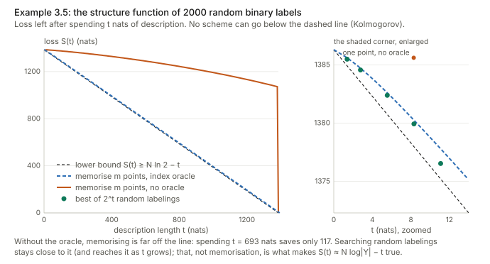
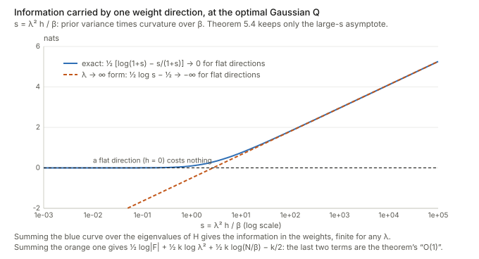
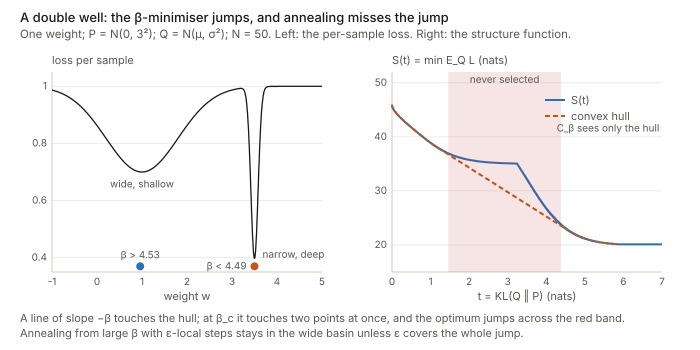
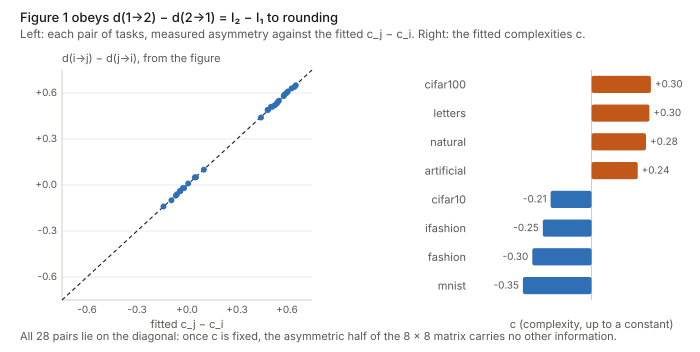
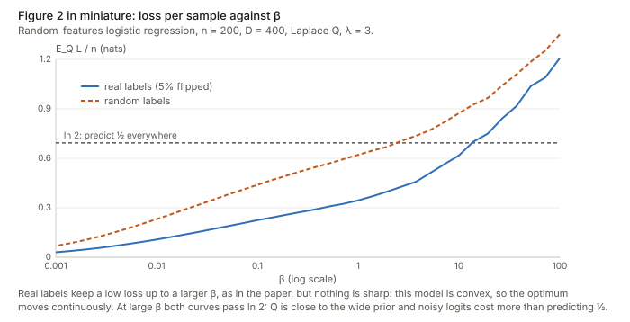

## Links

- **[arXiv:1904.03292](https://arxiv.org/abs/1904.03292)**: the preprint; v2 (July 2020) is the version read here.
  The journal version is in [Information and Inference 10(1):51–72](https://academic.oup.com/imaiai/article/10/1/51/6059450) (2021).
- **[Interactive companion](figures/interactive.html)**: six widgets. (1) The structure function of random labels,
  with the memorisation schemes and a slider for $\beta$. (2) The double-well Lagrangian: drag $\beta$ and watch the
  optimum jump, and run annealing with $\varepsilon$-local steps. (3) Information per weight direction: an
  eigenvalue spectrum with flat directions, the exact finite-$\lambda$ value against Theorem 5.4's formula.
  (4) An explorer for the paper's Figure 1 matrix: its antisymmetric part, symmetric part and residual.
  (5) The exact linear-Gaussian task distance, with sliders for the angle between tasks and the sample sizes.
  (6) The PAC-Bayes bound of Theorem 5.5 against $\beta$ and $\lambda$.
- **[Runnable checks](https://github.com/msrepo/theory_inclined_papers_with_annotations/tree/main/papers/2020-achille-task-complexity/code)**:
  `kolmogorov_toys.py` (Sections 3–4), `gaussian_information.py` (Section 5), `lagrangian_toys.py`
  (Sections 3.2, 6.1 and Figure 2), `task_distance.py` (Definition 6.1 and Figure 1). Every number in these
  notes is printed by one of them, and `--figures` rewrites the SVGs below. `make verify` runs them all.
- **[LogME](../2021-you-logme/index.html)**: at $\beta=1$ the paper's complexity, minimised over all
  post-distributions, is exactly the negative log evidence that LogME computes. See
  [below](#the-optimum-over-all-q-is-a-free-energy).
- **[Inequalities and concentration](../inequalities-and-concentration/index.html)**: the KL chain rule and the
  Donsker–Varadhan formula, both used here.
- **[Langevin dynamics](../langevin-dynamics/index.html)**: background for Section 6.2 (SGD as a local learning
  algorithm, Eq 6): the Gibbs law $e^{-U/D}$ that makes the temperature the price of information, Kramers'
  law for escaping a basin, and the path weight behind the SGD path integral.
- **[Fisher information](../fisher-information/index.html)**: background for Section 5 and "Is the Hessian N times the Fisher?": the score,
  the per-sample against total information, Hessian = Fisher + residual, and the empirical Fisher.
- **Companion papers in this collection**: [Dynamics and Reachability of Learning Tasks](../2019-achille-task-reachability/index.html)
  (the source of Eq 6, the SGD path integral) and [Where is the Information in a Deep Neural Network?](../2020-achille-information-in-weights/index.html)
  (the same Lagrangian applied to the weights and activations of one network).
- **[NCE](../2019-tran-nce-hardness/index.html)**, **[LEEP](../2020-nguyen-leep/index.html)** and
  **[H-score](../2022-bao-hscore-transferability/index.html)**: practical transferability scores from the same
  line of work, which estimate transfer without the information-theoretic machinery used here.

Achille, Paolini, Mbeng & Soatto, *The Information Complexity of Learning Tasks, their Structure and their
Distance*, Information and Inference (2021).

## In one paragraph

The paper wants a number for "how hard is this dataset" and a number for "how far is dataset $\mathcal D_2$ from
$\mathcal D_1$", where far means "how much must a model trained on $\mathcal D_1$ change to solve $\mathcal D_2$".
It starts from Kolmogorov: the complexity of a dataset is the length of the shortest two-part description,
*model* plus *labels given the model*, $C(\mathcal D)=\min_p L_{\mathcal D}(p)+K(p)$. The twist is that the model
$p(y\mid x)$ must predict each label from its own input only. That forces the model to hold the structure of the
task, not a lookup into the training set. Trading the two parts with a weight $\beta$ gives a family
$C_\beta$ (a Lagrangian of Kolmogorov's *structure function*). The distance $d_\beta(\mathcal D_1\to\mathcal D_2)$
is then the extra model complexity needed to solve both tasks, beyond what solving $\mathcal D_1$ needed.
Kolmogorov complexity cannot be computed. So Section 5 swaps $K(p)$ for the **information in the weights**,
$\mathrm{KL}(Q(w\mid\mathcal D)\,\Vert\,P(w))$, the extra code length of describing a network's weights up to a
tolerance given by a distribution $Q$. With Gaussians this becomes a log-determinant of the Fisher information
(Theorem 5.4). The same quantity is a PAC-Bayes bound (Theorem 5.5), and it is a special case of Shannon's mutual
information (Proposition 5.3). Section 6 argues that SGD with learning-rate annealing sweeps $\beta$ downwards,
and that tasks can be close yet unreachable from one another by local steps. Checked independently here:
the paper's Figure 1 obeys an identity I derive from its definition, *the asymmetry of the distance is exactly a
difference of complexities*, to within its two-decimal rounding; Theorem 5.4's "$O(1)$" hides
$\tfrac k2\log(N/\beta)-\tfrac k2$, millions of nats at network scale and not constant along Figure 2's sweep;
over all $Q$, the Lagrangian is a Bayesian free energy (the evidence at $\beta=1$); several proofs need
hypotheses they do not state ($\beta\ge1$, finite inputs, an index oracle); and the "phase transitions" of
Figure 2 cannot happen in a convex model.

## Background, from intuition up

### Kolmogorov complexity in plain words

$K(s)$ is the length, in bits, of the shortest computer program that prints the string $s$ and stops. A string
of a million zeros has tiny $K$ (the program "print 0 a million times"). A string of a million fair coin flips
has $K$ close to a million: no program much shorter than the string itself can produce it. $K(s\mid r)$ is the
same with $r$ given to the program for free.

Three facts do all the work in Sections 3–4.

- **Prefix-free programs obey Kraft's inequality.** If no program is a prefix of another (so programs can be
  concatenated and still parsed), then $\sum_s 2^{-K(s)}\le1$. Read $2^{-K(s)}$ as a probability. This is the
  bridge between "short description" and "likely".
- **Two-part codes.** To send labels $y$ you can send a model $p$ first ($K(p)$ bits), then the labels encoded with
  $p$ (arithmetic coding spends $-\log_2 p(y)$ bits, within 2 bits in total). The best total is the complexity.
- **$K$ is defined up to an additive constant** (the choice of programming language), so every statement carries
  a silent "$+O(1)$".

Units. $K$ is naturally in bits; the paper's losses are in nats (natural log). One bit is $\ln 2\approx0.693$
nats. The paper adds the two as if they were the same unit, and the claims about "$\beta=1$" only make sense if
$K$ is measured in nats. I do that throughout.

### KL divergence and the Gaussian formula

$\mathrm{KL}(Q\Vert P)=\mathbb E_{w\sim Q}[\log Q(w)-\log P(w)]$ is the average extra code length paid for
coding samples of $Q$ with a code built for $P$. It is zero only when $Q=P$. For the Gaussians of Theorem 5.4,
$Q=\mathcal N(\mu,\Sigma)$ and $P=\mathcal N(0,\lambda^2I_k)$,

$$
\mathrm{KL}(Q\Vert P)=\frac12\Big[\underbrace{\frac{\lVert\mu\rVert^2}{\lambda^2}}_{\text{mean pulled away from }0}
+\underbrace{\frac{\operatorname{tr}\Sigma}{\lambda^2}-k-\log\frac{\lvert\Sigma\rvert}{\lambda^{2k}}}_{\text{spread of }Q\text{ against spread of }P}\Big].
$$

The second group is zero when $\Sigma=\lambda^2 I$ and grows as $Q$ becomes narrower than $P$: pinning a weight
down to a precision $\sigma$ when the prior allowed $\lambda$ costs about $\log(\lambda/\sigma)$ nats. That is the
sense in which a precisely-set weight "contains information".

### Fisher information and curvature

For a model $p_w(y\mid x)$ the Fisher information $F=\mathbb E\big[\nabla_w\log p_w\,\nabla_w\log p_w^{\top}\big]$
measures how sharply the likelihood reacts to a change of $w$. At a well-fitted minimum of the training loss it
is close to (but, see [below](#is-the-hessian-n-times-the-fisher), not always equal to) the Hessian of the loss
per sample. High curvature along a direction means that direction must be stored precisely.

## The spine of the argument

1. **Complexity** (Def 3.1). $C(\mathcal D)=\min_p L_{\mathcal D}(p)+K(p)$ over *factorised* models
   $p(y\mid x)=\prod_i p(y_i\mid x_i)$. The factorisation is what makes it measure the task and not the file
   (Prop 3.2).
2. **Asymptotics** (Prop 3.3). On i.i.d. data, $C(\mathcal D)\approx N\,H(y\mid x)+K(p_{\rm true})$: noise plus
   structure.
3. **Structure function and Lagrangian** (Eqs 3–4). $S_{\mathcal D}(t)=\min_{K(p)\le t}L_{\mathcal D}(p)$ and
   $C_\beta=\min_p L+\beta K$. Random labels give the worst trade, one nat for one nat.
4. **Distance** (Def 4.1, Cor 4.5). $d_\beta(\mathcal D_1\to\mathcal D_2)=K(p_{12})-K(p_1)$: the extra complexity
   of solving $\mathcal D_1\sqcup\mathcal D_2$.
5. **Computable version** (Def 5.1). Replace $K(p)$ by $\mathrm{KL}(Q(w\mid\mathcal D)\Vert P(w))$. With the
   universal prior it is $K(w)$ (Prop 5.2), with the best prior it is $I(w;\mathcal D)$ (Prop 5.3), with Gaussians
   it is $\tfrac12\log\lvert F\rvert+\dots$ (Thm 5.4).
6. **Generalisation** (Thm 5.5). $C_\beta(\mathcal D;P,Q)/N$ bounds the test error (PAC-Bayes).
7. **Dynamics** (Section 6). A generalised distance (Def 6.1), local learning with annealing (Defs 6.2–6.3,
   Prop 6.4), and the claim that SGD approximately minimises $C_\beta$ with $\beta\propto$ learning rate (Eq 6).

## Setup and notation

| Symbol | Meaning |
|---|---|
| $\mathcal D=\{(x_i,y_i)\}_{i=1}^N$ | a dataset: the task *is* the dataset, no data distribution is assumed |
| $p(y\mid x)$ | a candidate model; in Section 3, any computable conditional distribution |
| $L_{\mathcal D}(p)=\sum_i-\log p(y_i\mid x_i)$ | cross-entropy loss, **summed** (not averaged) over the $N$ samples, in nats |
| $K(p)$, $K(p\mid q)$ | Kolmogorov complexity of (a program computing) $p$, unconditional and given $q$ |
| $C(\mathcal D)$, $C_\beta(\mathcal D)$ | complexity (Def 3.1) and its $\beta$-weighted version (Eq 4) |
| $S_{\mathcal D}(t)$ | structure function: the best loss reachable with complexity at most $t$ |
| $\beta$ | weight on complexity; $\beta=1$ is Kolmogorov's minimal sufficient statistic |
| $\mathcal D_1\sqcup\mathcal D_2$ | disjoint union: every input tagged with the index $i\in\{1,2\}$ of its dataset |
| $d_\beta(\mathcal D_1\to\mathcal D_2)$ | asymmetric task distance (Def 4.1; Def 6.1 for the computable version) |
| $P(w)$, $Q(w\mid\mathcal D)$ | "pre-" and "post-distribution" over weights (prior-like and posterior-like, deliberately not called so) |
| $C_\beta(\mathcal D;P,Q)$ | $\mathbb E_{w\sim Q}L_{\mathcal D}(p_w)+\beta\,\mathrm{KL}(Q\Vert P)$ (Def 5.1) |
| $k$, $w^*$, $H$, $F$ | number of weights, a minimum of $L_{\mathcal D}$, the Hessian there, $F=H/N$ |
| $\lambda$ | standard deviation of the isotropic Gaussian pre-distribution $P=\mathcal N(0,\lambda^2 I)$ |
| $s_j=\lambda^2h_j/\beta$ | (mine) the $j$-th Hessian eigenvalue in units of prior variance over $\beta$ |
| $g(s)=\log(1+s)-\frac{s}{1+s}$ | (mine) information carried by one weight direction at the optimum |
| $I_{\mathcal D}$ | (mine) information in the weights of a $\beta$-minimal sufficient $Q$ for $\mathcal D$ |

## Section 3: the complexity of a task

### Definition 3.1 and why the factorisation matters

$$
C(\mathcal D)=\min_{p(y\mid x)}\ \underbrace{\textstyle\sum_{i=1}^N-\log p(y_i\mid x_i)}_{L_{\mathcal D}(p):\ \text{labels given the model}}\ +\ \underbrace{K(p)}_{\text{the model}}.
$$

Compare with the ordinary two-part code for the label *string* $\mathbf y=\langle y_1,\dots,y_N\rangle$ given the
input string $\mathbf x$ (Eq 2), $C_K(\mathcal D)=\min_p-\log p(\mathbf y\mid\mathbf x)+K(p)$. The difference is
what the model may look at. In Eq 2, $p(\mathbf y\mid\mathbf x)$ sees the whole training set at once. It can sort
it, count it, or read a program hidden in one of the inputs. In Eq 1, $p(y_i\mid x_i)$ sees one input at a time.
So everything the model knows about the task has to be inside $p$.

**Proposition 3.2**, part by part, with the proofs of Appendix A filled in.

1. *$K(\mathbf y\mid\mathbf x)=C_K(\mathcal D)$.* ($\le$) A program that knows $\mathbf x$ can print $\mathbf y$ from
   the description of $p$ followed by the arithmetic code of $\mathbf y$ under $p(\cdot\mid\mathbf x)$: that is
   $K(p)+L+O(1)$ bits. ($\ge$) Take the program $h$ that witnesses $K(\mathbf y\mid\mathbf x)$ and let $p_h$ put
   probability one on $h(\mathbf x)$. Its loss is zero and $K(p_h)=\lvert h\rvert$. The appendix concludes the first
   half with "$K(\mathbf y\mid\mathbf x)\le C(\mathcal D)$". It means $C_K(\mathcal D)$: that is the quantity the
   code just built achieves.
2. *$C_K(\pi(\mathcal D))\le C(\mathcal D)$ for every permutation $\pi$.* Factorised models are a subset of all models,
   and $C$ does not depend on the order of the data.
3. *$C$ can be large while every $C_K(\pi(\mathcal D))$ is $O(1)$.* The construction is worth reading slowly. Pick a
   function $f$ with $K(f)\ge C$ and a program $h$ for it. Make the inputs $x_i=\langle0,i\rangle$ for $i<N$ and
   hide $h$ itself in the last input, $x_N=\langle1,h\rangle$. Given all inputs at once, a constant-size program finds
   the input starting with 1, reads $h$ and applies it, so $C_K=O(1)$ in any order. A factorised model sees one
   input at a time, so it must carry $f$ itself, and $C(\mathcal D)\ge C(\mathcal D')=K(f)$ where $\mathcal D'$ drops
   the special point. (Dropping a point cannot increase $C$, since every term of $L$ is non-negative.)
4. *$C\le C_{\rm det}$, with equality given an oracle numbering the inputs.* The inequality is immediate: a function
   that fits every label is a model with zero loss. For the equality the appendix builds a table $A$ of per-point
   prefix codes of length $\lceil-\log p(y_i\mid x_i)\rceil+1$. That costs up to two extra bits *per point*, so the
   construction proves $C_{\rm det}\le C+O(N)$, not $+O(1)$. Coding the whole label list jointly, in the oracle's
   order, with one arithmetic code under $p$ removes the per-point rounding and gives the stated $+O(1)$.

### Proposition 3.3: noise plus structure

If the $y_i$ are drawn from a computable $p(y\mid x)$, then

$$
N\,H_p(y\mid x)\ \le\ \mathbb E\,C(\mathcal D)\ \le\ N\,H_p(y\mid x)+K(p),
$$

and for large $N$, with high probability, $C(\mathcal D)=N\,H_p(y\mid x)+K(p)$ with $p$ the unique minimiser.
Read it as: the total description is the unavoidable noise in the labels, $N$ times the conditional entropy, plus
the structure, the length of the true rule. The lower bound is Shannon: no prefix code beats the entropy on
average. The upper bound uses $p$ itself as the model.

**The proof of part 2 needs a finite input space, and says so nowhere.** It rests on Lemma A.1:
$\lvert L_{\mathcal D}(p)-L_{\mathcal D}(\hat p)\rvert<c$ with high probability, where $\hat p$ is the maximum
likelihood estimate (the empirical label frequencies at each input value). That lemma is Wilks' theorem.
With finitely many input values,
$2(L_{\mathcal D}(p)-L_{\mathcal D}(\hat p))$ converges to a $\chi^2$ with $\lvert\mathcal X\rvert(\lvert\mathcal Y\rvert-1)$
degrees of freedom. So the gap stays bounded, with mean $\lvert\mathcal X\rvert(\lvert\mathcal Y\rvert-1)/2$. In
`kolmogorov_toys.py` with $\lvert\mathcal X\rvert=20$, $\lvert\mathcal Y\rvert=3$ the predicted mean is 20. The measured
means are 20.19, 20.15 and 20.43 at $N=600,2400,9600$ (sd 4.3 to 4.9), flat in $N$ as the lemma says. But when every
input is different, as with images, $\hat p$ memorises and $L_{\mathcal D}(\hat p)=0$. The gap is then all of
$L_{\mathcal D}(p)\approx N H$: 527, 2108 and 8432 nats at the same $N$. (The appendix's Taylor step also writes the
remainder as $(p^*-\hat p)^\top\nabla^2L(\hat p)(p^*-\hat p)$. The mean-value form is
$\tfrac12(p-\hat p)^\top\nabla^2L(p^*)(p-\hat p)$, but nothing downstream depends on this.)

**A proof that needs no finite $\mathcal X$.** Work in bits. Fix any competitor $p'$ and look at the likelihood ratio
$R=\prod_i p'(y_i\mid x_i)/p(y_i\mid x_i)$. Averaging over labels drawn from $p$, each factor has mean
$\sum_y p'(y\mid x_i)=1$, so $\mathbb E R=1$ whatever the inputs are. Markov's inequality gives
$\Pr(R\ge2^a)\le2^{-a}$. Now $L(p')+K(p')\le L(p)+K(p)$ is the same event as $\log_2R\ge K(p')-K(p)$, which has
probability at most $2^{K(p)-K(p')}$. Split the competitors in two groups.

- *Complex competitors*, $K(p')>K(p)+c_0$. By the union bound and Kraft's inequality, the chance that any of them
  wins is at most $2^{K(p)}\sum_{K(p')>K(p)+c_0}2^{-K(p')}$. The sum is the tail of a convergent series. So for
  fixed $p$ a large enough $c_0$ makes this below $\varepsilon/2$, for every $N$ and every choice of inputs.
- *Simple competitors*, $K(p')\le K(p)+c_0$. There are finitely many. Each one that differs from $p$ on a set of
  inputs of positive probability loses $L(p')-L(p)\approx N\,\mathbb E_x\mathrm{KL}(p\Vert p')\to\infty$, by the law
  of large numbers. So beyond some $N_0$ none of them wins either.

Together these give part 2 with no assumption on $\mathcal X$. Two small caveats: uniqueness holds only up to
models that agree with $p$ almost everywhere, and $K$ must be the prefix complexity for Kraft to apply. The script
simulates the first bullet on $2^{10}$ random-labeling "memorisers" times 8 confidence levels, all at 13 bits. The
chance that any of them beats the truth by $c=0,1,2,3,4$ bits is 0.0095, 0.0037, 0.0020, 0.0018, 0.0008, well
inside the bound $2^{-c}$.

### Random labels and the structure function (Examples 3.4–3.5)

With labels drawn uniformly from $\mathcal Y$, no input carries information, so $H(y\mid x)=\log\lvert\mathcal Y\rvert$
and $C(\mathcal D)\approx N\log\lvert\mathcal Y\rvert$. That is maximal: the constant model already achieves it.
The paper's point is that this is a *hard memorisation* task and a *trivial learning* task, and $C$ alone cannot
tell the two apart. The structure function can:

$$
S_{\mathcal D}(t)=\min_{K(p)\le t}L_{\mathcal D}(p).
$$

It is the best loss you can reach on a complexity budget $t$. For a structured task it falls quickly (a few bits
buy a good rule), then turns into a line of slope $-1$ once only memorisation is left. For random labels it is that
line from the start. The lower bound is immediate: $L+K\ge C\approx N\log\lvert\mathcal Y\rvert$ for every $p$, so
$S(t)\gtrsim N\log\lvert\mathcal Y\rvert-t$.

**The mechanism the paper gives for reaching the line only works with the oracle.** Example 3.5 says to memorise
$\lfloor t/\log\lvert\mathcal Y\rvert\rfloor$ points. But a model that predicts one input at a time must also recognise
*which* inputs it memorised. With the index oracle of Prop 3.2.4 it can take the first $m$, which costs about
$\log m$ bits. Without it, naming $m$ of the $N$ inputs costs at least $\log_2\binom Nm$ bits. The script works this
out for $N=2000$ binary labels. The saving per nat spent is 0.102 at $m=10$, 0.150 at $m=100$ and 0.334 at $m=1000$,
nowhere near 1. Spending half the budget, $t=693$ nats, saves only 117.

**The line is still reached, by a different scheme: search.** Try $2^t$ random labelings $g_1,\dots,g_{2^t}$ of the
inputs, keep the one that agrees with the labels most often (a fraction $q$), and predict "the label is $g(x)$ with
probability $q$". Describing the choice costs $t$ bits (plus $O(\log N)$ for $q$). Each agreement count is
Binomial$(N,\tfrac12)$, and the best of $2^t$ of them reaches the $q$ where
$2^t\,e^{-N\,\mathrm{KL}(q\Vert\frac12)}\approx1$, i.e. $N\,\mathrm{KL}(q\Vert\tfrac12)=t\ln2$. The saving of the
tilted predictor is $N\ln2-N H(q)=N\,\mathrm{KL}(q\Vert\tfrac12)$, which is exactly $t\ln 2$ nats. That is one nat
per nat, the slope $-1$. Simulated, the ratio of saving to cost is 0.589, 0.629, 0.706, 0.766, 0.880 for
$t=2,4,8,12,16$ bits, climbing towards 1 as the large-deviation limit takes over. So Example 3.5's conclusion is
right, and its stated reason is not.

<figure><figcaption><b>Example 3.5, three ways.</b> Memorising points reaches the slope $-1$ only when an oracle names the inputs (blue). Without it (orange), naming the memorised points eats most of the budget. The best of $2^t$ random labelings (green) reaches the line through the large-deviation argument. Widget 1 of the <a href="figures/interactive.html#sf">interactive page</a> varies $N$ and $\lvert\mathcal Y\rvert$.</figcaption></figure>

### Section 3.2: the Lagrangian sees only the convex hull

$C_\beta(\mathcal D)=\min_pL_{\mathcal D}(p)+\beta K(p)$ is minimised in two stages: first the best loss at each
complexity $t$, then the best $t$:

$$
C_\beta=\min_t\big[S_{\mathcal D}(t)+\beta t\big].
$$

Geometrically, slide a line of slope $-\beta$ up from below until it touches the graph of $S$. The paper calls
$C_\beta$ "the Legendre transform of $S$". More precisely it is minus the Legendre–Fenchel conjugate evaluated at
$-\beta$, and it only sees the **lower convex hull** of $S$. That has a consequence the paper does not draw out.
Where $S$ bulges above its hull, no $\beta$ ever selects those complexities. As $\beta$ decreases through the
slope of the hull's flat piece, the minimiser jumps across the gap. This is the mechanism behind the "sharp phase
transitions" of Figure 2 (next sections). It also means that, whenever $S$ is convex, the minimiser moves continuously.

For random labels at slope exactly $-1$ the trade is flat. For $\beta<1$ memorising everything is optimal, for
$\beta>1$ the constant model is. At $N=2000$ binary labels, $C_\beta$ at $t=0$ is 1386.3 nats against 693.1 at full
memorisation for $\beta=\tfrac12$, a tie at $\beta=1$, and 2772.6 at $\beta=2$.

**Proposition 3.6** ($\beta^*\ge1$, with equality for random labels) has no proof in the appendix. The random-label
half follows from the tie above, but only up to the $O(1)$ terms that decide a tie. The general half, "some
non-constant model wins at $\beta=1$ for every dataset", is not obvious. On a typical random-label dataset
the constant model and the best non-constant one are within $O(1)$ of each other at $\beta=1$. So the
statement is decided by exactly the constants the framework ignores.

**Kolmogorov minimal sufficiency** (Definition 3.8 at $\beta=1$). A minimiser of $C(\mathcal D)$ is a sufficient
statistic; the one with the smallest $K$ is minimal. For random labels both the memoriser and the uniform model are
sufficient, and only the uniform one is minimal (Example 3.7). This is the formal version of "there is nothing to
learn".

## Section 4: the asymmetric distance

### Definition 4.1 and Lemma 4.2

$$
d_\beta(\mathcal D_1\to\mathcal D_2)=\max_{p_1}\min_{p_2}K(p_2\mid p_1),
$$

with $p_i$ ranging over the $\beta$-minimal sufficient statistics of $\mathcal D_i$. Read it as "however you solved
$\mathcal D_1$ (the max), how few extra bits get you to some solution of $\mathcal D_2$ (the min)". The definition
also writes this as $K(\langle p_1,p_2\rangle)-K(p_1)$. That equality is the symmetry of information, which for prefix
complexity holds only up to $O(\log K)$ terms (or exactly if $K(p_1)$ is given as well). It is harmless here, but the
"$=$" is not exact.

Lemma 4.2's proofs are short and correct. Positivity is by definition. $d(\mathcal D\to\mathcal D)\le K(p\mid p)=O(1)$.
For the triangle inequality, pick any $\bar p_1$, then the best $\bar p_2$ for it, then the best $\bar p_3$ for
that. The step $K(\bar p_3\mid\bar p_1)\le K(\bar p_2\mid\bar p_1)+K(\bar p_3\mid\bar p_2)+O(1)$ is "run one program
after the other", valid for prefix complexity. Each term is at most the corresponding distance.

### The disjoint union, Theorem 4.4 and Corollary 4.5

$\mathcal D_1\sqcup\mathcal D_2$ tags every input with the index of its dataset. Without the tag, a subset can be
*more* complex than the whole. Example 4.3 takes the points of a random-label set that happen to satisfy a complex
property: the whole is trivial, and the subset has structure. With the tag, a solution of the union contains a
solution of each part at $O(1)$ cost ("fix $i=1$").

Theorem 4.4 says $d_\beta(\mathcal D_1\sqcup\mathcal D_2\to\mathcal D_1)=O(1)$ for large sampled datasets. Corollary
4.5 turns the distance into a difference of complexities:

$$
d_\beta(\mathcal D_1\to\mathcal D_2)=K(p_{12})-K(p_1)+O(1).
$$

(The corollary's statement says "$p_{12}$ varies among those of $\mathcal D_1$"; it means $p_1$.)

**The proof of Theorem 4.4 needs $\beta\ge1$ when labels are noisy.** It invokes Proposition 3.3 to say the
$\beta$-minimal sufficient statistics are the true $p_1$, $p_{12}$. But Proposition 3.3 is about $C=C_1$, i.e.
$\beta=1$. For $\beta>1$ the same Markov–Kraft argument goes through (the sum $\sum2^{-\beta K}$ is even smaller). For
$\beta<1$ it fails, and the previous subsection shows why: memorising noise trades one nat of complexity for one nat
of loss, which is a bargain at $\beta<1$. The $\beta$-minimal statistic then memorises the noise and is not
$p_{\rm true}$. The theorem holds for all $\beta$ only on noiseless labels.

### A consequence the paper does not state: the asymmetry *is* the complexity difference

When the $\beta$-minimal sufficient statistics are unique, the max and min disappear and Corollary 4.5 (or
Definition 6.1 later) reads $d(1\to2)=I_{12}-I_1$ and $d(2\to1)=I_{12}-I_2$, where $I$ is the complexity (or the
information in the weights) of the optimal solution. Subtract:

$$
\boxed{\,d(1\to2)-d(2\to1)=I_2-I_1\,}\qquad\qquad d(1\to2)+d(2\to1)=2I_{12}-I_1-I_2 .
$$

So "it is easier to go from complex to simple than back" is not an empirical finding. It is built in: the
antisymmetric half of the distance matrix is a difference of one number per task. Everything else about similarity
lives in the symmetric half. [Figure 1 satisfies this to its rounding](#figure-1-the-identity-holds-to-two-decimals).

## Section 5: information in the parameters

### Definition 5.1 in words

$$
C_\beta(\mathcal D;P,Q)=\underbrace{\mathbb E_{w\sim Q(w\mid\mathcal D)}\big[L_{\mathcal D}(p_w)\big]}_{\text{loss of weights drawn from }Q}+\beta\underbrace{\mathrm{KL}\big(Q(w\mid\mathcal D)\Vert P(w)\big)}_{\text{information in the weights}}.
$$

Instead of storing the trained weights exactly, store them only up to a tolerance described by $Q$. A wide $Q$ is
cheap to describe relative to $P$ but its random draws do worse on the data. At $\beta=1$ this is Hinton and van
Camp's bits-back code length: the number of nats needed to send the labels, given the inputs and $P$. The paper
insists this is not Bayesian: $Q$ is any distribution you choose.

### The optimum over all Q is a free energy

The Bayesian reading comes back once you minimise over $Q$. Define the tilted distribution
$Q_\beta(w)=P(w)\,e^{-L_{\mathcal D}(w)/\beta}/Z_\beta$ with $Z_\beta=\mathbb E_P\,e^{-L_{\mathcal D}/\beta}$. Expanding
the definition of KL,

$$
\beta\,\mathrm{KL}(Q\Vert Q_\beta)=\beta\,\mathbb E_Q\Big[\log\frac QP+\frac{L_{\mathcal D}}\beta+\log Z_\beta\Big]
=C_\beta(\mathcal D;P,Q)+\beta\log Z_\beta .
$$

KL is non-negative, so for every $Q$

$$
C_\beta(\mathcal D;P,Q)\ \ge\ -\beta\log\mathbb E_{P}\,e^{-L_{\mathcal D}(w)/\beta},
$$

with equality exactly at $Q=Q_\beta$. This is the Gibbs variational principle (Donsker–Varadhan read backwards). At
$\beta=1$, $e^{-L_{\mathcal D}(w)}=\prod_ip_w(y_i\mid x_i)$ is the likelihood, $Q_1$ is the Bayesian posterior, and the
minimum is $-\log p(\mathbf y\mid\mathbf x)$, the negative log **evidence**. For $\beta\ne1$ it is the evidence of the
tempered likelihood $p_w^{1/\beta}$, scaled by $\beta$. So "the complexity of a task at level $\beta=1$, with the best
post-distribution" is the quantity [LogME](../2021-you-logme/index.html) computes for a linear head. Checked in
`gaussian_information.py`: for linear-Gaussian regression the best Gaussian $Q$ attains the bound exactly, 35.222042,
42.424554 and 55.103247 at $\beta=0.5,1,2$, and at $\beta=1$ this equals the directly computed $-\log$ evidence.
For one-weight logistic regression Gaussians cannot match $Q_\beta$. The best Gaussian is above the free energy by
0.0073, 0.0248 and 0.0730 nats, which is $\beta\,\mathrm{KL}(Q\Vert Q_\beta)$.

### Proposition 5.2: the universal prior

With $P(w)=e^{-K(w)}/Z$ and $Q=\delta_{w^*}$, $\mathrm{KL}(\delta_{w^*}\Vert P)=-\log P(w^*)=K(w^*)+\log Z$. This
only makes sense on a countable set of weights (finite-precision numbers). Against any continuous $P$, such as the
Gaussian of Theorem 5.4, a point mass has infinite KL, which is why the practical version needs $Q$ to have a
covariance.

### Proposition 5.3: the best pre-distribution gives Shannon's mutual information

If datasets are drawn from $\pi(\mathcal D)$ and training maps each to $Q(w\mid\mathcal D)$, which $P$ minimises the
average information? Write $\bar Q(w)=\mathbb E_{\mathcal D}Q(w\mid\mathcal D)$ for the weights' marginal. Split the
log inside the KL: $\log\frac{Q}{P}=\log\frac{Q}{\bar Q}+\log\frac{\bar Q}{P}$. The first piece averages to
$\mathbb E_{\mathcal D}\mathrm{KL}(Q\Vert\bar Q)$. In the second, averaging $Q(w\mid\mathcal D)$ over $\mathcal D$ gives
$\bar Q$, so it becomes $\mathrm{KL}(\bar Q\Vert P)$:

$$
\mathbb E_{\mathcal D}\mathrm{KL}(Q(w\mid\mathcal D)\Vert P)=\underbrace{\mathbb E_{\mathcal D}\mathrm{KL}(Q(w\mid\mathcal D)\Vert\bar Q)}_{=\,I(w;\mathcal D)}+\mathrm{KL}(\bar Q\Vert P).
$$

The second term is zero only for $P=\bar Q$. (The appendix puts an extra $\mathbb E_{\mathcal D}$ in front of it,
which is harmless because it does not depend on $\mathcal D$.) On a discrete toy with 4 datasets and 6 weight values
the script gets $\mathbb E\mathrm{KL}(Q\Vert\bar Q)=0.149604$ and $I(w;\mathcal D)=0.149604$ from the joint
distribution. Three other $P$ each pay exactly $I+\mathrm{KL}(\bar Q\Vert P)$.

### Theorem 5.4, line by line, and what its limit throws away

Take $P=\mathcal N(0,\lambda^2I_k)$, $Q=\mathcal N(w^*,\Sigma)$ with $w^*$ a minimum of the loss, and $H$ the Hessian
there. Four steps.

1. *The loss term.* Expand $L$ to second order at $w^*$, where the gradient vanishes:
   $L(w)\approx L(w^*)+\tfrac12(w-w^*)^\top H(w-w^*)$. Averaging over $w\sim Q$ gives
   $\mathbb E_QL=L(w^*)+\tfrac12\operatorname{tr}(H\Sigma)$, since $\mathbb E[(w-w^*)(w-w^*)^\top]=\Sigma$.
2. *The objective in $\Sigma$.* Adding $\beta$ times the Gaussian KL,
   $C_\beta=L(w^*)+\tfrac12\operatorname{tr}(H\Sigma)+\tfrac\beta2\big[\lVert w^*\rVert^2/\lambda^2+\operatorname{tr}\Sigma/\lambda^2+k\log\lambda^2-\log\lvert\Sigma\rvert-k\big]$.
3. *Differentiate.* With $\partial_\Sigma\operatorname{tr}(A\Sigma)=A$ and $\partial_\Sigma\log\lvert\Sigma\rvert=\Sigma^{-1}$,
   the gradient is $\tfrac12\big[H+\tfrac\beta{\lambda^2}I-\beta\Sigma^{-1}\big]$. Setting it to zero:
   $$\Sigma^*=\beta\Big(H+\frac{\beta}{\lambda^2}I\Big)^{-1}.$$
   Directions of high curvature get small variance (they must be stored precisely), flat ones get the prior's
   variance $\lambda^2$. The script confirms it is a minimum: 2000 random perturbations of $\Sigma^*$ all raise the
   objective (the smallest rise is $6.0\times10^{-5}$). The KL formula matches a Monte Carlo estimate
   (13.7962 against 13.7989).
4. *The limit.* As $\lambda\to\infty$, $\Sigma^*\to\beta H^{-1}=\tfrac\beta NF^{-1}$, and the theorem states
   $\mathrm{KL}=\tfrac12\log\lvert F\rvert+\tfrac k2\log\lambda^2+O(1)$.

**Keep $\lambda$ finite and everything is explicit.** In the eigenbasis of $H$ (eigenvalues $h_j$), put
$s_j=\lambda^2h_j/\beta$. Then $\Sigma^*$ has eigenvalues $\lambda^2/(1+s_j)$. Substituting,
$\tfrac12\operatorname{tr}(H\Sigma^*)=\tfrac\beta2\sum_j\frac{s_j}{1+s_j}$ and
$\tfrac{\operatorname{tr}\Sigma^*}{\lambda^2}-k-\log\frac{\lvert\Sigma^*\rvert}{\lambda^{2k}}=\sum_j\big[\log(1+s_j)-\frac{s_j}{1+s_j}\big]$. Therefore

$$
\mathrm{KL}(Q^*\Vert P)=\frac{\lVert w^*\rVert^2}{2\lambda^2}+\frac12\sum_{j=1}^k g(s_j),\qquad g(s)=\log(1+s)-\frac{s}{1+s},
$$

$$
C_\beta^*=L(w^*)+\frac{\beta\lVert w^*\rVert^2}{2\lambda^2}+\frac\beta2\log\det\Big(I+\frac{\lambda^2}{\beta}H\Big).
$$

The second line is the familiar Laplace-approximation "Occam factor". When $L$ is quadratic and $w^*$ is replaced by
the minimiser of $L+\beta\lVert w\rVert^2/2\lambda^2$, it is exactly the free energy above. Three things the theorem's form hides are now visible.

- **Flat directions carry zero information.** $g(0)=0$, and $g(s)\approx s^2/2$ for small $s$. Over-parameterised
  networks have many (near-)zero Hessian eigenvalues. For them $\tfrac12\log\lvert F\rvert=-\infty$, while the
  finite-$\lambda$ information is finite and simply ignores those directions. In the script, with eigenvalues of
  $F$ equal to $2,0.3,0.004,0$ and $\lambda=1$, the four directions carry 3.301, 2.355, 0.405 and 0.000 nats.
- **The "$O(1)$" is $\tfrac k2\log(N/\beta)-\tfrac k2$.** For large $s$, $\tfrac12g(s)=\tfrac12\log s-\tfrac12+o(1)$.
  Summing, and using $\log\lvert H\rvert=k\log N+\log\lvert F\rvert$, gives the theorem's two terms plus
  $\tfrac k2\log(N/\beta)-\tfrac k2$. The script's remainder converges to exactly this (9.9014 for $k=3$, $N=1000$,
  $\beta=0.5$). It is constant in $\lambda$, but it is not small. For an AllCNN-sized network ($k\approx1.4$ million,
  $N=50{,}000$) it is $6.9\times10^6$ nats at $\beta=1$. It also moves: sweeping $\beta$ from 1 to $10^{-3}$, as
  Figure 2 does, adds $\tfrac k2\log1000=4.8\times10^6$ nats with the Hessian unchanged. That is about the whole
  horizontal range of Figure 2 (left). Doubling $N$ adds $4.9\times10^5$.
- **Trace versus log-determinant.** Figure 4 (from Task2Vec) plots the *trace* of the Fisher against test error and
  calls it the complexity that "emerges when using an uninformative prior". The theorem gives a log-determinant for
  large $s$ and a sum of squares for small $s$. The trace appears in neither regime.

<figure><figcaption><b>Information per weight direction.</b> Blue: the exact value at the optimal Gaussian $Q$, finite for every $\lambda$, zero for flat directions. Orange: the $\lambda\to\infty$ form behind Theorem 5.4. Widget 3 of the <a href="figures/interactive.html#dir">interactive page</a> sums both over an eigenvalue spectrum you can edit.</figcaption></figure>

### Is the Hessian N times the Fisher?

The proof ends with "the Hessian of the cross-entropy coincides with the Fisher information matrix at $w^*$,
because $w^*$ is a critical point". For a model with logit $z_w(x)$, differentiate the loss twice:

$$
\nabla^2L=\underbrace{\sum_ip_i(1-p_i)\nabla z_i\nabla z_i^\top}_{\text{Fisher (Gauss–Newton)}}+\underbrace{\sum_i(p_i-y_i)\nabla^2z_i}_{\text{residual term}} .
$$

A critical point makes $\sum_i(p_i-y_i)\nabla z_i=0$, the gradient. It does not make the residual term zero. That
term vanishes when the logits are linear in $w$ (logistic regression: then $H$ equals the Fisher at *every* $w$, and
the script confirms this to $1.5\times10^{-5}$). It also vanishes in expectation when the labels are drawn from the
model itself, which is Martens' actual statement. For a two-parameter model $z=a\tanh(bx)$ at its minimum
($n=400$), the script finds:

- when the model is well specified, the eigenvalues are $5.26,55.68$ for the Hessian against $5.34,55.90$ for the
  Fisher;
- when it is misspecified, $9.01,37.96$ against $4.48,36.98$. The relative difference is 0.148, and half the log-det
  differs by 0.362 nats.

The error sits in the low-curvature direction, which is the one that matters most for a log-determinant.

### Section 5.2: the PAC-Bayes reading (Theorem 5.5)

McAllester's bound, as quoted: for $\beta>\tfrac12$, a loss per sample in $[0,1]$, and any $P$ fixed before seeing
the data, with probability $1-\delta$,

$$
L_{\rm test}(Q)\le\frac{1}{1-\frac1{2\beta}}\cdot\frac1N\Big[C_\beta(\mathcal D;P,Q)+\beta\log\tfrac1\delta\Big].
$$

So minimising $C_\beta$ minimises a test-error bound. Three remarks.

- The statement defines $L_{\rm test}(Q)=\mathbb E_{x,y}\mathbb E_{w\sim Q}[p_w(y\mid x)]$. That is the *probability of
  the correct label*, the opposite of an error. It should be a loss, e.g. $-\log p_w$ clipped to $[0,1]$, or the 0–1
  error.
- **The condition $\beta>\tfrac12$ is for a loss in $[0,1]$.** Rescaling a loss bounded by $L_{\max}$ turns it into
  $\beta>L_{\max}/2$: 1.15 for cross-entropy clipped at $\ln10$, 2.30 at $\ln100$. In Figure 2 (right) every
  transition except MNIST's happens at $\beta$ between about 0.05 and 0.5, and all of them below 1.15. There the
  theorem says nothing.
- **The bound diverges in the limit Theorem 5.4 is stated in.** $\mathrm{KL}(Q^*\Vert P)$ grows like
  $\tfrac12\log\lambda^2$ per curved direction. For logistic regression ($d=10$, $n=500$, $\beta=1$, $\delta=0.05$,
  Laplace $Q$) the script gets:

| $\lambda$ | KL | train Gibbs error | test Gibbs error | bound |
|---|---|---|---|---|
| 0.3 | 30.44 | 0.147 | 0.180 | 0.427 |
| 1 | 19.46 | 0.144 | 0.177 | 0.378 |
| 10 | 36.72 | 0.143 | 0.176 | 0.446 |
| $10^4$ | 105.73 | 0.144 | 0.176 | 0.723 |
| $10^8$ | 197.83 | 0.143 | 0.176 | 1.090 |

  The "uninformative" prior that produces the Fisher formula makes the bound vacuous. The two readings of Section 5
  pull $\lambda$ in opposite directions.

## Section 6: the generalised distance, reachability and SGD

### Definition 6.1 and the identity again

With the model class fixed, $d_\beta(\mathcal D_1\to\mathcal D_2)=\max_{Q_1}\min_{Q_{12}}\mathrm{KL}(Q_{12}\Vert P)-\mathrm{KL}(Q_1\Vert P)$,
where $Q_{12}$ and $Q_1$ are $\beta$-minimal sufficient for $\mathcal D_1\sqcup\mathcal D_2$ and $\mathcal D_1$. The paper
admits this loses some of Lemma 4.2's properties. It is worth seeing which ones, and by how much, in a case that can
be solved exactly.

**An exact instance.** Take linear-Gaussian regression with $k=10$ inputs and three weight blocks: a shared one, one
for task 1 and one for task 2. Task $i$ predicts $x\cdot(w_s+w_i)$, and the index in $\mathcal D_1\sqcup\mathcal D_2$
selects the block. $P=\mathcal N(0,3^2I)$, $\beta=1$, noise variance 1, $N=100$ per task, and the population design
$X^\top X=NI$. The optimal $Q$ is the posterior, and the closed form above gives every information. `task_distance.py`
finds:

- Rotating task 2's true weight vector away from task 1's by $0^\circ,30^\circ,60^\circ,90^\circ,180^\circ$ gives
  $d=31.0578,31.0628,31.0763,31.0947,31.1317$ nats. The distance does grow with dissimilarity, but by 0.07 nats on
  top of 31.
- **A task is 31.058 nats away from an exact copy of itself.** Lemma 4.2's $d(\mathcal D\to\mathcal D)=O(1)$ fails, and
  not by a constant: it is 54.075 at $N=10{,}000$ and 310.495 with $k=100$. The union switches on a new block of $k$
  curved directions, and each costs about $\tfrac12\log N$.
- A copy with more samples is further away: 31.058, 37.984 and 44.914 nats for $1\times,4\times,16\times$ the samples.
- The identity holds exactly: making task 2's weights three times longer gives $d(1\to2)=31.2797$ and
  $d(2\to1)=31.0577$. The difference, 0.2220, is $I_2-I_1$.
- **The labels barely enter.** A task with signal ($\lvert u\rvert=1$) carries 32.511 nats; a pure-noise task (true
  weights 0) carries 32.483. For a linear-Gaussian model the Hessian $X^\top X/\sigma^2$ does not depend on $y$ at
  all. The labels enter only through $\lVert\mu\rVert^2/(2\lambda^2)$, here 0.028 nats.

This is the Gaussian instantiation at its most literal, and classification is less extreme: there the Fisher depends
on the fitted probabilities. In the random-features toy of Section 7 below, real and random labels at the same
$\beta=0.72$ carry 25.0 and 30.8 nats. But the lesson carries over. The computable distance counts how many new
weight directions the second task curves, weighted by $\log N$, before it measures anything about content.

### Section 6.1: local learning, annealing and Proposition 6.4

An **$\varepsilon$-local step** (Def 6.2) moves $Q$ to the best point of $C_\beta$ within distance $\varepsilon$. In the
limit $\varepsilon\to0$ this is gradient descent on $C_\beta$. With **annealing** (Def 6.3) $\beta$ is lowered between
steps. **Proposition 6.4:** if every global minimiser at $\beta_i$ has a global minimiser at $\beta_{i+1}$ within
$\varepsilon$, then annealing that starts at a global minimiser ends at one. The proof is one line of induction: the
$\varepsilon$-ball around $Q_i$ contains a global minimiser of $C_{\beta_{i+1}}$, so the best point in the ball is
one.

The paragraph after it says local learning is bound to fail if there is no chain with
$C_{\beta_i}(Q_i)\le C_{\beta_{i+1}}(Q_{i+1})$. That inequality reads backwards. $C_\beta(Q)$ decreases as $\beta$
decreases (the KL term is non-negative). So it would force each step to *increase* the new objective. The intended
condition is presumably $C_{\beta_{i+1}}(Q_{i+1})\le C_{\beta_{i+1}}(Q_i)$, each step a descent.

**When does the hypothesis fail?** Exactly when the $\beta$-minimiser jumps, i.e. when the structure function has a
non-convex bulge. `lagrangian_toys.py` builds one. A single weight, $P=\mathcal N(0,3^2)$, $Q=\mathcal N(\mu,\sigma^2)$,
$N=50$, and a loss with a wide shallow basin at $w=1$ and a narrow deep one at $w=3.5$.

- Between $\beta=4.534$ and $4.487$ the global minimiser jumps from $(\mu,\sigma)=(0.96,0.612)$ to $(3.50,0.035)$,
  and its information from 1.16 to 4.62 nats.
- $S(t)$ lies above its convex hull for $t\in[1.46,4.38]$ nats, by up to 6.35 nats of loss. No $\beta$ ever selects
  those complexities.
- Annealing $\beta$ from 20 to 0.5 with $\varepsilon$-local steps, repeated until they stop moving at each $\beta$:
  for $\varepsilon=0.1,0.5,1,2$ it ends in the wide basin with $C=36.53$. The global minimum is $23.06$. Only
  $\varepsilon=3$, a step as large as the whole jump (distance 2.6 in $(\mu,\sigma)$), finds it.

**Convex models cannot do this.** For logistic regression with Gaussian $Q=\mathcal N(\mu,LL^\top)$, the expected loss
$\mathbb E_z\,\ell(\mu+Lz)$ is jointly convex in $(\mu,L)$, and so is the KL. So the constrained problem is convex, and
its value $S(t)$ is a convex function of $t$. The minimiser then moves continuously with $\beta$. Numerically (one
weight, $n=40$) $t^*(\beta)$ is monotone over 120 values of $\beta$, and the largest gap between $S$ and its hull is
0.081 nats of grid error, against 6.35 for the double well. The toy also shows that Proposition 3.6's $\beta^*$ does
not exist in this setting. Even at $\beta=10^3$ the optimum has $\mu^*=0.10\ne0$, because the loss has slope
$-12.09$ at $w=0$ while the KL is flat there to first order.

<figure><figcaption><b>The mechanism of a "phase transition".</b> The structure function bulges above its convex hull, so the $\beta$-minimiser jumps from the wide basin to the narrow one. Annealing with local steps stays behind. Widget 2 of the <a href="figures/interactive.html#dw">interactive page</a> lets you drag $\beta$, reshape the wells and run the annealing.</figcaption></figure>

### Section 6.2: SGD as a local learning algorithm (Eq 6)

Eq 6 is imported from the companion paper *Dynamics and Reachability of Learning Tasks*, not derived here. It says
the probability that SGD goes from $w_0$ to $w_f$ is, to first order, a *static* factor
$e^{-\Delta(L+\beta\mathrm{KL})/2T}$ times a *dynamic* path integral, with $\beta=2\lambda^2\gamma T$ ($\gamma$ the weight
decay, $T\propto\eta/B$ the temperature). This paper gives no derivation, and the constant looks off.
Weight decay $\tfrac\gamma2\lVert w\rVert^2$ matches the $\beta\lVert w\rVert^2/(2\lambda^2)$ inside
$\beta\,\mathrm{KL}$ when $\beta=\gamma\lambda^2$. The [notes on the companion paper](../2019-achille-task-reachability/index.html)
derive the stationary law of SGD and reach the same conclusion: $\beta=D$ (the temperature) and $\lambda^2=D/\gamma$.
With those values $\beta=\gamma\lambda^2$, and the stated $\beta=2\lambda^2\gamma$ doubles the weight decay.

The reading that *can* be made precise is this. Evaluate the optimal Gaussian information at a point $w$:
$\mathrm{KL}(Q^*_w\Vert P)=\lVert w\rVert^2/(2\lambda^2)+\tfrac12\sum_jg(\lambda^2h_j(w)/\beta)$. Adding it to the loss
is weight decay plus a penalty on the log-determinant of the local curvature. That is a flat-minimum preference, and
it grows with the temperature. With this reading, lowering the learning rate lowers $\beta$ and lets the optimiser
pay for sharper, more informative minima. That is the "sweeping the structure function" story, with the double well
above as the way it can go wrong.

## Section 7: the experiments, read closely

### Figure 1: the identity holds to two decimals

Figure 1 (left) is an $8\times8$ matrix of estimated $d_\beta$ between CIFAR-10, MNIST, Fashion, inverted Fashion,
Letters, CIFAR-100 and its "natural" and "artificial" subsets. The paper does not say how it was estimated: which
network, which $\beta$, which normalisation. `task_distance.py` transcribes it and tests the identity
$d(i\to j)-d(j\to i)=c_j-c_i$.

- The antisymmetric part has rms 0.424. After fitting one number $c$ per task, the residual has rms 0.0039 and
  maximum 0.0075 ($R^2=0.99992$). Each entry is rounded to 0.01, so a difference of two entries carries up to 0.01 of
  rounding. The cycle sums $A_{ij}+A_{jk}+A_{ki}$ over all 56 triangles are at most 0.010.
- So the estimate was computed as $I_{12}-I_1$ with a common scale (a per-task normalisation would break the
  identity), and **the asymmetric half of the matrix carries nothing beyond eight numbers.** The recovered
  complexities, simplest first: MNIST $-0.350$, Fashion $-0.303$, I-Fashion $-0.249$, CIFAR-10 $-0.209$, artificial
  $+0.235$, natural $+0.278$, Letters $+0.295$, CIFAR-100 $+0.303$ (up to a constant). Letters, a
  $28\times28$ grayscale dataset, ranks with CIFAR-100. If it is EMNIST Letters (124,800 training images, the
  paper does not say), its size alone could push it up, given the $\tfrac k2\log N$ term above.
- **Nine of the 56 off-diagonal entries are negative**, all with source CIFAR-100, natural or artificial. The most
  negative symmetric part is $d+d^\top=-0.32$ for (natural, artificial). In the identity's terms, the union of the
  two halves of CIFAR-100 needs less information than either half. In the Kolmogorov version that is impossible:
  $K(p_1)\le K(p_{12})+O(1)$. In the exact linear-Gaussian instance above, adding data never lowers the information
  either (the log-det term can only grow). So the estimator behind Figure 1 either computes something other than
  Definition 6.1 read literally, or is noisy at the level of 0.2.
- The triangle inequality fails in 37 of 336 ordered triples, worst by 0.30: CIFAR-10 $\to$ natural is 0.41 directly,
  but $0.25-0.14=0.11$ via artificial. The paper concedes the generalised distance loses Lemma 4.2's properties;
  this is the size of the loss.

<figure><figcaption><b>Figure 1's asymmetry is a potential difference.</b> The 28 pairs lie on the diagonal to rounding, and the fitted $c$ ranks the eight tasks by complexity. Widget 4 of the <a href="figures/interactive.html#fig1">interactive page</a> splits the matrix into its parts.</figcaption></figure>

### Figure 2: what can be read off, and what a solvable model does

Figure 2 trains an AllCNN by minimising $C_\beta(\mathcal D;P,Q)$ for a sweep of $\beta$ from $10^{-3}$ to 1, after
pre-training on the cross-entropy. The fine-tuning is 5 epochs of 10k samples each, so the curves are upper bounds
on the optimum, not the optimum.

- **The random-label slope is not $-1$.** Example 3.5 predicts loss falling one nat per nat of complexity. On the
  plot (left) "Random 20k" starts near $20{,}000\ln10\approx4.6\times10^4$ nats and reaches roughly zero only around
  $2.5$–$3\times10^6$ nats. That is a slope of about $-0.02$, some fifty nats of weight information per nat of loss
  (read by eye). "Almost linear, as described in Example 3.5" is right about the shape and off by more than an order
  of magnitude on the slope. This is the same calibration gap that makes the random-label $\beta^*$ differ from 1,
  which the paper does acknowledge.
- **The plateaus sit above the uniform loss.** At large $\beta$ (right panel) the loss per sample levels off near
  2.6–2.7 nats for the 10-class random sets, against $\ln10=2.30$ for predicting uniformly. CIFAR-100 levels off near
  5.0–5.2 against $\ln100=4.61$, and ImageNet (Figure 3) near 7.3–7.4 against $\ln1000=6.91$ (all read by eye). So the
  high-$\beta$ solution is not the "trivial uniform distribution" of the text. It is a noisy $Q$. When the logits are
  random and symmetric, Jensen gives $\mathbb E[\operatorname{logsumexp}(z)-z_y]\ge\ln\lvert\mathcal Y\rvert$.
- The caption calls the left panel "the total loss $C_\beta$ against the information", but a structure function plots
  $L_{\mathcal D}$, and $C_\beta=L_{\mathcal D}+\beta t$ differs from it by $\beta t$. I cannot tell from the figure which
  one was drawn.

`lagrangian_toys.py` redoes the experiment in a model small enough to solve. It is a random-features logistic
regression ($n=200$ points, $D=400$ features) with a Laplace post-distribution at each $\beta$ and $\lambda=3$, run
on real labels (5% flipped) and on random labels.

- Real labels hold a low loss up to a larger $\beta$, as in the paper: the loss per sample reaches $\tfrac12\ln2$ at
  $\beta=1.024$ for real labels and at $0.036$ for random ones.
- At $\beta=100$ the loss per sample is 1.207 and 1.351, above $\ln2=0.693$. This is the plateau effect above, in
  miniature: $Q$ is then close to the wide prior.
- **Nothing is sharp.** The loss falls smoothly over five decades of $\beta$, as the convexity argument says it must.
- **The random-label transition is not size-independent here.** With $D=800$ fixed, the loss reaches $\tfrac12\ln2$ at
  $\beta=0.060,0.030,0.010$ for $n=100,200,400$. Memorising each extra point gets dearer as $n$ approaches the
  feature count. The paper's network (about 1.4M weights for at most 40k samples) is far from that limit, so this does
  not contradict Figure 2. It does show that the size-independence is a property of that regime, not of the
  Lagrangian.

<figure><figcaption><b>Figure 2 in a convex model.</b> Real labels resist a larger $\beta$ than random ones, as in the paper. But the crossover is smooth, and at large $\beta$ both curves end above $\ln 2$, like the paper's plateaus above $\ln\lvert\mathcal Y\rvert$.</figcaption></figure>

## Questions and doubts

### 1. Figure 1's asymmetry is a complexity difference, by construction

From Definition 6.1, whenever the optimal $Q$'s are unique,
$d(1\to2)-d(2\to1)=I_2-I_1$. The paper's own matrix satisfies this to within rounding ($R^2=0.99992$). So the
headline observation of the caption, "going from a complex task to a simpler one is always easier than the
converse", is a restatement of "$I_{\rm complex}>I_{\rm simple}$". It is not independent evidence that the distance
tracks transfer. The informative half is the symmetric one, $2I_{12}-I_1-I_2$. That half is negative for
(natural, artificial), which the definition in its exact form does not allow.

### 2. Theorem 5.4's limit is not the object the experiments use

At $\lambda=\infty$ the information is infinite, so only differences are meaningful. Flat directions send
$\log\lvert F\rvert$ to $-\infty$, and the "$O(1)$" is $\tfrac k2\log(N/\beta)-\tfrac k2$. That term is millions of
nats at network scale, varies with $\beta$ by about the full horizontal range of Figure 2, and does not cancel in
Definition 6.1 when the two datasets differ in size. The finite-$\lambda$ formula
$\tfrac12\sum_jg(\lambda^2h_j/\beta)$ has none of these problems and costs nothing more to compute. I would state
the theorem in that form.

### 3. The computable distance is dominated by counting curved directions

In the exact linear-Gaussian instance, a task sits 31 nats from an exact copy of itself. A copy with 16 times the
data is 45 nats away, and the angle between two tasks moves the distance by 0.07 nats. The labels enter only through
$\lVert\mu\rVert^2/2\lambda^2$. Classification softens this, because the Fisher depends on the fitted probabilities.
But the paper never separates "how many directions got curved, and how much data curved them" from "what the task
is". Does the correlation with transfer in Task2Vec survive once $N$ is controlled for?

### 4. Hypotheses the proofs use but the statements omit

- Theorem 4.4 / Corollary 4.5 need $\beta\ge1$ when labels are noisy (for $\beta<1$ the optimum memorises noise).
- Lemma A.1 needs a finite input space; the Markov–Kraft argument above removes the need.
- Example 3.5's memorisation scheme needs the index oracle; random search reaches the slope $-1$ without it.
- Proposition 3.2.4's construction gives $+O(N)$, not $+O(1)$, unless the labels are coded jointly.
- Proposition 5.2 needs countable weights; against the Gaussian $P$ of Theorem 5.4 a Dirac $Q$ has infinite KL.

### 5. Proposition 3.6 and the "phase transitions"

Proposition 3.6 is stated without proof, and its random-label case is decided by $O(1)$ terms. In the Definition 5.1
setting with a smooth model, no $\beta$ makes the constant model optimal (the loss has non-zero slope where the KL is
flat), so $\beta^*$ is not defined. Sharp transitions need a structure function that is not convex. In a convex model
(logistic regression with Gaussian $Q$) they cannot occur. So what Figure 2 shows is a property of the network's
non-convex loss, not of the Lagrangian as such. The paper cites Proposition 3.6 as the prediction.

### 6. Is the Hessian N times the Fisher?

Not at a general critical point. The residual term $\sum_i(p_i-y_i)\nabla^2z_i$ survives. It is largest in the soft
directions: in the misspecified toy, the smaller eigenvalue is 9.01 against 4.48. Those are exactly the directions
that dominate a log-determinant.

### 7. The PAC-Bayes reading and the experiments do not overlap

The bound needs $\beta>L_{\max}/2$ (at least $\tfrac12$ for a 0–1 loss, 1.15 for cross-entropy clipped at $\ln10$).
Figure 2's transitions all happen below 1.15, and all but MNIST's below 0.5. The bound also diverges as $\lambda\to\infty$, the limit in which
Theorem 5.4 is stated: in the logistic toy it goes from 0.378 at $\lambda=1$ to 1.090 at $\lambda=10^8$. And
$L_{\rm test}$ is written with $p_w(y\mid x)$ where a loss is meant.

### 8. Smaller points

- **Units.** $K$ is in bits and $L_{\mathcal D}$ in nats. "One nat of complexity per unit of loss" and "$\beta=1$ is
  the worst trade-off" need $K$ in nats. Otherwise the threshold is $\beta=\ln2$ or $1/\ln2$, depending on the side.
- Definition 4.1's $K(p_2\mid p_1)=K(\langle p_1,p_2\rangle)-K(p_1)$ holds up to $O(\log)$ terms.
- Typos in the appendix: "$K(\mathbf y\mid\mathbf x)\le C(\mathcal D)$" should be $C_K$ in the proof of Prop 3.2.1;
  "$p_{12}$ … of $\mathcal D_1$" should be $p_1$ in Cor 4.5; the Taylor remainder in Lemma A.1 is evaluated at the
  wrong point and lacks $\tfrac12$.
- The inequality after Proposition 6.4 reads backwards (see above).
- The $2T$ in $\beta=2\lambda^2\gamma T$ (Eq 6) comes from the companion paper. Matching weight decay to the prior
  term of $\beta\,\mathrm{KL}$ gives $\beta=\gamma\lambda^2$, and the companion notes' derivation of the stationary law agrees.
- Figure 1's estimator is not described (network, $\beta$, how $Q_{12}$ was obtained, normalisation). Figure 1
  (right) and Figure 4 are reproduced from Task2Vec, which uses a different quantity: the diagonal Fisher of a
  probe network, compared by cosine distance.

### What would settle it

The finite-$\lambda$ information of the actual networks, reported next to the paper's numbers. The symmetric part of
the Figure 1 matrix correlated with fine-tuning gains, with the dataset sizes equalised. And one run of Figure 2
with the plateau compared against $\ln\lvert\mathcal Y\rvert$ and with training carried to convergence.

## Takeaways

- **Complexity = structure + noise, when the model must predict one input at a time.** Requiring a factorised
  $p(y\mid x)$ is what turns a two-part code for a file into a measure of a task. Asymptotically it is
  $N\,H(y\mid x)+K(p_{\rm true})$, and a clean proof needs only Markov and Kraft.
- **The structure function separates learning from memorisation.** For random labels it is the line of slope $-1$
  from the start. The line is reached by searching random labelings, not by memorising points, unless an oracle
  names the inputs.
- **The Lagrangian sees only the convex hull.** The $\beta$-minimiser jumps exactly where the structure function
  bulges. That is the mechanism of "phase transitions" and of annealing getting stuck (Prop 6.4). Convex models have
  neither.
- **Over all $Q$, $C_\beta(\mathcal D;P,Q)$ is a free energy**, $-\beta\log\mathbb E_Pe^{-L/\beta}$, and at $\beta=1$
  the negative log evidence. The "information in the weights" of the optimal Gaussian is
  $\lVert w^*\rVert^2/2\lambda^2+\tfrac12\sum_j g(\lambda^2h_j/\beta)$: flat directions are free, curved ones cost
  about $\tfrac12\log(\lambda^2h_j/\beta)$.
- **The asymmetric task distance is a difference of complexities plus a symmetric part.** The paper's Figure 1
  obeys this to rounding. Its asymmetry is fixed by eight numbers, and its symmetric part breaks the positivity the
  exact definition implies.
- **Read the computable version with $N$ in mind.** Its hidden $\tfrac k2\log N$ terms can dominate a distance, and in
  a linear-Gaussian model the information barely sees the labels at all.

---

*Notes written 2026-09-29.*
