## Links

- **[arXiv:2010.15110](https://arxiv.org/abs/2010.15110)** — preprint. `make fetch` pulls the
  PDF from here.
- **[Jacot et al. 2018](../2018-jacot-neural-tangent-kernel/index.html)** — the theory this
  paper measures against. Read that first.
- **[Runnable code](https://github.com/msrepo/theory_inclined_papers_with_annotations/blob/main/papers/2020-fort-deep-vs-kernel/code/kernel_velocity.py)** — kernel distance
  and velocity on a small network, reproducing the transient. `make verify` runs it.

## In one paragraph

Jacot proves the tangent kernel is constant in the infinite-width, small-learning-rate limit.
Real networks are neither, so *how* do they differ and *when*? Fort et al. answer empirically,
by measuring a dozen apparently unrelated quantities simultaneously — loss-landscape geometry,
linear connectivity between independently trained copies, and the time evolution of a
**data-dependent** NTK — and finding they all move together. The picture that emerges: a
**chaotic transient lasting two to three epochs** during which the kernel moves fast and the
network's final basin is irreversibly decided, followed by a stable regime in which the kernel
drifts slowly at constant speed. The theory describes the second phase well and is blind to the
first — which is where the features are learned.

## The spine of the argument

1. Treat the NTK as a *time-varying, data-dependent* object and measure it, rather than
   assuming it constant.
2. Detect when training makes an irreversible decision, using parent–child spawning plus a
   linear-interpolation error barrier.
3. Observe that kernel velocity and error barrier collapse together, within 2–3 epochs.
4. Ask when the kernel becomes *useful*: train fully to $\tilde t$, then linearise there. This
   isolates how much of the final performance is attributable to a learned kernel.
5. Show that even at tiny learning rates, nonlinear training beats linearised training with a
   learned kernel during the early phase — so the early dynamics are irreducibly nonlinear.

## Setup and notation

| Symbol | Meaning |
|---|---|
| $J_w(x) \in \mathbb{R}^{K\times d}$ | Jacobian of the $K$ logits w.r.t. the $d$ parameters |
| $\kappa_t(x,x') = J_t(x)J_t(x')^\top$ | the NTK, explicitly time-indexed and evaluated on data |
| $\kappa_t(S)$ | the $m\times m$ Gram matrix on a training subset $S$ |
| $S(w,w')$ | **kernel distance** between two kernels (below) |
| $v(t) = S(w_t, w_{t+dt})/dt$ | **kernel velocity**; they use $dt = 0.4$ epochs |
| $t_s$ | **spawn time** — when children are cloned off a parent |
| $w_t^\alpha = \alpha w_t + (1-\alpha)w_t'$ | linear interpolation between two children |
| $\tilde t$ | onset time of linearised training; $\tilde t = 0$ recovers the classic NTK |
| $B_w(S)$ | binary ReLU activation pattern tensor, compared by Hamming distance |

### Kernel distance

$$
S(w,w') = 1 - \frac{\operatorname{Tr}(\kappa_w \kappa_{w'}^\top)}
{\sqrt{\operatorname{Tr}(\kappa_w\kappa_w^\top)\operatorname{Tr}(\kappa_{w'}\kappa_{w'}^\top)}}
$$

This is **one minus the cosine similarity between the two Gram matrices viewed as flat
vectors**. Deliberately scale-invariant: the kernel's overall magnitude drifts during training,
and what they care about is *which features* it encodes, not how large it is. The cost of that
choice is noted under doubts.

### Parent–child spawning and the error barrier

Train a parent to $t_s$, clone it, train the children on independent minibatch sequences.
Then measure whether the children ended up in the same basin, operationally:

$$
\max_{\alpha\in[0,1]} \hat R_S(w_t^\alpha) - \tfrac12\big(\hat R_S(w_t) + \hat R_S(w_t')\big)
$$

Zero barrier means the two are linearly connected through low loss, hence in one basin. So
**the earliest $t_s$ at which children reliably end up with no barrier is the moment basin
fate was sealed.** That triple — spawn, interpolate, measure — is a genuinely clever instrument
for detecting *when* training makes an irreversible choice, and it transfers well beyond NTK
questions.

### The data-dependent NTK

Train the full nonlinear network to time $\tilde t$, Taylor-expand *there*, and train linearly
thereafter. Geometrically: walk along the curved function manifold to an intermediate point,
then train only within that point's tangent plane. Classic NTK is $\tilde t = 0$. This is the
paper's best idea, because it converts "does the kernel learn anything useful?" into a
measurable quantity.

## The core finding

A **chaotic → stable transition completing within 2–3 epochs**. During it:

- the **error barrier** between children collapses to zero — basin fate is decided;
- the **kernel velocity** collapses, then stabilises at a **low but nonzero** constant;
- these two curves are tightly correlated (their Fig. 7).

After the transient the kernel keeps moving, at constant speed, but the network can no longer
change which basin it is in.

### Reproduced

`code/kernel_velocity.py` measures the same two quantities on a small MLP. The parametrisation
matters and is worth stating plainly: **Jacot's $1/\sqrt{n}$ scaling deliberately suppresses
kernel motion**, so running this measurement there shows almost nothing. Fort et al. study
ordinary He-initialised networks trained with ordinary SGD.

| config | $v$(epoch 1) | $v$(late) | ratio | % of total motion by epoch 3 |
|---|---|---|---|---|
| n=256, lr=0.002 | 0.0003 | 0.00002 | 16× | 52% |
| n=256, lr=0.02 | 0.0006 | 0.00004 | 14× | 42% |
| n=256, lr=0.08 | 0.0348 | 0.00049 | **71×** | 62% |
| n=64, lr=0.02 | 0.0021 | 0.00018 | 12× | 45% |
| n=1024, lr=0.02 | 0.0258 | 0.00004 | **686×** | **96%** |

<figure>

<figcaption>The shaded band is the first three epochs. <b>Left:</b> velocity collapses by one to
two orders of magnitude and then plateaus — it never reaches zero. <b>Right:</b> 42% to 96% of
all the kernel motion is already done by epoch 3. The width sweep is at fixed learning rate and
so is <i>not</i> a controlled comparison — the effective step grows with width in this
parametrisation — but the within-configuration collapse is robust.</figcaption>
</figure>

The $n=1024$ row states the tension with Jacot most sharply: **96% of the kernel's total
motion happens in the first three epochs**, after which velocity falls to $4\times10^{-5}$ and
it effectively freezes. The wide network does eventually behave as the theory says — but only
after the interesting part is over.

## The two results that matter most

**Feature learning is real, fast, and front-loaded (their Fig. 8).** Within
$\tilde t = 3$–4 epochs the data-dependent NTK beats the initialisation kernel **by a factor
of 3** in error. By $\tilde t = 30$–90 epochs — 15% to 45% of training — it **matches full
network training**.

Note this is two different clocks, and the paper is careful to keep them apart: basin fate is
sealed by epoch 3, but the kernel needs 30–90 epochs to become as good as the full network.
Kernel learning continues long after the chaotic phase ends, just more slowly.

**The early phase is irreducibly nonlinear (their Fig. 9).** Even at *very low* learning rate —
the regime the NTK limit is supposed to describe — nonlinear training retains an advantage over
linearised training with a **learned** kernel, during the early phase. And that advantage
vanishes exactly when the error barrier does.

This is much sharper than "NTK fails at large learning rate". It says you cannot rescue
linearisation by handing it a better kernel: something happens in the first few epochs that no
tangent-plane approximation captures, *whichever* tangent plane you choose.

## What this does to the NTK picture

Read against [the Jacot notes](../2018-jacot-neural-tangent-kernel/index.html), the two fit
together almost too neatly. Jacot proves the kernel is constant in the limit; Fort measures that
at realistic width and learning rate it is **very much not constant early**, then becomes nearly
constant with a small residual drift.

So the theory's validity window opens *right after basin fate is sealed*. It describes the phase
in which the network has stopped learning features, and is blind to the phase in which it learns
them. That reframes "a constant kernel means no feature learning" from an abstract limitation
into a measurable statement about when the approximation starts being true.

## Questions and doubts

- **"Correlated" is doing heavy lifting.** The central claim is that many measures move
  together. That is suggestive but not causal: it could be one latent variable or several
  coincidentally-timed ones, and nothing here distinguishes those.
- **"Chaotic" is used loosely.** No Lyapunov exponent, no sensitivity measurement in the
  dynamical-systems sense. Operationally it means "sensitive to minibatch noise", which is what
  spawning tests — reasonable, but the word imports connotations the measurements do not
  establish.
- **Kernel distance is blind to spectral rescaling.** $\kappa \to c\kappa$ gives distance
  exactly 0. The invariance is deliberate, but it means a kernel whose *conditioning* changes
  dramatically while its direction holds registers as no movement, and some feature learning
  could hide there.
- **No width sweep in the main analysis**, which is striking for a paper about NTK — width is
  the parameter the theory is asymptotic in. Two architectures at fixed width. "NTK theory is a
  poor description at finite width" would be far stronger with a width axis showing the
  discrepancy shrink.
- **15%–45% is a wide range with no predictor.** The data-dependent NTK result is the most
  actionable finding, but you cannot act on it without knowing $\tilde t$ in advance, and
  nothing here predicts it.
- **Cost is real and undiscussed.** Repeatedly computing NTK Gram matrices over training is
  expensive; they subsample, and the error bars do not obviously account for it.

## Takeaways

- The NTK is not constant, and the departure is concentrated in a **two-to-three epoch window**
  at the very start of training. Everything after that is close to the theory.
- **Basin fate is sealed early** — long before the loss has converged, and before the kernel has
  become useful. Two separate clocks, and conflating them is easy.
- Handing linearised training a *better* kernel does not rescue it during the early phase. The
  failure of NTK theory there is not about the kernel being random; it is about the dynamics
  being nonlinear.
- The most transferable contribution is an instrument, not a result: **parent–child spawning
  plus a linear-interpolation error barrier** is a cheap, general way to detect when training
  makes an irreversible decision. That applies to fine-tuning, curriculum design, and deciding
  which checkpoints are worth keeping.
