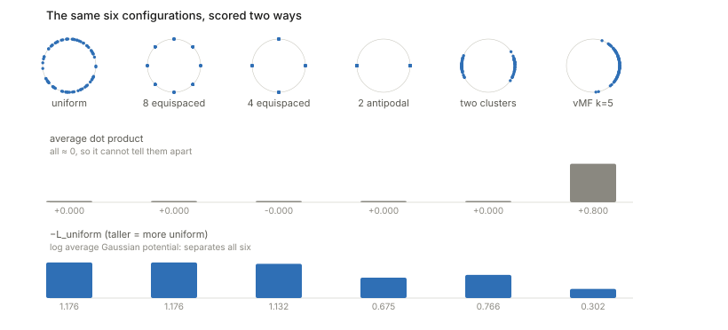
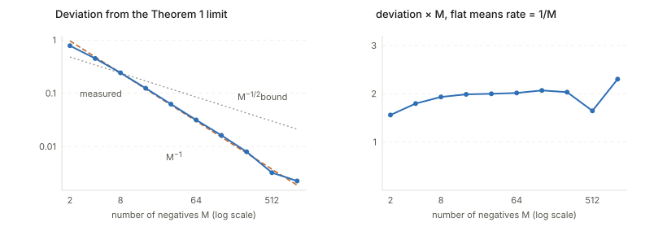
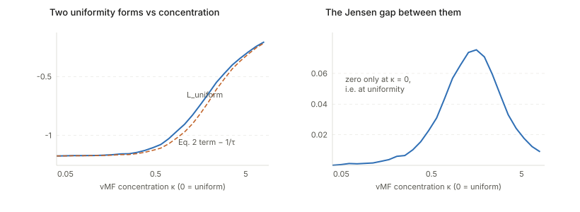

## Links

- **[arXiv:2005.10242](https://arxiv.org/abs/2005.10242)** — **use this version**, not the ICML
  proceedings PDF. The arXiv copy carries the supplement *and* a changelog correcting
  Theorem 1's convergence rate (see below).
- **[Runnable code](https://github.com/msrepo/theory_inclined_papers_with_annotations/blob/main/papers/2020-wang-isola-alignment-uniformity/code/alignment_uniformity.py)** —
  all four claims below checked numerically. `make verify` runs it.
- Downstream in this repo: **[Betser et al. 2026](../2026-betser-infonce-gaussian/index.html)**
  (whose $\Phi(\mu)$ *is* Theorem 1's second term) and
  **[Zhang et al. 2026](../2026-zhang-difficult-examples/index.html)** (which inherits this
  decomposition).

## In one paragraph

Everyone "knew" contrastive learning pulls positives together and pushes negatives apart. This
paper makes that precise and, more importantly, shows the two halves are **separable, nameable,
and individually measurable**. Taking $M \to \infty$ negatives, the InfoNCE loss splits exactly
into an **alignment** term (minimised iff positive pairs map to identical features) and a
**uniformity** term (minimised iff the feature distribution is uniform on the sphere). The
uniformity term turns out to be an *energy* from classical potential theory, which is why the
uniform measure is its unique minimiser. The paper then proposes $\mathcal{L}_{align}$ and
$\mathcal{L}_{uniform}$ as standalone losses and shows that optimising them directly matches or
beats the contrastive loss — the strongest possible evidence that the decomposition captures
what the loss was doing.

## The spine of the argument

1. Drop the InfoMax framing. The MI-bound story is empirically falsified, so analyse what the
   loss *actually* optimises instead of what it bounds.
2. Take $M\to\infty$ and normalise by $\log M$. The loss splits cleanly in two (Theorem 1).
3. The first term is minimised exactly at perfect alignment. Immediate.
4. The second term is an **average pairwise Gaussian potential**, so classical potential theory
   applies: strict positive definiteness gives a *unique* minimiser, and rotational symmetry
   forces it to be uniform (Propositions 1 and 2).
5. That same term is a **resubstitution entropy estimator**, so minimising it is maximising the
   estimated entropy of the features.
6. Turn both halves into standalone metrics and show they predict downstream accuracy and work
   as training objectives.

## Setup and notation

| Symbol | Meaning |
|---|---|
| $p_{data}$, $p_{pos}$ | data distribution; distribution of positive pairs |
| $f : \mathbb{R}^n \to S^{m-1}$ | encoder onto the unit sphere |
| $\tau$, $M$ | temperature; number of negatives |
| $\sigma_d$ | normalised surface measure on $S^d$ — "the uniform distribution" |
| $G_t(u,v)$ | Gaussian / RBF potential $e^{-t\lVert u-v\rVert^2}$ |
| $I_K[\mu]$ | energy $\iint K(u,v)\,d\mu\,d\mu$ |
| $t$, $\alpha$ | RBF bandwidth ($t=2$) and alignment exponent ($\alpha=2$) |
| $\hat H$, $\hat I$ | resubstitution entropy estimator; the MI estimator built from it |
| $\kappa = 1/\tau$ | vMF concentration, when the second term is read as a KDE |

### The two assumptions, and which one matters

**Symmetry** $p_{pos}(x,y)=p_{pos}(y,x)$ does light work: it lets you stop distinguishing
anchor from positive.

**Matching marginal** $\int p_{pos}(x,y)\,dy = p_{data}(x)$ is load-bearing, in two ways.

*It collapses two distributions into one.* In Theorem 1's limit the second term is
$\mathbb{E}_{(x,y)\sim p_{pos}} \log \mathbb{E}_{x^-\sim p_{data}}[e^{f(x^-)^\top f(x)/\tau}]$.
The inner expression depends only on the anchor, so the outer expectation reduces to one over
the *marginal of $p_{pos}$*. Matching marginal says that marginal **is** $p_{data}$ — the same
law the negatives come from. Without it you have anchors from one distribution and negatives
from another, the second term stops being a functional of a single feature distribution, and the
whole "uniformity of *the* feature distribution" reading collapses.

*It makes uniformity well-defined.* Perfect uniformity is a statement about the law of $f(x)$
for $x\sim p_{data}$. Matching marginal is what makes "spread the negatives out" and "the
feature distribution is uniform" the same sentence.

It holds by construction when positives are two i.i.d. augmentations of one base sample — but
**it fails for MoCo-style memory banks**, whose features come from an older momentum encoder and
so are not distributed as $f_\#p_{data}$ for the current $f$. The analysis assumes this away.

## InfoMax is not what InfoNCE does

InfoMax is a *principle* (maximise $I(f(x);f(y))$); InfoNCE is a *loss*. The bridge is that
$-\mathcal{L}_{contrastive} + \log M$ lower-bounds the mutual information. Wang & Isola's
position is that the bridge is broken, citing Tschannen et al. (2019): **optimising a tighter MI
bound often yields worse representations.** If the MI story explained the success, tighter would
be better.

Two structural reasons it cannot be right:

- **MI is invariant to invertible transformations of $f$**, so it cannot distinguish a linearly
  separable representation from an information-equivalent scrambled one — precisely the property
  a linear probe measures.
- **The bound saturates at $\log M$**, yet performance keeps improving with $M$ well past
  where the bound could be tracking anything.

Their reconciliation via $I(f(x);f(y)) = H(f(x)) - H(f(x)\mid f(y))$ is the useful part:
uniformity does correspond to maximising $H(f(x))$, but **alignment is strictly stronger than
minimising $H(f(x)\mid f(y))$** — it demands $f(x)=f(y)$ a.s., where low conditional entropy
only demands predictability. So the loss optimises something adjacent to MI: *aligned and
information-preserving*.

## Why a Gaussian potential, and not something simpler

The requirement is a functional on distributions over $S^d$ that is uniquely minimised by
uniform, sensible with finitely many points, and cheap.

**The obvious candidates fail badly.** $\mathbb{E}[u^\top v] = \lVert\mathbb{E}[u]\rVert^2$, so
average dot product is minimised by *any* zero-mean distribution; average squared distance is the
same thing in disguise, since $\lVert u-v\rVert^2 = 2-2u^\top v$ on the sphere.

<figure>

<figcaption>Measured on $S^1$. The average dot product is <b>0.000</b> for uniform, 8-point,
4-point <i>and</i> 2 antipodal points — a configuration that is maximally non-uniform yet ties
with uniform. It simply cannot see the difference. $\mathcal{L}_{uniform}$ orders all six
correctly.</figcaption>
</figure>

What you need is a kernel whose energy is **strictly positive definite**: $I_K[\mu] \ge 0$ for
every signed measure with equality only at $\mu\equiv 0$. That makes the energy strictly convex
over measures, which buys a unique minimiser.

Among strictly PD kernels the Gaussian is chosen because it is bounded and singularity-free, it
is tied to **universally optimal** configurations (Cohn & Kumar), it can represent a general
class of other kernels including the Riesz $s$-potentials — and, decisively for this paper,
**on the sphere it is exponentiated cosine similarity**:

$$
G_t(u,v) = e^{-t\lVert u-v\rVert^2} = e^{2t\,u^\top v - 2t}
$$

The object inside the InfoNCE softmax *is* a Gaussian potential. Without that identity there is
no Theorem 1. (Checked to $10^{-16}$ in `code/`.)

## Unpacking $\mathcal{L}_{uniform}$

$$
\mathcal{L}_{uniform}(f;t) = \log \mathbb{E}_{x,y \overset{iid}{\sim} p_{data}}\big[e^{-t\lVert f(x)-f(y)\rVert^2}\big]
$$

Three layers, inside out. $G_t$ is a **crowding measure** for a pair, near 1 when the points
coincide and near 0 when they are far apart. The expectation is the **total energy** of the
configuration — think of each feature as a charge repelling every other. The $\log$ is monotone
and therefore changes *nothing* about the minimiser; it is there for numerical scale, to match
the log-scale of the contrastive loss, and for gradient conditioning.

Range: $\mathbb{E}[G_t]\in(0,1]$, so $\mathcal{L}_{uniform}\le 0$, hitting 0 in the worst case
where all points collapse.

## Proposition 1, unpacked

**Claim:** $\sigma_d$ is the *unique* minimiser of $I_{G_t}[\mu]$ over Borel probability
measures on $S^d$.

The paper's proof is one line — "a direct consequence of Lemmas 1 and 2" — with both lemmas
imported from Borodachov, Hardin & Saff (2019): $G_t$ is strictly PD on $S^d$, and for a
strictly PD kernel of the form $f(\lVert u-v\rVert^2)$ with finite energy, $\sigma_d$ is the
unique minimiser and finite-point minimisers converge weak\* to it.

**Why strict positive definiteness gives uniqueness.** Suppose $\mu_1,\mu_2$ both minimise. Put
$\nu = \mu_1-\mu_2$, a signed measure with $\nu(S^d)=0$. Then

$$
I[\mu_1] = I[\mu_2+\nu] = I[\mu_2] + 2\!\iint\! G_t\,d\mu_2\,d\nu + I[\nu].
$$

At a minimum the cross term vanishes, and strict PD forces $I[\nu]>0$ unless $\nu\equiv 0$. It
is the measure-space analogue of "a strictly convex function has one minimum."

**Why that minimiser is $\sigma_d$** — a symmetry argument the paper leaves implicit. $G_t$
depends only on $\lVert u-v\rVert$, so the energy is rotation-invariant. If $\mu^*$ is the
*unique* minimiser then $R_\#\mu^* = \mu^*$ for every rotation $R$, and the only
rotation-invariant probability measure on the sphere is $\sigma_d$.

Strict PD gives uniqueness; symmetry then identifies it for free. **Proposition 2** is the
finite-$N$ half of the same lemma, which is why 8 equispaced points score marginally *better*
than a sampled uniform in the figure above — no contradiction, just Proposition 2 in action.

## Theorem 1, and a correction

$$
\lim_{M\to\infty}\big[\mathcal{L}_{contrastive}(f;\tau,M) - \log M\big]
= -\tfrac{1}{\tau}\mathbb{E}_{p_{pos}}[f(x)^\top f(y)]
+ \mathbb{E}_{x\sim p_{data}}\log\mathbb{E}_{x^-\sim p_{data}}\big[e^{f(x^-)^\top f(x)/\tau}\big]
$$

**The derivation is short.** Split the log of the fraction, subtract $\log M$ and push it
inside:

$$
\mathcal{L} - \log M = -\tfrac{1}{\tau}\mathbb{E}[u^\top v] + \mathbb{E}\Big[\log\Big(\tfrac{1}{M}e^{u^\top v/\tau} + \tfrac{1}{M}\textstyle\sum_i e^{u_i^-{}^\top v/\tau}\Big)\Big]
$$

As $M\to\infty$ the first inner term is one bounded quantity over $M$ and vanishes; the second
is an average of i.i.d. bounded terms, so the **SLLN** sends it to
$\mathbb{E}_{x^-}[e^{f(x^-)^\top f(y)/\tau}]$. The Continuous Mapping Theorem pushes the limit
through the $\log$, bounded convergence swaps limit and expectation (everything lives in
$[e^{-1/\tau}, e^{1/\tau}]$), and **matching marginal** converts the outer expectation.

**Why $\log M$ must be subtracted:** without it the loss *diverges*, since the sum has $M$
terms. It is the entropy of a uniform choice among the candidates. Practical corollary: **raw
InfoNCE values are not comparable across batch sizes.**

**Result 1** is immediate — on the sphere $u\cdot v = 1 - \lVert u-v\rVert^2/2$, so minimising
$-\mathbb{E}[u\cdot v]$ is minimising $\mathbb{E}\lVert f(x)-f(y)\rVert^2$, zero iff perfectly
aligned.

### The rate: two corrections, one of them mine

<figure>

<figcaption>Measured on a synthetic $S^1$ setup. Fitted log-log slope $-0.95$, and
<b>deviation × M is flat near 2.0</b> across three decades — so the true rate is
$\Theta(1/M)$, not $O(M^{-1/2})$.</figcaption>
</figure>

1. **The published rate is superseded.** The ICML proceedings version states
   $O(M^{-2/3})$. The arXiv changelog dated 11/6/2020 reads *"Corrected Theorem 1's convergence
   rate to $O(M^{-1/2})$."* If you cite the rate, cite $M^{-1/2}$ and use the arXiv version.
2. **Even the corrected rate is loose**, by a factor of $\sqrt M$. Their proof bounds
   $\mathbb{E}\lvert\log A_M - \log \mathbb{E}A\rvert \le c\,\mathbb{E}\lvert A_M - \mathbb{E}A\rvert = O(M^{-1/2})$
   via the mean value theorem plus Berry–Esseen — taking absolute values *before* the
   expectation, which discards the cancellation of the mean-zero first-order term. A delta-method
   expansion keeps it:
   $\mathbb{E}[\log A_M] - \log\mathbb{E}[A] \approx -\operatorname{Var}(A_M)/(2(\mathbb{E}A)^2) = O(1/M)$.
   Their bound is valid, just not tight; the measurement above agrees with the delta method.

## The resubstitution entropy estimator

With $p_{data}$ uniform over a finite dataset the second term becomes a double sum,
$\frac{1}{N}\sum_i \log\big[\frac{1}{N}\sum_j e^{f(x_i)^\top f(x_j)/\tau}\big]$. Now recognise
the inner sum: the **von Mises–Fisher** density is
$p_{vMF}(u;\mu,\kappa) = Z_{vMF}^{-1}e^{\kappa\mu^\top u}$, so with $\kappa = 1/\tau$ each
term is $Z_{vMF}\cdot p_{vMF}(f(x_i); f(x_j), 1/\tau)$ and the average is a **kernel density
estimate** of the feature distribution evaluated at $f(x_i)$, built from the features
themselves as kernel centres with bandwidth $\tau$. Hence

$$
\text{second term} = \underbrace{\tfrac{1}{N}\textstyle\sum_i \log \hat p_{\text{KDE}}(f(x_i))}_{=\,-\hat H(f(x))} + \log Z_{vMF}.
$$

"Resubstitution" names the trick: estimate $H = -\mathbb{E}[\log p(X)]$ by fitting $\hat p$ on
the sample and evaluating it *at that same sample*. **So minimising the second term is maximising
the estimated entropy of the features**, and uniform is the max-entropy law on the sphere — which
is Result 2.

Two caveats worth carrying. The estimator is **biased**: the $j=i$ term contributes
$e^{1/\tau}$, the largest value possible, so every point inflates its own density. That bias is
configuration-independent, so the argmin is unaffected, but the *value* is not a good entropy
estimate. And since $f$ is deterministic, $\hat H(f(x))$ doubles as an estimator of
$\hat I(x; f(x))$ — the source of "information-preserving".

## The two metrics, and what the logsumexp is doing

$$
\mathcal{L}_{align}(f;\alpha) = \mathbb{E}_{p_{pos}}\big[\lVert f(x)-f(y)\rVert_2^\alpha\big],
\qquad
\mathcal{L}_{uniform}(f;t) = \log \mathbb{E}_{x,y}\big[e^{-t\lVert f(x)-f(y)\rVert_2^2}\big]
$$

The chain from "logsumexp of an RBF" to "uniformity" has four links: the RBF on the sphere *is*
exponentiated cosine similarity; averaging it gives an energy; strict positive definiteness makes
uniform the unique minimiser; and the **placement of the $\log$** distinguishes the two forms.

- $\mathcal{L}_{uniform} = \log\mathbb{E}_x\mathbb{E}_y[G_t]$ — log **outside both**.
- Theorem 1's second term $= \mathbb{E}_x\log\mathbb{E}_y[G_t] + 1/\tau$ — log **between** them.
  Over a finite batch, $\log\mathbb{E}_y$ is a logsumexp minus $\log M$.

By Jensen, $\mathbb{E}_x\log\mathbb{E}_y[G] \le \log\mathbb{E}_x\mathbb{E}_y[G]$, **with equality
iff $\mathbb{E}_y[G(x,\cdot)]$ is constant in $x$** — which is exactly the uniformity
equilibrium condition: every point feels the same total potential from the rest.

<figure>

<figcaption>Sweeping vMF concentration from uniform ($\kappa=0$) to highly concentrated. Both
forms are minimised at $\kappa=0$, and <b>the gap between them vanishes only there</b>. Same
minimiser, different value everywhere else — the precise content of the paper's remark that
$\mathcal{L}_{uniform}$ "pushes the log outside the outer expectation, without changing the
minimizer".</figcaption>
</figure>

Why prefer $\mathcal{L}_{uniform}$ in practice: one scalar over all pairs, a single logsumexp
over the batch's pairwise distances, instead of a per-anchor softmax with its expensive
normalisation. And a final intuition — **logsumexp is a soft maximum**, so as $t\to\infty$ the
metric is dominated by the single closest pair and degenerates into the best-packing (Tammes)
objective. At finite $t$ it weights all pairs but emphasises the crowded ones, which is why it
behaves sensibly with finitely many points rather than only in the limit.

## Questions and doubts

- **Perfect alignment and perfect uniformity are jointly unachievable on finite data**, as the
  paper itself notes: perfect alignment forces every augmentation of one sample to a single
  point, which cannot be uniform. So the two metrics are always in tension and the "optimum" is
  a trade-off the theory does not characterise. The experiments tune the weighting by hand.
- **Matching marginal excludes the memory-bank methods** the paper repeatedly cites as
  motivation (MoCo). Not acknowledged.
- **$t$ and $\alpha$ are free parameters** with no theory guiding them. Proposition 1 holds
  for every $t>0$, so the asymptotic claim gives no way to choose one; the paper picks
  $t=2, \alpha=2$ empirically.
- **The entropy-estimator reading is suggestive rather than tight.** The estimator is biased by a
  self-term, and KDE entropy estimation on a sphere in $m$ dimensions with $N$ points is a
  poor estimator for realistic $m$. The identification is exact as algebra, loose as statistics.
- **The rate in the published version is wrong and even the corrected one is loose** — see above.
  Worth knowing before citing it.

## Takeaways

- The decomposition is the contribution, and it is unusually clean: one loss, two terms, each
  with an exact characterisation of its minimiser.
- The uniformity term is an **energy from potential theory**, and recognising that is what turns
  a vague "spread out" intuition into a theorem with a unique minimiser.
- **Strict positive definiteness is the property to remember.** It is what separates a usable
  uniformity objective from a degenerate one, and why the RBF works where the dot product cannot.
- Minimising the repulsion term is **maximising an entropy estimate** of the feature
  distribution — a cleaner statement of "information-preserving" than the MI-bound framing it
  replaces.
- That optimising $\mathcal{L}_{align} + \mathcal{L}_{uniform}$ directly matches the contrastive
  loss is the strongest evidence for the analysis: the decomposition is not just descriptive, it
  is sufficient.
