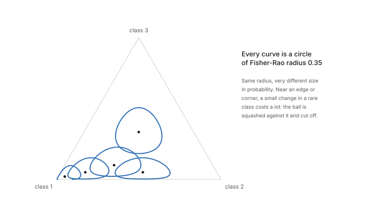
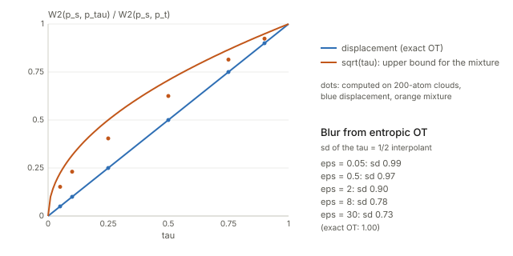
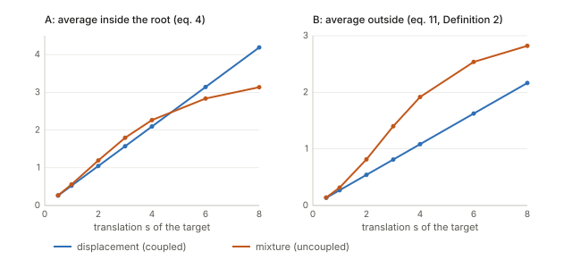
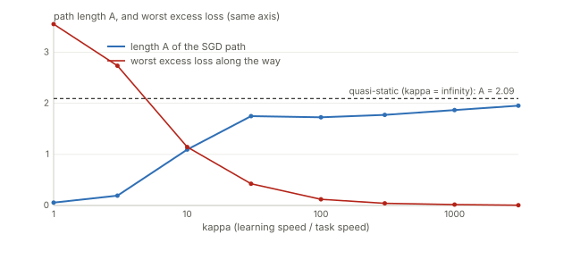
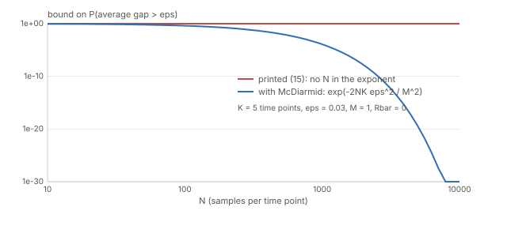
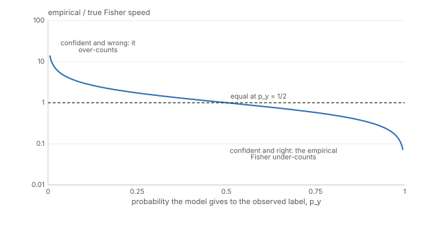
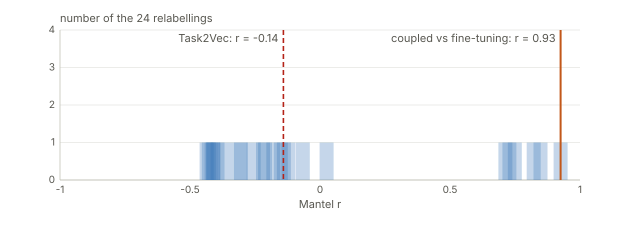

## Links

- **[arXiv:2011.00613](https://arxiv.org/abs/2011.00613)**: the preprint; v2 (February 2021) is the version read here.
  The proceedings page is [PMLR 139](https://proceedings.mlr.press/v139/gao21a.html).
- **[Interactive companion](figures/interactive.html)**: eight widgets. (1) What one step of a classifier costs in
  Fisher length. (2) Three-class predictions on a sphere: drag two points and see the geodesic and the ball of equal
  distance. (3) Where the average over inputs sits, Eq. (5) against Eq. (11). (4) A toy transfer problem: move the
  task by displacement or by mixture, and watch the minimiser and three lengths of its path. (5) The speed of
  learning $\kappa$, and forward against backward. (6) The empirical Fisher of Eq. (21). (7) Theorem 6's bound as
  printed and with $N$. (8) The Mantel tests of Figures 2 and 3, re-run.
- **[Runnable checks](https://github.com/msrepo/theory_inclined_papers_with_annotations/tree/main/papers/2021-gao-coupled-transfer-distance/code)**:
  `fisher_rao.py` (Section 2.1, Eqs. 2–5, 11, 12b, 21), `interpolation.py` (Sections 2.2 and 3.4),
  `transfer_toy.py` (Remarks 1, 3 and 4), `bounds.py` (Section 4 and Appendix C), `mantel.py` (Section 5).
  Every number in these notes is printed by one of them, and `--figures` rewrites the SVGs below.
  `make verify` runs them all.
- **[Fisher information](../fisher-information/index.html)**: background for Section 2.1. The score, the Fisher
  matrix as the curvature of the KL, why the length is coordinate-free, and the empirical Fisher.
- **[Optimal transport](../optimal-transport/index.html)**: background for Section 2.2. Plans, the Kantorovich
  problem, entropic OT and Sinkhorn, straight-line flows between point clouds.
- **[Inequalities and concentration](../inequalities-and-concentration/index.html)**: Markov, Hoeffding, McDiarmid and
  Rademacher complexity, all used in Section 4.
- **Companion papers in this collection**: [Dynamics and Reachability of Learning Tasks](../2019-achille-task-reachability/index.html)
  (a task distance that is asymmetric because SGD is irreversible) and
  [The Information Complexity of Learning Tasks](../2020-achille-task-complexity/index.html) (the information-theoretic
  task distance this paper compares itself with in Section 6). See also [LEEP](../2020-nguyen-leep/index.html),
  [LogME](../2021-you-logme/index.html) and [H-score](../2022-bao-hscore-transferability/index.html) for cheap
  transferability scores.

Gao & Chaudhari, *An Information-Geometric Distance on the Space of Tasks*, ICML 2021.

## In one paragraph

The paper wants a number for "how far is the target task from the source task" that knows which classifier is being
transferred and does not depend on fine-tuning hyper-parameters. Its answer is to *walk* a classifier from source to
target. Along the way the data is morphed from the source distribution into the target distribution by optimal
transport, and at every instant the classifier is fitted to the in-between task. The walk leaves a trail in weight
space. The trail is measured with the **Fisher–Rao ruler**, which counts how much the classifier's *predictions*
change, not how much its weights change. The length of the trail is the "coupled transfer distance", and the word
"coupled" means that the matching of source points to target points (the transport plan) is optimised together with
the weights. Section 4 then argues, with a Rademacher-complexity bound, that such a trajectory keeps the
generalization gap small at every instant. The experiments compare the distance with the difficulty of fine-tuning
on subsets of MNIST, CIFAR-10, CIFAR-100 and DeepFashion.

The construction is appealing and I re-derived and tested most of it. What the checks below found:

- Definition 2 averages the *square root* of the KL over inputs, which is not the Fisher–Rao length of Eqs. (4)–(5)
  (there the average is inside the root). By Jensen it is never larger, and it is not a Riemannian length.
- The ground cost (12b) is the speed of the weights seen through a frozen input, not "the Fisher–Rao distance between
  the endpoint predictions", as the text says. In a perfectly tracking model the second is 0 and (12b) is 2.63.
- Remark 1 ("uncoupled transfer entails longer trajectories") is not a theorem. In an exactly solvable logistic
  problem it holds for Definition 2's length and for the loss variation, and fails for the Riemannian length once the
  shift is large.
- The minimiser path is exactly reversible, so the asymmetry of Remark 3 is a dynamical effect. It depends on how
  fast the weights learn relative to how fast the task moves, and so does the length itself.
- Theorem 6's printed $\lambda$ has an extra factor $K$ (the exponent it gives is $+144$ in an example where the
  right one is $-1.8$), and the bound has no $N$ in its exponent. The proved complexity term of Theorems 5/7 is
  $2\,\mathrm{TV}/K$, not the Fisher–Rao length.
- The Mantel statistic $r$ reported for the experiments cannot be reproduced from the printed matrices.

## The spine of the argument

1. **A ruler on classifiers.** Two networks are close if they predict alike. For a small weight change,
   $2\,\mathrm{KL}(p_w\Vert p_{w+dw})=dw^\top g\,dw$ with $g$ the Fisher matrix (Eq. 2–3). Integrating this along a
   path gives a length that is the same in every parametrisation (Eq. 4–5).
2. **A road for the data.** Move the source data cloud onto the target data cloud by optimal transport, along the
   straight line between matched points, with labels interpolated too (Eq. 6–8). This is the *interpolated task*
   $\hat p_\tau$, $\tau\in[0,1]$.
3. **A walker.** Let SGD track $\hat p_\tau$ as $\tau$ goes from 0 to 1 (Eq. 10, 12c). The weights trace a curve $w(\tau)$.
4. **Put them together.** The coupled transfer distance is the length of $w(\cdot)$, minimised over the transport
   plan (Definition 2, Eq. 11). Because the cost of matching source point $i$ with target point $j$ depends on the
   weight path, and the path depends on the plan, both are updated in turn (Eq. 12).
5. **Why it should mean something.** A Rademacher argument bounds the average generalization gap along the path
   in terms of the path (Theorems 5–7).
6. **Evidence.** Mantel-test correlations with fine-tuning difficulty, asymmetry sanity checks, a larger model having
   smaller distances (Section 5).

## Setup and notation

| Symbol | Meaning |
|---|---|
| $D_s,D_t$ | source and target datasets of input–label pairs $(x,y)$; $\hat p_s,\hat p_t$ their empirical distributions |
| $w\in\mathbb R^p$, $p_w(y\mid x)$ | weights and the classifier's predictive distribution over labels |
| $\ell(w)$, $\ell_\tau(w)$ | cross-entropy $-\log p_w(y\mid x)$, averaged over the source task, or over the task at time $\tau$ |
| $\tau\in[0,1]$ | position along the interpolation *and* time of the weight dynamics |
| $g_{ij}(w)$ | Fisher information matrix, Eq. (3) |
| $\mathrm{KL}[p,q]$ | Kullback–Leibler divergence $\int p\log(p/q)$ |
| $d_{\rm FR}$ | Fisher–Rao distance, the length of the shortest curve under the Fisher ruler, Eq. (4) |
| $\Pi(\hat p_s,\hat p_t)$, $\Gamma$ | set of transport plans (joint distributions with the given marginals), one plan |
| $C_{ij}$ | cost of moving source point $i$ to target point $j$ (the "ground metric") |
| $H(\Gamma)=-\sum\Gamma_{ij}\log\Gamma_{ij}$ | entropy of the plan, used to smooth the transport problem |
| $\hat p_\tau$ | the interpolated task: samples $(1-\tau)x_s^i+\tau x_t^j$ with mass $\Gamma_{ij}$, Eq. (7)–(8) |
| $\mathcal R_N$ | Rademacher complexity, Eq. (13) |
| $M$ | bound on the loss, $\lvert\ell\rvert<M$ |
| $K$, $\tau_k$ | number of checkpoints along the path and their times |
| $\kappa$ | (my notation) learning speed relative to task speed: SGD steps times learning rate; Eq. (10) with $d\tau$ equal to the learning rate is $\kappa=1$ |
| $A,\,B,\,\mathrm{TV}$ | (my notation) three lengths of a weight path, defined in Section 1.4 and Section 3 |

## 1. The ruler: Fisher–Rao length (Section 2.1, Eqs. 2–5)

### 1.1 Why not measure in weight space?

Take two networks. If you permute two hidden units, the weight vector changes a lot and the function does not
change at all. If you rescale a weight before a batch-norm layer, again the function is unchanged. And a tiny weight
change in a direction the loss is sensitive to can flip many predictions. A distance between *tasks* built on
$\lVert w-w'\rVert$ would inherit all of this. So the paper measures how far apart two classifiers are by how
differently they *predict*.

### 1.2 KL is locally quadratic, and the coefficient is the Fisher matrix

The natural measure of "how differently do $p_w$ and $p_{w'}$ predict" is the Kullback–Leibler divergence. Read
$\mathrm{KL}[p,q]$ as the extra surprise you suffer, on average, if the world follows $p$ and you believe $q$. It is
zero when the two agree and positive otherwise.

For two nearby weight settings, KL behaves like a squared distance. That is Eq. (2):

$$
2\,\mathrm{KL}\big[p_w,\,p_{w+dw}\big]\;=\;\sum_{i,j}g_{ij}(w)\,dw_i\,dw_j\;=\;dw^\top g(w)\,dw .
$$

The matrix $g$ is the **Fisher information matrix**, Eq. (3): the average, over the data and over the model's own
predictions, of the outer product of the gradient of the log-probability.

**Where Eq. (2) comes from, in three lines.** Fix $w$ and look at $f(w')=\mathrm{KL}[p_w,p_{w'}]=\mathbb E_{p_w}[\log p_w-\log p_{w'}]$
as a function of the second argument, and expand it around $w'=w$.

- At $w'=w$ it is 0: a model does not differ from itself.
- Its slope there is $-\mathbb E_{p_w}[\nabla\log p_w]$. The *score* $\nabla\log p_w$ averages to zero, because
  $\mathbb E_{p_w}[\nabla\log p_w]=\int\nabla p_w=\nabla\!\int p_w=\nabla 1=0$. So there is no first-order term:
  a wrong belief costs nothing to first order, only to second order.
- Its curvature is $-\mathbb E_{p_w}[\nabla^2\log p_w]$. Differentiating the identity $\int\nabla p_w=0$ once more shows this
  equals $\mathbb E_{p_w}[\nabla\log p_w\,\nabla\log p_w^\top]$, the Fisher matrix $g$.

So $\mathrm{KL}\approx\tfrac12dw^\top g\,dw$, and $2\,\mathrm{KL}\approx dw^\top g\,dw$. For a softmax, $\nabla_z\log p_y=e_y-p$, so
$g=\mathbb E_y[(e_y-p)(e_y-p)^\top]=\mathrm{diag}(p)-pp^\top$.

The simplest example is a coin with $P(\text{heads})=p=\sigma(z)$, where $z$ is the logit. Moving the logit by a small
amount $\delta$ costs $\delta^2p(1-p)$ in $2\,\mathrm{KL}$, so the Fisher information for $z$ is $p(1-p)$ and one unit of
logit costs $\sqrt{p(1-p)}$ of Fisher length. At $p=\tfrac12$ that is $0.5$. At $p=0.99$ it is $0.0995$, five times
less. **A confident classifier is cheap to move; an undecided one is expensive**, because the same change in the logit
alters the prediction less when the prediction is already near 0 or 1.
[Widget 1](figures/interactive.html#ruler) draws both the exact $2\,\mathrm{KL}$ and its quadratic approximation.

For a softmax over several classes, in logit coordinates, $g=\mathrm{diag}(p)-pp^\top$. Checked in `fisher_rao.py`:
for a 4-class softmax and a random step of size $\varepsilon$, the ratio $2\,\mathrm{KL}/(dz^\top g\,dz)$ is
1.149, 1.044, 1.014, 1.0043, 1.0014 at $\varepsilon=1,\,0.3,\,0.1,\,0.03,\,0.01$: it tends to 1 linearly in $\varepsilon$.

### 1.3 Length of a curve, geodesics, and $d_{\rm FR}$

A **Riemannian metric** is a rule that says how long a tiny step is, where the rule may depend on where you stand.
Here the rule at the point $w$ is $\sqrt{dw^\top g(w)\,dw}$. The **length** of a curve $w(\tau)$ is the sum of its tiny
steps, the odometer reading:

$$
\text{length}\;=\;\int_0^1\sqrt{\dot w(\tau)^\top g(w(\tau))\,\dot w(\tau)}\;d\tau .
$$

A **geodesic** is a shortest curve between two points, and the length of a geodesic is the distance, Eq. (4). Two
facts the paper leans on, both true and both easy to check:

- **The length does not depend on how you label the points.** Rewrite the same curve in logits or in probabilities
  and the odometer reads the same. Checked in `fisher_rao.py`: a straight line in logit space between two 3-class
  predictions has length 2.17414 whether measured in logit coordinates with $g=\mathrm{diag}(p)-pp^\top$ or in
  probability coordinates with the metric $\sum dp_i^2/p_i$. The two agree to $8.5\times10^{-8}$.
- **Chentsov's theorem**: up to scale, the Fisher metric is the *only* metric that is preserved under the natural
  transformations of a statistical model. This is what the paper cites (Bauer et al.) when it says the FIM is "the
  unique metric".

For categorical distributions everything can be seen. In probability coordinates the ruler is
$2\,\mathrm{KL}\approx\sum_idp_i^2/p_i$. Put $u_i=\sqrt{p_i}$, so that $dp_i=2u_i\,du_i$ and
$dp_i^2/p_i=4\,du_i^2$. The ruler becomes $4\sum_idu_i^2$, twice the ordinary Euclidean length of $du$, and since
$\sum_iu_i^2=\sum_ip_i=1$ the point $u$ lives on the unit sphere. The simplex is a patch of a sphere of radius 2, a
geodesic is a great-circle arc, and the distance is twice the angle between $u$ and $v$:

$$
d_{\rm FR}(p,q)\;=\;2\arccos\sum_i\sqrt{p_iq_i}\;\le\;\pi .
$$

For $p=(0.90,0.05,0.05)$ and $q=(0.05,0.05,0.90)$ this is 2.15334, and the numerical length of the great circle is
2.15334. The straight line in probabilities has length 2.15958 and the straight line in logits 2.17414 (about 1% more).
So for three classes the "shortcut" curves are almost geodesics; the sphere picture matters more for what it says
about *scale*: the largest possible distance between two predictions is $\pi$ (disjoint supports). Here it is 69% of it.

<figure><figcaption><b>Circles of equal Fisher–Rao radius on the three-class simplex.</b> Same radius, very different size in probability space. Near an edge or corner a small change in a rare class is expensive, so the ball is squashed against it. Widget 2 of the <a href="figures/interactive.html#simplex">interactive page</a> lets you drag two predictions and see the geodesic and the ball through the second one.</figcaption></figure>

### 1.4 The average over $x$: Eq. (5) against Eq. (11)

A classifier is a *conditional* distribution $p_w(y\mid x)$. The Fisher matrix of Eq. (3) averages over $x\sim p(x)$
**and** then takes the length, so the ruler is

$$
\sqrt{\;\mathbb E_x\big[2\,\mathrm{KL}(p_w(\cdot\mid x)\,\Vert\,p_{w+dw}(\cdot\mid x))\big]\;}.
$$

The average is *inside* the square root. Eq. (5) writes the same length as $\int\sqrt{2\,\mathrm{KL}[p_w(y\mid x),\,p_{w+dw}(y\mid x)]}$
without the average, which is only shorthand. But Definition 2, Eq. (11), has $\mathbb E_x$ in front of the integral,
so the average is *outside* the root. Call the two lengths of a weight path

$$
A=\int_0^1\sqrt{\mathbb E_x\big[2\,\mathrm{KL}_x\big]}\,d\tau\qquad\text{(Riemannian, Eqs. 3–4)},\qquad
B=\mathbb E_x\int_0^1\sqrt{2\,\mathrm{KL}_x}\,d\tau\qquad\text{(Definition 2)} .
$$

They are different, and **$B\le A$ by Jensen's inequality** (the mean of square roots is at most the square root of the
mean). $B$ is the average, over inputs, of a *norm* of $dw$; it is a convex, one-homogeneous function of $dw$, but its
square is not a quadratic form in general, so $B$ is not the length in any Riemannian metric (it has the form of a
Finsler length). Checked in `fisher_rao.py`, on a logistic model with weights moving in a straight line:

- Half the inputs on the decision boundary, half saturated: $B/A=0.707=1/\sqrt2$ exactly. In general, if a fraction
  $f$ of the inputs feel the change and the rest feel none, $B/A=\sqrt f$.
- 400 inputs from $N(0,2^2)$, weights from $(1,0)$ to $(3,1)$: $A=0.570$, $B=0.513$, $B/A=0.900$.

[Widget 3](figures/interactive.html#jensen) lets you vary the input spread and the weight change. In the toy of Section 3.6, $B/A=0.517$ along every displacement path, so there the choice only rescales the
distances; along the mixture paths it varies from 0.53 to 0.90, so the choice can change a comparison between two
ways of moving the same task.

## 2. The road: moving the data by optimal transport (Section 2.2, Eqs. 6–9)

The data cloud of the source has to be turned into the data cloud of the target. Optimal transport does this with the
least total effort. Picture $N_s$ piles of sand at the source points $x_s^i$ and $N_t$ holes at the target points
$x_t^j$. A **transport plan** $\Gamma$ is a matrix whose entry $\Gamma_{ij}$ says how much sand goes from pile $i$ to
hole $j$; its rows sum to the pile sizes and its columns to the hole sizes. The plan that minimises the total cost
$\langle\Gamma,C\rangle=\sum_{ij}\Gamma_{ij}C_{ij}$, with $C_{ij}=\lVert x_s^i-x_t^j\rVert^2$, is the Kantorovich plan.
Eq. (6) adds an entropy term, $\langle\Gamma,C\rangle-\epsilon H(\Gamma)$, which blurs the plan a little and makes
it computable by Sinkhorn's alternating scaling ([the OT page](../optimal-transport/index.html) has both).

Two points, both easy to picture: source points at 0 and 1, target points at 10 and 11. The plan pairs $0\to10$ and
$1\to11$. **Displacement interpolation**, Eq. (7), puts the sand at $(1-\tau)x_s^i+\tau x_t^j$: at $\tau=\tfrac12$ the
two points are at 5 and 6, the whole cloud has slid halfway. The **mixture** of Eq. (9) instead keeps half the sand
at 0 and 1 and the other half at 10 and 11: nothing has moved, but the cloud has two pieces. Labels follow Eq. (8):
the pseudo-label of the interpolated point is the same linear mix of the two one-hot labels.

Why the choice matters: the classifier has to keep up with the task. Sliding a cloud is a change the classifier can
follow by shifting its decision boundary. Growing a second cloud far away demands a second decision rule.

Checked in `interpolation.py` on two Gaussian clouds of 200 quantile atoms each, $N(0,1)$ and $N(6,1)$
(so $W_2(p_s,p_t)=6$):

| $\tau$ | displacement: $W_2(p_s,p_\tau)/W_2$ | mixture: same ratio | $\sqrt\tau$ |
|---|---|---|---|
| 0.05 | 0.0500 | 0.1521 | 0.2236 |
| 0.10 | 0.1000 | 0.2308 | 0.3162 |
| 0.25 | 0.2500 | 0.4043 | 0.5000 |
| 0.50 | 0.5000 | 0.6248 | 0.7071 |
| 0.75 | 0.7500 | 0.8145 | 0.8660 |

McCann's statement, that with the exact plan $W_2(p_s,p_\tau)=\tau W_2(p_s,p_t)$ (a constant-speed geodesic in the
space of distributions), is confirmed to four digits. The reason takes three lines. *Upper bound:* slide each unit of
mass from $x_i$ to $(1-\tau)x_i+\tau x_j$; it travels $\tau\lVert x_i-x_j\rVert$, so $W_2(p_s,p_\tau)\le\tau W_2(p_s,p_t)$.
The same argument from the other end gives $W_2(p_\tau,p_t)\le(1-\tau)W_2(p_s,p_t)$. *Lower bound:* the triangle
inequality says $W_2(p_s,p_t)\le W_2(p_s,p_\tau)+W_2(p_\tau,p_t)$. If either upper bound were strict the sum would fall
short of $W_2(p_s,p_t)$, so both are equalities. The mixture is at most $\sqrt\tau\,W_2$ away (because $W_2^2$
is convex along mixtures), and the numbers show it leaves the source three times faster at $\tau=0.05$.

<figure><figcaption><b>Two ways to move a task.</b> Displacement interpolation moves at constant speed. The mixture jumps away from the source and arrives late. The right-hand column lists how much an entropic (Sinkhorn) plan shrinks the interpolated cloud.</figcaption></figure>

**Entropic blur.** With Sinkhorn's plan the "interpolant" is a blurred cloud. At $\tau=\tfrac12$, the exact cloud has
standard deviation 1. Sinkhorn with $\epsilon=0.05,\,0.5,\,2,\,8,\,30$ gives 0.994, 0.967, 0.896, 0.783, 0.728, heading
for $\sqrt{1/4+1/4}=0.707$, the mixup of independent pairs. Its distance from the source is still $\tau W_2$ to within
0.4%, because that is dominated by the shift of the mean. So entropic OT does not break the constant speed to first
order, but it does contract the interpolated cloud.

### The Beta trick (Section 3.4)

At training time the paper draws the interpolation coefficient as $\lambda\sim\mathrm{Beta}(\tau,1-\tau)$ (mixup) so
that images do not look like ghostly averages. The mean is $\tau$, but the density is U-shaped. Checked: at $\tau=0.5$,
41% of samples have $\lambda$ within 0.1 of 0 or 1 (the arcsine law gives $2\cdot0.2048$) and only 33% lie in
$(0.25,0.75)$; at $\tau=0.1$, 79.5% are within 0.1 of an endpoint. So the interpolated task is *partly* a mixture of
near-source and near-target images, which is the thing Remark 1 says to avoid.

## 3. The coupled transfer distance (Section 3)

### 3.1 The uncoupled version and Remark 1

Sample from $\hat p_\tau=(1-\tau)\hat p_s+\tau\hat p_t$ (Eq. 9) and run SGD on it (Eq. 10). The weights $w(\tau)$
trace a curve and its Fisher length is the "uncoupled transfer distance". Remark 1 argues it should be longer than the
coupled one: the mixture puts far-away samples in front of a classifier tuned to the current task, so the classifier
"struggles" and takes a longer route. This is a heuristic. The two do not use the same interpolation, so neither is a
special case of the other, and no inequality follows. Section 3.6 tests it.

### 3.2 Definition 2, piece by piece

$$
\min_{\Gamma,\,w(\cdot)}\ \ \mathbb E_{x\sim\hat p_\tau(x)}\int_0^1\sqrt{2\,\mathrm{KL}\big[p_{w(\tau)}(\cdot\mid x),\,p_{w(\tau+d\tau)}(\cdot\mid x)\big]}\quad(11)
$$

- $\Gamma\in\Pi(\hat p_s,\hat p_t)$ is a transport plan; it fixes the interpolated task $\hat p_\tau$ for every $\tau$.
- $w(\cdot)$ is "a continuous curve which is the limit of" the SGD recursion. It is **not** a free variable: it is
  *determined* by $\Gamma$ (and by the learning dynamics). So the "min over $w(\cdot)$" is in effect a min over $\Gamma$.
- For each instant, the KL between the classifier now and the classifier a moment later is measured *on inputs from
  the current task* and turned into a speed; the integral adds up the speed. The outer $\mathbb E_x$ is the average
  discussed in Section 1.4: it makes the quantity $B$, not the Riemannian length $A$.
- The result is a number for the pair (source, target), the model class *and* the learning dynamics together.

### 3.3 The algorithm, Eq. (12), one line at a time

The problem is non-convex, so the paper alternates.

| Line | What it does |
|---|---|
| (12a) | Given a cost matrix $C^k$, find the plan $\Gamma^k$ that minimises $\langle\Gamma,C^k\rangle-\epsilon H(\Gamma)+\lambda\lVert\Gamma-\Gamma^{k-1}\rVert_F^2$. The last term is a *proximal* term: stay close to the previous plan, so the weight path does not jump. |
| (12b) | Cost of matching source point $i$ with target point $j$: the Fisher length of the current weight path $w^k(\cdot)$, evaluated on the interpolated input $x_\tau^{ij}=(1-\tau)x_s^i+\tau x_t^j$. |
| (12c) | Follow the task with SGD to get the new weight path $w^k(\cdot)$. |
| (12d) | The interpolated task built from the previous plan $\Gamma^{k-1}$, with pseudo-labels $(1-\tau)y_s^i+\tau y_t^j$. |
| (12e) | The sample points are drawn from it. |

The cycle is: plan $\to$ interpolated task $\to$ weight path $\to$ costs $\to$ plan. The loop is a **fixed-point
iteration**. Its fixed point is a plan that is optimal against its own frozen cost matrix. That is not the same as
minimising Eq. (11): $C$ depends on $\Gamma$ through the weight path, and a stationary point of $\langle\Gamma,C(\Gamma)\rangle$
also needs the derivative of $C$ with respect to $\Gamma$, which the loop ignores. I did not test this; it is the kind of
thing (like EM against gradient ascent) that is usually harmless in practice but not something Definition 2's "min"
promises. Fig. 4b shows the distance converging in 4–5 iterations. Also, the paper does not say how (12a) is solved: with the
quadratic proximal term it is not a plain Sinkhorn problem.

### 3.4 What (12b) actually measures

Section 3.3's text says the entries of $C$ are set to "the Fisher-Rao distance between distributions
$p_{w(0)}(\cdot\mid x_s^i)$ and $p_{w(1)}(\cdot\mid x_t^j)$", and Remark 4 repeats that the coupled distance is the
shortest geodesic between these. Eq. (12b) is a different object. It integrates, along the path, the KL between the
classifier at $\tau$ and at $\tau+d\tau$ **at the same input** $x_\tau^{ij}$. The input's own motion is not part
of it, and the endpoint predictions are not either.

The difference is not small. Checked in `fisher_rao.py` with a perfectly tracking logistic model: the target is the
source translated by $s=4$, the model is $w(\tau)=(a,-a\tau s)$ with $a=1.5$, so that $p_{w(\tau)}(\cdot\mid x_i+\tau s)$
never changes. For the pair $x_i=0.7\to x_j=4.7$:

- the Fisher–Rao distance between the endpoint predictions is **0.000**;
- Eq. (12b) is **2.629**, in agreement with the closed form $a\,s\sqrt{p(1-p)}=2.629$.

Both are defensible (the first is "these two predictions are identical", the second is "the weights had to move by a
lot to keep them so"). The paper's premise, that the *weights'* trajectory is what matters, is the second. The text
should say so.

### 3.5 Practical tricks

Block-diagonal couplings ($30\times30$ blocks) make the plan computable at $N_s=N_t=19{,}200$. It also means a
source point can only be paired with the 30 target points of its random block. For a fixed cost matrix a restricted
plan can only cost as much as or more than the full one, so this is a mini-batch OT cost. The pre-trained ResNet-50 features are used
only to initialise $\Gamma^0$, and FAQ 5 argues the effect is small. The Beta mixup is discussed in Section 2.

### 3.6 Remarks 1, 3 and 4 on a problem that can be solved exactly

To see what the definitions do, I built the smallest transfer problem with the right ingredients
(`transfer_toy.py`). A task is a 1-D binary classification problem: two Gaussian classes (means $\pm2$, standard
deviation 1, equal weight). The **target** is the same task translated by $s$. The classifier is logistic
regression $\sigma(w_1x+w_0)$, a convex model, and expectations over $x$ are done by Gauss–Hermite quadrature, so
every number is exact and there is no sampling noise. **Displacement**: each class slides by optimal transport (for
Gaussians on a line, means and standard deviations interpolate linearly) and its label goes with it. **Mixture**:
Eq. (9). Two ways for the weights to follow: the **minimiser path** $w^*(\tau)$ (each instant's optimum; this is
Eq. 10 in the limit of infinitely fast learning) and the **gradient flow** $\dot w=-\kappa\nabla L_\tau(w)$ started
at $w^*(0)$ (Eq. 10 with finite learning speed $\kappa$).

Three lengths of a path: $A$ and $B$ of Section 1.4, and $\mathrm{TV}=\mathbb E\int\lvert d\ell/d\tau\rvert\,d\tau$,
the total variation of the per-sample loss with labels held fixed (this is what Eq. 21–22 turn the length into; see
Section 4).

**Remark 1: is the mixture path longer?** For the minimiser paths:

| shift $s$ | displacement $A$ | $B$ | TV | mixture $A$ | $B$ | TV |
|---|---|---|---|---|---|---|
| 1 | 0.524 | 0.271 | 0.137 | 0.556 | 0.315 | 0.165 |
| 2 | 1.047 | 0.541 | 0.274 | 1.193 | 0.815 | 0.453 |
| 4 | 2.094 | 1.083 | 0.549 | 2.264 | 1.916 | 1.206 |
| 6 | 3.141 | 1.624 | 0.823 | 2.834 | 2.537 | 1.755 |
| 8 | 4.189 | 2.165 | 1.097 | 3.135 | 2.822 | 2.084 |

and the ratios mixture / displacement:

| shift $s$ | 0.5 | 1 | 2 | 3 | 4 | 6 | 8 |
|---|---|---|---|---|---|---|---|
| $A$ | 1.02 | 1.06 | 1.14 | 1.14 | 1.08 | **0.90** | **0.75** |
| $B$ | 1.04 | 1.17 | 1.50 | 1.72 | 1.77 | 1.56 | 1.30 |
| TV | 1.05 | 1.20 | 1.65 | 2.03 | 2.20 | 2.13 | 1.90 |

With Definition 2's length $B$, and with the loss variation, the mixture path is longer for every shift from 1
upward, by up to 1.77 and 2.20 times. That is Remark 1. With the Riemannian length $A$ it is longer only up to about
$s=4$; for larger shifts it is *shorter*. The mixture's minimiser passes through a much flatter classifier (its
slope falls from 4 to 0.8 at $s=4$ and to 0.2 at $s=8$), and predictions of a flat classifier are cheap to move. The
displacement path, by contrast, is a straight line in weight space: the slope stays at $3.9995$ and the bias moves by
$-\text{slope}\times s=-15.998$ (deviation from the line $4\times10^{-14}$), so that
$A=|{\rm slope}|\,s\sqrt{\mathbb E[p(1-p)]}=3.9995\times4\times\sqrt{0.01714}=2.0943$, linear in $s$ with $A/s=0.5236$.

<figure><figcaption><b>Remark 1 depends on the length.</b> Left: the Riemannian length $A$. The mixture is longer only up to $s\approx4.5$. Right: Definition 2's length $B$. The mixture is longer throughout. Widget 4 of the <a href="figures/interactive.html#toy">interactive page</a> lets you move $s$ and $\tau$.</figcaption></figure>

So the direction of Remark 1 is right for Definition 2 as stated, but it is a property of this family of problems and
of one of the two candidate lengths, not a theorem.

**Remark 3: asymmetry.** The paper says the distance is asymmetric and that this is desirable ("it is easier to transfer
from ImageNet to CIFAR-10 than the opposite"). In the toy, take the source (classes at $\pm2$, sd 1) and a sharper
target (classes at $\pm1$, sd 0.5).

- **The minimiser path is exactly reversible.** Forward and backward lengths agree to five decimals for both
  interpolations: displacement $A=0.20417,\,B=0.15143,\,\mathrm{TV}=0.04310$ in both directions; mixture
  $0.21058,\,0.15374,\,0.04647$ in both directions. The reason is simple: the in-between tasks are the same set
  and the minimiser for each is the same, so the backward path is the forward path traversed in reverse. A convex
  model has no memory.
- **The gradient flow is not reversible, and the asymmetry is large at finite speed:** forward/backward ratio of
  $A$ is 7.82, 7.08, 5.35, 3.19, 1.40, 0.98 at $\kappa=10,\,30,\,100,\,300,\,1000,\,3000$. At $\kappa=3000$ it is back
  to 1 (forward 0.1745, backward 0.1777 against the limit 0.2042).

So the asymmetry in the paper's Figure 2a must come from something that the reversible minimiser path does not have:
the finite speed of learning, non-convex memory (hysteresis: a local minimum that stays occupied after it stops being
the best one), SGD noise, or the different geometry around the two trained end points. This is a different mechanism from the one in the companion notes on
[Dynamics and Reachability of Learning Tasks](../2019-achille-task-reachability/index.html), where in a fixed
landscape the asymmetry of a transition is a static difference of heights (uphill against downhill) and any more must
come from the two tasks having different landscapes. The paper does not say which mechanism, if either, produces its
Figure 2a.

**Time-scale: the length depends on $\kappa$.** The intro complains that fine-tuning distances depend on
hyper-parameters. The gradient-flow length has one too. For the translated task, $s=4$, displacement path:

| $\kappa$ | $A$ | $B$ | worst excess loss along the path | excess loss at $\tau=1$ |
|---|---|---|---|---|
| 1 | 0.056 | 0.032 | 3.552 | 3.552 |
| 3 | 0.193 | 0.113 | 2.737 | 2.737 |
| 10 | 1.096 | 0.774 | 1.145 | 0.529 |
| 30 | 1.749 | 1.343 | 0.425 | 0.149 |
| 100 | 1.727 | 1.288 | 0.121 | 0.083 |
| 300 | 1.775 | 1.266 | 0.042 | 0.042 |
| 1000 | 1.869 | 1.227 | 0.017 | 0.017 |
| 3000 | 1.954 | 1.176 | 0.006 | 0.006 |
| $\infty$ (minimiser) | 2.094 | 1.083 | 0 | 0 |

(Excess loss is $L_\tau(w(\tau))-\min_wL_\tau(w)$.) With $\kappa=1$, which is what Eq. (10) says if $d\tau$ is the
learning rate, the weights barely move, the path is 37 times shorter than the limit, and the classifier is 3.55 nats
worse than the best one. A short path here means "the model gave up", not "transfer was easy". At large $\kappa$ the
length creeps towards the minimiser value, and is still 6.7% short of it at $\kappa=3000$, while $B$ is 8.6% above
its limit. The appendix gives 60 epochs of 700 minibatch steps per transfer but not the learning rate, so the
paper's operating point on this axis is unknown.

<figure><figcaption><b>The length depends on how fast the weights learn.</b> Blue: path length $A$. Red: the worst excess loss along the way. Widget 5 of the <a href="figures/interactive.html#kappa">interactive page</a> varies $\kappa$ and the direction.</figcaption></figure>

**Remark 4: independent of the architecture?** The claim: because $d_{\rm FR}$ does not depend on the embedding
dimension of the manifold, the distance is comparable across architectures. Section 1.3 checks the true part. The
length of a *given curve of predictions* is the same in every coordinate system. What does depend on the model is which
curves are available: a small model can only move along its own thin submanifold of prediction space, so its shortest
available path is at least the geodesic of the ambient space and often longer. So "in comparable units" is right,
"independent of the architecture" is not, and Figure 5's finding (the wide residual network has shorter paths) is
what one would expect from this. The quantity is also not a shortest path: $w(\cdot)$ is what SGD produces, so a larger
model does not automatically give a smaller value.

## 4. The Rademacher section (Section 4 and Appendix C)

### 4.1 Rademacher complexity from scratch

How well can a class of functions fit *pure noise*? Draw $N$ data points and attach a random sign $\sigma_i=\pm1$ to
each. For a given loss function $\ell(w;\cdot)$, the number $\frac1N\sum_i\sigma_i\ell(w;x_i,y_i)$ measures how much
the losses line up with the random signs. If the class has one member, the alignment averages to zero. If the class is
rich enough to produce any pattern of losses, it can align with the signs and the average alignment is large. So

$$
\mathcal R_N(A)\;=\;\mathbb E_{\hat p\sim p}\,\mathbb E_\sigma\Big[\sup_{w\in A}\ \frac1N\sum_{i=1}^N\sigma_i\,\ell(w;x_i,y_i)\Big]
$$

(Eq. 13) is a measure of how flexible the class is. In `bounds.py`, for 51 threshold classifiers with 0–1 loss and
$N=50$, $\mathcal R_N=0.099$. A class that can realise every 0–1 loss pattern has $\mathcal R_N=\tfrac12$.

### 4.2 Theorem 6, line by line

Theorem 6 is the workhorse. Fix checkpoints $\tau_1<\dots<\tau_K$ and $N$ samples $\hat p_{\tau_k}$ at each. Let
$\mathrm{gap}_k=\mathbb E_{p_{\tau_k}}\ell(w(\tau_k))-\frac1N\sum_{\hat p_{\tau_k}}\ell(w(\tau_k))$. For
$\epsilon>\frac2K\sum_k\mathcal R_N(\lVert w(\tau_k)\rVert_{\rm FR})$:

$$
\Pr\Big\{\tfrac1K\sum_{k=1}^K\mathrm{gap}_k>\epsilon\Big\}\ \le\ \exp\Big\{-\frac{2K}{M^2}\Big(\epsilon-\frac2K\sum_k\mathcal R_N\Big)^2\Big\}\qquad(15)
$$

The proof has five moves.

1. **Replace the weight by the worst weight in a ball** (Eqs. 16–17). $\mathrm{gap}_k\le\varphi_k$, where
   $\varphi_k=\sup_{\lVert w\rVert_{\rm FR}\le\lVert w(\tau_k)\rVert_{\rm FR}}\big(\mathbb E\ell(w)-\frac1N\sum\ell(w)\big)$.
   This makes the statement uniform over the ball. The ball is defined by the Fisher–Rao *norm* of Liang et al. (2019), $\lVert w\rVert_{\rm FR}^2=w^\top g(w)\,w$ as
   the appendix writes it for linear models. That is a property of one weight vector, not the Fisher–Rao *distance*
   between two weights.
2. **Symmetrisation, with a ghost sample.** Replace the unknown true risk $\mathbb E\ell(w)$ by the average over an
   imaginary second sample $\hat p'$ of the same size. Because $\hat p$ and $\hat p'$ are exchangeable, swapping
   $z_i\leftrightarrow z_i'$ does not change the distribution, so each difference may be multiplied by a random sign
   $\sigma_i$. Splitting the resulting supremum in two gives $\mathbb E\varphi_k\le2\mathcal R_N$. (Checked: in the
   Monte Carlo on the threshold class $\mathbb E\varphi=0.0954$ and $2\mathcal R_N=0.1984$; the inequality holds with a
   factor 2 to spare.)
3. **Concentration of $\varphi_k$ around its mean** (Eq. 18). The paper uses Hoeffding's lemma: a variable confined to
   an interval of length $M$ has moment generating function at most that of a fair coin flip between $\pm M/2$, namely
   $e^{\lambda^2M^2/8}$. So $\mathbb E e^{\lambda\varphi_k}\le e^{\lambda\mathbb E\varphi_k+\lambda^2M^2/8}\le e^{2\lambda\mathcal R_N+\lambda^2M^2/8}$.
4. **Add the $K$ checkpoints** (the product step before Eq. 19). If the $K$ samples are independent the moment
   generating function of the sum is the product.
5. **Chernoff.** For any $\lambda>0$, Markov's inequality gives $\Pr\{X>a\}\le e^{-\lambda a}\mathbb E e^{\lambda X}$. With
   $X=\sum_k\varphi_k$ and $a=K\epsilon$ (Eq. 19), the exponent is
   $-\lambda K\epsilon+2\lambda\sum_k\mathcal R_N+K\lambda^2M^2/8$, a parabola in $\lambda$. Its minimum is at
   $\lambda^*=4(\epsilon-2\bar{\mathcal R})/M^2$ with value $-2K(\epsilon-2\bar{\mathcal R})^2/M^2$: Eq. (15).

### 4.3 Slips in the proof

Five, in decreasing order of how much they matter. All checked in `bounds.py`.

1. **The optimiser $\lambda$ has an extra factor $K$.** The paper puts $\lambda=4K(\epsilon-\frac2K\sum\mathcal R_N)/M^2$.
   With $A=K\epsilon-2\sum_k\mathcal R_N$, the exponent in Eq. (19) is $-\lambda A+K\lambda^2M^2/8$; at the
   printed $\lambda=4A/M^2$ it equals $(2K-4)A^2/M^2$, positive for every $K>2$. For $K=10$, $M=1$, $\epsilon=0.5$,
   $\bar{\mathcal R}=0.1$ (so $A=3$) that is $+144$ instead of $-1.8$. The printed final bound (15)
   is the one you get with $\lambda^*$ (which is $1.2$ in that example, not $12$), so the theorem is fine and the line
   before it is a typo. (The Widget 7 read-out shows both.)
2. **There is no $N$ in the exponent, because Hoeffding's lemma is applied to the wrong object.** $\varphi_k$ is not a
   single variable in an interval of length $M$; it is a function of $N$ independent samples that changes by at most
   $M/N$ when one sample is replaced. McDiarmid's bounded-difference inequality then gives
   $\mathbb E e^{\lambda(\varphi_k-\mathbb E\varphi_k)}\le e^{\lambda^2M^2/(8N)}$, and the same Chernoff step gives
   $$\Pr\Big\{\tfrac1K\sum\mathrm{gap}_k>\epsilon\Big\}\le\exp\Big\{-\frac{2NK}{M^2}(\epsilon-2\bar{\mathcal R})^2\Big\}.$$
   The printed (18) is *true* (since $M^2/(8N)\le M^2/8$) but is not what the cited lemma gives, and it throws
   away the factor $N$. It matters. With $M=1$, $\bar{\mathcal R}=0$ and $K=20$, the printed bound at $\epsilon=0.1$
   is 0.670, while the corrected one is $4\times10^{-18}$ for $N=100$. The smallest value of $\epsilon-2\bar{\mathcal R}$
   the printed bound certifies at 95% confidence is $M\sqrt{\ln 20/(2K)}=0.274$ for $K=20$, however large $N$ is; with
   McDiarmid it is 0.0087 at $N=1000$. [Widget 7](figures/interactive.html#bound) has the sliders.
3. **The range of $\varphi_k$ is $2M$, not $M$**, if $\ell\in[0,M)$: $\varphi_k\in(-M,M)$. Hoeffding's lemma at face
   value would give $\lambda^2M^2/2$, four times the printed constant. (With the text's assumption $\lvert\ell\rvert<M$ it
   is wider still.) The printed constant $M^2/8$ is the McDiarmid one, without its $1/N$.
4. **Fixed against data-dependent trajectory.** The theorem is stated "given a weight trajectory", so $w(\tau_k)$ is a fixed
   weight. For a fixed weight there is no need for a supremum: the gap is an average of $N$ independent terms and
   Hoeffding gives $\Pr\{\mathrm{gap}>\epsilon\}\le e^{-2N\epsilon^2/M^2}$ with no complexity term at all. In the Monte
   Carlo on a fixed threshold ($t=0.4$), $\Pr\{\text{average gap}>0.05\}=0.002$ against Hoeffding's 0.287. The complexity
   term is only needed when $w(\tau_k)$ is chosen using the sample it is evaluated on, which is the case for the paper's
   SGD trajectory. But then the ball's radius $\lVert w(\tau_k)\rVert_{\rm FR}$ is itself random, and the
   uniform statement over a ball of fixed radius does not cover it. The usual repair is a union bound over a grid of
   radii, at the cost of a $\log\log$ term. The paper does not do this.
5. **Independence across checkpoints** (step 4). The $K$ samples are treated as independent, but the paper draws them
   from the same finite $D_s$ and $D_t$, and $w(\tau_{k})$ depends on all earlier samples.

None of these is fatal; together they say Theorem 6 is a loose bound that a reader should not use as a
certificate. In the Monte Carlo with $N=50$, $K=5$ the actual tail is essentially zero at $\epsilon=0.2$, and both
bounds are still trivial ($=1$) below $\epsilon=2\bar{\mathcal R}=0.198$.

<figure><figcaption><b>The printed bound does not improve with $N$.</b> $K=5$ time points, $\epsilon=0.03$, $M=1$, $\bar{\mathcal R}=0$. With McDiarmid in place of Hoeffding's lemma the exponent gains a factor $N$.</figcaption></figure>

### 4.4 From Theorem 6 to Theorems 5 and 7 (Eqs. 20–27)

To make the bound speak about the Fisher–Rao *distance*, the appendix has to connect the complexity term to the length
of the weight path. It does so in three moves.

**Empirical Fisher (Eq. 21).** Approximate the model's label distribution by a Dirac delta on the interpolated label
$y_\tau(x)$. Then $\langle\dot w,g\dot w\rangle\approx\langle\dot w,\nabla\ell\,\nabla\ell^\top\dot w\rangle=(\nabla\ell\cdot\dot w)^2=(d\ell/d\tau)^2$,
where $d\ell/d\tau$ is the change in the loss through the weights alone (labels held fixed). Then the length becomes
$\mathbb E_x\int\lvert d\ell/d\tau\rvert\,d\tau$, the average total variation of the per-sample loss (my $\mathrm{TV}$).
That replacement is the **empirical Fisher**, and it is known to differ from the true one
([the Fisher page](../fisher-information/index.html) discusses this). For one binary input the true speed is
$\sqrt{p(1-p)}\,\lvert\dot z\rvert$ and the empirical one is $(1-p_y)\lvert\dot z\rvert$, where $p_y$ is the probability the
model gives to the observed label. Their ratio is $\sqrt{(1-p_y)/p_y}$: 0.100 at $p_y=0.99$, 0.0316 at 0.999, 1 at $\tfrac12$,
and 9.95 at $p_y=0.01$. Confidently right examples are under-counted and confidently wrong ones over-counted, so the
identification of the length with the loss variation is only as good as the model is calibrated.

<figure><figcaption><b>Empirical against true Fisher speed.</b> The ratio is $\sqrt{(1-p_y)/p_y}$. Widget 6 of the <a href="figures/interactive.html#emp">interactive page</a> has a slider.</figcaption></figure>

**A tailor-made class $\Omega_\tau$ (Eqs. 23–24).** Instead of the Fisher–Rao norm ball, define the class of weights
whose loss stays within one step of the current one: $\Omega_\tau=\{w:\ \mathbb E\lvert\ell(w)-\ell(w(\tau))\rvert\le\mathbb E\lvert\Delta\ell(w(\tau))\rvert\}$.
Then $\mathcal R_N(\Omega_\tau)\le0+\mathbb E\sup_{w\in\Omega_\tau}\frac1N\sum\lvert\ell(w)-\ell(w(\tau))\rvert\to\sup_{w\in\Omega_\tau}\mathbb E\lvert\ell(w)-\ell(w(\tau))\rvert\le\mathbb E\lvert\Delta\ell(w(\tau))\rvert$.
The first term vanishes because $w(\tau)$ is fixed (again the fixed-trajectory assumption), the arrow is a law of large
numbers as $N\to\infty$ (so this bound on $\mathcal R_N$ no longer decreases with $N$), and the last step is the
definition of $\Omega_\tau$.
So $\Omega_\tau$ is *defined* so that its complexity equals the loss increment, and the "theorem" becomes: if the
hypothesis class is the set of weights the trajectory is about to visit, its complexity is the distance the
trajectory travels. That is a fair reading, but it is circular as an explanation of *why* a short trajectory has a
small gap.

**The scaling of the complexity term.** Theorem 7's condition is $\epsilon>2\sum_k\Delta\tau_k\,\mathbb E\lvert\Delta\ell_k\rvert$ where,
by (26), $\Delta\ell_k=\ell(w(\tau_k))-\ell(w(\tau_{k-1}))$ is a *finite* difference over a step $\Delta\tau_k$.
(Read literally with Theorem 5's $d\tau$-step, the sum would be smaller still.) With
$\Delta\tau_k=1/K$ that sum is $T_K/K$, where $T_K=\sum_k\mathbb E\lvert\Delta\ell_k\rvert$ is the total variation of
the loss and converges as $K\to\infty$. Checked on the translated toy task, minimiser path, $s=4$:

| $K$ | $T_K=\sum_k\mathbb E\lvert\Delta\ell_k\rvert$ | $S_K=\sum_k\Delta\tau_k\,\mathbb E\lvert\Delta\ell_k\rvert=T_K/K$ |
|---|---|---|
| 2 | 1.7495 | 0.87474 |
| 4 | 0.8551 | 0.21377 |
| 16 | 0.5677 | 0.03548 |
| 64 | 0.5498 | 0.00859 |
| 256 | 0.5487 | 0.00214 |
| 1024 | 0.5486 | 0.00054 |

$T_K$ converges to $\mathrm{TV}=0.549$ (the independently computed loss variation of the path); $S_K$ falls like $1/K$.
But the paragraph after Theorem 5 says that as $\Delta\tau_k\to0$ the sum tends to
$\int_0^1\mathbb E\sqrt{\langle\dot w,g\dot w\rangle}\,d\tau$, the length. That holds for $\sum_k\Delta\tau_k\,v_k$ with $v_k$ the
*speed*, which is what Eq. (14)'s exponent has; it does not hold for the sum that the proof of Theorem 7 supports. So
the theorem as *proved* has complexity term $2\,\mathrm{TV}/K$ and the theorem as *stated* in Eq. (14) has $2L$, with $L$ the
length. They differ by exactly the factor $K$, and they say different things: the first is small for any fixed path
if $K$ is large, the second requires the gap to exceed twice the path length before it says anything. (For
scale: the coupled distances in Figure 2a are 0.081–0.31, so $2L\approx0.16$–$0.62$ nats.)

### 4.5 What Section 4 does and does not establish

With the slips corrected the statement is: *for checkpoints $\tau_k$ drawn independently, the average generalization
gap at the checkpoints is at most $2\mathrm{TV}/K$ plus a deviation of order $M\sqrt{\ln(1/\delta)/(2NK)}$, provided the
hypothesis class at time $\tau_k$ is the set of weights within one loss-step of $w(\tau_k)$ and $w(\tau_k)$ is
independent of the data it is evaluated on.* This is a real statement, and short paths do make its first term small. It does not say
that a short Fisher–Rao path *causes* a small gap; the link goes through the definition of $\Omega_\tau$ and the
empirical Fisher. It is also a statement about the *gap*, not the loss. Fig. 4a shows the training loss rising from near 0 to
roughly 0.5 in the middle of the path while the gap stays small, which is exactly the regime where the model is failing
to fit the current task and the distance (Section 3.6) is not a measure of difficulty.

## 5. The experiments (Section 5)

**Setup.** Subsets of MNIST, CIFAR-10, CIFAR-100 and DeepFashion; an 8-layer CNN and a WRN-16-4. Baselines: the
**fine-tuning distance** (the Riemannian length of the weight path when the model is simply fine-tuned, truncated when
validation accuracy reaches 95% of its final value; no task transport), **Task2Vec** (cosine distance between
diagonal Fisher embeddings), the uncoupled distance, Wasserstein $W_2^2$ in pixel and feature space, and a VAE
transferred both ways. The score is a **Mantel test** correlation between distance matrices.

**Reading the results.** The qualitative findings check out on the printed matrices:

- In Figure 3 the uncoupled distance is larger than the coupled one in 19 of the 20 ordered pairs and equal in the
  20th (median ratio 1.26, max 1.74). The paper's "for all tasks" is right.
- In Figure 2a the subset asymmetry is in the right direction: CIFAR-10 → animals 0.084 against animals → CIFAR-10
  0.099, CIFAR-10 → vehicles 0.081 against 0.140. But the coupled matrix is only mildly asymmetric (entry/transpose
  ratios between 1.18 and 2.07 in Figure 2a, at most 1.24 in Figure 3a) while fine-tuning's is much more (up to 2.68
  in Figure 3c and 47.8 in Figure 2c).
- The coupled distance is compressed. Its off-diagonal entries in Figure 3a range only from 0.16 to 0.23 while
  fine-tuning spans 26 to 120 (Figure 3c), and the paper itself says "all these subsets of CIFAR-100 are roughly equally far away".

**The Mantel statistic cannot be reproduced.** I transcribed the matrices of Figures 2 and 3 and recomputed
(`mantel.py`):

| comparison with fine-tuning | paper: $r$, $p$ | my Pearson $r$ (off-diagonal) | exact $p$ (one-sided) | Spearman |
|---|---|---|---|---|
| Fig 2, coupled | 0.428, 0.13 | 0.925 | 0.042 | 0.916 |
| Fig 2, Task2Vec | 0.03, 0.98 | −0.141 | 0.542 | 0.133 |
| Fig 3, coupled | 0.14, 0.05 | 0.649 | 0.017 | 0.698 |
| Fig 3, Task2Vec | 0.07, 0.17 | −0.432 | 0.900 | −0.537 |
| Fig 3, uncoupled | 0.12, 0.47 | 0.210 | 0.242 | 0.238 |

Searching 1280 conventions (which entries are used for the mean, the standard deviation and the sum, four divisors, two
degrees-of-freedom choices, with and without a log of the fine-tuning matrix) I never get within 0.08 of all five of the
paper's $r$ values, and without a log never within 0.09. The paper says its $r$ values are "usually small" and that
only $(r,p)$ together is meaningful, so I take the ordering: the coupled distance is the most correlated with
fine-tuning, Task2Vec is uncorrelated or *anti*-correlated (−0.43 Pearson, −0.54 Spearman in Figure 3), and uncoupled is in
between. The rank order supports the paper. The magnitude of $r$ is not reproducible from what is printed.

On the $p$-values: with four tasks there are $4!=24$ relabellings, so no test can return a value below $1/24=0.042$
(one-sided), and with five tasks $1/120$. Figure 2's $p=0.13$ is therefore about 3 of 24. The claim that a method
"correlates strongly" with fine-tuning rests on 12 or 20 numbers, in a matrix the paper itself says is fragile. The
captions give the fine-tuning matrix $r=0.61$, $p=0.09$ "with itself" in Figure 2, and $0.36$ and $0.39$ for Figures 3
and 5. If "with itself" is a repeat-run correlation it is a noise ceiling, and a coupled $r$ of 0.43 against 0.61 would
be most of the way to it. The text does not say what it means, so I cannot check.

<figure><figcaption><b>Only 24 relabellings.</b> The true labelling of Figure 2's coupled matrix has the highest correlation of all 24 (0.925), so its exact one-sided $p$ is $1/24$, the smallest possible. Widget 8 of the <a href="figures/interactive.html#mantel">interactive page</a> switches between all five comparisons.</figcaption></figure>

## Equation by equation

| Eq. | In words | Status |
|---|---|---|
| (1) | SGD with learning rate $d\tau$ on the source loss. | Definition. With $d\tau$ the learning rate this is $\kappa=1$. |
| (2) | For nearby weights, twice the KL equals the squared Fisher length. | True; checked, ratio $\to1$. |
| (3) | The Fisher matrix: the average outer product of the score. | Definition. |
| (4) | Fisher–Rao distance: the shortest path under the Fisher ruler. | Definition. Coordinate-free (checked). |
| (5) | (4) with the ruler written as a KL. | Drops the average over $x$; see Section 1.4. |
| (6) | Entropy-smoothed optimal transport plan. | Standard. |
| (7)–(8) | The task at time $\tau$: points slid halfway along the plan, labels mixed. | Standard McCann interpolation, checked. |
| (9)–(10) | Mixture of the two tasks, SGD on it. | Definition. |
| (11) | Coupled transfer distance: the Fisher length of the SGD path, minimised over the plan. | The average over $x$ is outside the root ($B$, not $A$). "Min over $w$" is really over $\Gamma$. |
| (12a–e) | Alternate: plan, interpolated task, weight path, ground costs. | A fixed-point iteration, not a descent on (11). (12b) is not an endpoint distance. |
| (13) | Rademacher complexity: how well the class fits pure noise. | Standard. |
| (14)–(15) | Bound on the probability that the average gap along the path exceeds $\epsilon$. | (15): printed $\lambda$ has an extra $K$; no $N$ in the exponent. (14): complexity term is $2L$ where the proof gives $2\,\mathrm{TV}/K$. |
| (16)–(19) | Proof of Thm 6: sup over a ball, symmetrisation, mgf bound, product, Chernoff. | Valid but loose; see Section 4.3. |
| (20)–(22) | Length $\approx$ average total variation of the loss. | Uses the empirical Fisher; off by $\sqrt{(1-p_y)/p_y}$ per input. |
| (23)–(27) | Complexity of the tailor-made class $\Omega_\tau$; Theorem 7. | Asymptotic in $N$; circular by construction; sum is $T_K/K$. |

## Questions and doubts

1. **Which length is the distance?** Definition 2 gives $B$; Section 2.1 develops $A$. They differ by Jensen's gap
   ($B/A=0.707$ when half the inputs are saturated, 0.517 along every displacement path of the toy), $B$ is not
   Riemannian, and the direction of Remark 1 depends on the choice (Section 3.6). Which one the experiments computed
   is not stated; the code would settle it.
2. **(12b) against "the Fisher–Rao distance between endpoints".** A perfectly tracking model has endpoint distance 0
   and (12b) 2.63 in the example of Section 3.4. If the intent is the second, the text should not call it a geodesic;
   if the first, (12b) should be an endpoint distance, and then the coupled transfer distance would be zero for any
   translation-equivariant task pair.
3. **Is Remark 1 true in general?** In the toy it holds for $B$ and TV and fails for $A$ at large shifts. A proof would
   need a class of tasks and a class of models; none is offered. The empirical support (19/20 pairs in Figure 3) is
   real but is a comparison of two different pipelines (different interpolation, different plan).
4. **What creates the asymmetry?** The quasi-static path is exactly reversible (forward and backward equal to five
   decimals), so the asymmetry of Figure 2a is not a property of the two *tasks*; it comes from the dynamics, the
   non-convexity or the endpoints. Since the fine-tuning distance is also asymmetric and ranges over four
   orders of magnitude, agreement in direction is not evidence for the mechanism.
5. **The length depends on the time-scale.** The paper's motivation is that fine-tuning distances depend on
   hyper-parameters, but the SGD path length depends on $\kappa$: 0.056 at $\kappa=1$, 1.75 at 30, 1.95 at 3000, 2.09 in
   the limit. What are the learning rate and total time in the transfer step? If the weights do not track (Fig. 4a: the
   training loss rises to about 0.5), a short path can mean the model gave up.
6. **Is the minimum a minimum?** Definition 2 has a minimum over $\Gamma$ and $w(\cdot)$; (12) is a fixed-point
   iteration that does not differentiate through the weight path. What it converges to is a self-consistent plan,
   not necessarily a minimiser. Non-convex, so possibly different local optima from different $\Gamma^0$ (the paper
   initialises from ImageNet features, which favours tasks close to ImageNet; FAQ 5 addresses this).
7. **Is it a distance?** It is asymmetric, $d(s,s)$ is zero only if the trajectory does not move (SGD noise prevents that;
   not tested), and no triangle inequality is proved or tested. Quasi-metric is the most one could hope for.
8. **Theorem 6 as a bound.** Fixed against data-dependent trajectory; the extra $K$ in $\lambda$; no $N$ in the exponent;
   independence across checkpoints. None of these is fatal, and the corrected version (with $N$) is a stronger
   statement. Also the proof needs $\lvert\ell\rvert<M$ but the loss is cross-entropy, which is unbounded; $M$ has to be a bound
   on the loss over the region the trajectory visits, and the paper does not say what value it takes.
9. **Theorem 5 against Theorem 7.** The complexity term is $2L$ in (14) and $2\,\mathrm{TV}/K$ in what is proved. Which one
   is intended? If the second, the FR length does not really control the gap, only its $1/K$ fraction, and long paths
   are not penalised as $K\to\infty$.
10. **The empirical Fisher.** Eq. (21) replaces the model's label distribution by a Dirac delta. The correction factor
    $\sqrt{(1-p_y)/p_y}$ is 0.10 at $p_y=0.99$: exactly the well-trained regime where transfer is attempted. The paper
    cites Kunstner et al. 2019 for a different point (that the FIM is hard to compute); the same paper is the
    reason not to substitute the empirical one.
11. **The Beta mixup partially reinstates the mixture.** At $\tau=\frac12$ about 41% of interpolated samples are within 0.1
    of an endpoint. If the mixture is what makes the uncoupled distance long (Remark 1), the coupled distance loses
    part of its advantage.
12. **The Mantel numbers.** Not reproducible from the printed matrices (Pearson 0.93 against 0.43 in Figure 2); exact
    $p$ has a floor of $1/24$ for four tasks. The ordering coupled > uncoupled > Task2Vec is supported.
13. **Mini-batch bias.** $30\times30$ blocks are a restricted plan, which for a fixed cost matrix can only be as good
    as or worse than the full plan. The size of the effect on the distance is not reported.
14. **No comparison with cheaper baselines on the same axis.** FAQ 5 says each iteration of (12) "takes a few
    GPU-hours", and 4–5 iterations are needed. Nothing is reported against LEEP, LogME or H-score, which predict
    transfer performance directly.

**What would settle these:** the transfer learning rate and step count; whether $A$ or $B$ was computed; the two
directions of the Figure 2 pair at several speeds; the "with itself" fine-tuning run; and one small experiment where the
plan is optimised by differentiating through the path, to see whether the fixed point moves.

## Takeaways

- **A task distance defined as the Fisher–Rao length of a tracking classifier is coordinate-free and model-aware.**
  The prediction-space ruler is the right idea, and one unit of logit costs $\sqrt{p(1-p)}$: cheap when confident,
  dear when undecided.
- **What is measured depends on choices the paper leaves implicit:** the average over inputs inside or outside the
  root ($B\le A$, and not Riemannian), the time-scale $\kappa$ (a short path can mean the model stopped tracking),
  and the interpolation (mixture or displacement, plus Beta mixup).
- **Asymmetry is dynamical.** The minimiser path is exactly reversible; only finite-speed learning, hysteresis or noise
  can make the distance asymmetric, and in the toy it vanishes as $\kappa\to\infty$.
- **Remark 1 is an expectation, not a theorem.** True for Definition 2's length and the loss variation in the toy; false
  for the Riemannian length at large shifts.
- **Theorem 6 is right in shape and loose in detail.** Fix the extra $K$ in $\lambda$; put $N$ back with McDiarmid
  (exponent $2NK(\epsilon-2\bar{\mathcal R})^2/M^2$); and remember that a fixed weight needs no supremum while a
  data-dependent one needs a union bound over radii.
- **Theorems 5 and 7 do not link the Fisher–Rao length to the generalization gap as directly as the text says.** The
  proved complexity term is $2\,\mathrm{TV}/K$, the length enters only through the empirical Fisher, and the class
  $\Omega_\tau$ is defined by the very increment that bounds it.
- **The empirical evidence supports the ordering, not the magnitudes.** Coupled > uncoupled > Task2Vec in correlation with
  fine-tuning, and the uncoupled distance exceeds the coupled one in 19 of 20 pairs; the reported Mantel $r$ cannot be
  reproduced, and a 4-task test cannot have $p<0.042$.

---

*Notes written 2026-09-30.*
