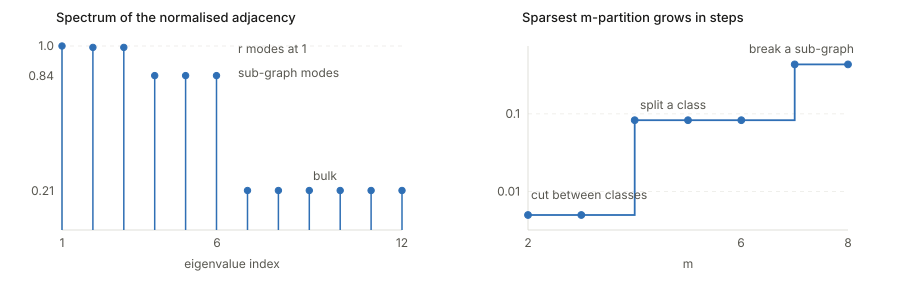

## Links

- **[arXiv:2106.04156](https://arxiv.org/abs/2106.04156)** — preprint. `make fetch` pulls
  the PDF from here.
- **[NeurIPS 2021 proceedings](https://papers.nips.cc/paper/2021/hash/27debb435021eb68b3965290b5e24c49-Abstract.html)**
- **[Inequalities and concentration](../inequalities-and-concentration/index.html)** — background page collecting the tools
  these proofs run on (Cheeger, Donsker–Varadhan, Rademacher, Davis–Kahan and the rest).

Jeff Z. HaoChen, Colin Wei, Adrien Gaidon and Tengyu Ma, *Provable Guarantees for
Self-Supervised Deep Learning with Spectral Contrastive Loss*, NeurIPS 2021.

This is the foundational paper for the augmentation-graph line of analysis. Both
[Zhang et al. 2026](../2026-zhang-difficult-examples/index.html) and the finite-sample
machinery reused elsewhere in this repo build directly on it.

## In one paragraph

Prior theory for contrastive learning assumed the two views of an example are roughly
independent given the label — which is plainly false, since two crops of the same dog are
far more alike than two random dogs. This paper drops that assumption entirely and replaces
it with a *connectivity* assumption on a graph. Build the **population augmentation graph**:
vertices are all augmented images, and two are joined if they can be augmentations of the
same natural image. Then classes are nearly disconnected components, and within a class
there may be sub-graphs (breeds). The paper shows that the minimiser of a simple quadratic
loss — the **spectral contrastive loss** — recovers the top eigenvectors of this graph's
normalised adjacency matrix up to a harmless linear transformation, and that a linear probe
on those eigenvectors has error $\tilde O(\alpha/\rho_{\lfloor k/2 \rfloor}^2)$. The bound
says something practical: the feature dimension must exceed roughly twice the number of
sub-graphs, or the guarantee is vacuous.

## The spine of the argument

1. Define the population augmentation graph. Connectivity replaces conditional independence.
2. Spectral clustering of that graph would give good embeddings — but they are
   non-parametric, one $k$-vector per augmented point, and $|\mathcal{X}|$ is exponential.
3. Recast eigendecomposition as **matrix factorisation**, $\min \lVert \bar A - FF^\top\rVert_F^2$,
   which decomposes into terms over *pairs of rows*.
4. Reparametrise row $x$ as $\sqrt{w_x}\, f(x)$ for a neural net $f$. The objective becomes
   the spectral contrastive loss — a population quantity with an unbiased finite-sample
   estimator. This is the pivotal move: **a global spectral problem becomes a local,
   sample-based loss.**
5. Lemma 3.1 says the resulting slack (a diagonal rescaling and an invertible $Q$) does not
   affect linear-probe accuracy, so recovering eigenvectors *up to that slack* is enough.
6. Assume few cross-class edges ($\alpha$ small) and that the graph cannot be chopped into
   many pieces cheaply ($\rho_m$ large for $m$ beyond the sub-graph count). Theorem 3.7
   converts these into a linear-probe bound.
7. Standard Rademacher concentration lifts the population result to finite samples
   (Theorems 4.1, 4.2), and margin-free capped-quadratic analysis handles the probe itself
   (Theorem 5.1).

## Setup and notation

| Symbol | Meaning |
|---|---|
| $\bar x \sim P_{\bar{\mathcal{X}}}$ | a natural (un-augmented) data point |
| $A(\cdot \mid \bar x)$ | augmentation distribution |
| $\mathcal{X}$, $N$ | set of all augmented data and its size; finite but exponentially large |
| $y(\bar x) \in [r]$ | ground-truth label; $r$ downstream classes |
| $w_{xx'}$ | edge weight $\mathbb{E}_{\bar x}[A(x\mid \bar x)A(x'\mid\bar x)]$; sums to 1 |
| $w_x$ | degree $\sum_{x'} w_{xx'}$ |
| $A$, $D$, $\bar A$ | adjacency, degree $\operatorname{diag}(w_x)$, normalised $D^{-1/2}AD^{-1/2}$ |
| $\lambda_i$, $v_i$ | $i$-th largest eigenvalue of $\bar A$ and its unit eigenvector |
| $F^\star = [v_1,\dots,v_k]$ | the **eigenvector matrix**; row $u_x^\star$ is the ideal embedding of $x$ |
| $f : \mathcal{X} \to \mathbb{R}^k$ | the learned encoder; $\mathcal{F}$ its hypothesis class |
| $k$ | representation dimension |
| $\mathcal{E}(f)$ | **linear probe error** — error of the *best* linear head on $f$'s features |
| $\alpha$ | cross-class leakage: labels recoverable from augmentations up to error $\alpha$ (Asm 3.5) |
| $\phi_G(S)$ | **Dirichlet conductance** of a vertex set $S$ (Def 3.3) |
| $\rho_m$ | **sparsest $m$-partition** (Def 3.4) |
| $m$ | number of parts in a partition; morally the number of sub-graphs |
| $\hat{\mathcal{R}}_n(\mathcal{F})$ | Rademacher complexity of $\mathcal{F}$ on $n$ samples |
| $\kappa$ | uniform bound, $\lVert f(x)\rVert_\infty \le \kappa$ |
| $\Delta$ | eigenvalue gap $\lambda_{\lfloor 3k/4\rfloor} - \lambda_k$ (Thm 4.2) |

## Background: reading a graph spectrum

Everything in this paper and its descendants is an argument about the eigenvalues of
$\bar A$. Worth getting the intuition solid before the theorems.

### The adjacency matrix is an averaging operator

$\bar A$ is not really a table of numbers; it is an operator. Since
$(Ax)_i = \sum_j w_{ij} x_j$, thinking of a vector as assigning a number to every node,
applying $A$ replaces each node's number with the weighted sum of its neighbours'. For the
normalised version it is a genuine *average* — $\bar A$ is similar to the random-walk matrix
$D^{-1}A$. So $\bar A v = \lambda v$ reads:

> this pattern of node-values is reproduced by one round of neighbour-averaging, merely
> scaled by $\lambda$.

That single sentence gives the whole interpretation:

- **$\lambda$ near 1** — the pattern is *smooth* along edges; averaging barely changes it.
  A **slow mode**: diffusion cannot mix it away.
- **$\lambda$ near 0** — the pattern is *rough*, cancelling across edges; averaging
  destroys it. A **fast mode**.
- **$\lambda$ negative** — averaging *flips* the pattern; it oscillates across every edge.

Eigenvalues are decay rates under diffusion; eigenvectors are the things decaying.

### Reading the spectrum from the top

For a normalised adjacency matrix every eigenvalue lies in $[-1,1]$, and:

- **$\lambda_1 = 1$ always**, with eigenvector $D^{1/2}\mathbf{1}$ — essentially the constant
  function, since averaging a constant returns it. It carries no information; this is the
  trivial mode one always discards. (It is why Theorem 3.7 needs $k \ge 2r$ rather than
  $k \ge r$: one dimension is spent on nothing.)
- **The multiplicity of $\lambda = 1$ counts connected components.** Each component supports
  its own locally-constant eigenvector. So $\lambda_2 = 1$ exactly iff the graph is
  disconnected — and $\lambda_2 \approx 1$ iff it is *nearly* disconnected, which is exactly
  Assumption 3.5's picture of classes.
- **$1 - \lambda_2$ is the spectral gap, and it measures bottlenecks.** Cheeger's inequality
  makes this precise: the best possible sparse cut $h$ satisfies
  $\tfrac{1}{2}(1-\lambda_2) \le h \le \sqrt{2(1-\lambda_2)}$. Small gap $\Leftrightarrow$ a
  good cut exists $\Leftrightarrow$ the graph almost falls apart. This is the link between
  the spectral quantities and the combinatorial $\rho_m$ below.
- **$\lambda_2$'s eigenvector says *where* to cut** (the Fiedler vector): signs give the
  bipartition, magnitudes give confidence. Points near zero are the ambiguous ones — which
  is precisely what a boundary example is.
- **For $m$ clusters, look at the top $m$ eigenvalues.** A clear drop after $\lambda_m$ means
  $m$ well-separated clusters, and stacking those $m$ eigenvectors as columns embeds each
  node into $\mathbb{R}^m$ with the clusters pulled apart. That embedding *is* $F^\star$.
- **The bottom end encodes bipartiteness:** $\lambda_{\min} = -1$ iff a component is
  bipartite, its eigenvector flipping sign across every edge.

A convention note: the paper's lemmas use the normalised Laplacian $L = I - \bar A$, whose
eigenvalues are $1 - \lambda_i$ in $[0,2]$. "Smallest eigenvectors of $L$" and "largest of
$\bar A$" name the same objects.

### What else a spectrum knows

| Quantity | What it tells you |
|---|---|
| $\operatorname{tr}(A^2)$ | twice the number of edges |
| $\operatorname{tr}(A^3)$ | six times the number of triangles; generally $\operatorname{tr}(A^\ell)$ counts closed walks of length $\ell$ |
| $\lambda_1$ of *unnormalised* $A$ | between the average and maximum degree; the effective branching factor, and $1/\lambda_1$ is the epidemic threshold |
| top eigenvector of $A$ | eigenvector centrality — the ancestor of PageRank |
| number of distinct eigenvalues | at least $\text{diameter} + 1$ |
| a *localised* eigenvector | concentrated on few nodes, signalling a hub or dense subgraph rather than global structure |

The limitation worth knowing: the spectrum is invariant to relabelling, so it is a genuine
graph invariant — but **not a complete one**. Non-isomorphic cospectral graphs exist. The
spectrum knows a great deal, not everything.

### The picture, on this paper's own assumptions

Below is a graph built to match Assumption 3.5: $r = 3$ classes that are nearly disconnected
from each other ($w \approx 0.0008$ across classes), each split into two sub-graphs — think
breeds — that are connected to each other only weakly ($w = 0.05$), with strong connections
inside a sub-graph ($w = 0.45$). Twenty-four augmented points in total.

<figure>

<figcaption><b>Left:</b> the spectrum stratifies into exactly the structures in the graph. Three
eigenvalues sit at essentially 1 (1, 0.9925, 0.9925) — one trivial plus the $r-1$ class
modes, because the classes are nearly disconnected components. Three more sit at 0.8389 —
the sub-graph splits, slow but not <i>that</i> slow, since the breeds are weakly joined.
Then a cliff to a bulk at 0.2146. <b>The number of eigenvalues near 1 counts the clusters, and
how near they are measures how separated.</b> <b>Right:</b> the same structure seen
combinatorially. Conductance of the natural $m$-way partition stays at 0.0050 up to
$m = 3$ (cut along class boundaries, almost free), jumps 16× to 0.0830 once a class must be
split into breeds, and jumps 5× again to 0.4342 once a breed itself must be broken.</figcaption>
</figure>

The two panels are the same fact twice, which is what Cheeger's inequality asserts: flat
regions of $\rho_m$ correspond to eigenvalues clustered near 1, and each jump in $\rho_m$
corresponds to a cliff in the spectrum.

## Lemma 3.1: why "up to a linear transformation" costs nothing

**Statement.** For an embedding matrix $F \in \mathbb{R}^{N \times k}$, a diagonal $D$ with
*positive* entries and an invertible $Q \in \mathbb{R}^{k\times k}$, set
$\tilde F = D \cdot F \cdot Q$. Then any linear classifier $B$ on $F$ has a counterpart
$\tilde B = Q^{-1}B$ on $\tilde F$ making identical predictions, so

$$
\mathcal{E}(F) = \mathcal{E}(\tilde F).
$$

**Why it is needed.** By Eckart–Young–Mirsky, a minimiser of
$\lVert \bar A - FF^\top\rVert_F^2$ is not the eigenvector matrix itself but

$$
\hat F = F^\star \cdot \operatorname{diag}\big(\sqrt{\lambda_1},\dots,\sqrt{\lambda_k}\big)\, Q
$$

for some orthonormal $Q$ — the factorisation is only determined up to a right rotation, and
the eigenvalue scaling comes along too. On top of that, the reparametrisation
$u_x = \sqrt{w_x}\,f(x)$ multiplies row $x$ by $\sqrt{w_x}$, a positive diagonal. So what is
actually recovered is the eigenvector matrix pre-multiplied by a positive diagonal and
post-multiplied by an invertible matrix. Lemma 3.1 says that is fine.

**Why it is true, in one line each.**

- *Right multiplication by $Q$.* A linear probe computes $B^\top u_x$. Replacing
  $u_x \mapsto Q^\top u_x$ and $B \mapsto Q^{-1}B$ leaves $B^\top u_x$ unchanged. The probe
  simply absorbs $Q$, and it can, because $Q$ is invertible and the probe is unconstrained.
- *Left multiplication by positive diagonal $D$.* This scales each *row* — each data point's
  embedding — by a positive number $s_x > 0$. Prediction is
  $\arg\max_{i} (B^\top u_x)_i$, and scaling a vector by a positive scalar does not change
  which coordinate is largest. The argmax is scale-invariant.

**The conditions matter.** Positivity of the diagonal is essential: a negative $s_x$ would
flip the argmax. Invertibility of $Q$ is essential: a rank-deficient $Q$ would destroy
directions the probe needs.

**The caveat.** This is about the *0-1 error of the best linear head*, nothing more. The
rescaling does change margins, norms and the value of any surrogate loss — which is exactly
why Theorem 5.1 needs separate work to control the *learned* probe rather than the best one.

## Figure 1 (right): the decomposition of learned representations

The right panel is one equation drawn as matrices. Read it right to left.

$$
\underbrace{\begin{bmatrix} f(x_1)^\top \\ f(x_2)^\top \\ \vdots \end{bmatrix}}_{\text{learned features}}
\;\;=\;\;
\underbrace{\begin{bmatrix} s_{x_1} \\ s_{x_2} \\ \vdots \end{bmatrix}}_{\text{positive scalars}}
\;\odot\;
\underbrace{\big[\,v_1 \;\; v_2 \;\; \cdots \;\; v_k \,\big]}_{F^\star,\ \text{top eigenvectors}}
\;\cdot\;
\underbrace{Q}_{\text{invertible}}
$$

Component by component:

- **The rightmost block, "Features".** One row per augmented point, $f(x_i)^\top$. This is
  what the network actually outputs after minimising the population spectral contrastive
  loss. In the figure the rows are bracketed and labelled *Brittanys*, *Beagles*, *Birmans* —
  the sub-classes, not the downstream classes. That labelling is the point: the structure the
  features acquire is *sub-graph* structure.
- **The "Eigenvectors" block, $F^\star$.** Columns are $v_1, \dots, v_k$, the top eigenvectors
  of $\bar A$. Row $x$ is the ideal spectral embedding $u_x^\star$. The figure draws this
  block with visible sparse vertical bands, and the caption explains why: *when sub-classes
  are exactly disconnected, the eigenvectors are sparse and align with the sub-class
  structure.* Each near-component contributes a near-indicator eigenvector supported on that
  component — which is the "multiplicity of $\lambda=1$ counts components" fact from the
  background section, seen in the eigenvectors rather than the eigenvalues.
- **The $\odot$ with the column of $s_{x_i}$.** Row-wise scaling, each row by its own positive
  scalar. It absorbs both the $\sqrt{w_x}$ from the reparametrisation and the
  $\sqrt{\lambda_i}$ eigenvalue scaling. The caption stresses $s_{x_i} > 0$ for every $x_i$ —
  that is precisely the positivity hypothesis Lemma 3.1 needs.
- **The $Q$ block.** An arbitrary invertible mixing of the $k$ coordinates. The network has
  no reason to output the eigenvectors in any particular basis, and this is the freedom the
  factorisation leaves. Lemma 3.1 makes it harmless.

**What the figure is arguing.** The learned representation is not *approximately* spectral
and not *inspired by* spectral clustering. It is exactly the spectral embedding, composed
with two transformations that a linear probe cannot see. So any statement provable about
spectral clustering transfers to the trained network — which is the licence for the whole
rest of the paper.

Two practical readings follow. Individual coordinates of $f(x)$ are *not* interpretable,
because $Q$ scrambles them arbitrarily; only the span is determined. And the norm
$\lVert f(x)\rVert$ carries $s_x$, i.e. graph degree information, not semantics — one reason
practitioners normalise features before use and lose nothing by it.

## Dirichlet conductance and sparsest $m$-partition

These two definitions are how the paper converts "the data is continuous within a class"
into something a theorem can consume.

**Dirichlet conductance (Def 3.3).** For a vertex set $S$,

$$
\phi_G(S) := \frac{\sum_{x \in S,\, x' \notin S} w_{xx'}}{\sum_{x\in S} w_x}
$$

— *of all the edge weight touching $S$, what fraction leaves?* It is a leakage rate, in
$[0,1]$. Near 0 means $S$ is nearly a closed component; near 1 means $S$ is barely held
together relative to its outside connections. The paper notes the degenerate case: for a
singleton $\{x\}$, $\phi_G = 1$, because $w_x$ counts the self-loop too. Singletons are
maximally leaky, which matters below.

**Sparsest $m$-partition (Def 3.4).**

$$
\rho_m := \min_{S_1,\dots,S_m} \max\{\phi_G(S_1),\dots,\phi_G(S_m)\}
$$

over partitions of $\mathcal{X}$ into $m$ non-empty parts. The $\max$ inside asks for the
*worst* (leakiest) part — so no part is allowed to be a bad cluster — and the $\min$ outside
picks the best such partition. So: **$\rho_m$ is the cost of the cheapest way to break the
graph into $m$ decent pieces.**

Reading the two quantifiers in the right order is the whole trick. $\rho_m$ **small** means a
good $m$-way split exists. $\rho_m$ **large** means *every* $m$-way split has at least one
badly leaky part — the graph refuses to be cut that finely.

**How they enter the theorems.** The bound is
$\mathcal{E}(f^\star_{\text{pop}}) \le \tilde O(\alpha/\rho_{\lfloor k/2\rfloor}^2)$, so a
*large* $\rho_{\lfloor k/2\rfloor}$ is what makes the guarantee good. The logic:

1. $\rho_r \approx 0$ — augmentations from different classes nearly form a disjoint $r$-way
   partition, so cutting along class boundaries is almost free. This is *not* used as the
   good case; it is the statement that class structure exists.
2. For $m > r$ we want $\rho_m$ **large**. If a class contains $t$ well-connected sub-graphs,
   any $(t+1)$-way partition must split one sub-graph, incurring constant conductance. So
   $\rho_{t+1} = \Omega(1)$.
3. The bound uses $m = \lfloor k/2\rfloor$. **Raising $k$ lets you invoke a larger $m$, and
   larger $m$ means larger $\rho_m$, hence a better bound.** That is the mechanism behind the
   dimension requirement: $k$ must be big enough that $\lfloor k/2\rfloor$ exceeds the number
   of sub-graphs.
4. The singleton fact caps the whole thing usefully: $\rho_N = 1$, so $\rho_m$ increases to 1
   and there is nothing to gain past $m = N$.

On the toy graph in the figure above ($r=3$, six sub-graphs), the bound multiplier
$1/\rho_{\lfloor k/2\rfloor}^2$ behaves like this:

| $k$ | $\lfloor k/2 \rfloor$ | $\rho_{\lfloor k/2\rfloor}$ | bound $\approx$ |
|---|---|---|---|
| 6 | 3 | 0.0050 | $40{,}000\,\alpha$ — vacuous |
| 8 | 4 | 0.0830 | $145\,\alpha$ |
| 12 | 6 | 0.0830 | $145\,\alpha$ |
| 14 | 7 | 0.4342 | $5.3\,\alpha$ |

A 7500-fold improvement from $k=6$ to $k=14$, and the jumps land exactly where the partition
is forced to start breaking sub-graphs. This is why the paper's headline advice —
representation dimension must exceed roughly twice the number of sub-graphs — is a real
prediction rather than a technical artefact.

## Theorem 3.7, broken down

**Statement.** Assume $k \ge 2r$ and Assumption 3.5 holds with parameter $\alpha > 0$. Let
$\mathcal{F}$ satisfy realizability (Asm 3.6) and let $f^\star_{\text{pop}} \in \mathcal{F}$
minimise the population spectral contrastive loss. Then

$$
\mathcal{E}(f^\star_{\text{pop}}) \;\le\; \tilde O\!\left(\frac{\alpha}{\rho_{\lfloor k/2\rfloor}^2}\right).
$$

Four pieces, each worth reading on its own.

**The quantity being bounded, $\mathcal{E}(f)$.** Not the training loss, and not the error of
some particular classifier: the error of the **best possible linear head** on the learned
features (Eq. 1). So the theorem is a statement about *linear separability* of the
representation — are the classes linearly recoverable at all. It says nothing yet about
whether a learned probe finds that head; Theorem 5.1 handles that.

**The numerator $\alpha$: how much the classes leak.** Assumption 3.5 says some classifier
recovers $y(\bar x)$ from a single augmentation $x$ with error at most $\alpha$. Equivalently,
two examples from different classes can rarely be augmented to the same point — few
cross-class edges. Error is *proportional* to $\alpha$, which gives the clean limiting case
the paper highlights: **if $\alpha = 0$, the bound is zero and recovery is exact.** So the
theorem degrades gracefully rather than having a floor. Note $\alpha$ is a property of the
augmentation strength, not of $k$: too-aggressive augmentation that blends cats into dogs
raises $\alpha$ irreducibly.

**The denominator $\rho_{\lfloor k/2\rfloor}^2$: how stubbornly connected the graph is.** From
the previous section, large is good, and $k$ buys you a larger index. The *square* is a
Cheeger-type artefact — conductance controls spectral gaps only up to squaring, so the
quadratic dependence is the usual price of going from combinatorics to spectra, not a
statement about the data. The [foundations page](../inequalities-and-concentration/index.html#cheegers-inequality)
checks numerically just how loose that direction is.

**Why $k \ge 2r$ and not $k \ge r$.** Two dimensions are spent on overhead. One goes to the
trivial eigenvector $\lambda_1 = 1$, which carries no information. The rest is the analysis
needing room beyond the bare $r$ class directions to linearly separate them — the appendix
generalises $\lfloor k/2\rfloor$ to any constant fraction of $k$, which says the factor 2 is
a proof convenience rather than a sharp threshold.

**How to read it overall.** *Error $\lesssim$ (how much classes bleed together) / (how hard
the graph is to over-partition)².* The numerator is set by your augmentation pipeline; the
denominator by the data's intrinsic connectivity and your choice of $k$. The only knob is
$k$, and the theorem says: make it comfortably larger than twice the number of distinct
sub-populations you believe exist.

**What it does not say.** Nothing about optimisation — $f^\star_{\text{pop}}$ is *assumed* to
be a global minimiser, via Assumption 3.6. Nothing about whether SGD finds it. And
$\rho_{\lfloor k/2\rfloor}$ is not computable for real data, so the bound is explanatory, not
a number you can evaluate. Section 3.4 partly answers this by instantiating it on a mixture
of manifolds (Example 3.8, Theorem 3.9), where $\rho_{\lfloor k/2\rfloor} \gtrsim \sigma/\sqrt d$
and the whole bound becomes $\tilde O(1/(\sigma^2 \cdot \text{poly}(d)))$ — non-trivial even
when the augmentation noise $\sigma$ is polynomially small, i.e. much weaker than the data
scale.

## Finite-sample generalization bounds

Section 3 is entirely about the *population* loss. Sections 4 and 5 close the three gaps
between that and a real pipeline. It is worth naming them separately, because the paper's
guarantee is a chain and each link is a different theorem.

### Gap 1: finite unlabeled data → population loss (Theorem 4.1)

The empirical loss $\hat{\mathcal{L}}_n(f)$ (Section 4) is an **unbiased** estimator of
$\mathcal{L}(f)$ — this is why the quadratic form matters, and it is where the spectral loss
decisively beats InfoNCE, whose batch denominator makes it biased at finite batch size. The
negative-pair term uses the $n(n-1)$ distinct ordered pairs $i \ne j$ precisely to keep it
unbiased.

Given that, ordinary uniform convergence applies. With
$\lVert f(x)\rVert_\infty \le \kappa$ and $\hat f_{\text{emp}}$ minimising the empirical loss,
with probability $1-\delta$:

$$
\mathcal{L}(\hat f_{\text{emp}}) \;\le\; \mathcal{L}(f^\star_{\text{pop}}) + c_1 \hat{\mathcal{R}}_{n/2}(\mathcal{F}) + c_2\sqrt{\frac{\log 2/\delta}{n}},
$$

with $c_1 \lesssim k^2\kappa^2 + k\kappa$ and $c_2 \lesssim k\kappa^2 + k^2\kappa^4$. Read the
constants: they grow **polynomially in $k$ and $\kappa$**, because the loss involves products
of two $k$-dimensional bounded vectors, so the effective range scales like $k\kappa^2$ and
the squared term like $k^2\kappa^4$. Rademacher complexity $\hat{\mathcal{R}}_n(\mathcal{F})$
is extended to vector outputs by taking the worst coordinate. Plug in any off-the-shelf bound
for your architecture; the paper does ReLU nets in Section E.2.

### Gap 2: near-optimal loss → near-optimal linear probe (Theorem 4.2)

Theorem 4.1 gives a small *excess loss* $\epsilon$, not a small error. Getting from one to
the other is genuinely non-trivial: a tiny loss perturbation could in principle rotate the
learned subspace a lot, if the eigenvalues involved are nearly tied. So a **spectral gap**
condition appears. Assuming $k \ge 4r+2$ and $\mathcal{L}(\hat f_{\text{emp}}) < \mathcal{L}(f^\star_{\text{pop}}) + \epsilon$
with $\epsilon < \Delta/k^2$:

$$
\mathcal{E}(\hat f_{\text{emp}}) \;\lesssim\; \frac{\alpha}{\rho_{\lfloor k/2\rfloor}^2}\log k \;+\; \frac{k\epsilon}{\Delta}, \qquad \Delta := \lambda_{\lfloor 3k/4\rfloor} - \lambda_k .
$$

The first term is Theorem 3.7. The second is the price of imperfect optimisation, and it is
**linear in $\epsilon$** — the reassuring conclusion, since it means no catastrophic
amplification. But it is divided by $\Delta$: if the eigenvalues between indices $3k/4$ and
$k$ are bunched together, the learned subspace is ill-determined and the penalty blows up.
This is standard eigenspace perturbation (Davis–Kahan in spirit) surfacing in the bound.
Note $k \ge 4r+2$, stricter than Theorem 3.7's $k \ge 2r$: the room between $3k/4$ and $k$
has to exist for $\Delta$ to be meaningful.

### Gap 3: best linear probe → learned linear probe (Theorem 5.1)

Theorem 3.7 promises a *good linear head exists*. Fitting one from labelled data is another
matter, and the obstacle the paper flags is honest: a 0-1 error guarantee says nothing about
the **margin**, so margin-based generalisation theory cannot be invoked. Their fix is to
sidestep margins entirely and fit a **capped quadratic loss**,

$$
\ell((z, y), B) := \sum_{i=1}^{r} \min\Big\{\big(B^\top z - \vec y\big)_i^2,\, 1\Big\},
$$

with $\vec y$ the one-hot label. Capping bounds the loss so concentration applies. With a
norm constraint $\lVert B\rVert_F \le 1/C$ and $n$ labelled examples:

$$
\Pr\big[\bar g_{f^\star,\hat B}(\bar x) \ne y(\bar x)\big] \;\lesssim\; \frac{\alpha}{\rho_{\lfloor k/2\rfloor}^2}\log k \;+\; \frac{r}{C}\sqrt{\frac{k}{n}} \;+\; \sqrt{\frac{\log 1/\delta}{n}}.
$$

First term: the population error from Theorem 3.7. Last two: ordinary $\sqrt{k/n}$
generalisation gap for linear classification. The paper's own observation is the one to keep:
this exposes a **trade-off in $k$**. Larger $k$ *shrinks* the first term (bigger
$\rho_{\lfloor k/2\rfloor}$) but *grows* the third (more parameters to fit from $n$ labels).
So $k$ should be large but not unboundedly so — and unlike the population theory, which
always prefers bigger $k$, the full chain has an interior optimum. The stated difficulty of
the proof is exhibiting a small-norm $B$ with small population quadratic loss, which does
not follow from a 0-1 guarantee.

**The chain, assembled.** Minimise the empirical spectral loss on $n$ unlabeled samples
(Thm 4.1 → small excess loss $\epsilon$) → features are nearly the top eigenvectors
(Thm 4.2 → linear probe error $\approx$ population value $+\, k\epsilon/\Delta$) → fit a
capped-quadratic probe on labelled data (Thm 5.1 → learned probe error $+\,O(\sqrt{k/n})$).
Sample complexity is polynomial in the Rademacher complexity, $k$, $\kappa$ and $1/\Delta$
throughout.

## Questions and doubts

- **$\rho_m$ is not estimable.** The whole guarantee is parametrised by a quantity requiring
  a minimum over all $m$-way partitions of an exponentially large graph — NP-hard even to
  approximate well in general. Section 3.4 instantiates it for one synthetic family; for real
  image data the bound cannot be evaluated, only believed.
- **The factor-of-2 in $\lfloor k/2\rfloor$ is soft.** The appendix relaxes it to any constant
  fraction, which means the "$k$ must exceed twice the sub-graph count" headline is really
  "$k$ must exceed a constant multiple", with the constant unpinned.
- **Realizability (Asm 3.6) is strong and load-bearing.** It assumes a *global* minimiser of
  the population loss lies in $\mathcal{F}$. The paper notes it can be relaxed to approximate
  realizability at the cost of an extra term, but the size of that term for real networks is
  not characterised. No optimisation analysis anywhere.
- **The augmentation graph is a population object over an exponentially large vertex set.**
  Whether finite-sample empirical graphs approximate its spectrum is not addressed; the
  finite-sample results concern the *loss*, and route around the graph rather than
  approximating it.
- **$\Delta$ in Theorem 4.2 could plausibly be tiny.** For a graph whose spectrum has a long
  flat bulk — which is exactly what the toy example and the Zhang paper's construction both
  exhibit — $\lambda_{\lfloor 3k/4\rfloor} - \lambda_k \approx 0$ and the $k\epsilon/\Delta$
  term dominates everything. The paper does not discuss when $\Delta$ is safely bounded away
  from zero.
- **Assumption 3.5's $\alpha$ conflates two things:** genuinely ambiguous images, and
  over-aggressive augmentation. Both raise $\alpha$, but only the second is under the
  practitioner's control, and the theory cannot separate them.

## Takeaways

- The conceptual contribution outlasts the bounds: **contrastive learning is spectral
  clustering of the augmentation graph**, exactly and not by analogy, and the bridge is the
  matrix-factorisation identity plus Lemma 3.1.
- Replacing conditional independence with graph connectivity is the right move. It matches
  what augmentations actually do, and it accommodates sub-classes — downstream labels need
  only be a coarsening of the sub-graph partition, not aligned with it.
- The actionable prediction is the dimension requirement: $k$ must exceed a constant multiple
  of the number of distinct sub-populations, not the number of downstream classes. This
  explains why practitioners find large projection dimensions help on diverse data.
- Theorem 5.1 exposes a genuine trade-off in $k$ that the population theory hides: bigger $k$
  improves the representation but costs labelled-sample efficiency in the probe.
- The quadratic repulsion is not just analytically convenient — it makes the empirical loss
  an *unbiased* estimator of the population loss, which is what lets standard concentration
  close the finite-sample gap. That is a concrete advantage over InfoNCE, and the experiments
  report comparable accuracy to SimCLR without needing large batches.
