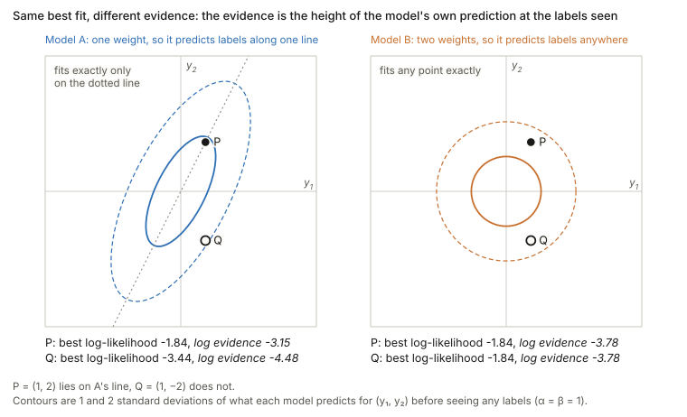

## Links

- **[arXiv:2102.11005](https://arxiv.org/abs/2102.11005)** — preprint; ICML 2021, PMLR 139.
  Code at [thuml/LogME](https://github.com/thuml/LogME).
- The measures it generalises past:
  [Tran 2019 — NCE](../2019-tran-nce-hardness/index.html),
  [Nguyen 2020 — LEEP](../2020-nguyen-leep/index.html),
  [Bao 2019 — H-score](../2019-bao-hscore-transferability/index.html),
  and the label-free [Diniz 2026 — PAS](../2026-diniz-pas/index.html).
- **[Chaves 2023 — medical TE](../2023-chaves-medical-transferability/index.html)** —
  evaluates this score on medical targets, including out-of-distribution ones.
- **[Claßen 2026 — TE robustness](../2026-classen-te-robustness/index.html)** — benchmarks
  LogME among others on medical targets.
- **[Shao 2022 — SFDA](../2022-shao-sfda/index.html)** — the measure that imitates
  fine-tuning dynamics rather than scoring a static representation.
- **[Achille 2019 — task reachability](../2019-achille-task-reachability/index.html#transferability-scores-use-only-features-open-weight-models-come-without-data)** — LogME's evidence is exactly that paper's task complexity $\min_QC_\beta$, restricted to a linear head on frozen features (at $\beta=1$ with a summed loss). The paper's static distance is the *extra* complexity of the target on top of the source, and its dynamic factor, whether SGD can reach the target solution, is what no frozen-feature score sees. The linked section compares all the scores here.
- **[Runnable code](https://github.com/msrepo/theory_inclined_papers_with_annotations/blob/main/papers/2021-you-logme/code/logme.py)** —
  Eq. 2 against an independent derivation, the fixed point against a grid search, $\gamma$
  spanning $[0,D]$, the $D>n$ table that is the whole argument for the method, and Figure 2
  run forwards as a sampler (labels correlated through $w$ exactly as far as the features
  overlap), and the over-fitting paragraph in two dimensions (same best fit, different
  evidence). `make verify` runs it; `python3 logme.py --figures` redraws both figures.
- **[Column, null & residual spaces](../four-fundamental-subspaces/index.html)** — why that table happens: with $D\ge n$ the
  column space is all of $\mathbb R^n$, and residual degrees of freedom $n-p$, which $\gamma$ generalises.

## In one paragraph

[LEEP](../2020-nguyen-leep/index.html) and [NCE](../2019-tran-nce-hardness/index.html) both need
a pre-trained *classification head* and categorical source labels, which rules out contrastive
models, language models and regression targets — four of five settings in the paper's own Table
1. LogME uses **only the feature extractor**: freeze the features, put a Bayesian linear model on
top, and report the **marginal likelihood** of the target labels with the weights integrated out.
Using the evidence rather than the likelihood at a fitted $w$ is the entire idea, because the
evidence charges for the volume of parameter space a fit consumes and so does not reward a
feature set that can fit anything. Maximising it over the two hyperparameters is a classic
MacKay fixed point, and a careful reorganisation of the linear algebra turns an $O(D^3)$ inner
loop into $O(D^2)$, which is where the headline $3000\times$ speedup comes from.

## The spine of the argument

1. Prior work needs a source classification head. Drop that requirement and only the features
   remain, which is what makes the method general.
2. Score the features by how well a *linear* model on them predicts the target labels.
3. Do not fit that linear model — **integrate it out**. The likelihood over-fits; the evidence
   does not.
4. The two remaining hyperparameters are fixed by evidence maximisation, which alternates in
   closed form.
5. Reorganise the algebra so the expensive part happens once, outside both loops.

## Setup and notation

| Symbol | Meaning |
|---|---|
| $\phi$ | the frozen pre-trained feature extractor — **all** that is used |
| $F\in\mathbb{R}^{n\times D}$ | features $f_i=\phi(x_i)$ of the $n$ target points |
| $y\in\mathbb{R}^n$ | target labels (one column; $K$ columns for classification) |
| $\alpha$ | precision of the weight prior, $w\sim\mathcal{N}(0,\alpha^{-1}I)$ |
| $\beta$ | precision of the observation noise |
| $A=\alpha I+\beta F^\top F$ | posterior precision |
| $m=\beta A^{-1}F^\top y$ | posterior mean |
| $\sigma_i$ | eigenvalues of $F^\top F$ |
| $\gamma$ | effective number of well-determined parameters |

## The model, and why evidence rather than likelihood

$$
w\sim\mathcal{N}(0,\alpha^{-1}I),
\qquad
y_i\mid f_i,w,\beta\ \sim\ \mathcal{N}(w^\top f_i,\ \beta^{-1})
$$

The paper gives no legend for its Figure 2, so this is the usual reading: shaded nodes are observed, the open black node $w$ is latent, and the two blue circles $\alpha$ and $\beta$ are hyperparameters — numbers with no prior of their own. That is the reading consistent with Equation 1, which integrates over $w$ alone; $\alpha$ and $\beta$ are fixed afterwards by maximising the result (below), not integrated. Three things the arrows say:

- **The joint factorises as** $p(w\mid\alpha)\prod_i p(y_i\mid f_i,w,\beta)$. The features $f_i$ have no distribution: they are conditioned on, never modelled. So what the figure computes is $p(y\mid F,\alpha,\beta)$, not $p(y,F)$.
- **Given $w$, the labels are independent.** Each has the same three parents ($w$, its own $f_i$, and $\beta$), which is why the likelihood is a product over points.
- **Integrate $w$ out and they are not.** A shared parent couples its children: $\operatorname{Cov}(y_i,y_j)=f_i^\top f_j/\alpha$ for $i\ne j$, the off-diagonal part of the $\alpha^{-1}FF^\top+\beta^{-1}I$ used in the check below. The graph shows that a connection exists, not how strong it is, and the strength is the overlap of the two features. Sampling 400,000 draws from the graph as drawn ($\alpha=2$, $\beta=5$, item 5 of the script) reproduces that matrix to within 0.0011. Two identical features give correlation 0.714, and two orthogonal ones give 0 (0.001 sampled): $y_1$ and $y_3$ are connected through $w$ and still uncorrelated, which for a jointly Gaussian pair means independent.

The naive move is to fit $w^*$ by regression and score $p(y\mid F,w^*)$. The paper rejects it in
one sentence — "likelihood is prone to over-fitting" — and that is the load-bearing design
decision of the whole method. Instead, integrate:

$$
p(y\mid F,\alpha,\beta)=\int p(w\mid\alpha)\,p(y\mid F,w,\beta)\,\mathrm{d}w
$$

The evidence does not ask how well the *best* $w$ fits. It asks how much of the prior's
parameter volume fits at all, so a feature set that can fit anything spreads its likelihood thin
and scores badly.

**This is checkable in the regime where it matters most.** With $D>n$, least squares interpolates
*exactly* whatever the features are:

| features | train $R^2$ (max likelihood) | LogME |
|---|---|---|
| the true features | 1.000000 | **−3.4405** |
| half true, half noise | 1.000000 | −3.8112 |
| pure noise | 1.000000 | −3.8485 |

Maximum likelihood calls all three a perfect fit and cannot separate signal from noise at all.
The evidence orders them correctly. That single table is the argument for LogME.

### The paper's paragraph on over-fitting, read slowly

Section 4.1's paragraph makes three moves, and each leans on one symbol.

**The symbols, in words.**

- $p(y\mid F,w)$ is the **likelihood**, a score for one particular guess of the weights: "if the
  weights were exactly $w$, how probable would the labels I actually have be?" Higher means that
  guess explains the labels better.
- $w^*$ is the guess with the highest score, which is what ordinary regression finds. So
  $p(y\mid F,w^*)$ is **the score of the best guess**.
- $p(w)$ is how plausible each guess is *before* seeing any labels: a bell curve centred at zero,
  whose width is set by $\alpha$.
- $\int\cdots\,\mathrm{d}w$ means "add this up over every possible $w$". Weighted by $p(w)$, that
  is an **average of the likelihood over all the guesses**, not its value at the best one.

**Why the best guess over-fits.** $w^*$ is chosen after looking at $y$, like a student who sees
the exam before answering. The more knobs the model has, the better it can match any exam. With
$D\ge n$ the knobs can reproduce the labels exactly whatever the features are, which is why the
table above gives $R^2=1$ to signal and noise alike. So the best-guess score measures how
*flexible* the feature set is as much as how *informative* it is, and a score that cannot tell
the two apart cannot rank pre-trained models.

**What the average asks instead.** Run the graph above forwards: draw $w$ from the prior before
seeing anything, then generate labels from it. How probable is it that this blind process
produces the labels we actually have? A feature set that can produce anything produces any *one*
label vector with small probability, because probability has to be shared out over everything it
could have produced. A feature set whose possible outputs sit near the real labels gets a large
share.

**The smallest example I could find**, with two labels so that it can be drawn. Model A has one
weight, so it can only produce labels along the line $y_2=2y_1$. Model B has two weights and can
produce any labels. The point $P=(1,2)$ is on A's line and $Q=(1,-2)$ is not.

| data | model | best $w$ | best log-likelihood | log evidence |
|---|---|---|---|---|
| $P$ | A (one weight) | 1.00 | −1.84 | **−3.15** |
| $P$ | B (two weights) | (1.00, 2.00) | −1.84 | −3.78 |
| $Q$ | A | −0.60 | −3.44 | −4.48 |
| $Q$ | B | (1.00, −2.00) | −1.84 | **−3.78** |

The evidence is in nats (natural-log units), so a gap of 0.63 means a probability ratio of
$e^{0.63}\approx1.88$.

- **At $P$ both models fit exactly** and the best-fit scores tie. The evidence still prefers A, by
  0.63 nats (a factor of 1.88). A could only produce labels along one line and $P$ happens to lie
  on it, so A had put its probability where the data turned out to be, while B spread the same
  probability over the whole plane.
- **At $Q$ A cannot fit** (−3.44 against −1.84) and the evidence flips: B wins by 0.70 nats (a
  factor of 2.02).
- **Maximum likelihood can never prefer A**, because B contains A and so can never fit worse.
  Only the average can prefer the smaller model, and it does exactly when the smaller model's
  narrower bet was right.

In the picture the evidence is the height of each model's blob at the labels seen. That blob is
$\mathcal{N}(0,\ \alpha^{-1}FF^\top+\beta^{-1}I)$, the same marginal used for the independent
check below; here $\alpha=\beta=1$. Equation 2's Occam factor is this idea with the bookkeeping
done: it charges each model for the share of probability it spent on labels that never happened.

**What the citation does and does not show.** The paper says the over-fitting of likelihood is
"experimentally observed in Supplementary B". That section compares LogME with training a
classification or regression head and scoring the head's accuracy or MSE, and its Figure 7 shows
that correlation can *fall* as the number of hyper-parameter trials grows. It never scores
$p(y\mid F,w^*)$ itself. The likelihood-against-evidence comparison the sentence needs is the
$D>n$ table above (script items 4 and 6), not that supplement.

## Equation 1, and Equation 2 term by term

Expanding the integral, the integrand is Gaussian in $w$, so with
$\int\exp(-\tfrac12w^\top Aw+b^\top w+c)\,\mathrm{d}w=\sqrt{(2\pi)^D/\lvert A\rvert}\,
\exp(\tfrac12b^\top A^{-1}b+c)$ it is closed-form, giving

$$
\mathcal{L}(\alpha,\beta)=\frac n2\log\beta+\frac D2\log\alpha-\frac n2\log 2\pi
-\frac\beta2\lVert Fm-y\rVert^2-\frac\alpha2 m^\top m-\frac12\log\lvert A\rvert
\tag{2}
$$

| term | what it is |
|---|---|
| $\frac n2\log\beta+\frac D2\log\alpha-\frac n2\log2\pi$ | normalising constants of the two Gaussians |
| $-\frac\beta2\lVert Fm-y\rVert^2$ | **data fit** at the posterior mean |
| $-\frac\alpha2m^\top m$ | **prior penalty** on the posterior mean |
| $-\frac12\log\lvert A\rvert$ | **the Occam factor** |

Regrouping makes the structure visible. Since $A=\alpha I+\beta F^\top F\succeq\alpha I$,

$$
\frac D2\log\alpha-\frac12\log\lvert A\rvert
=\frac12\log\frac{\alpha^D}{\lvert A\rvert}
=\frac12\sum_i\log\frac{\alpha}{\alpha+\beta\sigma_i}\ \le\ 0 .
$$

That is the **log Occam factor** — the log-ratio of posterior volume to prior volume, always a
penalty. Every direction in which the data sharply pins a weight costs you. It is exactly what
maximum likelihood lacks, and exactly why the table above works.

### Checked against an independent derivation

Equation 2 routes through the posterior. There is a second route with nothing in common:
integrating $w$ out of $y=Fw+\varepsilon$ analytically gives
$y\sim\mathcal{N}(0,\ \alpha^{-1}FF^\top+\beta^{-1}I)$, a plain multivariate normal density with
no $A$, no $m$ and no determinant of a posterior. The two agree to machine precision across nine
configurations:

| $n$, $D$ | $\alpha$, $\beta$ | Eq. 2 | marginal | diff |
|---|---|---|---|---|
| 200, 15 | 1.0, 1.0 | −338.715622 | −338.715622 | 0.0e+00 |
| 500, 40 | 0.3, 5.0 | −1263.739974 | −1263.739974 | 4.0e−11 |
| **80, 60** | 1.0, 1.0 | −197.306781 | −197.306781 | 2.8e−14 |

The last row matters most: the identity holds where the posterior is the awkward object.

## Choosing $\alpha$ and $\beta$: the fixed point

$m$ and $A$ both depend on $\alpha,\beta$, so maximisation is coupled. The paper uses the
Gull/MacKay alternation:

$$
\gamma=\sum_{i=1}^D\frac{\beta\sigma_i}{\alpha+\beta\sigma_i},
\qquad
\alpha\leftarrow\frac{\gamma}{m^\top m},
\qquad
\beta\leftarrow\frac{n-\gamma}{\lVert Fm-y\rVert^2}
$$

**$\gamma$ is the effective number of well-determined parameters.** Each direction contributes
$\approx1$ when the data dominates the prior there and $\approx0$ when the prior dominates, so
$\gamma\in[0,D]$. Sweeping the noise level at $D=20$:

| noise sd | 0.02 | 0.5 | 3.0 | 20.0 |
|---|---|---|---|---|
| $\gamma$ | 20.000 | 19.862 | 16.542 | 0.001 |

The full range, exactly as the interpretation says. That also makes the $\beta$ update readable:
$\beta^{-1}=\lVert Fm-y\rVert^2/(n-\gamma)$ is the **unbiased noise variance with effective
degrees of freedom** — the familiar $n-p$ of ordinary least squares, with $p$ replaced by
$\gamma$.

The fixed point does reach the maximum: it converges to LogME $-0.959435$ where a $160\times160$
grid over $(\alpha,\beta)$ finds $-0.959439$, and it converges in a handful of iterations,
matching the paper's claim of no more than three.

**LogME** is $\mathcal{L}(\alpha^*,\beta^*)/n$, normalised because the evidence scales linearly
with $n$.

## Classification is an approximation, and worth flagging

Equation 1 is analytic only for a **Gaussian** likelihood. For $K$-way classification the natural
likelihood is categorical and the integral has no closed form, which the paper states (citing
Daunizeau 2017). The workaround: one-hot the labels into $Y\in\mathbb{R}^{n\times K}$, run LogME
independently on each column as a *regression*, and average.

So for classification, **LogME scores a linear-regression-on-indicators fit, not a classifier** —
closer in spirit to LDA than to logistic regression. Two consequences go undiscussed: the $K$
columns are treated as independent when they are constrained to sum to one, so one is redundant;
and there is no error analysis for substituting the Gaussian likelihood.

## Where the speed comes from

| | per iteration | overall |
|---|---|---|
| naive | $O(D^3+nD^2)$ | $O(KD^3+nKD^2)$ |
| optimised | $O(D^2+nD)$ | $O(KD^2+nKD+D^3+nD^2)$ |

With $D\approx10^3$ and $n\approx10^4$ the naive cost is about $10^{13}$ operations, comparable
to just fine-tuning — which would defeat the purpose. The trick is to eigendecompose
$F^\top F=V\operatorname{diag}\{\sigma\}V^\top$ **once**, outside both the $K$-loop and the
convergence loop. Then inside,

$$
A=\alpha I+\beta F^\top F=V\Lambda V^\top,\quad \Lambda=\operatorname{diag}\{\alpha+\beta\sigma\},
\qquad
m=\beta\big(V(\Lambda^{-1}(V^\top(F^\top y)))\big)
$$

Two separate savings: the $O(D^3)$ inversion becomes a reciprocal of a diagonal, and
right-to-left association turns every matrix–matrix product into matrix–vector. Only $\Lambda$
changes between iterations. That is the $10^2$ factor; not fine-tuning at all supplies the rest
of the claimed $3000\times$ wall-clock speedup at about 1% of the memory.

## An edge case the paper does not mention

When the features can interpolate the labels — $D>n$, or a wide backbone against a small target —
$\gamma\to n$ and $\lVert Fm-y\rVert^2\to0$ **together**, so
$\beta=(n-\gamma)/\lVert Fm-y\rVert^2$ becomes $0/0$ and the iteration walks into `NaN`. This is
not an implementation slip: the evidence genuinely diverges as $\beta\to\infty$ with zero
residual. The code here caps $\beta$, which keeps the score finite and correctly ordered, but the
raw fixed point needs a guard. Worth knowing before running LogME with a 2048-dimensional
backbone against a few hundred target images — which is precisely the medical-imaging regime
of [Claßen et al.](../2026-classen-te-robustness/index.html)

## Against the other measures

| | needs | regression | contrastive / LM sources |
|---|---|---|---|
| [NCE](../2019-tran-nce-hardness/index.html) | two label sequences, shared inputs | ✗ | ✗ |
| [LEEP](../2020-nguyen-leep/index.html) | source **softmax** + target labels | ✗ | ✗ |
| [H-score](../2019-bao-hscore-transferability/index.html) | features + target labels | ✗ | ✓ |
| **LogME** | features + target labels | **✓** | **✓** |
| [PAS](../2026-diniz-pas/index.html) | features + **no** target labels | ✗ | ✓ |

LogME is much closer to H-score than to LEEP or NCE — both score frozen features against target
labels without training. The difference is in kind: **H-score is a discriminative second-order
statistic (the Fisher ratio); LogME is a generative marginal likelihood.**

One connection worth drawing. H-score inverts $\Sigma_T$ and collapses sharply once $n\lesssim k$
— a transition measured in [the Claßen notes](../2026-classen-te-robustness/index.html), where
rank stability goes *negative* below the boundary — and Ibrahim et al. proposed shrinkage to fix
it. **LogME's $\alpha$ is exactly a learned ridge regulariser**, fitted by evidence maximisation
rather than chosen. So LogME should degrade more gracefully in the small-$n$ regime where
H-score breaks, which is a concrete prediction and is consistent with what that benchmark found.

## Questions and doubts

- **Classification is a Gaussian approximation to a categorical problem**, adopted because the
  real integral is not analytic. No error analysis, and the $K$ one-hot regressions are treated
  as independent despite the simplex constraint.
- **No convergence guarantee.** The MacKay alternation is applied to a coupled non-concave
  problem, justified entirely by "empirically converges with no more than three iterations". It
  did converge cleanly everywhere I tried, but nothing rules out multimodality.
- **The cited evidence for "likelihood over-fits" is about something else.** Section 4.1 points to
  Supplementary B, which compares LogME with re-training a head and scoring its accuracy or MSE
  (Figure 7: correlation can fall as hyper-parameter trials grow). That is over-fitting of a tuned
  head's validation score, not of $p(y\mid F,w^*)$, which no experiment I could find in the paper
  scores. I read the supplement as extracted text, including the Figure 7 caption, not the plotted points.
  The claim is true and easy to show — the $D>n$ table does it — but the paper does not.
- **The interpolating regime is undefined**, as above, and unremarked.
- **It scores a linear head on frozen features.** If you intend to fine-tune the whole network,
  the quantity estimated is not the quantity you care about — the same caveat as LEEP and
  H-score, partly addressed by arguing rankings usually survive.
- **The isotropic prior breaks invariance.** $w\sim\mathcal{N}(0,\alpha^{-1}I)$ treats all
  feature directions as equally plausible *a priori*, so **LogME is not invariant to invertible
  linear reparameterisation of the features** — unlike H-score, whose $\operatorname{cov}^{-1}$
  buys exactly that. Since the intended use is comparing differently-scaled backbones, this is
  the sharpest unexamined assumption in the paper.
- **$\tau_w\approx0.5$ is a modest guarantee**, corresponding to about 75% probability of
  ordering a pair correctly. The paper says so; the usable range is the 0.7–0.8 it reports on
  most tasks.

## Takeaways

- **Use the evidence, not the likelihood.** That one swap is the method, and the $D>n$ table
  shows why: where least squares assigns every feature set a perfect fit, the marginal likelihood
  still separates them.
- The Occam factor is the term doing the work, and it has a closed form:
  $\tfrac12\sum_i\log\frac{\alpha}{\alpha+\beta\sigma_i}$ — a penalty paid per direction the data
  pins down.
- **$\gamma$ is the effective parameter count**, which makes the $\beta$ update an ordinary
  variance estimate with effective degrees of freedom, and is the most reusable idea here.
- **Generality is the real contribution.** Dropping the source head is what admits contrastive
  models, language models and regression targets, and it is why this is the only measure in the
  set applicable to all five settings in its Table 1.
