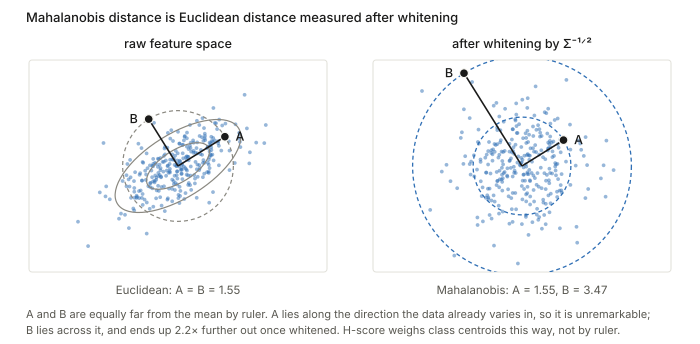
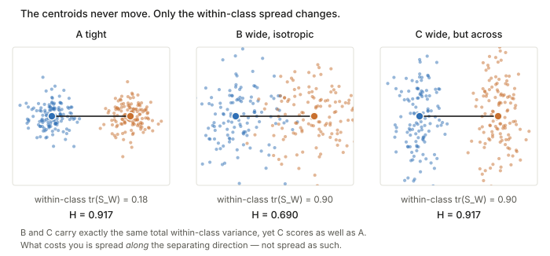

## Links

- **[arXiv:2212.10082](https://arxiv.org/abs/2212.10082)** — preprint; arXiv carries no
  journal reference, though the paper is laid out as a conference submission.
- **[Supplementary material and code](http://yangli-feasibility.com/home/ttl.html)** — the
  authors' page. S1 derives Eq. 4, S2 is the error-exponent argument.
- **[Authors' reference implementation](https://github.com/YaojieBao/An-Information-theoretic-Metric-of-Transferability/blob/master/3D_scene_understanding/H-score_1st_order.py)**
  (`getDiffNN`, the repo's H-score) — the same function, sometimes renamed `getHscore`, recurs
  across the repo's other scripts with looser `rcond` (1e-9, 1e-10 instead of 1e-15).
- **[Nguyen 2020 — LEEP](../2020-nguyen-leep/index.html)** — the competing transferability
  measure, which evaluates one hand-built head exactly rather than approximating the best
  one. The comparison is worked through there.
- **[Tran 2019 — NCE](../2019-tran-nce-hardness/index.html)** — the third transferability
  measure, which needs no model at all, only two label sequences.
- **[Diniz 2026 — PAS](../2026-diniz-pas/index.html)** — the unsupervised counterpart:
  scores a source/backbone pair without any target labels, which this measure requires.
- **[Claßen 2026 — TE robustness](../2026-classen-te-robustness/index.html)** — benchmarks
  this measure against the others on medical imaging targets, and finds the rankings move
  under nothing but a change of random seed.
- **[Runnable code](https://github.com/msrepo/theory_inclined_papers_with_annotations/blob/main/papers/2022-bao-hscore-transferability/code/hscore.py)** —
  Equations 2, 3 and 4 checked to machine precision on a discrete joint where $\tilde B$ can
  actually be built, plus the invariance, redundancy and locality questions, the six equivalent
  forms of the score, and the conditioning comparison. `make verify` runs it.

## In one paragraph

You have $N$ pre-trained source models and a target task, and you want to know which source
transfers best *without* fine-tuning all $N$ of them. The paper derives a closed-form score.
The route is: under a weak-dependence assumption, minimising log-loss with a $k$-dimensional
feature and a linear head is the same problem as taking a rank-$k$ approximation of a matrix
$\tilde B$ that measures how far $X$ and $Y$ are from independent. Solve the head in closed
form, substitute back, and the loss splits by Pythagoras into a constant minus the part of
$\tilde B$ your feature subspace captures. That second piece — the **H-score** — turns out to
be computable without ever building $\tilde B$:
$\mathcal{H}(f) = \operatorname{tr}(\operatorname{cov}(f(X))^{-1}\operatorname{cov}(\mathbb{E}[f(X)\mid Y]))$,
which is one forward pass and one matrix multiply. It is, recognisably, the Fisher discriminant
ratio, handed an information-theoretic justification: it is proportional to the error exponent
of the best decision rule that uses only $f(X)$.

## The spine of the argument

1. Log-loss minimisation $\equiv$ low-rank approximation of $\tilde B$, to $o(\varepsilon^2)$
   (Eq. 1). This is the only approximate step, and it carries the whole local assumption.
2. Freeze the features, solve for the classifier: ordinary least squares (Eq. 2).
3. Substitute back. The loss is *total dependence* minus *dependence captured by the feature
   subspace* — Pythagoras, with the first term independent of $f$ (Eq. 3).
4. So maximise the captured piece. Rewrite it in sample statistics; $\tilde B$ vanishes (Eq. 4).
5. Give it an operational meaning: it is the error exponent of a hypothesis test restricted to
   $f$ (Supplement S2).

## Setup and notation

| Symbol | Shape | Meaning |
|---|---|---|
| $\mathcal{X},\mathcal{Y}$ | — | input and output alphabets, assumed **discrete** |
| $F$ | $\lvert\mathcal{X}\rvert\times k$ | feature matrix, row $x$ is $f(x)^\top$ |
| $[\sqrt{\mathrm{P}_X}]$ | $\lvert\mathcal{X}\rvert^2$ | **diagonal** matrix of $\sqrt{P_X(x)}$ |
| $\tilde B$ | $\lvert\mathcal{Y}\rvert\times\lvert\mathcal{X}\rvert$ | Divergence Transition Matrix |
| $\Phi = [\sqrt{\mathrm{P}_X}]F$ | $\lvert\mathcal{X}\rvert\times k$ | rows $\phi(x)=\sqrt{P_X(x)}f(x)$ |
| $\Psi$ | $\lvert\mathcal{Y}\rvert\times k$ | the label-side factor; rows are the softmax weights $\theta_y$, reweighted by $\sqrt{P_Y(y)}$ |
| $\varepsilon$ | — | strength of dependence; the expansion is to $o(\varepsilon^2)$ |

**On $\Psi$ and $\Phi$.** The paper defines only $\phi(x)=\sqrt{P_X(x)}f(x)$ and says "let
$\phi(x)$ represent row vectors of $\Phi$", leaving $\psi$ implicit. It is the symmetric
counterpart on the label side: $\Psi$'s rows are the classifier weight vectors, reweighted by
$\sqrt{P_Y(y)}$, following the modal-decomposition construction of the paper's reference [12].
The $\sqrt{P}$ reweighting is a change of coordinates, one-to-one wherever $P_X(x)>0$, whose
only purpose is to make the relevant geometry Euclidean so that "closeness of distributions"
becomes ordinary squared distance.

A dimensional note: as printed, Eq. 1's subscript appears to give **both** $\Psi$ and $\Phi$
the shape $\mathbb{R}^{\lvert\mathcal{X}\rvert\times k}$. That cannot be right — for
$\Psi\Phi^\top$ to be comparable to $\tilde B\in\mathbb{R}^{\lvert\mathcal{Y}\rvert\times\lvert\mathcal{X}\rvert}$
you need $\Psi\in\mathbb{R}^{\lvert\mathcal{Y}\rvert\times k}$. Read it that way.

## Equation 1: training a network is a truncated SVD

$$
\operatorname*{argmin}_{f,\theta} L(f,\theta)
= \operatorname*{argmin}_{\Psi,\Phi} \tfrac12\lVert \tilde B - \Psi\Phi^\top\rVert_F^2 + o(\varepsilon^2)
\tag{1}
$$

The left side is "fit a $k$-dimensional feature extractor and a softmax head by minimising
log-loss". The right side is "find the best rank-$k$ approximation to $\tilde B$". By
[Eckart–Young](../eckart-young-lowrank-svd/index.html) the optimal factors are the top-$k$
singular vectors, so **training is computing a
truncated SVD of the dependence matrix**, with $\Phi$ spanning the feature subspace and $\Psi$
the label subspace. This is what the paper means by "the modal decomposition of $\tilde B$".

The $o(\varepsilon^2)$ is load-bearing and is the one soft spot in the chain: the equivalence
holds only in the *local* regime, where $P_{XY}$ is close to $P_XP_Y$. For strongly dependent
task pairs the paper offers no error control. The last experiment in the code probes this.

### What $\tilde B$ is

$$
\tilde B_{y,x} = \frac{P_{XY}(x,y)}{\sqrt{P_X(x)}\sqrt{P_Y(y)}} - \sqrt{P_Y(y)}\sqrt{P_X(x)}
= \sqrt{P_X(x)P_Y(y)}\left[\frac{P_{XY}(x,y)}{P_X(x)P_Y(y)} - 1\right].
$$

The bracket is the dependence ratio minus one, so $\tilde B \equiv 0$ exactly when
$X\perp Y$: it measures **departure from independence**, symmetrically normalised. Its squared
Frobenius norm is the $\chi^2$-divergence,

$$
\lVert\tilde B\rVert_F^2 = \chi^2(P_{XY}\Vert P_XP_Y) \approx 2\,I(X;Y),
$$

the approximation holding in the same local regime. Its singular values are the HGR maximal
correlations — the subtracted rank-one term $\sqrt{P_Y}\sqrt{P_X}^\top$ is precisely the trivial
top mode of the normalised joint, so $\tilde B$ is the *centred* version with that mode removed.

## Equation 2 is ordinary least squares

Hold $\Phi$ fixed, minimise $J(\Psi)=\tfrac12\lVert\tilde B-\Psi\Phi^\top\rVert_F^2$:

$$
\frac{\partial J}{\partial\Psi} = -(\tilde B-\Psi\Phi^\top)\Phi = 0
\;\Longrightarrow\;
\underbrace{\tilde B\Phi = \Psi\,\Phi^\top\Phi}_{\text{normal equations}}
\;\Longrightarrow\;
\Psi^* = \tilde B\Phi(\Phi^\top\Phi)^{-1}.
\tag{2}
$$

Equivalently $\Psi^*=\tilde B(\Phi^+)^\top$ with $\Phi^+$ the Moore–Penrose pseudoinverse: each
row of $\tilde B$ is regressed onto the columns of $\Phi$. Two caveats. It needs $\Phi^\top\Phi$
invertible, i.e. the $k$ features linearly independent. And it is a *partial* minimisation — the
joint optimum over $(\Psi,\Phi)$ is the SVD. Eq. 2 is the inner solve, which is exactly the
transfer setting: $f$ frozen, only the head free.

## Equation 3 is Pythagoras

Substituting Eq. 2 back, with $P=\Phi(\Phi^\top\Phi)^{-1}\Phi^\top$ the orthogonal projector
onto $\operatorname{col}(\Phi)$, so that $\Psi^*\Phi^\top=\tilde BP$:

$$
\lVert\tilde B(I-P)\rVert_F^2 = \operatorname{tr}\!\big(\tilde B^\top\tilde B(I-P)\big)
= \lVert\tilde B\rVert_F^2 - \big\lVert \tilde B\Phi(\Phi^\top\Phi)^{-\frac12}\big\rVert_F^2 .
\tag{3}
$$

using idempotence of $I-P$ and cyclicity of the trace. In words:

$$
\underbrace{\lVert\tilde B\rVert_F^2}_{\text{total dependence, fixed}}
= \underbrace{\lVert\tilde B\Phi(\Phi^\top\Phi)^{-\frac12}\rVert_F^2}_{\text{captured by the feature subspace}}
+ \underbrace{\text{residual}}_{\text{the loss you are stuck with}}
$$

The first term has no $f$ in it, so **minimising log-loss is exactly maximising the captured
piece** — the paper's "it is sufficient to use the second term to measure classification
performance". The upper bound $\lVert\tilde B\rVert_F^2$ is then obvious: a projection is never
longer than the vector. Features attaining it capture all the dependence and are the *minimum
error probability features*.

## Equation 4: the form you can actually compute

Supplement S1 converts the captured term into sample statistics via two identities,
$\Phi^\top\Phi=\operatorname{cov}(f(X))$ (using $\mathbb{E}[f(X)]=0$) and
$\Phi^\top\tilde B^\top\tilde B\Phi=\operatorname{cov}(\mathbb{E}[f(X)\mid Y])$:

$$
\boxed{\;\mathcal{H}(f)=\operatorname{tr}\!\Big(\operatorname{cov}(f(X))^{-1}\,
\operatorname{cov}\big(\mathbb{E}_{P_{X|Y}}[f(X)\mid Y]\big)\Big)\;}
\tag{4}
$$

**$\tilde B$ has vanished, and that is the entire practical point.** Building $\tilde B$ needs
the joint $P_{XY}$ over the *input alphabet*; for images $\lvert\mathcal{X}\rvert$ is
astronomical and you would need to see the same $x$ repeatedly. The discrete formulation is
derivation scaffolding, never an implementation. What you run instead:

```
1. forward pass:   z_i = f(x_i)          (frozen source encoder)
2. centre:         z_i <- z_i - mean(z)
3. total scatter:  S_T = (1/m) sum_i z_i z_i^T
4. class means:    mu_y over {i : y_i = y}
5. between:        S_B = sum_y (m_y/m) mu_y mu_y^T
6. H = tr(S_T^-1 S_B)
```

**How $\mathbb{E}[f(X)\mid Y]$ turns into a covariance matrix, concretely.**
$\mathbb{E}[f(X)\mid Y=y]$ is just the class-$y$ mean feature vector $\mu_y$; it is a function
of $y$. $\operatorname{cov}(\mathbb{E}[f(X)\mid Y])$ then treats $Y$ itself as random and asks
how much *that function's output*, $\mu_Y$, varies — which is exactly $S_B$ above, the
between-class scatter. The [authors' own code](https://github.com/YaojieBao/An-Information-theoretic-Metric-of-Transferability/blob/master/3D_scene_understanding/H-score_1st_order.py)
computes it without ever writing the $(m_y/m)$ weights explicitly: replace every sample's
feature vector with its own class mean (`g[Z==z] = mean(f[Z==z])`), then take the *plain,
unweighted* sample covariance of that array. Because a class with $N_y$ members now
contributes $N_y$ identical copies of $\mu_y$, the ordinary covariance sum reweights each
class by its size automatically — the class-proportion weighting in step 5 above falls out for
free rather than being coded by hand.

**This is the multi-class Fisher discriminant ratio** ([background](../lda-fisher-discriminant/index.html)). The paper never says so, but
$\operatorname{tr}(S_T^{-1}S_B)$ is LDA's criterion (classic LDA uses $S_W$, and
$S_T=S_W+S_B$, so they are monotonically related). The contribution is not a new statistic —
it is an information-theoretic derivation of a familiar one, plus the operational meaning below.

For the Taskonomy pixel-to-pixel tasks, $\mathcal{Y}$ is made finite by **clustering pixel
values into a palette of 16 colours**, computing a per-pixel H-score and averaging. Supplement
S3.2 checks the sensitivity: $N=16$ balances recoverability against cost, $N=5$ destroys the
structure.

### No head is ever trained

Worth stating flatly, because the derivation can suggest otherwise: computing $\mathcal{H}(f)$
involves **no gradient step of any kind**. A head *is* optimised — but in closed form, by Eq. 2,
and then it cancels out of Eq. 3. So $\mathcal{H}(f)$ answers *"what log-loss would the best
linear head reach, if I trained one?"* without ever constructing it. The authors' whole
implementation is ten lines of numpy with no optimiser, learning rate or epoch count:

```python
def getDiffNN(f, Z):
    Covf = getCov(f)                          # labels not used
    g = np.zeros_like(f)
    for z in set(Z):
        g[Z==z] = np.mean(f[Z==z, :], axis=0)  # the only use of labels
    return np.trace(np.dot(np.linalg.pinv(Covf, rcond=1e-15), getCov(g)))
```

What it needs: a frozen source encoder, target inputs, and **target labels**. What it does not
need: the transfer network, an optimiser, or the source labels (those are baked into the frozen
weights). The networks trained in the paper's experiments exist only to produce ground truth to
validate the score against. Note also that H-score does not hand you a model — it scores a
representation, so to deploy you still train the head. It is a selection criterion.

### The nearest-neighbour reading

The paper compresses this into one sentence — "a high H-score implies the inter-class variance
is large, while feature redundancy is small" — and moves on. The classifier it has in mind is
**nearest class mean**: compute a centroid $\mu_y$ per class and assign $x$ to
$\arg\min_y\lVert f(x)-\mu_y\rVert$. That works exactly when two things hold: the centroids are
far apart (or no distance rule can separate them), *and* the within-class clouds are tight
relative to that separation (or points wander into a neighbour's territory anyway). Those are
the numerator and the denominator. $\mathcal{H}$ is the **signal-to-noise ratio of a
nearest-centroid classifier**: centroid separation, measured in units of the feature's own
spread.

That reading is exact, not metaphorical. Expanding
$\Sigma_B=\sum_y P(y)(\mu_y-\mu)(\mu_y-\mu)^\top$ and using cyclicity of the trace,

$$
\mathcal{H}(f) = \operatorname{tr}(\Sigma_T^{-1}\Sigma_B)
= \sum_y P(y)\,(\mu_y-\mu)^\top\Sigma_T^{-1}(\mu_y-\mu),
$$

so **H-score is the average squared Mahalanobis distance from each class centroid to the global
mean.** This is what $\Sigma_T^{-1}$ is for: it converts Euclidean distance into Mahalanobis
distance, and a nearest-neighbour rule in the whitened space is precisely what the score
measures. The authors' function being named `getDiffNN` suggests this is how they thought of it.

One consequence of the label entering *only* through the grouping in step 4: $\mathcal{H}$ is a
function of the **partition** the labels induce, not of the labels themselves. Permuting the
class names leaves it unchanged; there is no notion of label ordering or of distance between
classes anywhere in it.



### Why a denominator with no labels in it measures within-class tightness

The obvious objection to reading $\operatorname{cov}(f(X))$ as "within-class spread" is that it
never sees a label — it is the scatter of *all* the features about *one* global mean. The
resolution is the **law of total covariance**:

$$
\underbrace{\operatorname{cov}(f(X))}_{S_T}
= \underbrace{\mathbb{E}_Y\big[\operatorname{cov}(f(X)\mid Y)\big]}_{S_W}
+ \underbrace{\operatorname{cov}\big(\mathbb{E}[f(X)\mid Y]\big)}_{S_B}.
$$

$S_T$ needs no labels to *compute*, but it still *decomposes* into a within-class part and a
between-class part. So with $S_B$ held fixed — which is exactly what the ratio does — a larger
$S_T$ **is** a larger $S_W$. The denominator penalises within-class spread without ever being
told which class anything belongs to.

That is not just a hand-wave about monotonicity; the ranking is literally identical. Writing
$\lambda_i$ for the generalised eigenvalues of $(S_B, S_W)$ — the Fisher ratios — simultaneous
diagonalisation gives

$$
\mathcal{H}(f) = \operatorname{tr}(S_T^{-1}S_B) = \sum_i \frac{\lambda_i}{1+\lambda_i},
$$

each term strictly increasing in $\lambda_i$. Dividing by *total* scatter and dividing by
*within-class* scatter therefore order features the same way. The label-free form is simply the
convenient one to compute, and it bounds the score into $[0,\min(k,\lvert\mathcal{Y}\rvert-1))$
as a free side effect.

The picture also corrects the "small $\operatorname{tr}(\operatorname{cov} f)$" reading. What
costs you is spread **along the direction that separates the classes**, not spread as such:



Panels B and C carry **identical** total within-class variance ($\operatorname{tr}(S_W)=0.90$)
and the centroids never move, yet C scores $0.917$ against B's $0.690$ — the same as the
far tighter panel A. C's extra variance is all *across* the separating direction, where it is
free.

### What breaks if you drop the denominator

Suppose you scored with $\operatorname{tr}(S_B)$ alone — the plain Euclidean spread of the class
centroids. Four things go wrong, in increasing order of seriousness.

1. **Scale.** $f\mapsto cf$ sends $\operatorname{tr}(S_B)\mapsto c^2\operatorname{tr}(S_B)$.
   Multiplying a feature by 100 multiplies its score by $10{,}000$ ($0.0123 \to 122.7$ in the
   code) while $\mathcal{H}$ does not move. Since different pre-trained encoders emit wildly
   different activation scales, and *comparing encoders is the entire purpose*, this alone
   disqualifies it.
2. **Redundancy.** Duplicating a feature raises $\operatorname{tr}(S_B)$ ($0.00455\to0.00679$
   in the code) though it adds no new separating direction. You would be rewarded for padding
   your feature vector with copies.
3. **The operational meaning evaporates.** Theorem 1 derives $E_f^k = c\,\mathcal{H}(f)$ under
   $\operatorname{cov}(f(X))=I$. Strip the normalisation and you are no longer computing an
   error exponent, so the one thing that distinguishes H-score from an arbitrary heuristic is
   gone.
4. **It stops being a projection.** This is the deepest one. In Eq. 3 the quantity is
   $\lVert\tilde B\Phi(\Phi^\top\Phi)^{-1/2}\rVert_F^2$, and $(\Phi^\top\Phi)^{-1/2}$ is
   precisely what **orthonormalises** the basis of $\Phi$. Without it you have
   $\lVert\tilde B\Phi\rVert_F^2$, which depends on how you happened to parameterise $\Phi$
   rather than on the subspace it spans. The Pythagoras decomposition that made the whole
   derivation work no longer holds.

Measured, on 40 random features ranked against the true optimal log-loss (Spearman, $-1$ is
perfect), as the per-coordinate scales are spread more widely. Both $\mathcal{H}$ and the
log-loss are provably invariant to that rescaling — a linear head absorbs it — so only the
$\operatorname{tr}(S_B)$ column *can* move:

| scale spread | ×1 | ×3 | ×30 |
|---|---|---|---|
| Spearman($\mathcal{H}$, log-loss) | −0.965 | −0.965 | −0.965 |
| Spearman($\operatorname{tr}S_B$, log-loss) | −0.860 | −0.701 | **−0.389** |

### What "feature redundancy" actually means

The paper glosses $\operatorname{tr}(\operatorname{cov}(f(X)))$ as "feature redundancy", which
is loose — that trace is total variance, not redundancy. Two things are really going on.

**The inverse covariance is a whitening**, and it buys invariance: for any invertible $A$,

$$
\operatorname{tr}\!\big((A\Sigma_TA^\top)^{-1}(A\Sigma_BA^\top)\big)
= \operatorname{tr}(\Sigma_T^{-1}\Sigma_B).
$$

So $\mathcal{H}$ measures the **feature subspace**, not your choice of coordinates, scale or
rotation. Without $\operatorname{cov}^{-1}$ you could inflate the score by multiplying $f$ by 10.

**Redundancy is then penalised structurally.** Because $\mathcal{H}$ is a ratio and depends only
on the subspace, a duplicated feature adds no new direction and does not raise the score, where
an unnormalised between-class scatter would double-count it. That is the honest version of the
paper's sentence, and it is the mechanism behind the connection to the max-relevance
min-redundancy feature-selection literature it cites: the trade-off is automatic rather than
hand-designed.

## Equivalent forms, and the one worth actually using

Written as $\operatorname{tr}(\Sigma_T^{-1}\Sigma_B)$, Eq. 4 invites you to build two $k\times k$
matrices, invert one, multiply them, and then throw away all but the $k$ diagonal entries. None
of that is necessary. Six equivalent expressions, checked against each other to $10^{-14}$:

**1. It is a Frobenius inner product.** For symmetric $A,B$,
$\operatorname{tr}(AB)=\sum_i\sum_j A_{ij}B_{ji}=\sum_{ij}A_{ij}B_{ij}$, so

$$
\mathcal{H}(f) = \langle \Sigma_T^{-1},\, \Sigma_B\rangle_F
= \sum_{ij} (\Sigma_T^{-1})_{ij}(\Sigma_B)_{ij}.
$$

An elementwise multiply and a sum, $O(k^2)$, no matrix product.

**2. It is a sum of quadratic forms.** $\Sigma_B$ is not generic — it is a sum of
$\lvert\mathcal{Y}\rvert$ rank-one terms, $\Sigma_B=\sum_y p_y d_yd_y^\top$ with
$d_y=\mu_y-\mu$. Using $\operatorname{tr}(Muv^\top)=v^\top Mu$,

$$
\mathcal{H}(f) = \sum_y p_y\, d_y^\top \Sigma_T^{-1} d_y ,
$$

which is $\lvert\mathcal{Y}\rvert$ solves against a *vector*. This is the Mahalanobis reading
above, now as an algorithm.

**3. Cholesky, so no inverse is ever formed.** With $\Sigma_T=LL^\top$,
$d_y^\top\Sigma_T^{-1}d_y=\lVert L^{-1}d_y\rVert^2$, so $\mathcal{H}=\sum_y p_y\lVert v_y\rVert^2$
where $Lv_y=d_y$ by forward substitution. Each class contributes a plain squared Euclidean norm.

**4. Flip the trace to the small side.** With $M\in\mathbb{R}^{\lvert\mathcal{Y}\rvert\times k}$
holding rows $\sqrt{p_y}\,d_y^\top$ we have $\Sigma_B=M^\top M$, and cyclicity gives
$\operatorname{tr}(M\Sigma_T^{-1}M^\top)$ — a $\lvert\mathcal{Y}\rvert\times\lvert\mathcal{Y}\rvert$
trace. For Taskonomy that is $16\times16$ rather than $2048\times2048$.

**5. No $k\times k$ matrix at all.** Take the centred data $Z\in\mathbb{R}^{m\times k}$ and a thin
QR, $Z=QR$. Row $i$ is $z_i=R^\top q_i$, so $d_y=R^\top\bar u_y$ with $\bar u_y$ the class-$y$
mean of the rows of $Q$; and since $R(R^\top R)^{-1}R^\top=I$ for square invertible $R$,

$$
d_y^\top\Sigma_T^{-1}d_y = \bar u_y^\top R\;m(R^\top R)^{-1}\,R^\top\bar u_y = m\lVert\bar u_y\rVert^2 ,
$$

and everything collapses to

$$
\boxed{\;\mathcal{H}(f) = \sum_y \frac{\lVert s_y\rVert^2}{m_y},
\qquad s_y = \sum_{i\,\in\,\text{class } y} q_i \;}
$$

Group-sum the rows of $Q$ by class, take squared norms, divide by class counts. $\Sigma_T$ and
$\Sigma_B$ are never built; $R$ is computed and discarded.

**6. What it really is: principal angles.** Let $G\in\mathbb{R}^{m\times\lvert\mathcal{Y}\rvert}$
be the class-indicator matrix with $G_{iy}=1/\sqrt{m_y}$ when $y_i=y$; its columns are
disjointly supported unit vectors, so $G^\top G=I$. Then $(G^\top Q)_{y\cdot}=s_y^\top/\sqrt{m_y}$
and

$$
\mathcal{H}(f) = \lVert G^\top Q\rVert_F^2 = \sum_i \cos^2\theta_i ,
$$

where $\theta_i$ are the **[principal angles](../principal-angles-subspaces/index.html)** between $\operatorname{span}(\text{centred features})$
and $\operatorname{span}(\text{class indicators})$ — because the singular values of a product of
two orthonormal bases are the cosines of the principal angles between their spans.

This form explains, in one line each, things asserted separately above. Invariance to invertible
maps of $f$: those change the *basis* of $\operatorname{span}(Z)$, not the subspace. Invariance
to permuting class names: permutes the columns of $G$, not its span. The bound
$\mathcal{H}<\min(k,\lvert\mathcal{Y}\rvert-1)$: $Z$ is centred so $\mathbf 1\perp\operatorname{span}(Z)$
while $\mathbf 1\in\operatorname{span}(G)$, forcing one angle to be exactly $90^\circ$ — the
single zero in the measured cosines $[0.789,\,0.711,\,0.626,\,0.513,\,0]$, and the reason
$\operatorname{rank}(\Sigma_B)=\lvert\mathcal{Y}\rvert-1$. And those cosines are the **canonical
correlations** between feature space and label indicators, which closes the loop with the
paper's own remark that $\tilde B$'s singular values are HGR maximal correlations: H-score is
the sum of their squares, arrived at from the other end.

### Why form 5 is the one to use

It is not asymptotically cheaper — $O(mk^2)$ dominates either way, exactly as the paper says.
The gain is **numerical**. Forming $\Sigma_T=Z^\top Z$ squares the condition number, whereas QR
works at $\operatorname{cond}(Z)$. Against a 128-bit modified-Gram–Schmidt reference, on features
made progressively more collinear:

| noise | $\operatorname{cond}(Z)$ | $\operatorname{cond}(\Sigma_T)$ | error, naive $\operatorname{tr}(\Sigma_T^{-1}\Sigma_B)$ | error, QR form |
|---|---|---|---|---|
| 1e−3 | 2.5e3 | 6.3e6 | 2e−10 | 7e−15 |
| 1e−5 | 3.1e5 | 9.7e10 | 2e−06 | 3e−12 |
| 1e−7 | 2.6e7 | 6.5e14 | 5e−03 | 7e−11 |
| 1e−8 | 2.2e8 | 3.5e15 | **6e−03** | 4e−11 |

Three decimal places lost by the textbook expression where the QR form is still exact to ten.
That is precisely the near-duplicate hazard documented above, and it is largely an artefact of
*how* the quantity is computed rather than of the quantity itself. At $k=2048$ on real encoder
features I would compute H-score as form 5 and not form 0.

## Supplement S2: why H-score is an *asymptotic* error probability

Consider a binary test on $m$ i.i.d. samples, $H_0: x^m\sim P_1$ versus $H_1: x^m\sim P_2$.
The Bayesian error decays exponentially, and the rate is the **error exponent**

$$
E = \lim_{m\to\infty}\min_A -\tfrac1m\log P_e^{(m)},
\qquad\text{i.e.}\qquad P_e^{(m)}\approx 2^{-mE}.
$$

Assume both hypotheses lie in a $\chi^2$-ball $\mathcal{N}_\varepsilon(P_0)$ and write
$\phi_i(x)=(P_i(x)-P_0(x))/(\varepsilon\sqrt{P_0(x)})$ for their normalised perturbation
directions. Then:

- **Lemma 1** — the best achievable exponent is
  $E=\frac{\varepsilon^2}{8}\lVert\phi_1-\phi_2\rVert^2+o(\varepsilon^2)$.
- **Lemma 2** — a rule built on a *feature statistic* $\frac1m\sum_i f(x^{(i)})$ achieves only
  $E_f=\frac{\varepsilon^2}{8}\langle\xi,\phi_1-\phi_2\rangle^2+o(\varepsilon^2)$, with
  $\xi(x)=\sqrt{P_0(x)}f(x)$.

Put those side by side and the picture is immediate:

$$
\text{optimal: } \lVert\phi_1-\phi_2\rVert^2
\qquad\text{vs}\qquad
\text{feature } f: \langle\xi,\phi_1-\phi_2\rangle^2 .
$$

The feature gets the **squared projection** of the discriminative direction onto itself. By
Cauchy–Schwarz it is at most the optimum, with equality iff $\xi\propto\phi_1-\phi_2$. So *a
feature is useful exactly to the extent that it aligns with the direction separating the
classes* — a feature orthogonal to it has exponent zero no matter how much variance it carries.
**Lemma 3** adds the $k$ coordinates up, and **Theorem 1** finishes: for whitened features,
$E_f^k = c\,\mathcal{H}(f)$ with $c$ independent of $f$.

### Two different asymptotics, and the paper blurs them

- **In $m$.** The exponent is defined as a limit. $P_e\approx 2^{-mE}$ is an *exponential*
  equality — it means $\frac1m\log P_e\to -E$, invisible to polynomial prefactors. H-score
  ranks features by decay *rate*, not by error at your actual sample size. Two features with
  equal H-score can behave differently at finite $m$.
- **In $\varepsilon$.** Every lemma carries $o(\varepsilon^2)$. The analysis is a second-order
  expansion valid when the class-conditionals are *close together* — which is the opposite of
  the regime you want.

## Reproduced

`code/hscore.py` works on a small discrete joint, the one setting where $\tilde B$ can be built,
and checks the chain. The three algebraic steps are exact — no local assumption is involved in
any of them, which is worth knowing, since only Eq. 1 is approximate:

| check | residual |
|---|---|
| Eq. 2, normal equations $\tilde B\Phi=\Psi\Phi^\top\Phi$ | 3.5e−18 |
| Eq. 3, $\lVert\tilde B\rVert^2 -$ (captured $+$ residual) | 1.4e−17 |
| Eq. 4 vs the projection form of Eq. 3 | 0.0 |
| $\lVert\tilde B\rVert_F^2 - \chi^2(P_{XY}\Vert P_XP_Y)$ | 0.0 |

Eq. 3 really is Eckart–Young: constructing the feature whose $\Phi$ spans the top-$k$ right
singular vectors, $F = [\sqrt{\mathrm{P}_X}]^{-1}V_k$, hits the bound exactly (0.058733 against
$\sum_{i\le k}\sigma_i^2 = 0.058733$), while the best of 300 *random* rank-3 features reaches
only 0.008530 — random subspaces land nowhere near the optimum.

**Invariance and redundancy.** $\mathcal{H}(f)=\mathcal{H}(Af)=\mathcal{H}(100f)=0.005098$ for a
random invertible $A$. Adding an exactly duplicated feature moves the raw between-class scatter
from $0.004553$ to $0.006787$ while H-score does not move at all ($0.005098$, pseudo-inverse) —
the duplicate adds no subspace.

**The nearest-neighbour identity.** The Mahalanobis form above is exact:
$\operatorname{tr}(S_T^{-1}S_B)$ and $\sum_y P(y)(\mu_y-\mu)^\top S_T^{-1}(\mu_y-\mu)$ both
give $0.0073296924$, and permuting the class names returns the same value again — confirming
that only the partition matters.

**A hazard the paper does not mention.** With a *near*-duplicate and a plain inverse, the
picture reverses:

| noise scale | $\operatorname{cond}(\operatorname{cov} f)$ | H |
|---|---|---|
| 1e−2 | 3.5e4 | 0.007988 |
| 1e−4 | 5.0e8 | 0.005993 |
| 1e−7 | 3.2e14 | 0.006018 |

against a true value of $0.005098$. As $\operatorname{cov}(f(X))$ becomes ill-conditioned, the
inverse **amplifies** a direction carrying almost no signal, and the score inflates. At the
$k=2048$ features the paper uses on Taskonomy, with finite samples, this is a live concern and
there is no discussion of regularisation or pseudo-inversion anywhere in the *paper*.

The authors' own *code* does reach for `np.linalg.pinv` rather than a plain solve — but with
`rcond` set to $10^{-15}$, $10^{-10}$ or $10^{-9}$ depending on the script. That tolerance only
discards singular values of $\operatorname{cov}(f(X))$ that are zero to within machine
precision; it does nothing for the near-duplicate regime in the table above, where the
condition number is large ($10^4$–$10^{14}$) but no singular value is actually below the
cutoff. So the pseudo-inverse in the reference implementation is a numerical-stability guard
against exact singularity, not a regulariser against the amplification this table shows — the
hazard survives in the code exactly as it does in the paper's math.

**Does the local assumption bind?** Ranking 40 random features by H-score against the log-loss a
trained linear head actually reaches (Spearman; $-1$ is perfect):

| $\varepsilon$ | 0.05 | 0.2 | 0.5 | 1.0 | 2.0 |
|---|---|---|---|---|---|
| $\lVert\tilde B\rVert_F^2$ | 0.0016 | 0.0297 | 0.2012 | 0.4466 | 0.8371 |
| Spearman | −0.977 | −0.993 | −0.994 | −0.997 | −0.988 |

(These shifted slightly when the log-loss solver was fixed to whiten before descending; the conclusion did not.) I expected this to decay as the dependence grew and it does not — if anything it tightens,
because at tiny $\varepsilon$ the log-loss differences between features are themselves tiny and
the ranking is resolution-limited. So the local assumption buys the *derivation*, not the
*ranking*. That is more than the paper claims; it is also a benign setting (random Gaussian
features on a random joint), and says nothing about learned features on real data.

## Questions and doubts

- **Theorem 1 is binary-only.** The operational meaning is proved for $\lvert\mathcal{Y}\rvert=2$.
  Eq. 4 is then used throughout for multi-class and for 16-way quantised pixel tasks, with the
  meaning asserted to carry over but never extended. This is the largest gap between what is
  proved and what is used.
- **Fine-tuning voids the guarantee, and the paper says so.** "For the operational meaning of
  transferability to hold exactly, we require the fine tuning layers consist of only linear
  transformations." With nonlinear fine-tuning they retreat to *relative* comparison, which the
  experiments support but which is an empirical claim.
- **No conditioning or regularisation analysis**, despite $\operatorname{cov}^{-1}$ at $k=2048$.
  The paper says nothing about it; the reference implementation *does* reach for
  `np.linalg.pinv`, with `rcond` at $10^{-15}$, $10^{-10}$ or $10^{-9}$ depending on the script
  (all three verified in the repo). But that only discards singular values which are zero to
  machine precision, so it guards against exact singularity and not against the near-duplicate
  amplification in the table above — where the condition number reaches $10^4$–$10^{14}$ while
  no singular value falls below the cutoff. My own numbers bear this out: at noise scales
  $10^{-2}$ and $10^{-4}$ the pseudo-inverse and the plain solve return *identical* inflated
  values. So the gap is real in both the paper and the code, and the code's `pinv` should not
  be read as having addressed it. The honest qualifier, from the equivalent forms above: much
  of this is an artefact of *how* the score is computed rather than of the score itself.
  Computing it as a QR of the centred features instead of an inverse of their covariance keeps
  ten correct digits where the textbook expression has lost three, because it never squares the
  condition number. The metric is better behaved than the formula the paper writes down.
- **$\lvert\mathcal{X}\rvert$ finite is assumed throughout** and is false for images. It is
  harmless because $\tilde B$ is eliminated, but it means the derivation never formally covers
  the setting it is applied to.
- **Quantising image outputs to 16 colours is a large intervention** justified by one
  sensitivity figure. How much of the transferability ranking survives the quantisation is not
  measured against an unquantised baseline, because there isn't one.
- **The empirical validation is ranking correlation, not calibration.** Figures 2 and S2 show
  H-score correlates with log-loss; nothing predicts *how much* accuracy a transfer will yield.
  For source selection that is enough, which is the paper's stated use.

## Takeaways

- The chain worth remembering: **frozen features $\Rightarrow$ the head is least squares
  $\Rightarrow$ the loss is Pythagoras $\Rightarrow$ what is left to maximise is a projection.**
  Any time a model's last layer is linear and the rest is frozen, that decomposition is
  available, and it converts "how good is this representation?" into "how much of the target
  structure does this subspace span?".
- **H-score is the Fisher discriminant ratio $\operatorname{tr}(S_T^{-1}S_B)$.** The value added
  is not the statistic but the operational meaning — it is proportional to an error exponent —
  and the derivation showing it falls out of log-loss rather than being posited.
- The reason it is cheap is structural, not a trick: one forward pass and one $k\times k$
  covariance, $O(mk^2)$, versus training a transfer network per source–target pair. The
  supplement reports under an hour per pair on a CPU workstation at $k=2048$.
- The invariance to invertible linear maps is the part to internalise. It is why the score is
  meaningful at all across differently-scaled encoders, and it is what makes "redundancy" a
  consequence of the geometry rather than a penalty someone added.
