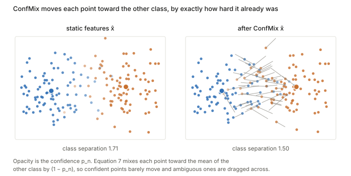
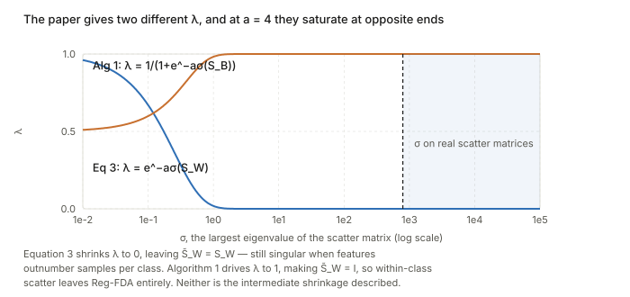

## Links

- **[arXiv:2207.03036](https://arxiv.org/abs/2207.03036)** — preprint; ECCV 2022. Code at
  [TencentARC/SFDA](https://github.com/TencentARC/SFDA).
- The measures it builds on and competes with:
  [Nguyen 2020 — LEEP](../2020-nguyen-leep/index.html),
  [You 2021 — LogME](../2021-you-logme/index.html),
  [Bao 2022 — H-score](../2022-bao-hscore-transferability/index.html).
- **[Claßen 2026 — TE robustness](../2026-classen-te-robustness/index.html)** — reports SFDA
  producing NaNs on medical targets, "due to all source models being assigned the same score".
- **[LDA / Fisher discriminant](../lda-fisher-discriminant/index.html)** and
  **[principal angles](../principal-angles-subspaces/index.html)** — the background this leans on.
- **[Runnable code](https://github.com/msrepo/theory_inclined_papers_with_annotations/blob/main/papers/2022-shao-sfda/code/sfda.py)** —
  ConfMix as a difficulty amplifier, the $D'=\min(D,C-1)$ collapse on binary targets, the three
  incompatible statements of $\lambda$, and what $\lambda=1$ costs. `make verify` runs it.

## In one paragraph

Every earlier measure scores a pre-trained model by its **static** features. SFDA's argument is
that fine-tuning does not leave features static — it separates classes and it learns hard
examples late — so a good proxy should imitate both. It does this in two stages. First,
**Reg-FDA** projects the frozen features into a regularised Fisher space where classes are more
separable, and an LDA classifier there gives a per-sample confidence. Second, **ConfMix**
perturbs each sample toward the mean of the *other* classes by exactly its current difficulty,
and Reg-FDA is run again on the harder problem. The score is the average log-likelihood after
that second pass. It works well on the paper's 11 benchmarks and, as a bonus, projects every
model into a common $C-1$ dimensional space, which makes ensemble selection possible. It is also
the one measure in this section that both medical benchmarks report failing outright, and the
reasons are visible in the construction.

## The spine of the argument

1. Static-feature metrics cannot see the fine-tuning *dynamics*. Imitate two of them instead.
2. Class separability: project into a Fisher space (Reg-FDA), classify by LDA, take the
   log-likelihood.
3. Hard examples: make the problem harder in proportion to existing difficulty (ConfMix), then
   redo step 2. Models that still separate are the ones that fine-tune well.
4. Free consequence: all models land in the same $C-1$ dimensions, so they become comparable and
   ensembles can be scored.

## Setup and notation

| Symbol | Meaning |
|---|---|
| $\hat x = \theta_m(x)\in\mathbb{R}^D$ | the **static** feature from pre-trained model $m$ |
| $C$, $N_c$ | number of target classes, and samples in class $c$ |
| $S_B$, $S_W$ | between- and within-class scatter |
| $\tilde S_W=(1-\lambda)S_W+\lambda I$ | the regularised within-class scatter |
| $U\in\mathbb{R}^{D\times D'}$ | the Fisher projection, $\bar x = U^\top\hat x$ |
| $D'=\min\{D,\,C-1\}$ | the Fisher space's dimension |
| $p_n$ | confidence of the LDA classifier on sample $n$ |
| $\tilde x_n$ | the ConfMix-perturbed feature |

## Stage 1 — Regularised FDA

$$
U=\arg\max_U \frac{d_B(U)}{d_W(U)}=\frac{\lvert U^\top S_BU\rvert}
{\lvert U^\top[(1-\lambda)S_W+\lambda I]U\rvert}
\tag{2}
$$

which is ordinary [Fisher discriminant analysis](../lda-fisher-discriminant/index.html) with a
shrinkage term, solved as a generalised eigenproblem $S_Bu_k=v_k\tilde S_Wu_k$ (Eq. 4) — no
gradient descent, which is the efficiency claim. Classification in that space is LDA with
$\Sigma_c=I$ assumed:

$$
\delta_c(\hat x_n)=\hat x_n^\top UU^\top\mu_c-\tfrac12\mu_c^\top UU^\top\mu_c+\log q_c,
\qquad
p(y_n\mid\hat x_n)=\frac{e^{\delta_{y_n}}}{\sum_c e^{\delta_c}}
\tag{5, 6}
$$

and the score is $T_m=\sum_n\log p(y_n\mid x_n)$ (Eq. 1).

**One structural consequence worth pulling out.** $\operatorname{rank}(S_B)\le C-1$ always, so
$D'=\min\{D,C-1\}$. The paper presents this as a *feature* — every model projects to the same
$C-1$ dimensions regardless of its native width, which is what makes ensemble comparison
possible. But it also means a **binary target gives a one-dimensional Fisher space**: every
model is scored through a single direction. That is exactly the setting in which
[Claßen et al.](../2026-classen-te-robustness/index.html) report SFDA assigning every source the
same score, and then NaN when a rank correlation is taken.

| classes $C$ | 2 | 5 | 10 | 100 |
|---|---|---|---|---|
| Fisher dimensions $D'$ | **1** | 4 | 9 | 99 |

## Stage 2 — ConfMix, the idea worth keeping

$$
\tilde x_n=p_n\hat x_n+(1-p_n)\,\mu_{c\neq y_n}
\tag{7}
$$

Each sample is moved toward the mean of the classes it does *not* belong to, by exactly
$(1-p_n)$ — its own current difficulty. A confidently classified point barely moves; an
ambiguous one is dragged most of the way across. Reg-FDA is then re-run on $\{\tilde x_n\}$, and
the final score comes from that second pass.

This is a genuinely nice mechanism and the paper's best idea. It is a **difficulty amplifier**:
it does not add uniform noise, it widens exactly the gap between models that handle ambiguous
samples and models that do not. Since fine-tuning learns easy examples early and hard ones late
(their Fig. 3d), amplifying difficulty is a reasonable proxy for late-stage fine-tuning
behaviour. Self-supervised augmentation used as a *measurement* instrument rather than a
training one is an idea that transfers.

## The regularisation strength is specified three incompatible ways

This is the part that needs stating plainly, because it is not a typo in one place.

| where | formula |
|---|---|
| **Eq. 3**, main text | $\lambda=\exp^{-a\sigma(S_W)}$ |
| text immediately after Eq. 3 | refers to "$\sigma(S_B)$ in Eqn. (3)" |
| **Algorithm 1**, line 11 (Appendix A.2) | $\lambda=1/(1+\exp^{-a\sigma(S_B)})$, with $a=4$ |

The first *decreases* in its argument; the third *increases*, in a **different matrix**. These
are not variants of one formula. And at the stated $a=4$, on realistically sized scatter
matrices, the two written forms saturate at opposite ends:

| setting | $\sigma(S_W)$ | $\sigma(S_B)$ | Eq. 3 | Alg. 1 |
|---|---|---|---|---|
| small, low-dim | 2858 | 12559 | 9.9e−305 | **1.0000** |
| typical CNN | 4471 | 122092 | 9.9e−305 | **1.0000** |
| binary medical | 926 | 16427 | 9.9e−305 | **1.0000** |
| wide backbone | 3681 | 107544 | 9.9e−305 | **1.0000** |

Both endpoints are bad, in different ways:

- **$\lambda\to0$** leaves $\tilde S_W=S_W$, so a **singular** $S_W$ stays singular. Juodelyte et
  al. identify exactly this: when the feature dimension exceeds the samples per class, $S_W$ is
  rank-deficient and the projection can collapse a class onto a point. The shrinkage term exists
  to prevent that, and Eq. 3 switches it off precisely when it is needed.
- **$\lambda\to1$** makes $\tilde S_W=I$ exactly, so Eq. 2 becomes
  $\lvert U^\top S_BU\rvert/\lvert U^\top U\rvert$ and $U$ is just the **eigenbasis of $S_B$** —
  the within-class scatter has left the method entirely. Verified: the $\lambda=1$ subspace and
  $S_B$'s eigenbasis have principal-angle cosines $[1,1,1,1]$.

How much the second costs depends on how anisotropic the within-class scatter is — which is the
case Reg-FDA exists to handle:

| anisotropy | 1 | 5 | 25 |
|---|---|---|---|
| nearest-centroid accuracy, Reg-FDA | 1.000 | 0.965 | 0.606 |
| nearest-centroid accuracy, $\lambda=1$ | 1.000 | 0.877 | 0.385 |

With isotropic noise $\lambda$ hardly matters. As the scatter becomes anisotropic the subspaces
diverge and accuracy in the $\lambda=1$ space falls away. Their own ablation (Table 3, variant 3)
reports that a *fixed* $\lambda=0.5$ is worse than the adaptive rule — but if the adaptive rule
is in fact saturating at 1, what that ablation compares is $0.5$ against $1$, not against
adaptivity.

## Ensembles, which is the other contribution

Because $D'=C-1$ is the same for every model, features from different backbones can be stacked
into $F^{\mathrm{ens}}\in\mathbb{R}^{M\times D'}$ and a **complementarity** score computed by
ablation on the nuclear norm:

$$
T^{\mathrm{com}}_m=\lVert F^{\mathrm{ens}}\rVert_*-\lVert F^{\mathrm{ens}}\odot1_m\rVert_*,
\qquad
T^{\mathrm{ens}}_m=rT^{\mathrm{SFDA}}_m+(1-r)T^{\mathrm{com}}_m
\tag{8, 9}
$$

with $r=0.5$. The nuclear norm is a convex relaxation of rank, so $T^{\mathrm{com}}_m$ measures
how much model $m$ raises the rank of the ensemble — how much it adds that the others do not.
This is the first measure in the section to score a *set* rather than a single model, and the
homogenisation that makes it possible is a real benefit of the Fisher projection.

## Results, briefly

Weighted Kendall's $\tau_w$ against fine-tuned accuracy across 11 targets and 11 supervised CNNs:
SFDA is best on 8 of 11, and the gains over NLEEP are large where they occur (+0.327 on Flowers,
+0.191 on Food, +0.160 on Pets). Against NLEEP it is also **22.5× faster** in wall-clock — 91.9s
versus 253.8s on Aircraft, and far more at the extremes (75.0s versus 678.8s on VOC). It is
slower than LEEP and LogME, which the paper concedes while arguing those are less stable.

## Questions and doubts

- **The $\lambda$ specification is the central problem.** Three incompatible statements, and at
  the stated $a=4$ both written forms saturate. Whatever the released code does, the paper as
  written does not describe a method that performs intermediate shrinkage, and the adaptivity
  claim — the subject of an ablation — cannot be checked from the text.
- **$D'=C-1$ collapses binary targets to one dimension.** Presented as a feature for ensembles,
  it is a liability for the many two-class medical tasks, and it is the most likely proximate
  cause of the reported ties and NaNs.
- **The self-challenging stage runs exactly once.** ConfMix is applied, Reg-FDA repeated, done.
  Nothing motivates one round rather than a schedule, and if the analogy to late-stage
  fine-tuning is taken seriously a schedule is the natural object.
- **$\Sigma_c=I$ in the Fisher space** is assumed "for simplicity" (Eq. 5). That is the same
  isotropy assumption whose failure makes $\lambda$ matter, imposed one stage later without
  comment.
- **Classification only**, as the conclusion concedes: no regression, and no out-of-distribution
  analysis — the two axes [LogME](../2021-you-logme/index.html) and
  [Chaves et al.](../2023-chaves-medical-transferability/index.html) respectively cover.
- **The ensemble score is barely evaluated.** $r=0.5$ is "empirical", the nuclear-norm ablation
  is $O(M)$ refactorisations, and the comparison is relegated to an appendix.

## Takeaways

- **ConfMix is the transferable idea**: perturb each sample by its own difficulty, and you have
  an instrument that magnifies differences between models exactly where those differences matter.
  It is a measurement use of augmentation, and it is not specific to transferability.
- **Projecting to $C-1$ dimensions homogenises models**, which is what unlocks ensemble scoring —
  genuinely novel in this section — and simultaneously what breaks the method on binary targets.
  One design decision, both consequences.
- **Read Eq. 3 against Algorithm 1 before implementing.** They disagree about the formula, the
  matrix, and the direction, and at $a=4$ both saturate. This is the concrete reason to reach for
  the released code rather than the paper.
- Against the rest of the section, SFDA is the only measure that tries to model fine-tuning as a
  *process* rather than scoring a static representation. That ambition is right, and the failure
  reports in the medical benchmarks are about the implementation of the regulariser rather than
  about the ambition.
