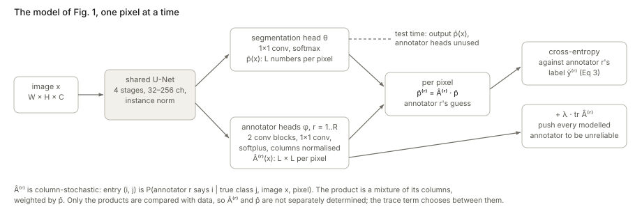
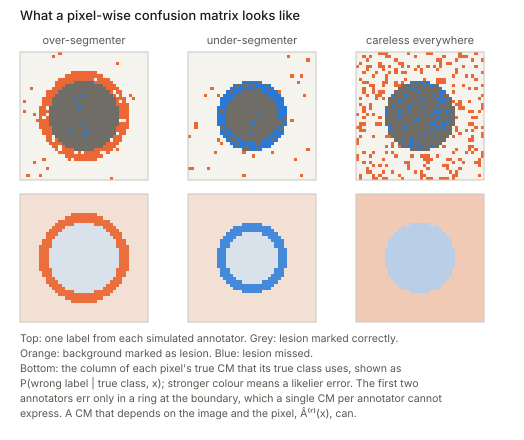
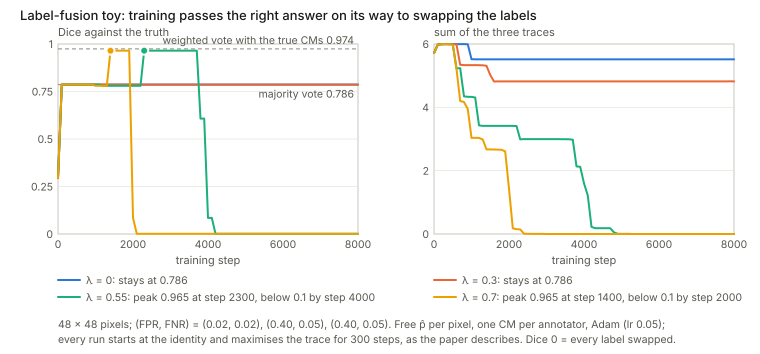

## Links

- **[PMC10533416](https://pmc.ncbi.nlm.nih.gov/articles/PMC10533416/)**: the open-access full text,
  published as [doi:10.1016/j.patcog.2023.109400](https://doi.org/10.1016/j.patcog.2023.109400).
- **[arXiv:2007.15963](https://arxiv.org/abs/2007.15963)**: the NeurIPS 2020 version, *Disentangling
  Human Error from the Ground Truth in Segmentation of Medical Images*. It has the same method and
  theorem. Its Appendix C holds the proof that the journal version sends to a supplement. The journal
  version adds a real multiple-sclerosis dataset (QSMSC), a section on grading annotators and the
  low-rank material from the appendix.
- **Code**: [moucheng2017/Learn_Noisy_Labels_Medical_Images](https://github.com/moucheng2017/Learn_Noisy_Labels_Medical_Images)
  (`Loss.py`, `Models.py`, `Train_ours.py`). The implementation facts below come from there.
- **Where the trace comes from**: R. Tanno, A. Saeedi, S. Sankaranarayanan, D. C. Alexander &
  N. Silberman, *Learning From Noisy Labels by Regularized Estimation of Annotator Confusion*, CVPR
  2019. Same regulariser, for classification, with a population-level theorem.
- **[Interactive companion](figures/interactive.html)**: one pixel with every explanation of its
  label drawn as a band, where you can switch the constraint that Theorem 1 needs and watch the
  minimum move; a toy fusion problem you can train in the browser and watch pass the right answer on
  its way to swapping the labels; and the trace next to HSIC for one annotator.
- **[Runnable code](https://github.com/msrepo/theory_inclined_papers_with_annotations/blob/main/papers/2023-zhang-multiple-annotators/code/trace_identifiability.py)**:
  every number on this page, and the four figures (`python3 trace_identifiability.py --figures`).
  `make verify` runs it.
- Background pages: **[HSIC](../hsic/index.html)** (see the next section);
  **[EM](../expectation-maximization/index.html)**, which is how STAPLE, the main baseline, is fitted.

## A note on HSIC first

**This paper does not use HSIC.** Neither the journal version, nor the NeurIPS 2020 version, nor the
released code mention the Hilbert–Schmidt independence criterion or any kernel dependence measure.
What separates annotator mistakes from the true segmentation is the **trace of the annotators'
confusion matrices**, added to the loss.

The two are related, though, and the link helps. Encode the annotator's label and the true label as
one-hot vectors and form their cross-covariance matrix $C$ (the object of §2 of the
[HSIC page](../hsic/index.html)). HSIC with delta kernels is $\lVert C\rVert_F^2$, a quadratic
function of $C$. The paper's penalty, with the classes weighted equally, is $1+L\operatorname{tr}C$,
a *linear* one. When the annotator's label ignores the truth, $C=0$: HSIC is zero, and the trace
sits at 1, the smallest value any row-dominant CM can have. §[The trace and HSIC](#the-trace-and-hsic)
works this out, and explains why the trace's sign matters.

## In one paragraph

Several radiologists outline the same scan and disagree. This paper trains two networks from the
noisy outlines alone. A **segmentation network** outputs, at every pixel, a probability for each
class; this is the unknown "expert consensus". An **annotator network** outputs, for every annotator
and every pixel, a **confusion matrix (CM)**: the probability that this annotator writes class $i$ when
the truth is class $j$. Multiplying the two gives each annotator's predicted label distribution, and
cross-entropy fits it to that annotator's actual labels. The fit alone cannot tell a sloppy annotator
on a clean truth from a careful annotator on a blurry truth, because both give the same product. The
paper's tie-breaker is to add $\lambda\cdot\operatorname{tr}(\text{CM})$ to the loss: among all
explanations that fit, prefer the one where the annotators are **as unreliable as possible**, which
leaves the cleanest segmentation. A theorem backs this at a single pixel. Experiments on MNIST, MS
lesions, BraTS, LIDC and a new MS dataset beat STAPLE and its variants, most clearly when each image
has only one label. Two findings below are not in the paper. First, the theorem's proof needs a
condition that the statement leaves out. Second, without that condition the trace is smallest at the
**label-swapped** solution, and only the warm-up keeps training away from it.

## The spine of the argument

1. **Model** (§2.2, Eqs 1–2). An annotator's label at a pixel is the true label passed through a
   pixel- and image-dependent CM. One network models $p(y\mid x)$, another the CMs.
2. **Fit** (§2.3, Eq 3). The negative log-likelihood of all labels is a sum of cross-entropies between
   $\hat A^{(r)}\hat p$ and annotator $r$'s label.
3. **Problem.** Only the products $\hat A^{(r)}\hat p$ meet the data, so many pairs fit equally well.
4. **Fix** (Eq 4). Add $\lambda\operatorname{tr}\hat A^{(r)}$: of all pairs that fit, take the one
   with the least reliable annotators.
5. **Justification** (§2.4, Theorem 1). If the fit is exact and the mean CM is diagonally dominant,
   the minimal-trace solution has the correct CM column and the correct one-hot label at each pixel.
6. **Engineering** (§2.5). A shared U-Net with $1+R$ heads, a warm-up at identity CMs, and optional
   low-rank CMs.
7. **Evidence** (§3). Higher Dice and lower CM error than mean/majority labels, STAPLE, Spatial STAPLE,
   a global-CM variant and the Probabilistic U-Net, on four datasets with simulated or real annotators.

## Setup and notation

| Symbol | Meaning |
|---|---|
| $x\in\mathbb R^{W\times H\times C}$ | an image; pixels are indexed by $(w,h)$ |
| $L$, $\mathcal Y=\{1,\dots,L\}$ | number of classes (2 for lesion/background); the class set |
| $y_{wh}$ | the true ("expert consensus") class at a pixel, never observed |
| $\tilde y^{(r)}_{wh}$ | the label annotator $r$ gave that pixel |
| $S(x)$ | the annotators who labelled image $x$ (at least one) |
| $\hat p_\theta(x)\in\mathbb R^{W\times H\times L}$ | segmentation network: a probability vector over classes at every pixel |
| $\hat A^{(r)}_\phi(x)\in[0,1]^{W\times H\times L\times L}$ | annotator network: an $L\times L$ CM for annotator $r$ at every pixel |
| $a_{ij}=P(\tilde y=i\mid y=j,x)$ | CM entry: row $i$ is what the annotator writes, column $j$ is the truth |
| $\hat p^{(r)}=\hat A^{(r)}\cdot\hat p$ | annotator $r$'s predicted label distribution, a matrix–vector product at each pixel |
| $\lambda$ | trace weight (0.7 MNIST and MS, 1.5 BraTS, 0.9 LIDC, NeurIPS appendix Table 7) |
| $\pi_r$ | probability that annotator $r$ labels an image (used in the mean CM) |
| $A^*=\sum_r\pi_rA^{(r)}$, $\hat A^*$ | mean true CM and its estimate |

**Reading a CM.** Each **column** is a probability distribution: fix the truth $j$ and list what the
annotator might write. So columns sum to 1, and the matrix is called **column-stochastic**. Rows need
not sum to anything. For lesion segmentation ($L=2$, class 1 = background, class 2 = lesion):

$$
A=\begin{bmatrix}1-b & a\\ b & 1-a\end{bmatrix},\qquad
b=\text{false-positive rate},\quad a=\text{false-negative rate}.
$$

An over-segmenter has large $b$ near boundaries, an under-segmenter large $a$. **Diagonally
dominant** will matter later. It can mean the diagonal entry is the largest in its **row**
($a_{ii}>a_{ij}$) or the largest in its **column** ($a_{jj}>a_{ij}$), and the two are different
conditions. For $L=2$, row dominance is $a+b<1$ (the annotator is informative at all) and column
dominance is $a<\tfrac12$ and $b<\tfrac12$ (right more than half the time on each class).

## §2.2 The probabilistic model (Eqs 1–2)

**The generative story in words.** Nature picks a true class at each pixel. Annotator $r$ looks and
writes a label, which is right or wrong according to their CM at that pixel of that image. The CM
depends on the image because people err differently on a faint lesion than on a sharp one, and on
the pixel because errors cluster at boundaries.

**Two independence assumptions, then the law of total probability.** Given the image,
(1) annotators are independent of one another and (2) pixels are independent of one another. So the
probability of all the labels on $x$ is a product over annotators and pixels (Eq 1):

$$
p\big(\{\tilde y^{(r)}\}_{r\in S(x)}\mid x\big)=\prod_{r\in S(x)}\ \prod_{w,h} p\big(\tilde y^{(r)}_{wh}\mid x\big).
$$

Each factor is expanded over the unknown true class (Eq 2), "the annotator writes $i$" summed over
every truth that could have led to it:

$$
p\big(\tilde y^{(r)}_{wh}=i\mid x\big)=\sum_{j=1}^{L}\underbrace{p\big(\tilde y^{(r)}_{wh}=i\mid y_{wh}=j,x\big)}_{a^{(r)}_{ij}(x,w,h)}\ \underbrace{p\big(y_{wh}=j\mid x\big)}_{\hat p_j}
\quad\Longleftrightarrow\quad \hat p^{(r)}=\hat A^{(r)}\hat p .
$$

A small example. At a boundary pixel the network says "lesion with probability 0.9", so
$\hat p=(0.1,0.9)$. The over-segmenter's CM there has columns $(0.2,0.8)$ for a background truth and
$(0.02,0.98)$ for a lesion truth. Then
$\hat p^{(r)}=0.1\cdot(0.2,0.8)+0.9\cdot(0.02,0.98)=(0.038,0.962)$: they mark it lesion 96% of the
time. **A matrix–vector product with a column-stochastic matrix is a mixture of its columns,
weighted by $\hat p$.** This one sentence is enough for everything that follows.

**Eq 1 is a product of mixtures. STAPLE is a mixture of products.** The sum over the true class sits
*inside* the product over annotators, so each annotator gets their own copy of the unknown truth.
STAPLE and Dawid–Skene put the sum outside,
$\sum_j p(y=j\mid x)\prod_r a^{(r)}_{\tilde y^{(r)},j}$: one truth, seen by everyone, which is why
annotators agree. The two are equal when $\hat p$ is one-hot, and §2.4 does assume one true class per
pixel. During training, though, $\hat p$ is soft, and then they differ sharply. Take two *perfect*
annotators ($A=I$) who disagree at a pixel with $\hat p=(0.5,0.5)$. The product of mixtures gives that
event probability $0.25$; the mixture of products gives $0$ (code §2). So under Eq 1, disagreement can
be explained **without blaming anyone**: say the pixel is 50/50. This is where the need for a
regulariser starts. In the toy below, "every annotator perfect, $\hat p$ = fraction of votes" fits the
labels *better* than the truth does (cross-entropy 1.021 against 1.217).

## §2.3 The loss (Eqs 3–4)

**From likelihood to cross-entropy (Eq 3).** Take $-\log$ of Eq 1 over all $N$ training images. The
log turns products into sums, and $-\log p(\tilde y=i)$ is the cross-entropy between the predicted
distribution $\hat A^{(r)}\hat p$ and the one-hot label $i$:

$$
-\log p\big(\tilde Y^{(1)},\dots,\tilde Y^{(R)}\mid X\big)=\sum_{n=1}^{N}\sum_{r=1}^{R}\mathbb 1\big(r\in S(x_n)\big)\cdot
\operatorname{CE}\big(\hat A^{(r)}_\phi(x_n)\,\hat p_\theta(x_n),\ \tilde y^{(r)}_n\big).
$$

The indicator skips annotators who did not label image $n$. The code checks this identity on a
random example (both sides $12.8066611408$).

**Why Eq 3 alone cannot work.** The data only ever meet the products $\hat A^{(r)}\hat p$. Two ways
to change the factors without changing any product:

- **Relabel the truth.** Swap the names of the true classes: permute the entries of $\hat p$ and, in
  the same way, the *columns* of every $\hat A^{(r)}$. (The paper says "rows"; it has to be columns,
  because rows index what the annotator wrote, which is observed.) Every product is unchanged, and the
  segmentation network now paints background as lesion (code §3).
- **Move confusion between the factors.** Make $\hat p$ blurrier and the annotators more reliable, or
  the reverse. The next figure draws every such pair for one pixel.

**The fix (Eq 4).**

$$
\mathcal L_{\text{total}}(\theta,\phi)=\sum_{n}\sum_{r}\mathbb 1\big(r\in S(x_n)\big)\Big[\operatorname{CE}\big(\hat A^{(r)}\hat p,\tilde y^{(r)}_n\big)+\lambda\operatorname{tr}\hat A^{(r)}(x_n)\Big].
$$

$\operatorname{tr}\hat A=\sum_i P(\text{annotator writes }i\mid\text{truth is }i)$ adds up the
per-class hit rates. Pushing it down makes the modelled annotators worse. The cross-entropy still
insists that $\hat A\hat p$ matches the labels. Since the labels are fixed, worse annotators force a
*crisper* $\hat p$. The paper puts it as "the maximal amount of confusion that adequately explains the
noisy observations".

**What the trace is not.** The paper reads the mean trace as "the average probability that a randomly
selected annotator would provide an accurate label". That holds only if every class is equally
common. The trace weights lesion and background equally. With FPR 0.02, FNR 0.40 and lesions covering
2% of pixels, the accuracy is 0.972 but $\operatorname{tr}A/L=0.79$ (code §9). The practical
consequence is a penalty that pulls as hard on the lesion column as on the background column, at
every pixel.

## §2.4 Theorem 1, line by line

### The population version first (Tanno et al. 2019)

The idea is cleanest with one CM per annotator, shared by all images. Let $P$ be the classifier's own
confusion: $p_{ji}$ is the probability that it predicts $j$ when the truth is $i$. Each true class $i$
has *some* prediction, so $\sum_jp_{ji}=1$. A perfect fit means $\hat AP=A$. Then, for every class $i$,

$$
a_{ii}=\sum_j\hat a_{ij}\,p_{ji}\ \le\ \sum_j\hat a_{ii}\,p_{ji}=\hat a_{ii}\qquad\text{(row dominance: }\hat a_{ij}\le\hat a_{ii}\text{)} .
$$

In words, $a_{ii}$ is an average of row $i$ of $\hat A$, weighted by how the classifier spreads class
$i$, and an average cannot exceed its largest term, which is the diagonal. Summing over $i$ gives
$\operatorname{tr}A\le\operatorname{tr}\hat A$. Equality forces all of $P$'s weight onto the diagonal,
so $P=I$: the classifier is perfect and $\hat A=A$. **Row dominance is enough here because every
class occurs somewhere, so every diagonal entry of $A$ is tied to the data by the same inequality.**

### The per-pixel version (this paper)

Now there is one pixel, whose true class is $k$, so $p=e_k$. Only **one column** of the true CM is
ever exercised, $Ae_k=q$, the annotator's label distribution at this pixel. The proof has three steps.

**Step 1 (Eqs 5–6).** The same averaging trick, for class $k$ only:
$a_{kk}=[\hat A\hat p]_k=\sum_j\hat a_{kj}\hat p_j\le\hat a_{kk}$. This needs **row $k$ of $\hat A$**
to be dominated by its diagonal, as the theorem states.

**Step 2, where the gap is.** The other diagonal entries of the true $A$ are never used, so the proof
fixes them by convention: the non-$k$ columns of $A$ are uniform, $1/L$ each. Then
$\operatorname{tr}A=a_{kk}+\frac{L-1}{L}$. To conclude $\operatorname{tr}A\le\operatorname{tr}\hat A$,
the proof asserts that "the diagonal dominance of the estimated CM means each $\hat a_{ii}$ is at
least $1/L$". **That is true when the diagonal is the largest entry of its column** (a column sums to
1, so its largest entry is at least $1/L$). **It is false when the diagonal is only the largest entry
of its row**, which is what the theorem assumes. A counterexample for $L=2$ with
$q=(0.2,0.8)$ (code §5):

$$
\hat A=\begin{bmatrix}0.28&0.18\\0.72&0.82\end{bmatrix},\quad \hat p=q:\qquad
\hat A\hat p=(0.2,0.8)=q,\quad 0.28>0.18,\ 0.82>0.72,\quad \operatorname{tr}\hat A=1.10<1.30=\operatorname{tr}A .
$$

This matrix is $(1-\varepsilon)\,q\mathbf 1^\top+\varepsilon I$ with $\varepsilon=0.1$, and it works for
any $L$ (the code has an $L=3$ case: 1.20 against 1.37). Its segmentation is $\hat p=q$, which just
copies the noisy label rather than recovering $e_k$. A random search over $L=3$ agrees. Under row
dominance alone, traces as low as 1.04 fit the data, with $\hat p=(0.30,0.65,0.05)$. With column
dominance added, no feasible point beats the bound $q_k+\frac{L-1}{L}=1.367$. The best point found
has $\hat p=(0.10,0.84,0.06)$, leaning towards $e_k$ (code §6).

**Step 3, uniqueness.** If the traces are equal, then $a_{kk}=\hat a_{kk}$. With a strictly
dominant row $k$, that forces $\hat p=e_k$, so the $k$-th columns match. This step is fine.

**The picture for $L=2$.** Fix the pixel's label distribution $q=(1-t,t)$ and parametrise every
pair that reproduces it by $s=\hat p(\text{lesion})$ and $b$, the false-positive rate. The third
number, $a$, is then fixed, and the trace on this set is simply

$$
\operatorname{tr}\hat A=1+\frac{t-b}{s}.
$$

So every set of equal trace is a straight line through the point $(s,b)=(0,t)$. Lowering the trace
means swinging the line anticlockwise about that point, as far as the allowed region permits.

- **No constraint:** the line swings all the way to **F**, trace 0: the anti-diagonal CM with the
  segmentation inverted. The permutation symmetry is not broken in favour of the truth; it is broken
  *against* it.
- **Row dominance** (Theorem 1's words), which for $L=2$ is $b<t$: the line stops at the horizontal
  $b=t$. Trace 1, $\hat A=q\mathbf 1^\top$, **any $s$**. The modelled annotator ignores the truth, so
  the segmentation network is unconstrained.
- **Column dominance** (what the proof uses), $b<\frac12$: the line stops at **T**, $s=1$, trace
  $t+\frac12$. This is the truth.

For $t<\frac12$, column dominance sends $s$ to 0 instead: the pixel is declared background (code §4).
So **at one pixel, for binary segmentation, minimising the trace returns the class that the average
annotator writes more than half the time.** That is the expected majority vote, no more and no less.
The paper's footnote 2 claims the theorem's condition is weaker than majority vote's; for $L=2$ the two
coincide. Whatever the method gains over majority vote, and Tables 1–6 say it gains a lot, comes from
**sharing CMs and segmentations across pixels and images**, not from the per-pixel theorem.

**The corrected statement**, for $L=2$. Suppose the fit is exact and the average annotator marks
the true class with probability above $\frac12$. Minimise $\operatorname{tr}\hat A^*$ over mean CMs
whose diagonal beats every other entry of its **row** and is at least every other entry of its
**column**. Every minimiser then has $\hat p=e_k$ and the true $k$-th column. (With a strict column
condition the minimum is approached but not reached: the unused column tends to uniform.)

### Many annotators

Average the fits: $\hat A^{(r)}\hat p=A^{(r)}e_k$ for every $r$ gives $\hat A^*\hat p=A^*e_k$. The
single-annotator argument then applies to the mean CM, and $\hat p=e_k$ gives each annotator's $k$-th
column back. Two points are worth noticing:

- The coupling comes entirely from the **shared** $\hat p$: one segmentation has to explain every
  annotator at once.
- The conditions are on the **mean** CM. An individual annotator can be useless, for example the
  "blank" annotator who marks nothing, provided the average is dominant.

(The $\pi_r$ need not sum to 1 as written, so $\hat A^*$ is column-stochastic only after dividing by
$\sum_r\pi_r$, as Tanno et al. do. The journal version also puts a hat on the true $A^*$ in its
definition.)

### What the theorem does not cover, and a toy that shows it

Nothing in the loss **enforces** dominance. Eq 4 is minimised over all CMs. The paper's safeguard is
to start the CMs at the identity by "training the annotation network to maximise the trace for a
sufficient number of iterations as a warm-up period", and to hope that training stays in the dominant
region. The code (§11) tests that on the smallest problem where it can be tested. The pixels are
free (one logit each, the limit of a very flexible segmentation network), there is one CM per
annotator, and the labels are 48 × 48 pixels from one careful annotator (FPR, FNR = 0.02, 0.02) and two
sloppy ones (0.40, 0.05). Majority vote scores Dice 0.786. A vote weighted by the true CMs scores
0.974.

- With $\lambda=0$ the model sits at "every annotator perfect, the pixel uncertain" and scores exactly
  the majority vote.
- $\lambda=0.3$ lowers the CM error (0.230 → 0.152) but not Dice.
- $\lambda=0.55$ passes a plateau at **Dice 0.965**, close to the weighted vote. **Then every label
  swaps** (Dice 0.001 by step 5000, trace 0).
- $\lambda=0.7$ does the same, sooner.
- Without the warm-up, $\lambda=0.55$ swaps from the start, whether the CMs begin at the identity or
  at uniform, which is where a softplus head starts on average.
- Even on the good plateau the CMs are not the true ones: every FNR is estimated near 0.6.

The right answer is a place training *passes through*, and the paper's result therefore depends on
when training stops. The paper reports validation curves (Fig. 2) but does not say whether they are
scored against ground truth.

This is a toy with global CMs and no image features, so it proves nothing about the U-Net. But it is
exactly the mechanism that Eq 4 relies on, and it behaves as the analysis above predicts. The
[interactive page](figures/interactive.html) lets you run it.

## The trace and HSIC

Treat the annotator's label $\tilde y$ and the true label $y$ as random variables, with the classes
weighted equally ($\pi_j=1/L$). Their joint distribution is $\hat A\operatorname{diag}(\pi)$, and the
cross-covariance of their one-hot encodings is

$$
C_{ij}=P(\tilde y=i,\,y=j)-P(\tilde y=i)\,P(y=j),\qquad C=\hat A\operatorname{diag}(\pi)-(\hat A\pi)\,\pi^\top .
$$

Sum the diagonal. Every column of $\hat A$ sums to 1, so the sum of all entries of $\hat A$ is $L$, and

$$
\operatorname{tr}C=\frac{\operatorname{tr}\hat A}{L}-\frac{L}{L^2}\quad\Longrightarrow\quad \operatorname{tr}\hat A=1+L\operatorname{tr}C .
$$

HSIC with delta kernels (a linear kernel on one-hot vectors) is $\lVert C\rVert_F^2$, the sum of the
squares of the same entries ([HSIC page, §2](../hsic/index.html)). The code confirms both identities on
random matrices. So:

- **Both measure how much the annotator's label depends on the truth.** $\operatorname{tr}\hat A-1$
  and HSIC both vanish when it does not depend at all, which is when $\hat A=u\mathbf 1^\top$: every
  column the same. Under row dominance
  $\operatorname{tr}\hat A\ge1$ always, with equality exactly for those rank-one matrices (code §7).
  The reason is short: each diagonal entry is at least the average of its row, and the $L$ row
  averages add up to $\frac1L\sum_{ij}\hat a_{ij}=1$.
  "Maximally unreliable" therefore means *as close to independent of the truth as the data allow*, and
  the degenerate end of that scale is the yellow line in the figure above.
- **The trace is linear and signed. HSIC is quadratic and sign-blind.** A faithful annotator
  $\begin{bmatrix}0.9&0.2\\0.1&0.8\end{bmatrix}$ has trace 1.70. The same annotator with the true
  classes swapped has trace 0.30. Both have HSIC 0.1225 (code §8). HSIC cannot see the relabelling
  that the paper names as its central ambiguity. The trace can see it, and prefers the swap, which is
  why the warm-up has to point it the right way.
- The linearity is also what makes Theorem 1 short. The trace of a mixture is a mixture of traces, so
  the proof is one inequality between averages.

## §2.5 Implementation

**Low-rank CMs.** A full CM costs $WHL^2$ numbers per annotator. Computing the products costs
$WH(2L-1)L$ operations: $L$ dot products of length $L$ at each pixel. The paper factors
$\hat A=B_1B_2^\top$ with $B_1,B_2\in\mathbb R^{L\times l}$ and computes $B_1(B_2^\top\hat p)$, which
costs $l(2L-1)+L(2l-1)=4L(l-0.25)-l$ per pixel. For BraTS (192 × 192, $L=4$, $l=1$) this gives
exactly Table 4's numbers: 589,824 → 294,912 entries and 1,032,192 → 405,504 operations (code §10).
Two things the text leaves out:

- A column-normalised rank-1 matrix $uv^\top$ has **every column equal to $u/\sum u$**. The product
  $\hat A\hat p$ then ignores $\hat p$: the annotator's label is modelled as independent of the truth,
  the rank-one case above. The released `noisy_label_loss_low_rank` avoids this by adding a learned
  multiple of the identity, $\operatorname{normalise}(B_2B_1+sI)$, which the paper does not mention.
  It also forms the full $L\times L$ matrix per pixel, so the saving in operations is not the one
  counted.
- Table 4's cost: Dice 53.47 → 50.56 and CM error 0.1185 → 0.1925 for 2.68 → 2.57 GB of GPU memory.
  With $L=4$ the saving is small, and the paper says so.

**What the released code does** (`Models.py`, `Loss.py`, `Train_ours.py`):

- One U-Net, four stages, instance norm. The segmentation head is a 1 × 1 conv to $L$ channels. Each
  annotator head is two conv blocks and a 1 × 1 conv to $L^2$ channels, then a softplus, then each CM
  is normalised over its columns. The heads are fixed at four annotators.
- The loss is $\sum_r$ (mean over pixels of the cross-entropy) + $\alpha\sum_r$ (mean over pixels of
  the trace).
- **There is no warm-up phase** in `Train_ours.py`. Training uses Eq 4 from the first step. The
  pixel-wise CMs start wherever a randomly initialised 1 × 1 conv and a softplus put them: uniform on
  average, with no preference for the diagonal. Only the global-CM baseline starts from `torch.eye`,
  which after the softplus and normalisation is 0.65 on the diagonal for $L=2$.
- The trace weight varies: the comment in `Run.py` says it "should be larger than 0.5, default value
  is 1", `Run.py` passes 0.4, the MNIST notebook uses 0.001 and the NeurIPS appendix lists 0.7–1.5.
- The PyTorch listing in the NeurIPS appendix assigns the trace inside the loop over annotators
  (`regularisation = ...`), so only the last annotator would be penalised. `Loss.py` accumulates
  (`+=`), which is correct.

**"Training without sample bias"** (new in the journal version) is two paragraphs: train the annotator
network first, freeze it, then train the segmentation network through a product of experts. It has no
equation, no experiment and no code in the repository.

## Experiments, briefly

- **Simulated annotators.** On MNIST, ISBI2015 MS lesions and BraTS, labels are made from the ground
  truth by morphological operations (Morpho-MNIST): faithful, over-segmenting, under-segmenting,
  fractured, and blank.
- **Real annotators.** LIDC-IDRI (four readers per nodule) and QSMSC, a new MS dataset with three
  radiologists plus one expert whose segmentation serves as the consensus.
- **Dense labels, Dice (Table 1).** MNIST: STAPLE 78.03, Spatial STAPLE 78.96, global CM 79.21,
  without trace 79.63, **ours 82.92**, oracle 83.29. ISBI2015: 55.05 / 58.37 / 61.58 / 65.77 /
  **67.55**, oracle 78.86. CM error on MNIST falls from 0.1125 without the trace to 0.0893 with it.
- **One label per image (Table 2).** STAPLE collapses (MNIST 54.07, ISBI 35.74). Ours holds up (76.48,
  56.43). This is where sharing across images, which STAPLE cannot do, shows most.
- **BraTS, target class (Table 3).** 46.73 (STAPLE) → 53.47 dense and 38.74 → 46.21 single. The
  "14.4%" margin is relative: 6.7 Dice points.
- **LIDC.** Single label: 57.32 → 68.12 (NeurIPS Table 5). The "18.8%" is relative: 10.8 points.
- **QSMSC (Table 6).** STAPLE 58.36, Spatial STAPLE 61.34, global CM 62.08, without trace 63.72,
  **ours 69.81**, oracle 78.49.
- **Generalised energy distance against the Probabilistic U-Net (Table 5).** Lower on all four datasets,
  e.g. MNIST 1.24 vs 1.46.
- **Grading annotators (§4.2, Figs 9–10).** On QSMSC, the estimated CMs rank annotator 3 best, which
  agrees with their Dice and their stated confidence.

## Questions and doubts

- **No HSIC.** Covered at the top. If a different paper was meant, one that pairs annotator models
  with an independence penalty, it is not this one.
- **Theorem 1 needs column dominance of the estimate**, not only the row dominance it states. With row
  dominance alone the counterexample above has a smaller trace than the truth, and the infimum is the
  rank-one "annotator ignores the truth" CM, with the segmentation left free. The population version
  (Tanno et al. 2019) does not have this problem, because there every class occurs, so every diagonal
  entry is tied to the data.
- **Per pixel, for $L=2$, the theorem equals the expected majority vote.** So footnote 2's "more
  strict condition" for majority voting does not hold in the binary case. (The footnote also says
  "row" where the votes for the true class form a column.) The real gains must come from sharing
  across pixels and images. The theorem does not model that, and it would be the more interesting
  result to have.
- **The loss's global minimum is the label swap.** Only the initial condition keeps training away from
  it. The warm-up that supposedly provides it is not in the released code, whose pixel-wise CMs start
  with no preference for the diagonal. In the toy, the good solution is a plateau that training leaves. Which labels the
  validation set is scored against, and how the stopping epoch is chosen, therefore matter more than
  the paper admits. If ground-truth validation labels were used, that is supervision the method claims
  not to need.
- **Eq 1 discards the agreement between annotators.** By treating annotators as independent given the
  image, rather than given the true label, the likelihood lets a soft $\hat p$ absorb disagreement.
  STAPLE's mixture of products uses exactly that agreement. With three or more annotators who are
  conditionally independent given the truth and have full-rank CMs, Kruskal's theorem makes such a
  model identifiable up to relabelling (Allman, Matias & Rhodes, *Annals of Statistics* 2009). A
  version of Eq 3 with the sum over $y$ outside the product over annotators might need less from the
  regulariser. It is a small change, and the paper does not try it.
- **The independence assumptions could be tested,** and this is where an independence criterion
  would belong. Annotators independent given the image, and pixels independent given the image, can
  both be checked on dense labels. Conditional variants of HSIC, such as the KCI test (Zhang, Peters,
  Janzing & Schölkopf, UAI 2011), are the standard tool. Separately, an error that most annotators
  share at a pixel (two radiologists fooled by the same artefact) ends up in $\hat p$ as "truth": per
  pixel, the trace follows the average annotator.
- **The trace penalises columns a pixel never uses.** At a background pixel, the data say nothing about
  $P(\text{write lesion}\mid\text{lesion},x)$ there, yet the trace pushes it down. The CM network is a
  smooth function of the image, so this pressure plausibly spreads to nearby lesion pixels. With small
  lesions, most pixels are background.
- **LIDC has no consistent annotator identities** (§3.4 admits this), yet the model needs "which label
  came from whom" to learn a CM per annotator. There, head $r$ models a *slot*, which is a different
  person on different nodules. LIDC's "ground truth" is itself a Spatial STAPLE fusion (NeurIPS
  Appendix A.3).
- **Low rank as written degenerates at rank 1** once the columns are normalised, which they must be
  for $\hat A$ to be a CM. The code quietly adds $sI$. The operation count assumes the matrix is never
  formed, and the code forms it.
- **Statistics.** Bold entries are "statistically ($p<.01$) better" by paired $t$-tests. With three runs
  per model, what is paired is not stated. The NeurIPS appendix says both "at least 3 times with
  different random initialisations" and "the same initialization".
- **The oracle** is described as trained on the consensus labels in §3.2, but as "with known CMs" in
  Tables 1, 3 and 6.
- Small slips: "permutations of rows" should be columns; $\hat A$ on the true $A^*$; $\pi_r$ not
  normalised; $x$ for $x_n$ inside Eq 3 and $x_i$ for $x_n$ in Eq 4; the "6.3%" of §3.3 is the relative Dice
  gain over STAPLE on MNIST ($82.92/78.03$), though the sentence attributes it to CM estimation.

## Takeaways

- **Model:** each annotator's label distribution at a pixel is a mixture of the columns of their
  confusion matrix, weighted by the segmentation's class probabilities: $\hat p^{(r)}=\hat A^{(r)}\hat p$.
  Fit it by cross-entropy. At test time keep $\hat p$ and discard the annotator heads.
- **Cross-entropy only sees products.** Relabelling the truth, or trading blur in $\hat p$ for
  reliability in $\hat A$, leaves the fit unchanged. Under Eq 1 the fit even *prefers* perfect
  annotators and an uncertain truth.
- **The trace chooses the least reliable annotators that still fit,** which makes $\hat p$ crisp. As a
  function of $(s,b)$ at one pixel it is $1+(t-b)/s$, a fan of straight lines through $(0,t)$.
- **Theorem 1 at one pixel needs the diagonal to dominate its column as well as its row.** With both,
  and two classes, the minimiser is the truth when the average annotator is right more than half the
  time, which is the majority vote. Without the column condition the minimiser is the rank-one "annotator ignores the
  truth" CM. Without any condition it is the label swap.
- **The trace is $1+L\operatorname{tr}C$ and HSIC is $\lVert C\rVert_F^2$, for the same
  cross-covariance $C$.** Both measure dependence between the annotator and the truth. Only the trace
  can tell agreement from anti-agreement.
- **In practice the warm-up and the stopping time do real work.** In a toy, training passes near the
  right answer and then swaps the labels. The released code has no warm-up. The method beats STAPLE
  most clearly with one label per image, where sharing parameters across images is the whole point.
