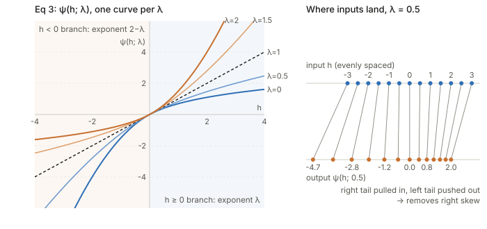
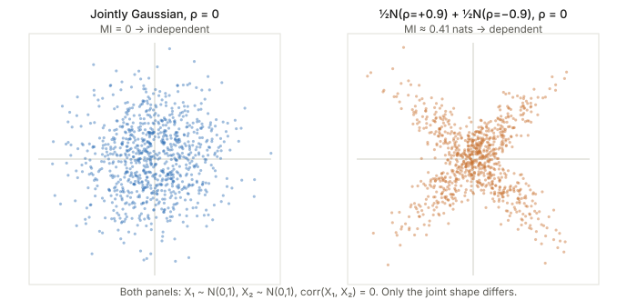

## Links

- **[arXiv:2505.00685](https://arxiv.org/abs/2505.00685)**: preprint of the ICML 2025 paper
  (PMLR 267). Code at
  [DanielEftekhari/normality-normalization](https://github.com/DanielEftekhari/normality-normalization).
- **[Interactive companion](figures/power-transform.html)**: Eq 3 on the number line, a batch
  you can Gaussianize while watching the NLL and its Newton step, and Lemma B.1 as two scatter
  plots with sliders.
- **[Gaussianity in practice](../gaussianity-in-practice/index.html)**: the topic page cites
  this paper as reference [1], the one that Gaussianizes deliberately rather than assuming it.
- **[Betser 2026, InfoNCE induces Gaussian](../2026-betser-infonce-gaussian/index.html)**:
  the other direction. Contrastive training produces Gaussian features without being asked to.
- **[Runnable code](https://github.com/msrepo/theory_inclined_papers_with_annotations/blob/main/papers/2025-eftekhari-normality-normalization/code/normality_norm.py)**:
  checks every derivative in Appendices C–D against finite differences (including the $h<0$
  branch the paper skips), compares one Newton step with the exact minimiser, and puts numbers
  on Lemma B.1. `make verify` runs it.

## In one paragraph

BatchNorm, LayerNorm and friends fix the first two moments of each unit's pre-activations but
say nothing about the *shape* of the distribution. This paper argues the shape should be
Gaussian, for information-theoretic reasons: a Gaussian carries the most information for a
given variance, is the worst-case noise to be robust against, and is the one joint
distribution where "uncorrelated" already means "independent". It then builds a drop-in layer,
**normality normalization**, that does four things: standardise as usual; estimate a
**Yeo–Johnson power transform** exponent $\hat\lambda$ with a single closed-form Newton step;
apply the transform to Gaussianize each unit; and during training add Gaussian noise scaled by
the batch's mean absolute deviation. There are no new learned parameters. It beats the
corresponding plain normalization layer across ResNets, WideResNets and ViTs (e.g. ImageNet
top-1 with a ViT: 71.5 → 75.3), and Q–Q plots confirm the features stay Gaussian through
training where BatchNorm's drift away. The theory motivates the method but does not prove it
works. The appendices contain one lemma (B.1) and two calculus derivations (C, D), all of which
check out, with small caveats.

## The spine of the argument

1. **Gaussian is special** (§2): best signal, worst noise (Theorem 2.1); maximum entropy for
   a given variance; and for *jointly* Gaussian variables, uncorrelated ⇔ independent
   (Lemma B.1).
2. **So encourage Gaussian activations and train with Gaussian noise.** Noise acts as a
   regulariser, and the Gaussian is the distribution that tolerates the most noise for the
   information it carries.
3. **Tool: the power transform** (§3, Eq 3). It is a one-parameter monotone family, and its
   exponent is chosen by maximum likelihood (Eq 4, derived in Appendix C).
4. **Make it cheap** (§4.1, Appendix D): Taylor-expand the NLL around $\lambda=1$ (identity)
   and take one Newton step. After standardisation the step needs only three batch averages.
5. **Add scaled Gaussian noise** (§4.2), train only.
6. **Evidence** (§5): accuracy across models, datasets, widths, depths and batch sizes; Q–Q
   normality through depth; ablations showing both the transform and the noise matter.

## Setup and notation

| Symbol | Meaning |
|---|---|
| $u_i$, $i=1..N$ | one channel's raw pre-activations over the normalisation set ($N=BHW$ for BatchNorm on conv layers) |
| $h_i=(u_i-\hat\mu)/\sqrt{\hat\sigma^2+\epsilon}$ | the usual standardised value, so mean 0 and variance 1 |
| $\psi(h;\lambda)$ | Yeo–Johnson power transform (Eq 3) |
| $\lambda$, $\hat\lambda$ | transform exponent; its one-step Newton estimate (Eq 5) |
| $x_i=\psi(h_i;\hat\lambda)$ | the Gaussianized value |
| $\mathcal L(\boldsymbol h;\lambda)$ | profile negative log-likelihood of $\lambda$ (Eqs 4, 13) |
| $\mathcal L'$, $\mathcal L''$ | derivatives in $\lambda$, evaluated at $\lambda=1$ |
| $\xi$, $s$, $z_i$ | noise factor (hyperparameter, 0.4 for ResNets, 1.0 for ViTs); scale $s=\frac1N\sum\lvert x_i-\bar x\rvert$ (gradient-detached); $z_i\sim\mathcal N(0,1)$ |
| $y_i=x_i+z_i\,\xi\,s$ | noisy output (training only) |
| $v_i=\gamma y_i+\beta$ | the usual learned affine step |
| $I(X;Y)$, $h(X)$ | mutual information; differential entropy |

## §2 Motivation, in plain terms

### Theorem 2.1: the mutual information game

Two players share an additive channel $Y=X+Z$. The **signal** $X$ wants $Y$ to reveal as much
as possible about $X$ (maximise $I(X;X+Z)$). The **noise** $Z$ wants to hide $X$ (minimise it).
Each player may use any distribution with a given mean and variance. The theorem says both
players should choose a Gaussian:

$$I(X;X+Z^*)\;\le\;I(X^*;X^*+Z^*)\;\le\;I(X^*;X^*+Z).$$

Read it left to right. Against Gaussian noise $Z^*$, no signal beats a Gaussian signal. For a
Gaussian signal $X^*$, no noise hurts more than Gaussian noise. So $(X^*,Z^*)$ is a saddle point
and neither side gains by deviating (Eq 2).

Where each inequality comes from, since the paper's one-line proof is terse:

- **Left.** $I(X;X+Z^*)=h(X+Z^*)-h(Z^*)$. Only the first term depends on $X$, and
  $X+Z^*$ has variance $\sigma_x^2+\sigma_z^2$ however $X$ is distributed. The Gaussian has
  the largest entropy for that variance, so $X+Z^*$ is best off being Gaussian, which happens
  when $X$ is. This is **maximum entropy**.
- **Right.** $I(X^*;X^*+Z)=h(X^*+Z)-h(Z)$. The **entropy power inequality**
  $e^{2h(X^*+Z)}\ge e^{2h(X^*)}+e^{2h(Z)}$ lower-bounds it by
  $\tfrac12\log\!\big(1+2\pi e\sigma_x^2/e^{2h(Z)}\big)$. Maximum entropy
  ($e^{2h(Z)}\le2\pi e\sigma_z^2$) then gives $\tfrac12\log(1+\sigma_x^2/\sigma_z^2)$, the
  all-Gaussian value.

(The paper attributes EPI to the first inequality and maximum entropy to the second. As far as
I can tell it's the other way round, with the second needing both. The theorem itself is
standard; see Cover & Thomas, ch. 9.)

**How it's used.** Two heuristics: (i) if you're going to inject noise as a regulariser,
Gaussian noise is the hardest to be robust to, so it regularises most; (ii) Gaussian
activations are the ones that keep the most information under a given amount of noise. Neither
is a theorem about networks. It's an analogy with each layer treated as a noisy channel.

### Maximum entropy

For a fixed variance, the Gaussian has the largest differential entropy,
$h=\tfrac12\log(2\pi e\sigma^2)$. Since the normalisation layer already fixes the variance, a
Gaussian unit is the one that "uses" that variance budget most fully.

### Independence (this is where Lemma B.1 comes in)

For Gaussian variables, **uncorrelated means independent**. That is true only for *jointly*
Gaussian variables, and the subtlety matters for this paper; see the
[Lemma B.1 section](#appendix-b-lemma-b.1-gaussian-joints-minimise-mutual-information) below.

## §3 The power transform (Eq 3)

$$
\psi(h;\lambda)=\begin{cases}
\frac1\lambda\big((1+h)^\lambda-1\big), & h\ge0,\ \lambda\ne0\\[2pt]
\log(1+h), & h\ge0,\ \lambda=0\\[2pt]
\frac{-1}{2-\lambda}\big((1-h)^{2-\lambda}-1\big), & h<0,\ \lambda\ne2\\[2pt]
-\log(1-h), & h<0,\ \lambda=2
\end{cases}
$$

How to read it, one idea at a time:

- **Right half ($h\ge0$)** is the classic **Box–Cox** transform applied to $1+h$. At
  $\lambda=1$ it's $h$ itself. At $\lambda=0$ it's $\log(1+h)$: the limit of
  $(a^\lambda-1)/\lambda$ as $\lambda\to0$ is $\log a$, which is why that case is listed
  separately. For $\lambda<1$ it grows slower than linear and **pulls big positives in**.
- **Left half ($h<0$)** is the right half *mirrored* ($h\mapsto-h$, output negated) with
  exponent $2-\lambda$ instead of $\lambda$. So a $\lambda$ that compresses the right tail
  ($\lambda<1$, hence $2-\lambda>1$) **stretches the left tail**. Both effects push a
  right-skewed batch towards symmetry. This mirroring is Yeo & Johnson's (2000) fix for Box–Cox
  only accepting positive inputs.
- **Slope 1 at the origin for every $\lambda$.** $\partial\psi/\partial h=(1+h)^{\lambda-1}$
  on the right and $(1-h)^{1-\lambda}$ on the left, both 1 at $h=0$. So the transform leaves the
  bulk of a standardised batch almost alone and only bends the tails.
- **Monotone.** Both slopes are positive, so values are never reordered. The CDF argument
  in Appendix C relies on this.
- **Limits of the family.** One parameter, monotone, slope pinned at 0: it can remove **skew**
  but not **symmetric heavy tails** or **multimodality**. The code measures this: for a
  Student-t (5 dof) batch, $\hat\lambda=0.96$ and nothing changes; for a lognormal batch the skew
  falls from 1.34 to 0.15.

The [interactive page](figures/power-transform.html) lets you slide $\lambda$ and watch the
number line bend, then Gaussianize a batch of your choice.

## §4 The layer (Algorithm 1)

Per channel, per minibatch:

1. **Standardise:** $h_i=(u_i-\hat\mu)/\sqrt{\hat\sigma^2+\epsilon}$, exactly BatchNorm (or
   Layer/Instance/Group norm, depending on which axes are pooled).
2. **Estimate $\hat\lambda$** with one Newton step (Eq 5):
   $\hat\lambda=1-\mathcal L'(\boldsymbol h;1)/\mathcal L''(\boldsymbol h;1)$.
3. **Transform:** $x_i=\psi(h_i;\hat\lambda)$.
4. **Noise (training only):** $y_i=x_i+z_i\,\xi\,s$ with $s=\frac1N\sum_i|x_i-\bar x|$, computed
   with gradient tracking off. $s$ is the mean absolute deviation, a robust spread estimate. For
   a standard-normal channel $s=\sqrt{2/\pi}\approx0.80$ (checked in code), so the noise
   standard deviation is about $0.8\,\xi$.
5. **Affine:** $v_i=\gamma y_i+\beta$.

At test time, a running average of $\hat\lambda$ is kept alongside the running mean and
variance, exactly as BatchNorm does for $\mu,\sigma^2$. No noise is added at test time.

Why standardise *before* transforming? Three reasons, one of them not stated in the paper.
(i) It makes $\hat\mu(1)=0$ and $\hat\sigma^2(1)=1$, which is what collapses Appendix D to a few
averages. (ii) Numerical stability. (iii) Yeo–Johnson isn't scale-invariant: $\psi(ch;\lambda)$
is not a rescaled $\psi(h;\lambda)$. Fixing the scale first makes $\lambda$ mean the same thing
in every channel.

Why noise *after* the transform and *additive*? The paper's argument (§5.6) is that dropout's
multiplicative noise enters the backward pass through the activations, while additive noise
with a detached scale doesn't change the gradients' form. Fig 7 shows it beating Gaussian
dropout at every retention rate tried, and beating unscaled noise with $s$ fixed at
$\sqrt{2/\pi}$. This is an empirical result, not a derived one.

## Appendix C: deriving the NLL (Eqs 4 and 13)

**What we want.** A $\lambda$ such that the transformed batch $x_i=\psi(h_i;\lambda)$ looks like
draws from some $\mathcal N(\mu,\sigma^2)$. Maximum likelihood turns that into an equation: write
down the density that the model "$\psi(H;\lambda)$ is Gaussian" assigns to the *observed* $h_i$,
and choose $\lambda$ (and $\mu,\sigma^2$) to make it largest.

**Step 1: the density of $H$ (Eqs 9–10).** The model is about $X=\psi(H)$, but the data are
values of $H$, so we need $H$'s density. Because $\psi$ is increasing, "$H\le h$" is the same
event as "$X\le\psi(h)$":

$$F_H(h)=P(H\le h)=P\big(X\le\psi(h;\lambda)\big)=F_X\big(\psi(h;\lambda)\big).$$

Differentiate in $h$ with the chain rule:

$$f_H(h)=f_X\big(\psi(h;\lambda)\big)\cdot\frac{\partial\psi}{\partial h}=f_X\big(\psi(h;\lambda)\big)\cdot(1+h)^{\lambda-1}\qquad(h\ge0).$$

This is the **change-of-variables formula**, the same one behind normalising flows. The extra
factor $\partial\psi/\partial h$ is the *Jacobian*: how much $\psi$ stretches the axis near $h$.
Where $\psi$ squashes (slope below 1), a lot of $H$-probability lands in a little $X$-space, and
the Jacobian accounts for that.

**Step 2: the NLL (Eq 11).** Average $-\log f_H(h_i)$ over the batch, with $f_X$ the
$\mathcal N(\mu,\sigma^2)$ density:

$$\mathcal L=\tfrac12\log(2\pi)+\tfrac12\log\sigma^2+\frac{1}{2N\sigma^2}\sum_i(x_i-\mu)^2-\frac{\lambda-1}{N}\sum_i\log(1+h_i).$$

The last term is the log-Jacobian, $\log(1+h)^{\lambda-1}=(\lambda-1)\log(1+h)$.

**Step 3: profile out $\mu$ and $\sigma^2$ (Eqs 12–13).** For fixed $\lambda$ the best $\mu,\sigma^2$
are the sample mean and variance of the $x_i$ (the usual Gaussian MLE). Substituting them makes
the third term exactly $\tfrac12$:

$$\boxed{\ \mathcal L(\boldsymbol h;\lambda)=\tfrac12\big(\log(2\pi)+1\big)+\tfrac12\log\hat\sigma^2(\lambda)-\frac{\lambda-1}{N}\sum_i\log(1+h_i)\ }$$

This is Eq 13 (= Eq 4). "Profile" just means $\mu$ and $\sigma^2$ have been optimised away, so
it's a function of $\lambda$ alone.

**Reading Eq 13 as a tug of war.** The **variance term** $\tfrac12\log\hat\sigma^2(\lambda)$ rewards
any $\lambda$ that shrinks the transformed batch. The **Jacobian term** charges for exactly that
shrinking. Without it, the "most Gaussian-looking" answer would be whichever $\lambda$ squashes
hardest. The minimum balances the two, and the interactive page plots both parts separately.

**The $h<0$ half, which the paper leaves to "symmetry".** It matters, because standardised $h$
is negative about half the time. On the left branch
$\partial\psi/\partial h=(1-h)^{1-\lambda}$, whose log is $(1-\lambda)\log(1-h)$. Both
branches together give a single term:

$$-\frac{\lambda-1}{N}\sum_i\operatorname{sign}(h_i)\,\log(1+|h_i|).$$

This is the standard Yeo–Johnson log-likelihood. The code uses it, and its finite-difference
derivatives match the analytic ones below to five decimals.

**Why the result is just the exact MLE.** The profile NLL is exact, with no approximation yet.
Approximation only enters in Appendix D.

## Appendix D: one Newton step for $\hat\lambda$ (Eqs 5, 14–21)

**Why not just minimise Eq 13?** There's no closed form for $\partial\mathcal L/\partial\lambda=0$,
and running an iterative solver inside every normalisation layer, every step, is expensive and
adds a step-size hyperparameter. So the paper replaces $\mathcal L$ by its second-order Taylor
expansion around $\lambda_0=1$ (Eq 14),

$$\mathcal L_2(\lambda)=\mathcal L(1)+(\lambda-1)\,\mathcal L'(1)+\tfrac12(\lambda-1)^2\,\mathcal L''(1),$$

and minimises the parabola exactly: set $\mathcal L_2'(\lambda)=0$ to get Eq 5,
$\hat\lambda=1-\mathcal L'(1)/\mathcal L''(1)$. That is one step of Newton's method started at
$\lambda=1$. Why expand at 1: it's the identity, so if the data are already Gaussian,
$\mathcal L'(1)\approx0$ and $\hat\lambda\approx1$ leaves them alone. It's also the "no preference"
point between compressing and stretching.

**The derivatives (Eq 15).** Only two terms of Eq 13 depend on $\lambda$:

$$\mathcal L'=\frac{\partial_\lambda\hat\sigma^2}{2\hat\sigma^2}-\frac1N\sum_i\log(1+h_i),\qquad
\mathcal L''=-\frac{(\partial_\lambda\hat\sigma^2)^2}{2\hat\sigma^4}+\frac{\partial^2_\lambda\hat\sigma^2}{2\hat\sigma^2}.$$

These are just derivatives of $\tfrac12\log(\cdot)$ and of a linear function of $\lambda$. (Eq 15's
first line prints $\tfrac12\log(2\pi+1)$; it should be $\tfrac12(\log 2\pi+1)$, as in Eq 13. It
is a constant and doesn't affect $\hat\lambda$.)

**Derivatives of the variance (Eqs 16–21).** With $\hat\sigma^2(\lambda)=\frac1N\sum(\psi_i-\hat\mu)^2$ and $\psi_i=\psi(h_i;\lambda)$,
the paper differentiates term by term. One simplification it doesn't use: since
$\sum_i(\psi_i-\hat\mu)=0$ always, every term multiplying $\partial_\lambda\hat\mu$ or
$\partial^2_\lambda\hat\mu$ is zero:

$$\partial_\lambda\hat\sigma^2=\frac2N\sum_i(\psi_i-\hat\mu)\,\partial_\lambda\psi_i,\qquad
\partial^2_\lambda\hat\sigma^2=\frac2N\sum_i\Big[(\psi_i-\hat\mu)\,\partial^2_\lambda\psi_i+\big(\partial_\lambda\psi_i-\overline{\partial_\lambda\psi}\big)^2\Big].$$

**Evaluate at $\lambda=1$.** Now three facts collapse everything:

- $\psi(h;1)=h$ on both branches (identity);
- the batch is already standardised: $\hat\mu(1)=0$, $\hat\sigma^2(1)=1$;
- the $\lambda$-derivatives of $\psi$ at $\lambda=1$ have closed forms. With $t=|h|$:

$$\partial_\lambda\psi\big|_{1}=(1+t)\log(1+t)-t\quad\text{(even in }h\text{)},\qquad
\partial^2_\lambda\psi\big|_{1}=\operatorname{sign}(h)\Big[(1+t)\log^2(1+t)-2\big((1+t)\log(1+t)-t\big)\Big]\quad\text{(odd)}.$$

For $h\ge0$ these are Eqs 18 and 21. The $h<0$ versions aren't in the paper. Derived here:
on that branch the exponent is $m=2-\lambda$, so one $\lambda$-derivative flips sign twice
(even), and the second derivative flips once (odd). The code checks both against finite
differences (max error $3\times10^{-8}$).

Writing $a_i=\partial_\lambda\psi(h_i;1)$ and $b_i=\partial^2_\lambda\psi(h_i;1)$, the whole
Newton step is three batch averages:

$$\mathcal L'(1)=\overline{h\,a}-\overline{\operatorname{sign}(h)\log(1+|h|)},\qquad
\mathcal L''(1)=-2\,\big(\overline{h\,a}\big)^2+\overline{h\,b}+\operatorname{Var}(a),\qquad
\hat\lambda=1-\frac{\mathcal L'(1)}{\mathcal L''(1)}.$$

The code confirms this matches a literal transcription of Eqs 15–21 (difference $9\times10^{-6}$,
from the $\epsilon$ in the standardisation).

**Intuition for the sign.** $a\approx h^2/2$ for small $|h|$, so $\overline{h\,a}\approx\tfrac12\overline{h^3}$,
which is half the skewness. The log term is odd and vanishes for symmetric data. So
**right skew ⇒ $\mathcal L'(1)>0$ ⇒ $\hat\lambda<1$ ⇒ compress the right tail**, which is the
correct move. Numerically, for mild skew, $1-\hat\lambda\approx0.5\times$ skewness (the code
measures a ratio of 0.48–0.53 on lognormal batches).

**How good is one step?** It's exact when $\mathcal L$ is quadratic, and the paper's Fig 13
shows real ResNet18 activations are in that regime. Off-regime it degrades (code, $N=4096$):

| batch | skew | Newton $\hat\lambda$ | exact minimiser | skew after Newton |
|---|---|---|---|---|
| Gaussian | −0.05 | 1.02 | 1.02 | −0.01 |
| Student-t, 5 dof | 0.20 | 0.96 | 0.96 | 0.04 |
| lognormal $\sigma=0.4$ | 1.34 | 0.47 | 0.40 | 0.15 |
| left-skew $-\text{Gamma}(3)$ | −1.12 | 1.57 | 1.62 | −0.14 |
| Gamma(2) (ReLU-like) | 1.53 | 0.33 | 0.22 | 0.25 |
| lognormal $\sigma=0.8$ | 3.00 | 0.10 | −0.32 | 0.64 |

Every case moves in the right direction and cuts the skew a lot, but for heavily skewed
channels one step **undershoots**. That's a deliberate trade for a closed form. The paper's
α-ablation (Fig 8, scaling the step by $\alpha\le1$) suggests the full step is already the best
of the step sizes tried. Nobody checked $\alpha>1$ or a second step.

## Appendix B: Lemma B.1, Gaussian joints minimise mutual information

**Statement, with the hidden assumption made explicit.** Let $X_1\sim\mathcal N(\mu_1,\sigma_1^2)$
and $X_2\sim\mathcal N(\mu_2,\sigma_2^2)$, with correlation $\rho$. Among all joint distributions
with *these marginals and this correlation*, the jointly Gaussian one has the smallest mutual
information, and that minimum is

$$I(X_1;X_2)=-\tfrac12\log(1-\rho^2).$$

(The lemma as printed fixes only the marginals, but the proof needs the covariance fixed too:
the maximum-entropy step compares distributions *with the same covariance*. §2.3's wording,
"for any given degree of correlation", shows this is what is meant.)

**The proof, line by line (Eq 8).** Call the Gaussian joint $f$ and any competitor $g$ with the
same marginals and $\rho$.

1. $I_g(X_1;X_2)=h_g(X_1)+h_g(X_2)-h_g(X_1,X_2)$. This is the definition: information =
   what the parts' uncertainty adds up to, minus the uncertainty of the pair.
2. $=h_f(X_1)+h_f(X_2)-h_g(X_1,X_2)$. The marginals are the same normal distributions under
   $f$ and $g$, so their entropies agree.
3. $\ge h_f(X_1)+h_f(X_2)-h_f(X_1,X_2)$. For a fixed covariance matrix, the Gaussian has the
   largest joint entropy, so $h_g(X_1,X_2)\le h_f(X_1,X_2)$. Subtracting something larger
   gives something smaller.
4. $=I_f(X_1;X_2)$, then plug in the entropies:
   $h(\mathcal N(\mu,\sigma^2))=\tfrac12\log(2\pi e\sigma^2)$, and the bivariate normal has
   $h=\tfrac12\log\big((2\pi e)^2\det\Sigma\big)$ with $\det\Sigma=\sigma_1^2\sigma_2^2(1-\rho^2)$.
   Everything cancels except $-\tfrac12\log(1-\rho^2)$.

In words: **once the marginals and the correlation are fixed, the only thing left to vary is
the joint entropy. The Gaussian maximises it, so it minimises the information shared.** In a
Gaussian, correlation is the *only* dependence. Any other joint with the same $\rho$ hides extra
dependence that $\rho$ doesn't see.

**The corollary.** Jointly Gaussian and $\rho=0$ ⇒ $I=0$ ⇒ independent.

**What the lemma does *not* say, which is where the figure above comes in.** It does not say
that normal *marginals* plus $\rho=0$ give independence. The right panel is an equal mixture of
bivariate normals with correlations $\pm0.9$. Both coordinates are exactly $\mathcal N(0,1)$ and
uncorrelated, but the mutual information is 0.41 nats (code). Other rows from the code show the
lemma's inequality directly:

| joint with $\mathcal N(0,1)$ marginals | $\rho$ | MI (nats) | Gaussian MI at the same $\rho$ |
|---|---|---|---|
| ½N(+0.6) + ½N(−0.6) | 0.00 | 0.053 | 0 |
| ½N(+0.9) + ½N(−0.9) | 0.00 | 0.408 | 0 |
| ½N(+0.9) + ½N(+0.1) | 0.50 | 0.219 | 0.144 |
| ½N(+0.8) + ½N(+0.4) | 0.60 | 0.233 | 0.223 |

**A consequence for the method.** Mutual information is unchanged by any invertible function
applied to each variable separately: $I(\psi_1(X_1);\psi_2(X_2))=I(X_1;X_2)$. The power
transform is exactly such a per-unit map. So **the transform step by itself cannot make two
units more independent.** It changes their marginals and their Pearson correlation (the code's
example: $\rho=0.6\to0.46$ after $X_2\mapsto e^{X_2}$, with MI fixed at 0.223), but not the
dependence. The independence gains in Fig 12 (lower adjusted MI between channel pairs) must
therefore come from *training* reacting to the layer. The paper's phrase "increased unit-wise
normality also lends itself to increased joint normality" is a hope that Fig 12 supports
empirically, not something Lemma B.1 delivers.

## Results, briefly

- **Accuracy.** ViT + LayerNormalNorm vs LayerNorm (Table 1): CIFAR-100 66.4 → 70.1,
  Food-101 73.3 → 79.1, ImageNet top-1 71.5 → 75.3. ResNets + BatchNormalNorm vs BatchNorm
  without augmentation (Table 2): CIFAR-100 62.0 → 65.8, STL-10 58.8 → 63.9. It also helps
  Group/Instance norm (Fig 1) and decorrelated BN (Table 3). Six seeds each; standard errors are
  small next to the gaps.
- **Robust across configurations.** The gap is largest for *narrow* WideResNets (Fig 2), which
  the authors connect to narrow nets being furthest from the infinite-width Gaussian-process
  limit. It persists across depth (Fig 3) and batch size (Fig 4).
- **It does Gaussianize.** Q–Q $R^2$ stays at about 0.95–0.99 in every layer with BNN, while BatchNorm's
  swings between 0.4 and 0.95 (Fig 6). At initialisation both are Gaussian (Fig 11); BN drifts
  away during training.
- **Both parts matter** (Fig 9): transform without noise beats BN, and adding the noise helps
  further. Fig 8: stronger Gaussianization (larger $\alpha$) means higher accuracy.
- **Noise robustness at test time** (Table 4): the relative change in a later layer's output
  under injected noise is smaller with BNN in 29 of the 30 layer pairs, often by 2–5×.
- **Cost:** by eye from Fig 10, training is roughly 1.5–1.8× slower per sample than BatchNorm,
  and evaluation roughly 1.2–1.4× slower.

## Questions and doubts

- **The theory motivates but doesn't explain.** Theorem 2.1 is about one additive channel with
  moment constraints. A deep net is many coupled nonlinear "channels" whose weights adapt to the
  noise. The step from "Gaussian is the saddle point of the MI game" to "Gaussianized
  activations generalise better" is an analogy. The experiments carry the argument, not the
  lemmas.
- **Lemma B.1 vs. what the method can do.** As shown above, a per-unit transform leaves MI
  between units untouched. So the independence story is at best indirect. A cleaner test would
  measure MI between channel pairs *before and after the transform in the same trained network*
  (it should be identical) versus across networks trained with BN vs BNN (Fig 12's comparison).
- **Is it the shape or the regularisation?** Yeo–Johnson with $\lambda<1$ also *compresses
  outliers*, which could help optimisation independently of Gaussianity (compare clipping or
  a robust scale). An ablation against a skew-agnostic squashing (e.g. a fixed
  $\operatorname{sign}(h)\log(1+|h|)$) would separate "Gaussian" from "bounded tails".
- **Only skew is corrected.** Heavy symmetric tails and bimodality pass through untouched
  (code: t-distribution $\hat\lambda=0.96$). Yet the Q–Q plots are near-perfect, which suggests
  trained pre-activations are mostly *skewed*, not heavy-tailed. That's plausible (post-ReLU
  inputs), but the paper doesn't say so.
- **"Convexity of the NLL".** §4.1 cites Yeo & Johnson (2000) for the NLL being convex in
  $\lambda$. What Yeo & Johnson prove, and what §6 restates, is convexity of $\psi$ in $\lambda$
  (concavity for negative inputs). That isn't the same thing. Fig 13 shows convex-looking curves,
  and the code found $\mathcal L''(1)>0$ on every batch tried. But nothing stops $\mathcal L''(1)\le0$
  on a pathological batch, which would send the Newton step the wrong way. Whether the official
  code clamps $\hat\lambda$ is worth checking.
- **One step undershoots on strongly skewed channels** (table above). Does a second Newton step,
  or $\alpha>1$ in Eq 6, help or hurt accuracy? The α-ablation stops at 1.
- **$\hat\lambda$ is a batch statistic.** For LayerNorm on a ViT, $N$ is the hidden size (768),
  fine. For small-batch BatchNorm on late conv layers, $N=BHW$ can be small, and the
  third-moment-driven $\hat\lambda$ will be noisy. Fig 4 shows small batches still help, but the
  variance of $\hat\lambda$ itself isn't reported.
- **Typos/omissions in the appendix:** Eq 15's $\tfrac12\log(2\pi+1)$; the $h<0$ branch of
  Eqs 10, 13, 18, 21 is left to "symmetry", though half the inputs use it; the attributions of
  EPI and maximum entropy in Theorem 2.1's proof look swapped. None of these change the results.

## Takeaways

- **Normalization layers can control shape, not just location and scale, and it's cheap.**
  One closed-form Newton step on three batch averages picks the power-transform exponent. No
  new learned parameters.
- **Appendix C is the change-of-variables formula**: NLL = Gaussian fit to the transformed data
  + a Jacobian charge for squashing. It's the same bookkeeping as a normalising flow with one
  parameter.
- **Appendix D is Newton's method from the identity.** After standardisation,
  $\hat\lambda\approx1-\tfrac12\,\text{skewness}$ for mildly skewed channels. It's accurate for
  the mild skew real activations show, and undershoots on strong skew.
- **Lemma B.1 in one line:** with the marginals and $\rho$ fixed, the Gaussian joint has the
  most entropy and therefore the least shared information. Normal marginals alone don't give
  "uncorrelated ⇒ independent"; the joint must be Gaussian. Per-unit transforms can't change
  MI, so any independence benefit is indirect.
- **Empirically strong and consistent** across normalization types, architectures, widths,
  depths and batch sizes, at a 1.5–1.8× training-time cost. The theoretical motivation is best
  read as a reason to try Gaussian, not as the explanation for why it works.
