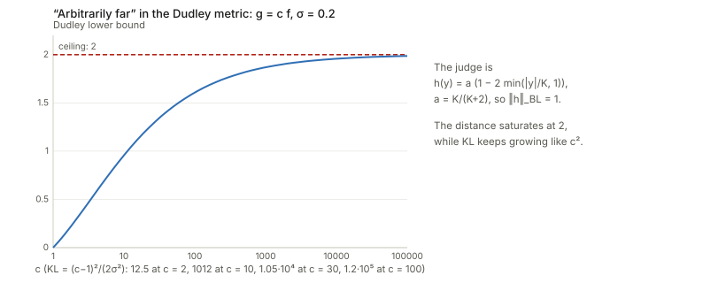
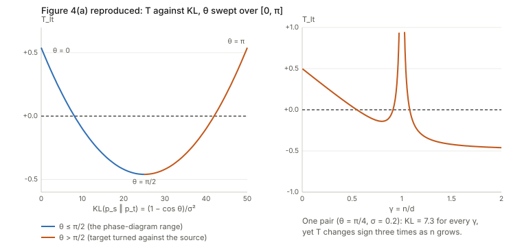
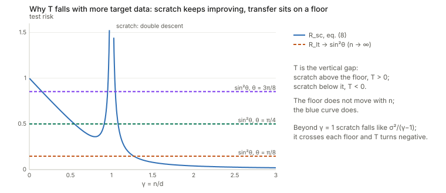
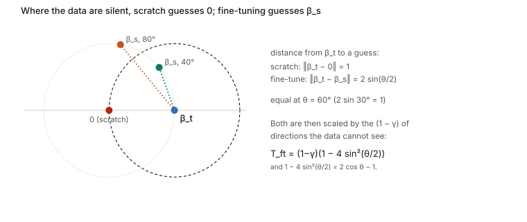
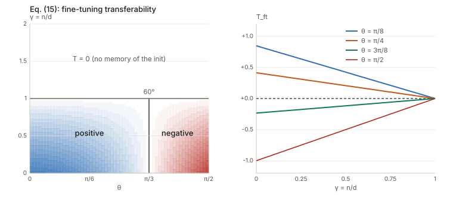

## Links

- **[arXiv:2410.08194](https://arxiv.org/abs/2410.08194)**: the preprint (v2, July 2025, is the ICML version). Authors' code:
  [javantahir/features_are_fate](https://github.com/javantahir/features_are_fate). In the part of the repository I
  could read (a summary of `plots.ipynb`) I found the phase-diagram code but not the code for Figure 3(d) or
  Figure 4, so those two are reproduced here from the text, not compared with their scripts.
- **[Interactive companion](figures/interactive.html)**: seven widgets. (1) Eq. (11) as a phase diagram you can
  click. (2) Scratch risk against the flat linear-transfer floor. (3) Eq. (15) and the null-space geometry.
  (4) The ridge result and the finite-$n$ dip. (5) KL against transferability for $\theta\in[0,\pi]$. (6) The
  Dudley metric saturating, and the failing proof line. (7) A finite-sample Wasserstein estimate that measures
  dimension, not tasks.
- **Runnable checks**, in
  [`code/`](https://github.com/msrepo/theory_inclined_papers_with_annotations/tree/main/papers/2025-tahir-features-are-fate/code):
  `theory.py` (every closed form in one place), `transfer_theory.py` (Monte Carlo, real gradient descent on
  two-layer linear networks, the algebra of Sections 3 and C), `appendix_a.py` (Appendix A and Figure 4),
  `relu_projection.py` (Figure 3d). Every number below comes from one of them. `make verify` runs all four.
- **Integral probability metrics**: the page **[Integral probability metrics: a panel of judges](../integral-probability-metrics/index.html)**
  answers "what is a Dudley metric, what is an IPM" from scratch with its own interactive widgets.
  The short version is in the first question below.
- Background pages this one leans on: **[the four fundamental subspaces](../four-fundamental-subspaces/index.html)**
  (row space, null space, the pseudo-inverse and why gradient descent from zero finds the minimum-norm solution)
  and **[optimal transport](../optimal-transport/index.html)** (the Wasserstein distance).
- Other transferability notes in this collection that this paper's picture speaks to:
  [Achille 2019, task reachability](../2019-achille-task-reachability/index.html) (a fine-tuning success also depends on the starting weights),
  [Nguyen 2020, LEEP](../2020-nguyen-leep/index.html), [You 2021, LogME](../2021-you-logme/index.html),
  [Bao 2022, H-score](../2022-bao-hscore-transferability/index.html),
  [Chaves 2023](../2023-chaves-medical-transferability/index.html) and [Claßen 2026](../2026-classen-te-robustness/index.html)
  (the scores fail on medical tasks), [Jacot 2018, NTK](../2018-jacot-neural-tangent-kernel/index.html) and
  [Fort 2020](../2020-fort-deep-vs-kernel/index.html) (the lazy regime that the paper's tiny-initialisation limit is the opposite of).

Javan Tahir, Surya Ganguli and Grant Rotskoff, *Features are fate: a theory of transfer learning in
high-dimensional regression*, ICML 2025. Stanford University, Applied Physics and Chemistry.

## In one paragraph

When does starting from a pretrained network beat training from scratch on a small target set? The
paper answers this in a model where every quantity has a formula: a deep linear network trained by gradient
flow from a tiny initialisation, Gaussian inputs, a linear target function and label noise. Pretraining on
an unlimited source set leaves the hidden layer holding **one direction**, $\beta_s$, the source's weight
vector. After that the story is a comparison of two closed-form risks. **Scratch training** is
minimum-norm least squares and follows a double-descent curve in $\gamma=n/d$. **Transfer** can only re-scale
$\beta_s$, so it has a floor $\sin^2\theta$ (the target's part orthogonal to the source direction) that no
amount of target data lowers. Their difference $\mathcal T$ is the transferability, and it is positive for few
samples and small angle, negative for many samples or a wide angle, and positive again in a thin band around
$\gamma=1$ where scratch training is at its worst. **Fine-tuning** keeps the pretrained network's guess in
the directions the data cannot see, so it beats scratch exactly when the source vector is closer to the
target than the origin is: $\theta<60^\circ$. Appendix A argues that distances between the two data
distributions (Dudley, Wasserstein-1, KL) cannot predict any of this because two tasks in the same feature space
can be arbitrarily far apart, and a short numerical section checks that the picture survives with ReLU
networks. I re-derived and simulated every formula: they are right. The places where I disagree are the
proof of Theorem A.2 (a step fails and the statement needs "any $\delta<2$" for Dudley), the exactness of
Theorem 3.9 (a scale factor $c=1+O(\sigma^2)$ is missing, small at the paper's $\sigma=0.2$ and large at
$\sigma=1$), and Figure 4(b), whose Wasserstein axis measures sampling noise.

## The spine of the argument

1. **Setting.** $y=\beta^\top x+\epsilon$, $x\sim\mathcal N(0,I_d)$, $\lVert\beta_s\rVert=\lVert\beta_t\rVert=1$,
   $\beta_s^\top\beta_t=\cos\theta$, noise $\sigma$. Scratch and transfer see the same $n=\gamma d$ target points.
   $\mathcal T=\mathbb E[R_{sc}-R_{tx}]$.
2. **Pretraining sparsifies the features** (Lemma 3.3, Theorem 3.4). A two-layer linear net started at scale
   $\alpha\to0$ has a conserved quantity that makes its layers balanced, so the hidden layer becomes rank one and
   aligned with $\beta_s$.
3. **Scratch training is minimum-norm interpolation** (Theorem 3.5), whose risk is the double-descent curve
   (Theorem 3.6, eq. 8).
4. **Linear transfer** regresses the target onto the one scalar feature $\beta_s^\top x$ (Theorem 3.7, eq. 10):
   risk $\sin^2\theta+O(1/n)$. So $\mathcal T_{lt}=R_{sc}-\sin^2\theta$ (eq. 11), a phase diagram in
   $(\theta,\gamma)$ with three regions.
5. **Ridge does not help** (Theorem 3.8, eq. 13): it only shrinks the one coefficient.
6. **Fine-tuning** moves only the part of the solution the data can see and leaves the rest at the
   pretrained guess (Theorem 3.9, eq. 15): $\mathcal T_{ft}=(1-\gamma)(2\cos\theta-1)$ for $\gamma\le1$, and $0$
   beyond.
7. **A ReLU student–teacher model** shows the same shape, with the feature space replaced by an RKHS (Section 4).
8. **Appendix A**: distribution-level distances do not track any of this.

## Setup and notation

| Symbol | Meaning |
|---|---|
| $d,\;n,\;\gamma=n/d$ | input dimension, target sample size, and their ratio; the limit $n,d\to\infty$ with $\gamma$ fixed |
| $\beta_s,\;\beta_t\in\mathbb R^d$ | unit weight vectors of the source and target linear functions; $\cos\theta=\beta_s^\top\beta_t$ |
| $\sigma$ | label-noise standard deviation; the SNR of the target is $1/\sigma^2$ |
| $X\in\mathbb R^{n\times d}$, $y$ | target design matrix (i.i.d. Gaussian rows) and labels $y=X\beta_t+\epsilon$ |
| $X^+$, $P=X^+X$ | pseudo-inverse and the orthogonal projector onto the **row space** of $X$ (a random $\min(n,d)$-dimensional subspace of $\mathbb R^d$) |
| $W_1,\dots,W_L$, $\alpha$ | weights of the deep linear network $f(x)=x^\top W_1\cdots W_L$ and the initial scale $W_l(0)=\alpha\bar W_l$; $\alpha\to0$ is the "rich" or feature-learning regime |
| $\beta(t)=W_1\cdots W_L$ | the end-to-end linear map; gradient flow moves it inside the loss landscape of the network |
| $R=\mathbb E_x(f(x)-f^*(x))^2=\lVert\hat\beta-\beta_t\rVert^2$ | generalisation error (risk) with noise-free targets |
| $R_{sc},\;R_{lt},\;R_{ft}$ | risk of scratch training, linear transfer (last layer only) and fine-tuning (everything) |
| $\mathcal T=\mathbb E_{\mathcal D}(R_{sc}-R_{tx})$ | transferability: positive means the pretrained start wins |
| $z=X\beta_s,\;w=X\nu$ | the projections of the data onto the source direction and onto the part of $\beta_t$ orthogonal to it; independent $\mathcal N(0,I_n)$ vectors |
| $D_l=W_l^\top W_l-W_{l+1}W_{l+1}^\top$ | the conserved "balancedness" of adjacent layers under gradient flow |

Two conventions in the paper are worth stating once. **Gradient flow** is the continuous-time limit of
gradient descent, with the learning rate set to $1$ for analysis. **The order of limits** is
$\lim_{\alpha\to0}\lim_{t\to\infty}$: at each fixed $\alpha$ train until the loss has converged, then shrink
the initial scale.

## Questions from a first reading

Six questions from a first pass through the paper, in the order they were asked. Each answer starts with
the idea in plain words, then gives the formula, then a number from the code. The sections after this one
go through the paper in its own order.

### What is a Dudley metric? What is an IPM (integral probability metric)?

**Plain version.** To say how far apart two distributions $P$ and $Q$ are, hire a *judge*: a function $h$
that gives every outcome a score. Average the score over draws from $P$, do the same for $Q$, and look at the
gap. One judge gives one gap. An **integral probability metric** is the gap of the *best* judge in a fixed
panel $\mathcal F$:

$$
\gamma_{\mathcal F}(P,Q)\;=\;\sup_{h\in\mathcal F}\;\bigl\lvert\,\mathbb E_{x\sim P}\,h(x)\;-\;\mathbb E_{x\sim Q}\,h(x)\,\bigr\rvert .
$$

Read $\mathbb E_{x\sim P}h(x)$ as "the average of $h$ over data drawn from $P$": for a data set it is the
sample mean of $h$ over its points, for a density $p$ it is $\int h(x)p(x)\,dx$. The whole content of a
metric is the choice of panel. Judges scoring in $[0,1]$ give **total variation**. Judges that may not slope
steeper than $1$ give the **Wasserstein-1** (earth mover's) distance (Kantorovich–Rubinstein duality; see
[optimal transport](../optimal-transport/index.html)). The unit ball of a kernel's function space gives
**MMD** (and HSIC is an MMD between a joint law and the product of its marginals).

**The Dudley metric** (also called the bounded-Lipschitz metric) uses judges with a *budget*: their height
plus their steepness may not exceed 1,

$$
\gamma_\beta(P,Q)=\sup_{\lVert h\rVert_{BL}\le1}\bigl\lvert\mathbb E_Ph-\mathbb E_Qh\bigr\rvert,\qquad
\lVert h\rVert_{BL}=\underbrace{\lVert h\rVert_L}_{\text{steepest slope}}+\underbrace{\lVert h\rVert_\infty}_{\text{largest score}} .
$$

A tall judge must be flat and a steep judge must be short. That is what makes it behave differently from
its neighbours. Two point masses at $0$ and $D$ (two clusters of embeddings a distance $D$ apart) show it
in closed form: **TV is $1$ for every $D>0$** (the supports are disjoint, TV saturates immediately),
**$W_1=D$** (grows without limit), and **Dudley is $2D/(D+2)$**: it grows like $D$ for small $D$ and
saturates at $2$ for large $D$. (Derivation: a judge with height $a$ and slope $1-a$ can separate the two
points by $\min(2a,(1-a)D)$; equalising gives $a=D/(D+2)$.) Three facts follow from the panel being small:
$\gamma_\beta\le W_1$ (its judges are inside the 1-Lipschitz ball), $\gamma_\beta\le 2\,\mathrm{TV}\le2$ (every
score is at most $1$), and it metrizes weak convergence (a standard fact that I have not re-derived). The foundations page has an interactive that draws
these judges for two densities and plots all four distances (and KL) against the separation. One caution
from that page: "Dudley behaves like $W_1$ for nearby distributions" holds only for distributions narrow
compared with the unit scale: for two unit-width Gaussians the ratio of Dudley to $W_1$ tends to $0.35$ as
the shift goes to $0$, not $1$. Its numbers for $\mathcal N(0,1)$ against $\mathcal N(1,1)$ are TV $=0.383$,
Dudley $=0.343$, $W_1=1$, KL $=0.5$.

**KL and friends are a different family.** $\varphi$-divergences such as KL compare the two probability
tables point by point, need $P$ to be absolutely continuous with respect to $Q$, and are infinite (or
saturated) when the supports do not overlap. IPMs need a notion of distance on the sample space (for smooth
judges) and stay finite. Total variation is the only member of both families. The paper cites Sriperumbudur
et al. (2009) for the framework and uses it for one purpose, in Appendix A, discussed next.

### Help me understand Appendix A. How does it show that dataset similarity is not predictive of transfer efficiency?

**The claim in plain words.** "Similar tasks transfer well" sounds obvious, so the appendix asks what
"similar" could mean if it is measured on the *data*: how far apart the joint laws $p_s(x,y)$ and $p_t(x,y)$
are, in Dudley distance, Wasserstein-1 or KL. The paper's answer is that this cannot be the right notion,
because two target functions can lie in the *same feature space* (so that a pretrained network transfers to
either by re-learning a few output weights) while their data distributions are arbitrarily far apart.

**Setting.** A feature space $\Phi\subset L_2(p)$ is a linear span of orthonormal functions
$\phi_1,\dots,\phi_M$. For $f\in\Phi$, the data law is $p_f(x,y)=p(x)\,\mathcal N(y;f(x),\sigma^2)$: draw
$x$, then a noisy label around $f(x)$. Note that this needs $\sigma>0$: with no noise $p_f$ lives on the graph
of $f$ and has no density.

**Theorem A.2.** For every $f\in\Phi$ and every $\delta>0$ there is a $g\in\Phi$ with $\gamma_\beta(p_f,p_g)\ge\delta$
and, separately, one with $D_{KL}(p_f\Vert p_g)\ge\delta$.

**How the logic is meant to go.** (i) Theorem A.2: within one feature space, distribution distances can be
made as large as you like. (ii) Section 3: for targets in the same feature space (they take $\theta=0$)
transfer is positive, because only output weights need re-learning. (iii) So large distance does not
mean poor transfer, and a distance between datasets cannot be the predictor.

**The KL half, line by line.** With $y\mid x\sim\mathcal N(f(x),\sigma^2)$ the KL between the two conditional
laws is $(f(x)-g(x))^2/(2\sigma^2)$, and averaging over $x$ gives (eqs. 32–35)

$$
D_{KL}(p_f\Vert p_g)=\frac{\lVert f-g\rVert_{L_2(p)}^2}{2\sigma^2}.
$$

The code confirms it by quadrature (for $f=x$, $g=-x$, $\sigma=0.2$: $50.0000$ both ways). This is right and
unbounded, so taking $g=-\alpha f$ with large $\alpha$ works. One slip: the paper takes
$\alpha>\sigma\sqrt\delta/\lVert f\rVert$, which only gives $D_{KL}>\delta/2$ (since $(1+\alpha)^2\ge\alpha^2$ and
$\alpha^2\lVert f\rVert^2/(2\sigma^2)>\delta/2$). For $\lVert f\rVert=0.01$, $\sigma=0.2$, $\delta=100$ that
choice gives $D_{KL}=50.5<\delta$. The fix is $\alpha>\sigma\sqrt{2\delta}/\lVert f\rVert$: harmless.

**The Dudley half, line by line.** The proof (Appendix D.1) picks one judge, $h(x,y)=\tfrac12\cos y$. Its
steepest slope is $\tfrac12$ and its largest score is $\tfrac12$, so $\lVert h\rVert_{BL}=1$: it is in the panel.
That is a legitimate way to lower-bound a supremum: exhibit one judge. Since $\mathbb E\cos y=e^{-\sigma^2/2}\cos f(x)$
when $y\sim\mathcal N(f(x),\sigma^2)$,

$$
\gamma_\beta(p_f,p_g)\;\ge\;\frac{e^{-\sigma^2/2}}{2}\,\Bigl\lvert\int\bigl[\cos f(x)-\cos g(x)\bigr]p(x)\,dx\Bigr\rvert\qquad\text{(line 28)}.
$$

The next line (29) claims this is at least $\tfrac{e^{-\sigma^2/2}}{2}\int[f(x)^2+g(x)^2]p(x)\,dx$, "by the identity
$\cos x+x^2\ge\cos z-z^2$". **This step is wrong.** (a) The left side is at most $e^{-\sigma^2/2}$ whatever $g$ is
($\lvert\cos f-\cos g\rvert\le2$), while the right side grows without bound as $g$ grows. (b) It even fails for
$g=f$: the left side is $0$ and the right side is $e^{-\sigma^2/2}\lVert f\rVert^2>0$. (c) The identity is true
but rearranges to $\cos x-\cos z\ge-(x^2+z^2)$, a lower bound by a *negative* number, which says nothing about
the absolute value. Numbers for $f=x$, $x\sim\mathcal N(0,1)$, $\sigma=0.2$ (`appendix_a.py`):

| $g$ | line (28) | line (29) right side |
|---|---|---|
| $x$ | $0.0000$ | $0.9802$ |
| $3x$ | $0.2918$ | $4.9010$ |
| $10x$ | $0.2973$ | $49.5000$ |

The last row of line (28) is also the best this judge can ever do against $g=cx$: $0.2973$.

**And the theorem as stated cannot be true for large $\delta$.** Every judge in the panel has
$\lvert h\rvert\le1$, so $\gamma_\beta\le2$ for any two distributions. "For every $\delta>0$" fails for
$\delta\ge2$. The honest reading is "as far as the metric permits". A judge that shows this: for $g=cf$
use $h(y)=a\bigl(1-2\min(\lvert y\rvert/K,1)\bigr)$ with $a=K/(K+2)$, which has height $a$ and slope $2a/K$ so
$\lVert h\rVert_{BL}=1$. It gives, for $f(x)=x$ and $\sigma=0.2$:

| $c$ | $2$ | $10$ | $100$ | $1000$ | $10^5$ |
|---|---|---|---|---|---|
| Dudley $\ge$ | $0.27$ | $0.96$ | $1.61$ | $1.87$ | $1.99$ |
| KL | $12.5$ | $1012$ | $1.2\times10^5$ | $1.2\times10^7$ | $1.25\times10^{11}$ |

<figure><figcaption><b>“Arbitrarily far” saturates.</b> A working judge gives a Dudley distance that climbs towards the ceiling 2 like $2-O(c^{-1/2})$ while KL grows like $c^2$. Widget 6 of the <a href="figures/interactive.html#dudley">interactive page</a> moves $c$ and shows the failing line (29).</figcaption></figure>

The paper's remark that the result "also holds for any IPM over a larger function class, in particular $W_1$" is
correct (a bigger panel has a bigger supremum), and for $W_1$ and KL "arbitrarily far" is literal.
The conclusion survives; the proof as printed does not.

**Does it apply to the phase diagrams?** Only after one more step. The construction uses $g=cf$ with large
$c$, so $\lVert g\rVert=c\ne1$, outside the unit-norm family of Assumption 3.2. The transfer analysis
extends trivially: for a target $c\beta_s$ scratch training has risk $c^2(1-\gamma)+\gamma\sigma^2/(1-\gamma)$
while linear transfer has risk $\sigma^2/(n-2)$, so $\mathcal T\approx c^2(1-\gamma)+\dots$ *grows* with the
distance. Monte Carlo at $d=200$, $\gamma=0.5$, $\sigma=0.2$ gives $\mathcal T=0.54,\,2.02,\,4.58,\,50.2$ for
$c=1,2,3,10$ (formula $0.54,\,2.04,\,4.54,\,50.0$). So Theorem A.2 plus Section 3 does establish "large
distance, positive transfer". That is *sufficiency-failure*: distance being large does not imply poor
transfer. It does not establish the other direction (small distance, poor transfer), and "not predictive"
needs both.

**A cleaner argument the paper does not make: same pair of tasks, many sample sizes.** $\mathcal T$ depends on
$n$, and a distance between $p_s$ and $p_t$ does not. Fix $\theta=\pi/4$ and $\sigma=0.2$. The pair has one
KL, $(1-\cos\theta)/\sigma^2=7.32$, and one Dudley or $W_1$ distance. Yet eq. (11) gives $\mathcal T_{lt}>0$ for
$\gamma<0.549$, $<0$ on $(0.549,0.911)$, $>0$ on $(0.911,1.080)$ and $<0$ beyond $1.080$. Any function of
$(p_s,p_t)$ alone is constant along that path, so it cannot determine the sign of $\mathcal T$. This is the real
reason a dataset distance fails: transferability is a property of the pair *and the amount of target
data and noise*, through the feature space.

**Figure 4 reproduced.** The paper's Figure 4 sweeps $\theta$ and plots $\mathcal T$ against KL (a) and against
a finite-sample $W_1$ (b). Two things I found:

- **(a) is a sweep of $\theta$ over $[0,\pi]$, not $[0,\pi/2]$.** Within the paper's family
  $D_{KL}(p_s\Vert p_t)=\lVert\beta_s-\beta_t\rVert^2/(2\sigma^2)=(1-\cos\theta)/\sigma^2$, which reaches $2/\sigma^2=50$ at
  $\theta=\pi$ for $\sigma=0.2$: exactly the axis of Figure 4(a). $\mathcal T_{lt}$ depends on $\theta$ only through
  $\sin^2\theta$, which is symmetric about $\pi/2$, so it goes down and comes back up. At $\gamma=0.5$,
  $\sigma=0.2$: $\mathcal T=+0.540$ at $\theta=0$, $-0.460$ at $\pi/2$, $+0.540$ at $\pi$ (Figure 4a reads about
  $+0.54,-0.46,+0.54$). The target $\beta_t=-\beta_s$ is as far as it gets in KL and transfers exactly as well as
  $\theta=0$, because linear transfer just flips the sign of one coefficient. Over $[0,\pi]$ the correlation
  between KL and $\mathcal T$ is $-0.000$. Over the paper's phase-diagram range $[0,\pi/2]$ it is $-0.972$ and the
  rank correlation is exactly $-1$: **inside the range the paper draws, KL orders $\mathcal T_{lt}$
  perfectly at fixed $(\gamma,\sigma)$.** The text never says the sweep extends past $\pi/2$.
- **(b) is sampling noise.** The $W_1$ axis of Figure 4(b) spans $526$ to $529$ and the scatter has no
  shape. Population $W_1$ between $p_s$ and $p_t$ is at most $\sqrt{2/\pi}\,\lVert\beta_s-\beta_t\rVert\le1.60$
  (couple the same $x$ and the same noise; then $\lvert y_s-y_t\rvert=\lvert(\beta_s-\beta_t)^\top x\rvert$).
  But two independent samples of $\mathcal N(0,I_{500})$ are far apart in the sample space and an exact
  optimal-transport solver sees it. With $\gamma=0.5$ ($n=250$), $d=500$, $\sigma=0.2$ and an $\ell_1$ ground metric
  I get $W_1=526.3$ at $\theta=0$ (**identical laws**), $527.5$ at $\pi/2$ and $527.6$ at $\pi$; with $\ell_2$,
  $29.7$ at all three. The $\ell_1$ value matches the paper's axis, which suggests (I could not confirm; their
  Figure 4 code is not in the released repository) that this is what was plotted. In $d=2$ the same estimator
  is informative and rises monotonically with $\theta$, like KL. So Figure 4(b) shows a property of the
  estimator in 500 dimensions, not of the population distance.

<figure><figcaption><b>Two ways a distance fails to predict $\mathcal T$.</b> Left: Figure 4(a), where the second branch (orange, $\theta>\pi/2$) is what makes the relation non-monotone. Right: one pair of tasks with a fixed KL of $7.3$ crosses zero three times as $n$ grows. Widget 5 of the <a href="figures/interactive.html#kl">interactive page</a> moves $\theta,\gamma,\sigma$.</figcaption></figure>

**Summary of what Appendix A does and does not show.** It shows that a large dataset distance is compatible with
excellent transfer (once the norm restriction is lifted, and with "large" read as "near the metric's
ceiling" for Dudley). With my additions it shows that no function of the pair $(p_s,p_t)$ can determine
the sign of $\mathcal T$. It does not show, and the paper's Figure 4 does not show, that distances are
uncorrelated with transferability *within the paper's own family and range*.

### Why assume label noise?

Four separate reasons, in order of importance.

1. **Without noise there is nothing for transfer to win.** Scratch training is exact once $n>d$: with
   $\sigma=0$ the risk (8) is $0$ for $\gamma>1$, and $\mathcal T_{lt}=-\sin^2\theta<0$ at every $\theta>0$. The noiseless
   diagram (Figure 7) is red everywhere above $\gamma=1$; below $\gamma=1$ the sign is that of
   $(1-\gamma)-\sin^2\theta$, so transfer wins exactly for $\gamma<\cos^2\theta$. Noise is what makes the *large-$n$* half of the diagram
   interesting: with noise scratch training pays a variance term $\sigma^2/(\gamma-1)$ for estimating $d$
   coefficients from noisy labels, while transfer estimates one coefficient and pays only $\sigma^2/(n-2)$. That
   variance gap is the whole reason transfer can win with plenty of data.
2. **It creates the double-descent spike.** The blow-up of $R_{sc}$ at $\gamma=1$ comes from amplifying noise through
   the smallest singular value of $X$; with $\sigma=0$ there is no spike and no anomalous-positive-transfer band.
3. **It makes Appendix A well posed.** $p_f(x,y)=p(x)\mathcal N(y;f(x),\sigma^2)$ has a density only for
   $\sigma>0$, and $D_{KL}=\lVert f-g\rVert^2/(2\sigma^2)$ is finite only then (and is inversely proportional to
   $\sigma^2$: the smaller the noise the "farther apart" the same two functions look).
4. **It is realistic**, and it sets the interesting scale: the target's signal-to-noise ratio is $1/\sigma^2$. Negative
   transfer for $\gamma<1$ needs $\sigma<1$ (SNR above 1) and, more precisely, $\theta>\arccos(1-\sigma)$
   ($36.9^\circ$ for $\sigma=0.2$; for $\sigma\ge1$ negative transfer at $\gamma<1$ disappears at every $\theta\le\pi/2$).

### Figure 1 seems to suggest that they are working on a toy linear regression model and not deep learning

Correct, and the paper says so in its own words: "deep linear networks" in the abstract and a
"limited to affine transformations" caveat in Section 3. The function class is linear, $f(x)=\beta^\top x$,
the target is linear and the data are Gaussian. What is *deep* about it is the **training dynamics**: the network
is parameterised as $W_1\cdots W_L$, and gradient flow on that product has an implicit bias (towards minimum
norm, and towards rank-one hidden layers from a small start) that gradient flow on $\beta$ directly would not
have. Depth does not change what the network can represent. Two ways to read this.

- **What the model buys.** A closed form for a phenomenon that is otherwise only seen empirically: the pretrained
  network keeps exactly one direction, so "the feature space" is a definite object. In a real network the feature
  space is what the last hidden layer spans and is never cleanly identifiable, which is why the paper retreats to
  a solvable case.
- **What it costs.** With a one-dimensional feature space the floor $\sin^2\theta$ is a sharp cliff. A network
  with $k$ features has floor $\rho=\lVert P_\perp\beta_t\rVert^2$ (the part of the target outside the feature
  span) and, by the same proof, risk $\rho+(\sigma^2+\rho)\,k/(n-k-1)$; I checked this for $k=1,5,20$ (for
  $k=5$, $n=120$, $\rho=0.2$: MC $0.2134\pm0.0004$, formula $0.2127$). That is my extension, not the paper's.

The ReLU section (Section 4) is the bridge to a nonlinear model: a two-layer student–teacher net with
$m=1000$ hidden ReLU units against a teacher with $m_*=100$, $d=100$. The paper claims a qualitatively
identical picture. It is supported less strongly: there is no formula for the scratch risk, so the negative
transfer boundary is found by equating the empirical power law $R_{sc}\approx An^{-1.18}$ with the estimated
out-of-RKHS norm. See the doubts below. It is also still a teacher–student setup with random Gaussian data,
far from ImageNet-scale deep learning.

### Figure 1 suggests that increasing target dataset size hurts the transfer score, and the same for task overlap. Seems counterintuitive

Two separate points.

**Target set size.** More data does not hurt transfer. It helps *both* models, but scratch training improves
faster and the score is their difference. Look at eq. (10) and eq. (8) side by side:

- Linear transfer has risk $\sin^2\theta+(\sigma^2+\sin^2\theta)/(n-2)$. It is close to its floor $\sin^2\theta$
  already at small $n$ and cannot go below it: the network can only express the one direction $\beta_s$, so the
  part of the target orthogonal to it is invisible however much data you add.
- Scratch training has risk $\sigma^2/(\gamma-1)$ beyond $\gamma=1$, which keeps falling towards $0$: it can express
  every direction.

So $\mathcal T=R_{sc}-\text{floor}$ starts high (scratch has almost nothing at small $n$: the risk is $1$ at
$\gamma\to0$, the risk of predicting zero), falls as scratch catches up, spikes at $\gamma=1$ where scratch is
at its worst, and settles at $-\sin^2\theta$ (plus $\sigma^2/(\gamma-1)$). At $\theta=\pi/4$, $\sigma=0.2$:
$\mathcal T_{lt}=+0.263,\,+0.040,\,-0.130,\,-0.460$ at $\gamma=0.25,\,0.5,\,0.75,\,2$. This is the familiar rule
that pretraining helps most when target data are scarce. The figure below shows it as a moving curve against a
fixed line.

<figure><figcaption><b>Why $\mathcal T$ falls with more target data.</b> The blue curve is scratch training (eq. 8, $\sigma=0.2$); each dashed line is the linear-transfer floor $\sin^2\theta$ (eq. 10 as $n\to\infty$). $\mathcal T$ is the vertical gap. Widget 2 of the <a href="figures/interactive.html#floor">interactive page</a> draws the exact finite-$d$ curves too.</figcaption></figure>

**Task overlap.** The horizontal axis of Figure 1 is the **angle** $\theta$, not the overlap. A larger $\theta$ is
*less* overlap ($\cos\theta$ is the overlap). $\mathcal T_{lt}$ falling with $\theta$ is therefore "less similar
tasks transfer less", which is the intuitive direction: scratch training does not depend on the source at all, and the
floor $\sin^2\theta$ grows with $\theta$. The one non-obvious feature in the angle direction is the band at
$\gamma\approx1$, which stays blue even at $\theta=\pi/2$ (orthogonal tasks), the paper's "anomalous positive
transfer" (the risk of scratch training there exceeds $1$, the risk of predicting zero: $R_{sc}(0.99)=3.97$).

Also note what $\mathcal T$ is not: it is an *outcome* (a difference in test risk between two trainings), not a
transferability *estimator* that one could compute from data before training, such as LEEP or LogME.

### Help me understand eqs. 11 and 15. Plot these equations

Both are differences of two risks computed exactly, so I derive each risk first.

#### Eq. (11): linear transfer

$$
\mathcal T_{lt}=\begin{cases}\dfrac{(1-\gamma)^2+\gamma\sigma^2}{1-\gamma}-\sin^2\theta & \gamma<1\\[2ex]\dfrac{\sigma^2}{\gamma-1}-\sin^2\theta & \gamma>1\end{cases}
$$

*The first term is scratch training* (eq. 8). Gradient flow from a tiny start on the scratch network finds the
minimum-norm interpolator $\hat\beta=X^+y=P\beta_t+X^+\epsilon$ (Theorem 3.5). Split its error into what the
data cannot see and what noise adds:

$$
\lVert\hat\beta-\beta_t\rVert^2=\underbrace{\lVert(I-P)\beta_t\rVert^2}_{\text{bias: the part of }\beta_t\text{ outside the row space}}+\underbrace{\lVert X^+\epsilon\rVert^2}_{\text{variance}}
$$

(the two pieces are orthogonal). The row space is a uniformly random $n$-dimensional subspace, so a fixed
unit vector keeps a fraction $n/d=\gamma$ of its squared length in it: bias $=1-\gamma$ (and $0$ for
$\gamma\ge1$, where $P=I$). The noise term is $\sigma^2\operatorname{tr}\bigl((XX^\top)^{-1}\bigr)$ and for Gaussian
$X$ the mean inverse Wishart matrix gives exactly $\sigma^2 n/(d-n-1)\to\sigma^2\gamma/(1-\gamma)$ (and
$\sigma^2/(\gamma-1)$ for $\gamma>1$). Sum:
$(1-\gamma)+\sigma^2\gamma/(1-\gamma)=\frac{(1-\gamma)^2+\gamma\sigma^2}{1-\gamma}$. The blow-up at $\gamma=1$ is
$X$ having a near-zero singular value there. The code checks the exact finite-size versions ($1-n/d+\sigma^2n/(d-n-1)$
etc.) to Monte Carlo accuracy at $d=200$: for $\gamma=0.5$: $0.544$ simulated, $0.540$ exact; the paper's
Theorem 3.6 proof reaches the same numbers through Stieltjes transforms of the Marchenko–Pastur law.

*The second term is linear transfer.* The pretrained hidden layer is $W_1=\beta_sv^\top$ (Theorem 3.4), so the
features of the target inputs are the single scalar $z_i=x_i^\top\beta_s$, and the last layer fits one number
$b$. Write $\beta_t=\cos\theta\,\beta_s+\sin\theta\,\nu$ with $\nu\perp\beta_s$. Then, with $z=X\beta_s$ and $w=X\nu$
independent $\mathcal N(0,I_n)$ vectors (rotation invariance of the Gaussian),

$$
y=\cos\theta\,z+\underbrace{\sin\theta\,w+\epsilon}_{\text{looks like noise of variance }\sin^2\theta+\sigma^2},\qquad
b=\frac{z^\top y}{\lVert z\rVert^2}=\cos\theta+\frac{z^\top(\sin\theta\,w+\epsilon)}{\lVert z\rVert^2}.
$$

Given $z$, the second term is $\mathcal N\bigl(0,(\sin^2\theta+\sigma^2)/\lVert z\rVert^2\bigr)$. The risk is
$\lVert b\beta_s-\beta_t\rVert^2=(b-\cos\theta)^2+\sin^2\theta$, and $\mathbb E[1/\lVert z\rVert^2]=1/(n-2)$ (the
mean of an inverse chi-square with $n$ degrees of freedom; the paper gets it from a Gamma integral, eqs. 117–121):

$$
\mathbb E\,R_{lt}=\sin^2\theta+\frac{\sigma^2+\sin^2\theta}{n-2}\qquad\text{(eq. 10, exact for every }n>2\text{)}.
$$

The picture to keep: **the part of the target outside the source direction does two things**. It sets
an irreducible error $\sin^2\theta$, and it acts as extra label noise of the same size. Taking $n\to\infty$
leaves $\sin^2\theta$, and subtracting from $R_{sc}$ gives eq. (11). The Monte Carlo at $d=200$ ($\gamma=0.5$,
$\theta=\pi/8$): $\mathcal T_{lt}=+0.396$ simulated, $+0.392$ from the exact formulas, $+0.394$ from eq. (11); real
gradient descent on two-layer networks at $d=20$ reproduces eq. (10) too (below).

*Reading the plot.* The picture is: **scratch risk minus a fixed floor**.

<figure><figcaption><b>Eq. (11) for $\sigma=0.2$.</b> Left: the sign of $\mathcal T_{lt}$ over the $(\theta,\gamma)$ plane, with the closed-form zero contours. Right: slices at $\theta=\pi/8,\pi/4,3\pi/8$ (compare Figure 1c). Widget 1 of the <a href="figures/interactive.html#phase">interactive page</a> lets you click a point and change $\sigma$.</figcaption></figure>

The three zero contours are exact. For $\gamma>1$, $\mathcal T_{lt}<0$ iff $\gamma>1+\sigma^2/\sin^2\theta$
(at $45^\circ$, $\sigma=0.2$: $\gamma>1.080$). For $\gamma<1$, $\mathcal T_{lt}<0$ iff
$\bigl(1-\gamma\bigr)^2+\gamma\sigma^2<\sin^2\theta\,(1-\gamma)$, which rearranges to a quadratic,

$$
\gamma^2-\bigl(1+\cos^2\theta-\sigma^2\bigr)\gamma+\cos^2\theta<0,\qquad
\gamma_\pm=\tfrac12\Bigl[\bigl(1+\cos^2\theta-\sigma^2\bigr)\pm\sqrt{\bigl(1+\cos^2\theta-\sigma^2\bigr)^2-4\cos^2\theta}\Bigr].
$$

So negative transfer occupies $\gamma\in(\gamma_-,\gamma_+)$ (the paper prints the interval as $(\gamma_+,\gamma_-)$,
a typo), which is non-empty iff $1-\cos\theta>\sigma$, i.e. $\theta>\arccos(1-\sigma)$. For $\sigma=0.2$:
$36.9^\circ$; at $45^\circ$ the interval is $(0.549,0.911)$; at $60^\circ$, $(0.264,0.946)$; at $90^\circ$,
$(0,0.960)$. As $\sigma\to0$ the roots tend to $\cos^2\theta$ and $1$. The code checks these against brute-force
root finding on eq. (11). The thin blue band at $\gamma=1$ is the region where scratch training's double-descent
spike exceeds the floor: at $\theta=\pi/2$, $\mathcal T_{lt}>0$ only for $\gamma\in(0.96,1.04)$.

#### Eq. (15): fine-tuning

$$
\mathcal T_{ft}=\begin{cases}(1-\gamma)\,(2\cos\theta-1)&\gamma\le1\\0&\gamma>1\end{cases}
$$

Fine-tuning trains *all* the weights on the target, starting from the pretrained network. The key fact is
that gradient flow only ever moves the network's end-to-end vector $\beta$ along directions in the **row space of
$X$**: the gradient of the loss with respect to $\beta$ is $X^\top(X\beta-y)/n$, a combination of the rows of $X$. In
the $(1-\gamma)$ fraction of directions the data never touch (the null space of $X$), whatever the network
started with is what it keeps. Start-from-scratch networks keep $0$ there (the tiny initialisation); the
pretrained network keeps $\beta_s$'s component there. In the row space both converge to the same thing, the
minimum-norm interpolator $\beta_{sc}$. So

- scratch leaves $(I-P)\beta_t$ as error in the null space, of squared length $(1-\gamma)$;
- fine-tuning leaves $(I-P)(\beta_t-\beta_s)$, of squared length $(1-\gamma)\lVert\beta_t-\beta_s\rVert^2=(1-\gamma)(2-2\cos\theta)$.

The difference of the two is $(1-\gamma)(1-(2-2\cos\theta))=(1-\gamma)(2\cos\theta-1)$: eq. (15). (The paper gets there
by expanding a longer expression in Appendix D.8; the null-space reading is the same computation.) The
picture is the distance from $\beta_t$ to a guess: scratch guesses the origin, at distance $1$; fine-tuning
guesses $\beta_s$, at distance $2\sin(\theta/2)$; these are equal when $\theta=60^\circ$. For $\gamma>1$ the
row space is everything, the loss has a unique minimum, gradient flow converges to it from any start, and the
network forgets where it began: $\mathcal T_{ft}=0$.

<figure><figcaption><b>The null-space guess.</b> Where the data are silent, scratch predicts $0$ and fine-tuning predicts $\beta_s$. Fine-tuning wins iff $\beta_s$ is inside the dashed circle of radius $1$ around $\beta_t$, i.e. $\theta<60^\circ$. Widget 3 of the <a href="figures/interactive.html#ft">interactive page</a> lets you drag $\beta_s$.</figcaption></figure>

<figure><figcaption><b>Eq. (15).</b> The sign is decided by $\cos\theta$ against $\tfrac12$ at every $\gamma<1$; sample size only scales how much is at stake, by $(1-\gamma)$ (compare Figure 2). Above $\gamma=1$, $\mathcal T_{ft}=0$.</figcaption></figure>

Numbers (`transfer_theory.py`): $\mathcal T_{ft}(\gamma=0)=+0.848,\,+0.414,\,-0.235$ for $\theta=\pi/8,\pi/4,3\pi/8$;
at $\gamma=0.5$: $+0.424,\,+0.207,\,-0.117$. Monte Carlo at $d=200$ reproduces them: $+0.429$ vs $+0.424$
($\gamma=0.5$, $\theta=\pi/8$), $-0.503$ vs $-0.500$ ($\theta=\pi/2$).

**A correction I found to eq. (15): the null-space part carries a scale factor $c$.** Real gradient descent
does not land exactly on $\beta_{sc}+(I-P)\beta_s$ (Theorem 3.9). For a two-layer net the pretrained state is
$W_1=\beta_sv^\top$, $W_2=v$ with $\lVert v\rVert=1$ and the layers *balanced* ($\lVert W_1\rVert=\lVert W_2\rVert$, from the
conserved quantity $D_1\approx0$). During fine-tuning the updates $\dot W_1=-rW_2^\top$, $\dot W_2=-W_1^\top r$ (with
$r=\nabla_\beta L\in\operatorname{row}(X)$) keep $W_1=u\,v^\top$ and $W_2=c\,v$ with $v$ fixed, the null-space part
of $u$ fixed at $(I-P)\beta_s$, and $\beta=c\,u$. Interpolation forces the row-space part of $\beta$ to equal
$\beta_{sc}$, and balancedness $\lVert u\rVert^2=c^2$ (conserved) fixes the scale:

$$
\beta_{ft}=\beta_{sc}+c\,(I-P)\beta_s,\qquad c^4-a\,c^2-b=0,\quad a=\lVert(I-P)\beta_s\rVert^2\to1-\gamma,\; b=\lVert\beta_{sc}\rVert^2\to\gamma+\frac{\sigma^2\gamma}{1-\gamma}.
$$

The paper's version is $c=1$, which holds iff $a+b=1$, i.e. iff $\sigma=0$ (at large $d$). Redoing the risk with $c$:
$R_{ft}-R_{sc}=(1-\gamma)(c^2-2c\cos\theta)$, so $\mathcal T_{ft}=(1-\gamma)(2c\cos\theta-c^2)$ with break-even
$\cos\theta=c/2$. At the paper's $\sigma=0.2$ the correction is invisible ($c=1.005$ at $\gamma=0.25$, break-even
$59.8^\circ$). It is not small at higher noise: at $\gamma=0.5$, $\sigma=1$, $c=1.225$, break-even $52.2^\circ$, and
eq. (15) predicts $\mathcal T_{ft}=0$ at $60^\circ$ where the truth is about $-0.13$. Evidence, all from the code:
real gradient descent on two-layer networks at $d=20$ with a small enough step (gradient descent with step $0.1$
drifts off the conserved quantity, so that run is not a valid gradient flow and misled me for a while) agrees
with the $c$-solution to $0.0005$ at $\sigma=1$ while differing from the paper's limit by $+0.18$; at $\sigma=0.2$
the gap to the paper is $0.002$ to $0.015$. The same logic applies to Theorem C.1. I read this as an
approximation in the printed theorem, exact only as $\sigma\to0$, that does not affect the paper's figures.

### Also: finite source data (Appendix C)

If the source set is finite too ($n_s=\gamma_sd$ noisy points, noise $\sigma_s$), $\hat\beta_s=X_s^+y_s$ replaces
$\beta_s$ in the null space. The same null-space argument gives (eq. 22) for $\gamma_s<1$:
$\mathcal T_{ft}=(\gamma_t-1)\gamma_s\bigl[1-2\cos\theta+\sigma_s^2/(1-\gamma_s)\bigr]$, with break-even
$\cos\theta_*=\tfrac12(1+\sigma_s^2/(1-\gamma_s))$ (eq. 23). A noisy source raises the bar: at $\gamma_s=0.5$,
$\sigma_s=0.3$ fine-tuning needs $\cos\theta>0.59$ ($\theta<53.8^\circ$). Monte Carlo at $d=300$ agrees with (22) to
two decimals in four settings (e.g. $-0.049$ vs $-0.045$ for $\gamma_s=\gamma_t=0.5$, $\theta=\pi/3$).

## §3.1 Pretrained models represent source features: the conserved quantity

Lemma 3.3 says that gradient flow on the population source loss drives the end-to-end vector to $\beta_s$.
Theorem 3.4 says more: $W_1W_2\cdots W_{L-1}\to\beta_sv_{L-1}^\top$ for some vector $v_{L-1}$. In words: **the
hidden layer represents the source function in a single direction**. Why? For $L=2$ (the case in the code) a
two-line argument gives it.

*The conserved quantity.* With $r=W_1W_2-\beta_s$, gradient flow is $\dot W_1=-rW_2^\top$ and $\dot W_2=-W_1^\top r$. Then

$$
\tfrac{d}{dt}\bigl(W_1^\top W_1\bigr)=-\bigl(W_2r^\top W_1+W_1^\top rW_2^\top\bigr)=\tfrac{d}{dt}\bigl(W_2W_2^\top\bigr),
$$

so $D_1=W_1^\top W_1-W_2W_2^\top$ never changes (the paper's eq. 36 for general $L$). With initial scale $\alpha\to0$,
$D_1(0)=O(\alpha^2)\to0$. At the end of training $W_1^\top W_1=W_2W_2^\top$: the right-hand side has rank one, so
$W_1$ does too. That is the sparsification: $W_1=\sigma u v^\top$ with $v\parallel W_2$. Since $W_1W_2=\beta_s$,
$u\parallel\beta_s$ and $\sigma\lVert W_2\rVert=\lVert\beta_s\rVert=1$; balancedness gives $\sigma=\lVert W_2\rVert=1$. The paper's
proof (Appendix D.3) handles general $L$ with bounds that carry $O(\alpha^2)$ error terms; the order of limits
matters (train to convergence first, then let $\alpha\to0$).

Numerically (`transfer_theory.py`, $d=20$, $\alpha=0.005$): after pretraining the singular values of $W_1$ are
$1.0000$ and then $0.0095=1.9\alpha$, and $\lvert\cos(u_1,\beta_s)\rvert=1.0000000000$. Discrete gradient descent breaks
the conserved quantity by $O(\text{step})$: $\lVert D(16)-D(0)\rVert_F=1.1\times10^{-5},\,1.7\times10^{-6},\,2.2\times10^{-7}$
for steps $0.1,\,0.01,\,0.001$.

This is the sense in which the paper contrasts with the NTK (lazy) regime: there the features are fixed at
initialisation ($\alpha$ large) and nothing is learned. Here $\alpha\to0$ makes the pretrained hidden layer *a
learned object that has thrown away everything not in the source*, which is the source of both the benefit
(one direction to estimate) and the cost (nothing else is representable).

## §3.2–3.3 Scratch and linear transfer, the parts the derivation above skipped

**Theorem 3.5** (from Yun et al. 2021): gradient flow on the empirical loss reaches the minimum-norm
interpolator when $\alpha\to0$. Intuition (the [four subspaces](../four-fundamental-subspaces/index.html) page
builds it): gradient updates always lie in the row space of $X$, so nothing is ever added in the null space;
the starting point contributes $\alpha\bar W_1\bar W_2\to0$ there. The proof shows convergence to *a* global minimum
by a Lyapunov argument using the conserved quantity, then identifies which one. **Theorem 3.6** is then a random-matrix calculation
(done above in two lines with the exact finite-size Gaussian moments instead of Stieltjes transforms).

**Linear transfer with more than one feature.** Nothing in the proof uses "one". For features $Z=XU$ with
$U\in\mathbb R^{d\times k}$ orthonormal, write $\rho=\lVert P_\perp\beta_t\rVert^2$ for the part of the target outside the span. The
same inverse-Wishart mean gives $R_{lt}=\rho+(\sigma^2+\rho)\,k/(n-k-1)$. At $k=5$, $n=40$, $\rho=0.5$: MC $0.5876\pm0.0025$,
formula $0.5868$ (`transfer_theory.py` 3i). So "features are fate" generalises as: fate is $\rho$.

**Theorem 3.8 (ridge).** With a penalty $\lambda\lVert W_L\rVert^2$ on the last layer the fitted scalar is
$b_\lambda=z^\top y/(\lVert z\rVert^2+n\lambda)$. By the law of large numbers, $\lVert z\rVert^2/n\to1$ and $z^\top y/n\to\cos\theta$, so
$b_\lambda\to\cos\theta/(1+\lambda)$ and

$$
R=(b_\lambda-\cos\theta)^2+\sin^2\theta=1-\frac{1+2\lambda}{(1+\lambda)^2}\cos^2\theta\qquad\text{(eq. 13)}.
$$

$(1+2\lambda)/(1+\lambda)^2$ has derivative $-2\lambda/(1+\lambda)^3<0$, so the risk rises with $\lambda$ for every $\theta<\pi/2$.
The paper's derivation goes through spherical coordinates and a saddle-point evaluation (Appendix D.7, eqs. 130–141);
the limit does not need it. Monte Carlo at $n=20000$, $\theta=\pi/4$: $0.5000,\,0.5040,\,0.5268,\,0.5557$ for
$\lambda=0,0.1,0.3,0.5$ against $0.5000,\,0.5041,\,0.5266,\,0.5556$ from (13). Two caveats. This is about ridge *on one
coefficient* at $n\to\infty$, where there is no variance left to trade for bias: at finite $n$ the term
$(\sigma^2+\sin^2\theta)/(n-2)$ can make small $\lambda$ help (widget 4: at $n=10$, $\sigma=1.5$ the simulated risk
falls from $0.83$ at $\lambda=0$ to $0.70$ at $\lambda\approx0.5$). And the baseline is unregularised scratch training:
with optimally tuned weight decay scratch training loses its double-descent spike (Figure 5), so the
anomalous-positive-transfer band disappears and $\mathcal T$ moves down. The statement "ridge cannot fix negative
transfer" is a statement about this linear probe, not about regularising a pretrained model in general.

## §4 ReLU student–teacher networks

The setup: $f(x)=\frac1m\sum_{i\le m}c_i\,\mathrm{relu}(w_i^\top x)$ with $m=1000$ against a teacher with $m_*=100$
neurons, $d=100$ and unit weight vectors. The source teacher is the target teacher with a fraction $\mu$ of
its neurons removed, so $\mu$ plays the role of the angle. The paper's claim is that pretraining in the
mean-field ("rich") regime makes the *kernel* of the trained network equal the kernel of the source teacher
(Figure 3a–b), so transfer is kernel interpolation in that RKHS with error $C(n)+\lVert P^\perp f_t\rVert^2$
(eq. 18), the ReLU analogue of $\sin^2\theta+O(1/n)$. The norm of $P^\perp f_t$ is computed from Gram matrices of the
arc-cosine kernel $(\sqrt{1-u^2}+u(\pi-\arccos u))/(2\pi)$ (Appendix E, eqs. 166–173). The scratch risk has no formula,
so the paper fits $R_{sc}\approx An^{-1.18}$ and calls the crossover where this equals $\lVert P^\perp f_t\rVert^2$ the
phase boundary (grey circles in Figure 3e).

I computed the same projection (`relu_projection.py`) under two readings of "the feature space of the pretrained
network". Onto the span of the $(1-\mu)m_*$ source neurons only: the out-of-RKHS fraction of $\lVert f_t\rVert^2$ is
$0.049,\,0.137,\,0.307,\,0.480,\,0.690$ for $\mu=0.1,\,0.3,\,0.5,\,0.7,\,0.9$. Onto that span plus the
untouched random neurons of the $m=1000$ student: $0.020,\,0.050,\,0.107,\,0.130,\,0.174$. Figure 3(d) rises
convexly with $\mu$ too but its axis stops at about $0.045$. **Neither reading gives that scale** (I can't tell
whether the panel is normalised differently or uses the trained student's actual weights). The shape and the
direction agree; I could not check the scale.

## What a transferability score would have to estimate

This section is my reading, not the paper's. Combine the two-line summary above,

$$
\mathcal T\;=\;\underbrace{R_{sc}(n,d,\sigma)}_{\text{a property of the target set}}\;-\;\underbrace{\Bigl[\rho_m+(\sigma^2+\rho_m)\tfrac{k_m}{n-k_m-1}\Bigr]}_{\text{a property of model }m\text{ on this set}},
$$

where $\rho_m$ is the residual of the best linear fit of the target function on model $m$'s features and $k_m$ is the
number of features. Two consequences.

1. **Ranking source models on one fixed target set.** $R_{sc}$ is the same for every candidate model, so ranking
   by $\mathcal T$ is ranking by the bracket: the linear-probe residual $\rho_m$ plus a variance term that
   grows with the feature dimension. Scores in this collection that measure how well *frozen features linearly explain
   the target labels* ([LogME](../2021-you-logme/index.html) and [H-score](../2022-bao-hscore-transferability/index.html);
   [LEEP](../2020-nguyen-leep/index.html) instead reads the source classifier's own outputs) are trying to estimate
   $\rho_m$-like quantities, and here that is theoretically the right thing to estimate for linear transfer. This says nothing about whether fine-tuning
   agrees: eq. (15) says fine-tuning depends on the *null-space* geometry ($\cos\theta$ against $\tfrac12$), which a
   score computed from frozen features does not see. That gap is one account of why frozen-feature scores predict
   fine-tuning poorly ([Achille 2019](../2019-achille-task-reachability/index.html#transferability-scores-use-only-features-open-weight-models-come-without-data) makes the same point from a different angle).
2. **Deciding whether to transfer at all** needs $R_{sc}$, which depends on $n/d$ and the noise level and not on the model.
   No dataset distance, and no score of one model alone, can tell you which side of the $\gamma\approx1$ spike and of
   the floor you are on.

## Questions and doubts

1. **Theorem A.2's Dudley proof is wrong at line (29), and the statement is false for $\delta\ge2$.** (Details above.)
   The conclusion (a Dudley distance as near the ceiling $2$ as you like, with $g$ in the same feature space) is
   right with a different judge. Worth telling the authors.
2. **The KL half has a factor of $2$ slip** in the choice of $\alpha$ (harmless unless $\lVert f\rVert\ll\sigma\sqrt\delta$).
3. **Appendix A's transfer conclusion silently leaves the unit-norm family.** With $\lVert\beta\rVert=1$ fixed, KL is at most
   $2/\sigma^2$ and Dudley is at most $2$; "arbitrarily far" needs $g=cf$ with $c\to\infty$, which Assumption 3.2 excludes.
   It goes through (transfer gets *easier* with $c$: $\mathcal T\approx c^2(1-\gamma)$), but the text should say so.
4. **Figure 4(a) is a sweep of $\theta$ over $[0,\pi]$**, not $[0,\pi/2]$, and only the orange half
   ($\theta>\pi/2$) makes the relation non-monotone; on the range the paper's phase diagrams cover, KL orders
   $\mathcal T_{lt}$ perfectly. **Figure 4(b)'s $W_1$ is finite-sample noise** (526 to 529, and $\approx527$ at
   $\theta=0$ in my reproduction). The stronger and simpler argument (one pair, many $n$) is not made.
5. **Theorem 3.9 / eq. (15) / Theorem C.1 are approximate.** The end point of fine-tuning has a scale $c$ on the
   null-space part fixed by the conserved balancedness; $c=1+O(\sigma^2)$. Invisible at $\sigma=0.2$, material at
   $\sigma=1$ (the break-even angle moves from $60^\circ$ to $52^\circ$). The neat statement "$\cos\theta>\tfrac12$,
   independent of everything" holds only in the low-noise limit.
6. **$\mathcal T_{ft}=0$ for $\gamma>1$ is a statement about running to convergence.** With more samples than
   parameters the minimum is unique and gradient flow forgets its start, so the pretrained weights are irrelevant.
   Practical fine-tuning stops early, uses a finite learning rate and a nonlinear network, none of which are in the model.
7. **Ridge (Theorem 3.8) is a law of large numbers**, not a statement that regularisation cannot help transfer.
   The baseline matters: with a tuned scratch baseline (Figure 5) the anomalous positive band goes away and negative
   transfer widens. A phase diagram is a property of the pair (transfer method, baseline).
8. **The one-dimensional feature space is the sharpest simplification.** "Features are fate" is exactly true with a
   rank-one hidden layer; in a real network the floor is $\rho_m$ and the variance term scales with the number of
   features, and neither is computed by the paper. Real pretraining does not send a hidden layer to rank one.
9. **Section 4 is much weaker than Section 3.** No formula for the scratch risk; the boundary is obtained from an
   empirical power law $\nu=1.18$; Figure 3(d)'s scale did not reproduce; the mean-field claim that the trained kernel
   equals the source kernel is shown only in a pair of Gram-matrix pictures.
10. **Typos.** $(\gamma_+,\gamma_-)$ should be $(\gamma_-,\gamma_+)$; Figure 1(c)'s caption says "$\mathcal N(0,\sigma=0.2)$".
11. **What I could not check.** Their Figure 4 and Figure 3(d) code (not in the released repository, as far as I could see), so
    both reproductions above are "consistent with", not "the same as". Separately, Lemma 3.3 bounds the decay rate of the loss
    by $2(\alpha^2\lambda)^{L-1}$ (eq. 49), which is exponentially slow as $\alpha\to0$ and depends on the constant $\lambda$ in the
    initialisation condition (19). The bound is far from tight (pretraining converged in 291 steps at $\alpha=0.005$ in my runs), so the
    theorems are about limits that the simulations support, not about how long training takes.

## Takeaways

- **Transfer is a comparison, not a property of a model.** $\mathcal T=R_{sc}-R_{tx}$: the scratch curve moves with
  $n/d$ and $\sigma$ (double descent), the transfer risk is nearly flat at the floor $\sin^2\theta$. The same
  pretrained network is worth having at $\gamma=0.25$, not at $\gamma=0.75$, and again inside a thin band around
  $\gamma=1$, for one fixed pair of tasks.
- **The floor is the geometry.** $\sin^2\theta=\lVert P_\perp\beta_t\rVert^2$, the part of the target outside the pretrained
  features. With $k$ features it is $\rho_m$ and the variance term is $(\sigma^2+\rho_m)k/(n-k-1)$.
- **Fine-tuning is a bet in the directions the data cannot see.** It wins iff $\beta_s$ is closer to $\beta_t$ than $0$ is
  ($60^\circ$ at low noise, tighter with noise), and the stake is $(1-\gamma)$.
- **No distance between the two data distributions can decide the sign of $\mathcal T$**, because the sign depends on $n$.
  Appendix A's proof of a related claim needs repair, and Figure 4 shows less than it seems to.
- **Every formula reproduces.** Monte Carlo at $d=200$, real gradient descent at $d=20$ with $\alpha\in[0.001,0.02]$ and a small
  step, and closed-form root finding all agree, with the one exception of the scale factor $c$ in fine-tuning, which the
  conserved quantity gives and the printed theorem omits.
