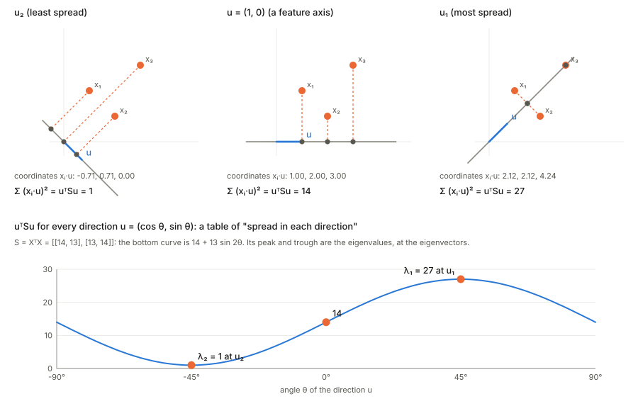
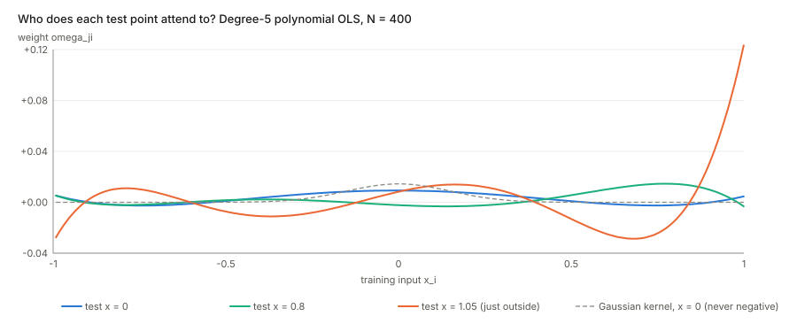
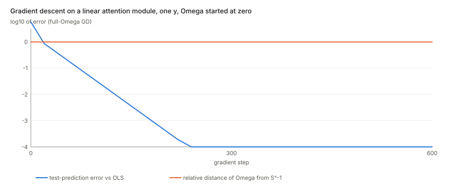

## Links

- **[arXiv:2504.09663](https://arxiv.org/abs/2504.09663)** — preprint (this annotation follows v3, the NeurIPS 2026 version).
- **[Interactive companion](figures/interactive.html)** — drag a test point around and watch the
  "attention pattern" of a polynomial regression; then switch between OLS, ridge and PCR.
- **[Runnable code](https://github.com/msrepo/theory_inclined_papers_with_annotations/blob/main/papers/2026-goulet-coulombe-ols-attention/code/ols_attention.py)** — every identity
  below in numpy, and the script that redraws the two figures. `make verify` runs it.

## In one paragraph

A least-squares prediction is usually read as "estimate coefficients $\hat\beta$, then compute
$x_{\text{test}}^\top\hat\beta$". Regroup the same product and it reads differently: the prediction is a
**weighted sum of the training outcomes**, $\hat y_j=\sum_i \omega_{ji}\,y_i$, where the weight
$\omega_{ji}=x_j^\top (X^\top X)^{-1}x_i$ says how similar test point $j$ is to training point $i$.
That is the shape of attention, *queries compare with keys, and the result weights the values*, with
the softmax replaced by the identity and the query–key matrix replaced by the closed form
$(X^\top X)^{-1}$. The paper builds three things on this one identity: (i) a dictionary between regression
vocabulary (ridge, PCR, covariance shrinkage) and attention vocabulary (embeddings, heads, depth);
(ii) an "Attention Regression" estimator that keeps the softmax and learns the metric; (iii) a "Regression
Block" that swaps a transformer's attention sublayer for an explicit polynomial regression, and does about
as well on eight tabular benchmarks with fewer parameters. The identity is exact and elementary. What it
does and does not buy is the subject of the doubts section.

## The spine of the argument

1. **Regroup.** Split $(X^\top X)^{-1}$ into two matching halves, one for each side of the product. Each half
   *whitens* its data matrix (rotates and rescales the columns until they are uncorrelated with equal length).
2. **Read as similarities.** After whitening, a test row and a training row meet through an ordinary dot
   product. The prediction is $\sum_i(\text{dot product})\times y_i$.
3. **Match to attention.** Test rows are queries, training rows are keys, training outcomes are values, and
   $W_QW_K^\top=(X^\top X)^{-1}$.
4. **Say which embedding is "the" one** (Eq. 17), with the caveat that one outcome vector does not pin it down
   but all of them do.
5. **Add back what real attention has**, one piece at a time: fewer dimensions (PCR), shrinkage (ridge),
   softmax, several heads, depth.
6. **Test both directions.** Softmax-regression against forests and MLPs; regression-in-place-of-attention
   against the FT-Transformer.

## Setup and notation

| Symbol | Meaning |
|---|---|
| $X\in\mathbb R^{N\times P}$ | training design matrix; row $i$ is training point $x_i$ (called $X_{\text{train}}$ in the paper) |
| $y\in\mathbb R^N$ | training outcomes |
| $X_{\text{test}}\in\mathbb R^{J\times P}$ | test design matrix; row $j$ is $x_j$ |
| $S=X^\top X$ | the $P\times P$ Gram matrix of the training columns, $S=U\Lambda U^\top$ |
| $\Lambda=\mathrm{diag}(\lambda_1,\dots,\lambda_P)$, $U$ | eigenvalues and orthonormal eigenvectors of $S$ |
| $W=U\Lambda^{-1/2}$ | the whitening matrix (the paper's Eq. 10) |
| $F_{\text{train}}=XW,\;F_{\text{test}}=X_{\text{test}}W$ | "factor scores": the data after whitening |
| $\omega_{ji}=\langle F_j,F_i\rangle$ | the weight test point $j$ puts on training outcome $i$ |
| $\Omega$ | the $P\times P$ matrix in the middle of the similarity, $x_j^\top\Omega x_i$; OLS uses $\Omega=S^{-1}$ |
| $H=X S^{-1}X^\top$ | the hat matrix: the weights when the test points *are* the training points |

Everything here assumes $X$ has full column rank ($N\ge P$). Where the paper wants $P>N$ it adds a ridge.

## 1. The identity, line by line

**Plain-language first.** A prediction is a number computed from the training data and one new row. Because
OLS is *linear* in $y$, the prediction must be a fixed combination of the entries of $y$: $\hat y_j=\sum_i c_{ji}y_i$
for some numbers $c_{ji}$ that depend on $X$ and $x_j$ but not on $y$. This is true of every linear smoother.
The content of the paper is to identify the numbers $c_{ji}$ as *inner products*, and to say in which space.

**The algebra.** Start from the textbook prediction

$$\hat y_{\text{test}}=X_{\text{test}}\,\hat\beta=X_{\text{test}}\,(X^\top X)^{-1}X^\top y \tag{Eq. 2}$$

Substitute $S^{-1}=U\Lambda^{-1}U^\top$ and split $\Lambda^{-1}=\Lambda^{-1/2}\Lambda^{-1/2}$ (legitimate because
every $\lambda_k>0$):

$$\hat y_{\text{test}}=\underbrace{X_{\text{test}}\,U\Lambda^{-1/2}}_{F_{\text{test}}}\;\underbrace{\Lambda^{-1/2}U^\top X^\top}_{F_{\text{train}}^\top}\;y .\tag{Eqs. 3–6}$$

The right-hand block is the transpose of $F_{\text{train}}=XU\Lambda^{-1/2}$ because $\Lambda^{-1/2}$ is diagonal
(so symmetric) and $(XU\Lambda^{-1/2})^\top=\Lambda^{-1/2}U^\top X^\top$. Row by row:

$$\hat y_j=\sum_{i=1}^N\langle F_j,F_i\rangle\,y_i,\qquad \omega_{ji}=\langle F_j,F_i\rangle=x_j^\top S^{-1}x_i .\tag{Eq. 7}$$

**What "orthonormal" is claiming.** Compute $F_{\text{train}}^\top F_{\text{train}}=\Lambda^{-1/2}U^\top(X^\top X)U\Lambda^{-1/2}
=\Lambda^{-1/2}\Lambda\Lambda^{-1/2}=I_P$. So the *columns* of $F_{\text{train}}$ are orthonormal: after the
change of coordinates the $P$ predictors are uncorrelated and each has unit length over the training set.
The same $W$ applied to test rows gives no such guarantee, $F_{\text{test}}^\top F_{\text{test}}\ne I$, because
$W$ was built from the training data only. The paper says exactly this, and it is where extrapolation shows up.

**Why whiten before taking dot products (Eq. 8).** Suppose two predictors are copies of each other. A raw dot
product $\langle x_j,x_i\rangle$ adds their contributions twice, so the same information is voted for twice.
Whitening removes the redundancy. If $a$ is the common column, the whitened similarity along that
direction is the same whether the column appears once or twice, because $S^{-1}$ shrinks the duplicated
direction exactly as much as the raw inner product inflated it. The paper's analogy is the variance of a sum
of correlated variables: only for uncorrelated pieces does the total equal the sum of the parts.

Read the picture left to right. $S=X^\top X$ describes the *shape* of the training cloud: its eigenvectors $u_1,u_2$
are the directions it is stretched along, and $\lambda_1,\lambda_2$ say how much (a direction with large
$\lambda$ is one along which the training points spread out widely). $S^{-1}=U\Lambda^{-1}U^\top$ is then read in
two steps, from the right: $U^\top$ rewrites every point in the cloud's own axes (a rotation, so no dot product
changes), and $\Lambda^{-1/2}$ divides each axis by its spread. The result is a round cloud, in which
an ordinary dot product no longer favours the long axis. Equivalently, $x_j^\top S^{-1}x_i$ is the dot
product the two points have *after* this reshaping. A difference of the same size counts for more along the short axis
than along the long one, because the training data say that direction rarely varies.

**Why the eigenvectors of $S=X^\top X$ are the "spread" directions.** Pick any unit direction $u$. Dropping each training point
perpendicularly onto the line through $u$ gives one signed coordinate per point, $x_i\cdot u$. Square those
coordinates and add them:

$$\sum_i (x_i\cdot u)^2=\sum_i u^\top x_ix_i^\top u=u^\top\Big(\sum_i x_ix_i^\top\Big)u=u^\top X^\top X\,u=u^\top S u .$$

So $u^\top Su$ is the total squared spread of the data along $u$, and the matrix $S$ is a table that returns that
spread for every direction. The directions where the table is largest and smallest are the eigenvectors,
and the values there are the eigenvalues. (In the figure the points are not centred, which is the paper's situation with an intercept.
Textbook PCA subtracts the column means first.)

**The embedding is only defined up to rotation.** Any orthogonal $Q$ gives $F_{\text{test}}Q\,(F_{\text{train}}Q)^\top
=F_{\text{test}}F_{\text{train}}^\top$. The eigen-split $U\Lambda^{-1/2}$ is one choice among all square roots $M$ of $S^{-1}$
($MM^\top=S^{-1}$), a point the paper notes. Only the product $S^{-1}$ is determined, which is why the
"embedding" is best thought of as the matrix $\Omega=S^{-1}$ itself.

### What the weights look like

Three facts, each one line of algebra:

- **The weights sum to one when there is an intercept.** If the first column of $X$ is all ones then
  $X e_1=\mathbf 1$, hence $X^\top\mathbf 1=X^\top Xe_1=Se_1$, hence $\sum_i\omega_{ji}=x_j^\top S^{-1}X^\top\mathbf 1=x_j^\top e_1=1$
  (the intercept coordinate of a test row is 1). This is the paper's remark that row-normalisation is not what
  separates OLS from softmax attention.
- **They can be negative.** The weights sum to one but are not confined to $[0,1]$, so a prediction is an
  *affine*, not a convex, combination of the training outcomes. A training point "opposite" the test point
  votes with the opposite sign. The paper notes that no nearest-neighbour rule can do this.
- **Their squared length is the leverage.** $\sum_i\omega_{ji}^2=\|F_{\text{test},j}^\top F_{\text{train}}\|^2
  =x_j^\top S^{-1}(X^\top X)S^{-1}x_j=x_j^\top S^{-1}x_j$. When the outputs carry independent noise of variance
  $\sigma^2$, the prediction has variance $\sigma^2\sum_i\omega_{ji}^2$. So the weights are large exactly when
  the prediction is unreliable. The figure's test point just outside the data has much larger weights than
  those inside.

On the training points themselves, $F_{\text{train}}F_{\text{train}}^\top=XS^{-1}X^\top=H$, the hat matrix:
symmetric, idempotent, trace $P$. The paper credits this reading to textbook treatments of fitted values
(Hastie et al.).

## 2. Dictionary to attention

Scaled dot-product attention is $\mathrm{softmax}(QK^\top/\sqrt P)\,V$ with $Q=X_{\text{test}}W_Q$, $K=X W_K$ and
$V=y\,w_v$. Replace the softmax $g$ by the identity and the products give, for any $W_QW_K^\top=S^{-1}$ and $w_v=1$:

$$g\big(X_{\text{test}}W_QW_K^\top X^\top y\,w_v\big)=X_{\text{test}}\hat\beta .\tag{Eqs. 13–16}$$

| Attention | OLS |
|---|---|
| queries $Q$ | test rows $X_{\text{test}}$ (mapped by the whitening) |
| keys $K$ | training rows $X$ (mapped by the same whitening) |
| values $V$ | the training *outcomes* $y$ |
| attention weights | $\omega_{ji}$ |
| $W_QW_K^\top$ | $(X^\top X)^{-1}$, the *precision matrix* of the predictors |

The queries and keys come from different data (test vs train), so this is **cross**-attention in form.
Appendix A.3 develops self-attention, in which one sequence plays all three roles, through AR and VAR
regressions. The match there is approximate, using $y_{-1}^\top y_{-1}\approx y^\top y$, so I treat it as an analogy.

### Which embedding? Eq. 17 and Appendix A.1

The paper says $S^{-1}$ is "the optimal embedding", the minimiser of
$\min_\Omega\|y-X\Omega X^\top y\|^2$. Read the objective carefully. Put $z=X^\top y$ ($P$ numbers). The
objective depends on $\Omega$ only through the **vector** $\Omega z$, so it needs
$\Omega z=S^{-1}z$ and nothing more. Any $\Omega=S^{-1}+\Delta$ with $\Delta z=0$ attains the same minimum.
That is a $P(P-1)$-dimensional family. The paper states this (Appendix A.1) and then restores
uniqueness by demanding that the same $\Omega$ be optimal for **every** outcome vector: then $z$ sweeps all of
$\mathbb R^P$, $\Omega z=S^{-1}z$ for all $z$ forces $\Omega=S^{-1}$.

Reading it as geometry: with one $y$ you only learn how $\Omega$ acts on the single direction $z$; to learn
a $P\times P$ matrix you need $P$ independent directions. The code script counts this: the free dimension drops from $P(P-1)$ to $0$ as the number of target vectors
rises from one to $P$.

### "Gradient descent converges to OLS" — predictions, not embedding

The introduction says a linear attention module trained by gradient descent to predict $y$ "would converge to
exactly those of OLS". For the predictions this is correct. For the embedding it is not, and the distinction
matters for how literally to read "OLS is attention".

Start $\Omega$ at zero and take the gradient of $\|y-X\Omega z\|^2$: it is $-2X^\top r\,z^\top$ with $r$ the
residual, a column times the row $z^\top$. Every step adds a matrix of that form, so $\Omega$ stays
a rank-one matrix $a z^\top$ throughout. It converges to the point with $\Omega z=S^{-1}z$ nearest the start,
$\Omega_\infty=S^{-1}zz^\top/(z^\top z)$. That is rank one, not $S^{-1}$, yet it makes the same test
predictions, $X_{\text{test}}\Omega_\infty z=X_{\text{test}}S^{-1}z$. Parametrising $\Omega=AB^\top$ as a real
attention layer does, with random $A,B$, also reaches the OLS predictions but lands on some full-rank $\Omega$ far from
$S^{-1}$: the extra free directions keep whatever the initialisation put there.

So the right reading is: a trained linear attention layer *implements the OLS predictor*; it does not
*recover the covariance structure of the predictors*.

## 3. Beyond OLS

### 3.1 Dimension reduction, shrinkage — one module, three diagonals

Write every embedding as $\Omega=UDU^\top$ with the *same* eigenvectors $U$ of $S$ and only the diagonal
$D$ changing (Eq. 23):

| Estimator | $D$ |
|---|---|
| OLS | $\mathrm{diag}(1/\lambda_1,\dots,1/\lambda_P)$ |
| ridge | $\mathrm{diag}(1/(\lambda_1+\lambda),\dots,1/(\lambda_P+\lambda))$ |
| PCR (top $L$ components) | $\mathrm{diag}(1/\lambda_1,\dots,1/\lambda_L,0,\dots,0)$ |

Ridge: $(S+\lambda I)^{-1}=U(\Lambda+\lambda I)^{-1}U^\top$ is immediate. PCR: regressing $y$ on the top $L$
factor scores $F^L=XU_L\Lambda_L^{-1/2}$, whose Gram matrix is $I_L$, gives $\hat\theta=F^{L\top}y$ and
the prediction $F^L_{\text{test}}F^{L\top}y$ — the same form as Eq. 6. The interactive page's second panel
changes $\lambda$ and $L$ and shows the weights flatten as the wiggly directions (small $\lambda_k$, hence
large $1/\lambda_k$) are damped or deleted. The paper's reading is that shrinkage acts on the *embedding*,
the metric, rather than on the coefficients.

**Eq. 22, and why the rank constraint has to be put on the data side.** Asking for "the best rank-$L$
embedding" has two readings. If you truncate $S^{-1}$ itself (Eckart–Young), you keep its *largest*
eigenvalues, and those are $1/\lambda_k$ for the *smallest* $\lambda_k$: the directions with the least
variance in $X$, the opposite of PCR. The paper avoids this by constraining $\Omega=U_LDU_L^\top$ to the top
$L$ eigenvectors of $S$ and then showing $D=\Lambda_L^{-1}$ is the unique optimiser (A.1). That is a
clean derivation, but note it is a *constraint chosen so that the answer is PCR*. It shows PCR is optimal within
that class, not that PCR is the natural low-rank attention.

**Covariance-estimation routes.** Because $W_QW_K^\top$ plays the role of a precision matrix, standard
tools for estimating one carry over verbally: linear shrinkage (Ledoit–Wolf) $\leftrightarrow$ ridge-regularised
attention, thresholding $\leftrightarrow$ sparsified attention, factor models $\leftrightarrow$ PCR with a diagonal
remainder. These are suggestions, not tested in the paper.

### 3.2 Softmax and the "Attention Regression"

With a softmax $g$ the problem $\min_\Omega\|y-g(X\Omega X^\top y)\|^2$ (Eq. 24) has no closed form. A
softmax gives strictly positive weights summing to one, so predictions become *convex* combinations of
training outcomes: no negative attention. The paper's sharp remark is that normalisation is not the new
ingredient (OLS rows already sum to one with an intercept); the genuine nonlinear ingredient is the
exponential, which squashes negatives and amplifies large positives. It positions the estimator between
kernel methods and random forests, which also produce nonnegative weights.

Multi-head attention (A.2): in the linear case every head solves the same convex problem, so heads collapse
to one. With nonlinearity they differ through initialisation and are combined like a stack of estimators.

### 3.3 Stacking layers and depth (Appendix A.6)

- **Linear layers compose to one linear layer.** A layer that maps its input $X_l$ to $X_l\,\Omega\,(X_l^\top X_l)$
  is "$X_l$ times a fixed matrix", so $L$ layers are still $X$ times one matrix.
- **The OLS fit is a fixed point:** applying $H$ twice does nothing new, $H^2=H$. Regressing on fitted values
  returns the same fitted values.
- **Residual connections** replace $X_l$ by $X_l(I+\Omega_lX_l^\top X_l)$: still $X$ times a matrix, so a deep
  linear residual network ending in a linear read-out is a factorisation of one linear predictor
  $X\beta_{\text{eff}}$; its squared-error optimum is OLS, "whatever path optimisation takes".
- **Nonlinearity between layers breaks the collapse**, so the correct claim is *local*: given the representation
  entering a layer, that layer's interpretation as regression holds. The paper does not claim a deep transformer
  equals one OLS.

## 4. Evidence

**Monte Carlo (Fig. 2, Appendix B).** Six regression designs, four sample sizes, four signal-to-noise
ratios, ten replications. Attention Regression (five heads, no per-design tuning) lands behind an MLP, near
a random forest and ahead of gradient boosting and OLS on average.

**Real data (Table 1).** Out-of-sample $R^2$ on eight UCI/OpenML tasks, five random 80/20 splits:

| Dataset | OLS | RF | MLP | FT-T | Att. Reg. | Reg. Block |
|---|---|---|---|---|---|---|
| California | 0.597 | 0.777 | 0.763 | 0.764 | 0.738 | 0.766 |
| Yacht | 0.562 | 0.979 | 0.970 | 0.988 | 0.958 | 0.989 |
| Energy | 0.913 | 0.996 | 0.994 | 0.994 | 0.995 | 0.995 |
| Concrete | 0.624 | 0.892 | 0.895 | 0.898 | 0.837 | 0.907 |
| Airfoil | 0.497 | 0.910 | 0.917 | 0.924 | 0.757 | 0.927 |
| Abalone | 0.260 | 0.322 | 0.323 | 0.324 | 0.312 | 0.329 |
| Kin8nm | 0.430 | 0.664 | 0.912 | 0.914 | 0.851 | 0.920 |
| Protein | 0.285 | 0.521 | 0.486 | 0.426 | 0.361 | 0.455 |

(Table copied from the paper.)

**The Regression Block.** A drop-in replacement for the multi-head softmax-attention sublayer, kept inside the
FT-Transformer skeleton (residual + LayerNorm + position-wise FFN): token representations are mapped to
degree-2 polynomial cross-features, compressed by a frozen PCA to 200 components, then a linear layer
initialised from a ridge fit. One layer deep, about 30K trainable parameters against about 100K for the
FT-Transformer's three layers. The ablations (Appendix E) say the polynomial expansion carries the result:
removing it costs more where OLS lags RF most, removing the PCA costs little, and softmax attention in the same
skeleton is far behind.

## 5. Time series (Appendix A.3–A.5)

- **AR and VAR as self-attention.** An AR(1) fit $\hat y=a\,y$ with $a=y_{-1}(y_{-1}^\top y_{-1})^{-1}y_{-1}^\top$
  is the same $x^\top S^{-1}x$ similarity with lagged outcomes as the "tokens"; for a vector of $M$ series it is the VAR fitted-value matrix.
- **Masking (A.4).** Decoder masking zeros attention to future positions. The paper observes that OLS
  *fitted values already look ahead*: $\hat y_t=\sum_\tau a_{t\tau}y_\tau$ includes $\tau>t$. Masking the sum
  as in Eq. 29 removes the explicit look-ahead but not the implicit one, since $a_{t\tau}$ itself uses
  $S^{-1}$ estimated on the whole sample. Their example: whether March 1974 and February 1978 inflation
  look "close" depends on whether the 1990s are in the sample. Therefore masking does not replace
  pseudo-out-of-sample evaluation.
- **Pooled panel (A.5).** Training an LLM is cast as one large pooled panel VAR, positional encodings playing
  the role of lags, with nonlinearity restoring the heterogeneity a linear pooled VAR would lack.

## Questions and doubts

1. **How new is the identity?** $\hat y=Hy$ with $H=XS^{-1}X^\top$ and the "equivalent kernel" weights
   $x_j^\top S^{-1}x_i$ are classical (smoother matrices; the paper cites Hastie et al. for the hat-matrix reading).
   The contribution is the dictionary with attention, not the algebra. The paper is honest that the
   regrouping is "purely algebraic" and independent of any distributional assumption. But a purely algebraic
   identity cannot, by itself, say anything about what *trained transformers* learn, and the paper says it
   does not claim to.
2. **Values are the outcomes.** In the dictionary $V=y$ with a scalar $w_v=1$. A real attention layer
   projects the *inputs* to values, and the keys and values are two views of the same token. Here keys are
   predictors and values are targets, i.e. a regression with labelled examples in context. That is the
   in-context-learning setting (Garg et al., von Oswald et al., cited in the related work), not the
   setting of a language model's next-token layer. The paper's own related-work section places the
   contribution in that company; the difference is that the matrix is the sample-specific $(X^\top X)^{-1}$
   rather than a population quantity.
3. **"The optimal embedding" is optimal for a very particular question.** Eq. 17 says only that $S^{-1}$ minimises
   squared error *for every $y$*. Trained by gradient descent on one $y$ (§2 above), the module reaches the same
   predictions with a different $\Omega$. So the strong statement "attention learns the precision matrix" is not
   what the identity gives; the weak one, "attention can represent the OLS predictor", is.
4. **PCR as the optimal low-rank embedding is by construction.** The rank constraint of Eq. 22 is placed on the
   leading eigendirections of the *data*, which makes the answer PCR. An Eckart–Young truncation of the OLS
   embedding itself keeps the opposite directions. The paper says this explicitly, which is to its credit; the
   consequence is that "dimension reduction in the usual sense" is an assumption about *which* low-rank
   structure attention should have, not a derivation from the identity.
5. **Extrapolation is where the picture bites.** Signed weights with $\sum\omega^2=x^\top S^{-1}x$ grow without
   bound as a test point leaves the training cloud (see the figure). Softmax weights cannot do this: they stay
   in $[0,1]$ and sum to one. Whether that is a defect of softmax or a protection is not discussed.
6. **Table 1 versus the prose.** The text says Attention Regression is "in the neighbourhood of Random Forest and
   the MLP". Reading the table: it beats the random forest only on Kin8nm (0.851 vs 0.664, a large gap
   because RF is weak there), is behind on the other seven, and is far behind on Airfoil (0.757 vs 0.910) and
   Protein (0.361 vs 0.521). "Competitive on average" is fair; "neighbourhood of" hides a wide spread.
7. **Regression Block versus FT-Transformer.** Ahead on all eight datasets, by 0.001 to 0.029 in $R^2$. The
   paper itself says six of eight margins are within seed noise and rests the claim on sign consistency and a
   pooled paired test. Five random splits per dataset is a small sample. Also: against the random forest the block loses on
   California, Energy and Protein (0.766 vs 0.777, 0.995 vs 0.996, 0.455 vs 0.521), and Protein is the dataset where
   the explicit-regression story looks weakest.
8. **Parameter count and depth conflate two changes.** The block is one layer deep with about 30K parameters,
   the FT-Transformer three layers with about 100K. The paper runs capacity-matched ablations (Appendix E)
   and reports neither change flips the comparison; I have not checked those tables line by line.
9. **The polynomial is doing the work, not the attention.** The ablations credit the degree-2 expansion. That
   is a feature-engineering result: polynomial features plus ridge is a strong tabular baseline. The paper's
   thesis (attention $\approx$ regression) is *consistent* with this but does not require it, and the result does
   not tell us that a *trained* transformer is secretly doing polynomial regression.
10. **Masking and leakage.** The argument in A.4 holds, but its force depends on stationarity: I would expect the look-ahead through $S^{-1}$ to be mild if the covariance
    of the lagged series is stable over time. The paper's example is a regime change.
11. **What would settle it?** A test of whether a *pretrained* transformer's attention matrix, on a
    regression-in-context prompt, matches $x_j^\top S^{-1}x_i$ on that prompt's own examples. Related work
    (Ahn et al., Li et al.) characterises such optima at the population level.

## Takeaways

- A least-squares prediction is a signed weighted sum of training outcomes; the weights are inner products
  after whitening. That is exact, elementary and assumption-free.
- Mapping to attention: test rows are queries, training rows keys, outcomes values, and
  $W_QW_K^\top=(X^\top X)^{-1}$ with the softmax replaced by the identity.
- Ridge, PCR and OLS are one module with different diagonals $D$ in $\Omega=UDU^\top$.
- The embedding $S^{-1}$ is unique only when it must serve every outcome vector. A trained module needs only one
  vector's worth of it and stops at a rank-one $\Omega$.
- Depth does nothing without nonlinearity: linear stacks collapse to one layer.
- Empirically, the interesting result is the Regression Block, and the ablations attribute it to polynomial
  features, a result about tabular modelling more than about attention.
