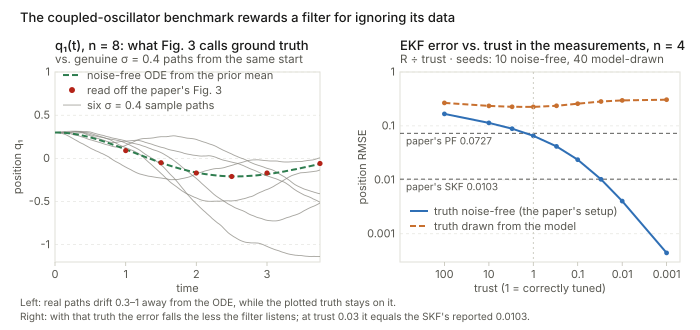
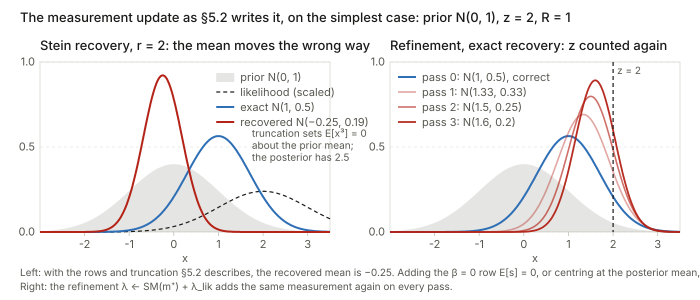

## Links

- **[arXiv:2605.16644](https://arxiv.org/abs/2605.16644)**: the preprint (v1, 15 May 2026).
  No code is released.
- **[Interactive companion](figures/interactive.html)**: four widgets. (1) Score matching as one linear
  solve, next to MaxEnt, on targets inside and outside the family. (2) Stein's identity as a recursion,
  and the closed moment ODE for a double well against Monte Carlo. (3) The measurement update step by
  step, with each way of recovering the moments, for Gaussian and bimodal posteriors. (4) The oscillator
  benchmark with a slider for how much the filter trusts its measurements.
- **[Runnable checks](https://github.com/msrepo/theory_inclined_papers_with_annotations/tree/main/papers/2026-iwasaki-score-kalman-filter/code)**:
  `skf_checks.py` covers Propositions 1–2, Theorem 1, the off-model behaviour, the App B.5 counts, and the
  measurement update as written. `oscillator_benchmark.py` rebuilds the Sec 7.3 benchmark. Every number
  below comes from one of them. `make verify` runs both.
- **[The Gram matrix](../gram-matrix/index.html)**: the score-matching matrix $A$ in Proposition 1 is a
  Gram matrix of gradients, so everything on that page about positive semi-definiteness and conditioning
  applies.
- **[EM and Gaussian mixtures](../expectation-maximization/index.html)**: the other place in these notes
  where an exponential family and its normaliser do the work.
- Background the paper leans on: Hyvärinen, *Estimation of non-normalized statistical models by score
  matching*, JMLR 2005 (score matching); Teng et al., *Max entropy moment Kalman filter*, NeurIPS 2025
  (MEM-KF, the method this paper speeds up).

Kaito Iwasaki, Anthony Bloch, Taeyoung Lee and Maani Ghaffari, *The Score Kalman Filter*, arXiv:2605.16644,
May 2026. University of Michigan and George Washington University.

## In one paragraph

A filter tracks a hidden state from noisy measurements by alternating two moves. *Predict* pushes the
current belief through the dynamics. *Update* folds in the next measurement with Bayes' rule. The Kalman
filter does both exactly when everything is linear and Gaussian. With nonlinear dynamics the belief
becomes skewed or multimodal, and it has to be stored somehow. This paper stores it two ways at once:
as a list of **moments** $\mathbb E[x^\alpha]$, and as a **polynomial exponential family**
$p(x;\lambda)\propto e^{-\lambda\cdot\phi(x)}$ whose energy is a polynomial. Moments are easy to push
forward in time. The density is what Bayes' rule needs. Going from moments to $\lambda$ normally requires
the normalising integral $Z(\lambda)$, which costs $O(G^n)$ in $n$ dimensions. The paper avoids it with two
classical tools that never see $Z$. **Score matching** turns "which $\lambda$ fits these moments" into
one linear system (Proposition 1). **Stein's identity** gives linear relations between moments whose
weights are $\lambda$. Those relations supply the higher moments the dynamics ask for (the *closure*), and
recover moments after an update. The update itself is just addition: $\lambda^+=\lambda^-+\lambda_{\rm lik}$.
At polynomial degree $r=2$ the whole loop is the information-form Kalman filter. The algebra is correct and
genuinely neat; I checked each identity numerically. The filtering evidence is another matter. In the one
benchmark with numbers (coupled oscillators, $n$ up to 20), the ground truth is the noise-free trajectory
started at the prior mean. On that benchmark a filter scores better the less it listens to its
measurements. An EKF told to trust its data 33× less reproduces the SKF's reported $n=4$ error, 0.0103. On top of
that, the moment-recovery and refinement steps of the update, implemented as written, all but cancel the
measurement's effect on the mean.

**The short version.** What holds: Propositions 1–2, Theorem 1 (for even $r$), the $r=2$ Kalman
correspondence for $\lambda$, the counting in App B.5, and the prediction-only experiments (moment
trajectories against Monte Carlo). What does not: the filtering comparison in Table A1. It also rests on
steps that fail when implemented as written, and it uses odd $r$, for which the "density" is not
normalisable.

## Background, from the ground up

This section builds the five ideas the paper assumes, each with a small numerical example before the
notation. Skip whatever is familiar.

### Filtering: predict, then update

A state $x_t$ (a robot's position, an oscillator's displacement) evolves with some randomness. Every
$\Delta t$ you get a noisy measurement $z_k$ of part of it. You never see $x_t$, only the measurements, so
the best you can hold is a **belief**: a probability distribution over where $x_t$ might be, given every
measurement so far. Two moves maintain it:

- **Predict.** Push the belief through the dynamics. Randomness in the dynamics spreads it out.
- **Update.** When $z_k$ arrives, multiply the belief by the **likelihood** $p(z_k\mid x)$ (how probable
  that reading is from each candidate $x$) and renormalise. That is Bayes' rule, and it sharpens the belief.

A worked 1-D update: the belief is $\mathcal N(0,1)$, a sensor reads $z=2$, and its noise has variance
$R=1$. The posterior is $\mathcal N(1,\,0.5)$: halfway, because the prior and the sensor are equally
trustworthy, and narrower than either. When the belief stays Gaussian throughout (linear dynamics, linear
sensor, Gaussian noise), tracking the mean and covariance is exact. That is the **Kalman filter**.

When the dynamics are nonlinear, a Gaussian belief turns into a banana, or splits into two lumps. The
classical fixes keep pretending it is Gaussian: the **EKF** linearises, the **UKF** pushes a few sigma
points through, the **EnKF** uses a small ensemble. **Particle filters** keep thousands of samples instead.
They can represent any shape, but need a lot of samples, especially when the measurements are informative.

### Describing a belief by its moments

The moments of a distribution are the averages $\mathbb E[x]$, $\mathbb E[x^2]$, $\mathbb E[x^3]$, and so
on. In $n$ dimensions the paper uses **multi-index** notation. $\alpha=(\alpha_1,\dots,\alpha_n)$ lists a
power for each coordinate, $x^\alpha=x_1^{\alpha_1}\cdots x_n^{\alpha_n}$, and $\lvert\alpha\rvert$ is the
total degree. With $n=2$, $\alpha=(2,1)$ means $x_1^2x_2$ and $\lvert\alpha\rvert=3$. Write
$m_\alpha=\mathbb E[x^\alpha]$. The number of monomials of degree at most $r$ in $n$ variables is
$M=\binom{n+r}{n}$. For example $n=2$, $r=4$ gives $M=15$, and $n=20$, $r=3$ gives $1771$. Finitely many
moments are a lossy but often good summary of a belief: the first two give a Gaussian, and a few more
capture skew and a second mode.

### How moments move: the generator and Dynkin's formula

The dynamics are a stochastic differential equation, $dx = X(x)\,dt + h(x)\,dW$: drift $X$ plus noise of
size $h$. For any function $f$, the average $\mathbb E[f(x_t)]$ changes at the rate

$$
\frac{d}{dt}\mathbb E[f(x_t)] = \mathbb E[\mathcal A f(x_t)],\qquad
\mathcal A f = \nabla f\cdot X + \mathrm{Tr}\big(H\,\nabla^2 f\big),\quad H=\tfrac12 hh^\top .
$$

This is **Dynkin's formula** (Eq 3), and $\mathcal A$ is the **generator** (Eq 2). The first term says the
drift carries $f$ along. The second is Itô's correction: noise makes a curved $f$ grow on average, because
jiggling a point up and down a convex bowl raises its average height.

A 1-D example with numbers. Take $dx=-x\,dt+\sigma\,dW$ (an Ornstein–Uhlenbeck process) with $\sigma=1$,
starting from the point $x=1$. With $f=x$: $\mathcal A x = -x$, so $\tfrac{d}{dt}\mathbb E[x]=-\mathbb E[x]$
and $\mathbb E[x_t]=e^{-t}$. With $f=x^2$: $\mathcal A x^2 = 2x\cdot(-x)+\tfrac12\sigma^2\cdot 2$, so
$\tfrac{d}{dt}\mathbb E[x^2]=-2\mathbb E[x^2]+1$. At $t=1$ the mean is $0.368$ and the variance $0.432$,
heading to the stationary $0.5$. Applying Dynkin to $f=x^\alpha$ for every tracked $\alpha$ gives a system of
ODEs for the moments (Eq 4). That is the whole prediction step, with no samples and no grid.

### The closure problem

For the OU process, the ODE for degree-$k$ moments involves only moments of degree $\le k$, so it closes.
Now take a double well, $dx=(x-x^3)\,dt+\sigma\,dW$:

$$
\tfrac{d}{dt}m_1 = m_1 - m_3,\qquad \tfrac{d}{dt}m_2 = 2m_2-2m_4+\sigma^2,\qquad\dots
$$

The equation for $m_1$ needs $m_3$, the one for $m_2$ needs $m_4$, and every new equation asks for a moment
two degrees higher. The chain never ends. This is the **moment closure problem**: to propagate moments up to
degree $K$, some rule must supply the ones of degree $K+1,\dots,K+\bar d$. The overshoot is the **excess
degree** (Eq 5),

$$
\bar d=\max(d_X-1,\;2d_h-2),
$$

where $d_X$ and $d_h$ are the polynomial degrees of the drift and the noise. Linear drift gives $\bar d=0$
(closes exactly). Quadratic drift gives $\bar d=1$ (one missing degree). Cubic drift gives $\bar d=2$. The
classical rule, **Gaussian closure**, sets the missing moments to what a Gaussian with the current mean
and covariance would have.

### From moments back to a density: MaxEnt and the $Z$ problem

To do a Bayes update you need an actual density, not just moments. The paper uses the family

$$
p(x;\lambda)=\frac{1}{Z(\lambda)}\exp\!\big(-\lambda\cdot\phi(x)\big),\qquad
\phi(x)=(x^\alpha)_{\lvert\alpha\rvert\le r},\qquad Z(\lambda)=\int e^{-\lambda\cdot\phi(x)}\,dx .
$$

In deep-learning terms this is an **energy-based model** whose energy $E(x)=\lambda\cdot\phi(x)$ is a
polynomial of degree $r$. $Z$ is its partition function, the continuous cousin of softmax's denominator. At
$r=2$ the energy is a quadratic bowl and $p$ is a Gaussian. At $r=4$ the energy can have two wells, so $p$
can be bimodal. Given target moments $m$, the **maximum-entropy** (MaxEnt) choice is the member of the
family whose moments equal $m$. It is also the least committal density with those moments (App A).
Finding it means minimising $\lambda\cdot m+\log Z(\lambda)$, and every step needs $Z$ and its gradient,
integrals over $\mathbb R^n$. On a grid with $G$ points per axis that is $G^n$ evaluations. This is why the
MaxEnt moment filter (MEM-KF) was demonstrated only up to $n\le 4$.

### The score: a gradient that forgets $Z$

The **score** is the gradient of the log-density, $s(x)=\nabla_x\log p(x)$. Taking logs turns $1/Z$ into
$-\log Z$, a constant, and the gradient kills it:

$$
s(x;\lambda)=-\nabla_x\big(\lambda\cdot\phi(x)\big)=-J_\phi(x)\,\lambda,\qquad [J_\phi]_{i\alpha}=\partial_i x^\alpha=\alpha_i\,x^{\alpha-e_i}.
$$

Here $e_i$ is the multi-index with a 1 in slot $i$, so $\alpha-e_i$ lowers the power of $x_i$ by one.
$J_\phi(x)$ is the $n\times M$ matrix of derivatives of the monomials. For a Gaussian
$\mathcal N(\mu,\sigma^2)$ the score is $-(x-\mu)/\sigma^2$: a straight line pointing back to the mean,
steeper when the distribution is narrower. This is the same object a diffusion model's network learns, for
the same reason: it is the one description of a density that never needs the normaliser.

### Score matching

To fit $\lambda$ you would like to match the model score to the data's score in mean square. That quantity
is the **Fisher divergence**, $\tfrac12\mathbb E_p\lVert s_\lambda-s_p\rVert^2$. The catch is that you
do not know $s_p$. Hyvärinen's trick is one integration by parts. In 1-D, the cross term is
$\mathbb E_p[s_\lambda s_p]=\int s_\lambda\,p'\,dx=-\int s_\lambda'\,p\,dx=-\mathbb E_p[s_\lambda']$, as
long as $p\,s_\lambda\to0$ at infinity. So, up to a constant that does not depend on $\lambda$,

$$
J_{\rm SM}(\lambda)=\mathbb E_p\Big[\sum_i \partial_i s_i(x;\lambda)+\tfrac12 s_i(x;\lambda)^2\Big]
\qquad\text{(Eq 7)},
$$

which involves only the model's score and expectations under the data. When the score is a polynomial, those
expectations are moments. That observation is the paper's Proposition 1.

### Stein's identity

The last tool is also one integration by parts. For a density $p$ with score $s$ and any reasonable test
function $f$:

$$
\mathbb E_p\big[s_i(x)\,f(x)+\partial_i f(x)\big]=0 .
$$

In 1-D: $\int (p'/p\cdot f + f')\,p\,dx=\int (pf)'\,dx=[pf]_{-\infty}^{\infty}=0$. Try it on
$\mathcal N(\mu,\sigma^2)$ with $f=x^k$:

$$
m_{k+1}=\mu\,m_k+k\sigma^2 m_{k-1}.
$$

With $\mu=\sigma^2=1$ this gives $m_0,\dots,m_4=1,1,2,4,10$, the familiar Gaussian moments, produced by a
recursion rather than an integral. The general point is that Stein's identity is a **linear equation among
moments whose coefficients are the score's parameters**. It can be read in two directions: given moments,
solve for $\lambda$ (that is score matching again, App K); given $\lambda$, solve for moments (that is
closure and recovery). The whole paper is these two readings.

## The spine of the argument

1. **Represent the belief twice**: moments $m$ (to propagate) and polynomial score parameters $\lambda$
   (to do Bayes' rule). Degree $r$ fixes the basis, and the moment budget is $K=2r-2$.
2. **Fit $\lambda$ from $m$ by score matching.** For a polynomial score the objective is quadratic in
   $\lambda$, so the fit is one linear solve, $A\lambda=b$, with every entry of $A$ and $b$ a moment
   (Prop 1). On the model class it gives the same answer as MaxEnt (Thm 1).
3. **Propagate $m$ with Dynkin's formula**, and when the dynamics ask for moments beyond $K$, get them
   from Stein's identity with the current $\lambda$ (Prop 2, the *Stein closure*).
4. **Update by adding scores**: posterior score = prior score + likelihood score, which in parameters is
   $\lambda^+=\lambda^-+\lambda_{\rm lik}$ (Eq 14).
5. **Recover $m^+$ from $\lambda^+$** with Stein's identity again, as a least-squares system (Eq 15), then
   re-fit. Loop.
6. **At $r=2$ this is the information-form Kalman filter** (App D).

Steps 2 and 4 are exact under stated conditions and are the paper's real contribution. Step 3 is an
assumed-density approximation, of the same kind as Gaussian closure. Step 5 is where the trouble is (see
[Questions and doubts](#questions-and-doubts)).

<figure><figcaption><b>Algorithm 1 as a loop.</b> Green marks steps that are exact under stated conditions, orange marks approximations. None of the steps evaluates $Z$.</figcaption></figure>

## Setup and notation

| Symbol | Meaning |
|---|---|
| $x\in\mathbb R^n$ | state; $dx=X(x)\,dt+h(x)\,dW$ (Eq 1) |
| $H=\tfrac12 hh^\top$ | diffusion tensor |
| $\mathcal A$ | generator, $\mathcal Af=\nabla f\cdot X+\mathrm{Tr}(H\nabla^2 f)$ (Eq 2) |
| $\alpha,\beta,\gamma\in\mathbb N^n$ | multi-indices; $x^\alpha=\prod_i x_i^{\alpha_i}$, $\lvert\alpha\rvert=\sum_i\alpha_i$; $e_i$ is the $i$-th unit multi-index |
| $m_\alpha=\mathbb E[x^\alpha]$ | moments; $m_0=1$ |
| $d_X,\ d_h,\ \bar d$ | degrees of drift and noise; excess degree $\max(d_X-1,2d_h-2)$ (Eq 5) |
| $r$ | degree of the polynomial energy (the basis order) |
| $\phi(x)=(x^\alpha)_{\lvert\alpha\rvert\le r}$ | monomial features; $M=\binom{n+r}{n}$ of them |
| $\lambda\in\mathbb R^M$ | natural parameters; $p(x;\lambda)\propto e^{-\lambda\cdot\phi(x)}$ (Eq 6), constant component fixed at $\lambda_0=0$ |
| $Z(\lambda)$, $\Lambda$ | normaliser; natural domain $\{\lambda: Z(\lambda)<\infty\}$ |
| $s(x;\lambda)=-J_\phi(x)\lambda$ | model score; $[J_\phi]_{i\alpha}=\alpha_i x^{\alpha-e_i}$ |
| $A,\ b$ | score-matching system, $A=\mathbb E[J_\phi^\top J_\phi]$, $b=\mathbb E[\Delta\phi]$ (Eq 8) |
| $K=2r-2$ | moment budget: the highest degree the filter tracks |
| $\Lambda_1(\lambda)$ | Stein closure matrix for the degree-$(K+1)$ moments |
| $\lambda^-,\ \lambda^+,\ \lambda_{\rm lik}(z)$ | prior, posterior and likelihood parameters (Eq 14) |
| $\Omega=P^{-1}$, $\eta=\Omega\mu$ | precision and information vector (App D) |

## Proposition 1: score matching is one linear solve

Put the polynomial score $s=-J_\phi\lambda$ into Eq 7. The divergence term is linear in $\lambda$ and the
squared term is quadratic, so

$$
J_{\rm SM}(\lambda)=\tfrac12\lambda^\top A\lambda-b^\top\lambda,\qquad
A_{\alpha\beta}=\sum_{i=1}^n\alpha_i\beta_i\,m_{\alpha+\beta-2e_i},\qquad
b_\alpha=\sum_{i=1}^n\alpha_i(\alpha_i-1)\,m_{\alpha-2e_i}
$$

(Eq 8), minimised by $\lambda^*=A^{-1}b$ (Eq 9). Both formulas come from one rule,
$\partial_i x^\alpha=\alpha_i x^{\alpha-e_i}$. $A$ is the average of $J_\phi^\top J_\phi$, a product of two
first derivatives. $b$ is the average Laplacian of each monomial, a second derivative. So every entry is a
moment you already have. In 1-D they read $A_{jk}=jk\,m_{j+k-2}$ and $b_j=j(j-1)\,m_{j-2}$.

**Worked example (App D.3).** A Gaussian with mean $\mu=1$ and variance $P=0.5$ has $m_1=1$, $m_2=1.5$.
With basis $(x,x^2)$:

$$
A=\begin{pmatrix}1 & 2m_1\\ 2m_1 & 4m_2\end{pmatrix}=\begin{pmatrix}1&2\\2&6\end{pmatrix},\quad
b=\begin{pmatrix}0\\2\end{pmatrix}\ \Rightarrow\ \lambda=(-2,\ 1)=\big(-\mu/P,\ 1/(2P)\big).
$$

So $p\propto e^{2x-x^2}$, which is $\mathcal N(1,0.5)$ again. In general, at $r=2$ score matching returns
the precision and information vector, $\Omega=2\Lambda_2$ and $\eta=-\lambda_1$.

**$A$ is a Gram matrix of gradients.** For any coefficient vector $v$, write $q_v(x)=\sum_\alpha v_\alpha
x^\alpha$. Then $v^\top Av=\mathbb E\lVert\nabla q_v(x)\rVert^2\ge0$ (A.6). So $A$ is positive
semi-definite, and it is definite unless some non-constant polynomial has zero gradient on the support. That
happens only for a distribution living on a lower-dimensional set (Remark 4: a 2-D state on the line
$x_2=0$ makes $q=x_2^2$ invisible). This is the [Gram matrix](../gram-matrix/index.html) story with the
gradient vectors $\nabla x^\alpha$ as the "points".

**What it costs and what it needs.** One $M\times M$ solve, $O(M^3)$. It needs moments up to degree $2r-2$,
not just $r$. The family is identified by its degree-$\le r$ moments (App A), but the quadratic objective
multiplies two gradients together (Remark 3). That fixes the budget $K=2r-2$ used everywhere else.

**Graceful degradation (Prop 3).** $A$ and $b$ are linear in the moments, so a relative moment error
$\epsilon$ moves $\lambda$ by at most about $\kappa(A)\,\epsilon$. That is the standard perturbation bound
for a linear system. It says the solve is stable; it says nothing about whether the resulting density is
any good. (The next section shows it can be bad.)

## Theorem 1: on the model class, score matching equals MaxEnt

**Statement.** If the moments come from a member $p(\cdot;\lambda_{\rm true})$ of the degree-$r$ family,
with $\lambda_{\rm true}$ inside the natural domain, then $\lambda^*=A^{-1}b$ recovers $\lambda_{\rm true}$
exactly (Eq 11).

**Why.** The Fisher divergence between two members of the family is
$\tfrac12(\lambda-\lambda_{\rm true})^\top A(\lambda-\lambda_{\rm true})$ (A.11). It is zero only at
$\lambda_{\rm true}$ because $A\succ0$. And $J_{\rm SM}$ differs from it by a constant (Hyvärinen), so the
two have the same minimiser. Because MaxEnt returns the unique family member with the given moments, the two
methods agree whenever the target is in the family (Remark 1).

**Checked** (`skf_checks.py`, §2): for the two-well quartic $E=x^4+0.1x^3-2x^2+0.3x$, the four coefficients
come back exactly ($\kappa(A)=140$). For a 2-D quartic with a coupling term (14 unknowns), the maximum
error is $4.9\times10^{-13}$.

**Off the model class it is a different estimator, and a fragile one.** Real filtering densities are not
exactly exp-polynomial, so the interesting case is a target outside the family. Here is a two-Gaussian
mixture (weights 0.6/0.4 at $-1.2$ and $1.5$, sds 0.5 and 0.8), in standardised coordinates:

| $r$ | SM leading coefficient | SM normalisable? | L1 error, SM | L1 error, MaxEnt | $\kappa(A)$ |
|---|---|---|---|---|---|
| 2 | $+0.500$ | yes | 0.616 | 0.616 | $4$ |
| 4 | $+0.373$ | yes | 0.289 | 0.219 | $3.1\times10^2$ |
| 6 | $-0.070$ | **no** | — | 0.194 | $3.1\times10^4$ |
| 8 | $+0.009$ | yes | **2.000** | 0.101 | $4.3\times10^6$ |

At $r=2$ both return the moment-matched Gaussian. At $r=4$ score matching is somewhat worse. At $r=6$ its
energy goes to $-\infty$ in both tails, so $e^{-E}$ is not a density at all. At $r=8$ the energy is
normalisable but has a well of depth $-52$ at $-3.8$ standard deviations, against about $-1.4$ in the bulk.
Almost all of the mass sits in that well, where the target density is $3\times10^{-18}$ (L1 error 2, the
maximum possible). MaxEnt improves steadily throughout.

<figure><figcaption><b>Score matching is exact in the family and blind outside the data.</b> The Fisher divergence weighs score errors by $p(x)$. Where $p\approx0$ the fitted polynomial can do anything, including turn downwards (not a density) or dig a deep well (all the mass ends up there). The interactive page lets you try other targets and orders.</figcaption></figure>

The mechanism is worth stating plainly. Score matching fits the *slope* of $\log p$ where the data are.
Nothing in the objective asks the polynomial to keep rising outside that region, and nothing weighs how much
probability a distant well would capture. The paper's Remark 5 says a non-normalisable fit arises "when
$m\notin\mathcal M$", that is, from moments no distribution could have. The mixture's moments come from an
actual density, so non-normalisability also arises from perfectly realisable moments whenever the target is
off-model.

## Stein closure (Section 4)

### The identity with a polynomial score (Prop 2)

Stein's identity with $f=x^\beta$ and the polynomial score becomes

$$
\sum_{\lvert\alpha\rvert\le r}\lambda_\alpha\,\alpha_i\,m_{\alpha+\beta-e_i}=\beta_i\,m_{\beta-e_i}
\qquad\text{for every multi-index }\beta\text{ and coordinate }i\quad\text{(Eq 12)}.
$$

Read it as one linear equation per $(\beta,i)$ pair. The highest-degree moment on the left has degree
$\lvert\beta\rvert+r-1$, and its coefficient is a leading ($\lvert\alpha\rvert=r$) coefficient of $\lambda$.
Choosing $\lvert\beta\rvert=r$ puts the unknown degree-$(2r-1)=(K+1)$ moments on the left, with everything
else of degree $\le K$. Collected over all such $(\beta,i)$ this is a linear system
$\Lambda_1(\lambda)\,m^{(K+1)}=c_1(\lambda,m^{(\le K)})$.

In 1-D it is a single formula (A.80 in a different indexing):

$$
m_{2r-1}=\frac{r\,m_{r-1}-\sum_{j=1}^{r-1}j\lambda_j\,m_{r+j-1}}{r\,\lambda_r}.
$$

Checked on the quartic: this gives $m_7=-1.545146$ from $\lambda$ and $m_0..m_6$, and quadrature gives the
same to six decimals.

### What kind of approximation it is

Eq 12 is exact *for a density in the family*. During prediction the true density leaves the family: pushing
an exp-polynomial through nonlinear dynamics does not give another exp-polynomial. The closure then says
"supply the missing moments as if the current density were the score-matched family member". That is an
**assumed-density closure**, in the same class as Gaussian closure (exact for Gaussians, approximate
otherwise), just with a richer family. App I's phrase "the Stein closure is exact for the polynomial
exponential family" should be read in that sense. It is not exact for the system being filtered.

Remark 1 says that because Dynkin propagation is exact for polynomial systems, "the conditions of
Theorem 1 are approximately satisfied". That is a non sequitur. Exact propagation gives the true density's
moments. Theorem 1 needs those moments to be a family member's, which is a claim about the true density, not
about the propagation.

### Solvability, counting and cost

- **$n=2$**: the first-layer system is square ($2r$ equations, $2r$ unknowns) and nonsingular except on a
  measure-zero set of $\lambda$ (Prop 4). At $r=2$ it reduces to "third cumulants vanish".
- **General $n$** (App B.5): augmenting with $\lvert\beta\rvert\in[r,K]$ gives $R(n,r)$ rows for
  $U(n,r)=\binom{2r+n-2}{n-1}$ unknowns. At $r=3$, $R/U=1.374,\ 1.087,\ 1.032,\ 0.982$ at
  $n=10,14,15,16$, so the system becomes underdetermined at $n=16$. At $r=4$ that happens first at $n=36$.
  I reproduced every count the paper quotes, including $R=492{,}000$, $R_{\rm ext}=5{,}428{,}400$ and
  $U=1{,}086{,}008$ at $n=40$.
- **Active closure**: for the coupled oscillators only the moments the generator actually requests need
  closing. At $n=20$ that is 14,500 unknowns against 32,800 equations, instead of all $\binom{24}{5}=42{,}504$.
- **Factorisation caching** (Remark 2): $\Lambda_1$ depends on $\lambda$ only, so it is factorised once per
  prediction window and reused across the ODE substeps.

### Where it breaks: $\bar d\ge2$ and modality changes (App L)

The authors are candid here. With cubic drift ($\bar d=2$) the closure needs two layers: $m_{K+2}$ is
solved from an equation that contains the layer-1 estimate of $m_{K+1}$. Each layer divides by the leading
coefficient, so the sensitivity of $m_{K+2}$ picks up a term of order $\lambda_{2r-1}/\lambda_{2r}^2$ (A.81).
When a density moves from one mode to two, its fitted energy must pass through a configuration where two
critical points merge. Near there the leading coefficients get small and this term blows up. The closed
moment ODE becomes stiff and then diverges: at $t^*\approx1.1$ s on the 2-D double well, whether or not
$\Delta t$ is refined 16×. Higher $r$ makes it worse ($t^*=2.9$ at $r=4$, $0.54$ at $r=12$). The true
process has no such singularity; the blowup belongs to the closure. Their remedy treats the unresolved moment
as a control input, bounded below by a Hankel positivity constraint and above by a control-barrier
inequality, with one scalar calibrated from the known stationary density. It is a promising sketch, not yet a
general method. The interactive page runs a 1-D version: the closed moment ODE against Monte Carlo at
$r=2,4,6$. Gaussian closure settles on the wrong variance, $r=4$ drifts as the density splits, and $r=6$
diverges almost at once. The Gaussian start leaves $\lambda_6$ near zero, and the closure divides by it.

## The measurement update (Section 5)

### Bayes' rule is addition in score space (Eqs 13–14)

$\log p(x\mid z)=\log p(x)+\log p(z\mid x)-\log p(z)$, and $p(z)$ does not depend on $x$, so its gradient
vanishes:

$$
s_{\rm post}(x)=s_{\rm prior}(x)+\nabla_x\log p(z\mid x).
$$

With the 1-D numbers from the start: prior score $-x$, likelihood score $2-x$ (sensor reads 2, $R=1$). The
sum is $2-2x=-2(x-1)$, the score of $\mathcal N(1,0.5)$. In parameters: the prior energy is $\tfrac12x^2$,
so $\lambda^-=(0,\tfrac12)$. The likelihood energy is $\tfrac12(x-2)^2$, so $\lambda_{\rm lik}=(-2,\tfrac12)$.
Adding gives $\lambda^+=(-2,1)$.

This works whenever the log-likelihood is itself a polynomial of degree $\le r$. For a measurement
$z=g(x)+v$ with polynomial $g$ of degree $d_g$ and Gaussian noise, $\log p(z\mid x)$ has degree $2d_g$, so
the condition is $d_g\le r/2$ (Eq 14). A quadratic sensor $z=x^2+v$ needs $r\ge4$. Its likelihood
contributes $\lambda_{x^4}=\tfrac1{2R}$ and $\lambda_{x^2}=-\tfrac zR$, and the posterior can be bimodal
(the sign of $x$ is ambiguous). The update represents that exactly, which no Gaussian filter can. At
$r=2$ with a linear sensor, $\lambda^+=\lambda^-+\lambda_{\rm lik}$ is literally the information-form Kalman
update $\Omega^+=\Omega^-+C^\top R^{-1}C$, $\eta^+=\eta^-+C^\top R^{-1}z$ (App D.5).

### Getting the moments back (Eq 15)

The next prediction needs $m^+$, the posterior's moments, but the update produced $\lambda^+$. Computing
$m^+=\mathbb E_{\lambda^+}[\phi]$ directly needs $Z$ again. So the paper imposes Stein's identity at
$\lambda^+$ with $m_0=1$ and solves for the moments. It uses the "directional" rows $(\beta,i)$ with
$\beta_i\ge1$. Within the budget these are underdetermined (12 equations for 27 unknowns at $n=2$, $r=4$),
so rows up to $\lvert\beta\rvert=K$ are added and every moment of degree $>K$ is set to zero. The result
is a least-squares problem, in coordinates centred at the current (prior) mean. For the Duffing filter
the paper quotes "42 equations, 27 unknowns". An **iterative refinement** follows: re-fit $\lambda$ to the
recovered $m^+$ by score matching, add $\lambda_{\rm lik}$ again, re-recover, repeat (§5.2, App E). The
[Doubts](#questions-and-doubts) section examines both steps; they do not do what they are meant to.

## Algorithm 1, and the Kalman filter at $r=2$ (App D)

The loop is: score-match the initial moments; then for each step, (5) propagate $m$ with Dynkin plus Stein
closure; (6) $\lambda^-=A(m)^{-1}b(m)$; (8) $\lambda^+=\lambda^-+\lambda_{\rm lik}(z)$; (9) recover $m^+$
via Eq 15; (10) re-fit $\lambda=A(m^+)^{-1}b(m^+)$. The reported estimate is the recovered first moment.

At $r=2$ everything becomes Gaussian:

| SKF quantity | Information-form Kalman filter |
|---|---|
| score $s(x)=-J_\phi\lambda$ | $-\Omega(x-\mu)=-\Omega x+\eta$ |
| score matching solve | $(\Omega,\eta)$ from $(m_1,m_2)$ |
| Dynkin on $m_1,m_2$ (closes, $\bar d=0$) | $\dot\mu=A\mu+b$, $\dot P=AP+PA^\top+2H$ |
| score PDE (A.24) | Riccati ODE $\dot\Omega=-A^\top\Omega-\Omega A-2\Omega H\Omega$ |
| $\lambda^+=\lambda^-+\lambda_{\rm lik}$ | $\Omega^+=\Omega^-+C^\top R^{-1}C$, $\eta^+=\eta^-+C^\top R^{-1}z$ |

I rederived the score PDE (A.20)–(A.24) and its Riccati specialisation; both are right. One caveat is needed,
though. Prop 5's proof checks steps 5, 6 and 8, but not step 9, the moment recovery. At $r=2$ the recovery
is exact only if it uses the Gaussian closed form, or includes rows the paper calls optional. With the rows
§5.2 describes it is not exact (next section). So "Algorithm 1 at $r=2$ is the Kalman filter" holds with the
recovery done by hand, not with Eq 15 as specified.

## Experiments, in brief

**Prediction only** (no measurements). SE(2) and SO(3) kinematics have $\bar d=0$, so the moment ODE closes
and is linear: $m(T)=e^{LT}m(0)$. It matches Monte Carlo to 0.5% (SE(2)) and 0.3% (SO(3)). The moment
basis matters: Fourier×Legendre for SE(2), Wigner D-matrices for SO(3), where raw monomials give
$\kappa(A)\sim10^{14}$. Lotka–Volterra, the Duffing oscillator and 3-D tracer advection have $\bar d=1$, so
one closure layer is needed. Variances match Monte Carlo within about 1%, higher moments within 2–8%, and
error grows with degree. The density reconstructions capture bananas (SE(2) from $r=4$), plumes (tracer) and
the four modes of a double well at $r=6$. These are the paper's most convincing results, and they need no
measurement update.

**Filtering.** A single Duffing oscillator ($n=2$, $r=4$): all methods track. Coupled Duffing oscillators
($n=4$ to $20$, $r=3$, odd positions observed): the SKF's mean RMSE is 0.0029–0.020, against 0.068–0.084 for
EKF, UKF, EnKF and a $5\times10^5$-particle bootstrap PF (Table A1). Runtime at $n=20$: 2079 s for the SKF,
0.03 s for the EKF, 646 s for the PF.

## Questions and doubts

### 1. The oscillator benchmark rewards a filter for ignoring its data

The whole quantitative filtering claim rests on Table A1. Three observations about it:

**(a) The ground truth is the noise-free trajectory from the prior mean.** The prior is
$\mathcal N(m_0,0.15^2I)$ with positions cycling $0.3,-0.2,0.1,-0.3,\dots$ and zero momenta, and the
process noise is $\sigma=0.4$ (App J.5). Fig. 3's green "ground truth" starts exactly at $m_0$, not at a
draw from the prior. Integrating the ODE *without noise* from $m_0$ reproduces it to plotting accuracy:
$q_1(2.5)=-0.208$ against about $-0.21$ read off the figure, $q_2(2)=0.139$ against $0.14$,
$q_3(3.75)=0.100$ against $0.10$, $q_4(2.5)=0.154$ against $0.155$. Real paths behave very differently. Of
5,000 genuine $\sigma=0.4$ paths from the same start, none stays within 0.03 of the ODE. The median
largest deviation over the run is 0.66, and the 1st percentile is 0.32. The truth in Fig. 3 never met the
process noise that every filter is told about.

**(b) With that truth, the paper's baselines are reproduced, and a detuned EKF beats the SKF.** Rebuilt
from App G.3 and J.5 (`oscillator_benchmark.py`; 10 seeds for the noise-free truth, 40 for the model-drawn one):

| $n$ | truth | EKF | PF | EKF, $R\times100$ | paper: EKF / PF / SKF |
|---|---|---|---|---|---|
| 4 | noise-free from $m_0$ | 0.0657 | 0.0738 | **0.0040** | 0.0676 / 0.0727 / 0.0103 |
| 8 | noise-free from $m_0$ | 0.0731 | 0.0786 | **0.0045** | 0.0713 / 0.0747 / 0.0181 |
| 4 | drawn from the model | 0.2253 | 0.2238 | 0.2974 | — |

(Mean RMSE. The PF uses $10^4$ particles, and 5,000 in the model-drawn row.) My correctly tuned EKF and PF
land within about 5% of the paper's. The same EKF told that its sensor is 100×
noisier than it is, so that it barely listens, scores 0.0040. That is 2.6× better than the SKF, and 16×
better than the correctly tuned filter. Sweeping that "trust" factor makes the pattern plain. With the
noise-free truth, the error falls monotonically as trust falls, and at trust 0.03 it is **0.0103**, the
SKF's number to four decimals.

<figure><figcaption><b>What the benchmark measures.</b> Left: the plotted truth is the noise-free ODE; genuine paths from the stated SDE look like the grey ones. Right: with a noise-free truth, trusting the data less always helps. With a truth drawn from the model, the correctly tuned filter (trust 1) is best, and every error is above 0.2.</figcaption></figure>

**(c) With a truth drawn from the model, nothing can reach 0.01.** Draw $x_0$ from the prior and simulate the
SDE with its noise, the model all five filters assume. Over 40 seeds the EKF and PF then give 0.225 and 0.224
(medians 0.203 and 0.210), and the low-trust EKF is worst at 0.297. The trust sweep is U-shaped, with its
minimum at trust 1. (The errors are heavy-tailed: in one of the 40 runs the true path crosses the spring's
barrier, see doubt 5, and that run alone scores 0.9.)

Why nothing can reach 0.01 is a basic fact of Bayesian estimation. The posterior mean
$\mathbb E[x_k\mid z_{1:k}]$ is the best possible guess from the measurements, in mean squared error. A
5,000-particle PF in four dimensions is essentially that posterior mean. No filter that sees only $z_{1:k}$
can beat it on average, let alone by 7×. When the SKF appears to, the benchmark is measuring something else.
It rewards staying close to the prior's own noise-free forecast, which is what the truth is.

This also explains two things the paper attributes elsewhere. The PF "performing comparably to the Gaussian
filters" is not particle degeneracy. At these amplitudes the system is nearly linear ($\beta q/\alpha\approx
0.18$ at $q=0.3$), so the Gaussian filters are near-optimal and agree with the PF. And the SKF's
almost 7× error drop from $n=10$ to $n=12$ ($0.0197\to0.0029$), coinciding with the switch to active closure and one refinement pass, is
what you would expect if that change made the filter listen to its measurements even less.

### 2. The moment recovery, as written, moves the mean the wrong way

Take the case where the answer is known exactly: a Gaussian prior and a linear-Gaussian measurement. The
update $\lambda^+=\lambda^-+\lambda_{\rm lik}$ is then exact, and the posterior is the Kalman posterior. So
any error must come from the recovery. I implemented Eq 15 as §5.2 describes it: directional rows
$\beta_i\ge1$ up to $\lvert\beta\rvert=K$, degree $>K$ truncated, centred at the prior mean, scaled by
$3.5\sigma$. At $n=2$, $r=4$ it produces exactly the paper's 42×27 system.

- **1-D, prior $\mathcal N(0,1)$, $z=2$, $R=1$** (Kalman mean $+1$): the recovered mean is $-0.250$ at
  $r=2$, $-0.300$ at $r=3$ and $-0.313$ at $r=4$.
- **2-D**, correlated prior, only $x_1$ observed, $z=0.3$ (Kalman mean $(0.092, 0.046)$): the recovered
  step for $x_1$ is $-0.29$, $-0.44$ and $-0.51$ times the correct one at $r=2,3,4$. That is the wrong
  direction, by up to half a step.

The cause fits in one line. Truncation sets the odd moments about the centring point to zero. About the
*prior* mean, the posterior's third moment is $\mathbb E[x^3]=\mu^3+3\mu P$, which is first order in the
shift $\mu$. So the truncation error is as large as the update itself. At $r=2$ the two surviving equations
give $m_1=-\tfrac14$, $m_2=\tfrac14$ in closed form (true values $1$ and $1.5$). Two simple repairs work.
Adding the $\beta=0$ rows restores the mean: they read $\mathbb E[s]=0$, and the paper calls them optional.
In the 1-D example that gives $+0.970$, $+0.997$ and $+1.000$ at $r=2,3,4$. Centring at the posterior mean instead gives
exactly $+1$. Neither is what §5.2 specifies.

**For a genuinely non-Gaussian posterior, re-centring is not enough.** Take the case the SKF exists for: a
quadratic sensor $z=x^2+v$ ($z=2$, $R=1$) on the prior $\mathcal N(0,1)$, at $r=4$. The posterior
$\propto e^{1.5x^2-0.5x^4}$ has two modes near $\pm1.2$, and $\lambda^+=\lambda^-+\lambda_{\rm lik}$ is exact.
Its variance is 1.246. The Stein recovery returns $-0.253$: a negative variance, so not a distribution at
all. That holds as written, with the $\beta=0$ rows, and when scaled by the posterior's own spread. By symmetry
the mean is already right, so centring has nothing to fix. The culprit is the row $k=5$,
$-3m_6+2m_8=5m_4$. Truncation sets $m_8=14.06$ to zero there, which forces $m_6=-\tfrac53m_4<0$. Truncating
"higher" moments is only harmless when they are small compared with what they multiply. For a multimodal
posterior they are not.

### 3. The refinement re-applies the measurement

The refinement is $\lambda\leftarrow\mathrm{SM}(m^+)+\lambda_{\rm lik}$, then recover again. Suppose the
recovery were exact. Then $\mathrm{SM}(m^+)=\lambda^+$ already includes the likelihood, and adding
$\lambda_{\rm lik}$ counts the measurement a second time. The 1-D example makes it concrete: passes
$0,1,2,3,4$ give $\mathcal N(1,0.5)$, $\mathcal N(1.33,0.33)$, $\mathcal N(1.5,0.25)$, $\mathcal N(1.6,0.2)$,
$\mathcal N(1.67,0.17)$. That is the posterior after one, two, three, … copies of the same reading, with no
finite fixed point. App E's own fixed-point condition, $\mathrm{SM}(\mathrm{SteinRecover}(\lambda^*))=
\lambda^*-\lambda_{\rm lik}$, says that the recovered moments fit $\lambda^*-\lambda_{\rm lik}$, not
$\lambda^*$. So a fixed point exists only because the recovery is wrong by exactly the likelihood.

With the truncated recovery of doubt 2, the two errors combine. In the 2-D example at $r=4$, the recovered
step on $x_1$, as a fraction of the correct one, is:

| coordinates | no refinement | 1 pass (used at $n\ge12$) | 8 passes |
|---|---|---|---|
| centred, scaled by $3.5\sigma$ | $-0.51$ | $-0.14$ | $0.00$ |
| centred, scaled by $1\sigma$ | $-0.49$ | $+0.10$ | $0.00$ |
| centred only | $-0.51$ | $-0.15$ | $0.00$ |

The scaling changes the one-pass value, even its sign, but not the picture. **The update as specified
leaves the posterior mean at, or within about 15% of a step from, the prior mean**, where the correct step
is $+1$. At $r=2$ all three give $-0.29$, $-0.13$, $-0.06$.

<figure><figcaption><b>The two update problems on the simplest possible case.</b> Left: the truncated recovery lands on the wrong side of the prior. Right: the refinement multiplies in the same likelihood again on every pass.</figcaption></figure>

Put doubts 1–3 together. A filter whose update barely moves the mean, run on a benchmark whose truth *is*
the prior's noise-free forecast, would produce exactly Fig. 3. Its estimates are smooth, sit on the truth,
and do not react to the measurement jumps that all four baselines share; its RMSE is far below theirs. I
cannot see the authors' code, so their implementation may differ from the text. But the text as written
predicts the reported behaviour, and a correct implementation, on a correct benchmark, cannot produce it.

### 4. Odd $r$ is not a density

The coupled-oscillator runs use $r=3$ (and one uses $r=5$). A cubic energy $E=\lambda\cdot\phi$ has a
degree-3 part $c(x)$ with $c(-x)=-c(x)$. Unless $c\equiv0$, $E\to-\infty$ along some ray, and $e^{-E}$ has
infinite integral. For $E=\tfrac12x^2+0.05x^3$ the integral over $[-L,L]$ is 2.56, 2.79, $1.4\times10^{23}$
and $1.8\times10^{85}$ at $L=5,10,15,20$. So for odd $r$ the natural domain $\Lambda$ contains only the
Gaussians, and its interior in $\mathbb R^M$ is empty. Theorem 1 is vacuous, Stein's identity loses its
boundary condition, and "density" is the wrong word. The $r=3$ SKF is still a well-defined moment-closure
scheme, just not a density filter. Every other experiment in the paper uses even $r$.

### 5. Smaller points

- **The benchmark system can explode.** The "Duffing" force $-\alpha q-\beta q^2$ is a quadratic spring with
  potential $\alpha q^2/2+\beta q^3/3$. That potential is unbounded below past the barrier at
  $q=-\alpha/\beta\approx-1.67$ (height 0.46). With additive noise, every path has a positive probability of
  crossing and then blowing up in finite time. Strictly, no moment is finite at any $t>0$. It is not only
  hypothetical: in 1 of the 40 model-drawn runs above, the true path crosses $q=-1.67$ within the 3.75 s
  window. The paper's noise-free truth never meets this, and it is the opposite of the "dissipative at
  infinity" argument App L gives for the double well.
- **Polynomial is not cheap.** The SKF avoids $G^n$, but it tracks $\binom{n+2r-2}{n}$ moments and closes
  $\binom{n+2r-2}{n-1}$ more. At $n=20$, $r=3$ that is 10,626 moments and a 32,800×14,500 closure, and
  2079 s per 25 steps. The PF is faster from $n=16$. The MEM-KF cost comparison is against grid quadrature
  specifically. Sampling-based estimates of $\nabla\log Z=-\mathbb E[\phi]$ are noisy, but they do not scale
  as $G^n$.
- **"Graceful degradation" is about $\lambda$, not the density.** Prop 3 bounds how far $\lambda$ moves.
  The mixture example shows a stable $\lambda$ can still describe a non-density, or a density concentrated in
  the wrong place.

### What would settle it

Release the code. Re-run Table A1 with the truth drawn from the model: $x_0$ from the prior, process noise
on. Report filter consistency (NEES) alongside RMSE, and compare each filter's mean with a large-PF posterior
mean, not with one trajectory. Use even $r$. Include the $\beta_i=0$ rows or re-centre the recovery, drop the
second $\lambda_{\rm lik}$ from the refinement, and check that $r=2$ reproduces a Kalman filter step by step.

## Takeaways

- **The idea is good, and reusable.** For exp-polynomial families, fitting a density to moments by score
  matching is one linear solve with a Gram-matrix structure. Stein's identity turns $\lambda$ into moment
  relations for free, and Bayes' rule becomes addition of $\lambda$. At $r=2$ this is exactly the
  information filter, which makes it a satisfying generalisation.
- **Score matching is not MaxEnt off the model.** It fits slopes where the data are and ignores everything
  else. Check every fit for normalisability (even degree, positive leading form) and for spurious distant
  wells.
- **Moment recovery is the hard part, not the fit.** Getting moments back from $\lambda$ is where $Z$ hides.
  Truncating about the wrong centre makes errors first order in the update. The $\beta=0$ rows $\mathbb E[s]=0$
  are not optional. And for a bimodal posterior no centring rescues the truncation: the recovered variance can
  come out negative.
- **The prediction results are credible; the filtering results are not yet.** Moment propagation with a
  one-layer closure tracks Monte Carlo well for $\bar d=1$ over short horizons. Table A1's comparison uses a
  noise-free truth that rewards ignoring measurements, together with an update that, as written, does ignore
  them.
- **A general lesson for filter benchmarks.** If the truth is not drawn from the model the filters assume,
  a lower RMSE can mean a worse filter. The quick check: detune a baseline towards trusting the data less, and
  see whether its error falls.

---

*Notes written 2026-09-26. Numbers in these notes come from `code/skf_checks.py` and
`code/oscillator_benchmark.py`; the Fig. 3 read-offs are by eye from the arXiv v1 PDF.*
