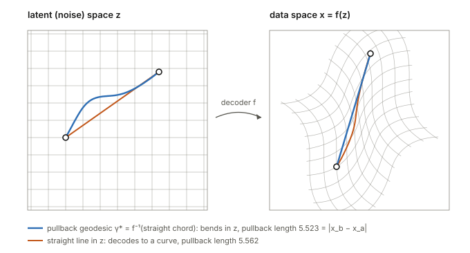
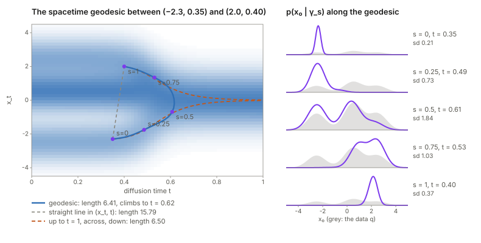
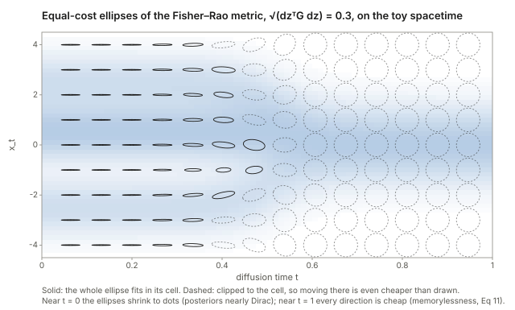
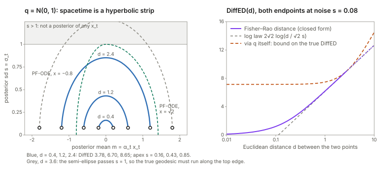
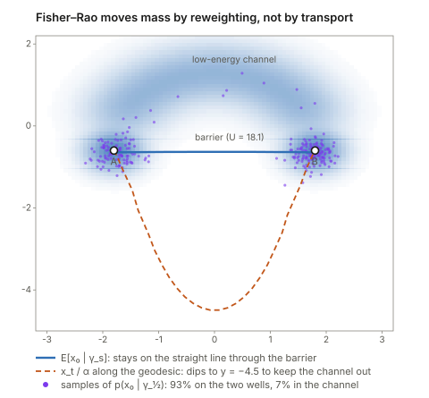

## Links

- **[arXiv:2505.17517](https://arxiv.org/abs/2505.17517)**: the preprint; published at ICLR 2026 as an oral.
  Code: [github.com/Aalto-QuML/spacetime-geometry](https://github.com/Aalto-QuML/spacetime-geometry), the link the
  paper gives. A mirror is at [rafalkarczewski/spacetime-geometry](https://github.com/rafalkarczewski/spacetime-geometry).
- **[Interactive companion](figures/interactive.html)**: five widgets, all computed in the browser from closed-form
  Gaussian-mixture posteriors. (1) A spacetime explorer: drag two points, and watch the geodesic, the posterior along
  it, the metric ellipses and the PF-ODE paths (Figs 1 and 3). (2) The chord identity against the quadratic
  approximation. (3) Gaussian data as the hyperbolic half-plane, with a closed-form DiffED. (4) Pullback versus
  spacetime on a ring of data. (5) Transition paths along a geodesic, with a baseline and an ablation.
- **[Runnable checks](https://github.com/msrepo/theory_inclined_papers_with_annotations/tree/main/papers/2026-karczewski-spacetime-diffusion/code)**:
  `spacetime_checks.py` verifies every proposition and lemma numerically, on the paper's own toy data (App G.1),
  and prints every number quoted below. `make verify` runs it (about 2.5 minutes).
- **[Fisher information](../fisher-information/index.html)**: background for the Fisher–Rao metric used throughout: the Fisher matrix as the
  local shape of the KL divergence, why path lengths do not depend on the parameterisation, and the Gaussians as a
  hyperbolic half-plane whose geodesics widen before they move.
- **[Optimal transport and the Wasserstein distance](../optimal-transport/index.html)**: the other way to put a
  geometry on distributions. The contrast matters in doubt 4: Fisher–Rao *reweights* mass, Wasserstein *moves* it.
- **[The Gram matrix](../gram-matrix/index.html)**: the pullback metric $J^\top J$ of Section 4 is the Gram matrix of
  the decoder's Jacobian columns.
- **[EM and Gaussian mixtures](../expectation-maximization/index.html)** and
  **[the Score Kalman Filter](../2026-iwasaki-score-kalman-filter/index.html)**: two more places in these notes where an
  exponential family and its normaliser $\psi$ do all the work.
- **[Hyperbolic flow matching](../2026-li-hyperbolic-flow-matching/index.html)**: the other hyperbolic geometry in these
  notes. Here it appears unasked, as the Fisher–Rao geometry of Gaussians.

Rafał Karczewski, Markus Heinonen, Alison Pouplin, Søren Hauberg and Vikas Garg, *The Spacetime of Diffusion Models:
An Information Geometry Perspective*, ICLR 2026.

## In one paragraph

A diffusion model turns noise into data. So it is natural to ask what geometry it induces on its latent space: which
noise vectors are "close", and what is the shortest path between two of them? The standard answer in generative
modelling is to **pull back** the Euclidean metric through the decoder: two latents are close if they decode to close
data. The paper first shows that this answer is empty for diffusion. The deterministic decoder (the probability-flow
ODE) is a bijection of $\mathbb R^D$ onto itself, so pullback geodesics always decode to straight lines in data space
(Prop B.1). The paper's alternative uses the *stochastic* decoder. Each noisy point $x_t$ defines a whole distribution
of clean data, the **denoising posterior** $p(x_0\mid x_t)$. Two noisy points are close if their posteriors are close
in KL divergence: this is the **Fisher–Rao metric**. At full noise every posterior equals the data distribution, so
the metric vanishes there. The fix is to use all noise levels at once, the $(D+1)$-dimensional **spacetime**
$z=(x_t,t)$. The key technical fact is that these posteriors form an **exponential family**:
$p(x_0\mid x_t)=q(x_0)\exp(\eta^\top T(x_0)-\psi)$, with $T(x_0)=(x_0,\lVert x_0\rVert^2)$. That makes two things easy.
The metric becomes $G=(\partial\eta/\partial z)^\top(\partial\mu/\partial z)$. And the energy of a discretised curve
becomes a sum of $(\Delta\eta)^\top(\Delta\mu)$ terms. Each of those is *exactly* twice a symmetrised KL, and the
intractable normaliser $\psi$ cancels. The expectation parameter $\mu=(\mathbb E[x_0\mid x_t],\mathbb E[\lVert x_0\rVert^2\mid x_t])$
comes from the denoiser and its divergence (Tweedie's formula), at the cost of one Jacobian-vector product. Geodesics
then cost a few thousand network evaluations. The paper uses them to define a **Diffusion Edit Distance** (DiffED)
between images, and to generate **transition paths** between molecular states.

**The short version.** Every identity checks out to numerical precision on the paper's toy data. My checks cover
Prop C.2, Prop C.1, Lemmas D.1–D.3, Corollary C.1, Prop D.1, Tweedie's second moment and Prop B.1. Four
consequences the paper does not spell out, each checked here:

1. The geometry depends only on the data distribution. The noise schedule merely relabels points.
2. For Gaussian data, spacetime *is* the hyperbolic half-plane, so geodesics and DiffED have closed forms. DiffED
   then grows like the *logarithm* of the Euclidean distance at the anchor noise, and it saturates for dissimilar
   pairs.
3. In the paper's own toy, the Fig. 1 geodesic is only 1% shorter than "noise everything, then regenerate".
4. In a transition-path toy, the geodesic moves probability by reweighting the two wells, not through the
   low-energy channel. A straight line with the geodesic's noise schedule gives *better* paths than the geodesic
   itself.

## Background, from the ground up

This section builds the five ideas the paper assumes. Each one starts with a small example before the notation.
Skip whatever is familiar.

### Diffusion in one page: noising, denoising, and Tweedie's formula

**The forward process.** Take a clean data point $x_0$ (an image, flattened into a vector in $\mathbb R^D$). Shrink
it, then add Gaussian noise:

$$
x_t=\alpha_t x_0+\sigma_t\,\varepsilon,\qquad \varepsilon\sim\mathcal N(0,I).
$$

Equivalently, $p(x_t\mid x_0)=\mathcal N(x_t;\,\alpha_t x_0,\,\sigma_t^2 I)$: the paper's Eq 1. At $t=0$, $\alpha=1$ and $\sigma=0$: the data itself. As $t$ grows, $\alpha_t$ falls and
$\sigma_t$ rises. The single number that matters is the **signal-to-noise ratio**
$\mathrm{SNR}(t)=\alpha_t^2/\sigma_t^2$. Two common choices of $(\alpha_t,\sigma_t)$ are *variance preserving* (VP),
with $\alpha_t^2+\sigma_t^2=1$, and *variance exploding* (VE), with $\alpha_t=1$. The paper's toy uses VP with log-SNR
falling linearly from $+10$ at $t=0$ to $-10$ at $t=1$. At $t=1$ the SNR is $e^{-10}\approx4.5\times10^{-5}$:
essentially pure noise.

**The denoising posterior.** Given a noisy $x_t$, which clean $x_0$ could it have come from? Bayes' rule:

$$
p(x_0\mid x_t)=\frac{q(x_0)\,p(x_t\mid x_0)}{p_t(x_t)},\qquad p_t(x_t)=\int q(x_0)\,p(x_t\mid x_0)\,dx_0 .
$$

Here $q$ is the data distribution and $p_t$ the distribution of noisy samples at time $t$. In words, the posterior is
**the data distribution, reweighted by a Gaussian bump** centred at $x_t/\alpha_t$ with width $\sigma_t/\alpha_t$. With
little noise the bump is narrow and the posterior is nearly a point. With a lot of noise the bump is so wide that the
posterior is nearly $q$ itself. A worked example: if $q=\mathcal N(0,1)$ and the schedule is VP, then
$p(x_0\mid x_t)=\mathcal N(\alpha_t x_t,\ \sigma_t^2)$. At $\alpha=0.8$, $\sigma=0.6$ and $x_t=1$, the posterior is
$\mathcal N(0.8,\,0.36)$.

**Tweedie's formula.** A diffusion model is trained to output the posterior *mean*, the "denoiser"
$\hat x_0(x_t)\approx\mathbb E[x_0\mid x_t]$. That mean is tied to the score $\nabla\log p_t$ by

$$
\mathbb E[x_0\mid x_t]=\frac{x_t+\sigma_t^2\nabla\log p_t(x_t)}{\alpha_t}\qquad\text{(Eq 58)}.
$$

The one-line reason: differentiate $\log p_t(x_t)=\log\int q(x_0)\,\mathcal N(x_t;\alpha_tx_0,\sigma_t^2I)\,dx_0$. You
get the posterior average of $\nabla_{x_t}\log\mathcal N=-(x_t-\alpha_tx_0)/\sigma_t^2$, and rearranging gives Eq 58.
The paper also needs the posterior *second* moment. That comes one derivative later, in the Tweedie section below.

**Two decoders.** Sampling runs the process backwards, and there are two ways to do it with the same marginals $p_t$.
The **reverse SDE** (Eq 2) injects fresh noise at every step, so a given $x_T$ can end at many different $x_0$. It is
a *stochastic* decoder, and the distribution it lands in, starting from $x_t$, is exactly $p(x_0\mid x_t)$. The
**probability-flow ODE** (PF-ODE, Eq 3) has no noise: each $x_T$ maps to one $x_0(x_T)$, a deterministic,
invertible decoder. The paper's two geometries (Section 3) correspond to these two decoders.

### Riemannian metrics, lengths and geodesics

A **metric tensor** is a ruler that changes from place to place. At each point $z$ it is a symmetric positive
(semi)definite matrix $G(z)$, and the length of a small step $dz$ is $\sqrt{dz^\top G(z)\,dz}$. With $G=I$ this is the
ordinary Euclidean length. With $G=\mathrm{diag}(1,4)$ a vertical step costs twice a horizontal one of the same size.
A **curve** $\gamma:[0,1]\to\mathcal Z$ has

$$
\text{length } \ell(\gamma)=\int_0^1\sqrt{\dot\gamma_s^\top G(\gamma_s)\dot\gamma_s}\,ds,
\qquad\text{energy } \mathcal E(\gamma)=\frac12\int_0^1\dot\gamma_s^\top G(\gamma_s)\dot\gamma_s\,ds,
$$

where $\dot\gamma_s=d\gamma_s/ds$ is the velocity (Eq 4). A **geodesic** is a shortest curve between two fixed endpoints.
Why minimise energy rather than length? By Cauchy–Schwarz, $\ell^2\le2\mathcal E$, with equality exactly when the speed
$\lVert\dot\gamma_s\rVert_G$ is constant. So an energy minimiser is a length minimiser that moves at constant speed.
The energy is also smoother to optimise, with no square root. A check on this appears below: the computed geodesics
have $2\mathcal E/\ell^2=1.0000$.

**Discretised.** Put $N$ points $z_0,\dots,z_{N-1}$ on the curve, $ds=1/(N-1)$ apart. Then

$$
\mathcal E\approx\frac12\sum_n\frac{(z_{n+1}-z_n)^\top G\,(z_{n+1}-z_n)}{ds}=\frac{N-1}{2}\sum_n\Delta z_n^\top G\,\Delta z_n .
$$

The factor $N-1$ is $1/ds$: squared velocities are $(\Delta z/ds)^2$, and the integral contributes one $ds$.

### The pullback metric

Suppose a decoder $f$ maps latents $z$ to data $x=f(z)$, and you want to measure latent steps by how much they
change the output. A small step $dz$ changes the output by $J\,dz$, where $J=\partial f/\partial z$ is the Jacobian.
Its squared Euclidean length is $dz^\top(J^\top J)\,dz$. So the **pullback metric** is $G_{\rm PB}=J^\top J$ (Eq 5).
It is the [Gram matrix](../gram-matrix/index.html) of the Jacobian's columns. Pullback lengths are just Euclidean
lengths of the decoded curve.

### The Fisher–Rao metric, from KL divergence

Now suppose each latent $z$ defines a *distribution* $p(\cdot\mid z)$ rather than a point. The natural way to compare
two distributions is the Kullback–Leibler divergence,
$\mathrm{KL}(p\Vert p')=\mathbb E_{p}[\log p-\log p']$: the average extra surprise if you expected $p'$ but got $p$.
For a small step,

$$
\mathrm{KL}\big(p(\cdot\mid z)\,\Vert\,p(\cdot\mid z+dz)\big)=\tfrac12\,dz^\top G_{\rm IG}(z)\,dz+o(\lVert dz\rVert^2),
$$

$$
G_{\rm IG}(z)=\mathbb E\big[\nabla_z\log p\;\nabla_z\log p^\top\big]
$$

(Eqs 7–8). $G_{\rm IG}$ is the **Fisher information**, and used as a metric it is the **Fisher–Rao metric**. Why is
there no first-order term? The KL is zero at $dz=0$ and never negative, so $dz=0$ is a minimum and the gradient
vanishes there.

A worked example that the notes return to: the family $\mathcal N(m,s^2)$, parametrised by mean $m$ and standard
deviation $s$. The scores are $\partial_m\log p=(x-m)/s^2$ and $\partial_s\log p=-1/s+(x-m)^2/s^3$. Write
$u=(x-m)/s\sim\mathcal N(0,1)$. Then $\mathbb E[(\partial_m)^2]=1/s^2$, $\mathbb E[(\partial_s)^2]=\mathbb E[(u^2-1)^2]/s^2=2/s^2$,
and the cross term is $\mathbb E[u(u^2-1)]/s^2=0$. So

$$
ds^2_{\rm FR}=\frac{dm^2+2\,ds^2}{s^2}.
$$

Dividing by $s^2$ is the whole story. Moving the mean by $0.1$ matters a lot when $s=0.01$, and hardly at all when
$s=10$. This is (up to a factor $\sqrt2$ on $m$) the metric of the **hyperbolic half-plane**.

### Exponential families

An **exponential family** is a set of distributions of the form

$$
p(x\mid\eta)=h(x)\exp\big(\eta^\top T(x)-\psi(\eta)\big),\qquad \psi(\eta)=\log\int h(x)\,e^{\eta^\top T(x)}\,dx .
$$

Here $T(x)$ is the **sufficient statistic** (a fixed vector of functions of $x$), $\eta$ the **natural parameter**,
$h$ the **base measure**, and $\psi$ the **log-partition function**, the normaliser that makes the density integrate
to one (Definition C.1). A worked example: a Gaussian of known variance 1 is
$\propto e^{-x^2/2}\,e^{mx}$, with $h(x)=e^{-x^2/2}/\sqrt{2\pi}$, $T(x)=x$, $\eta=m$ and $\psi=m^2/2$. Three facts do all
the work in this paper. Each one comes from differentiating $\psi$ under the integral.

1. $\nabla_\eta\psi=\mathbb E[T]=:\mu$, the **expectation parameter**. (In the example, $\psi'=m=\mathbb E[x]$.)
2. $\nabla^2_\eta\psi=\mathrm{Cov}[T]\succeq0$, so $\psi$ is convex. (In the example, $\psi''=1=\mathrm{Var}[x]$.)
3. The score in $\eta$ is $T(x)-\mu$, so the Fisher information in $\eta$-coordinates is
   $\mathrm{Cov}[T]=\nabla^2\psi$.

A useful mental picture is a **tilt**. Start from $h$ and multiply it by $e^{\eta^\top T}$. Each $\eta$ leans the
distribution a different way, and $\psi$ just renormalises.

## The spine of the argument

<figure><figcaption><b>How the paper's pieces connect.</b> The green boxes are exact identities and the orange ones the geometry the paper rejects. None of the green steps needs the intractable $\psi$ or $\log p_t$.</figcaption></figure>

1. **Pullback geometry is flat** (Section 4, App B). Under a bijective decoder, pullback distance equals Euclidean
   distance in data space, and geodesics decode to straight lines.
2. **Use the stochastic decoder instead** (Section 3). Each latent defines a posterior over data, and the Fisher–Rao
   metric compares posteriors.
3. **Latent $x_T$ carries no information** (Eq 11), so extend the latent space to **spacetime** $z=(x_t,t)$ (Eq 12).
4. **The posteriors are an exponential family** in $z$ (Prop C.2), with $T(x_0)=(x_0,\lVert x_0\rVert^2)$.
5. **So the metric is $J_\eta^\top J_\mu$** (Prop C.1), and a chord $(\Delta\eta)^\top(\Delta\mu)$ is exactly
   $2\,\mathrm{KL}^{S}$ (Lemma D.2). That gives a $\psi$-free energy for discretised curves (Eq 14, Prop 5.1).
6. **$\mu$ comes from the denoiser**: its output and its divergence (Eq 16), via one JVP per point.
7. **Applications**: minimise the energy over a spline to get geodesics (Alg 3), whose length is DiffED (Alg 4). Run
   annealed Langevin along a geodesic for transition paths (Alg 1), optionally with penalties (Eqs 21–23).

## Setup and notation

| Symbol | Meaning |
|---|---|
| $q(x_0)$ | data distribution on $\mathbb R^D$ |
| $\alpha_t,\ \sigma_t$ | signal scale and noise scale; $\mathrm{SNR}(t)=\alpha_t^2/\sigma_t^2$, $\lambda_t=\log\mathrm{SNR}(t)$ |
| $p_t(x_t)$ | marginal density of noisy samples at time $t$ |
| $p(x_0\mid x_t)$ | denoising posterior; the stochastic decoder's output distribution |
| $\hat x_0(x_t)$ | the trained denoiser, $\approx\mathbb E[x_0\mid x_t]$ |
| $z=(x_t,t)$ | a point of spacetime, $\mathbb R^D\times(0,T]$ |
| $T(x_0)=(x_0,\lVert x_0\rVert^2)$ | sufficient statistic, in $\mathbb R^{D+1}$ |
| $\eta(z)=\big(\tfrac{\alpha_t}{\sigma_t^2}x_t,\ -\tfrac{\alpha_t^2}{2\sigma_t^2}\big)$ | natural parameter, in $\mathbb R^{D+1}$ |
| $\mu(z)=\big(\mathbb E[x_0\mid x_t],\ \mathbb E[\lVert x_0\rVert^2\mid x_t]\big)$ | expectation parameter |
| $\psi(z)$ | log-partition function; contains the intractable $\log p_t(x_t)$ |
| $G_{\rm PB},\ G_{\rm IG}$ | pullback and Fisher–Rao (information-geometric) metrics |
| $J_\eta=\partial\eta/\partial z,\ J_\mu=\partial\mu/\partial z$ | $(D+1)\times(D+1)$ Jacobians |
| $\mathrm{KL}^S(p\Vert p')$ | symmetrised KL, $\tfrac12(\mathrm{KL}(p\Vert p')+\mathrm{KL}(p'\Vert p))$ |
| $\gamma_s,\ s\in[0,1]$ | a curve in spacetime; $\gamma_n=\gamma(s_n)$ its $N$ discretisation points |
| $t_{\min}$ | the small noise level at which clean data are anchored |

**The toy used throughout these notes** is the paper's own (App G.1): $q=0.275\,\mathcal N(-2.5,0.75^2)+0.45\,\mathcal N(0.5,0.75^2)+0.275\,\mathcal N(2.5,0.75^2)$,
VP, with $\lambda_t=10-20t$ on $t\in[0,1]$. For a Gaussian-mixture $q$, every posterior is again a Gaussian mixture.
Each component $\mathcal N(c_k,v_k)$, tilted by $e^{a x+bx^2}$, becomes a Gaussian with precision $1/v_k-2b$. So
$\eta$, $\mu$, $\psi$, every KL and the exact metric are available in closed form, with no network. The code checks
each against brute-force Bayes on a 40,001-point grid.

## Section 3 and App B: pullback geometry collapses

**Lemma B.1** is the chain rule. With $G_{\rm PB}=J^\top J$ and $J=\partial f/\partial z$ evaluated on the curve,

$$
\lVert\dot\gamma_s\rVert^2_{G_{\rm PB}}=\dot\gamma_s^\top J^\top J\,\dot\gamma_s=(J\dot\gamma_s)^\top(J\dot\gamma_s)
=\Big\lVert\tfrac{d}{ds}f(\gamma_s)\Big\rVert^2 .
$$

So the pullback length of a latent curve is the Euclidean length of its decoded image. That is Eq 9, and Eqs 24–25.

**Proposition B.1** (pullback geodesics decode to straight lines). Let $f$ be a bijection between latent and data
space, with $x^a=f(z^a)$ and $x^b=f(z^b)$. For any latent curve $\bar\gamma$ from $z^a$ to $z^b$,

$$
\ell_{\rm PB}(\bar\gamma)=\int_0^1\Big\lVert\tfrac{d}{ds}f(\bar\gamma_s)\Big\rVert ds
\;\ge\;\Big\lVert\int_0^1\tfrac{d}{ds}f(\bar\gamma_s)\,ds\Big\rVert=\lVert x^b-x^a\rVert .
$$

The inequality is the triangle inequality for integrals: the length of a sum of vectors is at most the sum of their
lengths. The bound is attained by $\gamma^\star_s=f^{-1}\big((1-s)x^a+sx^b\big)$, the preimage of the straight chord.
It exists because $f$ is onto, so the whole chord lies in the image. Hence the pullback distance is exactly the
Euclidean distance between the decoded points, and every geodesic decodes to a straight segment (Eq 10).

A shorter way to see the same thing: a bijective $f$ makes $(\mathcal Z,G_{\rm PB})$ *isometric* to flat
$(\mathbb R^D,\lVert\cdot\rVert)$. Pulling back a flat metric through a diffeomorphism gives a flat metric, only
written in curvy coordinates. The latent geodesic can look bent, but only because the coordinates are bent.

<figure><figcaption><b>Prop B.1 with an explicit bijective decoder.</b> The pullback geodesic is bent in latent space and straight in data space. Its pullback length is 5.523, exactly $\lVert x^b-x^a\rVert$. The straight latent segment decodes to a curve of length 5.562 (check 13).</figcaption></figure>

**What it does and does not say.** The proof is correct and short. The conclusion is about a *bijective* decoder
from $\mathbb R^D$ to $\mathbb R^D$. For such a decoder, pullback geometry cannot tell the data manifold from empty
space: the chord between two points on a ring cuts straight through the hole (widget 4). In a VAE the decoder maps a
low-dimensional latent into a higher-dimensional data space, and the pullback is genuinely curved. The paper makes this
contrast itself (App B, last paragraph). Two things are worth adding. First, the collapse is a statement about which
decoder you pull back through, not about pullback geometry as such (doubt 2). Second, "pullback distance = Euclidean
distance" makes the pullback geometry the *Euclidean baseline*, which is how DiffED should be compared (doubt 1).

## Section 5: the information geometry of the denoising posterior

### Why $x_T$ alone fails: memorylessness (Eq 11)

At the end of the forward process, $x_T$ is (nearly) independent of $x_0$. So $p(x_0\mid x_T)\approx q(x_0)$ for
*every* $x_T$. The posterior does not change when $x_T$ changes, so $\nabla_{x_T}\log p(x_0\mid x_T)\approx0$ and
$G_{\rm IG}\approx0$. All noise vectors are at distance zero from each other. On the toy, at $x=1$:

| $t$ | 0.1 | 0.3 | 0.5 | 0.7 | 0.9 | 1.0 |
|---|---|---|---|---|---|---|
| $G_{xx}$ | 2981 | 54.9 | 1.51 | 0.065 | 0.0013 | 0.00018 |

The two posteriors at $x_T=\pm3$ differ by $\mathrm{KL}^S=0.0033$ (check 6). This is not a numerical accident. It is
what "the model forgets where it started" means, in metric form.

### The spacetime (Eq 12) and why it is the natural-parameter space in disguise

The fix is to use *all* noise levels at once, with points $z=(x_t,t)\in\mathbb R^D\times(0,T]$. Each defines one
posterior $p(x_0\mid x_t)$ at its own noise level. Clean data is the limit $t\to0$, where the posterior is a Dirac
spike $\delta_{x_0}$. So a spacetime curve can join two clean points by passing through noisy intermediates.

Here is a remark the paper does not make, but which organises everything that follows. Take the natural parameter
from Prop C.2 below, $\eta(z)=(\alpha_tx_t/\sigma_t^2,\ -\mathrm{SNR}(t)/2)$. It can be inverted: $\mathrm{SNR}=-2\eta_2$,
and $x_t/\alpha_t=-\eta_1/(2\eta_2)$. Whenever $\mathrm{SNR}(t)$ is strictly decreasing, $z\mapsto\eta$ is therefore
one-to-one. Spacetime is the natural-parameter half-space $\{(a,b):b<0\}$ of the family $q(x_0)\,e^{a^\top x_0+b\lVert x_0\rVert^2}$,
restricted to the SNR range of the schedule. Three consequences:

- **The geometry is schedule-free.** The Fisher–Rao metric belongs to the family of distributions, not to its
  coordinates. VP, VE, cosine and EDM schedules give different $(x_t,t)$ labels for the *same* posteriors, so the same
  lengths and the same geodesics. Check 7 takes a curve in VP coordinates and maps it to VE coordinates by
  $x^{\rm VE}=x^{\rm VP}/\alpha^{\rm VP}$ at matched SNR. The two $\eta$ curves agree to $10^{-14}$, and the energies
  are identical (30.457090).
- **A good chart is $(\hat x,\lambda)=(x_t/\alpha_t,\ \log\mathrm{SNR})$.** Here $\hat x$ is where the noisy point
  "says" $x_0$ is, and $\lambda$ is how sure it is: $\eta=(e^\lambda\hat x,\ -e^\lambda/2)$. The geodesic solver in the
  code and in the widgets works in this chart.
- **The metric is a Hessian.** In $\eta$-coordinates, $G=\nabla^2_\eta\psi=\mathrm{Cov}[T(x_0)]$. This is the
  "Hessian geometry" of the paper's related work (Lobashev et al.), here in closed form.

### Proposition C.2: the denoising posteriors are an exponential family

Start from Bayes, and expand the Gaussian likelihood's exponent:

$$
-\frac{\lVert x_t-\alpha_tx_0\rVert^2}{2\sigma_t^2}
=-\frac{\lVert x_t\rVert^2}{2\sigma_t^2}+\frac{\alpha_t}{\sigma_t^2}x_t^\top x_0-\frac{\alpha_t^2}{2\sigma_t^2}\lVert x_0\rVert^2 .
$$

Only the last two terms involve $x_0$, and they are *linear* in $x_0$ and in $\lVert x_0\rVert^2$. Collect everything
else into one normaliser:

$$
p(x_0\mid x_t)=q(x_0)\exp\Big(\underbrace{\tfrac{\alpha_t}{\sigma_t^2}x_t}_{\eta_1}{}^{\!\top}x_0\ \underbrace{-\tfrac{\alpha_t^2}{2\sigma_t^2}}_{\eta_2}\lVert x_0\rVert^2
-\underbrace{\Big[\log p_t(x_t)+\tfrac D2\log(2\pi\sigma_t^2)+\tfrac{\lVert x_t\rVert^2}{2\sigma_t^2}\Big]}_{\psi(x_t,t)}\Big).
$$

This is Eq 51, with $h=q$ (Eq 54), $T=(x_0,\lVert x_0\rVert^2)$ (Eq 53), $\eta$ (Eq 52) and $\psi$ (Eq 55). The proof is
three lines of algebra, and the idea is the "tilt" of the background section. The posterior is $q$, tilted by a linear
term (which shifts it toward $x_t/\alpha_t$) and by a quadratic term (which narrows it by the SNR). $\psi$ contains
$\log p_t(x_t)$, which no diffusion model gives you. Everything below is arranged so that $\psi$ is never needed.

Check 1 compares $q(x_0)e^{\eta^\top T-\psi}$, with $\psi$ from Eq 55, against brute-force Bayes at five spacetime
points. They agree to a relative error below $10^{-12}$.

### The expectation parameter from the denoiser (Eqs 16, 56–58)

The first half of $\mu$ is the denoiser's output, $\mathbb E[x_0\mid x_t]$. The second half is $\mathbb E[\lVert x_0\rVert^2\mid x_t]$.
Split it into the spread around the mean plus the squared mean:

$$
\mathbb E\big[\lVert x_0\rVert^2\mid x_t\big]=\mathrm{tr}\,\mathrm{Cov}[x_0\mid x_t]+\big\lVert\mathbb E[x_0\mid x_t]\big\rVert^2 .
$$

The covariance is where the exponential family helps. By fact 2 of the background, $\partial\mu/\partial\eta=\mathrm{Cov}[T]$,
whose top-left block is $\partial\,\mathbb E[x_0]/\partial\eta_1=\mathrm{Cov}[x_0]$. And $\eta_1=(\alpha_t/\sigma_t^2)x_t$,
so by the chain rule

$$
\frac{\partial\,\mathbb E[x_0\mid x_t]}{\partial x_t}=\frac{\alpha_t}{\sigma_t^2}\,\mathrm{Cov}[x_0\mid x_t]
\quad\Longrightarrow\quad
\mathrm{Cov}[x_0\mid x_t]=\frac{\sigma_t^2}{\alpha_t}\,\frac{\partial\hat x_0}{\partial x_t}.
$$

This is the second-order Tweedie formula. Differentiating Eq 58 once more gives the paper's form of it,
$\frac{\sigma_t^2}{\alpha_t^2}(I+\sigma_t^2\nabla^2\log p_t)$ (Eq 56). Take the trace:

$$
\mathbb E\big[\lVert x_0\rVert^2\mid x_t\big]=\big\lVert\hat x_0(x_t)\big\rVert^2+\frac{\sigma_t^2}{\alpha_t}\,\mathrm{div}_{x_t}\hat x_0(x_t)
\qquad\text{(Eqs 16, 57)}.
$$

The paper derives it through Eq 56. The exponential-family route above is the same computation, and makes clear why
there is exactly one extra derivative.

**Hutchinson's trick.** The divergence $\mathrm{div}\,\hat x_0=\mathrm{tr}(\partial\hat x_0/\partial x_t)$ is the trace
of a $D\times D$ Jacobian, too large to form for images. For a random vector $\varepsilon$ with independent $\pm1$
entries, $\mathbb E[\varepsilon^\top A\varepsilon]=\sum_{ij}A_{ij}\mathbb E[\varepsilon_i\varepsilon_j]=\mathrm{tr}A$.
And $A\varepsilon$ is one Jacobian-vector product, which forward-mode autodiff computes at about the cost of one
network call. App I gives the eight-line JAX version. On the toy, Eq 16 matches the grid's $\mathbb E[x_0^2\mid x_t]$ to
six digits (check 2).

### Proposition C.1: the Fisher–Rao metric is $J_\eta^\top J_\mu$

**The claim.** For an exponential family with parameters $z$,
$G_{\rm IG}(z)=(\partial\eta/\partial z)^\top(\partial\mu/\partial z)$ (Eq 32).

**The two-line proof.** In $\eta$-coordinates the Fisher information is $\mathrm{Cov}[T]$ (fact 3). A metric changes
coordinates by the Jacobian on both sides, so $G(z)=J_\eta^\top\,\mathrm{Cov}[T]\,J_\eta$. By fact 2,
$\mu=\nabla\psi$, so $J_\mu=\nabla^2\psi\,J_\eta=\mathrm{Cov}[T]\,J_\eta$. Substituting gives $G=J_\eta^\top J_\mu$.
The same line shows that $G$ is symmetric and positive semi-definite. Neither is obvious from $J_\eta^\top J_\mu$ as
written.

**The paper's proof, step by step** (Eqs 33–41). It avoids naming $\mathrm{Cov}[T]$ and goes through the score
directly.

1. The score in $z$ is $\nabla_z\log p=J_\eta^\top T(x)-\nabla_z\psi$ (Eq 33).
2. **The score has mean zero** (Eq 34): $\mathbb E[\nabla\log p]=\int\nabla p=\nabla\int p=\nabla1=0$. Taking
   expectations in step 1 gives $\nabla_z\psi=J_\eta^\top\mu$ (Eq 35).
3. **The information identity** (Eqs 36–37). Differentiate $\mathbb E[\partial_j\log p]=0$ once more with respect to
   $z^i$. The product rule gives two terms,
   $0=\mathbb E[\partial_i\log p\,\partial_j\log p]+\mathbb E[\partial_{ij}\log p]$. So the Fisher information
   (outer product of scores) equals minus the expected Hessian of $\log p$.
4. The Hessian of $\log p$ is $\sum_k\partial_{ij}\eta^k\,T^k-\partial_{ij}\psi$ (Eq 38), so
   $G_{ij}=\partial_{ij}\psi-\sum_k\partial_{ij}\eta^k\mu^k$ (Eq 39).
5. Differentiate Eq 35 to get $\partial_{ij}\psi=\sum_k\partial_{ij}\eta^k\mu^k+\sum_k\partial_i\eta^k\,\partial_j\mu^k$
   (Eq 40). The first sum cancels the one in step 4, leaving $G_{ij}=\sum_k\partial_i\eta^k\partial_j\mu^k$.

One typo: Eq 41 writes $\partial\eta^k/\partial z^j\cdot\partial\mu^k/\partial z^i$, with $i$ and $j$ swapped relative
to Eq 40. It is harmless, because $G$ is symmetric. Check 3 computes $G$ three ways at three points: as
$J_\eta^\top J_\mu$, as $J_\eta^\top\mathrm{Cov}[T]J_\eta$, and as the brute-force $\mathbb E[\text{score}\,\text{score}^\top]$.
All three agree to every printed digit. For example, at $(-2.3,0.35)$ they all give
$\left(\begin{smallmatrix}19.42&-25.29\\-25.29&202.95\end{smallmatrix}\right)$.

### Lemmas D.1–D.2: the chord is exactly twice the symmetrised KL

**Lemma D.1** writes the KL between two members of the family with nothing but $\eta$, $\mu$, $\psi$:

$$
\mathrm{KL}(z_1\Vert z_2)=\mathbb E_{z_1}\big[(\eta_1-\eta_2)^\top T-\psi_1+\psi_2\big]=(\eta_1-\eta_2)^\top\mu_1-\psi_1+\psi_2 .
$$

The base measure $h$ cancels inside the log-ratio, and $T$ averages to $\mu_1$. (This is the Bregman divergence of the
convex function $\psi$.) **Lemma D.2** adds the reverse direction, and the $\psi$'s cancel in pairs:

$$
\mathrm{KL}(z_1\Vert z_2)+\mathrm{KL}(z_2\Vert z_1)=(\eta_1-\eta_2)^\top(\mu_1-\mu_2)=2\,\mathrm{KL}^S(z_1\Vert z_2).
$$

This is **exact for any two points**, not a small-step approximation. It is the reason the whole method works.
$\mathrm{KL}(z_1\Vert z_2)$ needs $\psi$, which contains $\log p_t$. The symmetrised version needs only $\eta$, which is
known in closed form, and $\mu$, which comes from the denoiser. It also shows the chord is never negative, because
$\nabla\psi$ of a convex $\psi$ is a monotone map.

Check 4 has four pairs, from neighbours to opposite modes. The chord equals the sum of the two KLs to every printed
digit, and matches brute-force grid KLs. The local quadratic $\Delta z^\top G(z_1)\Delta z$ is off by 12% for a small
step, 29% within a mode and 26% across modes. Widget 2 makes the same comparison interactively.

### Corollary C.1 and Proposition 5.1: the energy of a discretised curve

Substitute $G=J_\eta^\top J_\mu$ into the energy. The velocity sandwiches collapse by the chain rule:

$$
\dot\gamma^\top J_\eta^\top J_\mu\dot\gamma=\big(\tfrac{d}{ds}\eta(\gamma_s)\big)^\top\big(\tfrac{d}{ds}\mu(\gamma_s)\big),
$$

so

$$
\mathcal E(\gamma)=\tfrac12\int_0^1\dot\eta^\top\dot\mu\,ds\approx\frac{N-1}{2}\sum_{n=0}^{N-2}(\eta_{n+1}-\eta_n)^\top(\mu_{n+1}-\mu_n)
$$

(Eqs 42, 44 and 14). The length is $\sum_n\sqrt{(\Delta\eta_n)^\top(\Delta\mu_n)}$ (Eqs 43, 45). By Lemma D.2, Eq 14 is
$(N-1)\sum_n\mathrm{KL}^S(\gamma_n\Vert\gamma_{n+1})$: the familiar local-KL energy of Eq 13, but with the
*symmetrised* KL. That version happens to be computable, and it is also more accurate. A symmetrised KL has no
odd-order terms about the chord's midpoint, so each chord is a midpoint-rule estimate, with error $O(1/N^2)$ instead of
$O(1/N)$. Check 5 takes the straight segment of the Fig. 1 endpoints. Eq 14 gives 129.32, 127.03, 126.968 and 126.9646
at $N=4$, 16, 64 and 256, against 126.9644 from quadrature. The error falls about 16-fold for each 4-fold increase in
$N$.

**Cost.** Each point needs $\eta$ (free) and $\mu$ (one denoiser call plus one JVP), so $N$ JVPs per energy. The
paper's "simulation-free" means no SDE or ODE has to be solved. It does not mean cheap. Optimising the curve
backpropagates through those JVPs, and the paper reports about 6 minutes per image pair on an A100 (200 steps, 16
points, EDM2-XXL). Aligning one PF-ODE trajectory took 2 hours.

### What a geodesic looks like

Algorithm 3 parametrises $\gamma$ as a cubic spline in $(x_t,t)$, embeds the two endpoints at $t_{\min}$, and runs
gradient descent on Eq 14. The code and the widgets instead move the $N$ points directly. They use the exact gradient
of Eq 14, preconditioned by the metric itself, which is a natural-gradient step that behaves like repeated neighbour
averaging. The resulting curves are the same.

<figure><figcaption><b>The paper's Fig. 1, recomputed.</b> Left: the geodesic between the Fig. 1 endpoints, with length 6.41, climbs to $t=0.617$. The straight segment in $(x_t,t)$ has length 15.79, and "up to $t=1$, across, down" has 6.50. Right: along the geodesic the posterior first spreads over all modes (forget), then concentrates on the target mode (denoise). Its standard deviation goes 0.21 → 1.84 → 0.37.</figcaption></figure>

The computed geodesic matches the paper's Fig. 1: it bows out to $t\approx0.62$ and returns. Three numbers from check
8 are worth keeping:

- **Constant speed.** $2\mathcal E/\ell^2=1.0000$ at $N=32$ and 64. The optimiser has found a genuine geodesic, not
  just a short curve.
- **Almost all of the length is spent near the endpoints.** The path that climbs straight to $t=1$, crosses there and
  descends has length 6.499. The geodesic has 6.414. The crossing at $t=1$ costs 0.000, because of memorylessness. So
  between these two points the geodesic is essentially "forget everything, then regenerate", with a small shortcut.
  For two points in the *same* mode, $(-2.3,0.35)$ to $(-1.9,0.35)$, the geodesic is 1.67 against 7.46 via complete
  noise, a ratio of 0.22. Here the geometry is doing real work.
- **The metric ellipses** (figure below, and widget 1) show why. Near $t=0$ every step is expensive; near $t=1$ none
  is.

<figure><figcaption><b>Equal-cost ellipses $\{dz: dz^\top G\,dz=0.3^2\}$.</b> The metric falls by seven orders of magnitude from $t=0.1$ to $t=1$ ($G_{xx}$ from 2981 to 0.00018 at $x=1$). The geodesic's shape follows from this: go where steps are cheap, but not further than needed.</figcaption></figure>

### A worked example the paper does not give: Gaussian data make spacetime hyperbolic

Take $q=\mathcal N(0,I_D)$ and the VP schedule. The posterior is $p(x_0\mid x_t)=\mathcal N(\alpha_tx_t,\ \sigma_t^2I)$.
So a spacetime point is simply a Gaussian with mean $m=\alpha_tx_t$ and standard deviation $s=\sigma_t<1$, and
spacetime is the family of isotropic Gaussians with $s<1$. Its Fisher–Rao metric generalises the 1-D computation
above:

$$
ds^2_{\rm FR}=\frac{\lVert dm\rVert^2+2D\,ds^2}{s^2}.
$$

In 1-D, set $u=m/\sqrt2$. The metric becomes $2(du^2+ds^2)/s^2$: the Poincaré half-plane, with lengths scaled by
$\sqrt2$. Everything about that half-plane is classical.

- **Geodesics are semicircles** centred on $s=0$ in $(u,s)$, so semi-ellipses $(m-m_0)^2/2+s^2=R^2$ in $(m,s)$.
- **The distance has a closed form**,
  $d=\sqrt2\,\mathrm{arccosh}\big(1+\frac{(\Delta m)^2/2+(\Delta s)^2}{2s_1s_2}\big)$.
- **The strip $s<1$ is not the whole plane.** Points with $s\ge1$ are not the posterior of any $(x_t,t)$. The top edge
  is (in the limit) the prior $q$ and its tilts. A geodesic whose semi-ellipse would cross $s=1$ must instead run along
  the edge.

Check 9 runs the generic geodesic solver on this family and recovers the closed form to four digits. For instance,
$\mathcal N(-1,0.1^2)\to\mathcal N(1,0.1^2)$ gives 7.514 numerically against 7.507 in closed form, with apex $s$
0.713 against 0.714. The formula then turns the paper's qualitative statements into numbers.

1. **DiffED is logarithmic in distance.** Two points a distance $d$ apart, both anchored at noise $s$, are at
   $\sqrt2\,\mathrm{arccosh}(1+d^2/4s^2)\approx2\sqrt2\log\frac{d}{\sqrt2 s}$ once $d\gg s$. At $s=0.01$ and
   $d=0.1$, 0.3, 1.0 this gives 5.59, 8.65 and 12.05, against the log law's 5.53, 8.64 and 12.05.
2. **The anchor sets an additive constant.** Halving $s$ adds $2\sqrt2\log2\approx1.96$ to every DiffED in this
   regime. In $D$ dimensions the prefactor is $2\sqrt{2D}$.
3. **"Less similar endpoints give noisier midpoints"** (the paper's Fig. 4) becomes "the apex sits at $s\approx
   d/(2\sqrt2)$". In $D$ dimensions it is $\delta/(2\sqrt2)$, where $\delta$ is the root-mean-square per-coordinate
   difference.
4. **The PF-ODE path is a geodesic only by coincidence.** For standard Gaussian data under VP, the PF-ODE keeps $x_t$
   constant. The drift is $-\tfrac12\beta x-\tfrac12\beta\nabla\log p_t=-\tfrac12\beta x+\tfrac12\beta x=0$. Its path
   in $(m,s)$ is therefore $m^2/x^2+s^2=1$: an ellipse with semi-axes $(|x|,1)$. A geodesic ellipse needs semi-axes in
   the ratio $\sqrt2:1$, so the PF-ODE path has geodesic shape only when $|x|=\sqrt2$ (check 10).

<figure><figcaption><b>Gaussian data: spacetime is a hyperbolic strip.</b> Left: geodesics are semi-ellipses whose apex grows with the separation. Right: DiffED is a logarithm of Euclidean distance until the geodesic reaches the fully-noised edge, after which it is bounded by the path via $q$ itself (orange). Widget 3 lets you move both endpoints and the anchor.</figcaption></figure>

This is only a Gaussian, but it is the right local model. Wherever $q$ is smooth on the scale of the posterior's
width, the posterior is approximately Gaussian, and the geometry is approximately this one. The multimodal toy departs
from it exactly where the posterior straddles several modes.

## Section 6: experiments

### Sampling trajectories (Fig. 3)

The paper compares PF-ODE trajectories with geodesics between the same endpoints. It finds the geodesics slightly
straighter early on (high $t$) in the toy, and hardly distinguishable on ImageNet-512. Check 8 repeats the toy
comparison with trajectories from $x_T\in\{1,0,-1\}$ down to $t_{\min}=0.1$. Both curves are resampled at 65 points
equally spaced in Fisher–Rao arc length, so that their lengths are comparable. The geodesics are shorter by only
0.13%, 0.06% and 0.19%. So the PF-ODE is very nearly a geodesic here, which is the paper's finding. The traces differ
slightly: at $t=0.5$ the geodesic sits at 1.85 where the PF-ODE sits at 1.77. The geodesic commits a little earlier,
the paper's "generates information slightly earlier". One subtlety deserves a sentence. Because of memorylessness, the
starting point $(x_T,T)$ is essentially the prior $q$ whatever $x_T$ is. So the geodesic really runs *from the prior*
to the end point, not from a particular noise vector.

### Diffusion Edit Distance (Section 6.2, Eq 17)

$\mathrm{DiffED}(x^a,x^b)$ is the length of the spacetime geodesic between the two clean points. In practice it is
anchored at $t_{\min}>0$: the images are encoded with the PF-ODE up to $t_{\min}$, which corresponds to
$\log\mathrm{SNR}=2$ for EDM2. At $t=0$ the posteriors are Dirac spikes, and the Fisher–Rao distance to a Dirac is
infinite. The reading "add just enough noise to forget what is specific to $x^a$, then denoise toward $x^b$" is
exactly what the posterior panels above show. On 200 ImageNet pairs, DiffED correlates with LPIPS at about $-7\%$ and
with SSIM at 53%. Fig. 8 orders pairs by DiffED, LPIPS, SSIM and Euclidean distance, qualitatively.

### Transition path sampling (Section 6.3, Eqs 18–20, Alg 1)

For a Boltzmann density $q\propto e^{-U}$, the posterior is again Boltzmann (Eqs 19 and 60):

$$
p(x_0\mid x_t)\propto\exp\Big(-U(x_0)-\tfrac12\mathrm{SNR}(t)\big\lVert x_0-x_t/\alpha_t\big\rVert^2\Big).
$$

This is the tilt once more, now visibly: the energy plus a quadratic pull toward $x_t/\alpha_t$, of stiffness SNR.
Algorithm 1 discretises the geodesic between two low-energy states. At each point it runs $K$ Langevin steps on that
point's posterior energy, carrying the chain from one point to the next. The chain is the transition path. On alanine
dipeptide (Table 1) the method reaches MaxEnergy $37.36\pm0.60$ against a lower bound of 36.42. The best MCMC baseline
reaches $42.54\pm7.42$ with 1.29B evaluations, where the method needs 16M (plus 16M one-off evaluations to train the
diffusion model). Doob's Lagrangian collapses to near-identical paths. App H documents, commendably, that two
published baselines could not be reproduced.

### Constrained paths (Section 6.4, Eqs 21–23) and Prop D.1

The penalised problem adds $\lambda\int_0^1h(\gamma_s)\,ds$ to the energy. "Low variance" uses
$h=\max(-\log\mathrm{SNR},\rho)$, which penalises noise above a threshold. "Region avoidance" needs the KL from a
fixed posterior $p(\cdot\mid z^\star)$ to the moving one. That KL again involves $\psi$, and **Prop D.1** again
removes it. Lemma D.3 differentiates Lemma D.1. The $\psi$ terms cancel by Eq 35, leaving

$$
\nabla_{z_2}\mathrm{KL}(z_1\Vert z_2)=J_\eta(z_2)^\top\big(\mu(z_2)-\mu(z_1)\big).
$$

By the fundamental theorem of calculus and the chain rule,

$$
\mathrm{KL}(z^\star\Vert\gamma_s)=\mathrm{KL}(z^\star\Vert\gamma_0)+\int_0^s\big(\tfrac{d}{du}\eta(\gamma_u)\big)^\top\big(\mu(\gamma_u)-\mu(z^\star)\big)\,du .
$$

The unknown starting value is a constant $C$ (Eq 22). Check 11 confirms the integral form against the direct KL to
five digits. One practical wrinkle: because $C$ is unknown, the threshold in Eq 23 ($\rho_2=-4350$ in App G.3) is an
offset relative to an unknown constant, so it can only be tuned by hand.

## Questions and doubts

### 1. DiffED is close to a compressed Euclidean distance, and it saturates

The Gaussian case shows what DiffED measures where the data density is smooth: $2\sqrt{2D}\log(\text{distance}/\text{anchor noise})$
plus a constant. That is a monotone function of the Euclidean distance between the anchored points. A monotone
function leaves a *ranking* unchanged, so in that regime DiffED ranks pairs exactly as Euclidean distance does. The
geometry departs from this only where posteriors straddle several modes. But then, as the toy shows, the geodesic is
within 1% of "noise to $t=T$, then denoise". Its length is then $d(x^a,q)+d(q,x^b)$, a sum of two terms that each
depend on one endpoint only. So DiffED has two regimes: roughly log-Euclidean for similar pairs, and roughly additive
for dissimilar ones.

The paper reports correlations with LPIPS ($-7\%$) and SSIM (53%), but not with Euclidean distance. That is the
comparison that would reveal how much DiffED adds, and pullback geometry is exactly Euclidean distance (Prop B.1).
The experiment I would want is the rank correlation of DiffED with $\lVert x^a_{t_{\min}}-x^b_{t_{\min}}\rVert$, and with
$d(x^a,q)+d(q,x^b)$, over the same 200 pairs.

### 2. The pullback "collapse" is about the decoder, not about pullback geometry

Prop B.1 is correct, and it rules out one specific decoder: the full-dimensional PF-ODE map. Two caveats limit how far
it reaches. First, the paper's image experiments run in the latent space of a VAE (EDM2 is a latent diffusion model),
and the VAE decoder from latents to pixels is not bijective onto pixel space. Pulling back through the composite
"PF-ODE, then VAE decoder" gives a curved geometry, which the paper does not consider. Second, pullback geodesics
decoding to straight lines is a problem only if straight lines are bad. For a comparison with DiffED, the resulting
Euclidean distance is the natural baseline, not a straw man.

### 3. Anchoring: DiffED is a distance between noisy posteriors, not between data

The Fisher–Rao distance to a Dirac spike is infinite, so DiffED between clean points does not exist. It is always
anchored at $t_{\min}$, and it depends on that choice through the $-2\sqrt{2D}\log s$ term. The image experiments
anchor at $\log\mathrm{SNR}=2$, where EDM2's noise level is $\sigma=0.37$ against a data scale of 0.5. That is a lot of
noise: the anchors are posteriors that are already quite broad. Anchors are also computed by running the PF-ODE up to
$t_{\min}$, so part of DiffED is the PF-ODE's own encoding. Both choices are sensible. They mean "DiffED between two
images" is shorthand for "between two noisy posteriors, at this anchor", and results should be reported with it.

### 4. Fisher–Rao geodesics reweight; they do not transport

This is the doubt I find most interesting, and the toy makes it concrete (check 14, widget 5, figure below). Two wells
$A,B$ sit at $y=-0.6$, with a barrier between them ($U=18.1$) and a low channel over the top. The flood-fill lower bound
on the barrier is 2.68. The spacetime geodesic between the two wells does **not** route its posteriors through the
channel. The posterior mean runs straight along the barrier: its highest $y$ is $-0.600$. At the midpoint the
posterior puts 93% of its mass on the two wells and 7% in the channel. To keep the channel *out*, the geodesic moves
$x_t/\alpha$ down to $y=-4.49$, far below both wells.

This is Fisher–Rao geometry working as designed. KL-type distances have no notion of *where* mass is, only *how much*.
The cheapest way to turn "all mass at A" into "all mass at B" is to fade one mode out and the other in, through the
two-mode mixture. That is the opposite of [Wasserstein geometry](../optimal-transport/index.html), where mass must be
moved through space. So the transition paths in Algorithm 1 are routed by the Langevin *dynamics*, not by the
geodesic. Once the posterior is broad and bimodal, a chain stranded in A must get to B by the lowest route it can find.

<figure><figcaption><b>What a Fisher–Rao geodesic does between two wells.</b> The posterior mean (blue) goes straight, and the posterior at the midpoint (purple) is the two wells reweighted. The geodesic even pushes $x_t/\alpha$ (orange) down to $y=-4.5$ to avoid the channel.</figcaption></figure>

An ablation isolates the two ingredients. With $K=120$ Langevin steps per point and 32 paths each:

| path for annealed Langevin | MaxEnergy | crossing $x=0$ in the channel |
|---|---|---|
| spacetime geodesic | $11.91\pm2.31$ | 44% |
| straight line, fixed $\log\mathrm{SNR}=4$ | $19.41\pm0.87$ | 0% |
| straight line with the geodesic's noise schedule | $\mathbf{8.55\pm2.10}$ | **94%** |

The noise schedule does the work: rising to $\mathrm{SNR}^{-1/2}\approx1.3$ and coming back down. The geodesic's
spatial shape makes things *worse* here. Its dip away from the channel drags chains toward the barrier. This is one
toy, and the alanine landscape may reward the geodesic's shape more. But Table 1 has no such ablation, and it is
cheap: rerun Algorithm 1 with the geodesic's $t$-profile on a straight line. Without it, the improvement cannot be
attributed to the geometry rather than to annealing.

A related point: MaxEnergy scores the set of states a chain visits. The chain runs on a *moving* target, so a path's
timing carries no kinetic meaning, unlike the path-integral methods it is compared with. That is a fine choice for
finding low barriers, but it is a different object from a reactive trajectory.

### 5. With a learned denoiser, the exponential family is assumed, not guaranteed

Everything exact above holds for the true posterior. A trained $\hat x_0$ is only an approximation. Its Jacobian need
not be symmetric, even though the true one is a covariance times $\alpha/\sigma^2$. The implied covariance
$\frac{\sigma^2}{\alpha}\partial\hat x_0/\partial x_t$ need not be positive semi-definite. And a chord
$(\Delta\eta)^\top(\Delta\mu)$ can then come out negative, which breaks $\sqrt{\cdot}$ in Eq 45. Hutchinson's noise
itself turns out to be harmless. Check 12 uses $D=256$ Gaussian data with an exact linear denoiser. The energy is
unbiased, as it must be: it is linear in $\mu$, and $\eta$ is known exactly. The length (a sum of square roots) is
biased by only $-0.09\%$ with one probe on a curve between two samples. On a curve that only changes the noise level,
the bias is $-0.30\%$, with 1.6% of chords negative. The unquantified part is the model's own error. A simple
diagnostic would be to report the fraction of negative chords, and the asymmetry of the denoiser Jacobian, along
optimised curves.

### 6. Smaller points

- **Eq 13 versus Eq 14.** Eq 13 is the local-KL energy with a one-directional KL. Eq 14 is the same with the
  symmetrised KL, and it is computable *because* of the symmetry. It is also more accurate: $O(1/N^2)$ rather than
  $O(1/N)$ (check 5). Stating this would make Prop 5.1 less "informal" than its label suggests.
- **The index swap in Eq 41** noted above. Harmless.
- **Figure 3's "geodesics are straighter".** In the toy the length difference is at most 0.2%. The visible gap in
  $x_t$ at mid-$t$ is real but small.
- **The metric at $t\to0$.** It blows up like $\mathrm{SNR}$, which is why every endpoint needs $t_{\min}>0$ (Section
  8 says so). The optimiser's step sizes must cope with metric entries that range over seven orders of magnitude.

### What would settle it

- Report DiffED's rank correlation with Euclidean distance between the anchors, and with $d(x^a,q)+d(q,x^b)$.
- Report DiffED at two or three values of $t_{\min}$.
- For transition paths, add the ablation "straight line, geodesic noise schedule" and a "noise to a fixed level and
  back" schedule to Table 1.
- Report the fraction of negative chords along optimised curves with the learned denoiser.

## Takeaways

- **The central identity is worth remembering.** For any exponential family, $(\eta_1-\eta_2)^\top(\mu_1-\mu_2)$ is
  *exactly* the sum of the two KL divergences, and the normaliser cancels. So a Fisher–Rao energy can be estimated
  from natural and expectation parameters alone, even when $\psi$ is intractable.
- **Diffusion posteriors are always an exponential family**, with base measure $q$ and statistic
  $(x_0,\lVert x_0\rVert^2)$, for any data distribution. The denoiser gives $\mu$: the mean directly, and the second
  moment via its divergence. Tweedie's formula is the bridge.
- **Spacetime is the natural-parameter space.** The geometry depends on $q$ alone, and the noise schedule only
  relabels points. The chart $(x_t/\alpha_t,\ \log\mathrm{SNR})$ is schedule-free.
- **For Gaussian data, spacetime is the hyperbolic plane.** This gives closed-form geodesics and a closed-form DiffED,
  logarithmic in the Euclidean distance at the anchor noise. It is the right local model wherever $q$ is smooth.
- **Pullback geometry through a bijection is Euclidean geometry in disguise.** This is correct and useful to know, but
  it makes Euclidean distance the baseline, not a failure mode.
- **Fisher–Rao moves probability by reweighting.** Geodesics between separated modes fade one out and the other in.
  For transition paths, the useful ingredient in the toy is the noise schedule the geodesic implies, not its route.

---

*Notes written 2026-09-29. Every number in these notes comes from `code/spacetime_checks.py`. The paper's own numbers
(Table 1, the correlations, the timings) are quoted from the arXiv version.*
