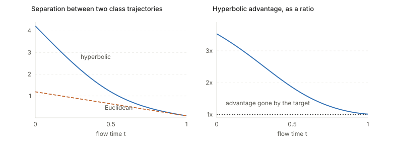

## Links

- **[arXiv:2602.20479](https://arxiv.org/abs/2602.20479)** — preprint. `make fetch` pulls the
  PDF from here.
- **[Runnable code](https://github.com/msrepo/theory_inclined_papers_with_annotations/blob/main/papers/2026-li-hyperbolic-flow-matching/code/lorentz.py)** — the Lorentz
  primitives of Section 3.1, verified to machine precision, plus a quantitative test of the
  paper's geometric claim. `make verify` runs it.

## In one paragraph

CLIP few-shot adaptation usually applies a **one-step** correction: an adapter or prompt shifts
visual features toward text prototypes in a single forward pass. FMA instead treats it as
**continuous transport** — learn a velocity field carrying image features to their class's text
region and integrate, giving multi-step iterative rectification. Li et al. argue those
Euclidean paths **collide**, because flat geometry has only polynomial volume growth and there
is not enough room. Their fix reformulates the transport on the **Lorentz manifold**, whose
exponential volume growth gives space to separate: text prototypes are anchored near the origin
as semantic roots, images pushed to the boundary as leaves, and the flow is supervised
step-wise with a contrastive "guardrail" on each intermediate state. A diameter-based stopping
rule halts transport before features crowd into the origin.

## The spine of the argument

1. Euclidean flow matching suffers **path entanglement** — trajectories from different classes
   intersect and get diverted by dense neighbours.
2. Hyperbolic space has exponentially more room at radius $R$, so put the flow there.
3. **Centripetal alignment** (§3.2) imposes a text-root / image-leaf hierarchy via an entailment
   cone loss, turning arbitrary transport into ordered inward flow.
4. **Path-decoupled objective** (§3.3) supervises the predicted *next state* rather than the
   velocity, which allows a contrastive term on intermediate states — the "semantic guardrail".
5. **Diameter-based stopping** (§3.4) terminates before the crowded origin.

## Setup and notation

| Symbol | Meaning |
|---|---|
| $\mathbb{L}^{n,\kappa}$ | Lorentz model, learnable curvature $-\kappa$ ($\kappa$ initialised to 1) |
| $\langle x,y\rangle_L$ | $-x_0y_0 + \langle\tilde x,\tilde y\rangle_E$; points satisfy $\langle x,x\rangle_L = -1/\kappa$ |
| $x_0$, $x_1$ | source (image feature, leaf) and target (text prototype, root) |
| $\alpha_{txt} < \alpha_{img}$ | learnable norm scalars placing text near origin, images near boundary |
| $\omega(x_1)$ | entailment cone half-aperture, $\arcsin(2H/\lVert x_1\rVert_L)$, $H = 0.1$ |
| $\delta$ | flow step size |
| $\Pi_{T_zL}$ | orthogonal projection onto the tangent space at $z$ |
| $d_{txt}$ | semantic diameter, $\max_{i,j} d_L(x_1^i, x_1^j)$ |
| $\phi(N)$ | stopping scale, $0.5\log_{10}(N)$ for $N$ classes |
| $\lambda$ | weight on the inter-class decoupling loss (0.1) |

### The primitives (§3.1)

$$
d_L(x,y) = \tfrac{1}{\sqrt\kappa}\operatorname{arcosh}(-\kappa\langle x,y\rangle_L),
\qquad \Pi_{T_zL}(x) = x + \kappa\langle z,x\rangle_L\, z
$$

$$
\log^\kappa_z(x) = \frac{\operatorname{arccosh}(-\kappa\langle z,x\rangle_L)}{\sqrt{\langle z,x\rangle_L^2 - 1/\kappa^2}}\,\Pi_{T_zL}(x),
\qquad \exp^\kappa_z(u) = \cosh(\lVert u\rVert)z + \sinh(\lVert u\rVert)\tfrac{u}{\lVert u\rVert}
$$

`code/lorentz.py` checks all of these to machine precision, including that their geodesic
$x_t = \exp_{x_0}(t\log_{x_0}(x_1))$ is **constant speed**:
$d_L(x_0,x_t)/d_L(x_0,x_1) = t$ exactly.

## Component 1 — centripetal hyperbolic alignment (§3.2)

Two learnable scalars $\alpha_{txt} < \alpha_{img}$ rescale Euclidean feature norms before the
$\exp_0$ projection, placing text near the origin and images near the boundary. Blunt, but it
establishes the hierarchy.

The **entailment cone loss**, inherited from MERU (Desai et al.):

$$
\mathcal{L}_{entail} = \max\big(0,\; \pi - \angle 0x_1x_0 - \omega(x_1)\big),
\qquad \omega(x_1) = \arcsin\!\big(2H/\lVert x_1\rVert_L\big)
$$

The exterior angle at the prototype, between its radial axis and the direction to the image,
must lie inside a cone of half-aperture $\omega$. The crucial detail is that **$\omega$
shrinks as $\lVert x_1\rVert$ grows** — prototypes near the origin get wide cones and can
entail many leaves, distant points get narrow ones. That is what makes the hierarchy
self-consistent rather than an arbitrary radial ordering. A hyperbolic contrastive loss
(ordinary InfoNCE with $-d_L/\tau$ replacing cosine) supplies class discrimination.

## Component 2 — path-decoupled flows (§3.3)

Ground truth is the geodesic from each image to **its own** prototype, which is what makes the
conditional paths independent across classes. The network predicts an ambient vector, projected
to the tangent space and pushed back to the manifold:

$$
v_t = \Pi_{T_{x_t}L}\big(F_\theta(x_t,t)\big), \qquad \hat x_{t+\delta} = \exp^\kappa_{x_t}(\delta v_t)
$$

Then two losses, **both on the predicted next state**:

$$
\mathcal{L}_{step} = \big\lVert d_L(\hat x_{t+\delta}, x_{t+\delta})\big\rVert^2,
\qquad
\mathcal{L}_{icd} = -\log\frac{\exp(-d_L(\hat x_{t+\delta}, x_1^c)/\tau)}{\sum_k \exp(-d_L(\hat x_{t+\delta}, x_1^k)/\tau)}
$$

**This is the substantive departure from flow matching.** Standard Riemannian FM regresses the
*velocity* against a conditional target. Supervising the resulting *state* in geodesic distance
is what allows a contrastive term to be attached to an actual manifold point — impossible with
velocity supervision. Their Table 10 shows the two design choices interact rather than being
independently good:

| | velocity supervision | step-wise | gain |
|---|---|---|---|
| FMA (Euclidean) | 77.7 | 77.8 | **+0.1** |
| HFM (hyperbolic) | 78.8 | 79.8 | **+1.0** |

Worth naming plainly: with fixed $\delta$ and state supervision this is closer to a **learned
discrete transport map or consistency model** than to flow matching. No marginal-preserving
property is claimed or used. "Flow matching" is doing loose duty in the title.

## Component 3 — diameter-based stopping (§3.4), and why it is load-bearing

$$
\min_c d_L(\hat x_{t^*}, x_1^c) \le \phi(N)\cdot d_{txt},
\qquad \hat y = \arg\min_c \sum_{t\le t^*} d_L(\hat x_t, x_1^c)
$$

Presented as an efficiency measure. It is more than that, and `code/lorentz.py` shows why.
Taking two class trajectories with sources at hyperbolic radius 4 and targets near the origin,
holding the angular separation fixed so the geometries are compared like for like:

<figure>

<figcaption>The hyperbolic advantage is <b>3.5×</b> at the source, <b>1.86×</b> at the midpoint
and <b>1.01×</b> at the target. Hyperbolic geometry buys room at the boundary and through the
middle of the flow, and essentially none near the origin where the prototypes are crowded.</figcaption>
</figure>

So the stopping rule is **structurally required**, not an add-on: the geometry stops helping
exactly where the flow is heading. The paper presents it as a third independent contribution;
it is better understood as a necessary patch for a limitation of the first two. That reframing
makes the design coherent rather than arbitrary.

The capacity argument itself does check out — in a 2-D slice, a sphere of radius $R$ holds
$2\pi\sinh R$ points at unit spacing versus $2\pi R$, which at $R = 8$ is **186×** more
room. The issue is not whether hyperbolic space is roomy; it is that the roominess is at the
boundary, and the target is not.

## Results

Ablation on difficult benchmarks, 16-shot: baseline **76.1** → +CHA **77.7** → +PO **79.2** →
+DS **79.8**.

The control experiment I would have demanded, and they ran it (Table 9): **FMA\*** applies
HFM's exact objectives in Euclidean space.

| | avg |
|---|---|
| FMA (Euclidean, velocity) | 77.7 |
| FMA\* (Euclidean, HFM's objectives) | 77.9 |
| HFM (hyperbolic) | **79.8** |

Objectives alone: +0.2. Geometry: +1.9. Clean attribution, and it supports their claim.

It is also plug-and-play across PEFT methods, with the largest gains on the *weakest* baselines
(CoCoOp +8.2, CLIP-Adapter +8.7, CLIP-LoRA +3.7) — consistent with "it fixes entanglement",
since weaker adapters leave more entanglement to fix. Overhead is modest: +0.06M parameters,
+27% train step, +19% inference.

## Questions and doubts

- **Direct evidence for the headline claim is thin.** Their own Trajectory Entanglement Rate
  moves 30.2% → 27.8%, just 2.4 points against a 2.1-point accuracy gain. TER is introduced only
  in the appendix and is their own proxy. The FMA\* control is good; the entanglement story
  itself is supported mostly indirectly.
- **"Isolated geodesic corridors" is an overstatement.** The figure above shows the corridors
  merging as the target is approached. They are real at the boundary and fictional near the
  origin.
- **$\phi(N) = 0.5\log_{10}(N)$ is unmotivated and odd.** For $N \ge 100$ it exceeds 1, so
  the stopping radius is *larger than the entire semantic diameter*; for ImageNet
  ($N = 1000$, $\phi = 1.5$) the flow should terminate almost immediately. No ablation on
  this function, and it is the one hyperparameter doing task-dependent work.
- **Most of the gain is the prior, not the flow.** Their Table 6 shows the entailment loss alone
  reaching 79.0 of the final 79.8. The centripetal hierarchy — imposed by two hand-set scalars —
  carries most of the benefit, with the learned transport adding under a point.
- **$\kappa$ is learnable, initialised at 1.0, and never reported.** What it converges to is
  the most direct test of whether hyperbolicity is being used at all; if $\kappa \to 0$ the
  space flattens and the thesis collapses. Its absence is conspicuous.
- **No theory**, despite a thoroughly geometric framing. Every claim is empirical.

## Takeaways

- The geometric intuition is sound and quantifiable: exponential volume growth really does give
  exponentially more room to separate trajectories, and the capacity calculation is a one-liner
  worth carrying.
- That room is **at the boundary**. Any method transporting *into* a crowded region recovers the
  Euclidean situation near its target, which is a general lesson for hyperbolic transport
  methods, not a quirk of this paper.
- Supervising the predicted state instead of the velocity is the genuinely transferable
  modelling idea, and it is what makes an intermediate-state contrastive term possible.
- Running the Euclidean control with matched objectives is the right way to attribute a gain to
  geometry, and more papers making geometric claims should do it.
