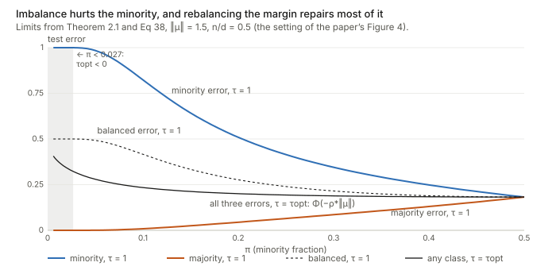
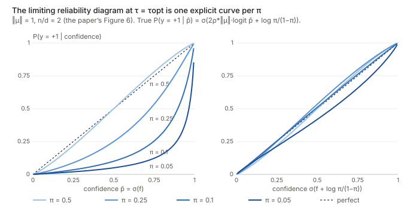

## Links

- **[arXiv:2502.11323](https://arxiv.org/abs/2502.11323)**: the preprint (the ICLR 2026 camera-ready is
  the version read here). Code: [jlyu55/Imbalanced_Classification](https://github.com/jlyu55/Imbalanced_Classification).
- **[Interactive companion](figures/interactive.html)**: six widgets. (1) Training vs test logits for any
  $(\pi,\lVert\mu\rVert,\delta,\tau)$, solved from the paper's equations, with a real hard-margin SVM you
  can train in the browser on top. (2) The separability threshold $\delta^*(0)$. (3) Errors against $\tau$
  and $\pi$. (4) The three high-imbalance phases. (5) The proximal map of the non-separable case. (6) The
  limiting reliability curve.
- **[Runnable checks](https://github.com/msrepo/theory_inclined_papers_with_annotations/tree/main/papers/2026-lyu-imbalanced-overfitting/code)**:
  `asymptotics.py` solves the limiting equations and checks the algebra. `svm_simulation.py` trains
  exact hard-margin SVMs (dual SMO) and compares them with the limits. `make_figures.py` draws the three
  figures below. Every number in these notes is printed by one of them. `make verify` runs all three.
- **[Optimal transport](../optimal-transport/index.html)**: the pushforward $T_\sharp$ and the Wasserstein
  distance $W_2$ used to state the convergence of logit distributions.
- **[The Price of Robustness](../2026-vonberg-price-of-robustness/index.html)**: another paper in this
  collection that reads overfitting through margins.

## In one paragraph

Train a linear classifier $f(x)=\langle x,\beta\rangle+\beta_0$ on $n$ points in $d$ dimensions, with $n$ and
$d$ of the same order. The paper asks what the **logits** $f(x_i)$ look like on the training set compared
with a fresh test set. It works in the simplest model where the question can be answered exactly: two
Gaussian classes $x\mid y\sim\mathcal N(y\mu,I_d)$, a minority fraction $\pi<\tfrac12$, and the max-margin
classifier (the hard-margin SVM, which is also where logistic regression's gradient descent ends up on
separable data). The answer (Theorem 2.1) is clean. On test data the signed logit $y f(x)$ is a Gaussian
$\mathcal N(\rho^*\lVert\mu\rVert+y\beta_0^*,1)$. On training data it is **the same Gaussian with everything
below the margin $\kappa^*$ moved onto $\kappa^*$**: $\max\{\kappa^*,\ \text{that Gaussian}\}$. The three
numbers $(\rho^*,\beta_0^*,\kappa^*)$ solve a small variational problem. Its core is a budget: the $d$
"free" directions can move the $n$ training logits by a mean square of at most $1/\delta$, where
$\delta=n/d$. The fit spends that budget on lifting every training point up to the margin, which is exactly
a truncation. The intercept comes out negative, so the minority's test Gaussian sits closer to the boundary.
Its truncated mass is therefore larger (61% vs 18% in the paper's Figure 1 setting), and so is its test
error (25% vs 3%). A per-point identity makes this sharp: the average lift of a minority point is exactly
$(1-\pi)/\pi$ times that of a majority point. The rest of the paper follows from the same equations. It
gives the optimal margin-rebalancing ratio $\tau^{\rm opt}$ in closed form and three phases when $\pi\to0$
with $d$. It also gives a limiting calibration error, and it covers the non-separable case, where the
truncation becomes a proximal shrinkage. I checked everything numerically, and the theory matches finite
SVMs closely. Two things need care. First, in the paper's own calibration experiments $\tau^{\rm opt}$ is
*negative*, outside the proven range. Second, the growth of miscalibration with imbalance is almost entirely
the prior log-odds that rebalancing deliberately throws away. It is not overfitting.

## Background, from the ground up

### Logits, margins, and why "training accuracy 100%" hides the interesting part

A linear classifier predicts $\hat y=+1$ when $f(x)>0$. The number $f(x)$ is the **logit**, and $y f(x)$ (the
logit signed by the true label) is positive exactly when the prediction is right. The size of $y f(x)$ says
by how much. With $\lVert\beta\rVert=1$ it is literally the signed distance from $x$ to the decision
hyperplane. The **margin** of a classifier on the training set is the smallest of these,
$\hat\kappa_n=\min_i y_i f(x_i)$ (Definition 2.1). The max-margin classifier maximises it:

$$
\max_{\beta,\beta_0,\kappa}\ \kappa\quad\text{s.t.}\quad y_i(\langle x_i,\beta\rangle+\beta_0)\ge\kappa\ \ \forall i,\qquad \lVert\beta\rVert_2\le1.
\qquad\text{(Eq 2b)}
$$

If the training data are linearly separable, $\hat\kappa_n>0$ and training accuracy is 100%. In high
dimensions that is typical, and the test accuracy is still imperfect. Accuracy compresses each logit to one
bit, right or wrong. The paper keeps the whole **histogram** of logits, on training points and on test
points, and reads overfitting off the difference.

Why the SVM and not logistic regression? On separable data the logistic loss has no finite minimiser: scaling
$\beta$ up always lowers it. Gradient descent then runs off to infinity, but its *direction*
$\beta^{(t)}/\lVert\beta^{(t)}\rVert$ converges to the max-margin direction (Soudry et al. 2018; App C.2 extends
this to include the intercept, Proposition C.2). So the SVM is what a linear probe trained to convergence
actually is, up to scale.

### Proportional asymptotics

Classical statistics lets $n\to\infty$ with $d$ fixed. Then the fitted $\hat\beta$ converges to the truth,
and training and test logits look alike. Here instead $n,d\to\infty$ with $n/d\to\delta\in(0,\infty)$, the
**aspect ratio**. A small $\delta$ means few samples per dimension. In this limit random quantities like the
cosine $\hat\rho=\langle\hat\beta/\lVert\hat\beta\rVert,\mu/\lVert\mu\rVert\rangle$ do not go to 1. They go to a
deterministic number $\rho^*<1$ that depends on $(\pi,\lVert\mu\rVert,\delta)$. The whole paper computes such
numbers.

### Notation for distributions, in plain words

The paper states its results about distributions. The notation is measure-theoretic, but each piece has a
plain meaning:

- **$\mathrm{Law}(Z)$** is just "the distribution of the random variable $Z$". For example,
  $\mathrm{Law}(Y,\,Y\max\{\kappa,G\})$ is the joint distribution of the pair you get by drawing a label $Y$,
  drawing $G\sim\mathcal N(0,1)$, and computing $Y\max\{\kappa,G\}$.
- **$\delta_a$** (a Dirac mass) is the distribution that puts all its probability on the single point $a$.
  So $\frac1n\sum_i\delta_{(y_i,f(x_i))}$ puts mass $1/n$ on each training pair. It is the training
  histogram, written as a distribution (Eq 3). This is the **ELD**, the empirical logit distribution. The
  **TLD** is $\mathrm{Law}(y_{\rm test},f(x_{\rm test}))$ for a fresh point.
- **$W_2(P,Q)$**, the 2-Wasserstein distance, is the smallest root-mean-square distance you have to move
  the mass of $P$ to turn it into $Q$. For two 1-D samples of equal size, sort both and pair them up; $W_2$
  is the RMS gap between the paired values. "$W_2(\hat\nu_n,\nu_*)\to0$" says the training histogram,
  including its tails, approaches the limit. The [OT page](../optimal-transport/index.html) has pictures.
- **$\xrightarrow{w}$** (weak convergence) says the probabilities of intervals converge. It is weaker than
  $W_2$ and is what one gets for the test logit of a single fresh point.
- **$\xi\in L^2$**: in Eq 5 the unknown is a whole *random variable* $\xi$ with finite second moment. Read it
  as "a rule assigning a number $\xi$ to every possible draw of $(Y,G)$". The optimiser gets to choose that
  rule, subject only to $\mathbb E[\xi^2]\le1/\delta$. It turns out to be a deterministic function of
  $(Y,G)$.
- **$T_\sharp\mu$** (pushforward): the distribution of $T(X)$ when $X\sim\mu$. In Proposition D.2,
  $T_\sharp L^{\rm test}_*=L_*$ says "apply $T(x)=\max\{\kappa^*,x\}$ to a test logit and you get something
  distributed like a training logit".

### Two Gaussian integrals that do all the work

With $G\sim\mathcal N(0,1)$, $\Phi$ its CDF and $\varphi$ its density, define

$$
g_1(t)=\mathbb E[(G+t)_+]=t\,\Phi(t)+\varphi(t),\qquad g_2(t)=\mathbb E[(G+t)_+^2]=(t^2+1)\Phi(t)+t\,\varphi(t).
\qquad\text{(Eq 75)}
$$

Here $a_+=\max\{a,0\}$. If a Gaussian sits $t$ below some level, $g_1(t)$ is the average amount by which it
falls short, counting only the points that fall short. $g_2(t)$ is the mean squared shortfall. Both are
strictly increasing. `asymptotics.py` §1 checks the closed forms against Monte Carlo: for example
$g_1(0)=1/\sqrt{2\pi}=0.3989$ and $g_2(0)=\tfrac12$.

## The spine of the argument

1. **Decompose $\beta$ into signal and free directions.** Write
   $\beta=\rho\,\mu/\lVert\mu\rVert+\sqrt{1-\rho^2}\,\theta$ with $\theta\perp\mu$. The honest part of a
   training logit is $y_i f(x_i)\approx \rho\lVert\mu\rVert+G_i+y_i\beta_0$. The $\theta$ part lives in $d-1$
   noise directions that the classifier can bend towards individual training points.
2. **Gordon's comparison removes the random matrix.** The max-margin problem is a min–max of a bilinear
   form in a Gaussian matrix. The convex Gaussian min–max theorem (CGMT) replaces it by a problem with two
   random vectors, which collapses to three scalars $(\rho,r,\beta_0)$.
3. **The collapsed problem is a budget.** Data are separable at margin $\kappa$ iff
   $\delta\,\mathbb E[(s(Y)\kappa-X)_+^2]\le1-\rho^2$ for some $(\rho,\beta_0)$, where
   $X=\rho\lVert\mu\rVert+G+Y\beta_0$. In words: the mean squared lift needed to bring every point up to the
   margin must fit inside what the free directions can supply. This gives the separability threshold
   $\delta^*(0)$ and the limit margin $\kappa^*$.
4. **Truncation is the cheapest way to spend the budget.** The least-energy lift raises points below
   $\kappa$ exactly to $\kappa$ and leaves the rest alone. A pointwise Pythagorean inequality turns this into
   $W_2$ convergence of the ELD to $\max\{\kappa^*,X\}$.
5. **First-order conditions give everything else in closed form.** $\rho^*$ solves one scalar equation.
   $\beta_0^*<0$ follows at once. $\tau$ moves only the intercept. $\tau^{\rm opt}$, the errors and the
   calibration limits are all explicit.

## Setup and notation

| Symbol | Meaning |
|---|---|
| $\pi=\mathbb P(y=+1)<\tfrac12$ | minority fraction; the minority is labelled $+1$ |
| $x\mid y\sim\mathcal N(y\mu,I_d)$ | the 2-GMM (Eq 1); $\lVert\mu\rVert$ is the signal strength, class centres $\pm\mu$ |
| $\delta=\lim n/d$ | aspect ratio; small $\delta$ = many dimensions per sample |
| $f(x)=\langle x,\beta\rangle+\beta_0$, $\lVert\beta\rVert=1$ | the classifier; $y f(x)$ is the signed distance to the boundary |
| $\hat\rho=\langle\hat\beta,\mu/\lVert\mu\rVert\rangle$ | cosine between the learned and the Bayes direction |
| $\tau>0$, $s(y)=\tau$ if $y=+1$, else 1 | margin ratio: the minority must clear $\tau\kappa$, the majority $\kappa$ (Eq 7) |
| $(Y,G)\sim P_y\times\mathcal N(0,1)$ | a generic label and a standard Gaussian in the limit problems |
| $X=\rho\lVert\mu\rVert+G+Y\beta_0$ | the "honest" signed logit: what $y f(x)$ is on a test point |
| $\xi$ | the overfitting variable: extra lift of a *training* logit from the free directions |
| $\mathrm{Err}_\pm$ | minority / majority test error (Eq 4); $\mathrm{Err}_b$ their average |
| $g_1,g_2$ | $\mathbb E(G+t)_+$, $\mathbb E(G+t)_+^2$ (Eq 75) |
| $\delta^*(\kappa)$ | largest $\delta$ at which margin $\kappa$ is still attainable (Eq 28) |

## Theorem 2.1: the logits, the variational problem, and what it means

### The statement

For $\delta<\delta_c$ the data are separable with high probability. The trained parameters converge,
$(\hat\rho,\hat\beta_0,\hat\kappa)\to(\rho^*,\beta_0^*,\kappa^*)$, where these solve

$$
\max_{\rho\in[-1,1],\,\beta_0,\,\kappa>0,\,\xi\in L^2}\ \kappa\quad\text{s.t.}\quad
\underbrace{\rho\lVert\mu\rVert+G+Y\beta_0}_{X}+\sqrt{1-\rho^2}\,\xi\ \ge\ \kappa\ \ \text{a.s.},\qquad \mathbb E[\xi^2]\le\frac1\delta.
\qquad\text{(Eq 5)}
$$

The errors converge to $\mathrm{Err}_+\to\Phi(-\rho^*\lVert\mu\rVert-\beta_0^*)$ and
$\mathrm{Err}_-\to\Phi(-\rho^*\lVert\mu\rVert+\beta_0^*)$. The logit distributions converge to

$$
\nu_*^{\rm train}=\mathrm{Law}\big(Y,\;Y\max\{\kappa^*,\,X^*\}\big),\qquad
\nu_*^{\rm test}=\mathrm{Law}\big(Y,\;Y X^*\big),\qquad X^*=\rho^*\lVert\mu\rVert+G+Y\beta_0^*.
$$

(The general version, Theorem D.1, has $s(Y)\kappa$ in place of $\kappa$ for the rebalanced SVM.)

### Reading Eq 5 term by term

- **Where $X$ comes from.** Take a fresh point $x=y\mu+z$ with $z\sim\mathcal N(0,I_d)$ independent of
  $\hat\beta$. Then $y f(x)=\langle\mu,\beta\rangle+y\langle z,\beta\rangle+y\beta_0$. The first term is
  $\rho\lVert\mu\rVert$. The second is $\mathcal N(0,1)$, because $\lVert\beta\rVert=1$ and $z$ is isotropic
  (the sign $y$ does not matter). So a test logit is exactly $X$. This one line is the TLD, and it gives the
  test errors: the minority is wrong when $\rho\lVert\mu\rVert+G+\beta_0\le0$, which has probability
  $\Phi(-\rho\lVert\mu\rVert-\beta_0)$.
- **Where $\xi$ comes from.** On a *training* point, $z_i$ is not independent of $\hat\beta$, because
  $\hat\beta$ was chosen after seeing it. The component $\sqrt{1-\rho^2}\,\theta$ in the $d-1$ directions
  orthogonal to $\mu$ carries no signal. What it can do is correlate with the particular noise vectors $z_i$
  and push chosen training logits up. $\sqrt{1-\rho^2}\,\xi$ is that push.
- **Why $\mathbb E[\xi^2]\le1/\delta$.** A heuristic: to raise training point $j$ by $t_j$, add $t_j z_j/d$
  to $\theta$. Since $\langle z_j,z_j\rangle\approx d$, this lifts point $j$ by $t_j$. It moves each other
  point by only $O(t_j/\sqrt d)$ and adds $t_j^2/d$ to $\lVert\theta\rVert^2$. Doing it for all $n$ points
  costs $\sum_j t_j^2/d=\delta\cdot\overline{t^2}$ of squared norm, where $\overline{t^2}$ is the mean
  squared lift. A unit budget of norm therefore buys $\overline{t^2}\lesssim1/\delta$. With few samples per
  dimension (small $\delta$) the budget is large and overfitting is severe; as $\delta\to\infty$ it vanishes.
  (The cross-talk between points is of the same order, and handling it exactly is what Gordon's theorem
  does. The heuristic gets the scaling right, not the constant.)
- **What is being traded.** A larger $\rho$ puts more weight on the signal, raising every $X$ by
  $\rho\lVert\mu\rVert$. But it leaves less norm $\sqrt{1-\rho^2}$ for the free directions, so each unit of
  $\xi$ lifts less. The optimum balances the two.

### Solving the inner problem: the lift is a truncation (Eq 6)

Fix $(\rho,\beta_0,\kappa)$. Which $\xi$ satisfies the constraint with the least energy $\mathbb E\xi^2$? The
constraint is pointwise: $\sqrt{1-\rho^2}\,\xi\ge\kappa-X$. Where $X\ge\kappa$ it asks nothing, so
$\xi=0$ is cheapest. Where $X<\kappa$ it asks for at least $\kappa-X$, and anything more wastes energy. So

$$
\sqrt{1-\rho^2}\,\xi^*=(\kappa-X)_+,\qquad X+\sqrt{1-\rho^2}\,\xi^*=\max\{\kappa,X\}.
\qquad\text{(Eqs 6, 32)}
$$

That is the whole reason the training logits are truncated. It is the least-energy way to put every training
point on the correct side of the margin. The appendix proves it with KKT conditions for the
infinite-dimensional problem (proof of Theorem D.1(b)); the pointwise argument above is the same thing.
Plugging $\xi^*$ back in, the budget constraint becomes

$$
\mathbb E\big[(s(Y)\kappa-X)_+^2\big]\ \le\ \frac{1-\rho^2}{\delta}
\iff H_\kappa(\rho,\beta_0):=\frac{1-\rho^2}{\mathbb E[(s(Y)\kappa-\rho\lVert\mu\rVert-G-Y\beta_0)_+^2]}\ \ge\ \delta,
\qquad\text{(Eqs 28, 33)}
$$

and the limit problem is "maximise $\kappa$ subject to $H_\kappa(\rho,\beta_0)\ge\delta$". Write
$\delta^*(\kappa)=\max_{\rho,\beta_0}H_\kappa$. Margin $\kappa$ is attainable iff $\delta\le\delta^*(\kappa)$.
The data are separable iff $\delta<\delta^*(0)$ (Theorem D.1(a)), and $\kappa^*$ is where
$\delta^*(\kappa^*)=\delta$.

**Sanity check: Cover's theorem.** With no signal ($\mu=0$) and balanced classes, take $\rho=\beta_0=0$:
$\delta^*(0)=1/g_2(0)=2$. That is Cover's classical result that $n$ random points in general position in
$\mathbb R^d$ are separable with random labels up to $n\approx2d$. `asymptotics.py` §2 recovers 2.0000.
Other values: with $\mu=0$ and $\pi=0.15$ the threshold is 3.10. The intercept alone separates more when the
labels are unbalanced. It is 3.70 at $\lVert\mu\rVert=1,\pi=\tfrac12$, and 18.0 at the paper's Figure 1
setting ($\lVert\mu\rVert=1.75,\pi=0.15$), so $\delta=2.5$ there is deep in the separable regime. Widget 2
of the [interactive page](figures/interactive.html#sep) plots $\delta^*(0)$ against $\pi$.

### The closed-form solution (Lemma E.9)

The constraint $F(\rho,\beta_0,\kappa)=\delta\,\mathbb E[(s\kappa-X)_+^2]-(1-\rho^2)\le0$ is convex. At the
optimal $\kappa^*$ the feasible set in $(\rho,\beta_0)$ shrinks to one point. That point minimises $F$, with
minimum value 0. Split the expectation by class, with $m=\lVert\mu\rVert$ and the two **gaps**
$t_+=\tau\kappa-\rho m-\beta_0$ (minority) and $t_-=\kappa-\rho m+\beta_0$ (majority):

$$
F=\pi\delta\,g_2(t_+)+(1-\pi)\delta\,g_2(t_-)+\rho^2-1,\qquad g_2'=2g_1.
$$

The two stationarity conditions and $F=0$ give

$$
\partial_{\beta_0}F=0:\ \ \pi\,g_1(t_+)=(1-\pi)\,g_1(t_-),\qquad
\partial_\rho F=0\ \text{(with the first)}:\ \ g_1(t_+)=\frac{\rho}{2\pi m\delta},\ \ g_1(t_-)=\frac{\rho}{2(1-\pi)m\delta},
\qquad\text{(Eqs 77, 79)}
$$

$$
\pi\delta\,g\Big(\tfrac{\rho}{2\pi m\delta}\Big)+(1-\pi)\delta\,g\Big(\tfrac{\rho}{2(1-\pi)m\delta}\Big)=1-\rho^2,\qquad g=g_2\circ g_1^{-1}.
\qquad\text{(Eq 76a)}
$$

Eq 76a is one equation in $\rho$ alone. Its left side rises from 0 and its right side falls to 0, so it has
exactly one root $\rho^*\in(0,1)$. It does not involve $\tau$. Then $t_\pm=g_1^{-1}(\cdot)$ give $\kappa^*$
and $\beta_0^*$ by two linear equations (76b, 76c). `asymptotics.py` §3 solves this at Figure 1's setting
($\lVert\mu\rVert=1.75$, $\pi=0.15$, $\delta=2.5$):

| | $\rho^*$ | $\beta_0^*$ | $\kappa^*$ | $\mathrm{Err}_+$ | $\mathrm{Err}_-$ | $\mathrm{Err}_b$ |
|---|---|---|---|---|---|---|
| limit | 0.7235 | −0.5960 | 0.9447 | 25.1% | 3.1% | 14.1% |
| SVM, $n=2000$, $d=800$ (3 draws) | 0.735 ± 0.005 | −0.600 ± 0.039 | 0.960 ± 0.020 | 24.7% | 3.0% | |

For scale: the Bayes classifier has 10.5% and 1.2%, and the best balanced error with the true direction is
$\Phi(-\lVert\mu\rVert)=4.0\%$. The budget is spent exactly:
$\mathbb E[(s\kappa^*-X^*)_+^2]=0.19064=(1-\rho^{*2})/\delta$.

### Why the minority suffers: two one-line consequences

**The per-point push.** $g_1(t_\pm)$ is the average lift a point of each class receives (on the event that it
is lifted). The $\beta_0$ condition says

$$
\pi\,g_1(t_+)=(1-\pi)\,g_1(t_-)\qquad\Longleftrightarrow\qquad \frac{g_1(t_+)}{g_1(t_-)}=\frac{1-\pi}{\pi}.
$$

Each class receives the same *total* push. The intercept is chosen so that neither class's margin
constraint is binding harder than the other's. The minority has $\pi/(1-\pi)$ times fewer points to share
it, so each minority point is pushed $(1-\pi)/\pi$ times further. At Figure 1: 0.551 vs 0.097, a ratio of
5.667 = 0.85/0.15 (§4). This is the paper's "common overfitting budget" made exact.

**The intercept is negative.** Subtract 76c from 76b at $\tau=1$:

$$
2\beta_0^*=g_1^{-1}\Big(\tfrac{\rho^*}{2(1-\pi)m\delta}\Big)-g_1^{-1}\Big(\tfrac{\rho^*}{2\pi m\delta}\Big)<0\qquad(\pi<\tfrac12),
$$

because $g_1^{-1}$ is increasing. (At Figure 1: $-1.192$.) So the minority's test centre
$\rho^*m+\beta_0^*=0.67$ sits much closer to the boundary than the majority's $\rho^*m-\beta_0^*=1.86$. The
same margin $\kappa^*$ then truncates 60.8% of the minority and 17.9% of the majority, and the mass below 0
(the test error) is 25.1% against 3.1%.

<figure><figcaption><b>Theorem 2.1 against a real SVM.</b> Bars: the training margins $y_i f(x_i)$ of one hard-margin SVM ($n=3000$, $d=1200$). Curves: the limit. Everything the test Gaussian puts below $\kappa^*$ (shaded) is moved to the spike at $\kappa^*$. Widget 1 of the <a href="figures/interactive.html#eld">interactive page</a> redraws this for any $(\pi,\lVert\mu\rVert,\delta,\tau)$ and trains an SVM in the browser.</figcaption></figure>

The simulated ELD matches the limit well at this modest size. `svm_simulation.py` §2 gives these deciles of
$y_i f(x_i)$:

| quantile | 0.1 | 0.3 | 0.5 | 0.7 | 0.9 |
|---|---|---|---|---|---|
| minority, SVM | 0.958 | 0.958 | 0.958 | 1.094 | 1.896 |
| minority, limit | 0.945 | 0.945 | 0.945 | 1.195 | 1.956 |
| majority, SVM | 0.958 | 1.424 | 1.912 | 2.427 | 3.231 |
| majority, limit | 0.945 | 1.339 | 1.863 | 2.387 | 3.148 |

**The atom is the support vectors.** The point mass at $\kappa^*$ consists of the training points exactly on
the margin. In the SVM these are the support vectors. The limit predicts
$n[\pi\Phi(\kappa^*-\rho^*m-\beta_0^*)+(1-\pi)\Phi(\kappa^*-\rho^*m+\beta_0^*)]=0.244\,n$ of them, which is
0.61 per dimension. That has to be at most 1: a hard-margin SVM in general position has at most $d+1$
support vectors. The simulation has 474 against a predicted 488, with $d+1=801$. The paper does not make this
connection, but it is a nice consistency check on the theory.

### The optimal-transport remark (Proposition D.2)

$T(x)=\max\{\kappa^*,x\}$ is the optimal transport map from $L^{\rm test}_*$ to $L_*$ for any strictly convex
cost. The proof is one line. In 1-D the optimal map between two distributions is always the monotone
rearrangement $F_\nu^{-}\circ F_\mu$ (quantile of the target composed with CDF of the source). Here that
composition equals $\max\{\kappa^*,x\}$. So the statement is true, but it holds for *any* monotone map
between 1-D laws. It adds a name to Eq 6 rather than new information. The more useful fact, used in the
proof below, is a Pythagorean inequality.

## The proof of Theorem 2.1 (Appendix E), step by step

### Step 0: separability as the zero set of a random min–max

Margin $\kappa$ is achievable iff the vector of shortfalls $(\kappa s_y-y\odot X\beta-\beta_0 y)_+$ can be made
zero. Define

$$
\xi_{n,\kappa}=\min_{\lVert\beta\rVert\le1,\ \beta_0}\ \tfrac1{\sqrt d}\big\lVert(\kappa s_y-y\odot X\beta-\beta_0y)_+\big\rVert_2
=\min_{\beta,\beta_0}\ \max_{\lVert\lambda\rVert\le1,\ \lambda\odot y\ge0}\ \tfrac1{\sqrt d}\lambda^\top(\kappa s_y\odot y-X\beta-\beta_0\mathbf 1).
\qquad\text{(Eq 47)}
$$

The second form uses $\lVert a_+\rVert_2=\max_{\lVert\lambda\rVert\le1,\lambda\ge0}\lambda^\top a$ (the best unit
vector to align with $a$ is $a_+/\lVert a_+\rVert$). So $\xi_{n,\kappa}=0$ iff margin $\kappa$ is attainable, and
$\hat\kappa_n=\sup\{\kappa:\xi_{n,\kappa}=0\}$. Only the *sign* of $\xi_{n,\kappa}$ matters. The magnitude
never enters, and that freedom is used in Step 4.

### Step 1: the intercept stays bounded (Lemma E.1)

Gordon's theorem needs compact constraint sets, and $\beta_0$ is unconstrained. On the separable event, pick
one minority and one majority point. The constraints bound $|\beta_0|$ by
$(\tau+1)\kappa+2\lVert\mu\rVert$ plus the largest projections of the noise. Averaging over each class and using
$\lVert Z_\pm\rVert_{\rm op}\approx\sqrt{n_\pm}+\sqrt d$ gives a constant bound $B_0$ with high probability. So
restricting to $|\beta_0|\le B$ changes nothing asymptotically.

### Step 2: Gordon's comparison (Lemma E.2)

Write $x_i=y_i\mu+z_i$ and split $\beta=\rho\,\mu/\lVert\mu\rVert+\theta$ with $\theta\perp\mu$, $\lVert\theta\rVert\le\sqrt{1-\rho^2}$.
The objective becomes $\lambda^\top\mathbf G\theta+(\text{terms in }\rho,\beta_0,y,u)$, where
$\mathbf G\in\mathbb R^{n\times(d-1)}$ has i.i.d. $\mathcal N(0,1)$ entries (the noise orthogonal to $\mu$) and
$u_i=\langle z_i,\mu\rangle/\lVert\mu\rVert$. The random matrix appears only in the bilinear term. The
**CGMT** (Lemma J.1) says that

$$
\min_\theta\max_\lambda\ \lambda^\top\mathbf G\theta+\psi(\theta,\lambda)
\quad\text{and}\quad
\min_\theta\max_\lambda\ \lVert\lambda\rVert\,g^\top\theta+\lVert\theta\rVert\,h^\top\lambda+\psi(\theta,\lambda),
\qquad g\sim\mathcal N(0,I_{d-1}),\ h\sim\mathcal N(0,I_n),
$$

have comparable distributions. The first is below any level at most twice as often as the second. If the
sets are convex and $\psi$ is convex–concave, the same holds for "above", which is what pins down the value.
Why is this plausible? For fixed $(\theta,\lambda)$ both $\lambda^\top\mathbf G\theta$ and
$\lVert\lambda\rVert g^\top\theta+\lVert\theta\rVert h^\top\lambda$ are centred Gaussians. Gordon's inequality
compares the min–max of two Gaussian processes whose covariances are ordered in the right way. The payoff:
an $n\times d$ random matrix is replaced by two random *vectors*, and those can be handled one coordinate at
a time.

### Step 3: collapse to three scalars (Lemma E.3)

Two elementary maximisations finish the reduction. Over $\lambda$:
$\max_{\lVert\lambda\rVert\le1,\lambda\ge0}(a\lVert\lambda\rVert+\lambda^\top b)=(a+\lVert b_+\rVert)_+$. Over the
direction of $\theta$ at fixed length $r$: $\min g^\top\theta=-r\lVert g\rVert$, taking $\theta$ along $-g$.
With $\lVert g\rVert/\sqrt d\to1$, $n/d\to\delta$ and a uniform law of large numbers on the compact set of
$(\rho,r,\beta_0)$,

$$
\xi_{n,\kappa}\ \xrightarrow{p}\ \Big(\min_{\rho^2+r^2\le1,\,r\ge0,\,|\beta_0|\le B}\ -r+\sqrt\delta\,\big\lVert(s(Y)\kappa-\rho\lVert\mu\rVert+\rho G_1+rG_2-\beta_0Y)_+\big\rVert_{L^2}\Big)_+.
$$

The two terms are the budget, visible already. $-r$ is what the free directions supply (their norm), and
$\sqrt\delta\,\lVert(\cdot)_+\rVert$ is what the margin demands.

### Step 4: use all the norm (Lemma E.4)

Only the sign matters, so the objective can be divided by any positive $c$. Scaling $(\rho,r,\beta_0)$ up to
the boundary $\rho^2+r^2=1$ strictly improves a minimiser whose value is $\le0$. So one may set
$r=\sqrt{1-\rho^2}$ and merge $\rho G_1+\sqrt{1-\rho^2}\,G_2=G\sim\mathcal N(0,1)$:

$$
\operatorname{sign}\xi_{n,\kappa}\ \to\ \operatorname{sign}\min_{\rho,\beta_0}\Big(-\sqrt{1-\rho^2}+\sqrt\delta\,\lVert(s(Y)\kappa-\rho\lVert\mu\rVert+G-\beta_0Y)_+\rVert_{L^2}\Big).
\qquad\text{(Eq 51)}
$$

That is $\le0$ iff $\delta\,\mathbb E[(\cdot)_+^2]\le1-\rho^2$ for some $(\rho,\beta_0)$, i.e. iff
$\delta\le\delta^*(\kappa)$.

### Step 5: phase transition and margin (Lemmas E.5, E.6)

$\delta^*(\kappa)$ is continuous and strictly decreasing, so $\kappa\le\kappa^*\iff\mathbb P(\xi_{n,\kappa}=0)\to1$.
At $\kappa=0$ this is Theorem D.1(a). Squeezing $\kappa^*\pm\varepsilon$ gives $\hat\kappa_n\to\kappa^*$.

### Step 6: why the ELD converges to the truncation (Lemma E.7)

This is the step that says more than test accuracy. Let $V$ be a training margin $y_if(x_i)$ drawn at random,
and $\hat V=G+\hat\rho\lVert\mu\rVert+\hat\beta_0Y$ the Gaussian it would be with no overfitting. Two facts:

1. **Projection pursuit** (Montanari & Zhou 2022, Theorem 4.3): the $n$ training projections of the
   orthogonal part cannot be far from a Gaussian sample. There is a coupling with
   $\mathbb E(V-\hat V)^2\le(1-\hat\rho^2)/\delta+\varepsilon$. This is the budget as a theorem.
2. **Separability**: $V\ge\kappa^*-\varepsilon$ for every training point, by Step 5.

Now a **pointwise Pythagorean inequality**. If $V\ge\kappa$, then
$(V-\hat V)^2\ \ge\ (V-\max\{\kappa,\hat V\})^2+(\kappa-\hat V)_+^2$. When $\hat V\ge\kappa$ it is an equality.
Otherwise expand $(V-\kappa+\kappa-\hat V)^2$; the cross term is a product of two non-negative numbers.
Taking expectations,

$$
\mathbb E\big(V-\max\{\kappa,\hat V\}\big)^2\ \le\ \underbrace{\mathbb E(V-\hat V)^2}_{\le\ \text{budget}}\ -\ \underbrace{\mathbb E(\kappa-\hat V)_+^2}_{\text{needed}}.
\qquad\text{(Eq 63)}
$$

At the optimum the needed lift uses up the entire budget (that is what $\delta^*(\kappa^*)=\delta$ says). So
the right side is $o(1)$, and $V\approx\max\{\kappa^*,\hat V\}$ in $L^2$, which is $W_2$ convergence. The
same slack argument, together with strict convexity of $\lVert(\cdot)_+\rVert_{L^2}$ (Lemma E.8), forces
$(\hat\rho,\hat\beta_0)\to(\rho^*,\beta_0^*)$. `asymptotics.py` §9 checks the inequality on a sample. The
geometry: the set $\{V\ge\kappa\}$ is convex in $L^2$, $\max\{\kappa,\hat V\}$ is the projection of $\hat V$
onto it, and any other point of the set is farther from $\hat V$ by at least its distance to the projection.

## Non-separable data: truncation becomes a proximal shrinkage (Theorem D.3)

For $\delta>\delta^*(0)$ no margin exists, the SVM degenerates, and the paper analyses (possibly rebalanced)
logistic regression. The analogue of Eq 5 is

$$
\min_{\rho,\,R\ge0,\,\beta_0,\,\xi}\ \mathbb E\,\ell\big(\rho\lVert\mu\rVert R+RG+Y\beta_0+R\sqrt{1-\rho^2}\,\xi\big)\quad\text{s.t.}\quad\mathbb E\xi^2\le1/\delta.
\qquad\text{(Eq 35, }\tau=1)
$$

Here $R=\lVert\hat\beta\rVert$ is free again. Put a multiplier on the budget and the problem separates
pointwise. For each value $x$ of the honest logit, choose the lift $u$ to minimise $\ell(x+u)+u^2/(2\lambda)$.
The minimiser is $x+u=\operatorname{prox}_{\lambda\ell}(x)$, the **proximal operator**. In words, move $x$
to lower the loss, paying $(t-x)^2/(2\lambda)$ for the distance moved. So a training logit is
$\operatorname{prox}_{\lambda^*\ell}(\text{test logit})$ (Remark D.2), with $\lambda^*$ fixed by the
budget being tight (Eq 36 and a four-equation system).

- Small $\lambda^*$ (large $\delta$, cheap data): moving is expensive, and prox is almost the identity. The
  ELD equals the TLD, as in classical statistics.
- Large $\lambda^*$ ($\delta\downarrow\delta^*(0)$): moving is cheap. Every low logit is lifted to roughly
  the level where $\ell'$ is small, and high logits stay put. This is a smoothed $\max\{\kappa,x\}$.

Widget 5 of the [interactive page](figures/interactive.html#prox) shows the continuum for the logistic loss.
The paper does not solve for $\lambda^*$ in closed form, and neither does the widget: $\lambda$ is a slider.

## Section 3: margin rebalancing

### Proposition C.1: $\tau$ only moves the intercept

This is a deterministic, finite-sample fact with a short proof (Lemma C.3). Fix a direction $\beta$. The
minority's worst margin is $\tau^{-1}(\min_{+}\langle x_i,\beta\rangle+\beta_0)$ and the majority's is
$-(\max_{-}\langle x_i,\beta\rangle+\beta_0)$. The best $\beta_0$ makes them equal, since the minimum of an
increasing and a decreasing linear function peaks where they cross. That gives

$$
\beta_0=-\frac{\tau\max_-\langle x_i,\beta\rangle+\min_+\langle x_i,\beta\rangle}{\tau+1},\qquad
\kappa=\frac{\min_+\langle x_i,\beta\rangle-\max_-\langle x_i,\beta\rangle}{\tau+1}.
$$

The numerator of $\kappa$ does not involve $\tau$, so the optimal direction $\hat\beta$ is the same for every
$\tau$. Only $\beta_0$ and $\kappa$ change:

$$
\hat\beta(\tau)=\hat\beta(1),\qquad \hat\beta_0(\tau)=\hat\beta_0(1)+\frac{\tau-1}{\tau+1}\hat\kappa(1),\qquad \hat\kappa(\tau)=\frac{2}{\tau+1}\hat\kappa(1).
\qquad\text{(Eq 17)}
$$

The same holds for the limits (Corollary E.10). `svm_simulation.py` §3 re-solves the SVM with $\tau=2$ and 4
on the same data. $\hat\beta$ changes by $2\times10^{-8}$ (solver tolerance), and $\hat\beta_0,\hat\kappa$
match Eq 17 to four digits.

### Proposition 3.1 / D.6: the optimal $\tau$

Since $\rho^*$ does not depend on $\tau$, the balanced error
$\tfrac12[\Phi(-\rho^*m-\beta_0^*)+\Phi(-\rho^*m+\beta_0^*)]$ is a function of $\beta_0^*$ alone. It is
symmetric in $\beta_0^*$, and the derivative $\varphi(\rho^*m-\beta_0)-\varphi(\rho^*m+\beta_0)$ has the sign
of $\beta_0$. So it is minimised at $\beta_0^*=0$, where all three errors equal $\Phi(-\rho^*\lVert\mu\rVert)$.
Setting $\beta_0=0$ in 76b–c and dividing:

$$
\tau^{\rm opt}=\frac{\rho^*m+g_1^{-1}\big(\rho^*/(2\pi m\delta)\big)}{\rho^*m+g_1^{-1}\big(\rho^*/(2(1-\pi)m\delta)\big)}
=\frac{\kappa^*(1)-\beta_0^*(1)}{\kappa^*(1)+\beta_0^*(1)}.
\qquad\text{(Eq 38)}
$$

The second form is mine; it follows from 76b–c at $\tau=1$. It makes the sign condition plain:
$\tau^{\rm opt}>0$ iff $\beta_0^*(1)+\kappa^*(1)>0$. The reason is geometric. As $\tau$ runs over
$(0,\infty)$, Eq 17 moves $\beta_0^*$ only inside the interval $(\beta_0^*(1)-\kappa^*(1),\ \beta_0^*(1)+\kappa^*(1))$.
The boundary is confined to the band between the two classes' margin hyperplanes. At Figure 1,
$\tau^{\rm opt}=4.42$ (compare $1/\pi=6.67$), and the common error is 10.3%, down from 25.1% for the minority:

| $\tau$ | 1 | 2 | 4.42 ($\tau^{\rm opt}$) | 8 |
|---|---|---|---|---|
| $\beta_0^*$ | −0.596 | −0.281 | 0.000 | +0.139 |
| $\kappa^*$ | 0.945 | 0.630 | 0.349 | 0.210 |
| $\mathrm{Err}_+$ / $\mathrm{Err}_-$ | 25.1% / 3.1% | 16.2% / 6.1% | 10.3% / 10.3% | 8.0% / 13.0% |

The paper's Remark D.3 notes $\tau^{\rm opt}\asymp1/\pi$ for small $\pi$. Behind it is Lemma G.5, which in
effect says $\rho^*\approx2\lVert\mu\rVert\sqrt{\pi\delta}$ as $\pi\to0$ (the last column below approaches
$\rho^*$). The limits in the setting of the paper's Figure 4 ($\lVert\mu\rVert=1.5$, $\delta=0.5$):

| $\pi$ | $\rho^*$ | $\mathrm{Err}_+$, $\tau=1$ | $\mathrm{Err}_-$, $\tau=1$ | $\tau^{\rm opt}$ | error at $\tau^{\rm opt}$ | $2\lVert\mu\rVert\sqrt{\pi\delta}$ |
|---|---|---|---|---|---|---|
| 0.50 | 0.605 | 18.2% | 18.2% | 1.00 | 18.2% | 1.50 |
| 0.20 | 0.560 | 50.9% | 4.4% | 2.78 | 20.1% | 0.95 |
| 0.10 | 0.484 | 82.4% | 0.9% | 6.16 | 23.4% | 0.67 |
| 0.05 | 0.390 | 98.4% | 0.04% | 19.1 | 27.9% | 0.47 |
| 0.02 | 0.272 | 100% | 0% | **−70.2** | 34.2% | 0.30 |
| 0.01 | 0.200 | 100% | 0% | **−31.4** | 38.2% | 0.21 |

<figure><figcaption><b>The paper's Figure 4, from the formulas.</b> Rebalancing (black) removes most of the damage. In the grey band ($\pi<0.027$ here) the formula's $\tau^{\rm opt}$ is negative, and no margin ratio $\tau>0$ reaches the $\beta_0^*=0$ curve.</figcaption></figure>

Proposition D.7 then shows the common error $\Phi(-\rho^*\lVert\mu\rVert)$ falls in $\pi$, $\lVert\mu\rVert$ and
$\delta$. The proof reduces to monotonicity of $\rho^*$ (Lemma G.2), itself read off Eq 76a with Lemmas G.6
and G.7 (both about ratios of $g_1,g_2$, shown by Mills-ratio calculus).

## Theorem 3.2: the high-imbalance regime

Let $\pi\asymp d^{-a}$, $\lVert\mu\rVert^2\asymp d^b$ and $n\asymp d^{c+1}$, so the minority sample is
$n_+\asymp d^{1+c-a}$ (it must grow, so $a-c<1$). Take $\tau=d^r$. The paper's proof (App H, about 15 pages)
rests on one idea, and the idea is simple.

**The margin is at most half the distance between the two training class means** (Lemma H.1). A minimum is
at most an average, so at $\tau=1$
$\kappa\le\tfrac12\big(\text{mean minority margin}+\text{mean majority margin}\big)=\tfrac12\langle\bar x_+-\bar x_-,\beta\rangle\le\tfrac12\lVert\bar x_+-\bar x_-\rVert$.
Now $\bar x_+-\bar x_-=2\mu+\bar z_+-\bar z_-$, and $\lVert\bar z_+\rVert^2\approx d/n_+$. So

$$
\kappa\ \lesssim\ \sqrt{\lVert\mu\rVert^2+\tfrac{d}{4n_+}}\ \asymp\ \sqrt{d^{\,b}+\tfrac14 d^{\,a-c}},
$$

and a constructed classifier along $\bar x_+-\bar x_-$ nearly attains it. `asymptotics.py` §8 checks the
half-distance: 2.87 against 2.82 at $d=500$, and 3.64 against 3.56 at $d=2000$. Two lengths compete: the
signal $d^{b/2}$ and the minority's **memorisable noise** $\sqrt{d/n_+}=d^{(a-c)/2}$. The learned direction
has cosine $\rho\approx d^{b/2}/\sqrt{d^b+d^{a-c}/4}$ with $\mu$. Every minority *training* point gets an
extra logit of about $d^{(a-c)/2}$ from the $\bar z_+$ component, and a test point gets none. The
intercept balances training margins, so it absorbs that memorised boost (Lemma H.5):

$$
\hat\beta_0\approx\Big(1-\frac{2}{\tau+1}\Big)\hat\rho\lVert\mu\rVert-\frac{1}{\tau+1}\sqrt{d/n_+}.
$$

The minority's test centre $\hat\rho\lVert\mu\rVert+\hat\beta_0$ must go to $+\infty$, and so must the majority's
$\hat\rho\lVert\mu\rVert-\hat\beta_0$. Comparing exponents gives the three phases:

| phase | condition | $\hat\rho\lVert\mu\rVert$ | what works |
|---|---|---|---|
| high signal | $a-c<b$ | $\approx d^{b/2}$, signal dominates | any $1\le\tau\ll d^{b/2}$ |
| moderate | $b<a-c<2b$ | $\approx2d^{\,b-(a-c)/2}\to\infty$ | only $d^{\,a-b-c}\ll\tau\ll d^{(a-c)/2}$; at $\tau\asymp1$, $\mathrm{Err}_+\to1$ |
| low signal | $a-c>2b$ | $\to0$ | nothing: $\mathrm{Err}_b\ge\tfrac12-o(1)$ |

In the moderate phase with $\tau=1$ the minority centre is roughly
$2d^{\,b-(a-c)/2}-\tfrac12d^{(a-c)/2}$, which goes to $-\infty$ because $b<a-c$. Rebalancing divides the
memorisation penalty by $\tau+1$. That fixes the minority once $\tau\gg d^{\,a-c-b}$, and it keeps the
majority safe while $\tau\ll d^{(a-c)/2}$. Widget 4 of the [interactive page](figures/interactive.html#high)
draws the phase plane and the $\tau$ window. The theorem extends to sub-Gaussian noise (Theorem D.8), since
only norms and inner products of noise vectors enter.

## Section 4: confidence and calibration

The confidence of the unit-norm SVM is $\hat p(x)=\sigma(f(x))$. Lemma I.1 gives the three probabilities in
the limit. Only one derivation is needed, Bayes' rule on the test logit. Given $y$, the logit
$f=\langle x,\hat\beta\rangle+\hat\beta_0$ is $\mathcal N(y\hat\rho m+\hat\beta_0,1)$. So

$$
\log\frac{\mathbb P(y=+1\mid f)}{\mathbb P(y=-1\mid f)}=\log\frac{\pi}{1-\pi}+\frac{(f-\hat\beta_0+\hat\rho m)^2-(f-\hat\beta_0-\hat\rho m)^2}{2}
=\log\frac{\pi}{1-\pi}+2\hat\rho m\,(f-\hat\beta_0),
$$

$$
\hat p_0(x)=\mathbb P(y=1\mid\hat p(x))=\sigma\Big(2\rho^*\lVert\mu\rVert\,(f-\beta_0^*)+\log\tfrac{\pi}{1-\pi}\Big).
\qquad\text{(Eq 173)}
$$

The Bayes posterior is the same formula with the true direction: $p^*(x)=\sigma(2\langle x,\mu\rangle+\log\frac{\pi}{1-\pi})$.
Proposition D.9 then writes $\mathrm{CalErr}^*$, $\mathrm{MSE}^*$ and $\mathrm{ConfErr}^*$ as one-dimensional
Gaussian integrals. It proves that at $\tau=\tau^{\rm opt}>0$ the MSE (Brier score)
$\mathbb E[(1+e^{\rho^*m+G})^{-2}]$ falls in $\pi$, $\lVert\mu\rVert$ and $\delta$, because it depends on them only
through $\rho^*\lVert\mu\rVert$. The monotonicity of CalErr and ConfErr (Claim D.10) is checked numerically,
not proved.

So **the limiting reliability diagram is a closed-form curve**: plot $\hat p_0$ against $\hat p=\sigma(f)$. My
numbers reproduce the CalErr values printed in the paper's figures: Figure 6's 0.001, 0.04, 0.12, 0.18
against my 0.0006, 0.041, 0.117, 0.163, and Figures 10 and 11 likewise (§7). So the figures are these curves
plus binning noise.

<figure><figcaption><b>The paper's Figure 6 in closed form, and what it is made of.</b> Left: $\hat p_0$ against $\hat p$ at $\beta_0^*=0$. Right: the same classifier after adding $\log\frac{\pi}{1-\pi}$ to its logit. Nearly all of the miscalibration is gone. Widget 6 of the <a href="figures/interactive.html#cal">interactive page</a> does this for any setting.</figcaption></figure>

## Section 5: extensions, in brief

- **Heterogeneous covariances** $\mathcal N(\pm\mu,\Sigma_\pm)$ with commuting $\Sigma_\pm$ (Conjecture D.12):
  the ELD would be $\max\{\kappa^*,\rho^*\lVert\mu\rVert+\sigma^*(Y)G+Y\beta_0^*\}$. Each class keeps its own
  spread, and the truncation stays. For $\Sigma_\pm=\sigma_\pm^2I$, $\sigma^*(Y)=\sigma_Y$.
- **Spiked covariances and $K$ classes**: Conjectures D.13 and D.11. The $K$-class one, derived with the
  non-rigorous replica method, predicts a Gaussian in $\mathbb R^K$ projected onto a convex polytope. Figure 7 shows the two-hyperplane truncation for three classes on synthetic data and on CIFAR-10.
- **Real data** (Figures 2, 3): linear probes on RNA-seq, CIFAR-10/ResNet-18, IMDb/BERT and Llama-3-8B heads
  on TruthfulQA all show a truncated training histogram against a Gaussian-looking test histogram.

## Questions and doubts

### 1. $\tau^{\rm opt}$ is negative in several of the paper's own experimental settings

Propositions D.7 and D.9(b), and Claim D.10, assume $\tau=\tau^{\rm opt}>0$. From Eq 38, $\tau^{\rm opt}>0$ iff
$\beta_0^*(1)+\kappa^*(1)>0$. Otherwise the balanced-error boundary lies beyond the majority's support
vectors, and some majority *training* points are misclassified. `asymptotics.py` §7 finds:

- **Figure 6** ($\lVert\mu\rVert=1$, $n/d=2$): $\tau^{\rm opt}>0$ only for $\pi>0.227$. The panels at
  $\pi=0.1$ and $0.05$ have $\tau^{\rm opt}=-8.8$ and $-7.1$. `svm_simulation.py` §4 confirms it at finite
  $n$: two draws give $\hat\beta_0+\hat\kappa=-0.15$ and $-0.21$ (the limit is $-0.197$). So no $\tau>0$
  puts the boundary at $\beta_0=0$.
- **Figure 11** ($\lVert\mu\rVert=0.5$, $n/d=2$): negative at $\pi=0.25$, 0.1 and 0.05.
- **Figures 4 and 9** ($n/d=0.5$): negative for $\pi$ below 0.036, 0.027 and 0.020 at
  $\lVert\mu\rVert=1.25,1.5,1.75$. These figures plot $\pi$ down to near 0.

The printed CalErr values match the $\beta_0^*=0$ formula, so the experiments presumably set $\beta_0=0$
directly, which is legitimate. Remark G.1 says the theory extends to $\tau<-1$ if the SVM is redefined, and
Remark D.3 calls these cases "near-degenerate". But half the reliability panels are in that regime, and the
statements proved in Section D.3 do not cover them. The main text does not mention this.

### 2. The π-trend in calibration is mostly the discarded prior, not overfitting

Section 4 says parameter changes that raise test error "simultaneously worsen model calibration, revealing
an adverse effect of overfitting". Look at Eq 173 at $\beta_0^*=0$. The classifier's confidence is
$\sigma(f)$, and the truth is $\sigma(2\rho^*\lVert\mu\rVert f+\log\frac{\pi}{1-\pi})$. There are two
mismatches. One is the slope $2\rho^*\lVert\mu\rVert$ against 1. That is a question of scale, and it depends
on the arbitrary normalisation $\lVert\beta\rVert=1$. The other is the prior log-odds, which rebalancing throws
away on purpose to equalise the errors. Adding $\log\frac{\pi}{1-\pi}$ back:

| setting | $\pi$ | slope $2\rho^*\lVert\mu\rVert$ | $\mathrm{CalErr}^*$ | after adding the prior |
|---|---|---|---|---|
| Fig 6, $\lVert\mu\rVert=1$ | 0.50 / 0.25 / 0.10 / 0.05 | 1.16 / 1.12 / 1.02 / 0.89 | 0.0006 / 0.041 / 0.117 / 0.163 | 0.0006 / 0.0003 / 0.0000 / 0.0001 |
| Fig 11, $\lVert\mu\rVert=0.5$ | same | 0.36 / 0.34 / 0.30 / 0.25 | 0.015 / 0.075 / 0.174 / 0.221 | 0.015 / 0.013 / 0.007 / 0.003 |
| Fig 10, $\lVert\mu\rVert=2$ | same | 3.27 / 3.25 / 3.19 / 3.13 | 0.025 / 0.031 / 0.044 / 0.053 | 0.025 / 0.027 / 0.024 / 0.016 |

In Figures 6 and 11 the prior accounts for 83–100% of the miscalibration at $\pi\le0.25$. With the prior
restored, calibration actually *improves* as $\pi$ falls. What remains is the slope, and it is unrelated to
$\pi$. Separately, a logistic probe trained to convergence has $\lVert\hat\beta\rVert\to\infty$ and
confidences near 0 or 1, so the unit-norm SVM's calibration is not that of the models the paper motivates
with. The MSE result (Proposition D.9(b)) is fine, but it does not isolate overfitting either: it is a
function of $\rho^*\lVert\mu\rVert$, i.e. of the test error.

### 3. "Truncation solely explains overfitting" on real data is shown, not tested

Figures 2 and 3 overlay histograms by eye. The features are not isotropic Gaussians, the classes need not
have equal spread, and the logistic probes are fitted with L-BFGS, with a small ridge ($C=10^6$–$10^8$) added
when they do not converge, so they are only approximately at the max-margin limit. A quantitative check would be to fit $(\rho,\beta_0,\kappa)$ from the test logits, predict
the training histogram (for example its support-vector fraction), and report $W_2$ or a KS distance. The
theory makes a very specific prediction, a point mass at $\kappa$ plus an untouched Gaussian tail, and it
could have been tested as sharply as it is stated.

### 4. The extensions in Section 5 are conjectures

The main text says "our theory and proof strategies can also extend to non-isotropic settings … full
theoretical statements are deferred to Appendix D.4". But D.4 contains Conjectures D.11–D.13, not theorems;
the multiclass one comes from the non-rigorous replica method. Even the heterogeneous case
$\Sigma_\pm=\sigma_\pm^2I$ quoted in the main text is a special case of Conjecture D.12. Only the
sub-Gaussian extension of the high-imbalance theorem (D.8) is proved.

### 5. Smaller points

- Eq 28 prints $+G$ inside $(s(Y)\kappa-\rho\lVert\mu\rVert+G-Y\beta_0)_+$. Everywhere else it is $-G$. Since
  $G$ is symmetric this is harmless.
- Appendix A says "$\phi$ and $\Phi$ denote the CDF and PDF" (reversed). In Lemma E.1, $Z_-$ is defined with
  rows where $y_j=+1$ (should be $-1$). In the proof of Lemma C.3,
  $\langle x_{sv+}-x_{sv+},\beta\rangle$ should be $\langle x_{sv+}-x_{sv-},\beta\rangle$.
- Proposition D.2 (optimal transport) is true of any monotone map between 1-D laws, as noted above.
  "Optimal transport perspective" suggests more than it delivers.
- Theorem 3.2's statements are rates with unspecified constants. At the $d=2000$ of Figure 5 the phase
  boundaries are necessarily blurred, and the figure reads more crisply than a finite-$d$ experiment can.

### What would settle it

For point 1, the paper would need to report the $\tau$ actually used in Figures 4, 6, 9 and 11, and either
restrict $\pi$ to the $\tau^{\rm opt}>0$ range or state the extension to $\tau<-1$ as a theorem. For point 2,
compare the calibration of $\sigma(f+\log\frac{\pi}{1-\pi})$ with that of $\sigma(f)$, and separate the
"scale" part from the "prior" part. For point 3, fit the three parameters on held-out logits and test the
predicted training histogram.

## Takeaways

- **Overfitting in a linear probe has a shape.** Training logits are test logits with the part below the
  margin moved onto the margin. The support vectors are that atom, and their fraction per class is
  $\Phi(\kappa^*-\text{class centre})$.
- **The mechanism is a budget.** The $d$ free directions can lift $n$ training logits by a mean square of
  $(1-\rho^2)/\delta$. The cheapest way to spend it is truncation. Gordon's theorem turns this heuristic into
  an exact statement: separability at margin $\kappa$ iff
  $\delta\,\mathbb E(s\kappa-X)_+^2\le1-\rho^2$.
- **The minority suffers because both classes get the same total push.** So each minority point gets
  $(1-\pi)/\pi$ times more, the intercept shifts towards the minority, and the minority's test Gaussian ends
  up nearer the boundary.
- **Rebalancing moves only the intercept,** exactly and in finite samples. $\tau^{\rm opt}$ has a closed
  form, but it can be negative. That happens whenever the balanced boundary would have to cross the majority's
  margin, which occurs in several of the paper's own settings.
- **Calibration claims depend on the prior and the scale.** The limiting reliability diagram is the explicit
  curve $\sigma(2\rho^*\lVert\mu\rVert f+\log\frac{\pi}{1-\pi})$ against $\sigma(f)$. Most of its dependence on
  $\pi$ disappears once the prior log-odds are added back.
