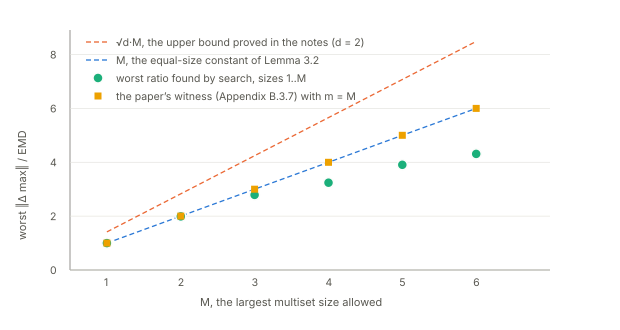
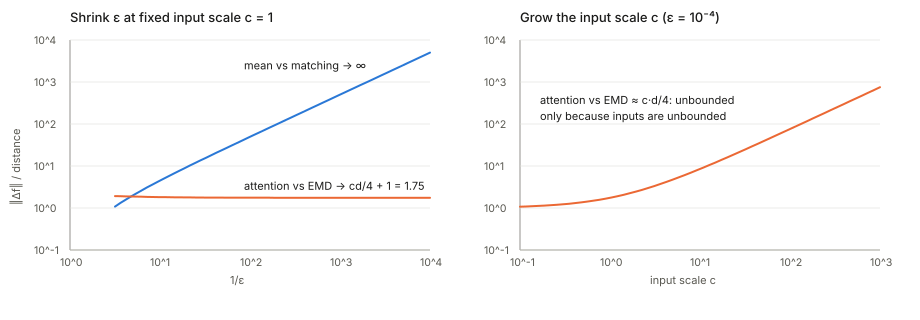

## Links

- **[ICLR 2026 poster page](https://iclr.cc/virtual/2026/poster/10007061)**: the venue page.
- **[arXiv:2505.24403](https://arxiv.org/abs/2505.24403)**: the preprint; `pdf_url` points here. The
  ICLR camera-ready is the version annotated below (44 pages, proofs in Appendix B).
- **[Interactive companion](figures/interactive.html)**: drag two point sets around and watch all
  three distances and all nine ratios update; push each of the paper's counterexamples to its limit
  with a slider; and add one point to a cloud of up to 100 to see why the mean shrugs and the max
  jumps (Proposition 3.6).
- **[Runnable code](https://github.com/msrepo/theory_inclined_papers_with_annotations/blob/main/papers/2026-nikolentzos-set-lipschitz/code/set_lipschitz.py)**:
  every number on this page, and the three figures (`python3 set_lipschitz.py --figures`).
  `make verify` runs it.
- Background pages: **[Optimal transport](../optimal-transport/index.html)**, for the earth mover's
  distance, couplings and Kantorovich–Rubinstein duality; **[Inequalities and
  concentration](../inequalities-and-concentration/index.html)** for the triangle-inequality moves.

## In one paragraph

A network for sets (DeepSets, PointNet) embeds every element with an MLP, pools the embeddings
with a permutation-invariant **aggregator** (sum, mean or max) and passes the pooled vector to a
second MLP. The paper asks how much the pooled vector can move when the input set moves, that is,
the **Lipschitz constant** of the aggregator. "Moves" needs a distance between sets, and the paper
uses three: the **earth mover's distance** (EMD, i.e. $W_1$ between the empirical distributions), the
**Hausdorff distance** (worst nearest-neighbour gap) and a **matching distance** (best one-to-one
pairing, with unmatched elements charged their norm). The headline result is a clean diagonal:
**mean is 1-Lipschitz for EMD, sum is 1-Lipschitz for matching, max is $\sqrt d$-Lipschitz for
Hausdorff**, and for sets of arbitrary size each aggregator is Lipschitz for *only* its own distance.
When all sets have the same size $M$, more cells fill in (constants $1/M$, $M$, $1$). An
attention-based pooling is Lipschitz for none of them. The results carry over to whole networks with
the MLPs' Lipschitz constants multiplied in, except that a **bias in the first MLP breaks the sum
network**. Short experiments on ModelNet40 and a movie-review dataset show the bounds hold, and that
accuracy drops under distribution shift track a Wasserstein distance built on the matching ground
metric. Four findings below are not in the paper. **The diagonal is explained by what each distance
cannot see**: five of the six failures are pairs of sets at distance zero whose aggregates differ.
**The sixth failure, max against EMD, disappears once set size is capped**: the max is then
Lipschitz with a constant between $M$ and $\sqrt d\,M$. **Attention's failure against EMD needs
unbounded inputs**; on a ball it is Lipschitz. And the inequality in **Proposition 3.6 is always an
equality**.

## The spine of the argument

1. **Three distances** (§2.4). EMD compares the sets as *distributions* (each element weighs
   $1/|X|$). Hausdorff compares them as *sets of locations*, ignoring how many times each occurs.
   Matching compares them as *lists to be paired*, and whatever is left over is paired with the
   origin. Proposition 2.2 says matching is a metric away from $\mathbf 0$. Proposition 2.3 says
   matching $= M\cdot$EMD when both sets have $M$ elements.
2. **Aggregators against distances** (§3.1, Theorem 3.1). Each aggregator's change can be written in
   the currency of one distance, so the triangle inequality bounds it: a transport plan for the mean,
   a pairing for the sum, a nearest neighbour for each coordinate of the max. For the other two
   distances the paper builds a family of pairs where the ratio is unbounded.
3. **Equal sizes** (Lemma 3.2). With $|X|=|Y|=M$, EMD and matching are the same distance up to the
   factor $M$, so the mean, sum and max each gain a second distance. Max gains both.
4. **Attention** (Proposition 3.3). A softmax-weighted average. A small change can shift a little
   weight across a large lever arm, and with unbounded inputs that is unbounded.
5. **Networks** (§3.2, Theorem 3.4, Lemma 3.5). Composition multiplies Lipschitz constants, and a
   Lipschitz map moves sets by at most its constant in EMD and Hausdorff. Matching needs the map to
   send $\mathbf 0$ to $\mathbf 0$, which a bias prevents.
6. **Uses** (§3.3–3.4). The distance from $X$ to "$X$ plus one element" (Proposition 3.6) predicts
   which network an outlier will hurt. A domain-adaptation bound (Theorem 3.7, from Shen et al. 2018)
   turns the Lipschitz constant into a statement about accuracy under shift.

## Setup and notation

| Symbol | Meaning |
|---|---|
| $X=\{\!\{\mathbf v_1,\dots,\mathbf v_m\}\!\}$ | a **multiset** of vectors in $\mathbb R^d$: order does not matter, repeats do. $\{\!\{a,b\}\!\}\ne\{\!\{a,b,b\}\!\}$ |
| $Y=\{\!\{\mathbf u_1,\dots,\mathbf u_n\}\!\}$ | the second multiset; sizes $m=\lvert X\rvert$, $n=\lvert Y\rvert$ may differ |
| $\mathcal S_{\le M}(\mathbb R^d)$, $\mathcal S_M(\mathbb R^d)$ | multisets of at most $M$, or exactly $M$, vectors |
| $f_{\text{SUM}}, f_{\text{MEAN}}, f_{\text{MAX}}$ | $\sum_{\mathbf v\in X}\mathbf v$; the same over $\lvert X\rvert$; the coordinate-wise maximum |
| $d_{\text{EMD}}$, $d_H$, $d_M$ | earth mover's, Hausdorff and matching distances (defined below) |
| $\mathbf F$ | a transport plan: $[\mathbf F]_{ij}$ is how much mass goes from $\mathbf v_i$ to $\mathbf u_j$ |
| $\mathfrak S_m$ | all permutations of $m$ items |
| $\operatorname{Lip}(f)$ | the smallest $L$ with $\lVert f(X)-f(Y)\rVert_2\le L\,d(X,Y)$ for all $X,Y$ |
| $f_{\text{MLP}_1}$, $f_{\text{MLP}_2}$ | the element-wise encoder before pooling and the head after it |
| $\text{NN}_g(X)$ | $f_{\text{MLP}_2}\big(g(\{\!\{f_{\text{MLP}_1}(\mathbf v_1),\dots,f_{\text{MLP}_1}(\mathbf v_m)\}\!\})\big)$ with $g$ = sum, mean or max |
| $d_h$ | the width of $f_{\text{MLP}_1}$'s output, where the pooling happens (not a symbol the paper uses; see §3.2 below) |

## §2.2 What "Lipschitz" measures

In plain words, a Lipschitz constant is a **speed limit**: if the input moves by one unit, the output
moves by at most $L$ units. For a function of one real number, it is the steepest slope the graph
ever has. $f(x)=3x$ has $L=3$; $f(x)=\sin x$ has $L=1$; $f(x)=x^2$ on the whole real line has no
Lipschitz constant, because its slope keeps growing. That last example will come back, because it is
exactly how attention fails.

For sets the output is a vector (the pooled embedding) and distance there is Euclidean, but the
*input* distance has to be chosen, and the choice decides the answer. Definition 2.1 is the usual
one:

$$
\lVert f(X)-f(Y)\rVert_2\;\le\;L\;d_{\mathcal X}(X,Y)\qquad\text{for all multisets }X,Y .
$$

Two consequences are worth keeping in mind. First, **if $d(X,Y)=0$ but $f(X)\ne f(Y)$, no $L$ can
work**, because the right side is zero. Every distance below has such pairs (they are
*pseudometrics*), and this is the single most useful fact for reading Table 1. Second, the constant
is a **worst case over all pairs**, including pairs a dataset would never produce. That matters for
attention, and for the size cap $M$.

Why care: a small Lipschitz constant bounds how far an adversarial or noisy change to the input set
can move the prediction (§3.3), and it enters generalisation-under-shift bounds (§3.4).

## §2.4 Three ways to say how far apart two multisets are

### Earth mover's distance: sets as piles of sand

Think of $X$ as a pile of sand: $m$ small heaps of weight $1/m$ each, one at every $\mathbf v_i$. $Y$
is another pile with heaps of weight $1/n$ at the $\mathbf u_j$. The EMD is the least total work, in
weight × distance, needed to reshape the first pile into the second. A **transport plan**
$\mathbf F$ records how much sand moves from each $\mathbf v_i$ to each $\mathbf u_j$:

$$
d_{\text{EMD}}(X,Y)=\min_{\mathbf F\ge 0}\;\sum_{i=1}^m\sum_{j=1}^n[\mathbf F]_{ij}\,\lVert\mathbf v_i-\mathbf u_j\rVert_2
\quad\text{subject to}\quad \sum_j[\mathbf F]_{ij}=\tfrac1m,\;\;\sum_i[\mathbf F]_{ij}=\tfrac1n .
$$

The first constraint says every heap of $X$ is emptied completely, the second that every heap of $Y$
is filled exactly. This is the Wasserstein-1 distance between the two empirical distributions
(the [optimal transport page](../optimal-transport/index.html) builds it up from scratch). Because
only the *proportions* matter, **EMD cannot tell $X$ from $X$ with every element duplicated**:
$\{\!\{\mathbf v\}\!\}$ and $\{\!\{\mathbf v,\mathbf v\}\!\}$ are the same distribution, so their EMD
is 0.

### Hausdorff distance: sets as locations

For each point of $X$, find its nearest neighbour in $Y$; $h(X,Y)$ is the worst such gap. Do the
same from $Y$'s side and take the larger:

$$
h(X,Y)=\max_{i}\min_{j}\lVert\mathbf v_i-\mathbf u_j\rVert_2,\qquad d_H(X,Y)=\max\big(h(X,Y),\,h(Y,X)\big).
$$

$d_H$ is small exactly when every point of either set has a close partner in the other. It looks
only at *where* points are, never at how many sit there, so **Hausdorff cannot see multiplicity at
all**: $d_H(\{\!\{a,b\}\!\},\{\!\{a,b,b\}\!\})=0$. It is also dominated by a single worst point,
which is why one outlier makes it large (§3.3).

### Matching distance: sets as lists to be paired, with a phantom origin

Pair the elements one to one as cheaply as possible, paying $\lVert\mathbf v-\mathbf u\rVert$ for
each pair. If $X$ is larger, some of its elements are left over, and each one pays its own norm
$\lVert\mathbf v\rVert$. For $m\ge n$,

$$
d_M(X,Y)=\min_{\pi\in\mathfrak S_m}\Big[\sum_{i=1}^n\lVert\mathbf v_{\pi(i)}-\mathbf u_i\rVert_2+\sum_{i=n+1}^m\lVert\mathbf v_{\pi(i)}\rVert_2\Big].
$$

The definition reads more naturally in one line: **pad the smaller multiset with copies of the zero
vector until the sizes agree, then take the cheapest perfect matching.** A leftover $\mathbf v$
matched to a padded $\mathbf 0$ pays $\lVert\mathbf v-\mathbf 0\rVert=\lVert\mathbf v\rVert$, which is
the second sum. (Padding *more* zeros on both sides changes nothing: pairing $\mathbf 0$ with
$\mathbf 0$ is free, and matching a real $\mathbf v$ and a real $\mathbf u$ to zeros separately
costs $\lVert\mathbf v\rVert+\lVert\mathbf u\rVert\ge\lVert\mathbf v-\mathbf u\rVert$, so it never
helps.) The code checks the padded form against the literal definition on 300 random pairs (largest
gap $1.8\times10^{-15}$).

The padded form makes two things obvious.

- **The origin is special, and it is the blind spot.** Adding $\mathbf 0$ to a multiset costs nothing:
  $d_M(\{\!\{\mathbf v\}\!\},\{\!\{\mathbf v,\mathbf 0\}\!\})=0$. That is why Proposition 2.2 says
  $d_M$ is a metric only on multisets that avoid $\mathbf 0$, and a pseudometric otherwise. It also
  means $d_M$ is not translation-invariant when sizes differ: shifting both sets by the same vector
  changes what a leftover element pays.
- **The triangle inequality (Proposition 2.2) is short.** Pad $X$, $Y$, $Z$ to a common size. Take
  the best matching $X\to Z$ and the best $Z\to Y$, and compose them into a matching $X\to Y$. Along
  each chain $\mathbf x\to\mathbf z\to\mathbf y$, $\lVert\mathbf x-\mathbf y\rVert\le\lVert\mathbf
  x-\mathbf z\rVert+\lVert\mathbf z-\mathbf y\rVert$. Sum over chains: $d_M(X,Y)\le
  d_M(X,Z)+d_M(Z,Y)$. Appendix B.1 does the same thing over six orderings of $\lvert X\rvert$,
  $\lvert Y\rvert$, $\lvert Z\rvert$ with four types of term; the padding collapses all six into one
  case. (2000 random triples: no violation.)

### One pair, three distances

The smallest example that separates everything is on the real line: $X=\{\!\{0,2\}\!\}$ and
$Y=\{\!\{0,2,2\}\!\}$.

- **EMD $=1/3$.** $X$ has half its mass at 0 and half at 2. $Y$ has a third at 0 and two thirds at 2.
  Leave $1/3$ at 0 and $1/2$ at 2, and carry the remaining $1/6$ from 0 to 2: work $1/6\times2=1/3$.
- **Hausdorff $=0$.** Both sets occupy exactly the locations $\{0,2\}$.
- **Matching $=2$.** Pad $X$ to $\{\!\{0,2,0\}\!\}$. Pair $0\leftrightarrow0$ and $2\leftrightarrow2$
  for free; the second 2 in $Y$ pairs with the phantom 0 and pays 2.

Now aggregate. The mean moves from $1$ to $4/3$, by $1/3$, which is exactly the EMD. The sum moves
from 2 to 4, by 2, exactly the matching distance. The max stays at 2 and moves by 0, exactly the
Hausdorff distance. That is Theorem 3.1 in one picture, with every bound attained.

### Proposition 2.3: for equal sizes, matching is EMD times $M$

If $\lvert X\rvert=\lvert Y\rvert=M$, both constraints in the EMD read "rows and columns each sum to
$1/M$". So $M\mathbf F$ is a **doubly stochastic** matrix: non-negative, with every row and column
summing to 1. The **Birkhoff–von Neumann theorem** says every doubly stochastic matrix is an average
of permutation matrices, so the set of them is a polytope whose corners are the permutations. A
linear objective over a polytope is minimised at a corner. Hence the optimal plan is a permutation
scaled by $1/M$: each element sends all its sand to one partner. That is a matching, and

$$
M\,d_{\text{EMD}}(X,Y)=\min_{\pi}\sum_{i=1}^M\lVert\mathbf v_{\pi(i)}-\mathbf u_i\rVert=d_M(X,Y).
$$

(The code checks this on 200 random pairs and also uses it in reverse: an EMD between sizes $m$ and
$n$ is computed exactly by repeating each element of $X$ $L/m$ times and each element of $Y$ $L/n$
times, $L=\operatorname{lcm}(m,n)$, which leaves both distributions unchanged, and solving an
$L\times L$ assignment.)

In ModelNet40 every point cloud has exactly $M=100$ points, so in Figure 1 the EMD row and the
matching row are the same scatter plot with the horizontal axis stretched by 100. That is why their
correlations are identical ($0.98$, $0.99$, $0.67$ in both rows).

### What each distance cannot see

Put the three blind spots side by side. Each row is a kind of change the distance scores as zero.

| Distance | Pairs at distance 0 | Mean | Sum | Max |
|---|---|---|---|---|
| EMD | $Y$ is $X$ with every multiplicity scaled: $\{\!\{\mathbf v\}\!\}$ vs $\{\!\{\mathbf v,\mathbf v\}\!\}$ | unchanged | **doubles** | unchanged |
| Hausdorff | same locations, any multiplicities: $\{\!\{a,b\}\!\}$ vs $\{\!\{a,b,b\}\!\}$ | **moves** | **moves** | unchanged |
| Matching | $Y$ is $X$ plus zero vectors: $\{\!\{\mathbf v\}\!\}$ vs $\{\!\{\mathbf v,\mathbf 0\}\!\}$ | **halves** | unchanged | **moves** if $\mathbf v$ has a negative entry |

An aggregator can only be Lipschitz for a distance if it ignores what that distance ignores. The
bold cells are therefore failures before any calculation: each one is a pair at distance 0 with
different outputs. The unbolded cells are the only candidates, and they are exactly the diagonal of
Table 1 **plus one more: max against EMD**. That cell is the subject of a separate subsection below.

## §3.1 Theorem 3.1: one distance per aggregator

**Theorem 3.1** (multisets of any size up to $M$). (1) The mean is Lipschitz for EMD with $L=1$, but
not for Hausdorff or matching. (2) The sum is Lipschitz for matching with $L=1$, but not for EMD or
Hausdorff. (3) The max is Lipschitz for Hausdorff with $L=\sqrt d$, but not for EMD or matching.

### Why the three positive results hold

Each proof writes the change in the aggregate *in the currency of its distance* and then applies the
triangle inequality once.

**Mean and EMD (Appendix B.3.1).** Take the optimal plan $\mathbf F^{\ast}$. Row $i$ of $\mathbf F^{\ast}$
sums to $1/m$ and column $j$ sums to $1/n$, so each mean can be spread over the plan:

$$
\frac1m\sum_i\mathbf v_i-\frac1n\sum_j\mathbf u_j
=\sum_{i,j}[\mathbf F^{\ast}]_{ij}\mathbf v_i-\sum_{i,j}[\mathbf F^{\ast}]_{ij}\mathbf u_j
=\sum_{i,j}[\mathbf F^{\ast}]_{ij}(\mathbf v_i-\mathbf u_j).
$$

Taking norms and using $\lVert\sum\mathbf a\rVert\le\sum\lVert\mathbf a\rVert$ gives
$\lVert\Delta\text{mean}\rVert\le\sum_{ij}[\mathbf F^{\ast}]_{ij}\lVert\mathbf v_i-\mathbf u_j\rVert=d_{\text{EMD}}$.
The picture: the mean is the **centre of mass** of the sand. Moving a bit of mass $F$ over a
displacement $\mathbf u-\mathbf v$ shifts the centre of mass by $F(\mathbf u-\mathbf v)$, so the centre
of mass cannot travel farther than the total work done. Equality holds for two singletons, so $L=1$
exactly.

**Sum and matching (Appendix B.3.5).** Pad with zeros (which do not change a sum) and take the best
pairing $\pi^{\ast}$. Then $\sum\mathbf v_i-\sum\mathbf u_i=\sum_i(\mathbf v_{\pi^{\ast}(i)}-\mathbf u_i)$ over
padded pairs, and the triangle inequality gives $\lVert\Delta\text{sum}\rVert\le d_M$. The zero-padding
reading makes the fit clear: **the matching distance is the sum's own geometry**. A leftover element
$\mathbf v$ changes the sum by $\mathbf v$ and is charged $\lVert\mathbf v\rVert$.

**Max and Hausdorff (Appendix B.3.9).** Fix one coordinate $k$. Say the largest $k$-th entry in $X$
is $a$, attained at some $\mathbf v^{\ast}$, and the largest in $Y$ is $b<a$. Because $h(X,Y)\le d_H$,
$\mathbf v^{\ast}$ has a partner $\mathbf u\in Y$ with $\lVert\mathbf v^{\ast}-\mathbf u\rVert\le d_H$, so
$u_k\ge a-d_H$, so $b\ge a-d_H$. Every coordinate of the max therefore moves by at most $d_H$, and a
vector with $d$ coordinates each at most $d_H$ has length at most $\sqrt d\,d_H$. **The $\sqrt d$ is
real**: take $X=\{\!\{\varepsilon\mathbf e_1,\dots,\varepsilon\mathbf e_d\}\!\}$ and $Y=\{\!\{\mathbf
0\}\!\}$. Then $d_H=\varepsilon$ but the max jumps from $\mathbf 0$ to $(\varepsilon,\dots,\varepsilon)$,
of length $\varepsilon\sqrt d$. Each coordinate's maximum comes from a different point, and each of
those points is only $\varepsilon$ from $Y$. (The code: ratio $1.7321=\sqrt3$ for $d=3$.)

### Why the other six fail

The paper proves each failure with a one-parameter family: two points $c\mathbf 1$ and $\varepsilon\mathbf 1$
against one, with $c$ large relative to $\varepsilon$, so that the distance is of order
$\varepsilon$ while the aggregate moves by order $c$. Five of those families are the blind-spot
pairs of the table above in thin disguise. As $\varepsilon\to0$ they converge to a pair at distance
exactly 0. The mean against matching, for instance, uses $X=\{\!\{c\mathbf 1,\varepsilon\mathbf 1\}\!\}$,
$Y=\{\!\{c\mathbf 1\}\!\}$. As $\varepsilon\to0$ that is $\{\!\{\mathbf v\}\!\}$ against $\{\!\{\mathbf v,\mathbf
0\}\!\}$: the phantom origin absorbs the extra element for free, while the mean is dragged halfway to
it. The code evaluates all five at distance exactly 0:

| Aggregator / distance | Pair | Distance | $\lVert f(X)-f(Y)\rVert$ |
|---|---|---|---|
| mean / Hausdorff | $\{\!\{a,b\}\!\}$ vs $\{\!\{a,b,b\}\!\}$, $a=(1,0)$, $b=(0,2)$ | 0 | 0.3727 |
| mean / matching | $\{\!\{\mathbf v\}\!\}$ vs $\{\!\{\mathbf v,\mathbf 0\}\!\}$, $\mathbf v=(-1,-2)$ | 0 | 1.1180 |
| sum / EMD | $\{\!\{\mathbf v\}\!\}$ vs $\{\!\{\mathbf v,\mathbf v\}\!\}$ | 0 | 2.2361 |
| sum / Hausdorff | $\{\!\{\mathbf v\}\!\}$ vs $\{\!\{\mathbf v,\mathbf v\}\!\}$ | 0 | 2.2361 |
| max / matching | $\{\!\{\mathbf v\}\!\}$ vs $\{\!\{\mathbf v,\mathbf 0\}\!\}$ | 0 | 2.2361 |

So these five are not about constants being large. **The aggregator is not even a function of the
distance's equivalence classes**: two inputs the distance calls identical get different outputs. No
amount of weight decay or spectral normalisation can fix that; only a different distance can.

### The sixth failure, max against EMD, depends on the size cap

Here the table offers no zero-distance pair. EMD's blind spot is duplication, and duplicating
elements never changes a maximum. The paper's witness (Appendix B.3.7) is different in kind. It takes
$m=\lfloor L+1\rfloor$ elements per set: $m-1$ shared elements summing to $\mathbf 0$, and one top
element per set, the two tops $1$ apart. The max moves by 1, the EMD is $1/m$, and the ratio is $m$.
To beat a proposed constant $L$ it needs **more than $L$ elements**. On
$\mathcal S_{\le M}(\mathbb R^d)$, the domain the theorem is stated on, that is not available once
$L\ge M$.

In fact the max *is* Lipschitz for EMD when sizes are capped, and the argument is one line. Fix a
coordinate $k$ with $a=\max_X(\cdot)_k>b=\max_Y(\cdot)_k$, and let $\mathbf v^{\ast}$ attain $a$. It
carries mass $1/m\ge1/M$, and every point of $Y$ is at least $a-b$ away from it (their $k$-th
coordinates are all at most $b$). Emptying $\mathbf v^{\ast}$'s heap therefore costs at least
$(a-b)/m$, so

$$
a-b\;\le\;m\,d_{\text{EMD}}\;\le\;M\,d_{\text{EMD}},
\qquad\text{hence}\qquad
\lVert f_{\text{MAX}}(X)-f_{\text{MAX}}(Y)\rVert\le\sqrt d\,M\,d_{\text{EMD}}(X,Y).
$$

The witness shows the constant is at least $M$. So on $\mathcal S_{\le M}$ the true constant lies in
$[M,\sqrt d\,M]$; a hill-climbing search in $d=2$ never exceeded $M$.

What Theorem 3.1(3) actually establishes, then, is that **no constant works uniformly in the size**:
on multisets of unbounded size the max is not Lipschitz for EMD, but for any fixed cap it is, with a
constant that grows linearly in the cap. The paper's own Lemma 3.2 already contains half of this (the
constant $M$ for equal sizes). The same size-hungry witness is also used for sum against EMD
(Appendix B.3.4), where it is harmless: the pair $\{\!\{\mathbf v\}\!\}$, $\{\!\{\mathbf v,\mathbf v\}\!\}$
kills that cell for any $M\ge2$.

### "No two of the distances are bi-Lipschitz equivalent"

Two distances are bi-Lipschitz equivalent when each is at most a constant times the other. Then any
function Lipschitz for one would be Lipschitz for the other. The mean is Lipschitz for EMD but not
for the other two, which separates EMD from both; the sum separates matching from Hausdorff. This is
a genuine consequence for sets of mixed size. For equal sizes it is false for the pair EMD and
matching (Proposition 2.3 makes them proportional).

## Lemma 3.2: when every set has the same size $M$

With $\lvert X\rvert=\lvert Y\rvert=M$ the matching blind spot is gone (there is nothing to pad) and
EMD's blind spot is gone (duplicating everything changes the size). Proposition 2.3 converts
between EMD and matching at the rate $M$:

| | Mean | Sum | Max |
|---|---|---|---|
| EMD | $1$ | $M$ | $M$ |
| Hausdorff | ✗ | ✗ | $\sqrt d$ |
| Matching | $1/M$ | $1$ | $1$ |

- **Mean/matching $=1/M$ and sum/EMD $=M$** are Theorem 3.1 with Proposition 2.3 substituted.
- **Max/matching $=1$** (Appendix B.4.5) needs its own argument. For each coordinate $k$, the larger
  of the two maxima is attained at some element, which the optimal pairing matches to some partner;
  that coordinate's gap is at most the gap between those two partners in coordinate $k$ (the other
  side's max is at least the partner's entry). So every coordinate's gap is *charged to one matched
  pair*. Within one pair, the charged coordinates' squared gaps add up to at most that pair's squared
  distance. Across pairs, $\sqrt{\sum_p s_p^2}\le\sum_p s_p$, and $\sum_p s_p\le d_M$.
- **Max/EMD $=M$** follows from max/matching and Proposition 2.3, and the B.3.7 witness shows it is
  tight.
- **Hausdorff still fails for mean and sum**, and still at distance zero: $\{\!\{a,a,b\}\!\}$ and
  $\{\!\{a,b,b\}\!\}$ have the same size, the same locations and different means.
- Not in the lemma but worth having: on $\mathcal S_M$, $d_H\le d_M$, because each point's nearest
  neighbour is at least as close as its matched partner, and one pair's distance is at most the sum
  of all of them. So with equal sizes the three distances are ordered $d_H\le d_M=M\,d_{\text{EMD}}$.

The paper's reading, that max is the safe default for equal-size inputs because it is Lipschitz for
all three distances, follows from the table. It is also the setting of Table 3's ModelNet40 column,
where the max network wins by 14 points.

## Proposition 3.3: attention

The attention pooling is a **softmax-weighted average**:

$$
f_{\text{ATT}}(X)=\sum_i\alpha_i\mathbf v_i,\qquad
\alpha_i=\frac{\exp\big(\mathbf q^\top g(\mathbf W\mathbf v_i)\big)}{\sum_j\exp\big(\mathbf q^\top g(\mathbf W\mathbf v_j)\big)} .
$$

Each element gets a score $s(\mathbf v)=\mathbf q^\top g(\mathbf W\mathbf v)$, the scores are
softmaxed into weights, and the output is a convex combination of the elements. With all scores
equal it is the mean; with one score much larger it approaches picking that element, like a max. The
proposition says there are weights $\mathbf W,\mathbf q$ for which it is Lipschitz for none of the
three distances.

### The witness, with numbers

Appendix B.5 takes $\mathbf W=-\mathbf I$, $\mathbf q=\mathbf 1$, $g=\text{ReLU}$, so the score is
$s(\mathbf v)=\sum_k\max(0,-v_k)$: how negative the element is. Then

$$
X=\{\!\{c\mathbf 1,\;\varepsilon\mathbf 1\}\!\},\qquad Y=\{\!\{c\mathbf 1,\;-\varepsilon\mathbf 1\}\!\}.
$$

In $X$ both elements are non-negative, both scores are 0, both weights are $1/2$. In $Y$ the element
$-\varepsilon\mathbf 1$ scores $d\varepsilon$, so its weight rises from $1/2$ to
$e^{d\varepsilon}/(1+e^{d\varepsilon})\approx\tfrac12+\tfrac{d\varepsilon}{4}$. A weight shift of
about $d\varepsilon/4$ between two elements that are about $c\sqrt d$ apart moves the output by about
$(d\varepsilon/4)\,c\sqrt d$. Meanwhile the sets differ by moving one element from $\varepsilon\mathbf
1$ to $-\varepsilon\mathbf 1$, which is an EMD of $\sqrt d\,\varepsilon$. Worked exactly (the code
matches to four decimals), with $e=\exp(d\varepsilon)$,

$$
\frac{\lVert f_{\text{ATT}}(X)-f_{\text{ATT}}(Y)\rVert}{d_{\text{EMD}}(X,Y)}
=\frac{c\,(e-1)+\varepsilon\,(1+3e)}{2\,(1+e)\,\varepsilon}
\;\xrightarrow[\;\varepsilon\to0\;]{}\;\frac{c\,d}{4}+1 .
$$

**For fixed $c$ this stays bounded**: at $c=1$, $d=3$ it tends to $1.75$ however small $\varepsilon$
gets. It is unbounded only as $c\to\infty$. The failure is the $x^2$ kind from §2.2, not the
blind-spot kind. The lever arm $c$ is the distance between the elements the weight moves between,
and the input space offers arbitrarily long lever arms.

The left panel contrasts the two failure modes. The mean against matching blows up as
$\varepsilon\to0$ at a fixed scale, because the pair converges to a blind-spot pair. Attention
against EMD does not; it needs the right panel, a growing scale.

### What survives on a bounded input domain

Three observations, all checked in the code, place attention next to the mean rather than below it.

1. **Attention ignores duplication.** Duplicating every element duplicates every term in the
   numerator and the denominator of the softmax, so $f_{\text{ATT}}$ is a function of the empirical
   distribution, exactly like the mean. It has no zero-EMD counterexample.
2. **On a ball it is Lipschitz for EMD.** If every $\lVert\mathbf v\rVert\le R$, write
   $f_{\text{ATT}}=\frac{\int\mathbf v\,w(\mathbf v)\,d\mu}{\int w(\mathbf v)\,d\mu}$ with
   $w=e^{s}$ and $\mu$ the empirical distribution. On the ball, $w$ and $\mathbf v\,w(\mathbf v)$ are
   Lipschitz and $w$ is bounded below by $e^{-\max\lvert s\rvert}$, so numerator and denominator are
   Lipschitz in $W_1$ (by Kantorovich–Rubinstein duality, integrals of Lipschitz functions are), and
   so is their ratio. The constant grows with $R\lVert\mathbf W\rVert\lVert\mathbf q\rVert$. Search
   with a fixed random $\mathbf W,\mathbf q$ in $d=3$: worst ratios $1.09$, $1.47$, $2.97$ for
   $R=1,4,16$.
3. **Against Hausdorff and matching it fails like the mean**, at distance zero:
   $\{\!\{a,b\}\!\}\to\{\!\{a,b,b\}\!\}$ doubles $b$'s share of the softmax (the output moves by
   $0.53$ in the code's example), and $\{\!\{\mathbf v\}\!\}\to\{\!\{\mathbf v,\mathbf 0\}\!\}$ gives
   the phantom zero some weight.

So the fair summary is: **attention is mean-like**. It is Lipschitz for EMD on any bounded domain
(point clouds normalised to unit variance, as in Appendix D, are effectively bounded), with a
constant that depends on the weights and the radius; and it fails Hausdorff and matching for the
mean's reasons. Kim et al. (2021) found the same unbounded-domain mechanism in dot-product
self-attention.

### $\ell_2$ attention (Appendix B.6)

Replacing the score by $-\lVert\mathbf q-g(\mathbf W\mathbf v)\rVert$ (the construction Kim et al.
use to make self-attention Lipschitz) does not help here, and the same witness works. One sign is
off in B.6.1–B.6.2: with the printed $\mathbf q=(-\varepsilon,\dots,-\varepsilon)$, the weights in
$Y$ come out as $(0.586,0.414)$, the reverse of the printed ones. With $\mathbf q=(+\varepsilon,\dots,+\varepsilon)$
they are $(0.414,0.586)$ as printed ($d=3$, $\varepsilon=0.2$). The conclusion is unaffected. Also,
B.5.3 and B.6.3 end with "$>L\,d_M(X,Y)$" where they mean $d_H$.

## §3.2 Theorem 3.4 and Lemma 3.5: whole networks

The network is encoder, pool, head: $\text{NN}_g=f_{\text{MLP}_2}\circ g\circ f_{\text{MLP}_1}$, with
the encoder applied to each element. Two facts do all the work.

- **Composition multiplies constants**: $\operatorname{Lip}(f\circ h)\le\operatorname{Lip}(f)\operatorname{Lip}(h)$.
- **A Lipschitz map moves sets by at most its constant.** Apply $f=f_{\text{MLP}_1}$ to every
  element. For EMD, reuse the optimal plan for $(X,Y)$ as a (possibly suboptimal) plan for
  $(f(X),f(Y))$: each pair's cost shrinks by at most the factor $\operatorname{Lip}(f)$, so
  $d_{\text{EMD}}(f(X),f(Y))\le\operatorname{Lip}(f)\,d_{\text{EMD}}(X,Y)$. For Hausdorff, a nearest
  neighbour within $r$ stays within $\operatorname{Lip}(f)\,r$. For matching, matched pairs behave the
  same way, but a leftover $\mathbf v$ is now charged $\lVert f(\mathbf v)\rVert$, and
  $\lVert f(\mathbf v)\rVert\le\operatorname{Lip}(f)\lVert\mathbf v\rVert+\lVert f(\mathbf 0)\rVert$.

That gives **Theorem 3.4**: $\text{NN}_{\text{MEAN}}$ is Lipschitz for EMD with constant at most
$\operatorname{Lip}(f_{\text{MLP}_2})\operatorname{Lip}(f_{\text{MLP}_1})$, and $\text{NN}_{\text{MAX}}$
for Hausdorff with $\sqrt{\cdot}\,\operatorname{Lip}(f_{\text{MLP}_2})\operatorname{Lip}(f_{\text{MLP}_1})$.
For $\text{NN}_{\text{SUM}}$ and matching the same steps give a Lipschitz bound *plus an offset*:

$$
\lVert\text{NN}_{\text{SUM}}(X)-\text{NN}_{\text{SUM}}(Y)\rVert
\le\operatorname{Lip}(f_{\text{MLP}_2})\Big(\operatorname{Lip}(f_{\text{MLP}_1})\,d_M(X,Y)+\big\lvert\lvert X\rvert-\lvert Y\rvert\big\rvert\,\lVert f_{\text{MLP}_1}(\mathbf 0)\rVert\Big).
$$

### The bias breaks the sum network

The offset is the whole story of Theorem 3.4(2). The encoder's bias makes $f_{\text{MLP}_1}(\mathbf
0)\ne\mathbf 0$, so the phantom zero that the matching distance adds for free is encoded as a real
vector and summed in. The paper's witness (Appendix B.7.2) is one-dimensional:
$f_1(x)=\text{ReLU}(a_1x+b_1)$, $f_2(x)=a_2x+b_2$, $X=\{\!\{c,c\}\!\}$, $Y=\{\!\{c\}\!\}$. With
$a_1=a_2=1$, $b_1=0.5$:

| $c$ | $d_M(X,Y)$ | output change | ratio |
|---|---|---|---|
| 0.1 | 0.100 | 0.600 | 6 |
| 0.01 | 0.010 | 0.510 | 51 |
| 0.001 | 0.001 | 0.501 | 501 |

The output change never drops below $b_1=0.5$, while the distance goes to zero. Remove the bias (or
any other way of ensuring $f_{\text{MLP}_1}(\mathbf 0)=\mathbf 0$) and the offset vanishes; the code
checks a bias-free ReLU encoder against the bound $\operatorname{Lip}\cdot\operatorname{Lip}=13.8$ and
finds at most $4.8$. With equal sizes the offset vanishes too, which is Lemma 3.5(2).

### The $\sqrt d$ in the max network is the hidden width

In Appendix B.7.3 the $\sqrt d$ comes from applying Theorem 3.1(3) to the *encoded* multisets
$f_{\text{MLP}_1}(X)$, whose elements live in the encoder's output space $\mathbb R^{d_h}$. So the
constant is $\sqrt{d_h}\,\operatorname{Lip}(f_{\text{MLP}_2})\operatorname{Lip}(f_{\text{MLP}_1})$,
not $\sqrt d$ with $d$ the input dimension that the theorem statement's notation suggests. This is
not cosmetic. In the experiments $d=3$ (ModelNet40) but $d_h=64$, a factor of $8/\sqrt3\approx4.6$.

A counterexample to the bound read with the input dimension: a one-dimensional input, and an encoder
with $16$ outputs, each a tent of height 1 and slope 1 centred at $0,3,6,\dots,45$. The tents do not
overlap, so $\operatorname{Lip}(f_{\text{MLP}_1})=1$. Let $X$ be the 16 centres and $Y$ the centres
shifted by $0.25$. Then $d_H(X,Y)=0.25$ and every coordinate of the max drops from 1 to $0.75$, so the
pooled vector moves by $0.25\sqrt{16}=1$. The bound with $d=1$ says $0.25$; with $d_h=16$ it says $1$,
attained.

## §3.3 Stability: adding one element (Proposition 3.6)

A natural perturbation of a point cloud or a document is one extra element $\mathbf w$. For the mean
network the relevant quantity is the EMD from $X$ to $X'=X\cup\{\!\{\mathbf w\}\!\}$; for the max network,
the Hausdorff distance.

**Hausdorff.** Every old point is in both sets, so the only nonzero nearest-neighbour gap is the new
point's: $d_H(X,X')=\min_i\lVert\mathbf v_i-\mathbf w\rVert$. One outlier far from the cloud makes it
as large as its distance to the cloud.

**EMD, and why the bound is an equality.** As a distribution, $X'$ is a mixture: with $t=1/(n+1)$,

$$
\mu_{X'}=(1-t)\,\mu_X+t\,\delta_{\mathbf w}.
$$

To turn $X$ into $X'$ a fraction $t$ of the sand has to end up at $\mathbf w$. The paper's plan takes
it evenly from every heap, and bounds the EMD by the cost of that plan,
$\frac{1}{n(n+1)}\sum_i\lVert\mathbf v_i-\mathbf w\rVert$. Taking it evenly is optimal, so the bound
is **always an equality**. The cleanest argument is Kantorovich–Rubinstein duality, which writes
$W_1(\mu,\nu)=\sup_\varphi\big(\int\varphi\,d\mu-\int\varphi\,d\nu\big)$ over all 1-Lipschitz
functions $\varphi$ (the [optimal transport page](../optimal-transport/index.html) explains why).
Here $\mu_X-\mu_{X'}=t(\mu_X-\delta_{\mathbf w})$, so every test function sees exactly $t$ times the
difference between $X$ and the single point $\mathbf w$. Hence
$W_1(\mu_X,\mu_{X'})=t\,W_1(\mu_X,\delta_{\mathbf w})$. The distance to a single point is easy, because
all the sand must go there: $W_1(\mu_X,\delta_{\mathbf w})=\frac1n\sum_i\lVert\mathbf v_i-\mathbf w\rVert$.
So

$$
d_{\text{EMD}}(X,X')=\frac{1}{n(n+1)}\sum_{i=1}^n\lVert\mathbf v_i-\mathbf w\rVert\quad\text{exactly}.
$$

The code confirms the equality on 200 random cases (largest gap $4\times10^{-16}$); the paper names
only the trivial equality case where every point coincides.

The two formulas explain Table 2. With $n=100$ Gaussian points and a new point at $1.5\times$ the
farthest one, the EMD change is $0.047$ and the Hausdorff change $1.55$, thirty times larger. The
paper's Pert. #1 (add the highest-norm element found in the dataset) costs the mean network 2
points of accuracy and the max network 20. Pert. #2 (add $\mathcal U(0,0.2)^d$ noise to every
element) moves every element a little, and there the max network is the robust one (4.8 against
13.6). The theory does not predict this one. Proposition C.2 gives the EMD and the Hausdorff distance
the same bound, $k\sqrt d$, so the difference has to come from the trained networks' constants or
from the data, not from the choice of distance. Appendix E.3 frames the outlier result the same way: the perturbed
cloud is on average $2.63$ farther from its original, in Hausdorff distance, than the other clouds of
its class are.

## §3.4 Generalisation under distribution shift (Theorem 3.7)

The bound is borrowed from Shen et al. (2018), itself a Wasserstein version of Ben-David et al.
(2010). For a binary task with source and target input distributions $\mu_S$, $\mu_T$ and a
hypothesis class whose members are all $L$-Lipschitz,

$$
\epsilon_T(h)\;\le\;\epsilon_S(h)+2L\,W_1(\mu_S,\mu_T)+\lambda,
$$

where $\epsilon_S,\epsilon_T$ are the source and target errors and $\lambda$ is the combined error of
the best single hypothesis on both. In words: moving the data by $W_1$ can change a prediction by at
most $L$ per unit moved, and the two factors of the bound are exactly that.

The new ingredient is what $W_1$ means when each *input* is a multiset. The inputs are points of a
metric space whose metric is EMD (for $\text{NN}_{\text{MEAN}}$) or Hausdorff (for
$\text{NN}_{\text{MAX}}$), and $W_1(\mu_S,\mu_T)$ is optimal transport *between distributions of
multisets* with that ground metric. With EMD as the ground metric it is a Wasserstein distance whose
cost is itself a Wasserstein distance: transport of documents, each of which is a pile of words. The
paper does not have to prove anything new here. It only needs the Lipschitz constant, and §3.2
supplies it for exactly the two networks.

## Experiments, briefly

- **Aggregators alone (Figure 1, Polarity in Figure 4).** The latent multisets just before pooling
  (100 points in $\mathbb R^{64}$ per ModelNet40 cloud) are compared pairwise, 4,950 pairs. Every dot
  is below its bound. Mean against EMD is close to tight; max against Hausdorff is loose. The EMD and
  matching rows are the same data rescaled by $M=100$ (see Proposition 2.3 above).
- **Networks (Figure 2, Figure 5).** One linear layer, pool, one linear layer, so
  $\operatorname{Lip}$ is a product of two spectral norms and exact. Bounds hold and are loose for sum
  and very loose for max.
- **Stability (Table 2).** Discussed under Proposition 3.6.
- **Size shift (Figure 3).** 2,000 Polarity documents are sorted by length into 10 bins of 200. A
  network trained on the shortest bin is tested on the others. The accuracy drop and $W_1$ between
  bins correlate at $r\approx0.9$. Amazon reviews across four product domains (Figure 7): $r=0.917$
  for mean/EMD and $0.941$ for max/Hausdorff.
- **Plain accuracy (Table 3).** Max wins on ModelNet40 (77.2 vs 63.4 and 60.1) and Polarity, mean on
  IMDB regression, sum on IMDB-BINARY (multisets of node degrees, where counts matter).

## Questions and doubts

- **Theorem 3.1(3)'s "max is not Lipschitz for EMD" needs unbounded sizes**, although the theorem
  is stated on $\mathcal S_{\le M}$. The witness needs $\lfloor L+1\rfloor$ elements. For a fixed cap
  $M$ the max is Lipschitz with a constant in $[M,\sqrt d\,M]$ (above). The correct statement is
  "no constant uniform in $M$", which is also what Table 1's footnote implies. The same
  large-$m$ witness is used for sum/EMD, where a two-element witness would do.
- **Five of the six negative results are about pseudometric blind spots, not about magnitude.** The
  paper proves them with $c$-versus-$\varepsilon$ families, which reads as "the constant is very
  large". In fact the aggregator gives different answers on pairs the distance calls identical. Put
  that way, the guideline in §5 becomes sharper. Choosing an aggregator is choosing what to be blind
  to: duplication (mean), multiplicity (max) or zero vectors (sum).
- **Attention's non-Lipschitzness for EMD is an unbounded-domain effect.** On any ball it is
  Lipschitz, with a constant that depends on the ball and on $\mathbf W,\mathbf q$. The practical
  worry is then how large that constant gets for trained weights, a question the paper does not
  measure. Figure 6's lower correlations do not bear on the question either way. A function can be
  Lipschitz and poorly correlated with a distance, or correlated and not Lipschitz.
- **$\sqrt d$ versus $\sqrt{d_h}$** in Theorem 3.4(3) and Figure 2's max line. Which $d$ the dashed
  line in Figure 2 uses is not stated. The dots sit far below it either way.
- **Proposition 3.6(1) is an equality.** It should also be the formula quoted in Appendix E.3, where
  the EMD analysis of Pert. #1 is done numerically.
- **The matching distance is anchored to the origin.** Leftover elements pay their norm, so the
  distance depends on where $\mathbf 0$ is. Point clouds are centred in Appendix D, which makes that
  choice sensible for inputs. In a hidden layer after a ReLU and a bias, where the origin sits is up
  to the network. The bias failure of $\text{NN}_{\text{SUM}}$ is this issue in another form.
- **The generalisation bound is not evaluated, only correlated.** In Figure 7, $W_1$ is between $2$ and
  $2.4$ with the EMD ground metric (about 4 with Hausdorff), and the Lipschitz bounds of comparable
  networks in Figures 2 and 5 are far above 1. So $2LW_1$ exceeds 1, and as a bound on a 0–1 error
  the theorem is vacuous. Figure 3's correlation is over 10 bins whose $W_1$ and accuracy
  drop both grow with distance from the training bin. Nearly any quantity that grows with document
  length would correlate as well.
- **Hypotheses into $\{0,1\}$ are not Lipschitz** unless constant on connected pieces of the input
  space. Theorem 3.7 needs real-valued outputs (probabilities), and the reported accuracies come from
  thresholding them. The step is standard, but it means the bound is about the soft output.
- **Small slips.** The $\ell_2$-attention witness's $\mathbf q$ has the wrong sign; B.5.3 and B.6.3
  end with $d_M$ for $d_H$; B.7.1 says the network's constant is upper bounded by
  "$\operatorname{Lip}\operatorname{Lip}\,d_{\text{EMD}}(X,Y)$" (the distance should not be in a constant).

## Takeaways

- **Each aggregator has a native geometry.** Mean is the centre of mass, so it lives with transport
  (EMD). Sum adds leftover elements at face value, so it lives with padded matching. Max looks only
  at extreme locations, so it lives with Hausdorff. The Lipschitz constants 1, 1 and $\sqrt d$ are
  each one triangle inequality.
- **Before computing any constant, check the blind spots.** If a distance scores two different inputs
  as zero apart and the function separates them, the function is not Lipschitz for that distance,
  whatever its weights. That settles five of Table 1's six failures at a glance.
- **Size caps and input bounds change the answers.** Max against EMD, and attention against EMD, are
  both Lipschitz once set size, or input norm, is bounded. The constant grows with the bound. The
  "✗" entries in the paper mix these with the blind-spot failures, which are unconditional.
- **For networks, biases matter only for the sum.** Lipschitz maps push EMD and Hausdorff forward
  cleanly. Matching also needs $f(\mathbf 0)=\mathbf 0$, and the max bound's $\sqrt{\cdot}$ is the width
  of the pooled layer.
- **One outlier is cheap in EMD and expensive in Hausdorff**, exactly $\frac{1}{n(n+1)}\sum_i\lVert\mathbf
  v_i-\mathbf w\rVert$ against the nearest-neighbour distance. That is the whole mechanism behind the
  mean network's robustness to outliers and the max network's fragility to them.
