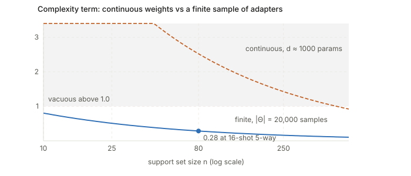

## Links

- **[arXiv:2502.06970](https://arxiv.org/abs/2502.06970)** — note this is the **earlier
  version** of the work, an ICLR 2025 workshop paper titled *Model Diffusion for Certifiable
  Few-shot Transfer Learning*, same authors and same method. These notes annotate the ICML 2026
  camera-ready, which renames the method STEEL and adds the LLM benchmarks. `make fetch` will
  pull the earlier version.
- **[Inequalities and concentration](../inequalities-and-concentration/index.html)** — the
  finite-hypothesis bound used here is Hoeffding plus a union bound, covered there.
- **[Runnable code](https://github.com/msrepo/theory_inclined_papers_with_annotations/blob/main/papers/2026-rezk-steel-certifiable-fewshot/code/bounds.py)** — the bound
  arithmetic, including a rederivation of Eq. 3 from Hoeffding. `make verify` runs it.

## In one paragraph

You fine-tune CLIP on 16 examples per class and get 90% held-out accuracy. Can you *guarantee*
a minimum accuracy on unseen data, of the sort a regulator might require? Today, no: every
bound's complexity term scales with the size of the searched hypothesis space, and for even a
small continuous adapter that term swamps the $[0,1]$ range of the loss. STEEL's move is to
**stop optimising over a continuous space and select from a finite list**: fit adapters to
upstream tasks, train a diffusion model over them, then at test time sample $|\Theta|$
candidates *unconditionally* and return whichever scores best on the support set. Complexity
drops from $d$ to $\log|\Theta|$, and the classical finite-hypothesis bound — elementary,
and older than deep learning — becomes non-vacuous in the few-shot regime for the first time.

## The spine of the argument

1. Continuous hypothesis spaces make few-shot certificates vacuous, whatever the optimiser.
2. Restrict the learner to return one of $|\Theta|$ pre-committed candidates. Complexity
   becomes $\sqrt{\log(|\Theta|/\epsilon)/2n}$, and $\log$ of a large number is small.
3. Get the candidates from a diffusion model trained on upstream task adapters, so the class is
   rich enough to contain good solutions and can *interpolate* between upstream tasks.
4. The bound is Hoeffding plus a union bound, so it holds **uniformly over $\Theta$** — which
   is precisely what licenses selecting the best candidate after seeing the support set.
5. Everything else (hierarchical search, distribution shift, suboptimal selection) can only
   loosen the certificate, never invalidate it.

## Setup and notation

| Symbol | Meaning |
|---|---|
| $\Theta$ | the finite hypothesis set: adapters sampled from the diffusion model |
| $\|\Theta\|$ | its size; 10k–20k in their experiments |
| $d$ | number of continuous PEFT parameters ($\approx 1000$ for their LoRA-XS) |
| $n$ | support set size ($= 80$ for 16-shot 5-way) |
| $r(\theta)$, $R(\theta)$ | empirical risk on the support set, and true risk |
| $C$ | loss bound, $0 \le \ell \le C$ |
| $\epsilon$ | certificate failure probability |
| $n_d$, $T^*$ | difficult examples per class; the downstream task |

## The arithmetic, which is the whole paper

Two certificates of the form $R \le r + \text{complexity}$:

$$
\underbrace{C\sqrt{\frac{\log(|\Theta|/\epsilon)}{2n}}}_{\text{Eq. 3, finite class}}
\qquad\text{vs}\qquad
\underbrace{C\sqrt{\frac{d + 2\log d + \log(1/\epsilon)}{2n}}}_{\text{Eq. 7, continuous}}
$$

Eq. 7 is the **best case** of the Lotfi et al. (2024) quantisation bound, assuming one bit per
parameter, so it flatters the competition. At their 16-shot 5-way setting ($n = 80$):

| bound | complexity | verdict |
|---|---|---|
| continuous, $d \approx 1000$ | **2.52** | vacuous (loss is in $[0,1]$) |
| finite, $\|\Theta\| = 20{,}000$ | **0.284** | usable |

An 8.9× gap. These reproduce their Table 2 closely (reported min bounds 2.55 and 0.30), which
also confirms $d \approx 1000$ for their adapters. The continuous bound does not drop below 1
until $n \approx 508$ — nowhere near few-shot.

<figure>

<figcaption>The asymmetry to internalise: you can search <b>20,000</b> candidates for the price
of <b>≈13</b> "parameters' worth" of complexity, because the count enters through a logarithm.
A continuous space costs $d$ regardless of how you search it — gradient descent, zeroth-order,
it makes no difference.</figcaption>
</figure>

The logarithm also means the class size is almost free to grow: `code/bounds.py` shows the
complexity moving only from 0.218 to 0.324 as $|\Theta|$ goes from $10^2$ to $10^6$.

## The method

**Upstream.** Fit a PEFT adapter to each source task; treat $\{\theta_i\}$ as samples from a
distribution over "adapters that solve tasks from this family"; fit a **diffusion model** to it.
That generator is the transferred meta-knowledge — the analogue of MAML's initialisation
$\theta_0$, but a distribution rather than a point.

**Downstream.** Given support set $S^*$: draw $|\Theta|$ adapters **unconditionally**, score
each on $S^*$, return $\theta^* = \arg\min_{\theta\in\Theta} r(\theta)$. No gradients at test
time. Learning is *selection*.

Two refinements. Search may be **hierarchical** (clustered, $O(\log|\Theta|)$) rather than
exhaustive — a worse $\theta^*$, but the bound is unaffected. And a **diffusion model rather
than the raw model zoo**, for compactness and because it can interpolate between upstream
solutions; their ablations show it beats selecting from the zoo directly.

## Why the bound is sound

"Use the support set to choose the model, then certify it on the same support set" sounds like
cheating. It is not, for the classical reason.

Eq. 3 is **Hoeffding plus a union bound**. For one fixed $\theta$, Hoeffding gives
$\Pr(R - r > t) \le \exp(-2nt^2/C^2)$. Union over $|\Theta|$ candidates and set the total
failure probability to $\epsilon$:

$$
t = C\sqrt{\frac{\log(|\Theta|/\epsilon)}{2n}} .
$$

`code/bounds.py` rederives this numerically — plugging $t$ back gives
$|\Theta|e^{-2nt^2} = 0.0500$ exactly. The bound therefore holds **simultaneously for every**
$\theta \in \Theta$, so you may pick whichever you like after looking at the data. Paying
$\log|\Theta|$ *is* the price of that freedom. The PAC-Bayes framing (uniform prior, Dirac
posterior) is optional dressing; this is the Occam bound.

The critical precondition is that **$\Theta$ is fixed before $S^*$ is seen** — and it is,
because the samples are drawn unconditionally from a generator trained only on upstream tasks.

Two consequences the paper draws out well:

- **The i.i.d.-task assumption affects tightness, not validity.** The bound needs only $S^*$
  i.i.d. from the downstream task. Under distribution shift the sampled adapters fit poorly,
  $r(\theta^*)$ rises, and the certificate is honestly bad — never wrong. Demonstrated with
  CUB→iNaturalist.
- **You get a deployment decision.** Gradient-based meta-learning hands you a model with no
  statement attached; here you read the certified risk and may decline to deploy.

## Results

- **Vision, 16-shot 5-way:** 97–100% of episodes non-vacuous across four datasets. SGD and BBPT
  give **0%**, every time. LoRA-Hub 35–100%, Meta-PB 0–97%.
- **LLM (LaMP personalisation):** 65% non-vacuous, vs 32% (LoRA-Hub) and **0%** (SGD, MeZO).
- **Scaling shots:** at 64–128 shots on iNaturalist the certificate sits just 6% above empirical
  test error — genuinely tight, with far fewer examples than the ≥10k prior certification work
  needs.

**The accuracy cost is real, and the paper undersells it.** It describes STEEL as "within a
small margin" of fine-tuning:

| Dataset | SGD | STEEL | gap |
|---|---|---|---|
| CUB | 90.3% | 88.4% | −1.9 |
| Aircraft | 65.6% | 61.4% | −4.2 |
| DTD | 88.0% | 81.5% | −6.5 |
| **Flowers** | **95.9%** | **84.9%** | **−11.0** |

Eleven points is not a small margin. The honest framing: you are **buying a certificate with
accuracy**, at a price between roughly 2 and 11 points.

## What is genuinely clever

The inversion. The field's usual move is *here is an algorithm, find a tighter bound for it.*
This paper does the opposite: *here is the tightest bound we have — elementary, and decades old
— design an algorithm it applies to.* The bound is not the contribution; making a competitive
deep-learning method fit it is.

There is also an unusual consequence in their Figure 5: because complexity grows with
$|\Theta|$, **drawing more samples eventually hurts the certificate** even while training error
keeps falling. On DTD the best bound occurs after relatively few samples. "How hard should I
search?" becomes an explicit, tunable trade-off that gradient descent simply does not have.

## Questions and doubts

- **$\log|\Theta|$ is loose, and they know it.** Many sampled adapters make near-identical
  predictions, so counting each as an independent hypothesis overpays. Their own suggested fix —
  a prediction-space covering number $N(\Theta,\varepsilon)$ — would decouple certificate
  strength from raw sample count. That is the obvious next paper.
- **Choosing $|\Theta|$ looks unpaid-for.** Figure 5 sweeps $|\Theta|$ and observes where
  the bound is best, but that optimum depends on $S^*$ through $r(\theta)$. *Selecting*
  $|\Theta|$ by reading the curve is model selection on the data, needing a further union
  bound over the grid. Cheap to fix (another log), but not addressed.
- **Per-episode versus simultaneous.** "% non-vacuous tasks" aggregates certificates each
  holding with probability $1-\epsilon$ individually. Fine as a per-deployment claim; not a
  guarantee across all episodes at once.
- **Usefulness rests on an assumption the theory deliberately excludes.** If no upstream task
  resembles the downstream one, the generator has nothing useful to sample. The bound stays
  valid and says so — correct behaviour, but it means practical value depends on coverage that
  the theory does not cover.

## Takeaways

- Complexity entering as $\log|\Theta|$ rather than $d$ is the entire mechanism, and it is
  worth carrying as an intuition: **searching a huge finite list is cheap; searching a small
  continuous space is not.**
- The finite-hypothesis bound holds uniformly, which is exactly why data-dependent selection
  from a data-independent pool is legitimate. Everything hinges on $\Theta$ being drawn before
  the support set is seen.
- Certification and accuracy are in tension here, with a measurable exchange rate. That is a
  more honest framing than "comparable performance".
- Compare with the [NTK notes](../2018-jacot-neural-tangent-kernel/index.html): both escape
  "complexity scales with parameter count", but by opposite routes — STEEL shrinks the class
  until the count is small, NTK shows the count was never the right measure.
