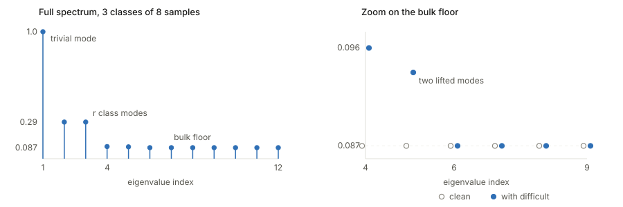

## Links

- **[OpenReview forum](https://openreview.net/forum?id=5LMdnUdAoy)** — the ICLR 2026 venue
  page, with the reviews and discussion.
- **[arXiv:2501.01317](https://arxiv.org/abs/2501.01317)** — preprint. `make fetch` pulls
  the PDF from here.
- **[HaoChen et al. 2021](../2021-haochen-spectral-contrastive/index.html)** — the notes on
  the paper this one builds on; the spectral contrastive loss, the augmentation graph and the
  `4δ/(1−λ) + 8δ` bound all come from there.
- **[Wang & Isola 2020](../2020-wang-isola-alignment-uniformity/index.html)** — where the alignment / uniformity decomposition of the
  contrastive loss comes from.
- **[Inequalities and concentration](../inequalities-and-concentration/index.html)** — background page collecting the tools
  these proofs run on (Cheeger, Donsker–Varadhan, Rademacher, Davis–Kahan and the rest).

Yi-Ge Zhang, Jingyi Cui, Qiran Li and Yisen Wang, *Difficult Examples Hurt Unsupervised
Contrastive Learning: A Theoretical Perspective*, ICLR 2026. Full subtitle omitted from
the title field for brevity.

## In one paragraph

In supervised learning, the examples near the decision boundary are the valuable ones. In
unsupervised contrastive learning they are not merely useless — deleting them *improves*
downstream accuracy, even though it shrinks the training set. This paper explains why. It
models the augmentation graph with just three similarity levels ($\alpha$ within class,
$\beta$ across classes, $\gamma$ across classes when both endpoints sit near the boundary),
computes the spectrum of the resulting adjacency matrix in closed form, and reads off
linear-probing error bounds. Difficult examples show up as a $\gamma > \beta$ gap that
raises the relevant eigenvalue and therefore the error bound. The same framework then
explains three fixes — deleting the examples, adding a margin to difficult pairs, and
scaling their temperature — each of which edits the similarity matrix in a different
algebraic way.

## The spine of the argument

1. Analyse the **spectral contrastive loss** rather than InfoNCE, because it is *exactly* a
   matrix factorisation objective: minimising it computes the best rank-$k$ approximation
   of the normalised augmentation-graph adjacency matrix $\bar A$.
2. Linear-probing error is therefore controlled by the spectrum of $\bar A$, specifically
   by $\lambda_{k+1}$: error $\le 4\delta/(1-\lambda_{k+1}) + 8\delta$ (HaoChen et al.).
3. Model $\bar A$ with three similarity levels, so its eigenvalues come out in closed form
   via Kronecker products.
4. Difficult examples raise $\lambda_{k+1}$, hence a strictly worse bound (Thm 3.3 vs 3.4).
   The damage is governed by $\gamma - \beta$.
5. Each remedy is a different edit to the target matrix: removal shrinks it ($n \to n-n_d$),
   margin tuning **subtracts** $\bar M$, temperature scaling **multiplies** elementwise by
   $T$. Choose the edit so the difficult entries land back on $\beta$ and the damage is
   undone.

Everything hinges on step 1. Without the exact matrix-factorisation equivalence there is no
spectrum to compute and no bound to read off.

## Setup and notation

| Symbol | Meaning |
|---|---|
| $\bar x \in \bar{\mathcal{X}} = \mathbb{R}^d$ | a natural (un-augmented) data point |
| $A(\cdot \mid \bar x)$ | augmentation distribution given $\bar x$ |
| $\mathcal{X}$ | set of all augmented data; finite but exponentially large |
| $n$ | number of augmented samples **per class** |
| $r+1$ | number of classes, so $\lvert\mathcal{X}\rvert = n(r+1)$ |
| $n_d$, $\mathcal{D}_d$ | difficult examples per class, and the set of them; $n_e := n - n_d$ |
| $k$ | feature dimension of the encoder $f$ |
| $\delta$ | labelling error in Assumption 3.1 (labels recoverable from augmentations) |
| $w_{x,x'}$ | edge weight $\mathbb{E}_{\bar x}[A(x\mid\bar x)A(x'\mid\bar x)]$; $\sum_{x,x'} w_{x,x'} = 1$ |
| $w_x$ | degree, $\sum_{x'} w_{x,x'}$ |
| $A$, $D$, $\bar A$ | adjacency $(w_{x,x'})$, degree $\operatorname{diag}(w_x)$, normalised $D^{-1/2} A D^{-1/2}$ |
| $\lambda_{k+1}$ | the $(k{+}1)$-th largest eigenvalue of $\bar A$ — **every bound in the paper is a function of this one number** |
| $\alpha$ | similarity between two *distinct same-class* samples |
| $\beta$ | similarity between two *different-class* samples, neither of them difficult |
| $\gamma$ | similarity between a *matched pair of different-class difficult* samples |
| $c_2$ | $(1-\alpha) + n\alpha + nr\beta$ — the degree $w_x$ of an **easy** node |
| $c_1$ | $c_2 + r(\gamma-\beta)$ — the degree $w_x$ of a **difficult** node |
| $c_0$ | $(1-\alpha) + n\alpha + (n-n_d)r\beta$ (as stated in Thm 4.3; see *Questions* below) |
| $m_{x,x'}$, $M$, $\bar M$ | margin per pair, the margin matrix, and $\bar M = D^{1/2} M D^{1/2}$ |
| $\tau_{x,x'}$, $T$ | temperature per pair, and the temperature matrix |
| $\sigma$, $\rho$ | the *empirical* margin and temperature-scaling factors in Eqs. 14–15 |
| $p_{i,j}$ | indicator that the pair $(x_i, x_j)$ was flagged difficult |
| $\omega$ | mixing ratio in the $\omega$-Mixed CIFAR-10 experiments |
| $\epsilon$, $\varepsilon_{ij}$, $W$ | noise scale, i.i.d. symmetric mean-0 variance-1 noise, and the resulting Wigner matrix |

### The three similarity levels, and why $\beta < \gamma < \alpha < 1$

Self-similarity is $1$ by definition, which anchors the scale. Same-class pairs should be
the most similar of the rest, giving $\alpha$. Different-class pairs are less similar, and
they split in two: if at least one endpoint sits near the class boundary the pair is
*difficult* and gets the larger value $\gamma$; otherwise it is *easy* and gets $\beta$.
Hence the ordering. The entire effect studied in the paper lives in the single gap

$$
\gamma - \beta \;>\; 0,
$$

and setting $\gamma = \beta$ collapses every "with difficult examples" result back to its
"without" counterpart. That is the cleanest way to read the theory: **$\gamma - \beta$ is
the dial labelled "how much do difficult examples hurt".**

One structural detail that is easy to miss and matters for the constants: the difficult
pairs are *matched by index*. Sample $l$ of class $i$ is $\gamma$-similar to sample $l$ of
class $j$, and to nothing else outside its class. So a difficult node has exactly $r$
$\gamma$-neighbours — one per other class — and $r(n-1)$ $\beta$-neighbours. That is where
$c_1 = c_2 + r(\gamma-\beta)$ comes from, with the coefficient $r$ and not $r n_d$.

### How $\alpha$, $\beta$, $\gamma$ are measured, and the Table 10 trends

These are population constants in the theory, but the appendix estimates them empirically:
train the model, then average cosine similarities over each group of pairs — same-class
pairs for $\alpha$, different-class pairs with no flagged difficult endpoint for $\beta$,
and different-class pairs containing a flagged difficult endpoint for $\gamma$. Difficult
examples are flagged as the 8% of each class with the smallest gap between the top two
softmax outputs.

On $\omega$-Mixed CIFAR-10, as the mixing ratio rises:

| Mixing ratio | 0% | 10% | 20% | 30% |
|---|---|---|---|---|
| accuracy (%) | 88.3 | 88.0 | 87.7 | 86.2 |
| $\alpha$ | 47.2 | 44.0 | 41.2 | 38.7 |
| $\beta$ | 19.1 | 19.5 | 20.1 | 20.8 |
| $\gamma$ | 20.9 | 22.1 | 23.1 | 24.1 |
| $\gamma - \beta$ | 1.80 | 2.60 | 3.00 | 3.30 |
| eigenvalue ($\times 10^{-5}$) | 2.93 | 3.36 | 3.58 | 3.72 |

**$\alpha$ falls** because a pixel-mixed image nominally belongs to one class while carrying
content from another, so it is a poor match for its own class-mates. Each class becomes
internally more heterogeneous, and the average within-class similarity drops.

**$\beta$ and $\gamma$ both rise** because mixing degrades the representation globally: the
encoder trained on contaminated data separates classes less well, so *all* cross-class pairs
look more alike. Two further effects push the same way — the 8% selector is a fixed budget
and cannot capture every mixed image, so some leak into the "easy" pool and lift $\beta$;
and genuinely boundary-straddling images are exactly what raises $\gamma$.

**$\gamma$ rises faster than $\beta$**, which is the point: $\gamma-\beta$ nearly doubles
from 1.80 to 3.30. Theorem 3.4 predicts a worse bound as that gap widens, and the measured
$\lambda_{k+1}$ duly climbs while accuracy falls. The table is the empirical validation of
Theorem 3.4.

Worth noting that the paper emphasises $\gamma - \beta$ but $\alpha$'s decline is doing
independent work. Since

$$
\lambda_{k+1} = \frac{1-\alpha}{(1-\alpha) + n\alpha + nr\beta},
$$

a falling $\alpha$ raises the numerator *and* lowers the denominator (its derivative in
$\alpha$ is $n-1 > 0$), so it pushes $\lambda_{k+1}$ up on its own. The useful signal
$\alpha - \beta$ collapses from 28.1 to 17.9 across the table — faster in relative terms
than $\gamma-\beta$ grows. Mixing does not simply add confusable pairs; it compresses the
whole similarity distribution.

## Spectral contrastive loss vs InfoNCE

The loss analysed throughout is HaoChen et al.'s spectral contrastive loss,

$$
\mathcal{L}_{\mathrm{Spec}}(f) := -2\,\mathbb{E}_{x,x^+}\big[f(x)^\top f(x^+)\big] + \mathbb{E}_{x,x'}\Big[\big(f(x)^\top f(x')\big)^2\Big].
$$

Both this and InfoNCE are "attract positives, repel everything else", and the attraction
terms are the same linear inner product. All the differences are in the repulsion:

| | InfoNCE | Spectral contrastive |
|---|---|---|
| repulsion | $\log\sum_j \exp(\langle u, v_j\rangle/\tau)$ | $\big(f(x)^\top f(x')\big)^2$ |
| coupling between negatives | multiplicative, all-pairs through the partition function | none; a plain expectation over independent $x, x'$ |
| embedding constraint | $\ell_2$-normalised, so inner products are cosines on $S^{d-1}$ | unnormalised; the norm carries $\sqrt{w_x}$ and is meaningful |
| temperature | $\tau$ is intrinsic | absent from the base form (reintroduced per-pair in Sec. 4.3) |
| batch dependence | denominator sums over the batch, giving an $O(N^{-1/2})$ finite-batch bias | already a population quantity |
| closed form for the minimiser | none; characterised only through kernel or limit arguments | **exact**: see below |

The last row is the reason for the substitution. With $F = \big(\sqrt{w_x}\, f(x)\big)_{x \in \mathcal{X}}$,

$$
\mathcal{L}_{\mathrm{mf}}(F) := \big\lVert \bar A - F F^\top \big\rVert_F^2 = \mathcal{L}_{\mathrm{Spec}}(f) + \text{const}.
$$

Minimising the loss is *literally* computing the best rank-$k$ approximation of $\bar A$, so
the minimiser's columns span the top-$k$ eigenvectors of $\bar A$ and contrastive learning
becomes spectral clustering of the augmentation graph. That is what makes the rest of the
paper possible: once you can write $\bar A$'s eigenvalues in closed form, you get a bound.
InfoNCE admits no such identity. The substitution is licensed by Balestriero & LeCun (2022),
Johnson et al. (2022) and Tan et al. (2024), which show the two losses share the same
population minimum up to kernel reparametrisation.

A useful contrast with Betser et al. (2026), analysed elsewhere in this repo: that paper
attacks population InfoNCE head-on and gets $-\alpha\,\mathbb{E}[u \cdot v] + \Phi(\mu)$
with $\Phi$ a log-sum-exp energy on the sphere. Same two-term structure; the log-sum-exp
repulsion buys a statement about the *distribution* of representations, while the quadratic
repulsion buys a statement about the *spectrum* of a graph. Neither is strictly stronger.

## Why add random terms to the similarity values (Section 3.2)

The idealised $A$ has exactly three distinct off-diagonal values. That is a rigidly
block-symmetric matrix, and no real similarity matrix looks like it: real matrices have a
distinct value in every entry and a spread-out spectral bulk rather than a handful of
spikes. The relaxation replaces $a_{ij}$ with

$$
\tilde a_{ij} = a_{ij} + \epsilon \cdot \varepsilon_{ij}, \qquad \varepsilon_{ij} = \varepsilon_{ji} \ \text{i.i.d., mean } 0, \ \text{variance } 1,
$$

keeping $\tilde a_{ii} = 1$. Five things this buys:

1. **It tests whether the conclusion is an artefact of exact symmetry.** A result that held
   only for a perfectly rigid matrix would be suspect. The generalised Theorems B.4/B.5
   show it survives.
2. **The noise is a Wigner matrix, so the perturbation is analysable.** Symmetric, i.i.d.,
   mean zero, unit variance is precisely the definition. Its spectrum obeys the semicircle
   law, so $A + \epsilon W$ has the original spikes plus a controlled bulk — which is why
   the generalised bounds pick up an explicit $\epsilon$ term with $x_0$ solving a Kepler
   equation, rather than becoming intractable.
3. **Mean zero leaves the degrees alone.** Since $\mathbb{E}\varepsilon_{ij} = 0$, the
   degree matrix $\tilde D \to D$ as $n(r+1) \to \infty$, so normalisation is asymptotically
   unaffected and the authors can apply the perturbation directly to $\bar A$ for
   convenience.
4. **It reinterprets $\alpha, \beta, \gamma$ as means rather than exact values.** This
   matters because that is exactly how they are estimated in Table 10 — group averages. The
   relaxation is what reconciles the theory's three constants with the measurement procedure.
5. **It shows what must stay small.** The whole argument rests on a gap between
   $\lambda_{r+1}$ and $\lambda_{r+2}$; the generalised bound degrades as $\epsilon$ grows,
   with an extra $-\frac{x_0 \epsilon}{(1-\alpha)+n(\alpha+r\beta)}$ in the denominator. So
   the model is honest about needing the idealisation to be a small perturbation.

Note the $-\epsilon \cdot \operatorname{diag}(\varepsilon_{ii})$ term in Eq. 62: a Wigner
matrix carries diagonal noise too, and self-similarity must stay exactly $1$, so it is
subtracted back off.

## Deconstructing Theorem 4.3

**What it claims.** There is a specific choice of margins under which margin-tuned
contrastive learning on data *containing* difficult examples achieves exactly the error
bound of plain contrastive learning on *clean* data: $\mathcal{E}_M = \mathcal{E}_{w.o.}$.
An equality, not an improvement — the damage is fully undone.

It is easiest to read backwards, in five layers.

**Layer 1 — what the two quantities are.** Both are the RHS of a linear-probing bound of
the form $4\delta/(1-\lambda_{k+1}) + 8\delta$. So proving them equal means proving the two
training problems have the *same* $\lambda_{k+1}$.

**Layer 2 — what a margin actually does (Theorem 4.2).** Adding $m_{x,x'}$ inside the
squared repulsion term gives

$$
\mathcal{L}_{\mathrm{mf}-M}(F) = \big\lVert (\bar A - \bar M) - F F^\top \big\rVert_F^2 .
$$

At the population level margins do exactly one thing: replace the factorisation target
$\bar A$ with $\bar A - \bar M$. Nothing else about the problem changes, and everything
downstream depends on the target only through its spectrum.

**Layer 3 — the design goal.** So choose $\bar M$ to make

$$
\bar A - \bar M = \bar A_{w.o.},
$$

the normalised adjacency matrix of clean data. Then the two problems are the *same matrix
factorisation problem*, hence the same spectrum, hence the same bound. The equality is
immediate once the algebra is arranged; there is no inequality being estimated anywhere.
**That is the entire content of the theorem** — the formidable-looking constant is just the
solution of a linear equation.

**Layer 4 — solving for the margin.** A normalised entry is
$w_{x,x'}/\sqrt{w_x w_{x'}}$, and since $\bar M = D^{1/2} M D^{1/2}$ the corresponding entry
of $\bar M$ is $\sqrt{w_x w_{x'}}\, m_{x,x'}$. The requirement is therefore

$$
\frac{w_{x,x'}}{\sqrt{w_x w_{x'}}} - \sqrt{w_x w_{x'}}\, m_{x,x'} = \text{target}
\quad\Longrightarrow\quad
m_{x,x'} = \frac{1}{\sqrt{w_x w_{x'}}}\left(\frac{w_{x,x'}}{\sqrt{w_x w_{x'}}} - \text{target}\right).
$$

For the headline case — both endpoints difficult, different classes — we have
$w_{x,x'} = \gamma$, both degrees equal $c_1$, and the target is $\beta/c_2$. So

$$
m_{x,x'} = \frac{1}{c_1}\left(\frac{\gamma}{c_1} - \frac{\beta}{c_2}\right) = \frac{\gamma c_2 - \beta c_1}{c_1^2 c_2} = \frac{(\gamma-\beta)\,(c_2 - r\beta)}{c_1^2 c_2},
$$

using $c_1 = c_2 + r(\gamma-\beta)$. This is the stated $c_0(\gamma-\beta)/(c_1^2 c_2)$,
with $c_0$ in the role of $c_2 - r\beta$.

**Layer 5 — why the appendix version has six cases.** In Theorem 3.3 every node had the same
degree, so $D = c_2 I$ and normalisation was a scalar. Now difficult nodes have degree $c_1$
and easy ones $c_2$, with $c_1 > c_2$, so $\sqrt{w_x w_{x'}}$ differs by entry type — and
even the *diagonal* entries $1/c_1$ vs $1/c_2$ disagree. The extra margin cases exist purely
to repair that mismatch. This is what the paper means by the remark that the other
$m_{x,x'}$ values are higher-order infinitesimals which "primarily affect normalisation
rather than the core problem".

**What to take from it.**

- The margin is **positive** on difficult pairs (all of $c_0, c_1, c_2, \gamma-\beta > 0$):
  push confusable cross-class pairs apart *harder* than the loss would on its own.
- It scales with $\gamma - \beta$: the harder the pair, the larger the margin.
- It is $O(1/n^2)$, since $c_0, c_2 = O(n)$ and $c_1^2 = O(n^2)$. Margins should be small,
  and smaller on larger datasets.
- It is an idealised prescription, not a recipe: it needs $\alpha, \beta, \gamma, n, r$ and
  the true set of difficult pairs. The practical loss (Eq. 14) uses a single tuned $\sigma$
  on every flagged pair, so the theorem's real role is to justify the *sign* and the
  *scaling*, not to supply a number.

Compare Theorem 4.5 for temperature scaling, which does **not** achieve equality: it
multiplies $\bar A$ elementwise rather than subtracting, and lands at
$\mathcal{E}_T \le 4[1 - (n_d/n)^2 + (\gamma/\beta)^2 (n_d/n)^2]\delta/(1-\lambda_{k+1}) + 8\delta$.
The bracket exceeds 1, so a residual penalty survives — but it shrinks like $O((n_d/n)^2)$
against the $O(1/n)$ of doing nothing, so temperature scaling still wins when
$n_d \lesssim n^{1/2}$.

## What the spectrum actually looks like

The bounds are all functions of $\lambda_{k+1}$, so it is worth seeing the spectrum this
construction produces. Below is their similarity graph built numerically with $r+1 = 3$
classes of $n = 8$ samples, $n_d = 2$ difficult examples per class, using the Table 10
values at 30% mixing ($\alpha = 0.387$, $\beta = 0.208$, $\gamma = 0.241$).

<figure>

<figcaption><b>Left:</b> the spectrum stratifies exactly as the closed forms predict — one trivial
eigenvalue at 1, then $r = 2$ class modes at $[(1-\alpha)+n(\alpha-\beta)]/c_2 = 0.29061$,
then a flat bulk floor at $(1-\alpha)/c_2 = 0.08711$. <b>Right:</b> a zoom on that floor.
Difficult examples lift exactly $n_d = 2$ eigenvalues off it, to 0.09559 and 0.09347, while
the clean graph leaves every one at 0.08711. Each index-matched difficult group is a bridge
spanning all classes, and "which difficult group am I in?" becomes a slow mode that averaging
no longer kills.</figcaption>
</figure>

Three things follow, and they are the paper's three claims:

1. **There are exactly $r+1$ large eigenvalues, matching $r+1$ classes** — one trivial plus
   $r$ informative — and then a cliff. Above the cliff is class structure, below it is
   within-class noise.
2. **Difficult examples inject exactly $n_d$ extra slow modes.** This is why the dimension
   condition in Theorem 3.4 reads $r+1 \le k < n_d + r + 1$: with $r = 2, n_d = 2$ that is
   $k \in \{3,4\}$, precisely the $k$ for which $\lambda_{k+1}$ lands on one of the lifted
   modes instead of the floor. The condition is not a technicality; it is the range of
   feature dimensions where the bridges bind.
3. **The gap closes from both sides.** The floor modes rose ($0.08711 \to 0.09559$) *and* the
   class modes fell ($0.29061 \to 0.28881$). So $1 - \lambda_{k+1}$ shrinks from 0.91289 to
   0.90441 and $4\delta/(1-\lambda_{k+1})$ grows. That is Theorem 3.4.

Why the bound has this shape: $1-\lambda_{k+1}$ is the gap between what a rank-$k$
approximation keeps and what it discards. A large gap means the $k$ retained directions are
decisively more informative than the dropped ones — class signal inside, noise outside, clean
cut, and a linear probe finds the classes. A small gap means the $(k{+}1)$-th mode is nearly
as important as the $k$-th, the truncation is arbitrary, and the representation mixes class
signal with bridge structure.

Which recovers the intuition in graph terms: **a difficult example is an edge between two
clusters, and adding inter-cluster edges is exactly what makes a graph hard to partition.**
Supervised learning has labels and can use boundary points to sharpen a decision surface;
unsupervised spectral clustering has none, sees a bridge, and merges across it. For the
underlying spectral-graph background, see the
[*reading a graph spectrum*](../2021-haochen-spectral-contrastive/index.html) section of the
HaoChen notes.

## Results at a glance

| Setting | Bound (all of the form $\tfrac{c\,\delta}{1-\lambda_{k+1}} + 8\delta$) | Mechanism |
|---|---|---|
| No difficult examples (Thm 3.3) | $\lambda_{k+1} = (1-\alpha)/c_2$ | baseline |
| With difficult examples (Thm 3.4) | $\lambda_{k+1} = \big[(1-\alpha)+r(\gamma-\beta)\big]/c_1$ | strictly worse; grows with $\gamma-\beta$ |
| Remove them (Cor. 4.1) | Thm 3.3 with $n \to n-n_d$ | beats Thm 3.4 when $\gamma-\beta > \tfrac{n_d(1-\alpha)}{nr(n-n_d)}$ |
| Margin tuning (Thm 4.3) | **equals** Thm 3.3 | subtract $\bar M$ from $\bar A$ |
| Temperature scaling (Thm 4.5) | Thm 3.3 inflated by $1-(n_d/n)^2+(\gamma/\beta)^2(n_d/n)^2$ | multiply $\bar A$ elementwise by $T$ |

Note the dimension condition in Theorem 3.4: $r+1 \le k < n_d + r + 1$. More difficult
examples widen the range of feature dimensions for which the bad bound applies.

## Questions and doubts

- **$c_0$ looks internally inconsistent.** Theorem 4.3 states
  $c_0 = (1-\alpha)+n\alpha+(n-n_d)r\beta$, but solving $\gamma c_2 - \beta c_1$ directly
  gives $c_2 - r\beta = (1-\alpha)+n\alpha+(n-1)r\beta$. These agree only when $n_d = 1$.
  The $c_1 = c_2 + r(\gamma-\beta)$ form already commits to one $\gamma$-partner per class,
  so $(n-1)$ is what the stated degrees imply. Possibly a typo, possibly a different
  bookkeeping convention in the appendix — worth checking against the proof line by line
  before relying on the constant.
- **The three-level model is very coarse.** Real similarity matrices have structure the
  model cannot express: class confusability is not uniform (cats/dogs confuse more than
  cats/trucks), yet a single $\gamma$ covers every difficult pair. The Wigner relaxation
  adds *unstructured* noise, which is exactly the kind of deviation that averages out —
  it does not test robustness to *structured* deviation.
- **The index-matched difficult pairing is an odd modelling choice.** Sample $l$ of class
  $i$ being difficult specifically with sample $l$ of class $j$ has no data-generating
  justification; it is chosen to make the Kronecker decomposition work.
- **Everything is a bound comparison, not a performance comparison.** The theorems compare
  right-hand sides. A smaller upper bound does not by itself imply smaller error, and the
  bounds carry the additive $8\delta$ which may dominate in practice.
- **$\alpha, \beta, \gamma$ are measured on trained representations**, so they are outputs
  of the learning process, not inputs to it. Using them to explain that same process is
  circular unless one believes they track the underlying augmentation graph. The paper does
  not argue this.
- **The empirical losses are not the analysed losses.** Theorems 4.3/4.5 concern per-pair
  $m_{x,x'}$ and $\tau_{x,x'}$ derived from unknown constants; Eqs. 14–16 apply one global
  $\sigma$ and $\rho$ to detected pairs. The gap between prescription and implementation is
  never quantified.

## Takeaways

- Contrastive learning trained with the spectral loss *is* spectral clustering of the
  augmentation graph. Once that is accepted, "which examples help?" becomes "which examples
  improve the spectral gap?" — and boundary examples worsen it by bridging clusters.
- The mechanism is intuitive in hindsight: a difficult example is an edge between two
  clusters, and adding inter-cluster edges is precisely what makes a graph harder to
  partition. Supervised learning has labels and can use such points to sharpen a boundary;
  unsupervised clustering has no labels and simply gets confused.
- Three interventions, three distinct matrix operations on the same target — shrink,
  subtract, multiply. That is a genuinely clarifying taxonomy, more so than the individual
  bounds.
- Practical guidance that survives the idealisation: apply a *positive* margin to difficult
  pairs, scaled by how difficult they are; use a *smaller* temperature on them; and if
  neither is available, just delete them, which is competitive whenever the difficult set is
  small ($n_d \lesssim n^{1/2}$).
