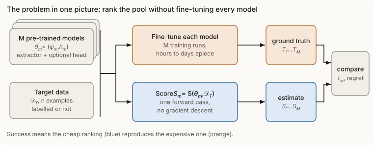
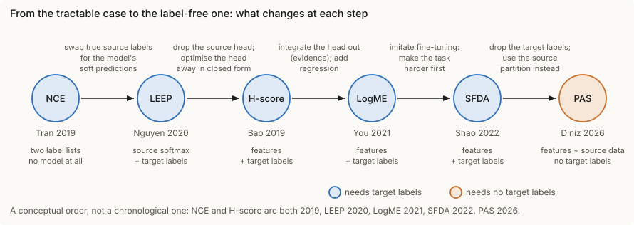
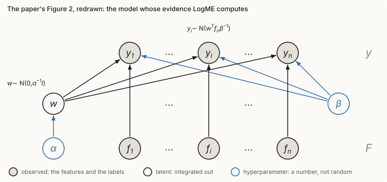
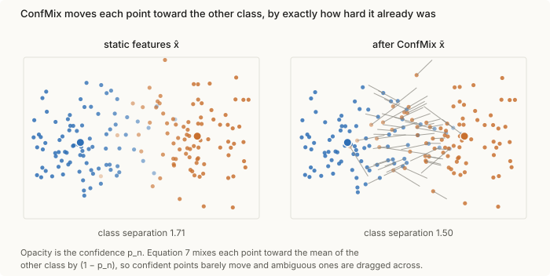
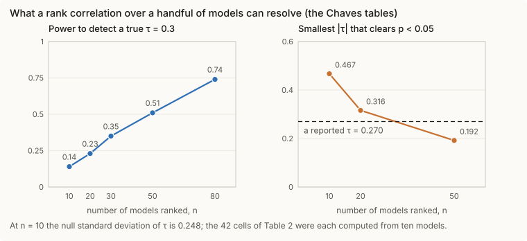
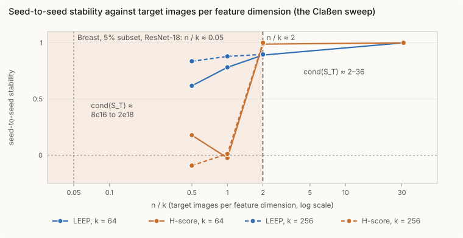

<!--
How to use this file.
It is a Marp deck: slides are separated by `---`, and HTML comments like this one are
presenter notes. Preview it in VS Code with the "Marp for VS Code" extension, or export it:
  npx @marp-team/marp-cli slides.md -o transferability-talk.html      (or .pdf / .pptx)
This folder is deliberately not part of the notes site: tools/build.py does not read
presentation/, and the Pages workflow ignores pushes that only touch it. Figures live in
figures/ and are rewritten by `python3 code/figures.py --figures`.
-->

<!-- _class: lead -->
<!-- _paginate: false -->
<!-- _footer: "" -->

# Transferability estimation

### Which pre-trained model should I fine-tune, and can I tell without fine-tuning them all?

The problem · six scores from NCE to PAS · two benchmarks · open problems

Built from the annotated notes in `theory_inclined_papers_with_annotations`. Every number comes from a note, and each slide names it.

---

## Contents

1. **The problem**
    - the pipeline and the problem in symbols, and how a score is judged
    - the variants: target labels available (A) or unavailable (B), and other axes
    - the progression we will follow
2. **The scores**
    - NCE → LEEP → H-score → LogME → SFDA → PAS, one slide each
    - side by side, and what none of them sees
3. **Gaps**
    - the benchmark papers: Chaves 2023 and Claßen 2026
    - why the scores fail there, and what the benchmarks leave open
4. **Open problems**
    - seven problems, and a summary table

---

<!-- _class: lead -->
<!-- _paginate: false -->

# 1 · The problem

---

## The practical question

A model zoo holds $M$ pre-trained models. You have one new target task with $n$ examples.

- **Gold standard:** fine-tune all $M$, evaluate, keep the best. Cost: $M$ training runs, each with its own hyper-parameter search
- **Transferability estimation:** compute a cheap score $S_m$ per model, from the frozen model and the target data, and take the top one

---

## The problem, in symbols

**Given**
- a pool $\theta_m=(\phi_m,h_m)$, $m=1,\dots,M$: feature extractor $\phi_m:\mathcal X\to\mathbb R^{D_m}$, optional head $h_m$ from a source task $\mathcal T^S_m$ (its data $\mathcal D^S_m$ may be unavailable)
- target data $\mathcal D^T$ of $n$ examples, and a test distribution $P^T$

**Ground truth** (expensive): $\;T_m=\operatorname{perf}\big(\operatorname{FT}(\theta_m;\mathcal D^T);\,P^T\big)$, the accuracy, balanced accuracy, AUROC or log-likelihood after fine-tuning (or after retraining only the head)

**Estimator** (cheap): $\;S_m=S(\theta_m;\mathcal D^T)$, one forward pass, no gradient descent

**Goal:** make $\tau_w\big((S_m)_m,(T_m)_m\big)$ high, or, for pure selection, make the regret $\max_mT_m-T_{\hat m}$ small, where $\hat m=\arg\max_mS_m$

---

## How a score is judged

- Kendall's $\tau=\dfrac{2}{M(M-1)}\sum_{i<j}\operatorname{sgn}(T_i-T_j)\operatorname{sgn}(S_i-S_j)$: pairs ordered the same way minus pairs ordered oppositely
- If the correlation is $\tau$, then $\Pr(T_i>T_j\mid S_i>S_j)=\tfrac{\tau+1}{2}$, so $\tau_w\approx0.5$ means about 75% of pairs ordered right (LogME paper)
- **Weighted** $\tau_w$ counts a pair more when $T_i,T_j,S_i,S_j$ are large, because you deploy the top-ranked model
- Also used: Spearman $\rho$, Pearson $r$, the regret of the top pick
- **Two caveats that return in Part 3:** the reference $T_m$ is itself random (fine-tuning seed, hyper-parameters, criterion), and with $M=10$ models the null standard deviation of $\tau$ is already 0.248

> Notes: [You 2021 — LogME](https://msrepo.github.io/theory_inclined_papers_with_annotations/2021-you-logme/) (the $\tau_w$ definition), [Chaves 2023](https://msrepo.github.io/theory_inclined_papers_with_annotations/2023-chaves-medical-transferability/) (the null).

---

## The quantity most scores are after

Freeze the representation $\phi$ and retrain only a head (NCE's definition of transferability):

$$\mathrm{Trf}(\phi\to\mathcal D^T)=\max_{k\in\mathcal K}\ \frac1n\sum_{i=1}^n\log k\big(\phi(x_i)\big)_{y_i}$$

Each score is a way to get at it without training $k$:

| score | how it gets at $\mathrm{Trf}$ |
|---|---|
| NCE | a lower bound, $l_Z-H(Y\mid Z)$, with $H$ counted from two label sequences |
| LEEP | one hand-built head, evaluated exactly: a lower bound |
| H-score | closed-form head, then a second-order approximation of the max |
| LogME | an average over all heads (the evidence) instead of the max |
| SFDA | an LDA head after making the task harder, to mimic fine-tuning |
| PAS | cannot use $y$; a nearest-class-mean margin from the source classes |

---

## Variant A: target labels are available

$$S=S\big(\theta;\ \{(x_i,y_i)\}_{i=1}^n\big)$$

What you may read from the **source** side sorts the scores:

| reads | notation | scores |
|---|---|---|
| ground-truth source labels on the same inputs | $S(Y,Z)$, no model | NCE |
| the source head's softmax | $\theta(x_i)\in\Delta(\mathcal Z)$ | LEEP |
| only the feature extractor | $\phi(x_i)\in\mathbb R^D$ | H-score, LogME, SFDA |

Chaves et al. call the first two *label-based* (later work feeds NCE the model's argmax labels, so both need a source head) and the third *feature-based*. Feature-based scores also cover contrastive and language-model sources, which have no head.

---

## Variant B: target labels are unavailable

Unsupervised domain adaptation: a labelled source, an unlabelled target.

$$S=S\big(\theta;\ \mathcal D^S,\ \{x_j\}_{j=1}^{n}\big)$$

- Every Variant A score needs the target partition $\{i:y_i=y\}$, which does not exist here
- **Substitute the source partition:** build a centroid $\mu_c$ per source class and ask how decisively each target point falls into one of them (PAS)
- What it costs: labelled source data, and a score of **decisiveness, not correctness**
- Asymmetric on purpose: easy→hard is not hard→easy, unlike MMD or Wasserstein distances between $\mathcal D^S$ and $\mathcal D^T$

---

## Other axes along which the problem changes

| axis | options | in the notes |
|---|---|---|
| target type | classification · regression | only LogME covers regression; SFDA concedes classification only |
| source pre-training | supervised head · contrastive · language model | label-based scores need a head; feature-based ones do not |
| transfer mode | frozen features + new head · full fine-tuning | H-score's guarantee needs linear fine-tuning layers; SFDA tries to imitate the dynamics |
| what is chosen | a source model · a target for a fixed source · an ensemble · training data | NCE's theorem licenses ranking *targets*; SFDA scores ensembles; the NTK-selector scores data |
| evaluation | in-distribution · out-of-distribution; accuracy · AUROC | Chaves adds OOD; Claßen varies the criterion |

---

## The progression we will follow

Each step changes what you must be given or what you estimate. The order is conceptual, not chronological.

---

<!-- _class: lead -->
<!-- _paginate: false -->

# 2 · The scores

---

## NCE (Tran 2019): the tractable case

Two tasks on the **same inputs**, with ground-truth label sequences $Z$ (source) and $Y$ (target). No model, no features, no input data: count the joint $\hat P(y,z)$ and compute

$$H(Y\mid Z)=-\sum_{y,z}\hat P(y,z)\log\hat P(y\mid z)$$

- **Reading:** how much about $Y$ is still missing once $Z$ is known. $Z$ determines $Y$: 0. $Z$ useless: $H(Y)$. A $k$-way split: $\log k$
- **Eight images** (counts 3, 1 / 1, 3): $H(Y\mid Z)=0.562$ nats against $H(Y)=0.693$, so knowing $z$ removes 0.131 nats
- **Theorem 1:** $\ \widetilde{\mathrm{Trf}}(T^Z\to T^Y)\ \ge\ l_Z(w_Z,h_Z)-H(Y\mid Z)$
- With a trivial source it estimates *hardness*: $\mathrm{Hard}(T^Z)\le H(Z)$

> Notes: [Tran 2019 — NCE](https://msrepo.github.io/theory_inclined_papers_with_annotations/2019-tran-nce-hardness/)

---

## LEEP (Nguyen 2020): use the model's softmax instead

Push target inputs through the frozen source classifier: $\theta(x_i)\in\Delta(\mathcal Z)$, a "dummy" label distribution.

$$\hat P(y,z)=\frac1n\sum_{i:\,y_i=y}\theta(x_i)_z,\qquad \hat P(y\mid z)=\frac{\hat P(y,z)}{\hat P(z)}$$

The **Expected Empirical Predictor** is a fixed linear map of the softmax, $p(\cdot\mid x)=\hat P^{\top}\theta(x)$, and

$$\mathrm{LEEP}=\frac1n\sum_{i=1}^n\log\sum_{z\in\mathcal Z}\hat P(y_i\mid z)\,\theta(x_i)_z$$

- Lower-bounds the best head's likelihood (Property 1, true by definition). Exact limits: an uninformative source scores $-\hat H(Y)$, a one-hot source scores exactly NCE
- Needs the source softmax and the target labels; **no** shared-input assumption

> Notes: [Nguyen 2020 — LEEP](https://msrepo.github.io/theory_inclined_papers_with_annotations/2020-nguyen-leep/)

---

## H-score (Bao 2019): solve the head, then eliminate it

Frozen features $f(x)\in\mathbb R^k$, a linear head, target labels. In the local regime ($P_{XY}$ near $P_XP_Y$), log-loss minimisation is a rank-$k$ approximation of the dependence matrix $\tilde B$ (Eq. 1).

- The head is least squares (Eq. 2). Substitute back and it is **Pythagoras**: loss $=\lVert\tilde B\rVert_F^2-{}$the part captured by the span of the features (Eq. 3)
- What is left to maximise needs no $\tilde B$ (Eq. 4):

$$\mathcal H(f)=\operatorname{tr}\Big(\operatorname{cov}\big(f(X)\big)^{-1}\operatorname{cov}\big(\mathbb E[f(X)\mid Y]\big)\Big)$$

- It is the Fisher discriminant ratio, $\sum_i\cos^2\theta_i$ over the principal angles between the feature span and the class indicators, invariant to invertible linear maps, $O(mk^2)$

> Notes: [Bao 2019 — H-score](https://msrepo.github.io/theory_inclined_papers_with_annotations/2019-bao-hscore-transferability/)

---

## LogME (You 2021): integrate the head out

A Bayesian linear model on frozen features $F\in\mathbb R^{n\times D}$. Score the **evidence**, not the likelihood at the best $w^*$:

$$p(y\mid F,\alpha,\beta)=\int p(w\mid\alpha)\,p(y\mid F,w,\beta)\,\mathrm dw$$

Closed form; $\alpha,\beta$ by a fixed point; $\mathrm{LogME}=\mathcal L(\alpha^*,\beta^*)/n$. Classification runs as one-hot regression.

> Notes: [You 2021 — LogME](https://msrepo.github.io/theory_inclined_papers_with_annotations/2021-you-logme/)

---

## SFDA (Shao 2022): imitate fine-tuning, not only the features

Fine-tuning separates classes and learns hard examples late, so a static score should imitate both.

- **Reg-FDA:** a regularised Fisher discriminant projects into $C-1$ dimensions, LDA classifies there, each sample gets a confidence $p_n$
- **ConfMix:** $\tilde x_n=p_n\hat x_n+(1-p_n)\,\mu_{c\neq y_n}$ moves each sample toward the other classes by its own difficulty. Re-run Reg-FDA; the score is the average log-likelihood of the second pass
- **Bonus:** every model lands in the same $C-1$ dimensions, so ensembles can be scored

> Notes: [Shao 2022 — SFDA](https://msrepo.github.io/theory_inclined_papers_with_annotations/2022-shao-sfda/)

---

## PAS (Diniz 2026): no target labels at all

Labelled source, unlabelled target. Unit-norm embeddings, source class centroids $\mu_c=\dfrac{\sum f_\theta(x^S_i)}{\lVert\sum f_\theta(x^S_i)\rVert}$, cosine distance $1-f_\theta(x)\cdot\mu_c$. With $d_{1},d_{2}$ the nearest and second-nearest centroid distances,

$$\mathrm{PAS}=\frac1{\lvert\mathcal D^T\rvert}\sum_j\frac{d_{2j}-d_{1j}}{d_{2j}}=1-\mathbb E\Big[\frac{d_{1}}{d_{2}}\Big]$$

- A Silhouette score with "own cluster" replaced by "nearest cluster": the **average relative margin** of a nearest-centroid classifier, the complement of Lowe's ratio test
- Asymmetric by design. Range $[0,1]$, and structure unrelated to the source scores 0.186, not 0

> Notes: [Diniz 2026 — PAS](https://msrepo.github.io/theory_inclined_papers_with_annotations/2026-diniz-pas/)

---

## The six scores side by side

| | reads | target labels | what it estimates | regression | main hazard |
|---|---|---|---|---|---|
| NCE | two label sequences | yes | a bound with two terms | no | source selection unlicensed; counting bias |
| LEEP | source softmax | yes | likelihood of one head | no | softmax bottleneck; calibration |
| H-score | features | yes | second-order best head | no | $\operatorname{cov}^{-1}$ when $n\lesssim k$ |
| LogME | features | yes | evidence of a linear model | **yes** | $D>n$; not invariant to linear maps |
| SFDA | features | yes | LDA after ConfMix | no | binary targets; the $\lambda$ rule |
| PAS | features + source data | **no** | nearest-centroid margin | no | confident but wrong; depends on $C$ |

---

## What all six share, and what none of them sees

- All six are **static** in Achille et al.'s sense: they score a fit of frozen features, a linear probe. None models the path of fine-tuning
- That paper splits the chance of reaching target weights from source weights into a **static** term (end-point losses) and a **reachability** term (do likely paths connect them?). Reachability is symmetric, so all the asymmetry sits in the static term
- LogME's evidence is that paper's task complexity $\min_QC_\beta$ restricted to a linear head; SFDA's ConfMix is the one heuristic aimed at dynamics
- **Untested suggestion:** reachability needs only the weights and the target data (the target loss, curvature and NTK around the released weights $w_0$), so a dynamics-aware score is possible in principle

> Notes: [Achille 2019 — task reachability](https://msrepo.github.io/theory_inclined_papers_with_annotations/2019-achille-task-reachability/), [Achille 2020 — task complexity](https://msrepo.github.io/theory_inclined_papers_with_annotations/2020-achille-task-complexity/)

---

<!-- _class: lead -->
<!-- _paginate: false -->

# 3 · Gaps

### Do these scores survive medical imaging?

---

## Chaves 2023: seven scores, ten models, three medical tasks

| | |
|---|---|
| scores | H-score, NCE, LEEP, $\mathcal N$-LEEP, LogME, Regularised H-score, GBC |
| models | 10 ImageNet-pretrained architectures; 2250 fine-tuned models, 75 configurations each |
| in-distribution | BrainTumor-Cheng, BreakHis, ISIC2019 |
| out-of-distribution | NINS, ICIAR2018, PAD-UFES-20 (the first OOD evaluation) |
| reference | balanced accuracy; Kendall's $\tau$ |

- **In-distribution:** unstable, and signs flip. LogME $+0.584,\ +0.378,\ -0.067$; H-score $+0.270,\ +0.600,\ -0.244$
- **Out-of-distribution:** the label-based scores do best (NCE 0.911 and 0.778, LEEP 0.778), probably because binary targets concentrate the source softmax and inflate them
- Domain shift alone and class count alone were tested and do not explain the failure

> Notes: [Chaves 2023 — medical TE](https://msrepo.github.io/theory_inclined_papers_with_annotations/2023-chaves-medical-transferability/)

---

## Chaves: what ten models can resolve

- At $n=10$ the null sd of $\tau$ is 0.248, so $\lvert\tau\rvert>0.467$ is needed for $p<0.05$
- Of the 42 cells in Table 2, 6 clear $p<0.05$ (about 2.1 expected by chance) and **3 survive Bonferroni**: all out-of-distribution, all label-based (NCE +0.911, +0.778; LEEP +0.778)
- The headline *negative* result is the underpowered one (14% power at a true $\tau=0.3$); the *positive* one is statistically solid, but may be an artefact of binary targets

---

## Claßen 2026: do rankings survive a change of seed?

| | |
|---|---|
| targets, sources | 8 MedMNIST 2D sets; the other MedMNIST sets plus ImageNet |
| model | ResNet-18 only |
| metrics | H-score, LEEP, $\mathcal N$LEEP, LogME, NCTI, PARC, SFDA |
| design | nested stratified subsets of 5–75%, 5 seeds; reference tuned for accuracy and for AUROC |

1. **Rankings move under nothing but the seed.** On Breast at 5% (about 27 images) LogME ranks Blood as both the best and the worst source
2. **The reference ranking moves too.** Accuracy against AUROC reorders almost every source; one goes from 2nd to 11th
3. **Agreement with the reference is low even at 100% of the data**

Also: $\mathcal N$LEEP and SFDA produce NaNs, and the three rank correlations differ by up to 0.227.

> Notes: [Claßen 2026 — TE robustness](https://msrepo.github.io/theory_inclined_papers_with_annotations/2026-classen-te-robustness/)

---

## Claßen: H-score breaks at $n\approx k$, a transition rather than a decay

- Above $n/k\approx2$ H-score is the *more* stable; below it the ranking is noise and then anti-correlates across seeds, and $\operatorname{cond}(S_T)$ jumps from about $10^1$ to $10^{17}$
- ResNet-18 has $k=512$ and Breast at 5% is about 27 images: $n/k\approx0.05$, far below the sweep
- A QR form or shrinkage would separate "estimator broken" from "data insufficient"; neither was tried

---

## Two methodological traps

| ranking | stability across seeds | $\tau$ against the truth |
|---|---|---|
| fixed, ignores its input | **1.000** | −0.030 |
| LEEP on the full target | — | 0.848 |
| H-score on the full target | — | 1.000 |

Stability is necessary, not sufficient: report it *and* agreement.

| ten sources, two rankings | $\tau$ | $\tau_w$ | $\rho$ |
|---|---|---|---|
| top right, tail scrambled | 0.556 | **0.804** | 0.758 |
| tail right, top scrambled | 0.556 | 0.307 | 0.758 |

Plain $\tau$ and $\rho$ call it a tie; the top-weighted $\tau_w$ prefers the ranking that gets the top right. Reporting one coefficient silently picks a verdict.

---

## Each score was validated in a regime that medical imaging leaves

| score | regime it was validated in | what breaks in the medical benchmarks |
|---|---|---|
| NCE | tasks labelled on the same inputs; *targets* ranked for a fixed source | used to select sources, where its two terms come apart |
| LEEP | general-purpose transfer with semantic overlap (ImageNet to CIFAR) | few shared classes or low-level statistics; binary targets inflate it |
| H-score | $n\gg k$ | $n/k$ down to about 0.05 |
| LogME | general-purpose transfer benchmarks | $D>n$ at a few hundred images ($0/0$); $+0.584\to-0.067$ across tasks |
| SFDA | 11 targets, 11 supervised CNNs | a binary target leaves one Fisher direction (the likely cause of ties and NaNs) |
| PAS | four unsupervised domain-adaptation benchmarks | not yet benchmarked in medical imaging |

The scores are not failing at random. They are being used outside what their derivations covered.

---

## What the two benchmarks leave open

- **Resolution:** ten architectures and one seed (Chaves); one architecture and five seeds (Claßen)
- **No noise ceiling:** "agreement is low" is never compared with how well two fine-tuning runs of the same source agree
- **Method confounded with implementation:** H-score is run as a reference implementation; shrinkage (Ibrahim et al.) and a QR form are not applied
- **Undiagnosed:** the in-distribution instability (shift and class count are ruled out, no third cause is proposed)
- **Possible artefact:** the OOD success sits on binary or near-binary targets
- **Metric mismatch:** scores were designed against accuracy and are judged by balanced accuracy or AUROC
- **Scope:** label-free and dynamics-aware scores are untested

---

<!-- _class: lead -->
<!-- _paginate: false -->

# 4 · Open problems

Each problem names its evidence in the notes. Items marked *suggested* are extensions the notes do not contain.

---

## 1 · An evaluation you can trust

- The reference is a random variable: $T_m(\omega,c)$ depends on the fine-tuning run $\omega$ and the criterion $c$
- **A noise ceiling** (suggested): $\;\tau^\star(c)=\mathbb E_{\omega,\omega'}\,\tau\big(T(\omega,c),\,T(\omega',c)\big)$, how well two runs on the *same* sources agree. Without it "agreement is low" has no scale
- **Resolution:** at $M=10$ the null sd is 0.248 and power at a true $\tau=0.3$ is 14%; about 80 models are needed for 74%
- **Progress looks like:** benchmarks that report score $\pm$ seed noise against $\tau^\star$, per criterion, with intervals

---

## 2 · Small targets, $n\lesssim k$

- The smallest medical subsets have $n/k\approx0.05$. H-score collapses at $n/k\approx2$; LEEP's $\hat P(y\mid z)$ turns sparse when the label set is large relative to $n$; SFDA's $S_W$ is rank-deficient when the dimension exceeds the samples per class; LogME's fixed point is $0/0$ at $D>n$
- **Open:** which estimators keep a *consistent ranking* as $n/k\to0$? How many target examples separate two models whose true gap is $\delta$, a sample complexity for ranking (*suggested*)?
- **A prediction in the LogME notes, not tested directly:** LogME's learned ridge $\alpha$ should degrade more gracefully than H-score; shrinkage (Ibrahim et al.) and a QR form were never applied in a benchmark

---

## 3 · Scores that see fine-tuning

- The six static scores are linear probes; none measures reachability
- **Open:** a score from the released weights $w_0$ and the target data alone: target gradient and curvature at $w_0$, the NTK, barrier heights (Achille's suggestion, untested; the NTK-selector already uses gradient alignment to choose *data*)
- SFDA's ConfMix runs once. If the fine-tuning analogy is taken seriously, a *schedule* is the natural object
- **Progress looks like:** a score that beats frozen-feature scores exactly on the pairs where the linear-probe and fine-tuned rankings disagree

---

## 4 · Label-free and label-light

- PAS cannot represent misassignment ($d_1\le d_2$), its null is 0.186, it depends on $C$, it has no max-softmax or entropy baseline, and it was not tested under reseeding
- **Open (a):** a label-free score with a calibrated null that can say "wrong cluster", for example by using the target's own cluster structure, which PAS never uses
- **Open (b):** how many target labels before a supervised score beats PAS, and can $\mathrm{PAS}-\mathrm{Oracle}$ on a handful of labels serve as a misassignment diagnostic?
- **Open (c):** fair label-free baselines

---

## 5 · Which invariances should a score have?

- H-score is invariant to invertible linear maps but ill-conditioned; LogME's isotropic prior is not invariant
- LEEP reads calibration (a swing of about half a nat from temperature alone); raw NCE and LEEP values sit on a floor $-H(Y)$ and do not compare across targets
- Binary targets inflate label-based scores; NCE's correlation is partly the target's base rate ($H(Y)$ alone gives 0.62 against 0.63)
- **Open:** scores normalised to compare across tasks, with their invariances stated (calibration, feature reparametrisation, base rate), and still well-conditioned at small $n$

---

## 6 · The sign and the sample size of transfer

- Tahir et al., in a solvable model: the gain from transfer changes sign with $n$ (positive for few samples, negative for many, positive again in a thin band at $n/d=1$), and fine-tuning beats scratch exactly when the angle between source and target directions is below $60^\circ$
- Claßen et al.: the ranking itself moves with the subset size
- All six scores return a ranking at **one** $n$
- **Open:** transferability *curves* $S(\theta,\mathcal D^T,n)$, and a score measured against the from-scratch baseline: will transfer help at all?

---

## 7 · Scope and guarantees

- **Scope:** regression targets (only LogME covers them), scoring *sets* of models (SFDA's ensemble score is barely evaluated), choosing data (the NTK-selector), out-of-distribution targets
- **Guarantees:** NCE needs $\bar k\in\mathcal K$ and a fixed source; LEEP's Property 1 is definitional and Property 2's proof is absent from the conference PDF; H-score's meaning is binary and linear; LogME has no convergence guarantee. **None bounds $\lvert S_m-T_m\rvert$**
- **Open:** conditions under which a score *preserves rank*, and a tightness result tying $S$ to $T$

---

## Open problems at a glance

| problem | evidence in the notes | progress looks like |
|---|---|---|
| noise ceiling and power | reference moves; $M=10$ gives 14% power | scores reported against $\tau^\star$ with intervals |
| small $n$ | $n/k\approx0.05$; H-score collapse at $n/k\approx2$ | a ranking-consistency result for $n/k\to0$ |
| see fine-tuning | six static scores; reachability untested | a score from $(w_0,\mathcal D^T)$ that wins where probe and fine-tune disagree |
| label-free, label-light | PAS: confident but wrong; null 0.186 | a calibrated label-free score; labels-versus-PAS crossover |
| invariances | calibration, base rate, conditioning | normalised, comparable, well-conditioned scores |
| sign and $n$ | transfer flips sign with $n$ | transferability curves against scratch |
| scope, guarantees | classification, one $n$, no $\lvert S-T\rvert$ bound | rank-preservation conditions |

---

## Sources

Notes (rendered): `msrepo.github.io/theory_inclined_papers_with_annotations/` followed by

`2019-tran-nce-hardness` · `2020-nguyen-leep` · `2019-bao-hscore-transferability` · `2021-you-logme` · `2022-shao-sfda` · `2026-diniz-pas` · `2023-chaves-medical-transferability` · `2026-classen-te-robustness`

and for the lens and the open problems: `2019-achille-task-reachability` · `2020-achille-task-complexity` · `2025-tahir-features-are-fate` · `2026-wang-ntk-selector`

Papers: Tran, Nguyen & Hassner, ICCV 2019, arXiv:1908.08142 · Nguyen et al., ICML 2020, arXiv:2002.12462 · Bao et al., ICIP 2019, arXiv:2212.10082 · You et al., ICML 2021, arXiv:2102.11005 · Shao et al., ECCV 2022, arXiv:2207.03036 · Diniz et al., ICLR 2026, arXiv:2604.09863 · Chaves et al., arXiv:2308.07444 · Claßen et al., arXiv:2608.09999
