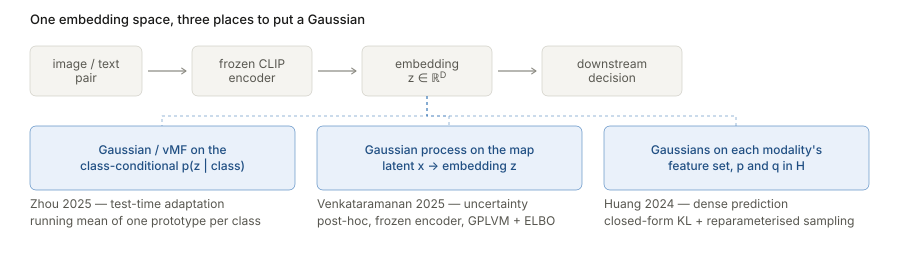

## Why this page exists

[Betser et al. 2026](../2026-betser-infonce-gaussian/index.html) argues that the InfoNCE
objective *induces* approximately Gaussian structure in contrastive representations. That is
a theoretical claim, and the natural question is whether it matters. It does, and in a
specific way: **a growing body of applied work already assumes CLIP-like representations are
approximately Gaussian, usually without saying so, and builds working methods on top of that
assumption.** The theory is a retrospective licence for methods that were already shipping.

That framing is worth taking seriously because it inverts the usual relationship. These
papers did not read a theorem and derive a method. They tried a Gaussian, it calibrated well,
and they published. Betser et al. explain *why* the trick works — and, more usefully, when it
should be expected to stop working.

The starting point for this page is the authors' own survey of that literature, given in their
ICLR 2026 rebuttal: Betser, Gofer, Levi & Gilboa, *Response (1)*, OpenReview note
[`zB9oh3CoAg`](https://openreview.net/forum?id=BlSH7gNQSq&noteId=zB9oh3CoAg) on the
[submission forum](https://openreview.net/forum?id=BlSH7gNQSq). Their paragraph there groups
the applied work into five families and supplies the references numbered below. This page keeps
their taxonomy and adds close reads of three of the papers.

## The landscape

Five clusters of applied work, each leaning on approximate Gaussianity of the embedding space.
Bracketed numbers are the reference numbering from the rebuttal note, listed in full under
*Sources*.

| Area | What is modelled as Gaussian | Examples |
|---|---|---|
| Uncertainty and Bayesian modelling | Laplace posteriors over CLIP heads; Gaussian variational parameters in adapters | Baumann et al. 2024 **[2]**; Morales-Álvarez et al. **[3]** |
| Probabilistic embeddings and prompt learning | CLIP features or prompts as Gaussians in latent space | Venkataramanan et al. 2025 **[4]**; Lu et al. 2022 **[5]** |
| Classification and class-incremental learning | per-class features as Gaussian, for replay, generative classifiers, prototype rules | Z. Huang et al. 2024 **[6]** |
| Test-time adaptation and calibration | Gaussian priors over class prototypes or feature clusters | Zhou et al. 2025 **[7]** |
| Segmentation, detection, dense prediction | modality- or prompt-specific embeddings as Gaussian latent variables | C. Huang et al. 2024 **[8]**; Jia et al. 2025 **[9]** |

Two adjacent results are worth naming because they close the loop in the other direction.
[Eftekhari & Papyan](../2025-eftekhari-normality-normalization/index.html) **[1]** show that *deliberately* Gaussianizing representations improves
downstream performance — so Gaussianity is not merely a convenient fiction but correlated with
quality. And Betser et al.'s *Whitened CLIP as a Likelihood Surrogate* **[10]** uses the
assumption directly: whiten CLIP features and the Gaussian density becomes a usable likelihood
for images and captions.

### Why a Gaussian is the assumption people reach for

Not aesthetics. Four concrete affordances, and every method below uses at least two:

1. **Closed-form divergences.** KL between two Gaussians, and the 2-Wasserstein distance, both
   have elementary formulas. No sampling, no estimator variance, differentiable.
2. **Sufficiency of low-order statistics.** A Gaussian is fully described by a mean and a
   covariance, so "summarise this class" becomes "store two things", and an online update
   becomes a running average.
3. **Closed-form entropy and likelihood**, which is what makes density-based OOD scoring,
   calibration and likelihood surrogates possible at all.
4. **Reparameterisation.** $z = \mu + \omega\sigma$ with $\omega\sim\mathcal{N}(0,I)$ makes
   sampling differentiable — the VAE trick, and the only reason a sampled fused feature can sit
   inside a segmentation network.

Each of these is a *consequence* of Gaussianity, so each is a place where the assumption being
wrong would silently degrade the method rather than announce itself.

### Where each method puts its Gaussian

The three papers below are usually filed under different topics — test-time adaptation,
uncertainty quantification, medical segmentation — which obscures that they are doing versions
of the same thing at different points in one pipeline.

<figure>

<figcaption>All three take the CLIP embedding space as given and put a Gaussian somewhere near
it — but at different points, which is what determines what each method can do. Zhou models
<b>p(z | class)</b> and gets an online prototype update. Venkataramanan models the
<b>generative map</b> into embedding space and gets a predictive covariance, hence calibrated
uncertainty. Huang models <b>each modality's feature distribution</b> and gets a divergence to
minimise between them.</figcaption>
</figure>

## Zhou et al. 2025 — Bayesian Class Adaptation (CVPR) [7]

**The observation.** CLIP zero-shot classification is usually written as a softmax over cosine
similarities. Zhou et al. re-derive it from Bayes' theorem with $M$ class embeddings
$\{\mu_m\}$:

$$
P(Y \mid x_i) = \sum_{m=1}^{M} P(\mu_m \mid x_i)\, P(Y \mid \mu_m),
\qquad
P(\mu_m \mid x_i) = \frac{P(x_i\mid\mu_m)P(\mu_m)}{\sum_j P(x_i\mid\mu_j)P(\mu_j)} .
$$

Two factors govern the prediction: the **likelihood** $P(x\mid\mu)$ and the **prior**
$P(Y\mid\mu)$. Every existing CLIP test-time adaptation method — TPT, DiffTPT, TDA, DOTA —
adapts only the likelihood, by moving class embeddings, and leaves the prior at the one-hot
value inherited from pre-trained CLIP. Their worked example is good: a patient with a fever is
"common cold" under a fixed prior regardless of whether there is a pandemic on. Recovering the
standard softmax from their Eq. 4 requires exactly the one-hot prior, which makes the omission
visible rather than arguable.

**The method.** Adapt both, online, without backpropagation. When image $x_i$ arrives: compute
its visual embedding; find the most probable class embedding $\mu_s$; if
$P(\mu_s\mid x_i) > \tau$, update $\mu_s$ by a running mean with the new embedding, and update
that class's prior $P(Y\mid\mu_s)$ by a running mean with the freshly computed posterior. Two
counters, two averages, one vector per class. No gradients, constant memory per class.

**Where Gaussianity enters.** They take
$P(x_i \mid \mu_m) \propto \exp(\cos(f^v_i, \mu_m))$ — a von Mises–Fisher density on the unit
sphere — and note explicitly that DOTA instead uses the full Gaussian
$\mathcal{N}(x\mid\mu_m,\Sigma_m)$, in which case one would update $\Sigma_m$ as well. The
connection to the theory is direct: **an isotropic Gaussian conditioned to the unit sphere
*is* a von Mises–Fisher distribution.** So the likelihood used here is precisely the spherical
shadow of the Gaussian that Betser et al. derive, and the choice between vMF and full Gaussian
is the choice between working with normalised or unnormalised features.

The load-bearing consequence is affordance 2 above. A running mean is a principled posterior
update **only** if the class-conditional is an exponential family whose sufficient statistic is
the sample mean — a Gaussian with fixed covariance, or a vMF with fixed concentration. If
per-class CLIP features were multi-modal or heavy-tailed, one prototype per class would be the
wrong summary and averaging would drag it into a low-density region between modes. The paper's
headline selling points — high inference rate, low memory — are not engineering wins that
happen to coexist with the Gaussian assumption; they are *purchased* by it. Drop Gaussianity
and you are back to storing a cache of embeddings, which is what TDA does.

## Venkataramanan et al. 2025 — GroVE (UAI) [4]

**The problem.** A frozen VLM gives one point per input, but the image–text relationship is
genuinely one-to-many: an image matches many captions and vice versa. Deterministic embeddings
cannot express that. Prior probabilistic-embedding work (PCME, PFE, ProbVLM) trains the
distributional structure in, which needs large datasets and discards the representations
large-scale pre-training already produced.

**The method.** GroVE is **post-hoc** on a frozen encoder. Assume each image–text pair's
embeddings $z_{I_n}, z_{T_n} \in \mathbb{R}^D$ are generated from a *shared* low-dimensional
latent $x_n \in \mathbb{R}^Q$, $Q \ll D$, by two Gaussian-process mappings:

$$
z_{I_n} = G_I(x_n) + \epsilon_I, \qquad z_{T_n} = G_T(x_n) + \epsilon_T,
$$

with a GP prior per output dimension, $g^d \sim \mathcal{N}(m(X), k(X,X))$, an RBF kernel, and
Gaussian noise $\mathcal{N}(g^d, \sigma^2 I)$. Exact inference is $O(N^3)$, so they use a
sparse GP with $M$ inducing points and a Gaussian variational posterior
$q(u^d) = \mathcal{N}(u^d\mid\mu^d, S^d)$, trained by maximising the ELBO. A second term aligns
the modalities with a symmetric KL between the predicted image and text Gaussians
$\mathcal{N}(\hat\mu_I,\hat\Sigma_I)$ and $\mathcal{N}(\hat\mu_T,\hat\Sigma_T)$. At inference,
a new embedding $z^*$ has its latent $x^*$ recovered by optimising the ELBO, then pushed
through the GP to a predictive Gaussian; the uncertainty score is the mean of $\hat\Sigma^*$'s
diagonal. Retrieval ranks by Wasserstein distance rather than cosine similarity.

**Where Gaussianity enters.** Everywhere, and more deeply than in the other two. A Gaussian
process *is* a Gaussian assumption on function values, so positing GPs for the map
latent $\to$ CLIP-embedding asserts that embedding coordinates are jointly Gaussian given the
latent. The noise model is Gaussian, the variational posterior is Gaussian, the predictive
distribution is Gaussian, the alignment loss is a Gaussian–Gaussian KL in closed form, and the
retrieval metric is a Gaussian Wasserstein distance. Remove the assumption and there is no
method left — every one of the four affordances is in use simultaneously.

This makes GroVE the most interesting of the three as *evidence*. The paper's headline metric
is uncertainty **calibration**, which is precisely the quantity that degrades when a
distributional assumption misfits: a Gaussian noise model over non-Gaussian features would
produce confidently wrong variances. They report state-of-the-art calibration across
cross-modal retrieval, VQA and active learning on frozen CLIP and BLIP. That is indirect but
real empirical support for approximate Gaussianity of the embedding space — arrived at
independently of any theory, which is what makes it worth citing in that direction.

## C. Huang et al. 2024 — Multimodal Representation Distribution Learning (IJCAI) [8]

**The problem.** Medical image segmentation is starved of pixel-level labels, so text
annotations are used as a cheaper auxiliary signal. But the standard fusions are crude:
element-wise addition merges the two feature distributions and keeps everything, including the
redundant overlap, while plain contrastive alignment pulls them together without separating
what is shared from what is modality-specific.

**The method.** Introduce $K$ learnable features $F_L$, initialised near the text prompt
feature and perturbed with $0.1\cdot\mathcal{N}(0,I)$ so they do not collapse to one vector.
Then model the text and vision feature distributions in the joint space $H$ as Gaussians,
$p \sim \mathcal{N}(\mu_p,\sigma_p^2)$ and $q \sim \mathcal{N}(\mu_q,\sigma_q^2)$, with
parameters estimated from $\{F_T\}\cup F_L$ and $\{F_V\}\cup F_L$ respectively. Minimising the
closed-form Gaussian KL

$$
\mathcal{L}_{\mathrm{KL}} = \log\frac{\sigma_q}{\sigma_p} + \frac{1}{2\sigma_p^2}\big(\sigma_p^2 + (\mu_p-\mu_q)^2\big) - \frac{1}{2}
$$

drives the learnable features to capture what the modalities share, leaving the residual as
modality-specific. The fused feature is then **sampled** from a learnable Gaussian
$r = \mathcal{N}(\mu_r,\sigma_r)$ via the reparameterisation trick $F = \mu_r + \omega\sigma_r$,
so it stays differentiable. A separate frequency prompt encoder takes the FFT phase spectrum —
which carries edge and structural information — to supply boundary detail. Training combines
Dice, cross-entropy and the KL term.

**Where Gaussianity enters.** Here it is stated outright as an assumption — *"we assume $p$,
$q$ follow Gaussian distributions"* — and then everything downstream is a Gaussian formula.
This is the clearest instance of the pattern: the assumption is not argued for, it is *used*,
and it buys exactly affordances 1 and 4. The KL expression above is only the divergence between
the actual feature distributions if those distributions are in fact Gaussian; otherwise it is
a well-defined but differently-meaning penalty on two moments. Likewise the symmetry-breaking
noise injection and the sampling of $F$ from $r$ both presume that a feature's neighbourhood in
the joint space is well modelled as a Gaussian ball.

Of the three this is the most casual about the assumption and the most instructive about why
the theory is worth having. The method works; the paper offers no account of why a Gaussian is
the right object; Betser et al. supply one.

## What the theory adds, and where it stops

**What it adds.** A population-level reason to expect approximate Gaussianity, rather than
treating it as a fortunate empirical accident. Concretely: a prediction that the approximation
*improves with embedding dimension* (the Diaconis–Freedman rate is $O(1/d)$, so $d = 512$ is
comfortable and $d = 32$ is not), and a prediction that it depends on the *training objective*
being contrastive — so the same trick should transfer to SimCLR, MoCo and CLIP, and should be
questioned for supervised or reconstruction-trained encoders.

**Where it stops, and this matters for all three papers above.** Betser et al.'s result is
about **fixed low-dimensional projections** of the representation, and about the **marginal**
distribution. Neither is quite what these methods need:

- Zhou et al. need *class-conditional* Gaussianity. Betser et al. explicitly disclaim any
  statement about class structure, and note that well-separated class clusters can coexist with
  an approximately Gaussian marginal. A Gaussian marginal that is a mixture of well-separated
  Gaussians is still Gaussian-ish in projection while making a single global prototype per class
  the right object only if each component is itself unimodal. The theory is consistent with what
  they need but does not establish it.
- Venkataramanan et al. need joint Gaussianity of *many* coordinates at once, not of a fixed
  $k$-dimensional projection with $k$ small. The spherical CLT's error grows with $k$
  ($d_{\mathrm{TV}} \le 2(k+3)/(d-k-3)$), so the guarantee weakens exactly in the regime a GP
  over all $D$ output dimensions occupies.
- C. Huang et al. apply the assumption to features from a *medical* segmentation encoder trained
  with Dice and cross-entropy alongside the KL term — not a purely contrastive objective, and
  not on natural images. Whether the induced-Gaussianity argument transfers is an open question,
  not a corollary.

So the honest reading is: the theory explains the *phenomenon* these methods exploit and
predicts when it should hold, but each application needs a slightly stronger or differently
shaped version of the statement than has been proved. That gap is the interesting place to work.

## Questions and doubts

- **The evidence is largely indirect.** None of these three papers tests Gaussianity of the
  features they assume Gaussian. Calibration results (GroVE) are suggestive, but a normality
  diagnostic on the actual embeddings would be a cheap and convincing addition.
- **C. Huang et al.'s variance estimator looks wrong as written.** Their Eq. 6 defines
  $\sigma_p = \frac{1}{K+1}\big(F_T + \sum_i F^i_L - \mu_p\big)^\top\big(F_T + \sum_i F^i_L - \mu_p\big)$.
  But Eq. 5 sets $\mu_p = \frac{1}{K+1}(F_T + \sum_i F^i_L)$, so the bracket equals
  $K\mu_p$ and the whole expression reduces to $\frac{K^2}{K+1}\lVert\mu_p\rVert^2$ — a scaled
  squared norm of the mean, carrying no dispersion information at all. Almost certainly a typo
  for a sum of per-sample squared deviations. Worth checking against the released code before
  building on it, since the KL term depends on $\sigma$.
- **Scalar versus full covariance is muddled in the same paper.** Eq. 6 is written as an inner
  product (a scalar) but called a covariance, and the KL of Eq. 10 is the scalar-variance
  formula. Whether the intended model is isotropic or full-covariance is not resolved in the
  text.
- **Zhou et al.'s prior update has no convergence guarantee.** The prior and likelihood are
  updated from each other's outputs — the posterior updates the prior, which changes the next
  posterior. That is a feedback loop, and nothing rules out drift or self-reinforcement of an
  early mistake. The threshold $\tau$ presumably guards against this but is not analysed.
- **Post-hoc methods inherit whatever the frozen encoder did.** GroVE's calibration is
  evaluated on CLIP and BLIP. If the Gaussian structure is objective-induced, results should
  differ measurably for an encoder trained non-contrastively — an easy and informative ablation
  that nobody in this literature seems to have run.

## Takeaways

- The applied literature reached "model CLIP features as Gaussian" empirically and
  independently, across at least five task families. That convergence is itself the strongest
  evidence that something real is being exploited.
- The assumption is load-bearing in a specific, checkable way: it buys closed-form divergences,
  sufficiency of mean and covariance, closed-form likelihood, and reparameterised sampling.
  Naming which affordance a method uses tells you what breaks if the assumption fails.
- The three papers here differ mainly in *where* they place the Gaussian — on the
  class-conditional, on the generative map into embedding space, or on each modality's feature
  set — and that placement determines what the method can deliver.
- The theory and the applications do not yet meet cleanly. Marginal, low-dimensional-projection
  Gaussianity is what is proved; class-conditional and high-dimensional joint Gaussianity is
  what is used.

## Sources

The reference list as given in the authors' rebuttal note
[`zB9oh3CoAg`](https://openreview.net/forum?id=BlSH7gNQSq&noteId=zB9oh3CoAg), preserving its
numbering. The three marked ▸ are read in detail above.

1. D. Eftekhari and V. Papyan. *On the Importance of Gaussianizing Representations.* ICML 2025. Annotated [here](../2025-eftekhari-normality-normalization/index.html).
2. Anton Baumann et al. *Post-hoc Probabilistic Vision–Language Models.* arXiv:2412.06014, 2024.
3. Pablo Morales-Álvarez et al. *BayesAdapter: enhanced uncertainty estimation in CLIP few-shot
   adaptation.* arXiv:2412.09718.
4. ▸ Aishwarya Venkataramanan et al. *Probabilistic Embeddings for Frozen Vision-Language
   Models: Uncertainty Quantification with Gaussian Process Latent Variable Models.* UAI 2025.
   [arXiv:2505.05163](https://arxiv.org/abs/2505.05163)
5. Yuning Lu et al. *Prompt Distribution Learning.* CVPR 2022.
6. Zitong Huang et al. *Learning Prompt with Distribution-Based Feature Replay for Few-Shot
   Class-Incremental Learning.* arXiv:2401.01598.
7. ▸ L. Zhou et al. *Bayesian Test-Time Adaptation for Vision-Language Models.* CVPR 2025.
   [arXiv:2503.09248](https://arxiv.org/abs/2503.09248)
8. ▸ C. Huang et al. *Multimodal Representation Distribution Learning for Medical Image
   Segmentation.* IJCAI 2024.
9. M. Jia et al. *Orchestrating the Symphony of Prompt Distribution Learning for Human-Object
   Interaction Detection.* AAAI 2025.
10. R. Betser et al. *Whitened CLIP as a Likelihood Surrogate of Images and Captions.* ICML 2025.

The paper this page hangs off is annotated separately:
[InfoNCE Induces Gaussian Distribution](../2026-betser-infonce-gaussian/index.html).
